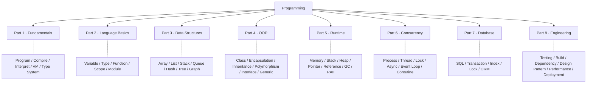

<div align="center">

# Programming Languages Mastery

**Master the Concepts, Not the Syntax**

*Understanding programming through comparison, first principles, and engineering practice.*

---

`Status: v0.5 · Parts 1–4 complete` &nbsp;•&nbsp; `Languages: JavaScript / Python / Java / C++ / C# / SQL` &nbsp;•&nbsp; `License: MIT`

> **Learn Concepts · Compare Languages · Understand Principles · Build Systems**

---

[简体中文](./README.md) ｜ **English**

</div>

---

## 📑 Table of Contents

- [🎯 Vision](#-vision)
- [❓ Why This Book](#-why-this-book)
- [🧠 Learning Philosophy](#-learning-philosophy)
- [👥 Who Should Read](#-who-should-read)
- [🎁 What You Will Learn](#-what-you-will-learn)
- [🗺️ Knowledge Map](#-knowledge-map)
- [📚 Book Structure](#-book-structure)
- [📝 Chapter Template](#-chapter-template)
- [🔬 Comparison Methodology](#-comparison-methodology)
- [🧭 How to Read](#-how-to-read)
- [🚀 Learning Paths](#-learning-paths)
- [💻 Example Projects](#-example-projects)
- [🌐 Languages Covered](#-languages-covered)
- [📁 Repository Structure](#-repository-structure)
- [📈 Project Status](#-project-status)
- [🏷️ Version Roadmap](#-version-roadmap)
- [🤝 Contributing](#-contributing)
- [📄 License](#-license)
- [❤️ Acknowledgements](#-acknowledgements)
- [🌱 Closing](#-closing)

---

## 🎯 Vision

The world has no shortage of Python, Java, or C++ tutorials. What is genuinely rare is a book that ties them together into a single whole.

When you learn five languages separately, what you usually end up with is five disconnected sets of syntax memories. Seasoned engineers see something else entirely: variables, functions, objects, memory, concurrency — **the same set of concepts, projected differently into different languages**. They can pick up a new language in a few days, because what they learned was never the syntax, but the unchanging ideas behind it.

**This book teaches those ideas themselves. Languages are merely their dialects.**

Our goal is not to "teach you five languages," but to help you build **a system of programming knowledge that can accompany your entire career and let you absorb any new language quickly**. Five or ten years from now, language popularity will shift and frameworks will be replaced — but why variables exist, what problem GC solves, where the essential difficulty of concurrency lies: these will not change.

> Learn Once, Understand Forever.

---

## ❓ Why This Book

Traditional tutorials are organized by **language**. You get a "Python tutorial" and a "Java tutorial," each going from "variables" to "classes," with no connection between them:

```text
Python                      Java
├── Variables               ├── Variables
├── Functions               ├── Functions
└── Classes                 └── Classes
```

The problem: **you learn a particular language, not programming itself.** Switch languages, and you start almost from scratch.

This book flips it around and organizes by **concept**. Every concept is unfolded and compared across six languages at once:

```text
Variable                         Function
├── JavaScript                   ├── JavaScript
├── Python                       ├── Python
├── Java                         ├── Java
├── C++                          ├── C++
├── C#                           ├── C#
└── (SQL where relevant)         └── (SQL where relevant)
```

So what you learn is the **concept**; a language is just one of its implementations. Once you understand the different fates of a "variable" — on the stack, on the heap, under reference counting, in the JVM's local variable table — you understand five languages at once, and you are ready for the sixth.

---

## 🧠 Learning Philosophy

The whole book follows one learning loop:

```text
Understand  →  Compare  →  Analyze  →  Build
```

First **understand** why a concept exists, then **compare** each language's trade-offs, then **analyze** the underlying implementation and performance differences, and finally **build** something real in engineering. Four supporting principles:

**1. Concept First**
Answer "why do we need it" before "how to use it." We don't open with `let a = 1`; we first ask: why does a computer need variables? Why not just use memory addresses?

**2. Compare Languages**
Every shared concept is compared across JavaScript, Python, Java, C++, and C# simultaneously, with SQL added in relevant chapters. Comparison goes beyond listing syntax — it explains the **commonalities, differences, reasons, and applicable scenarios**.

**3. First Principles**
Explain from the bottom up: `CPU → Memory → Runtime → Language`. We reach real mechanisms — Stack, Heap, Pointer, Reference, GC, Event Loop, JVM, CLR, CPython, V8 — instead of stopping at the API.

**4. Engineering Oriented**
Every chapter lands in a real project: best practices, common pitfalls, performance, testing, runnable examples. You gain usable skills, not Hello World.

---

## 👥 Who Should Read

- Developers with a foundation in one language who want to systematically build cross-language knowledge
- Front-end / back-end / full-stack engineers who want to deeply understand language internals and runtimes
- Engineers in AI, gaming, security, and other fields who need to switch fluently between languages
- People about to learn a second or third language who don't want to start from zero each time
- Anyone who wants to "understand programming itself" rather than "memorize a language's syntax"

> We assume you are familiar with at least one language (even just basic JavaScript). This book is not aimed at absolute beginners, but every concept starts from "why," so those with a weaker foundation can still follow along.

---

## 🎁 What You Will Learn

By the end of this book, you should be able to:

- Understand the **shared programming ideas** behind different languages, and see through the syntax to the essence
- **Learn any new language quickly** (Go, Rust, Kotlin, Swift…), because you learn concepts, not syntax
- Understand **underlying principles** such as compilers, interpreters, virtual machines, Runtime, GC, and type systems
- Articulate **design trade-offs** like "why Python and Java variables behave differently" or "why C++ requires manual memory management"
- Write **standards-compliant, maintainable** code across six languages
- Build a **complete knowledge map** spanning data, logic, objects, memory, concurrency, databases, and engineering

---

## 🗺️ Knowledge Map

The book unfolds around eight knowledge domains. Every chapter can locate itself on this map — the reader never gets lost.



---

## 📚 Book Structure

The book has **8 Parts and 59 chapters (numbered 01–59)**. Read Part by Part; each chapter stands on its own and can be consulted independently.

| Part | Theme | Chapters | Core Question |
|------|-------|:--------:|---------------|
| **Part 1** | Programming Fundamentals | 01–07 | What are programs, languages, compile/interpret, Runtime, type systems |
| **Part 2** | Language Basics | 08–15 | Variables, types, functions, scope, modules |
| **Part 3** | Data Structures | 16–22 | Array, list, stack, queue, hash, tree, graph |
| **Part 4** | Object-Oriented | 23–30 | Class, encapsulation, inheritance, polymorphism, interface, generic, reflection |
| **Part 5** | Runtime | 31–38 | Memory, stack/heap, pointer, reference, GC, RAII, smart pointer |
| **Part 6** | Concurrency | 39–45 | Process, thread, lock, async, event loop, coroutine, thread pool |
| **Part 7** | Database | 46–51 | Database, SQL, transaction, index, lock, ORM |
| **Part 8** | Engineering | 52–59 | Testing, package manager, build, dependency injection, design pattern, performance, security, deployment |

<details>
<summary><b>📖 Expand the full chapter list (59 chapters)</b></summary>

**Part 1 · Programming Fundamentals**
```
01  Programming History
02  What is a Program
03  Compiler
04  Interpreter
05  Virtual Machine
06  Runtime
07  Type System
```

**Part 2 · Language Basics**
```
08  Variables
09  Data Types
10  Operators
11  Control Flow
12  Functions
13  Scope
14  Modules
15  Packages
```

**Part 3 · Data Structures**
```
16  Array
17  List
18  Stack
19  Queue
20  Hash
21  Tree
22  Graph
```

**Part 4 · Object-Oriented Programming**
```
23  Class
24  Object
25  Encapsulation
26  Inheritance
27  Polymorphism
28  Interface
29  Generic
30  Reflection
```

**Part 5 · Runtime**
```
31  Memory
32  Stack Memory
33  Heap Memory
34  Pointer
35  Reference
36  Garbage Collection
37  RAII
38  Smart Pointer
```

**Part 6 · Concurrency**
```
39  Process
40  Thread
41  Lock
42  Async
43  Event Loop
44  Coroutine
45  Thread Pool
```

**Part 7 · Database**
```
46  Database
47  SQL
48  Transaction
49  Index
50  Database Lock
51  ORM
```

**Part 8 · Engineering**
```
52  Testing
53  Package Manager
54  Build Tool
55  Dependency Injection
56  Design Pattern
57  Performance
58  Security
59  Deployment
```

</details>

> For the full learning path, chapter dependencies, and reading order, see [ROADMAP.md](./ROADMAP.en-US.md).

---

## 📝 Chapter Template

**Every chapter follows the exact same 19-section structure**, giving readers a stable reading rhythm and making long-term maintenance easy. See the full template in [docs/template.md](./docs/template.md).

| # | Section | Purpose |
|--:|---------|---------|
| 1 | Learning Objectives | What you will learn in this chapter |
| 2 | Why It Exists | Historical background, the problem solved, what happens without it |
| 3 | How It Works | What happens inside the CPU / memory / Runtime |
| 4–8 | JavaScript / Python / Java / C++ / C# | Implementations in five languages (syntax · examples · notes) |
| 9 | SQL (where relevant) | How it manifests in a database context |
| 10 | Cross-Language Comparison | Commonalities / differences / applicable scenarios |
| 11 | Underlying Implementation | V8 / CPython / JVM / Native / CLR |
| 12 | Performance Analysis | Time/space complexity, Runtime cost |
| 13 | Engineering Practice | How to write it in real projects, recommended / discouraged approaches |
| 14 | Best Practices | Naming, style, design principles |
| 15 | Common Pitfalls | Beginner mistakes and their causes |
| 16 | Interview Questions | Basic / intermediate / advanced |
| 17 | Exercises | Basic / intermediate / challenge |
| 18 | Summary | One-sentence takeaway + checklist + next-chapter preview |
| 19 | Further Reading | Verified, currently-accessible references |

---

## 🔬 Comparison Methodology

"Cross-language comparison" is this book's core feature, but comparison is never just placing syntax side by side. Every concept's comparison follows a fixed method:

1. **Syntax comparison table** — how the six languages write the same thing
2. **Underlying implementation comparison** — how their runtimes / memory models differ
3. **Engineering practice comparison** — idioms and trade-offs in real projects

And every comparison answers four questions: **What is common? Where are the differences? Why do these differences exist? What scenario does each suit?**

For example, the comparison in the "memory management" chapter looks like this:

| Language | GC | Manual Free | RAII | Reference Counting |
|----------|:--:|:-----------:|:----:|:------------------:|
| JavaScript | ✅ | ❌ | ❌ | ❌ |
| Python | ✅ | ❌ | ❌ | ✅ |
| Java | ✅ | ❌ | ❌ | ❌ |
| C++ | ❌ | ✅ | ✅ | ❌ |
| C# | ✅ | ❌ | ❌ | ❌ |

Read this table and you understand the fundamental divide between these five languages' memory models — not just memorize their syntax.

---

## 🧭 How to Read

**This book can be read four times, each pass focusing on a different layer:**

| Pass | Focus | Payoff |
|:----:|-------|--------|
| 1st | Read Part 1 → 8 in order | Build a complete concept map |
| 2nd | Only the "Cross-Language Comparison" of each chapter | Wire up cross-language thinking |
| 3rd | Only "How It Works / Runtime" | Understand why languages are designed as they are |
| 4th | Only "Performance / Engineering Practice" | Develop engineering judgment |

Beginners can start from the first pass; experienced readers can jump straight to the Part they care about. Every chapter is self-contained and works as a reference.

---

## 🚀 Learning Paths

Readers from different backgrounds can pick a focused path to reach the content most relevant to them:

| Reader | Recommended Path |
|--------|------------------|
| 🌱 **First systematic study** | Part 1 → 2 → 3 → 4 → 5 → 6 → 7 → 8 (full read-through) |
| 🤖 **AI / Data Engineer** | Part 1 → 2 → 3 → 6 (Concurrency) → 7 (Database) |
| 🖥️ **Back-end Engineer** | Part 1 → 2 → 4 (OOP) → 5 (Runtime) → 7 → 8 |
| 🎮 **Game / Graphics Engineer** | Part 1 → 3 (Data Structures) → 5 (Memory) → 6 (Concurrency) |
| 🔐 **Security / Systems Engineer** | Part 1 → 5 (Memory/Pointer) → 6 (Concurrency) → 8 (Engineering/Security) |

---

## 💻 Example Projects

To avoid making readers switch contexts constantly, the whole book uses a few business cases that run throughout. **The same concept, the same case, fully implemented in six languages** — naturally comparable:

- 🎓 **Student Management**
- 📚 **Library Management**
- ✅ **Todo List**
- 📝 **Blog System**
- 💬 **Chat System**

All example code lives in [examples/](./examples/), organized by language and ready to run.

---

## 🌐 Languages Covered

This book currently covers six languages (their order is kept consistent across every comparison in the book):

| Language | Version | Representative Positioning |
|----------|---------|----------------------------|
| **JavaScript** | ES2023 | Dynamic typing, event loop, Web and full-stack |
| **Python** | 3.x | Dynamic typing, reference counting, AI and scripting |
| **Java** | 21+ | Static typing, JVM, enterprise back-end |
| **C++** | C++20/23 | Manual memory, RAII, systems and high performance |
| **C#** | .NET 8+ | Static typing, CLR, cross-platform and gaming |
| **SQL** | ANSI SQL + major databases | Declarative, relational model (relevant chapters) |

**Planned future additions:** Go · Rust · Kotlin · Swift · Dart · Zig · Lua · PHP. Because the book is organized around concepts, adding a language only means adding one more column to existing chapters — the overall structure is unaffected.

---

## 📁 Repository Structure

```text
Programming-Languages-Mastery/
├── README.md            # Main entry (Chinese)
├── README.en-US.md      # English version
├── ROADMAP.md           # Full learning path and chapter map
├── CONTRIBUTING.md      # Contribution and writing guidelines
├── CHANGELOG.md         # Version change log
├── LICENSE              # MIT license
│
├── docs/                # Book content (organized by Part)
│   ├── Part1-Programming-Fundamentals/
│   ├── Part2-Language-Basics/
│   ├── Part3-Data-Structures/
│   ├── Part4-OOP/
│   ├── Part5-Runtime/
│   ├── Part6-Concurrency/
│   ├── Part7-Database/
│   ├── Part8-Engineering/
│   └── template.md      # Unified chapter template
│
├── examples/            # Example code in six languages
│   ├── javascript/  python/  java/  cpp/  csharp/  sql/
├── exercises/           # Per-chapter exercises
├── projects/            # Comprehensive projects
├── diagrams/            # Architecture and illustration diagrams (Mermaid)
├── cheatsheets/         # Five-language comparison cheat sheets
├── images/              # Image assets
└── assets/              # Other assets
```

---

## 📈 Project Status

The book is maintained as an open-source project with transparent progress:

| Part | Theme | Status |
|------|-------|:------:|
| Part 1 | Programming Fundamentals | ✅ Done |
| Part 2 | Language Basics | ✅ Done |
| Part 3 | Data Structures | ✅ Done |
| Part 4 | Object-Oriented Programming | ✅ Done |
| Part 5 | Runtime | ⏳ Planned |
| Part 6 | Concurrency | ⏳ Planned |
| Part 7 | Database | ⏳ Planned |
| Part 8 | Engineering | ⏳ Planned |

> Legend: ⏳ Planned · ✍️ In Progress · ✅ Done · 🔄 Revising

---

## 🏷️ Version Roadmap

The book uses Semantic Versioning; each version has a clear milestone:

```text
v0.1  Project infrastructure (README / ROADMAP / guidelines / template)
  ↓
v0.2  Part 1 Programming Fundamentals
  ↓
v0.3  Part 2 Language Basics
  ↓
v0.4  Part 3 Data Structures
  ↓
v0.5  Part 4 Object-Oriented Programming   ← current
  ↓
 ...  advancing Part by Part
  ↓
v1.0  First Edition · all eight Parts complete
  ↓
v2.0  Additional languages (Go / Rust / Kotlin …)
```

---

## 🤝 Contributing

Contributions of any kind are welcome: fixing text, fixing code, adding examples, adding exercises, improving diagrams, or adding a new language's implementation for a concept.

Before contributing, please read [CONTRIBUTING.md](./CONTRIBUTING.md), which contains the unified writing guidelines, Markdown style, code conventions, naming rules, and glossary — it keeps the whole book reading as if written by one person.

---

## 📄 License

This project is licensed under the **MIT License**; see [LICENSE](./LICENSE). You are free to read, share, and adapt it, as long as you keep the copyright notice.

---

## ❤️ Acknowledgements

Thanks to all the excellent programming languages, open-source communities, and software engineering practices that provided a wealth of ideas worth learning from. Thanks also to everyone who reads, uses, and contributes to this book — you keep making it better.

---

## 🌱 Closing

> Learning to program should not mean learning just one language.
>
> Every language is only one way to solve a problem.
>
> Once you truly understand concepts like variables, functions, objects, memory, concurrency, and databases, learning a new language often means learning only its syntax and ecosystem.
>
> **May this book help you build a system of programming knowledge that accompanies your entire career.**

---

<div align="center">

**⭐ If this project helps you, please Star / Fork / Share ⭐**

*Learn Concepts · Compare Languages · Understand Principles · Build Systems*

</div>
