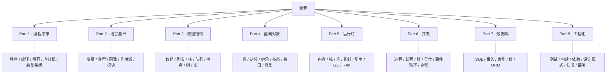

<div align="center">

# 编程语言精通

**掌握思想，而不是记忆语法**

*通过横向对比、第一性原理与工程实践，理解编程的本质*

---

`状态：v0.8 · Part 1–7 已完成` &nbsp;•&nbsp; `覆盖语言：JavaScript / Python / Java / C++ / C# / SQL` &nbsp;•&nbsp; `许可：MIT`

> **学习概念 · 对比语言 · 理解原理 · 构建体系**

---

**简体中文** ｜ [English](./README.en-US.md)

</div>

---

## 📑 目录

- [编程语言精通](#编程语言精通)
  - [📑 目录](#-目录)
  - [🎯 愿景](#-愿景)
  - [❓ 为什么是这本书](#-为什么是这本书)
  - [🧠 学习哲学](#-学习哲学)
  - [👥 适合谁](#-适合谁)
  - [🎁 你会获得什么](#-你会获得什么)
  - [🗺️ 知识地图](#️-知识地图)
  - [📚 全书结构](#-全书结构)
  - [📝 章节模板](#-章节模板)
  - [🔬 对比方法论](#-对比方法论)
  - [🧭 如何阅读](#-如何阅读)
  - [🚀 学习路线](#-学习路线)
  - [💻 案例项目](#-案例项目)
  - [🌐 覆盖语言](#-覆盖语言)
  - [📁 仓库结构](#-仓库结构)
  - [📈 项目进度](#-项目进度)
  - [🏷️ 版本规划](#️-版本规划)
  - [🤝 参与贡献](#-参与贡献)
  - [📄 许可协议](#-许可协议)
  - [❤️ 致谢](#️-致谢)
  - [🌱 结语](#-结语)

---

## 🎯 愿景

世界从不缺 Python、Java 或 C++ 的教程。真正稀缺的，是一本能把它们**连成一个整体**的书。

当你分别学完五门语言，得到的往往是五套互相割裂的语法记忆。而资深工程师看到的是另一幅图景：变量、函数、对象、内存、并发——**同一批概念，在不同语言里的不同投影**。他们学一门新语言只需要几天，因为他们学的从来不是语法，而是语法背后那套不变的思想。

**这本书要教的，就是那批概念本身。语言，只是它们的方言。**

我们的目标不是"教会你五门语言"，而是帮你建立一套**能够陪伴整个职业生涯、并且能快速吸收任何新语言的编程知识体系**。五年、十年之后，语言的流行度会变，框架会更替，但变量为什么存在、GC 解决了什么问题、并发的本质困难在哪里——这些不会变。

> 一次理解，长久受用。

---

## ❓ 为什么是这本书

传统教程按**语言**组织。你会看到一本《Python 教程》和一本《Java 教程》，各自从"变量"讲到"类"，彼此毫无关联：

```text
Python                      Java
├── 变量                    ├── 变量
├── 函数                    ├── 函数
└── 类                      └── 类
```

问题在于：**你学会的是某一门语言，而不是编程本身。** 换一门语言，几乎要从头再来。

本书反过来，按**概念**组织。每一个概念，都同时在六门语言里展开对比：

```text
变量                             函数
├── JavaScript                   ├── JavaScript
├── Python                       ├── Python
├── Java                         ├── Java
├── C++                          ├── C++
├── C#                           ├── C#
└──（SQL 相关时）                └──（SQL 相关时）
```

于是你学到的是**概念**，语言只是它的不同实现。理解了"变量"在栈上、在堆上、在引用计数下、在 JVM 局部变量表里的不同命运，你就同时理解了五门语言——并且为学第六门做好了准备。

---

## 🧠 学习哲学

整本书遵循一条学习闭环：

```text
理解  →  对比  →  分析  →  构建
```

先**理解**概念为何存在，再横向**对比**各语言的取舍，接着**分析**底层实现与性能差异，最后在工程中**构建**真实的东西。四条支撑原则：

**1. 概念优先**
先回答"为什么需要它"，再讲"怎么用它"。我们不会一上来就写 `let a = 1`，而是先问：为什么计算机需要变量？为什么不用内存地址？

**2. 横向对比**
每一个公共概念都同时比较 JavaScript、Python、Java、C++、C#，SQL 在相关章节加入。对比不止列语法，而是讲清**共同点、差异、原因、适用场景**。

**3. 第一性原理**
自底向上解释：`CPU → 内存 → Runtime → 语言`。触及 Stack、Heap、Pointer、Reference、GC、Event Loop、JVM、CLR、CPython、V8 等真实机制，而不是停在 API。

**4. 工程导向**
每章都落到真实项目：最佳实践、常见坑、性能、测试、可运行示例。学到的是能用的能力，不是 Hello World。

---

## 👥 适合谁

- 有一门语言基础、想系统建立跨语言知识体系的开发者
- 前端 / 后端 / 全栈工程师，希望深入理解语言底层与运行时
- AI、游戏、安全等方向，需要在多门语言间自如切换的工程师
- 准备学习第二、第三门语言，不想每次都从零开始的人
- 任何希望"理解编程本身"而非"背下某门语言语法"的学习者

> 假设你至少熟悉一门语言（哪怕只是 JavaScript 基础）。本书不面向绝对零基础，但每个概念都从"为什么"讲起，基础薄弱也能跟上。

---

## 🎁 你会获得什么

读完本书，你应当能够：

- 理解不同语言背后**共同的编程思想**，看穿语法差异下的本质
- **快速学习任何新语言**（Go、Rust、Kotlin、Swift……），因为你学的是概念而非语法
- 理解编译器、解释器、虚拟机、Runtime、GC、类型系统等**底层原理**
- 说清楚"为什么 Python 和 Java 的变量行为不同""为什么 C++ 需要手动管理内存"这类**设计取舍**
- 在六门语言里写出**符合工程规范、可维护**的代码
- 建立一套涵盖数据、逻辑、对象、内存、并发、数据库、工程的**完整知识地图**

---

## 🗺️ 知识地图

全书围绕八大知识域展开，每一章都能在这张图上找到自己的位置——读者永远不会迷路。



---

## 📚 全书结构

全书共 **8 个 Part、59 章（编号 01–59）**。建议按 Part 顺序阅读，每一章独立成篇、可单独查阅。

| Part | 主题 | 章节 | 核心问题 |
|------|------|:----:|---------|
| **Part 1** | 编程思想 | 01–07 | 程序、语言、编译/解释、Runtime、类型系统是什么 |
| **Part 2** | 语言基础 | 08–15 | 变量、类型、函数、作用域、模块 |
| **Part 3** | 数据结构 | 16–22 | 数组、列表、栈、队列、哈希、树、图 |
| **Part 4** | 面向对象 | 23–30 | 类、封装、继承、多态、接口、泛型、反射 |
| **Part 5** | 运行时 | 31–38 | 内存、栈/堆、指针、引用、GC、RAII、智能指针 |
| **Part 6** | 并发 | 39–45 | 进程、线程、锁、异步、事件循环、协程、线程池 |
| **Part 7** | 数据库 | 46–51 | 数据库、SQL、事务、索引、锁、ORM |
| **Part 8** | 工程化 | 52–59 | 测试、包管理、构建、依赖注入、设计模式、性能、安全、部署 |

<details>
<summary><b>📖 展开完整章节目录（59 章）</b></summary>

**Part 1 · 编程思想**
```
01  编程语言发展史
02  程序是什么
03  编译器
04  解释器
05  虚拟机
06  运行时
07  类型系统
```

**Part 2 · 语言基础**
```
08  变量
09  数据类型
10  运算符
11  流程控制
12  函数
13  作用域
14  模块
15  包
```

**Part 3 · 数据结构**
```
16  数组
17  列表
18  栈
19  队列
20  哈希
21  树
22  图
```

**Part 4 · 面向对象**
```
23  类
24  对象
25  封装
26  继承
27  多态
28  接口
29  泛型
30  反射
```

**Part 5 · 运行时**
```
31  内存
32  栈内存
33  堆内存
34  指针
35  引用
36  垃圾回收
37  RAII
38  智能指针
```

**Part 6 · 并发**
```
39  进程
40  线程
41  锁
42  异步
43  事件循环
44  协程
45  线程池
```

**Part 7 · 数据库**
```
46  数据库
47  SQL
48  事务
49  索引
50  数据库锁
51  ORM
```

**Part 8 · 工程化**
```
52  测试
53  包管理
54  构建工具
55  依赖注入
56  设计模式
57  性能优化
58  安全
59  部署
```

</details>

> 完整学习路线、章节依赖关系与阅读顺序，详见 [ROADMAP.md](./ROADMAP.md)。

---

## 📝 章节模板

**所有章节保持完全一致的 19 节结构**，让读者形成稳定的阅读节奏，也便于长期维护。完整模板见 [docs/template.md](./docs/template.md)。

| # | 小节 | 作用 |
|--:|------|------|
| 1 | 学习目标 | 本章你将学会什么 |
| 2 | 为什么会出现 | 历史背景、解决的问题、没有它会怎样 |
| 3 | 底层原理 | CPU / 内存 / Runtime 内部发生了什么 |
| 4–8 | JavaScript / Python / Java / C++ / C# | 五语言实现（语法·示例·注意事项） |
| 9 | SQL（如相关） | 在数据库语境下的体现 |
| 10 | 五语言横向对比 | 共同点 / 区别 / 适用场景 |
| 11 | 底层实现对比 | V8 / CPython / JVM / Native / CLR |
| 12 | 性能分析 | 时间/空间复杂度、Runtime 成本 |
| 13 | 工程实践 | 真实项目怎么写、推荐/不推荐方案 |
| 14 | 最佳实践 | 命名、风格、设计原则 |
| 15 | 常见坑 | 新手易错点及原因 |
| 16 | 面试题 | 基础 / 中级 / 高级 |
| 17 | 练习 | 基础 / 提高 / 挑战 |
| 18 | 本章总结 | 一句话总结 + 检查清单 + 下一章预告 |
| 19 | 延伸阅读 | 经过验证、可访问的参考资料 |

---

## 🔬 对比方法论

"横向对比"是本书最核心的特色，但对比绝不是把语法并排放。每个概念的对比都遵循固定方法：

1. **语法对照表** — 六门语言如何书写同一件事
2. **底层实现对照** — 各自的运行时/内存模型有何不同
3. **工程实践对照** — 在真实项目中各语言的惯用法与取舍

并且每处对比都回答四个问题：**共同点是什么？差异在哪？为什么会有这种差异？各自适合什么场景？**

例如"内存管理"一章的对照会是这样：

| 语言 | 垃圾回收 | 手动释放 | RAII | 引用计数 |
|------|:--:|:-------:|:----:|:-------:|
| JavaScript | ✅ | ❌ | ❌ | ❌ |
| Python | ✅ | ❌ | ❌ | ✅ |
| Java | ✅ | ❌ | ❌ | ❌ |
| C++ | ❌ | ✅ | ✅ | ❌ |
| C# | ✅ | ❌ | ❌ | ❌ |

看懂这张表，你就理解了这五门语言在内存模型上的根本分野——而不只是记住了各自的语法。

---

## 🧭 如何阅读

**这本书可以读四遍，每一遍关注不同的层次：**

| 遍数 | 关注点 | 收获 |
|:---:|--------|------|
| 第一遍 | 按 Part 1 → 8 通读 | 建立完整的概念地图 |
| 第二遍 | 只看每章的「横向对比」 | 打通跨语言思维 |
| 第三遍 | 只看「底层原理 / Runtime」 | 理解语言为何如此设计 |
| 第四遍 | 只看「性能 / 工程实践」 | 形成工程判断力 |

初学者从第一遍开始即可；有经验的读者可以直接跳到感兴趣的 Part。每章都自包含，可作为随时查阅的参考。

---

## 🚀 学习路线

不同背景的读者可以按需选择重点路线，快速抵达与自己最相关的内容：

| 读者 | 推荐路线 |
|------|---------|
| 🌱 **首次系统学习** | Part 1 → 2 → 3 → 4 → 5 → 6 → 7 → 8（完整通读） |
| 🤖 **AI / 数据工程师** | Part 1 → 2 → 3 → 6（并发）→ 7（数据库） |
| 🖥️ **后端工程师** | Part 1 → 2 → 4（面向对象）→ 5（运行时）→ 7 → 8 |
| 🎮 **游戏 / 图形工程师** | Part 1 → 3（数据结构）→ 5（内存）→ 6（并发） |
| 🔐 **安全 / 底层工程师** | Part 1 → 5（内存/指针）→ 6（并发）→ 8（工程/安全） |

---

## 💻 案例项目

为避免读者在不同场景间反复切换，全书统一使用几套贯穿始终的业务案例。**同一个概念、同一套案例，在六门语言里都有完整实现**，天然可对比：

- 🎓 **学生管理系统**
- 📚 **图书管理系统**
- ✅ **待办清单**
- 📝 **博客系统**
- 💬 **聊天室**

所有示例代码位于 [examples/](./examples/)，按语言分目录，可直接运行。

---

## 🌐 覆盖语言

本书当前覆盖六门语言（顺序在全书所有对比中保持一致）：

| 语言 | 版本 | 代表性定位 |
|------|------|-----------|
| **JavaScript** | ES2023 | 动态类型、事件循环、Web 与全栈 |
| **Python** | 3.x | 动态类型、引用计数、AI 与脚本 |
| **Java** | 21+ | 静态类型、JVM、企业级后端 |
| **C++** | C++20/23 | 手动内存、RAII、系统与高性能 |
| **C#** | .NET 8+ | 静态类型、CLR、跨平台与游戏 |
| **SQL** | ANSI SQL + 主流数据库 | 声明式、关系模型（相关章节） |

**未来计划扩展：** Go · Rust · Kotlin · Swift · Dart · Zig · Lua · PHP。由于本书以概念为轴，新增语言只需在既有章节里补上一列，不影响整体结构。

---

## 📁 仓库结构

```text
Programming-Languages-Mastery/
├── README.md            # 项目总入口（简体中文，本文件）
├── README.en-US.md      # 英文版
├── ROADMAP.md           # 完整学习路线与章节地图
├── CONTRIBUTING.md      # 贡献指南与写作规范
├── CHANGELOG.md         # 版本变更记录
├── LICENSE              # MIT 许可
│
├── docs/                # 教材正文（按 Part 分目录）
│   ├── Part1-Programming-Fundamentals/
│   ├── Part2-Language-Basics/
│   ├── Part3-Data-Structures/
│   ├── Part4-OOP/
│   ├── Part5-Runtime/
│   ├── Part6-Concurrency/
│   ├── Part7-Database/
│   ├── Part8-Engineering/
│   └── template.md      # 统一章节模板
│
├── examples/            # 六语言示例代码
│   ├── javascript/  python/  java/  cpp/  csharp/  sql/
├── exercises/           # 各章练习题
├── projects/            # 综合项目
├── diagrams/            # 架构图与示意图（Mermaid）
├── cheatsheets/         # 五语言对照速查表
├── images/              # 图片资源
└── assets/              # 其他资源
```

---

## 📈 项目进度

本书按开源项目长期维护，进度公开透明：

| Part | 主题 | 状态 |
|------|------|:----:|
| Part 1 | 编程思想 | ✅ 已完成 |
| Part 2 | 语言基础 | ✅ 已完成 |
| Part 3 | 数据结构 | ✅ 已完成 |
| Part 4 | 面向对象 | ✅ 已完成 |
| Part 5 | 运行时 | ✅ 已完成 |
| Part 6 | 并发 | ✅ 已完成 |
| Part 7 | 数据库 | ✅ 已完成 |
| Part 8 | 工程化 | ⏳ 规划中 |

> 图例：⏳ 规划中 · ✍️ 编写中 · ✅ 已完成 · 🔄 修订中

---

## 🏷️ 版本规划

本书采用语义化版本（Semantic Versioning），每个版本都有清晰的里程碑：

```text
v0.1  项目基础设施（README / ROADMAP / 规范 / 模板）
  ↓
v0.2  Part 1 编程思想
  ↓
v0.3  Part 2 语言基础
  ↓
v0.4  Part 3 数据结构
  ↓
v0.5  Part 4 面向对象
  ↓
v0.6  Part 5 运行时
  ↓
v0.7  Part 6 并发
  ↓
v0.8  Part 7 数据库   ← 当前
  ↓
 ...  逐 Part 推进
  ↓
v1.0  第一版 · 八个 Part 全部完成
  ↓
v2.0  扩展语言（Go / Rust / Kotlin …）
```

---

## 🤝 参与贡献

欢迎任何形式的贡献：修正文字、修复代码、补充示例、增加练习、改进图示，或为某个概念补上一门新语言的实现。

参与前请先阅读 [CONTRIBUTING.md](./CONTRIBUTING.md)，其中包含统一的写作规范、Markdown 风格、代码约定、命名规则与术语表——它保证整本书读起来像"一个人写的"。

---

## 📄 许可协议

本项目采用 **MIT License**，详见 [LICENSE](./LICENSE)。你可以自由地阅读、分享、二次创作，只需保留版权声明。

---

## ❤️ 致谢

感谢所有优秀的编程语言、开源社区与软件工程实践，为本书提供了大量值得学习和借鉴的思想。也感谢每一位阅读、使用、贡献本书的人——是你们让它持续变得更好。

---

## 🌱 结语

> 学习编程，不应该只是学习一门语言。
>
> 每一门语言，都只是解决问题的一种方式。
>
> 当你真正理解了变量、函数、对象、内存、并发、数据库这些概念之后，学习一门新语言，往往只需要学习它的语法和生态。
>
> **希望这本书，能帮助你建立一套能够陪伴整个职业生涯的编程知识体系。**

---

<div align="center">

**⭐ 如果这个项目对你有帮助，欢迎 Star / Fork / Share ⭐**

*学习概念 · 对比语言 · 理解原理 · 构建体系*

</div>
