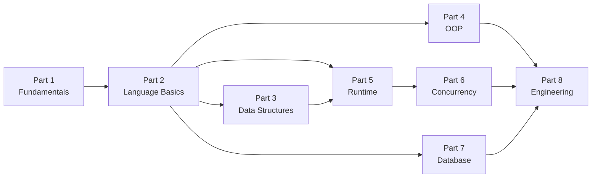

# Learning Roadmap

[简体中文](./ROADMAP.md) ｜ **English**

> This is the complete learning map for *Programming Languages Mastery*: 8 Parts and 59 chapters, each answering one "why."
> It tells you **what to learn, in what order, how chapters depend on one another, and how different backgrounds should navigate it.**

---

## 📖 How to Use This Roadmap

- The book is organized around **concepts**, with **8 Parts and 59 chapters (numbered 01–59)**. The default is to proceed in numeric order.
- Every chapter is labeled with the **core question** it answers — read with that "why" in mind, then see how the six languages each respond.
- Each chapter is a self-contained unit and can be consulted on its own; concepts do have dependencies, see [Chapter Dependencies](#-chapter-dependencies).
- In the tables below, **a chapter whose title is a link is already written** — click through to read it. Chapters without links are still on the way; see [Milestones and Versions](#-milestones-and-versions) for progress.
- For the full project structure, chapter template, and writing guidelines, see [README](./README.en-US.md) and [CONTRIBUTING](./CONTRIBUTING.md).

---

## 🧭 Overall Reading Order

Recommended main line: `Part 1 → 2 → 3 → 4 → 5 → 6 → 7 → 8`. Part 1 is the foundation for everything; Part 5 (Runtime) depends on Parts 2 and 3; Part 6 (Concurrency) depends on Part 5.

---

## 📅 Suggested Pace

The table below gives durations assuming **about 10–15 hours per week**. Actual time depends on how deep you go and whether you **implement each chapter's code by hand in all six languages** (strongly recommended). A sprint pace (20h+/week) can compress this to roughly 60%.

| Part | Theme | Chapters | Suggested Duration |
|------|-------|:--------:|:------------------:|
| Part 1 | Programming Fundamentals | 7 | 1 week |
| Part 2 | Language Basics | 8 | 1.5 weeks |
| Part 3 | Data Structures | 7 | 1.5 weeks |
| Part 4 | Object-Oriented | 8 | 1.5 weeks |
| Part 5 | Runtime | 8 | 1.5 weeks |
| Part 6 | Concurrency | 7 | 1.5 weeks |
| Part 7 | Database | 6 | 1 week |
| Part 8 | Engineering | 8 | 1.5 weeks |
| **Total** | — | **59** | **~11 weeks** |

---

## 📚 Part-by-Part Details

Each Part gives its **goal, prerequisites, and the "core question" of every chapter.**

### Part 1 · Programming Fundamentals (01–07)

> **Goal**: Understand the lowest-level concepts — program, language, compilation, runtime, types — to lay the foundation for every later chapter.
> **Prerequisites**: None.

| Ch | Title | Core Question |
|:--:|-------|---------------|
| 01 | [Programming History](./docs/Part1-Programming-Fundamentals/01-programming-history.en-US.md) | Why did languages evolve from machine code all the way to high-level languages? |
| 02 | [What is a Program](./docs/Part1-Programming-Fundamentals/02-what-is-a-program.en-US.md) | How does a piece of code become actions the CPU executes? |
| 03 | [Compiler](./docs/Part1-Programming-Fundamentals/03-compiler.en-US.md) | How is source code translated into machine code? |
| 04 | [Interpreter](./docs/Part1-Programming-Fundamentals/04-interpreter.en-US.md) | Running without compiling — at what cost? |
| 05 | [Virtual Machine](./docs/Part1-Programming-Fundamentals/05-virtual-machine.en-US.md) | Why do the JVM / CLR exist, and how is "write once, run anywhere" achieved? |
| 06 | [Runtime](./docs/Part1-Programming-Fundamentals/06-runtime.en-US.md) | While a program runs, what does the language do for you behind the scenes? |
| 07 | [Type System](./docs/Part1-Programming-Fundamentals/07-type-system.en-US.md) | What exactly do types constrain? What do static and dynamic typing each buy you? |

### Part 2 · Language Basics (08–15)

> **Goal**: Master the building blocks no language can avoid, and form the habit of "same concept, six languages side by side."
> **Prerequisites**: Part 1.

| Ch | Title | Core Question |
|:--:|-------|---------------|
| 08 | [Variables](./docs/Part2-Language-Basics/08-variables.en-US.md) | Why do we need variables instead of using memory addresses directly? |
| 09 | [Data Types](./docs/Part2-Language-Basics/09-data-types.en-US.md) | Why distinguish types? What do they look like in memory? |
| 10 | [Operators](./docs/Part2-Language-Basics/10-operators.en-US.md) | How are expressions evaluated, and what lies behind operators? |
| 11 | [Control Flow](./docs/Part2-Language-Basics/11-control-flow.en-US.md) | How do if / loops map to low-level jump instructions? |
| 12 | [Functions](./docs/Part2-Language-Basics/12-functions.en-US.md) | Why do we need functions? How does the call stack work? |
| 13 | [Scope](./docs/Part2-Language-Basics/13-scope.en-US.md) | Where are variables visible? Why do closures exist? |
| 14 | [Modules](./docs/Part2-Language-Basics/14-modules.en-US.md) | How is code split and reused? |
| 15 | [Packages](./docs/Part2-Language-Basics/15-packages.en-US.md) | How are dependencies organized and distributed? |

### Part 3 · Data Structures (16–22)

> **Goal**: Understand why each data structure was invented, and how each language's standard library implements it.
> **Prerequisites**: Part 2.

| Ch | Title | Core Question |
|:--:|-------|---------------|
| 16 | [Array](./docs/Part3-Data-Structures/16-array.en-US.md) | Why is contiguous memory efficient? At what cost? |
| 17 | [List](./docs/Part3-Data-Structures/17-list.en-US.md) | How is dynamic growth implemented (vector / ArrayList / list)? |
| 18 | [Stack](./docs/Part3-Data-Structures/18-stack.en-US.md) | Why is LIFO everywhere (call stack, expression evaluation)? |
| 19 | [Queue](./docs/Part3-Data-Structures/19-queue.en-US.md) | What problem does FIFO solve? |
| 20 | [Hash](./docs/Part3-Data-Structures/20-hash.en-US.md) | Why can it achieve near O(1) lookup? |
| 21 | [Tree](./docs/Part3-Data-Structures/21-tree.en-US.md) | How to get both hierarchy and ordering? |
| 22 | [Graph](./docs/Part3-Data-Structures/22-graph.en-US.md) | How to express arbitrary relationships and connections? |

### Part 4 · Object-Oriented Programming (23–30)

> **Goal**: Understand the motivation and mechanics of OOP, and see the different trade-offs of Java / C# / C++ / Python.
> **Prerequisites**: Part 2.

| Ch | Title | Core Question |
|:--:|-------|---------------|
| 23 | [Class](./docs/Part4-OOP/23-class.en-US.md) | Why bind data and behavior together? |
| 24 | [Object](./docs/Part4-OOP/24-object.en-US.md) | How is an object laid out in memory? |
| 25 | [Encapsulation](./docs/Part4-OOP/25-encapsulation.en-US.md) | Why does hiding implementation details matter? |
| 26 | [Inheritance](./docs/Part4-OOP/26-inheritance.en-US.md) | What is the cost of reuse and the "is-a" relationship? |
| 27 | [Polymorphism](./docs/Part4-OOP/27-polymorphism.en-US.md) | How do vtables / dynamic dispatch achieve "one interface, different behaviors"? |
| 28 | [Interface](./docs/Part4-OOP/28-interface.en-US.md) | Why do we need contracts rather than implementations? |
| 29 | [Generic](./docs/Part4-OOP/29-generics.en-US.md) | How does parameterizing types balance reuse and safety (template vs generic vs duck typing)? |
| 30 | [Reflection](./docs/Part4-OOP/30-reflection.en-US.md) | What is the use — and the danger — of inspecting/manipulating types at runtime? |

### Part 5 · Runtime (31–38)

> **Goal**: Get to the bottom of memory and runtime mechanics — the key Part for understanding the *fundamental* differences among the five languages.
> **Prerequisites**: Part 2, Part 3.

| Ch | Title | Core Question |
|:--:|-------|---------------|
| 31 | [Memory](./docs/Part5-Runtime/31-memory.en-US.md) | Into what regions is a program's memory divided? |
| 32 | [Stack Memory](./docs/Part5-Runtime/32-stack-memory.en-US.md) | How are function calls allocated and reclaimed on the stack? |
| 33 | [Heap Memory](./docs/Part5-Runtime/33-heap-memory.en-US.md) | Why do we need the heap? Why is allocation more expensive? |
| 34 | [Pointer](./docs/Part5-Runtime/34-pointers.en-US.md) | The power and danger of operating on addresses directly? |
| 35 | [Reference](./docs/Part5-Runtime/35-references.en-US.md) | How do references differ from pointers and value semantics? |
| 36 | [Garbage Collection](./docs/Part5-Runtime/36-garbage-collection.en-US.md) | How does GC reclaim memory automatically? At what cost? |
| 37 | [RAII](./docs/Part5-Runtime/37-raii.en-US.md) | How does C++ manage resources via scope? |
| 38 | [Smart Pointer](./docs/Part5-Runtime/38-smart-pointers.en-US.md) | How to share ownership safely without a GC? |

### Part 6 · Concurrency (39–45)

> **Goal**: Understand the essential difficulty of concurrency, and the different models — thread, async, coroutine, event loop.
> **Prerequisites**: Part 5.

| Ch | Title | Core Question |
|:--:|-------|---------------|
| 39 | [Process](./docs/Part6-Concurrency/39-process.en-US.md) | Why do isolated units of execution exist? |
| 40 | [Thread](./docs/Part6-Concurrency/40-thread.en-US.md) | What convenience — and disaster — does shared-memory concurrency bring? |
| 41 | [Lock](./docs/Part6-Concurrency/41-lock.en-US.md) | How to coordinate access to shared data? |
| 42 | [Async](./docs/Part6-Concurrency/42-async.en-US.md) | How to wait for I/O without blocking? |
| 43 | [Event Loop](./docs/Part6-Concurrency/43-event-loop.en-US.md) | How does a single thread achieve "concurrency" (the JS / Node model)? |
| 44 | [Coroutine](./docs/Part6-Concurrency/44-coroutine.en-US.md) | Why is user-space scheduling more lightweight? |
| 45 | [Thread Pool](./docs/Part6-Concurrency/45-thread-pool.en-US.md) | Why reuse threads? |

### Part 7 · Database (46–51)

> **Goal**: Starting from "data beyond memory and files," understand SQL and the relational model, and connect all four languages to a database.
> **Prerequisites**: Part 2.

| Ch | Title | Core Question |
|:--:|-------|---------------|
| 46 | [Database](./docs/Part7-Database/46-database.en-US.md) | Beyond memory and files, why do we still need a database? |
| 47 | [SQL](./docs/Part7-Database/47-sql.en-US.md) | How does declarative querying express "what you want, not how to get it"? |
| 48 | [Transaction](./docs/Part7-Database/48-transaction.en-US.md) | How does ACID guarantee consistency? |
| 49 | [Index](./docs/Part7-Database/49-index.en-US.md) | Why can it speed up queries? At what cost? |
| 50 | [Database Lock](./docs/Part7-Database/50-db-lock.en-US.md) | How is correctness ensured under concurrent access? |
| 51 | [ORM](./docs/Part7-Database/51-orm.en-US.md) | How is the gap between objects and relations bridged? |

### Part 8 · Engineering (52–59)

> **Goal**: Bring all prior abilities into real engineering: testing, building, dependencies, patterns, performance, security, deployment.
> **Prerequisites**: Parts 2–7.

| Ch | Title | Core Question |
|:--:|-------|---------------|
| 52 | Testing | How do you prove code is correct? |
| 53 | Package Manager | How to tame dependency hell (pip / Maven / NuGet / npm / vcpkg)? |
| 54 | Build Tool | From source to a runnable artifact, what happens in between? |
| 55 | Dependency Injection | Why hand your dependencies out? |
| 56 | Design Pattern | What are the common solutions to recurring problems? |
| 57 | Performance | How to locate and eliminate bottlenecks? |
| 58 | Security | Where do common vulnerabilities come from, and how to prevent them? |
| 59 | Deployment | How does code make it to production? |

---

## 🧩 Chapter Dependencies

- **Part 1** is a prerequisite for everything — read it first.
- **Part 2** is the shared foundation for Parts 3–8.
- **Part 5 (Runtime)** refers back to Part 2 (variables, functions) and Part 3 (how data structures are laid out in memory).
- **Part 6 (Concurrency)** strongly depends on Part 5 (the memory model).
- **Part 4 (OOP)** and **Part 7 (Database)** are relatively independent and can be moved earlier or later per your interest.
- **Part 8 (Engineering)** is the wrap-up and is best left for last, though "Testing" is worth learning early and applying throughout.

> If you are short on time, the minimal main line is `Part 1 → 2 → 5` — it lets you understand the core source of the five languages' differences.

---

## 🚀 Paths by Role

Beyond a full read-through, different backgrounds can prioritize as below ("Focus" = study deeply; "Skim first" = get the gist, revisit later):

| Reader | Recommended Path | Focus | Skim First |
|--------|------------------|-------|------------|
| 🌱 First systematic study | 1 → 2 → 3 → 4 → 5 → 6 → 7 → 8 | Everything | — |
| 🤖 AI / Data Engineer | 1 → 2 → 3 → 6 → 7 | Parts 2, 7; Python | Parts 4, 8 |
| 🖥️ Back-end Engineer | 1 → 2 → 4 → 5 → 7 → 8 | Parts 4, 5, 7, 8 | Part 3 (partly) |
| 🎮 Game / Graphics Engineer | 1 → 3 → 5 → 6 | Part 3, Part 5 (memory); C++ | Part 7 |
| 🔐 Security / Systems Engineer | 1 → 5 → 6 → 8 | Part 5 (pointers/memory), Part 8 (security) | Part 4 |

---

## 🏁 Milestones and Versions

The book advances by Semantic Versioning; each completed Part ships a minor release:

| Version | Content | Status |
|---------|---------|:------:|
| v0.1 | Project infrastructure (README / ROADMAP / guidelines / template) | ✅ Done |
| v0.2 | Part 1 Programming Fundamentals | ✅ Done |
| v0.3 | Part 2 Language Basics | ✅ Done |
| v0.4 | Part 3 Data Structures | ✅ Done |
| v0.5 | Part 4 Object-Oriented Programming | ✅ Done |
| v0.6 | Part 5 Runtime | ✅ Done |
| v0.7 | Part 6 Concurrency | ✅ Done |
| v0.8 | Part 7 Database | ✅ Done |
| v0.9 | Part 8 Engineering | ⏳ |
| v1.0 | First Edition · all eight Parts complete | ⏳ |
| v2.0+ | Additional languages (Go / Rust / Kotlin …) | ⏳ |

> Legend: ✍️ In Progress · ⏳ Planned · ✅ Done

---

## 💡 Study Tips

- **Implement in parallel**: for each chapter's concept, write **the same example in all six languages** and compare syntax and idioms side by side. This is the most recommended way to use the book.
- **Keep a comparison cheat sheet**: record each chapter's cross-language differences in `cheatsheets/`; over time this becomes your own "cross-language dictionary."
- **The four-pass reading method**: first pass builds the concept map; second focuses on cross-language comparison; third on underlying principles; fourth on performance and engineering practice (see [README · How to Read](./README.en-US.md#-how-to-read)).
- **Read with a "why"**: for each chapter, look at the core question given here first, try to answer it yourself, then verify against the text.

---

> When you are ready, start with **Part 1 · Chapter 01 "Programming History."**
