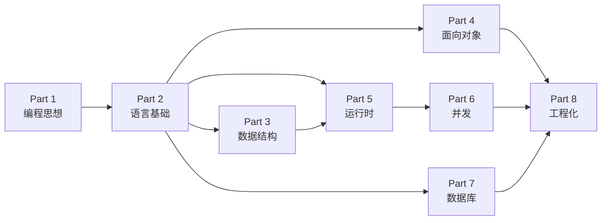

# 学习路线

**简体中文** ｜ [English](./ROADMAP.en-US.md)

> 这是《编程语言精通》的完整学习地图：全书 8 个 Part、59 章，每一章都对应一个"为什么"。
> 本文告诉你**学什么、按什么顺序学、各章之间如何依赖、不同背景该怎么走**。

---

## 📖 使用说明

- 全书以**概念**为轴，共 **8 个 Part、59 章（编号 01–59）**。默认按编号顺序推进。
- 每一章都标注了它回答的**核心问题**——先带着这个"为什么"去读，再看六门语言如何各自作答。
- 每章都是独立单元，可单独查阅；但概念之间存在依赖，见 [章节依赖关系](#-章节依赖关系)。
- 下文各表中**标题可点击的章节即已完成**，点进去就能直接阅读；尚未加链接的章节正在路上，进度见 [里程碑与版本](#-里程碑与版本)。
- 完整项目结构、章节模板、写作规范见 [README](./README.md) 与 [CONTRIBUTING](./CONTRIBUTING.md)。

---

## 🧭 学习顺序总览

推荐主线：`Part 1 → 2 → 3 → 4 → 5 → 6 → 7 → 8`。其中 Part 1 是所有内容的地基，Part 5（运行时）依赖 Part 2、3，Part 6（并发）依赖 Part 5。

---

## 📅 建议学习节奏

下表以**每周约 10–15 小时**为参考给出周期；实际时长取决于你钻研的深度、以及是否**亲手在六门语言里把每章代码都写一遍**（强烈建议）。冲刺节奏（每周 20h+）可压缩到约六折。

| Part | 主题 | 章数 | 建议周期（参考） |
|------|------|:---:|:---:|
| Part 1 | 编程思想 | 7 | 1 周 |
| Part 2 | 语言基础 | 8 | 1.5 周 |
| Part 3 | 数据结构 | 7 | 1.5 周 |
| Part 4 | 面向对象 | 8 | 1.5 周 |
| Part 5 | 运行时 | 8 | 1.5 周 |
| Part 6 | 并发 | 7 | 1.5 周 |
| Part 7 | 数据库 | 6 | 1 周 |
| Part 8 | 工程化 | 8 | 1.5 周 |
| **合计** | — | **59** | **约 11 周** |

---

## 📚 分部详解

每个 Part 给出：**目标、前置、以及逐章的"核心问题"**。

### Part 1 · 编程思想（01–07）

> **目标**：理解"程序 / 语言 / 编译 / 运行时 / 类型"这些最底层的概念，为后面所有章节打地基。
> **前置**：无。

| 章 | 标题 | 它回答的核心问题 |
|:--:|------|------------------|
| 01 | [编程语言发展史](./docs/Part1-Programming-Fundamentals/01-programming-history.md) | 语言为何从机器码一路演进到高级语言？ |
| 02 | [程序是什么](./docs/Part1-Programming-Fundamentals/02-what-is-a-program.md) | 一段代码如何变成 CPU 执行的动作？ |
| 03 | [编译器](./docs/Part1-Programming-Fundamentals/03-compiler.md) | 源代码如何被翻译成机器码？ |
| 04 | [解释器](./docs/Part1-Programming-Fundamentals/04-interpreter.md) | 不编译也能运行，代价是什么？ |
| 05 | [虚拟机](./docs/Part1-Programming-Fundamentals/05-virtual-machine.md) | JVM / CLR 为何存在，"一次编写到处运行"如何实现？ |
| 06 | [运行时](./docs/Part1-Programming-Fundamentals/06-runtime.md) | 程序运行时，语言在背后替你做了什么？ |
| 07 | [类型系统](./docs/Part1-Programming-Fundamentals/07-type-system.md) | 类型到底约束了什么？静态与动态各图什么？ |

### Part 2 · 语言基础（08–15）

> **目标**：掌握任何语言都绕不开的基础构件，并建立"同一概念、六语言对照"的思维习惯。
> **前置**：Part 1。

| 章 | 标题 | 它回答的核心问题 |
|:--:|------|------------------|
| 08 | [变量](./docs/Part2-Language-Basics/08-variables.md) | 为什么需要变量，而不是直接用内存地址？ |
| 09 | [数据类型](./docs/Part2-Language-Basics/09-data-types.md) | 为什么要区分类型？它们在内存里长什么样？ |
| 10 | [运算符](./docs/Part2-Language-Basics/10-operators.md) | 表达式如何被求值，运算符背后是什么？ |
| 11 | [流程控制](./docs/Part2-Language-Basics/11-control-flow.md) | if / 循环如何映射到底层的跳转指令？ |
| 12 | [函数](./docs/Part2-Language-Basics/12-functions.md) | 为什么需要函数？调用栈如何工作？ |
| 13 | [作用域](./docs/Part2-Language-Basics/13-scope.md) | 变量在哪里可见？闭包为什么存在？ |
| 14 | [模块](./docs/Part2-Language-Basics/14-modules.md) | 代码如何拆分与复用？ |
| 15 | [包](./docs/Part2-Language-Basics/15-packages.md) | 依赖如何组织与分发？ |

### Part 3 · 数据结构（16–22）

> **目标**：理解各数据结构"为什么被发明"，以及各语言标准库如何实现它们。
> **前置**：Part 2。

| 章 | 标题 | 它回答的核心问题 |
|:--:|------|------------------|
| 16 | [数组](./docs/Part3-Data-Structures/16-array.md) | 连续内存为何高效？代价是什么？ |
| 17 | [列表](./docs/Part3-Data-Structures/17-list.md) | 动态扩容如何实现（vector / ArrayList / list）？ |
| 18 | [栈](./docs/Part3-Data-Structures/18-stack.md) | 后进先出为何无处不在（调用栈、表达式求值）？ |
| 19 | [队列](./docs/Part3-Data-Structures/19-queue.md) | 先进先出解决什么问题？ |
| 20 | [哈希](./docs/Part3-Data-Structures/20-hash.md) | 为什么能做到近似 O(1) 查找？ |
| 21 | [树](./docs/Part3-Data-Structures/21-tree.md) | 层级结构与有序性如何兼得？ |
| 22 | [图](./docs/Part3-Data-Structures/22-graph.md) | 如何表达任意关系与连接？ |

### Part 4 · 面向对象（23–30）

> **目标**：理解 OOP 的动机与机制，看清 Java / C# / C++ / Python 的不同取舍。
> **前置**：Part 2。

| 章 | 标题 | 它回答的核心问题 |
|:--:|------|------------------|
| 23 | 类 | 为什么需要把数据和行为绑在一起？ |
| 24 | 对象 | 对象在内存里如何布局？ |
| 25 | 封装 | 隐藏实现细节为何重要？ |
| 26 | 继承 | 复用与"is-a"关系的代价是什么？ |
| 27 | 多态 | vtable / 动态派发如何实现"同一接口，不同行为"？ |
| 28 | 接口 | 为什么需要契约，而非实现？ |
| 29 | 泛型 | 类型参数化如何兼顾复用与安全（模板 vs 泛型 vs 鸭子类型）？ |
| 30 | 反射 | 运行时窥探/操作类型有何用、有何险？ |

### Part 5 · 运行时（31–38）

> **目标**：搞懂内存与运行时机制——这是理解五门语言"根本差异"的关键一 Part。
> **前置**：Part 2、Part 3。

| 章 | 标题 | 它回答的核心问题 |
|:--:|------|------------------|
| 31 | 内存 | 程序的内存被分成哪几块？ |
| 32 | 栈内存 | 函数调用如何在栈上分配与回收？ |
| 33 | 堆内存 | 为什么需要堆？分配为何更贵？ |
| 34 | 指针 | 直接操作地址的威力与危险？ |
| 35 | 引用 | 引用与指针、值语义如何区分？ |
| 36 | 垃圾回收 | GC 如何自动回收内存？代价在哪？ |
| 37 | RAII | C++ 如何用作用域管理资源？ |
| 38 | 智能指针 | 无 GC 时如何安全地共享所有权？ |

### Part 6 · 并发（39–45）

> **目标**：理解并发的本质困难，以及线程、异步、协程、事件循环等不同模型。
> **前置**：Part 5。

| 章 | 标题 | 它回答的核心问题 |
|:--:|------|------------------|
| 39 | 进程 | 隔离的执行单元为何存在？ |
| 40 | 线程 | 共享内存的并发带来什么便利与灾难？ |
| 41 | 锁 | 如何协调对共享数据的访问？ |
| 42 | 异步 | 不阻塞地等待 I/O 如何做到？ |
| 43 | 事件循环 | 单线程如何"并发"（JS / Node 模型）？ |
| 44 | 协程 | 用户态调度为何更轻量？ |
| 45 | 线程池 | 为什么要复用线程？ |

### Part 7 · 数据库（46–51）

> **目标**：从"内存/文件之外的数据"入手，理解 SQL 与关系模型，并让四门语言都连上数据库。
> **前置**：Part 2。

| 章 | 标题 | 它回答的核心问题 |
|:--:|------|------------------|
| 46 | 数据库 | 内存与文件之外，为什么还需要数据库？ |
| 47 | SQL | 声明式查询如何表达"要什么，而非怎么做"？ |
| 48 | 事务 | ACID 如何保证一致性？ |
| 49 | 索引 | 为什么能加速查询？代价是什么？ |
| 50 | 数据库锁 | 并发访问下如何保证正确？ |
| 51 | ORM | 对象与关系之间的鸿沟如何弥合？ |

### Part 8 · 工程化（52–59）

> **目标**：把前面所有能力落到真实工程：测试、构建、依赖、模式、性能、安全、部署。
> **前置**：Part 2–7。

| 章 | 标题 | 它回答的核心问题 |
|:--:|------|------------------|
| 52 | 测试 | 如何证明代码是对的？ |
| 53 | 包管理 | 依赖地狱如何治理（pip / Maven / NuGet / npm / vcpkg）？ |
| 54 | 构建工具 | 源码到可运行产物，中间发生了什么？ |
| 55 | 依赖注入 | 为什么要把依赖"交出去"？ |
| 56 | 设计模式 | 反复出现的问题有哪些通用解法？ |
| 57 | 性能优化 | 如何定位与消除瓶颈？ |
| 58 | 安全 | 常见漏洞从何而来、如何防？ |
| 59 | 部署 | 代码如何走向生产环境？ |

---

## 🧩 章节依赖关系

- **Part 1** 是所有内容的前提，务必先读。
- **Part 2** 是 Part 3–8 的共同基础。
- **Part 5（运行时）** 会回头引用 Part 2（变量、函数）与 Part 3（数据结构在内存中的布局）。
- **Part 6（并发）** 强依赖 Part 5（内存模型）。
- **Part 4（面向对象）** 与 **Part 7（数据库）** 相对独立，可根据兴趣提前或延后。
- **Part 8（工程化）** 是收口，建议放在最后，但其中「测试」可以尽早了解并贯穿始终。

> 如果你时间有限，最小主线是 `Part 1 → 2 → 5`——它能让你理解五门语言最核心的差异来源。

---

## 🚀 分角色学习路线

在完整通读之外，不同背景可按下表安排重点（"重点"= 深入精读，"略读"= 先了解、后补）：

| 读者 | 推荐路线 | 重点 | 可先略读 |
|------|---------|------|---------|
| 🌱 首次系统学习 | 1 → 2 → 3 → 4 → 5 → 6 → 7 → 8 | 全部 | — |
| 🤖 AI / 数据工程师 | 1 → 2 → 3 → 6 → 7 | Part 2、7，Python 相关 | Part 4、8 |
| 🖥️ 后端工程师 | 1 → 2 → 4 → 5 → 7 → 8 | Part 4、5、7、8 | Part 3 部分 |
| 🎮 游戏 / 图形工程师 | 1 → 3 → 5 → 6 | Part 3、5（内存）、C++ 相关 | Part 7 |
| 🔐 安全 / 底层工程师 | 1 → 5 → 6 → 8 | Part 5（指针/内存）、8（安全） | Part 4 |

---

## 🏁 里程碑与版本

本书按语义化版本推进，每完成一个 Part 发布一个小版本：

| 版本 | 内容 | 状态 |
|------|------|:----:|
| v0.1 | 项目基础设施（README / ROADMAP / 规范 / 模板） | ✅ 已完成 |
| v0.2 | Part 1 编程思想 | ✅ 已完成 |
| v0.3 | Part 2 语言基础 | ✅ 已完成 |
| v0.4 | Part 3 数据结构 | ✅ 已完成 |
| v0.5 | Part 4 面向对象 | ✍️ 进行中 |
| v0.6 | Part 5 运行时 | ⏳ |
| v0.7 | Part 6 并发 | ⏳ |
| v0.8 | Part 7 数据库 | ⏳ |
| v0.9 | Part 8 工程化 | ⏳ |
| v1.0 | 第一版 · 八个 Part 全部完成 | ⏳ |
| v2.0+ | 扩展语言（Go / Rust / Kotlin …） | ⏳ |

> 图例：✍️ 进行中 · ⏳ 计划中 · ✅ 已完成

---

## 💡 学习方法建议

- **对照式实现**：每章的概念，尽量在六门语言里**各写一遍同一个例子**，横向对比语法与惯用法。这是本书最推荐的学习方式。
- **维护一份对照速查表**：把每章的跨语言差异记进 `cheatsheets/`，日积月累就是你自己的"跨语言词典"。
- **四遍阅读法**：第一遍建立概念地图；第二遍专看横向对比；第三遍专看底层原理；第四遍专看性能与工程实践（详见 [README · 如何阅读](./README.md#-如何阅读)）。
- **带着"为什么"读**：每章先看本文给出的"核心问题"，尝试自己回答，再进正文验证。

---

> 准备好了就从 **Part 1 · 第 01 章「编程语言发展史」** 开始。
