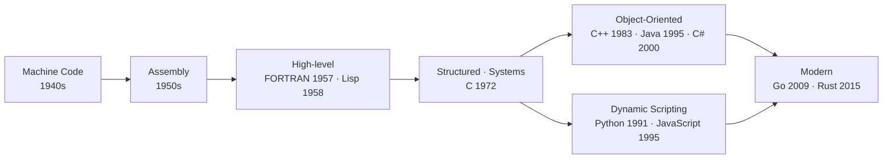

# Chapter 01 · A History of Programming Languages

[简体中文](./01-programming-history.md) ｜ **English**

---

> This is the book's first chapter. Before diving into any single language, let's step back and see how programming languages got to where they are — because only once you understand *why they became what they are today* will each seemingly strange design choice later make you think, "ah, so that's why."

## 1. Learning Objectives

By the end of this chapter, you will be able to:

- Tie the whole history of programming languages together with one thread — **the ever-rising level of abstraction**;
- Explain what pain point each paradigm leap (machine code → assembly → high-level → object-oriented → dynamic/managed → modern) solved from the previous generation;
- Place the book's six languages (JavaScript, Python, Java, C++, C#, SQL) back on the historical map and understand "where they came from and why they are designed the way they are";
- Dispel a few common misconceptions about "new vs. old languages."

---

## 2. Why It Emerged (the Core Question)

> **Core question: computers only understand 0s and 1s — so why don't we just write 0s and 1s? And why are there thousands of programming languages in the world?**

Computer hardware does exactly one thing: execute binary instructions. But the human brain is not good at reading and writing binary. So the history of programming languages is, in essence, a history of **"how to let humans command machines with less effort."**

Every generation of languages searches for a new balance point between two goals pulling in opposite directions:

- **Closer to the machine** — for performance, control, and precise command of the hardware;
- **Closer to humans** — for readability, maintainability, portability, and development speed.

There are thousands of languages precisely because different domains demand different balance points: an OS kernel needs ultimate control, data analysis needs ultimate expressiveness, the web needs cross-platform distribution. **There is no "best" language — only one "best suited to a particular balance point."** This judgment runs through the entire book.

---

## 3. The Historical Thread

Let's walk through it chronologically, seeing what pain point each leap **solved from the previous generation.**

- **1940s · Machine Code**
  Writing binary instructions directly (or via punch cards). This is the only "native" language.
  *Pain point*: nearly unreadable, extremely error-prone, and completely tied to a specific machine — move to another and you rewrite everything.

- **1950s · Assembly**
  Uses mnemonics (like `MOV`, `ADD`) instead of binary, translated into machine code by an **assembler**.
  *Progress*: a first step toward readability. *Remaining pain point*: still maps one-to-one to a specific CPU's instruction set — not portable.

- **1957 · FORTRAN** (John Backus / IBM)
  The first widely used **high-level language**: you could write near-mathematical expressions, translated into machine code by a **compiler**. Close behind, **Lisp** (1958, John McCarthy) introduced functional ideas and the seed of automatic memory management, **COBOL** (1959) targeted business data processing, and **ALGOL** (1958/1960) laid the groundwork for structured programming and block scope.
  *Pain point solved*: finally free of specific hardware, with vastly greater expressiveness.

- **1972 · C** (Dennis Ritchie / Bell Labs)
  Struck a remarkable balance between "high-level expression" and "closeness to hardware": able to write systems-level code while remaining portable. It became the foundation for countless later languages — including the mainstream implementations of Python and JavaScript in this book, which are themselves written in C.

- **The Object-Oriented Wave**
  As programs grew larger, "how to manage complexity" became the new pain point. **C++** (1983, Bjarne Stroustrup; its predecessor "C with Classes" began in 1979) added classes and abstraction on top of C; **Java** (1995, James Gosling / Sun) used JVM bytecode to achieve "write once, run anywhere" with built-in garbage collection (GC); **C#** (2000, Anders Hejlsberg / Microsoft) offered a similar managed model on .NET/CLR.
  *Pain point solved*: managing the complexity of large software, plus memory safety.

- **The Dynamic Scripting Wave**
  Meanwhile, another branch prioritizing "development speed first" rose. **Python** (1991, Guido van Rossum) put readability and expressiveness first; **JavaScript** (1995, Brendan Eich — its prototype reportedly took just 10 days) was born for the browser.
  *Pain point solved*: rapid development, scripting, gluing systems together, web interactivity.

- **Declarative and Data**
  The data world took a different road. Based on E. F. Codd's relational model of 1970, **SQL** (its predecessor SEQUEL in 1974, an ANSI standard in 1986) lets you describe only **"what you want"** and leaves **"how to get it"** to the database engine.

- **Modern Languages**
  The new pain points are concurrency, memory safety, and developer experience. **Go** (2009, Google) emphasizes simplicity and concurrency; **Rust** (1.0 in 2015) uses an ownership system to achieve memory safety **without a GC**; **Kotlin** and **Swift** modernize existing ecosystems.

> ⚠️ **An important caveat**: real language evolution is not a straight line but a web of mutual influence. C influenced almost everything after it; many of Lisp's ideas have been "rediscovered" again and again. This chapter organizes history around the "abstraction level" thread **to aid understanding**, not to claim that history is linear.

---

## 4. What It Really Is · The Underlying Thread

Compress the whole history into one sentence: **a programming language is a product of "abstraction" and "trade-offs."**

Each rise in abstraction level hands **more details over to the compiler or runtime** — register allocation, memory reclamation, cross-platform adaptation — buying you productivity; the cost is usually less low-level control, or some runtime overhead.

Along this thread, three main "execution models" gradually emerged (later chapters unpack each in detail):

| Execution Model | How | Representatives | Trade-off |
|-----------------|-----|-----------------|-----------|
| **Compile to native** | Generate machine code directly | C / C++ | Fast, strong control; needs recompiling per platform |
| **Interpreted** | Executed statement by statement by an interpreter | Traditional Python / JavaScript | Flexible, portable, fast to develop; usually slower |
| **Managed / VM** | Compile to intermediate bytecode, run by a VM | Java (JVM) / C# (CLR) | Cross-platform + automatic memory management; VM overhead |

> In reality the boundaries blur: JavaScript has V8's just-in-time (JIT) compilation, and Python compiles to bytecode before interpreting. These "hybrids" are exactly what later chapters (02 Compiler, 03 Interpreter, 04 Virtual Machine, 05 Runtime) will take apart one by one.

---

## 5. Key Concepts and Terms

- **Abstraction Level**: how far a language is from the machine and how close to humans. The more "high-level," the closer to humans.
- **Portability**: whether the same code can run on different machines/platforms.
- **Compiled / Interpreted / Managed**: the three main execution models (see the table above).
- **Paradigm**: a way of organizing code — imperative, object-oriented, functional, declarative.
- **High-level / Low-level language**: relative descriptions, **with no value judgment** — "low-level" means closer to the machine, not worse.

---

## 6. How This Shows Up in the Book's Six Languages

Placing the book's six languages back on this thread, ordered by birth year:

| Language | Born | Abstraction | Main Paradigm | Execution Model |
|----------|:----:|:-----------:|---------------|-----------------|
| **SQL** | 1974 / std. 1986 | High | Declarative · relational | Parsed & optimized by a query engine |
| **C++** | 1983 | Low–mid | Multi-paradigm (procedural/OOP/generic) | Compiled to native machine code |
| **Python** | 1991 | High | Multi-paradigm (OOP/procedural/functional) | Compiled to bytecode + interpreted (CPython) |
| **Java** | 1995 | Mid–high | Primarily OOP | Bytecode + JVM managed execution (JIT) |
| **JavaScript** | 1995 | High | Multi-paradigm (prototype OOP/functional) | JIT-executed by engines (e.g. V8) |
| **C#** | 2000 | Mid–high | Multi-paradigm (OOP/functional) | Compiled to IL + CLR managed execution (JIT) |

In one line each, their "historical position":

- **SQL** sits on the independent **declarative** branch — it barely cares "how," only "what."
- **C++** sits at the intersection of "**close to the machine + object-oriented**," the extreme case of "control *and* abstraction."
- **Java / C#** represent "**managed OOP**" — trading a virtual machine for cross-platform reach and memory safety.
- **Python / JavaScript** represent "**dynamic scripting**," now leaning back toward engineering via JIT and type annotations (TypeScript, Python's type hints).

Once you understand which branch of history each stands on, you'll see that every "cross-language comparison" later in the book is, in essence, comparing **the different trade-offs of these branches.**

---

## 7. Common Misconceptions

- **Misconception 1: "Newer languages are always better."**
  A language is a trade-off, not a ranking in an evolutionary ladder. C, born over fifty years ago, remains the bedrock of operating systems and embedded fields.

- **Misconception 2: "High-level languages are always slow."**
  It depends on the scenario and implementation. JIT and optimizing compilers keep narrowing the gap; and many bottlenecks are actually in **algorithms and I/O**, not the language itself.

- **Misconception 3: "Learning the most popular language is enough."**
  Popularity shifts over time (the book's introduction compared several rankings). **Concepts are the long-term asset**; syntax and ecosystems are a replaceable surface layer.

- **Misconception 4: "Compiled vs. interpreted is either/or."**
  Most modern languages are hybrids (bytecode + JIT). This dichotomy is only a beginner's approximation.

- **Misconception 5: "Assembly / C are obsolete."**
  In kernels, embedded systems, high-performance computing, security, and reverse engineering, they remain irreplaceable.

---

## 8. Questions to Ponder

1. Why is C, born over fifty years ago, still widely used today? Which historical "balance point" did it hold onto?
2. If you were to design a new language for "the 2030s," where on the "close-to-machine ↔ close-to-human" spectrum would you place it, and why?
3. JavaScript and Java were both born in 1995 and even have similar names — why are their design goals and fates so different?

---

## 9. Summary

**In one sentence**: the history of programming languages is a history of ever-rising abstraction, repeatedly trading off between "close to the machine" and "close to humans"; the book's six languages are representatives of different branches of that history.

**Checklist** (if you can answer these, you've got it):

- [ ] I can name, in order, the key leaps from machine code to modern languages, and the pain point each solved.
- [ ] I can use the "abstraction level" thread to explain why languages evolve.
- [ ] I can place the six languages into the "born / abstraction / paradigm / execution model" coordinates.
- [ ] I can rebut claims like "newer is always better" or "high-level languages are always slow."

**Next chapter**: We said a language exists to "command the machine." So, stepping back — **what is a program, really? How does a piece of code become actions the CPU performs?** That is the subject of Chapter 02.

---

## 10. Further Reading

- <a href="https://craftinginterpreters.com/" target="_blank" rel="noopener">*Crafting Interpreters* (Robert Nystrom)</a> — implement a language by hand to understand "how a language actually runs."
- <a href="https://sarabander.github.io/sicp/" target="_blank" rel="noopener">*Structure and Interpretation of Computer Programs (SICP)*</a> — a classic on programming ideas (free online HTML5 edition).
- <a href="https://csapp.cs.cmu.edu/" target="_blank" rel="noopener">*Computer Systems: A Programmer's Perspective (CSAPP)*</a> — understand how programs execute from the hardware's view.
- <a href="https://en.wikipedia.org/wiki/History_of_programming_languages" target="_blank" rel="noopener">Wikipedia: History of programming languages</a> — a handy index for the timeline.
