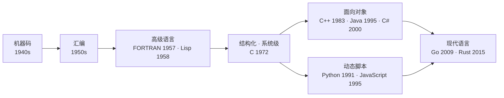

# 第 01 章 · 编程语言发展史

**简体中文** ｜ [English](./01-programming-history.en-US.md)

---

> 这是全书的第一章。在深入任何一门语言之前，我们先站到高处，看看编程语言这一路是怎么走过来的——因为只有理解了"它们为什么会变成今天这样"，后面每一个看似奇怪的设计，你才会觉得"原来如此"。

## 1. 学习目标

本章结束后，你将能够：

- 用一条主线——**抽象层级的不断提升**——串起整部编程语言史；
- 说清每一次范式跃迁（机器码 → 汇编 → 高级语言 → 面向对象 → 动态/托管 → 现代语言）分别解决了上一代的什么痛点；
- 把本书的六门语言（JavaScript、Python、Java、C++、C#、SQL）放回历史坐标，理解它们"从哪里来、为何如此设计"；
- 破除几个关于"新旧语言优劣"的常见误解。

---

## 2. 为什么会出现（核心问题）

> **核心问题：计算机只认识 0 和 1，为什么我们不直接写 0 和 1？为什么世界上会有上千种编程语言？**

计算机硬件只做一件事：执行二进制指令。但人脑并不擅长读写二进制。于是，整部编程语言史，本质上就是一部“**如何让人更省力地指挥机器**”的历史。

每一代语言，都在两个互相拉扯的目标之间寻找新的平衡点：

- **贴近机器**——追求性能、控制力、对硬件的精确掌控；
- **贴近人**——追求可读性、可维护性、可移植性、开发效率。

语言之所以有千百种，正是因为不同领域对这个平衡点的要求不同：操作系统内核要极致的控制，数据分析要极致的表达效率，网页要跨平台的分发能力。**没有"最好"的语言，只有"针对某个平衡点最合适"的语言。** 这个判断会贯穿全书。

---

## 3. 历史脉络

下面按时间顺序，看每一次跃迁**解决了上一代的什么痛点**。

- **1940s · 机器码（Machine Code）**
  直接书写二进制指令（或用打孔卡）。这是唯一"原生"的语言。
  *痛点*：几乎无法阅读、极易出错、完全绑定具体机器，换一台机器就要重写。

- **1950s · 汇编语言（Assembly）**
  用助记符（如 `MOV`、`ADD`）代替二进制，由**汇编器**翻译成机器码。
  *进步*：可读性迈出第一步。*遗留痛点*：仍与具体 CPU 指令集一一对应，不可移植。

- **1957 · FORTRAN**（John Backus / IBM）
  第一门被广泛使用的**高级语言**：可以写接近数学的表达式，由**编译器**翻译成机器码。紧随其后，**Lisp**（1958，John McCarthy）带来了函数式思想与自动内存管理的雏形，**COBOL**（1959）面向商业数据处理，**ALGOL**（1958/1960）奠定了结构化与块作用域。
  *痛点解决*：终于摆脱具体硬件，表达力大幅提升。

- **1972 · C**（Dennis Ritchie / Bell Labs）
  在"高级表达"与"贴近硬件"之间取得了惊人的平衡：既能写系统级代码，又是可移植的。它后来成为无数语言的底座——包括本书里 Python、JavaScript 的主流实现，本身就是用 C 写的。

- **面向对象浪潮**
  当程序越来越大，"如何管理复杂度"成了新痛点。**C++**（1983，Bjarne Stroustrup；前身"C with Classes"始于 1979）在 C 之上加入类与抽象；**Java**（1995，James Gosling / Sun）用 JVM 字节码实现"一次编写，到处运行"，并内置垃圾回收（GC）；**C#**（2000，Anders Hejlsberg / Microsoft）在 .NET/CLR 上提供了类似的托管模型。
  *痛点解决*：大型软件的复杂度管理，以及内存安全。

- **动态脚本浪潮**
  与此同时，另一支追求"开发效率优先"的语言崛起。**Python**（1991，Guido van Rossum）以可读性和表达力为先；**JavaScript**（1995，Brendan Eich，据说原型只花了 10 天）为浏览器而生。
  *痛点解决*：快速开发、脚本化、粘合系统、网页交互。

- **声明式与数据**
  数据领域走了另一条路。基于 E. F. Codd 1970 年提出的关系模型，**SQL**（前身 SEQUEL 1974，1986 年成为 ANSI 标准）让你只需描述“**要什么**”，由数据库引擎决定“**怎么取**”。

- **现代语言**
  新的痛点是并发、内存安全与开发者体验。**Go**（2009，Google）主打简洁与并发；**Rust**（1.0 于 2015）用所有权系统在**没有 GC** 的前提下实现内存安全；**Kotlin**、**Swift** 等则在既有生态上做现代化改良。

> ⚠️ **一个重要提醒**：真实的语言演进不是一条直线，而是一张互相借鉴的网。C 影响了几乎所有后来者；Lisp 的许多思想被后世反复"重新发现"。本章用"抽象层级"这条主线来组织，是**为了便于理解**，而不是断言历史是线性的。

---

## 4. 它到底是什么 · 底层主线

把整部历史压成一句话：**编程语言，是"抽象"与"权衡"的产物。**

每上升一个抽象层级，你就把更多细节**交给编译器或运行时代管**——寄存器分配、内存回收、跨平台适配——从而换来生产力；代价通常是更少的底层控制，或一定的运行时开销。

在这条主线上，逐渐分化出三种主要的"执行方式"（后面几章会分别拆开细讲）：

| 执行方式 | 做法 | 代表 | 权衡 |
|---------|------|------|------|
| **编译为原生码** | 直接生成机器码 | C / C++ | 快、控制强；跨平台需重新编译 |
| **解释执行** | 由解释器逐条执行 | 传统的 Python / JavaScript | 灵活、可移植、开发快；通常更慢 |
| **托管 / 虚拟机** | 编译成中间字节码，由 VM 执行 | Java（JVM）/ C#（CLR） | 跨平台 + 自动内存管理；有 VM 开销 |

> 现实中这三者的界限越来越模糊：JavaScript 有 V8 的即时编译（JIT），Python 也先编译成字节码再解释。这些"混合"正是后续章节（02 编译器、03 解释器、04 虚拟机、05 运行时）要逐一拆解的。

---

## 5. 关键概念与术语

- **抽象层级（Abstraction Level）**：语言离机器有多远、离人有多近。越"高级"越贴近人。
- **可移植性（Portability）**：同一份代码能否在不同机器/平台上运行。
- **编译型 / 解释型 / 托管型**：三种主要的执行方式（见上表）。
- **编程范式（Paradigm）**：组织代码的思维方式——命令式、面向对象、函数式、声明式。
- **高级 / 低级语言**：相对而言的描述，**不含褒贬**——"低级"指更贴近机器，不代表更差。

---

## 6. 在本书六门语言中的体现

把本书的六门语言放回这条脉络，按诞生年代排序：

| 语言 | 诞生年代 | 抽象层级 | 主要范式 | 执行方式 |
|------|:-------:|:-------:|---------|---------|
| **SQL** | 1974 / 1986 标准 | 高 | 声明式 · 关系 | 查询引擎解析优化后执行 |
| **C++** | 1983 | 低—中 | 多范式（过程/OOP/泛型） | 编译为原生机器码 |
| **Python** | 1991 | 高 | 多范式（OOP/过程/函数式） | 编译成字节码 + 解释执行（CPython） |
| **Java** | 1995 | 中—高 | 以 OOP 为主 | 字节码 + JVM 托管执行（JIT） |
| **JavaScript** | 1995 | 高 | 多范式（原型 OOP/函数式） | 引擎 JIT 执行（如 V8） |
| **C#** | 2000 | 中—高 | 多范式（OOP/函数式） | 编译为 IL + CLR 托管执行（JIT） |

一句话把它们各自的"历史站位"说清楚：

- **SQL** 站在**声明式**这条独立分支上——它几乎不关心"怎么做"，只关心"要什么"。
- **C++** 站在"**贴近机器 + 面向对象**"的交汇点，是"既要控制又要抽象"的极致代表。
- **Java / C#** 是"**托管 OOP**"的代表——用虚拟机换来跨平台与内存安全。
- **Python / JavaScript** 是"**动态脚本**"的代表，如今又借 JIT 与类型标注（TypeScript、Python 的类型注解）向工程化回靠。

理解了它们分别站在历史的哪一环，你就会明白：本书后面每一章的"横向对比"，本质上是在对比**这几条不同分支各自的取舍**。

---

## 7. 常见误解

- **误解一："越新的语言越好。"**
  语言是权衡，不是进化排名。C 诞生五十余年，至今仍是操作系统、嵌入式领域的基石。

- **误解二："高级语言一定慢。"**
  取决于场景与实现。JIT 和优化编译器让差距不断缩小；而且大量性能瓶颈其实在**算法与 I/O**，而非语言本身。

- **误解三："学会最流行的那门语言就够了。"**
  流行度会随时间变化（本书绪论对比过多个榜单）。**概念才是长期资产**，语法和生态是可以快速替换的表层。

- **误解四："编译型和解释型是非此即彼。"**
  现代语言大多是混合的（字节码 + JIT）。这个二分法只是入门时的近似。

- **误解五："汇编 / C 已经过时了。"**
  在内核、嵌入式、高性能计算、安全与逆向领域，它们依然不可替代。

---

## 8. 思考题

1. 为什么 C 语言诞生五十余年，至今仍被广泛使用？它守住了历史上的哪个"平衡点"？
2. 如果让你设计一门"2030 年代"的新语言，你会把它放在"贴近机器 ↔ 贴近人"光谱的哪个位置？为什么？
3. JavaScript 与 Java 同在 1995 年诞生，名字也相似，为什么它们的设计目标与命运如此不同？

---

## 9. 本章小结

**一句话总结**：编程语言史，是一部不断提升抽象层级、在"贴近机器"与"贴近人"之间反复权衡的历史；本书的六门语言，正是这段历史不同分支上的代表。

**检查清单**（能回答就算掌握）：

- [ ] 我能按顺序说出从机器码到现代语言的几次关键跃迁，以及各自解决的痛点。
- [ ] 我能用"抽象层级"这条主线解释语言为什么会演进。
- [ ] 我能把六门语言放进"诞生年代 / 抽象层级 / 范式 / 执行方式"的坐标里。
- [ ] 我能反驳"越新越好""高级语言一定慢"这类说法。

**下一章预告**：我们说语言是为了"指挥机器"。那么退一步问——**程序到底是什么？一段代码是怎么变成 CPU 的动作的？** 这就是第 02 章的主题。

---

## 10. 延伸阅读

- <a href="https://craftinginterpreters.com/" target="_blank" rel="noopener">《Crafting Interpreters》（Robert Nystrom）</a> — 亲手实现一门语言，理解“语言是如何运行的”。
- <a href="https://sarabander.github.io/sicp/" target="_blank" rel="noopener">《Structure and Interpretation of Computer Programs（SICP）》</a> — 编程思想的经典（免费在线 HTML5 版）。
- <a href="https://csapp.cs.cmu.edu/" target="_blank" rel="noopener">《Computer Systems: A Programmer's Perspective（CSAPP）》</a> — 从硬件视角理解程序如何执行。
- <a href="https://en.wikipedia.org/wiki/History_of_programming_languages" target="_blank" rel="noopener">Wikipedia：History of programming languages</a> — 查阅时间线的索引。
