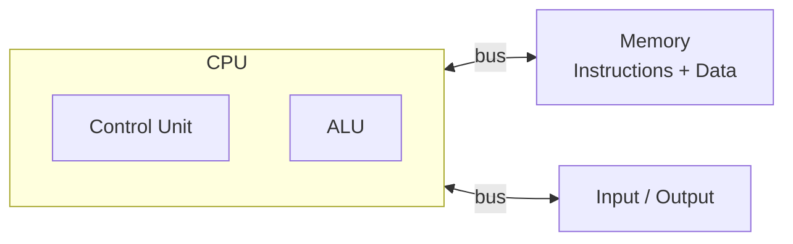
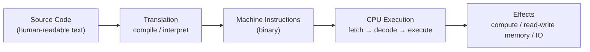

# Chapter 02 · What is a Program

[简体中文](./02-what-is-a-program.md) ｜ **English**

---

> In the last chapter we said a programming language exists to "let humans command machines with less effort." This chapter steps back and asks a more fundamental question: what makes those lines of code we write actually get a computer to *do* something? What, really, is a program?

## 1. Learning Objectives

By the end of this chapter, you will be able to:

- State the essence of a program in one sentence: **a program = instructions + data**;
- Explain what stages a piece of source code passes through, "from text to CPU action";
- Understand the **von Neumann architecture** and the **stored-program** idea, and why "instructions are also data" was revolutionary;
- Distinguish a **program (static)** from a **process (a running instance)**;
- Build a mental map of "source code → translation → machine instructions → CPU execution" as groundwork for Chapters 03–06.

---

## 2. Why It Emerged (the Core Question)

> **Core question: what makes a piece of "text" able to drive a slice of silicon to compute? And what exactly does "program" refer to?**

Computation itself is ancient — the abacus and gear-based calculators could compute. But each such machine could only do one fixed thing: to make it do something else, you had to build a new one or rewire it. The real leap came from an idea: **what if a machine could read an "instruction sheet," and do whatever the sheet says?** That machine-readable, sequentially-executed "instruction sheet" is a **program**.

The question then becomes three: where does the sheet live, what does it look like, and how does the machine follow it one line at a time? "Stored program + fetch-execute" — this chapter's core — is the answer to all three.

---

## 3. The Historical Thread

- **1936 · The Turing Machine**: Alan Turing's abstract model, which used "a read/write tape + finite states" to define "what is computable." It is not a real machine, yet it answered a fundamental question — **there exists a universal machine that can simulate any other computation** (the universal Turing machine). This provides the theoretical basis for "one machine running different programs."

- **1945 · The von Neumann Architecture**: In the *First Draft of a Report on the EDVAC*, von Neumann laid out the **stored-program** idea — put **instructions and data in the same memory**, and have the machine fetch instructions from memory and execute them one by one.
  - Before this, early computers like ENIAC had to be **rewired by hand** (hard-wired) to change tasks, taking days.
  - With stored programs, "changing the program" became "loading a new piece of data into memory" — because **instructions are themselves data**. For the first time, a program became loadable, modifiable, and storable.

- Ever since, nearly all general-purpose computers follow this structure: the `CPU` (control unit + ALU) connects via a bus to `memory` (holding `instructions + data`) and to `input/output`.

> "Instructions and data live in the same memory" is the one line to remember from this chapter. It brought universality (change the program = change the data), and also sowed the seeds of many later stories — such as the security holes that arise from executing data as instructions.

---

## 4. What It Really Is · The Underlying Thread

In one sentence: **a program = an ordered sequence of instructions, plus the data it operates on.**

But note carefully: **the source code you write is not what the CPU actually executes at runtime.** Source code is merely **text** for humans; the CPU only understands **machine instructions** (binary encodings under a specific CPU instruction set). A "translation" must happen in between:

The way a CPU works is a never-ending loop — **fetch-decode-execute**:

1. **Fetch**: using the address the "program counter" points to, fetch the next instruction from memory;
2. **Decode**: figure out what the instruction is asking for;
3. **Execute**: actually carry it out (add, read/write memory, jump…), then the program counter advances and we return to step 1.

Finally, distinguish two concepts that are most often confused:

- **Program**: static instructions + data sitting on disk (a file — an executable, a `.py`, a `.jar`).
- **Process**: the **running instance** of a program loaded into memory. It has its own memory space, program counter, stack, and heap. The same program can run as multiple processes at once.

An analogy: a program is a **recipe**; a process is **this particular time you are cooking from that recipe**.

---

## 5. Key Concepts and Terms

- **Instruction**: the smallest operation a CPU can execute directly.
- **Machine Code**: the binary encoding of instructions, bound to a specific CPU instruction set (ISA).
- **CPU / Memory**: the executor / the place that holds instructions and data.
- **Stored-Program**: the idea of keeping instructions and data together in memory.
- **Von Neumann Architecture**: the classic computer structure based on stored programs.
- **Fetch-Decode-Execute**: the CPU's basic working loop.
- **Program / Process**: a static file / a running instance.
- **Executable**: a machine-code file the operating system can load and run directly.

---

## 6. How This Shows Up in the Book's Six Languages

The concept of a "program" holds for all six languages, but the path they take **from source code to CPU execution** differs:

| Language | Source code first becomes | Who ultimately executes it |
|----------|---------------------------|----------------------------|
| JavaScript | engine-internal bytecode | a JS engine, interpreting + JIT (e.g. V8) |
| Python | bytecode `.pyc` | the CPython VM, interpreting instruction by instruction |
| Java | bytecode `.class` | the JVM (JIT-compiles to machine code, then runs) |
| C++ | a machine-code executable | the OS loads it; the CPU runs it directly |
| C# | intermediate language (IL) | the CLR (JIT execution) |
| SQL | a query execution plan | the database engine |

Notice: C++ is the most "direct" — source compiles straight to machine code the CPU can run; Java / C# add a virtual-machine layer; Python / JavaScript hand off to an interpreter or engine; and SQL doesn't even describe "how to do it," only "what you want," leaving the engine to decide the execution plan.

**These differences are exactly the subjects of the next four chapters**: `03 Compiler` (how source becomes machine code), `04 Interpreter` (how it runs without compiling), `05 Virtual Machine` (the JVM / CLR layer), and `06 Runtime` (what the runtime does for you behind the scenes).

---

## 7. Common Misconceptions

- **"Source code is the program."** Source code is just text; to become something the CPU can execute, it must be compiled or interpreted.
- **"At runtime the CPU runs the exact characters I wrote."** At runtime the CPU executes machine instructions, not your characters.
- **"A program and a process are the same thing."** A program is a static file; a process is its running instance — one program can map to many processes.
- **"The CPU can directly understand Python / JavaScript."** The CPU only understands the machine code of its own instruction set; every high-level language goes through a translation layer.
- **"Only compiled languages count as 'real' programs; scripts don't."** They are all programs — the only difference is *when* and *by whom* the translation happens.

---

## 8. Questions to Ponder

1. Why is "stored program (instructions are data)" considered one of the most crucial ideas in computing history? If instructions and data had to be stored separately and instructions could never be read/written as data, what would we lose?
2. Can one and the same compiled artifact of a single C++ source file run directly on both an x86 and an ARM CPU? Why? What about Java?
3. When you type `python app.py` in a terminal, what forms does the "program" pass through between that moment and the result appearing on screen?

---

## 9. Summary

**In one sentence**: a program is "instructions + data"; source code is merely text for humans, which must be translated into machine instructions and then run by the CPU in a "fetch-decode-execute" loop — and the running instance of it is called a process.

**Checklist**:

- [ ] I can explain "a program = instructions + data," and why source code is not what the CPU executes directly.
- [ ] I can explain the stored-program idea and why "instructions are data" was revolutionary.
- [ ] I can describe the CPU's fetch-decode-execute loop.
- [ ] I can distinguish a program from a process and give an example of each.

**Next chapter**: Since source code must be "translated" into machine code, the first kind of translation is to **translate the entire source ahead of time, all at once** — that is Chapter 03, "Compiler."

---

## 10. Further Reading

- <a href="https://www.charlespetzold.com/code/" target="_blank" rel="noopener">*Code: The Hidden Language of Computer Hardware and Software* (Charles Petzold)</a> — builds up from relays to a computer, explaining "how a program runs" with rare clarity.
- <a href="https://csapp.cs.cmu.edu/" target="_blank" rel="noopener">*Computer Systems: A Programmer's Perspective (CSAPP)*, Chapter 1</a> — the life of a program in a system, from a programmer's view.
- <a href="https://en.wikipedia.org/wiki/Von_Neumann_architecture" target="_blank" rel="noopener">Wikipedia: Von Neumann architecture</a> — the architecture and the stored-program idea.
- <a href="https://en.wikipedia.org/wiki/Stored-program_computer" target="_blank" rel="noopener">Wikipedia: Stored-program computer</a> — the origins of "instructions are data."
