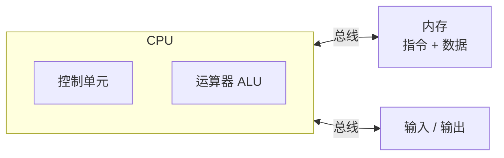
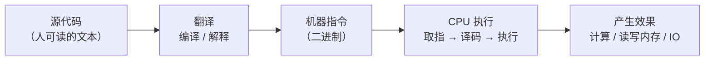

# 第 02 章 · 程序是什么

**简体中文** ｜ [English](./02-what-is-a-program.en-US.md)

---

> 上一章我们说，编程语言是为了"让人更省力地指挥机器"。这一章往回退一步，问一个更根本的问题：我们写下的那一行行代码，凭什么能让计算机真的"动"起来？程序，到底是什么？

## 1. 学习目标

本章结束后，你将能够：

- 用一句话说清程序的本质：**程序 = 指令 + 数据**；
- 讲清一段源代码"从文本到 CPU 动作"要经过哪些环节；
- 理解**冯·诺依曼架构**与**存储程序**思想，明白"指令也是数据"为何是革命性的；
- 区分**程序（静态）**与**进程（运行中的实例）**；
- 建立一张"源代码 → 翻译 → 机器指令 → CPU 执行"的心智地图，为后面 03–06 章打底。

---

## 2. 为什么会出现（核心问题）

> **核心问题：一段"文本"凭什么能驱动一块硅片完成计算？"程序"到底指的是什么？**

计算这件事本身很古老——算盘、齿轮计算器都能算。但它们每台只会算固定的东西：想让机器做另一件事，就得重新造一台，或者重新接线。真正的飞跃来自一个想法：**能不能让机器读一份"说明书"，说明书写什么，它就做什么？** 这份能被机器读取、按顺序执行的"说明书"，就是**程序**。

于是问题变成三个：说明书放在哪、长什么样、机器怎么一条条照着做？本章要讲的"存储程序 + 取指执行"，正是对这三个问题的回答。

---

## 3. 历史脉络

- **1936 · 图灵机**：Alan Turing 提出的抽象模型，用"读写纸带 + 有限状态"定义了"什么是可计算的"。它不是一台真机器，却回答了一个根本问题——**存在一种通用机器，能模拟任何其他计算过程**（通用图灵机）。这为"一台机器跑不同程序"提供了理论依据。

- **1945 · 冯·诺依曼架构**：在《First Draft of a Report on the EDVAC》中，von Neumann 系统阐述了**存储程序（stored-program）**思想——把**指令和数据放进同一块内存**，机器从内存里逐条取出指令来执行。
  - 在此之前，像 ENIAC 这样的早期计算机想换个任务，得**手动重新接线**（硬连线），耗时数天。
  - 有了存储程序，"换程序"就变成了"往内存里装一份新数据"——因为**指令本身就是数据**。程序第一次变得可加载、可修改、可存储。

- 从此，几乎所有通用计算机都遵循这个结构：`CPU`（控制器 + 运算器）通过总线，与存放`指令 + 数据`的`内存`以及`输入/输出`相连。

> "指令和数据放在同一块内存"是本章最该记住的一句话。它带来了通用性（换程序 = 换数据），也埋下了后世的许多故事——比如把数据当成指令执行所引发的安全漏洞。

---

## 4. 它到底是什么 · 底层主线

一句话：**程序 = 一段有序的指令序列，外加它所操作的数据。**

但要特别注意：**你写的源代码，并不是程序运行时 CPU 真正执行的东西。** 源代码只是给人看的**文本**；CPU 只认识**机器指令**（特定 CPU 指令集下的二进制编码）。中间必须有一次"翻译"：

CPU 干活的方式，是一个永不停歇的循环——**取指-译码-执行（fetch-decode-execute）**：

1. **取指**：按"程序计数器"指向的地址，从内存取出下一条指令；
2. **译码**：搞清楚这条指令要做什么；
3. **执行**：真正执行（做加法、读写内存、跳转……），随后程序计数器前进，回到第 1 步。

最后，区分两个最常被混淆的概念：

- **程序（Program）**：静态的、躺在磁盘上的指令 + 数据（一个文件，如可执行文件、`.py`、`.jar`）。
- **进程（Process）**：程序被加载进内存、正在运行的**实例**。它有自己的内存空间、程序计数器、栈与堆。同一个程序可以同时跑成多个进程。

一句类比：程序是**菜谱**，进程是**正在照着这份菜谱做菜的这一次**。

---

## 5. 关键概念与术语

- **指令（Instruction）**：CPU 能直接执行的最小操作单位。
- **机器码（Machine Code）**：指令的二进制编码，绑定具体 CPU 指令集（ISA）。
- **CPU / 内存**：执行者 / 存放指令与数据的地方。
- **存储程序（Stored-Program）**：把指令与数据同存于内存的思想。
- **冯·诺依曼架构（Von Neumann Architecture）**：基于存储程序的经典计算机结构。
- **取指-译码-执行（Fetch-Decode-Execute）**：CPU 的基本工作循环。
- **程序 / 进程（Program / Process）**：静态文件 / 运行中的实例。
- **可执行文件（Executable）**：可被操作系统直接加载运行的机器码文件。

---

## 6. 在本书六门语言中的体现

"程序"这个概念对六门语言都成立，但它们**从源代码到 CPU 执行**所走的路各不相同：

| 语言 | 源代码先变成 | 最终由谁执行 |
|------|-------------|-------------|
| JavaScript | 引擎内部字节码 | JS 引擎解释 + JIT（如 V8） |
| Python | 字节码 `.pyc` | CPython 虚拟机逐条解释 |
| Java | 字节码 `.class` | JVM（JIT 编成机器码后执行） |
| C++ | 机器码可执行文件 | 操作系统加载，CPU 直接执行 |
| C# | 中间语言 IL | CLR（JIT 执行） |
| SQL | 查询执行计划 | 数据库引擎 |

可以看到：C++ 最"直接"，源码直接编成 CPU 能跑的机器码；Java / C# 中间多了一层虚拟机；Python / JavaScript 交给解释器或引擎；而 SQL 甚至不描述"怎么做"，只描述"要什么"，由引擎自行决定执行计划。

**这些差异，正是接下来四章的主题**：`03 编译器`（怎么把源码编成机器码）、`04 解释器`（不编译怎么跑）、`05 虚拟机`（JVM / CLR 那一层）、`06 运行时`（运行时在背后替你做的事）。

---

## 7. 常见误解

- **"源代码就是程序。"** 源代码只是文本；要变成 CPU 能执行的东西，中间必须经过编译或解释。
- **"程序运行时跑的就是我写的那几行字。"** 运行时 CPU 执行的是机器指令，不是你的字符。
- **"程序和进程是一回事。"** 程序是静态文件，进程是它运行起来的实例；一个程序可以对应多个进程。
- **"CPU 能直接看懂 Python / JavaScript。"** CPU 只懂自己指令集的机器码；任何高级语言都要先经过翻译层。
- **"只有编译型语言才算真程序，脚本不算。"** 它们都是程序——区别只在于"何时、由谁完成翻译"。

---

## 8. 思考题

1. 为什么"存储程序（指令即数据）"被认为是计算机史上最关键的思想之一？如果规定指令和数据必须分开存放、且指令不可被当作数据读写，我们会失去什么？
2. 同一份 C++ 源代码，在 x86 与 ARM 两种 CPU 上，能否用同一个编译产物直接运行？为什么？换成 Java 又如何？
3. 你在终端敲下 `python app.py`，从这一刻到屏幕出现结果，"程序"中间经历了哪些形态变化？

---

## 9. 本章小结

**一句话总结**：程序是"指令 + 数据"；源代码只是给人看的文本，必须经过翻译变成机器指令，再由 CPU 以"取指-译码-执行"的循环运行——而运行起来的那个实例，叫进程。

**检查清单**：

- [ ] 我能解释"程序 = 指令 + 数据"，以及源代码为什么不是 CPU 直接执行的东西。
- [ ] 我能讲清存储程序思想，以及"指令即数据"为何革命性。
- [ ] 我能描述 CPU 的取指-译码-执行循环。
- [ ] 我能区分程序与进程，并各举一例。

**下一章预告**：既然源代码必须被"翻译"成机器码，那么第一种翻译方式，就是**把整份源码提前一次性译好**——这就是第 03 章「编译器」。

---

## 10. 延伸阅读

- <a href="https://www.charlespetzold.com/code/" target="_blank" rel="noopener">《Code: The Hidden Language of Computer Hardware and Software》（Charles Petzold）</a> — 从继电器一路搭到计算机，把"程序如何运行"讲得极通透。
- <a href="https://csapp.cs.cmu.edu/" target="_blank" rel="noopener">《Computer Systems: A Programmer's Perspective（CSAPP）》第 1 章</a> — 从程序员视角看一个程序在系统中的一生。
- <a href="https://en.wikipedia.org/wiki/Von_Neumann_architecture" target="_blank" rel="noopener">Wikipedia：Von Neumann architecture</a> — 冯·诺依曼架构与存储程序思想。
- <a href="https://en.wikipedia.org/wiki/Stored-program_computer" target="_blank" rel="noopener">Wikipedia：Stored-program computer</a> — "指令即数据"的来龙去脉。
