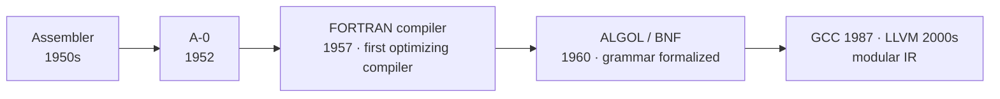
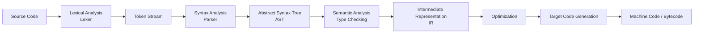
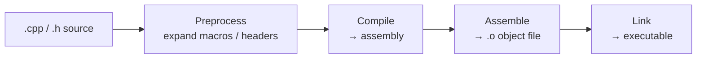

# Chapter 03 · Compiler

[简体中文](./03-compiler.md) ｜ **English**

---

> In the last chapter we said: source code is just text and must be "translated" into machine instructions before the CPU can execute it. Translation comes in two basic strategies; the first is to **translate the whole source ahead of time, all at once** — that is the compiler. This chapter opens it up: what exactly does a compiler do to your code?

## 1. Learning Objectives

By the end of this chapter, you will be able to:

- State a compiler's job: translate high-level source code, **in bulk**, into target code (machine code or bytecode);
- Recite the classic compilation pipeline: **lexical analysis → syntax analysis → semantic analysis → intermediate code → optimization → target code generation**;
- Understand the engineering value of separating a compiler's **front end / back end**;
- Explain the full C/C++ build chain: **preprocess → compile → assemble → link**;
- Understand the trade-offs of being "compiled": fast at runtime, errors caught early, but requiring recompilation per platform and a longer development loop.

---

## 2. Why It Emerged (the Core Question)

> **Core question: the CPU only understands machine code, yet we want to write in a high-level language. Can this "translation" work be done once, ahead of time, instead of re-translating on every run?**

Translating each line on the fly, every time, is slow and wasteful. A natural idea: **before the program runs, translate the entire source into machine code, then just run the translated result at runtime.** The program that does this is the **compiler**.

It has to satisfy three demands at once: give humans the **expressiveness** of a high-level language, give the machine directly-executable **machine code**, and push the translation cost **before runtime** as much as possible (trading it for runtime speed).

---

## 3. The Historical Thread

- **Early 1950s · Assembler**: the earliest "translator," mapping assembly mnemonics almost one-to-one to machine code. It proved that "let the machine translate for us" was feasible.
- **1952 · A-0**: developed by Grace Hopper, often regarded as the earliest compiler prototype (closer to a linker/loader), making "write in symbols, let the machine translate" a reality for the first time.
- **1957 · The FORTRAN compiler**: led by John Backus (IBM) — the first successful **optimizing compiler**. Its generated code was efficient enough to dispel the then-common fear that "high-level languages must be slow." A watershed in compiler history.
- **1960 · ALGOL 60 and BNF**: Backus-Naur Form gave a **formal description of grammar**, putting parsing on a theoretical footing and giving rise to modern compiler theory.
- **1986 · The Dragon Book**: *Compilers: Principles, Techniques, and Tools* systematized the teaching of compiler theory.
- **1987 · GCC / 2000s · LLVM**: GCC became the cornerstone of open-source compilers; LLVM reshaped compiler architecture around a modular **intermediate representation (IR)**, making "many languages × many platforms" reuse the norm.

---

## 4. What It Really Is · The Underlying Thread

**A compiler is a program: it translates one language (the source language) wholesale into another (the target language, usually machine code or bytecode).** The keywords are "wholesale, ahead of time" — the translation completes once, before running.

The classic compilation pipeline is this chain:

- **Lexical analysis**: slice the character stream into meaningful smallest units (Tokens), such as `int`, `age`, `=`, `18`.
- **Syntax analysis**: organize the Tokens by grammar rules into an **abstract syntax tree (AST)**, expressing "what belongs to what."
- **Semantic analysis**: check that it "makes sense" — types match, variables are declared, functions get the right number of arguments.
- **IR → optimization → code generation**: first convert to a machine-independent intermediate form, apply optimizations (constant folding, dead-code elimination…), then emit machine code for the target machine.

An important engineering split is **front end / back end**:

- the **front end** (lexing, parsing, semantics) depends only on the **source language**;
- the **back end** (optimization, code generation) depends only on the **target machine**.

So N languages each need one front end, M platforms each need one back end, and, joined through a shared IR, they combine into N×M compilation capabilities — exactly LLVM's strength.

> ⚠️ **Note**: this "front end / back end" has nothing to do with web development's "front end (browser UI) / back end (server)" — it just borrows the same words. A compiler's **front end** is the side close to the **source code** (it reads and understands your code); the **back end** is the side close to the **target machine** (it generates machine code).

For a purely compiled language (like C++), "translation" is more than the compile step alone. The full build chain is:

---

## 5. Key Concepts and Terms

- **Compiler**: a program that translates a source language wholesale into a target language.
- **Source language / Target language**: the input / output of translation (target is usually machine code or bytecode).
- **Lexical analysis / Token**, **Syntax analysis / AST**, **Semantic analysis / type checking**: the first stages of the pipeline.
- **Intermediate Representation (IR)**: a machine-independent interim form, easing optimization and reuse.
- **Optimization**, **Code Generation**: turning IR into efficient target code.
- **Front end / Back end**: the source-language-dependent part / the target-machine-dependent part.
- **Assembler**, **Linker**: assembly → object file, object files → executable.
- **AOT (Ahead-Of-Time)**: compiling before running; its counterpart is JIT (Chapter 06).
- **Cross-Compile**: compiling on one platform to produce an artifact that runs on another.

---

## 6. How This Shows Up in the Book's Six Languages

"Compilation" is actually everywhere; the six languages differ only in **what** they compile to and **when**:

| Language | Compilation output | Compiler · Timing |
|----------|--------------------|-------------------|
| JavaScript | engine-internal bytecode / machine code | a JS engine, **at runtime** via JIT (e.g. V8) |
| Python | bytecode `.pyc` | CPython's built-in compiler, **implicitly before running** |
| Java | bytecode `.class` | `javac` **ahead of time** + JVM runtime JIT (two-stage) |
| C++ | machine code | `g++` / `clang++`, **ahead of time** (AOT) |
| C# | intermediate language (IL) | `csc` / Roslyn **ahead of time** + CLR runtime JIT (two-stage) |
| SQL | a query execution plan | the database's query compiler / optimizer, **at runtime** |

- **C++** represents "pure AOT to machine code": the output is an executable the CPU runs directly.
- **Java / C#** are "two-stage": AOT-compiled to **bytecode / IL** first, then JIT-compiled to machine code by a virtual machine at runtime.
- **Python / JavaScript** are often called "interpreted," but they too have a compile step — they just **implicitly** compile source to bytecode for a VM / engine.
- **SQL**'s "compilation" is **query optimization**: compiling a declarative query into an efficient execution plan.

So the difference is not "compiler or not," but **what it compiles to and when**. These timing differences are exactly what the next three chapters unpack: `04 Interpreter` (translate-as-you-go), `05 Virtual Machine` (the bytecode layer), and `06 Runtime` (runtime JIT).

---

## 7. Common Misconceptions

- **"Compiling just turns code into machine code, in one step."** There are steps like linking too; and many languages compile to bytecode, not machine code.
- **"A compiled language has no translation at runtime."** True for pure AOT (C++); but Java / C# / JS keep compiling at runtime via JIT.
- **"Compiling is just translation."** It also includes heavy optimization and error checking (syntax, types) — many bugs are stopped at compile time.
- **"Python / JavaScript are interpreted, so they have no compiler."** They also compile to bytecode first; that step is just implicit and targets a VM / engine.
- **"Higher optimization level is always better."** Optimization has costs: slower compiles, harder debugging, and some aggressive optimizations can change edge-case behavior.

---

## 8. Questions to Ponder

1. By separating "front end" from "back end," how much duplicate work does a compiler save when supporting "N languages × M platforms"? Why is the intermediate representation (IR) the key to this design?
2. Why does changing one C++ header often trigger recompiling many files, while changing one line of Python takes effect almost instantly? How does this relate to "when compilation happens"?
3. Which errors can be caught at compile time, and which only at runtime? Give one example of each, and say how this affects your choice of language.

---

## 9. Summary

**In one sentence**: before running, a compiler translates the entire source in bulk along the "lexing → parsing → semantics → IR → optimization → code generation" pipeline; it trades a one-time compilation cost for runtime speed and earlier error detection.

**Checklist**:

- [ ] I can name the main stages of the compilation pipeline in order and explain what each does.
- [ ] I can explain the benefit of front-end / back-end separation and the role of IR.
- [ ] I can describe the four steps of C/C++: preprocess → compile → assemble → link.
- [ ] I can point out how the six languages differ in "compilation target / timing."

**Next chapter**: the compiler chooses to "translate everything ahead of time." But what if we flip it — **don't translate ahead; read a line, translate it, run it**? That is Chapter 04, "Interpreter."

---

## 10. Further Reading

- <a href="https://craftinginterpreters.com/" target="_blank" rel="noopener">*Crafting Interpreters* (Robert Nystrom)</a> — implement lexing, parsing, and bytecode compilation by hand: the best way to understand this pipeline.
- <a href="https://en.wikipedia.org/wiki/Compilers:_Principles,_Techniques,_and_Tools" target="_blank" rel="noopener">*Compilers: Principles, Techniques, and Tools* (the "Dragon Book")</a> — the classic textbook on compiler theory.
- <a href="https://llvm.org/" target="_blank" rel="noopener">The LLVM Project</a> — the representative modern, modular compiler infrastructure and IR.
- <a href="https://en.wikipedia.org/wiki/Compiler" target="_blank" rel="noopener">Wikipedia: Compiler</a> — an overview of the compiler concept and history.
