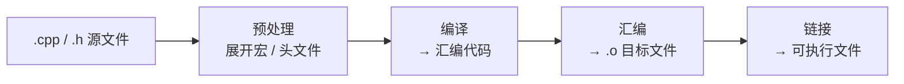

# 第 03 章 · 编译器

**简体中文** ｜ [English](./03-compiler.en-US.md)

---

> 上一章我们说：源代码只是文本，必须"翻译"成机器指令才能被 CPU 执行。翻译有两种基本策略，第一种是**提前把整份源码一次性译好**——这就是编译器（Compiler）。这一章我们拆开看：编译器到底对你的代码做了什么。

## 1. 学习目标

本章结束后，你将能够：

- 说清编译器的职责：把高级语言源代码**成批地**翻译成目标代码（机器码或字节码）；
- 复述编译的经典流水线：**词法分析 → 语法分析 → 语义分析 → 中间代码 → 优化 → 目标代码生成**；
- 理解编译器**前端 / 后端**分离的工程意义；
- 说清 C/C++ 的完整构建链：**预处理 → 编译 → 汇编 → 链接**；
- 理解"编译型"的取舍：运行快、错误发现早，但需针对平台重新编译、开发循环更长。

---

## 2. 为什么会出现（核心问题）

> **核心问题：CPU 只懂机器码，而我们想用高级语言写。这份"翻译"的活儿，能不能提前一次性做完，而不是每次运行都现翻？**

如果每执行一行都临时翻译一次，既慢又浪费。一个自然的想法是：**在程序运行之前，把整份源代码完整地翻译成机器码，之后运行时直接跑翻译好的结果。** 干这件事的程序，就是**编译器**。

它要同时满足三个诉求：让人享受高级语言的**表达力**、让机器拿到可直接执行的**机器码**、并且尽量把翻译成本压在**运行之前**（换取运行时的速度）。

---

## 3. 历史脉络

- **1950s 初 · 汇编器（Assembler）**：最早的"翻译器"，把汇编助记符几乎一对一地翻成机器码。它证明了"让机器帮我们翻译"是可行的。
- **1952 · A-0**：Grace Hopper 开发，常被视为最早的编译器雏形（更接近链接/装载器），第一次让"用符号写、由机器翻译"成为现实。
- **1957 · FORTRAN 编译器**：John Backus 领导（IBM）——第一个成功的**优化编译器**。它生成的代码效率足够高，直接打消了当时"高级语言一定慢"的顾虑，是编译器史上的分水岭。
- **1960 · ALGOL 60 与 BNF**：用巴科斯范式（BNF）**形式化地描述语法**，让语法分析有了理论基础，催生了现代编译原理。
- **1986 · 龙书**：《Compilers: Principles, Techniques, and Tools》系统奠定编译理论的教学范式。
- **1987 · GCC / 2000s · LLVM**：GCC 成为开源编译器的基石；LLVM 以模块化的**中间表示**（IR）重塑了编译器架构，让"多语言 × 多平台"的复用成为常态。

---

## 4. 它到底是什么 · 底层主线

**编译器是一个程序：它把一种语言（源语言）整体翻译成另一种语言（目标语言，通常是机器码或字节码）。** 关键词是"整体、提前"——翻译在运行之前一次性完成。

经典的编译流水线是这样一条链：

- **词法分析**：把字符流切成有意义的最小单元（Token），如 `int`、`age`、`=`、`18`。
- **语法分析**：按语法规则把 Token 组织成**抽象语法树（AST）**，表达"谁属于谁"。
- **语义分析**：检查是否"讲得通"——类型对不对、变量声明了没、函数参数数量对不对。
- **中间表示（IR）→ 优化 → 代码生成**：先转成与机器无关的中间形式，做各种优化（常量折叠、死代码消除……），最后落成目标机器的机器码。

一个重要的工程划分是**前端 / 后端**：

- **前端**（词法、语法、语义）只和**源语言**相关；
- **后端**（优化、代码生成）只和**目标机器**相关。

这样，N 种语言只要各写一个前端、M 种平台各写一个后端，通过共享的 IR 相连，就能组合出 N×M 种编译能力——这正是 LLVM 的威力所在。

> ⚠️ **注意**：这里的“前端 / 后端”与 Web 开发里的“前端（浏览器 UI）/ 后端（服务器）”毫无关系，只是借用了同一个词。编译器的**前端**指靠近**源代码**的一端（负责读懂代码），**后端**指靠近**目标机器**的一端（负责生成机器码）。

对纯编译型语言（如 C++），"翻译"还不止编译一步。完整的构建链是：

---

## 5. 关键概念与术语

- **编译器（Compiler）**：把源语言整体翻译成目标语言的程序。
- **源语言 / 目标语言**：翻译的输入 / 输出（目标常为机器码或字节码）。
- **词法分析 / Token**、**语法分析 / AST**、**语义分析 / 类型检查**：编译流水线的前几步。
- **中间表示（IR）**：与具体机器无关的过渡形式，便于优化与复用。
- **优化（Optimization）**、**代码生成（Code Generation）**：把 IR 变成高效的目标代码。
- **前端 / 后端**：与源语言相关的部分 / 与目标机器相关的部分。
- **汇编器（Assembler）**、**链接器（Linker）**：汇编→目标文件、目标文件→可执行文件。
- **AOT（Ahead-Of-Time）**：运行前提前编译；与之相对的是 JIT（第 06 章）。
- **交叉编译（Cross-Compile）**：在一种平台上编译出另一种平台能跑的产物。

---

## 6. 在本书六门语言中的体现

"编译"这件事其实无处不在，六门语言只是**编译的目标**和**编译的时机**不同：

| 语言 | 编译产物 | 编译者 · 时机 |
|------|---------|--------------|
| JavaScript | 引擎内部字节码 / 机器码 | JS 引擎，**运行时** JIT（如 V8） |
| Python | 字节码 `.pyc` | CPython 内置编译器，**运行前隐式** |
| Java | 字节码 `.class` | `javac` **提前**编译 + JVM 运行时 JIT（两段式） |
| C++ | 机器码 | `g++` / `clang++`，**提前**编译（AOT） |
| C# | 中间语言 IL | `csc` / Roslyn **提前** + CLR 运行时 JIT（两段式） |
| SQL | 查询执行计划 | 数据库查询编译器 / 优化器，**运行时** |

- **C++** 是"纯 AOT 编译到机器码"的代表：编译产物就是 CPU 能直接跑的可执行文件。
- **Java / C#** 是"两段式"：先 AOT 编译成**字节码 / IL**，运行时再由虚拟机 JIT 编成机器码。
- **Python / JavaScript** 常被叫"解释型"，但它们同样有编译步骤——只是把源码**隐式**编成字节码，交给 VM / 引擎。
- **SQL** 的"编译"是**查询优化**：把声明式查询编译成一份高效的执行计划。

所以差别不在"有没有编译器"，而在**编译成什么、什么时候编译**。这几种时机差异，正是后面三章要拆的：`04 解释器`（边翻边跑）、`05 虚拟机`（字节码那一层）、`06 运行时`（运行时的 JIT）。

---

## 7. 常见误解

- **"编译就是把代码变成机器码，一步到位。"** 还有链接等步骤；而且很多语言编译到的是字节码，不是机器码。
- **"编译型语言运行时不再有翻译。"** 对纯 AOT（C++）成立；但 Java / C# / JS 运行时还有 JIT 在继续编译。
- **"编译只是翻译。"** 它还包含大量优化与错误检查（语法、类型），很多 bug 在编译期就被挡下了。
- **"Python / JavaScript 是解释型，没有编译器。"** 它们也先编译成字节码，只是这一步隐式、面向虚拟机 / 引擎。
- **"优化级别开得越高越好。"** 优化有代价：编译更慢、调试更难，个别激进优化还可能改变边界行为。

---

## 8. 思考题

1. 编译器把"前端"和"后端"分开，在支持"N 种语言 × M 种平台"时能省下多少重复工作？为什么中间表示（IR）是这套设计的关键？
2. 为什么改动一个 C++ 头文件常常触发大量文件重新编译，而改一行 Python 几乎立即生效？这跟"何时编译"有什么关系？
3. 哪些错误能在编译期被发现，哪些只能等到运行期？各举一例，并说说这对你选语言有什么影响。

---

## 9. 本章小结

**一句话总结**：编译器在运行之前，把整份源代码沿"词法 → 语法 → 语义 → IR → 优化 → 代码生成"的流水线，成批翻译成目标代码；它用一次性的编译成本，换来运行时的速度和更早的错误发现。

**检查清单**：

- [ ] 我能按顺序说出编译流水线的主要阶段，并解释每一步在做什么。
- [ ] 我能解释前端 / 后端分离的好处，以及 IR 的作用。
- [ ] 我能说清 C/C++ 的预处理 → 编译 → 汇编 → 链接四步。
- [ ] 我能指出六门语言"编译目标 / 编译时机"的差异。

**下一章预告**：编译器选择"提前整体翻译"。但如果反过来——**不提前翻译，而是读一句、翻一句、跑一句**呢？那就是第 04 章「解释器」。

---

## 10. 延伸阅读

- <a href="https://craftinginterpreters.com/" target="_blank" rel="noopener">《Crafting Interpreters》（Robert Nystrom）</a> — 亲手实现词法、语法分析与字节码编译，理解这条流水线最好的方式。
- <a href="https://en.wikipedia.org/wiki/Compilers:_Principles,_Techniques,_and_Tools" target="_blank" rel="noopener">《Compilers: Principles, Techniques, and Tools》（龙书）</a> — 编译原理的经典教材。
- <a href="https://llvm.org/" target="_blank" rel="noopener">LLVM 项目官网</a> — 现代模块化编译器基础设施与 IR 的代表。
- <a href="https://en.wikipedia.org/wiki/Compiler" target="_blank" rel="noopener">Wikipedia：Compiler</a> — 编译器概念与历史的总览。
