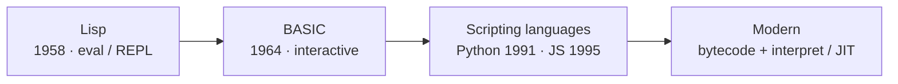
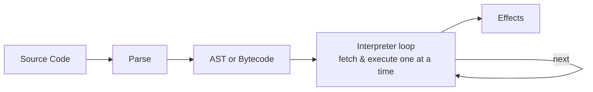

# Chapter 04 · Interpreter

[简体中文](./04-interpreter.md) ｜ **English**

---

> The previous chapter's compiler translated the whole source into target code ahead of time, all at once. This chapter takes the other road: **don't translate ahead — read a line, translate it, run it, at runtime**. That is the interpreter. It is the mirror image of the compiler.

## 1. Learning Objectives

By the end of this chapter, you will be able to:

- Explain how an interpreter works: it produces no standalone machine code, but reads and executes source code (or its bytecode) instruction by instruction at runtime;
- Use the single lens of "when translation happens" to explain the essential difference between a compiler and an interpreter;
- Distinguish two kinds of interpreter: the **tree-walking interpreter** and the **bytecode interpreter**;
- Understand the trade-offs of being "interpreted": immediate, portable, supporting REPL and dynamic features, but usually slower;
- Understand that "compiled / interpreted" is a property of the **implementation**, not the language — and that in reality the two are often mixed.

---

## 2. Why It Emerged (the Core Question)

> **Core question: if I want to see results the instant I change my code, or run the same code on a different machine without recompiling, then the compiler's "translate everything, then run" model is too heavy. Is there another way?**

An interpreter has three motivations:

- **Immediacy**: change it and run it right away — and even open an interactive session to try things out line by line;
- **Portability**: it produces no machine code bound to a specific CPU — wherever the source (or bytecode) goes, it runs, as long as an interpreter is there;
- **Dynamism**: many decisions are deferred to runtime (types are known only at runtime; you can even `eval` a piece of dynamically-generated code).

The cost is **speed**: translation happens at runtime, and often repeatedly.

---

## 3. The Historical Thread

- **1958 · Lisp**: proposed by McCarthy, one of the earliest languages with an **interpreter** and `eval`. "Code is data" let it read in and evaluate code at runtime; the idea of the REPL traces back here.
- **1964 · BASIC**: designed by Kemeny and Kurtz — interpreted and interaction-friendly; later, nearly every early personal computer shipped a built-in BASIC interpreter, bringing programming to the masses.
- **1990s · The scripting-language boom**: Perl (1987), Python (1991), Ruby, PHP, JavaScript (1995) all began life as interpreters, prioritizing development speed and fast iteration.
- **Modern**: pure interpretation is increasingly rare — the mainstream approach is "**compile to bytecode first, then interpret / JIT**," combining the flexibility of interpretation with the speed of compilation.

---

## 4. What It Really Is · The Underlying Thread

**An interpreter is a program: it reads source code (or its bytecode) and executes its meaning directly at runtime, without first producing a standalone target machine-code file.**

Compared with a compiler, the essential difference is a single sentence — **translation happens at a different time**:

| | Compiler | Interpreter |
|---|----------|-------------|
| When it translates | **before** running, all at once | **during** running, as it goes |
| Output | a standalone target file (machine code / bytecode) | usually not written out as a standalone file |
| Must it be present at runtime | no | **yes** (the interpreter must stay around) |
| Typical upside | fast at runtime, early error detection | immediate, portable, supports REPL |

Interpreters commonly come in two implementation levels:

- **Tree-walking interpreter**: parse the source into an **AST**, then recursively walk the tree and directly execute the meaning of each node. Simple to build, but slow.
- **Bytecode interpreter (bytecode VM)**: first compile the source into compact **bytecode**, then have a loop fetch and execute bytecode instructions one by one. Faster — CPython and mainstream JS engines take this route.

> **A key insight**: an interpreter, too, has "compilation" inside it — compiling source into an AST or bytecode. The difference is that this output is **not written out as a standalone executable, but executed immediately by the same process**. So "compiled vs. interpreted" was never "translation or not," but "where the translation output goes, and who executes it when."

Precisely because the interpreter stays "present" at runtime, it naturally supports the **REPL** (Read-Eval-Print-Loop): read a line → evaluate → print the result → loop — exactly the "type a line, get a line" experience of `python` or `node`.

---

## 5. Key Concepts and Terms

- **Interpreter**: a program that reads and directly executes code at runtime.
- **Tree-Walking Interpreter**: walks the AST and executes it directly.
- **Bytecode / Bytecode VM**: compiles to bytecode first, then a loop executes it instruction by instruction.
- **REPL**: read-eval-print-loop, an interactive execution environment.
- **eval / dynamic evaluation**: executing a string as code at runtime.
- **Portability**: source / bytecode runs anywhere, as long as the target platform has the corresponding interpreter.

---

## 6. How This Shows Up in the Book's Six Languages

| Language | Interpreted? | How |
|----------|--------------|-----|
| JavaScript | Yes (+ JIT) | the engine compiles source to bytecode then interprets; hot code is JIT-compiled (V8: the Ignition interpreter + the TurboFan optimizing compiler) |
| Python | Yes | CPython compiles source to `.pyc` bytecode, run by a bytecode-interpreter loop |
| Java | Mixed | the JVM interprets bytecode first, and JIT-compiles hot methods to machine code (mixed mode) |
| C++ | No (traditionally) | purely compiled to machine code, not interpreted (tools like `cling` exist, but are the exception) |
| C# | Mixed | the CLR is similar to the JVM: IL is interpreted, hot code is JIT-compiled |
| SQL | Yes | the database engine interprets and executes the query plan |

- **Python / JavaScript** represent the "interpreter-first" camp (both compile to bytecode then interpret; JS adds a JIT layer).
- **Java / C#** are "interpret + JIT" hybrids: cold code interpreted, hot code compiled to machine code.
- **C++** barely interprets — it stands at the pure-compilation end.

The thing that "executes bytecode instruction by instruction at runtime, and also manages memory" lives inside a **virtual machine**; and the trick of "JIT-compiling hot bytecode into machine code" is called **JIT**. They are the subjects of `05 Virtual Machine` and `06 Runtime`.

---

## 7. Common Misconceptions

- **"Interpreted languages don't compile."** Most compile to bytecode first — they just don't write out a standalone machine-code file.
- **"Interpreting must be far slower than compiling."** Modern JIT narrows the gap dramatically, and many bottlenecks are in algorithms and I/O, not interpretation itself.
- **"Compiled / interpreted is an intrinsic property of the language."** It is a property of the **implementation**: C has an interpreter (`cling`), and JavaScript can be AOT-compiled; one language can have several implementations.
- **"An interpreter just reads source characters and runs them."** Modern interpreters almost always parse into an AST or bytecode first, not character by character.
- **"With JIT you no longer need an interpreter."** Quite the opposite — in hybrid designs, the interpreter runs first and gathers hot-spot information, and only then does the JIT compile selectively.

---

## 8. Questions to Ponder

1. The essential difference between a compiler and an interpreter is "when translation happens." Based on that, why is an interpreter naturally suited to a REPL and to "run the instant you change it"?
2. Why is "compiled / interpreted" a property of the implementation rather than of the language? Give an example of one language that can be both compiled and interpreted.
3. Why is a bytecode interpreter usually faster than a tree-walking one? (Hint: recursively walking an AST vs. running a compact, linear stream of bytecode through one dispatch loop.)

---

## 9. Summary

**In one sentence**: an interpreter produces no standalone machine code; instead it reads the code at runtime (usually compiling to an AST or bytecode first) and executes it instruction by instruction — trading runtime translation cost for immediacy, portability, and dynamism.

**Checklist**:

- [ ] I can use "when translation happens" to explain the essential compiler-vs-interpreter difference.
- [ ] I can distinguish a tree-walking interpreter from a bytecode interpreter, and say why each is slow or fast.
- [ ] I can explain why "compiled / interpreted" is an implementation property, not a language property.
- [ ] I can explain why an interpreter naturally supports a REPL.

**Next chapter**: Who executes Python's bytecode? And where does Java's bytecode run? That execution environment that "runs bytecode instruction by instruction at runtime, and manages memory along the way" is Chapter 05, "Virtual Machine."

---

## 10. Further Reading

- <a href="https://craftinginterpreters.com/" target="_blank" rel="noopener">*Crafting Interpreters* (Robert Nystrom)</a> — builds a tree-walking interpreter and then a bytecode VM: the best hands-on way to understand this chapter.
- <a href="https://en.wikipedia.org/wiki/Interpreter_(computing)" target="_blank" rel="noopener">Wikipedia: Interpreter (computing)</a> — an overview of the interpreter concept and its variants.
- <a href="https://en.wikipedia.org/wiki/Read%E2%80%93eval%E2%80%93print_loop" target="_blank" rel="noopener">Wikipedia: Read–eval–print loop</a> — the origin and forms of the REPL.
- <a href="https://devguide.python.org/internals/" target="_blank" rel="noopener">Python Developer's Guide · CPython Internals</a> — how a real interpreter (CPython) is organized inside.
