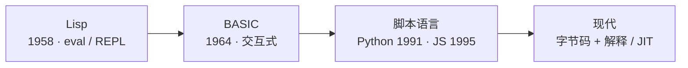
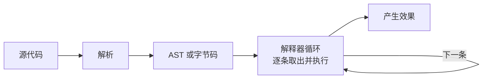

# 第 04 章 · 解释器

**简体中文** ｜ [English](./04-interpreter.en-US.md)

---

> 上一章的编译器，把整份源码提前一次性译成目标代码。这一章讲另一条路：**不提前翻译，而是在运行时读一句、翻一句、跑一句**——这就是解释器（Interpreter）。它和编译器恰好构成一对镜像。

## 1. 学习目标

本章结束后，你将能够：

- 说清解释器的工作方式：不预先产出独立机器码，而是在运行时逐条读取并执行源代码（或其字节码）；
- 用"翻译发生的时机"这一条，讲清编译器与解释器的本质区别；
- 区分两种解释器：**树遍历解释器**与**字节码解释器**；
- 理解解释型的取舍：即时、可移植、支持 REPL 与动态特性，但通常更慢；
- 明白"编译 / 解释"是**实现**的属性、而非语言的属性，且现实中二者常常混合。

---

## 2. 为什么会出现（核心问题）

> **核心问题：如果我想改完代码立刻看到结果、想让同一份代码不重新编译就能换台机器跑，那么编译器"先全量翻译再运行"的模式就太重了。有没有别的办法？**

解释器的动机有三个：

- **即时性**：改完就能跑，还能开一个交互式会话逐句试验；
- **可移植性**：不生成绑定某个 CPU 的机器码——源码（或字节码）走到哪，只要那里有解释器，就能跑；
- **动态性**：很多决定推迟到运行时（运行时才知道类型，甚至可以 `eval` 一段动态生成的代码）。

代价是**速度**：翻译发生在运行时，而且往往被反复翻译。

---

## 3. 历史脉络

- **1958 · Lisp**：McCarthy 提出，最早带**解释器**与 `eval` 的语言之一。"程序即数据"让它能在运行时读入并求值代码，REPL 的思想也源于此。
- **1964 · BASIC**：Kemeny 与 Kurtz 设计，解释执行、交互友好；后来几乎每台早期个人电脑都内置一个 BASIC 解释器，把编程带给了大众。
- **1990s · 脚本语言大爆发**：Perl（1987）、Python（1991）、Ruby、PHP、JavaScript（1995）纷纷以解释器起家，主打开发效率与快速迭代。
- **现代**：纯解释越来越少见——主流做法是"**先编译成字节码，再解释 / JIT**"，把解释的灵活与编译的速度结合起来。

---

## 4. 它到底是什么 · 底层主线

**解释器是一个程序：它读取源代码（或其字节码），在运行时直接执行其含义，而不预先生成一份独立的目标机器码文件。**

和编译器对照，最本质的差别只有一句——**翻译发生的时机不同**：

| | 编译器 | 解释器 |
|---|---|---|
| 翻译时机 | 运行**之前**，一次性 | 运行**之中**，边翻边跑 |
| 产物 | 独立的目标文件（机器码 / 字节码） | 通常不落地成独立文件 |
| 运行时是否需要它在场 | 不需要 | **需要**（解释器必须一直在） |
| 典型好处 | 运行快、错误发现早 | 即时、可移植、支持 REPL |

解释器常见有两种实现层次：

- **树遍历解释器（tree-walking）**：把源码解析成 **AST**，然后递归遍历这棵树、直接执行每个节点的含义。实现简单，但慢。
- **字节码解释器（bytecode VM）**：先把源码编译成紧凑的**字节码**，再由一个循环逐条取出字节码指令来执行。更快——CPython、主流 JS 引擎都走这条路。

> **一个关键洞察**：解释器内部其实也有"编译"——把源码编成 AST 或字节码。区别在于：这份产物**不落地成独立的可执行文件，而是立刻被同一个进程执行**。所以"编译 vs 解释"从来不是"有没有翻译"，而是"翻译的产物去了哪、由谁在何时执行"。

正因为解释器在运行时一直"在场"，它天然支持 **REPL**（Read-Eval-Print-Loop）：读入一句 → 求值 → 打印结果 → 循环——这正是你在 `python`、`node` 里敲一行出一行的体验。

---

## 5. 关键概念与术语

- **解释器（Interpreter）**：运行时读取并直接执行代码的程序。
- **树遍历解释器（Tree-Walking Interpreter）**：遍历 AST 直接执行。
- **字节码 / 字节码解释器（Bytecode / Bytecode VM）**：先编成字节码，再由循环逐条执行。
- **REPL**：读取-求值-打印-循环，交互式执行环境。
- **eval / 动态求值**：运行时把一段字符串当作代码来执行。
- **可移植性**：源码 / 字节码到处可跑，只要目标平台有对应的解释器。

---

## 6. 在本书六门语言中的体现

| 语言 | 是否解释执行 | 怎么做 |
|------|-------------|-------|
| JavaScript | 是（+ JIT） | 引擎把源码编成字节码后解释，热点再 JIT（V8：Ignition 解释器 + TurboFan 优化编译） |
| Python | 是 | CPython 把源码编成 `.pyc` 字节码，由字节码解释器循环执行 |
| Java | 混合 | JVM 先解释字节码，热点方法交给 JIT 编成机器码（混合模式） |
| C++ | 否（传统） | 纯编译到机器码、不解释（存在 `cling` 等解释器工具，属特例） |
| C# | 混合 | CLR 与 JVM 类似，IL 先解释、热点再 JIT |
| SQL | 是 | 数据库引擎解释执行查询计划 |

- **Python / JavaScript** 是"解释器为主"的代表（都先编字节码再解释，JS 再叠一层 JIT）。
- **Java / C#** 是"解释 + JIT 混合"：冷代码解释、热代码编成机器码。
- **C++** 基本不解释——它站在纯编译那一端。

那个"运行时逐条执行字节码、还顺带管理内存"的家伙，就住在**虚拟机**里；而"把热点字节码即时编成机器码"的技巧叫 **JIT**。它们分别是 `05 虚拟机` 与 `06 运行时` 的主题。

---

## 7. 常见误解

- **"解释型语言不编译。"** 大多数会先编译成字节码，只是不落地成独立的机器码文件。
- **"解释一定比编译慢很多。"** 现代 JIT 让差距大幅缩小，而且很多瓶颈在算法与 I/O，而非解释本身。
- **"编译型 / 解释型是语言的固有属性。"** 它其实是**实现**的属性：C 有解释器（`cling`），JavaScript 也能被 AOT 编译；同一门语言可以有多种实现。
- **"解释器就是逐字符读源代码执行。"** 现代解释器几乎都先解析成 AST 或字节码，而不是逐字符处理。
- **"有了 JIT 就不需要解释器了。"** 恰恰相反——混合方案里，解释器先跑起来、顺便收集热点信息，JIT 再有针对性地编译。

---

## 8. 思考题

1. 编译器与解释器最本质的区别是"翻译发生的时机"。基于这一点，解释器为什么天生适合 REPL 和"改完立即运行"？
2. 为什么说"编译型 / 解释型是实现的属性，而非语言的属性"？请举一个"同一门语言既能编译又能解释"的例子。
3. 字节码解释器为什么通常比树遍历解释器快？（提示：递归遍历一棵 AST vs 执行一段紧凑线性的字节码 + 一个分派循环。）

---

## 9. 本章小结

**一句话总结**：解释器不预先产出独立机器码，而是在运行时读取代码（通常先编成 AST 或字节码）并逐条执行；它用运行时的翻译开销，换来即时性、可移植性与动态性。

**检查清单**：

- [ ] 我能用"翻译时机"讲清编译器与解释器的本质区别。
- [ ] 我能区分树遍历解释器与字节码解释器，并说出各自的快慢原因。
- [ ] 我能解释为什么"编译 / 解释"是实现属性而非语言属性。
- [ ] 我能说清解释器为何天然支持 REPL。

**下一章预告**：Python 的字节码由谁执行？Java 的字节码又跑在哪？那个"运行时逐条执行字节码、并顺带管理内存"的执行环境，就是第 05 章「虚拟机」。

---

## 10. 延伸阅读

- <a href="https://craftinginterpreters.com/" target="_blank" rel="noopener">《Crafting Interpreters》（Robert Nystrom）</a> — 从树遍历解释器一路写到字节码虚拟机，理解本章最好的实践。
- <a href="https://en.wikipedia.org/wiki/Interpreter_(computing)" target="_blank" rel="noopener">Wikipedia：Interpreter (computing)</a> — 解释器概念与分类的总览。
- <a href="https://en.wikipedia.org/wiki/Read%E2%80%93eval%E2%80%93print_loop" target="_blank" rel="noopener">Wikipedia：Read–eval–print loop</a> — REPL 的由来与形态。
- <a href="https://devguide.python.org/internals/" target="_blank" rel="noopener">Python Developer's Guide · CPython Internals</a> — 看真实解释器（CPython）内部是怎么组织的。
