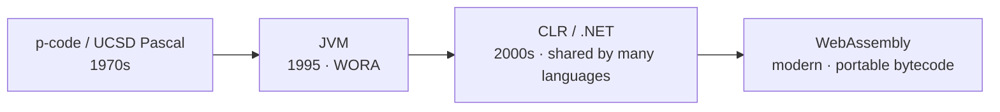
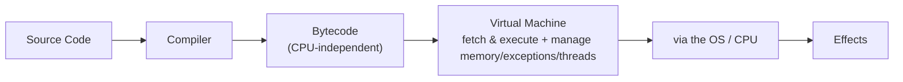

# Chapter 05 · Virtual Machine

[简体中文](./05-virtual-machine.md) ｜ **English**

---

> In Chapters 03 and 04 we saw that many languages first compile source into **bytecode**. But bytecode is not machine code — the CPU doesn't understand it. So who executes the bytecode? The answer is the **virtual machine (VM)**. This chapter explains why we add this extra layer between source code and the CPU.

## 1. Learning Objectives

By the end of this chapter, you will be able to:

- State the job of a (language) virtual machine: execute CPU-independent **bytecode**, and uniformly manage the resources a program needs to run (memory / GC, exceptions, threads, etc.);
- Understand why the "**bytecode + virtual machine**" combination achieves "write once, run anywhere";
- **Distinguish a system VM from a language VM** — this chapter is about the latter;
- Recognize the three big representatives: the JVM, the CLR, the CPython VM, plus the VM inside JS engines;
- Understand the trade-offs of this layer: cross-platform + managed + a security sandbox, at the cost of startup / memory overhead and "the VM must be present."

---

## 2. Why It Emerged (the Core Question)

> **Core question: source has been compiled to bytecode, but the CPU only understands its own machine code. Who executes this "intermediate code"? And since it all ends up as machine code anyway, why not compile straight to machine code, instead of taking a detour through bytecode + a VM?**

Because that detour buys several things well worth the price:

- **Cross-platform**: one bytecode, plus "one VM per platform," runs everywhere. What gets ported is the **VM**, not your program.
- **Managed services**: the VM can uniformly provide memory management (GC), exception handling, a threading model, and type/safety checks — making the language easier and safer to use.
- **Shared by many languages**: as long as they compile to the same bytecode, multiple languages can share one VM (e.g. Kotlin/Scala on the JVM).

The cost is **one extra layer of indirection**, bringing startup and runtime overhead — overhead later paid back mainly by JIT (Chapter 06).

---

## 3. The Historical Thread

- **1970s · p-code and UCSD Pascal**: Pascal was compiled to an intermediate code called **p-code**, then executed by a **p-machine** (a virtual machine) on each platform. This is the most famous early case of "bytecode + VM for portability."
- **1995 · The JVM**: Sun shipped the Java Virtual Machine with Java, under the banner "**Write Once, Run Anywhere (WORA)**," pushing the idea into the mainstream.
- **2000s · CLR / .NET**: Microsoft's Common Language Runtime followed a similar path, but emphasized **many languages sharing one VM** — C#, F#, and VB all compile to the intermediate language IL and run on the same CLR.
- **Modern · WebAssembly (Wasm)**: a portable bytecode + VM that brings "compile to bytecode, execute on a VM" into the browser and far beyond.

---

## 4. What It Really Is · The Underlying Thread

**A (language) virtual machine is a software layer: it "pretends" to be a machine — with its own instruction set (bytecode) and its own execution model — executing bytecode instruction by instruction, while also managing runtime resources like memory, exceptions, and threads.**

It commonly comes in two execution models (a good place to connect back to the "stack" data structure):

- **Stack-based VM**: uses an **operand stack** to pass intermediate values; instructions are short (e.g. `iload`, `iadd`). The JVM, CPython, and Wasm are all stack-based.
- **Register-based VM**: uses a set of **virtual registers** to hold intermediate values; fewer instructions but each is longer. Lua's VM and Android's early Dalvik are register-based.

From birth to effect, a piece of bytecode travels this path:

This is how "**write once, run anywhere**" holds: bytecode is CPU-independent, and each platform has its own VM to translate the same bytecode into native actions. Your program doesn't change; what changes is the VM beneath it.

Beyond executing bytecode, a VM usually builds in a whole **managed runtime** of services: garbage collection (GC, detailed in Chapter 35), exception handling, threads and concurrency primitives, class loading and a security sandbox. This is where the term "managed language" comes from.

> ⚠️ **Note: this "virtual machine" is not the same as VMware / VirtualBox.**
> - A **system VM** (VMware, VirtualBox, cloud servers) virtualizes **a whole computer** (CPU, memory, disk, OS), letting you run another complete system on one machine.
> - A **language / process VM** (JVM, CLR, CPython, V8) virtualizes only a **program-execution environment that runs bytecode** — this chapter is about this kind.
>
> Both are called "virtual machines," but what they virtualize is entirely different: one virtualizes a whole machine, the other virtualizes a bytecode execution model.

---

## 5. Key Concepts and Terms

- **Language / Process VM**: the software layer that executes bytecode and provides runtime services (this chapter's focus).
- **System VM**: software that virtualizes a whole computer (VMware, etc.) — different from this chapter.
- **Bytecode**: the VM's instruction set, independent of any specific CPU.
- **Stack-based VM / Register-based VM**: two execution models (operand stack / virtual registers).
- **JVM / CLR / CPython VM / JS engine VM**: the mainstream language VMs.
- **Managed Runtime**: the GC, exception, thread, and security services the VM provides.
- **WebAssembly (Wasm)**: modern portable bytecode and its VM.

---

## 6. How This Shows Up in the Book's Six Languages

| Language | Which VM it runs on | Bytecode / intermediate code |
|----------|---------------------|------------------------------|
| JavaScript | the VM inside a JS engine (e.g. V8) | engine-internal bytecode |
| Python | the CPython VM (stack-based) | `.pyc` bytecode |
| Java | the JVM (stack-based) | `.class` bytecode |
| C++ | no language VM; runs machine code directly on the CPU | — |
| C# | the CLR | intermediate language IL |
| SQL | the database engine (think of it as a special-purpose executor) | a query execution plan |

- **Java / C#** are managed languages "born for a VM": language, bytecode, and VM are one designed whole.
- **Python / JavaScript** also each run on their own VM (the CPython VM, a JS engine VM).
- **C++** has no language VM — it compiles straight to machine code and runs on the CPU. This is why it is the fastest and closest to the machine, but also the least "managed" (you manage memory yourself, see Chapters 35–38).
- **SQL**'s engine can be likened to a **special-purpose VM**: what it executes is not general bytecode but a query execution plan.

What the VM actually "does for you" at runtime, and how it uses **JIT** to accelerate bytecode execution to near-native speed — that is the subject of the next chapter, `06 Runtime`.

---

## 7. Common Misconceptions

- **"A virtual machine means VMware / VirtualBox."** That is a **system** VM; this chapter is about a **language / process** VM — they virtualize different things (see the note above).
- **"A VM is necessarily slow."** JIT (Chapter 06) can compile hot bytecode into machine code, reaching near-native performance.
- **"Bytecode is machine code."** No. Bytecode is the **VM's** instruction set; machine code is the **CPU's**.
- **"The JVM only runs Java."** The JVM executes bytecode — Kotlin, Scala, and Clojure all compile to JVM bytecode; likewise the CLR runs C# / F# / VB.
- **"A VM only executes bytecode."** It also manages memory (GC), exceptions, threads, security — a whole set of runtime services.

---

## 8. Questions to Ponder

1. How does "bytecode + VM" reduce the cross-platform problem from N×M to "one VM per platform"? What does this have in common with Chapter 03's "front end / back end + IR" idea?
2. Since an extra VM layer inevitably brings overhead, why do Java / C# still choose it? And by what means do they pay that overhead back?
3. A system VM (VMware) and a language VM (JVM) are both called "virtual machines" — what exactly does each of them "virtualize"?

---

## 9. Summary

**In one sentence**: a language VM is a software layer that executes CPU-independent bytecode and uniformly manages runtime resources like memory / exceptions / threads — trading "one extra layer" for cross-platform reach, managed services, and safety, with the overhead paid back by JIT.

**Checklist**:

- [ ] I can state a language VM's job and why "bytecode + VM" is cross-platform.
- [ ] I can distinguish a system VM from a language VM.
- [ ] I can distinguish a stack-based VM from a register-based one, with an example of each.
- [ ] I can say which bytecode the JVM / CLR / CPython VM each executes.

**Next chapter**: What does the VM actually do for you at runtime? And how does it accelerate slow bytecode execution toward native speed? That is Chapter 06, "Runtime" — JIT and GC seen from the runtime's point of view.

---

## 10. Further Reading

- <a href="https://craftinginterpreters.com/" target="_blank" rel="noopener">*Crafting Interpreters*, Part III</a> — build a bytecode virtual machine by hand: the most direct way to understand this chapter.
- <a href="https://en.wikipedia.org/wiki/Virtual_machine" target="_blank" rel="noopener">Wikipedia: Virtual machine</a> — an overview classifying system VMs and process VMs.
- <a href="https://en.wikipedia.org/wiki/Java_virtual_machine" target="_blank" rel="noopener">Wikipedia: Java virtual machine</a> — the most representative language VM.
- <a href="https://webassembly.org/" target="_blank" rel="noopener">WebAssembly official site</a> — a modern portable bytecode + VM.
