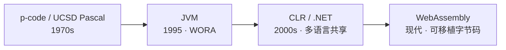
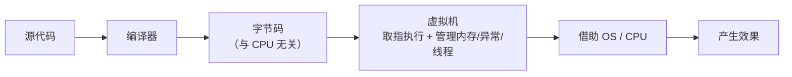

# 第 05 章 · 虚拟机

**简体中文** ｜ [English](./05-virtual-machine.en-US.md)

---

> 第 03、04 章我们看到：很多语言先把源码编成**字节码**。可字节码不是机器码，CPU 并不认识它——那到底谁来执行字节码？答案是**虚拟机（Virtual Machine）**。这一章解释：为什么要在源码和 CPU 之间，多加这么一层。

## 1. 学习目标

本章结束后，你将能够：

- 说清（语言）虚拟机的职责：执行与具体 CPU 无关的**字节码**，并统一管理程序运行所需的资源（内存 / GC、异常、线程等）；
- 理解"**字节码 + 虚拟机**"这套组合，为什么能实现"一次编写、到处运行"；
- **区分系统虚拟机与语言虚拟机**——本章讲的是后者；
- 认识三大代表：JVM、CLR、CPython VM，以及 JS 引擎里的 VM；
- 理解这一层的取舍：跨平台 + 托管 + 安全沙箱，代价是启动 / 内存开销与"VM 必须在场"。

---

## 2. 为什么会出现（核心问题）

> **核心问题：源码编成了字节码，可 CPU 只认自己的机器码。谁来执行这份"中间码"？既然最终都要落到机器码，为什么不直接编成机器码，反而多绕一层字节码 + 虚拟机？**

因为多绕的这一层，买到了几样很值的东西：

- **跨平台**：一份字节码，配上"每个平台一个虚拟机"，就能到处跑。要移植的是**虚拟机**，不是你的程序。
- **托管服务**：虚拟机可以统一提供内存管理（GC）、异常处理、线程模型、类型与安全检查——语言因此更省心、更安全。
- **多语言共享**：只要能编成同一种字节码，多门语言就能共用同一个虚拟机（如 JVM 上的 Kotlin/Scala）。

代价是**多一层间接**，带来启动与运行开销——这个开销后来主要靠 JIT 弥补（第 06 章）。

---

## 3. 历史脉络

- **1970s · p-code 与 UCSD Pascal**：把 Pascal 编成一种叫 **p-code** 的中间码，再由各平台的 **p-machine**（一个虚拟机）执行。这是"字节码 + 虚拟机实现可移植性"最著名的早期案例。
- **1995 · JVM**：Sun 随 Java 推出 Java 虚拟机，打出"**一次编写，到处运行（Write Once, Run Anywhere）**"，把这套思想推向主流。
- **2000s · CLR / .NET**：微软的公共语言运行时，思路类似，但强调**多语言共享一个 VM**——C#、F#、VB 都编成中间语言 IL，跑在同一个 CLR 上。
- **现代 · WebAssembly（Wasm）**：一种可移植的字节码 + 虚拟机，把"编成字节码、由 VM 执行"的思路带进浏览器乃至更广的场景。

---

## 4. 它到底是什么 · 底层主线

**（语言）虚拟机是一个软件层：它"假装"自己是一台机器——有自己的指令集（字节码）、自己的执行模型，逐条执行字节码；同时管理内存、异常、线程等运行时资源。**

它常见有两种执行模型（这里正好联系一下"栈"这个数据结构）：

- **栈式虚拟机（stack-based）**：用一个**操作数栈**传递中间值，指令短小（如 `iload`、`iadd`）。JVM、CPython、Wasm 都是栈式。
- **寄存器式虚拟机（register-based）**：用一组**虚拟寄存器**存放中间值，指令数更少但每条更长。Lua 的 VM、Android 早期的 Dalvik 是寄存器式。

一份字节码从诞生到产生效果，走的是这条路：

"**一次编写、到处运行**"就是这样成立的：字节码与 CPU 无关，每个平台各有一个虚拟机，负责把同一份字节码翻译成本地动作。所以你的程序不用改，改的是脚下的虚拟机。

除了执行字节码，虚拟机通常还内建一整套**托管运行时**服务：垃圾回收（GC，第 35 章细讲）、异常处理、线程与并发原语、类加载与安全沙箱。这也是"托管语言（managed language）"这个词的由来。

> ⚠️ **注意：这里的"虚拟机"和 VMware / VirtualBox 不是一回事。**
> - **系统虚拟机**（VMware、VirtualBox、云服务器）：虚拟出**一整台计算机**（CPU、内存、硬盘、操作系统），让你在一台机器上跑另一个完整系统。
> - **语言 / 进程虚拟机**（JVM、CLR、CPython、V8）：只虚拟出一个**执行字节码的程序运行环境**，本章讲的是这一种。
>
> 两者都叫"虚拟机"，但"虚拟"的东西完全不同：一个虚拟整台机器，一个虚拟一套字节码执行模型。

---

## 5. 关键概念与术语

- **语言 / 进程虚拟机**：执行字节码、提供运行时服务的软件层（本章主角）。
- **系统虚拟机**：虚拟出整台计算机的软件（VMware 等），与本章不同。
- **字节码（Bytecode）**：虚拟机的指令集，与具体 CPU 无关。
- **栈式 VM / 寄存器式 VM**：两种执行模型（操作数栈 / 虚拟寄存器）。
- **JVM / CLR / CPython VM / JS 引擎 VM**：主流语言虚拟机。
- **托管运行时（Managed Runtime）**：VM 提供的 GC、异常、线程、安全等服务。
- **WebAssembly（Wasm）**：现代可移植字节码及其虚拟机。

---

## 6. 在本书六门语言中的体现

| 语言 | 跑在什么虚拟机上 | 字节码 / 中间码 |
|------|----------------|----------------|
| JavaScript | JS 引擎内置的 VM（如 V8） | 引擎内部字节码 |
| Python | CPython VM（栈式） | `.pyc` 字节码 |
| Java | JVM（栈式） | `.class` 字节码 |
| C++ | 无语言虚拟机，直接在 CPU 上跑机器码 | —— |
| C# | CLR | 中间语言 IL |
| SQL | 数据库引擎（可视作一台专用执行器） | 查询执行计划 |

- **Java / C#** 是"为虚拟机而生"的托管语言：语言、字节码、VM 是一整套设计。
- **Python / JavaScript** 也各自跑在自己的 VM 上（CPython VM、JS 引擎 VM）。
- **C++** 没有语言虚拟机——它直接编成机器码在 CPU 上跑。这解释了它为什么最快、最贴近机器，但也最不"托管"（内存要自己管，见第 35–38 章）。
- **SQL** 引擎可以类比成一台**专用虚拟机**：它执行的不是通用字节码，而是查询执行计划。

虚拟机在运行时到底"替你做了哪些事"，以及它如何用 **JIT** 把字节码执行加速到接近原生——这是下一章 `06 运行时` 的主题。

---

## 7. 常见误解

- **"虚拟机就是 VMware / VirtualBox 那种。"** 那是**系统**虚拟机；本章是**语言 / 进程**虚拟机，两者虚拟的东西不同（见上文注解）。
- **"有虚拟机就一定慢。"** JIT（第 06 章）能把热点字节码编成机器码，性能可接近原生。
- **"字节码就是机器码。"** 不是。字节码是**虚拟机**的指令，机器码是 **CPU** 的指令。
- **"JVM 只能跑 Java。"** JVM 执行的是字节码——Kotlin、Scala、Clojure 都能编成 JVM 字节码；CLR 同理跑 C# / F# / VB。
- **"虚拟机只负责执行字节码。"** 它还管内存（GC）、异常、线程、安全等一整套运行时服务。

---

## 8. 思考题

1. "字节码 + 虚拟机"如何把跨平台问题从 N×M 降到"每个平台一个 VM"？这和第 03 章编译器的"前端 / 后端 + IR"思路有什么异曲同工之处？
2. 既然多一层虚拟机必然带来开销，Java / C# 为什么仍然选择它？它们又用什么手段把开销补回来？
3. 系统虚拟机（VMware）与语言虚拟机（JVM）都叫"虚拟机"，它们各自"虚拟"的到底是什么？

---

## 9. 本章小结

**一句话总结**：语言虚拟机是一个软件层，它执行与 CPU 无关的字节码、并统一管理内存 / 异常 / 线程等运行时资源——用"多一层"换来跨平台、托管与安全，开销则靠 JIT 弥补。

**检查清单**：

- [ ] 我能说清语言虚拟机的职责，以及"字节码 + 虚拟机"为何能跨平台。
- [ ] 我能区分系统虚拟机与语言虚拟机。
- [ ] 我能区分栈式 VM 与寄存器式 VM，并各举一例。
- [ ] 我能说出 JVM / CLR / CPython VM 各自执行什么字节码。

**下一章预告**：虚拟机在运行时到底替你做了哪些事？它又怎么把慢的字节码执行加速到接近原生？这就是第 06 章「运行时」——从运行时的视角看 JIT 与 GC。

---

## 10. 延伸阅读

- <a href="https://craftinginterpreters.com/" target="_blank" rel="noopener">《Crafting Interpreters》第三部分</a> — 亲手实现一个字节码虚拟机，理解本章最直接的方式。
- <a href="https://en.wikipedia.org/wiki/Virtual_machine" target="_blank" rel="noopener">Wikipedia：Virtual machine</a> — 系统虚拟机与进程虚拟机的分类总览。
- <a href="https://en.wikipedia.org/wiki/Java_virtual_machine" target="_blank" rel="noopener">Wikipedia：Java virtual machine</a> — 最有代表性的语言虚拟机。
- <a href="https://webassembly.org/" target="_blank" rel="noopener">WebAssembly 官网</a> — 现代可移植字节码 + 虚拟机。
