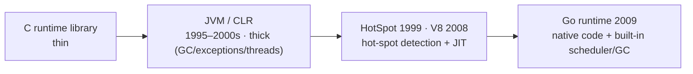
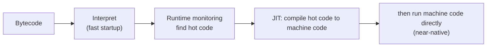

# Chapter 06 · Runtime

[简体中文](./06-runtime.md) ｜ **English**

---

> The previous chapters made clear how source is compiled or interpreted, and how bytecode runs on a virtual machine. But while a program is actually *running*, the language keeps quietly doing a lot for you — allocating and reclaiming memory, throwing exceptions, scheduling threads, JIT-compiling hot code into machine code. This whole set of support is called the **runtime**. This chapter wraps up Part 1's "translate / execute" chain.

## 1. Learning Objectives

By the end of this chapter, you will be able to:

- Distinguish the two meanings of "runtime": **run time (as opposed to compile time)** and the **runtime system / runtime library**; this chapter is mostly about the latter;
- List the typical services of a runtime system: memory management (GC), exception handling, threads / scheduling, type information / reflection, JIT;
- Explain the core idea of **JIT**: at runtime, compile "hot" bytecode into machine code on the fly, gaining both the "fast startup" of interpreting and the "fast running" of compiling;
- Understand where "runtime overhead" comes from, and why C++'s runtime is the "thinnest" while managed languages' runtimes are the "thickest";
- Close the translate / execute chain of Chapters 02–05 into one complete picture.

---

## 2. Why It Emerged (the Core Question)

> **Core question: source is translated, and bytecode has a VM to execute it — so why does a running program still need a whole set of "invisible" support? What is that support, and who provides it?**

Because high-level languages hand all the grunt work — reclaiming memory, bounds checking, unwinding exceptions, scheduling threads, keeping dynamic type information — over to a **runtime system**, so you can focus on business logic. The cost is that this system itself consumes memory and CPU — that is "**runtime overhead**." And **JIT** exists precisely to pay back the "interpreting is slow" part of that overhead.

---

## 3. The Historical Thread

- **Early on · C has a runtime too**: the C runtime library (CRT) handles program startup (from `_start` to `main`), `malloc/free`, and standard-library functions. It is just very "thin" — it barely does extra work for you.
- **1990s–2000s · Managed runtimes rise**: the JVM (1995) and CLR (2000s) brought "thick" runtimes — built-in GC, exceptions, threads, security, class loading.
- **The JIT lineage**: the Self language (1980s–90s) pioneered adaptive optimization; the HotSpot JVM (1999) made "hot-spot detection + JIT" mainstream; V8 (2008) used JIT to make JavaScript fast enough to power modern web apps.
- **2009 · The Go runtime**: built-in goroutine scheduler and GC, but the program is **compiled to native machine code**, with the runtime being **a chunk of code linked into the executable** rather than a separate virtual machine — showing that "runtime" is not the same as "virtual machine."

---

## 4. What It Really Is · The Underlying Thread

**The runtime (runtime system) is the whole set of support code and services the language / platform provides while your program runs.** Its form varies: it may be a virtual machine (JVM, CLR), a library linked into the executable (C's CRT, Go's runtime), or part of an engine (V8).

It typically offers this menu of services:

- **Memory management**: allocation + automatic reclamation (GC) — detailed in Chapter 35;
- **Exception handling**: stack unwinding, finding a matching `catch`;
- **Concurrency scheduling**: scheduling and synchronizing threads / coroutines — Part 6;
- **Type information and reflection**: the object's type is still known at runtime — Chapter 29;
- **JIT compilation**: compiling hot bytecode into machine code on the fly.

Of these, **JIT (Just-In-Time compilation)** is this chapter's focus. Its idea is "compile as you run":

Placing the three execution strategies side by side makes their roles clear:

- **AOT (ahead-of-time)**: compile everything to machine code before running — instant startup, but it **can't see runtime information** at compile time.
- **Interpret**: immediate and flexible, but translating line by line is **slow**.
- **JIT**: a smarter middle ground — start by interpreting, gather information at runtime (which code is hot, what types variables usually are), then compile the hot spots to machine code, even performing **speculative optimizations** (assume types stay stable; if the assumption breaks, "deoptimize" back to interpreting).

This yields a spectrum of "runtime thickness":

- **Thinnest**: C / C++ (little more than the CRT; you manage the rest) — low, predictable overhead, close to the machine;
- **In between**: Go / Rust (some runtime or scheduler, but compiled to native code);
- **Thickest**: Java / C# / Python / JavaScript (a full managed runtime: GC + exceptions + reflection + JIT) — convenient and safe, but higher overhead.

With this, the chain of Chapters 02–05 finally closes: **source code → compile / interpret → bytecode → virtual machine → runtime** — the complete journey of a piece of code from "text" to "producing effects on a machine."

> ⚠️ **Note: the word "runtime" has two meanings — don't mix them up.**
> - **Run time**: a **period of time**, as opposed to "compile time" — the span during which a program is running (e.g. "this error only surfaces at run time").
> - **Runtime system / runtime library**: a body of **code and services** that supports your program during run time (e.g. the JRE, the .NET runtime, the Go runtime).
>
> This chapter is mostly about the latter. English uses "runtime" for both; you tell them apart by context.

---

## 5. Key Concepts and Terms

- **Run time**: the period during which a program runs, as opposed to compile time.
- **Runtime system / runtime library**: the code and services supporting the program at run time (CRT, JRE, .NET runtime, Go runtime).
- **JIT (Just-In-Time compilation)**: compiling hot bytecode into machine code at runtime.
- **Hot spot**: frequently-executed code.
- **Speculative optimization / deoptimization**: aggressive optimization based on runtime assumptions, backing off when an assumption fails.
- **AOT vs JIT vs interpret**: three timings for translation / execution.
- **Managed runtime / runtime overhead**: the services a runtime provides, and the memory and CPU they consume.

---

## 6. How This Shows Up in the Book's Six Languages

| Language | Runtime form | Execution acceleration | Runtime "thickness" |
|----------|-------------|------------------------|---------------------|
| JavaScript | runtime built into a JS engine (e.g. V8) | JIT (TurboFan) | thick |
| Python | the CPython runtime | traditionally no JIT (PyPy has one; CPython adds an experimental JIT in 3.13) | thick |
| Java | the JVM / JRE | JIT (HotSpot C1 / C2) | thick |
| C++ | the C runtime library (CRT) + you | none (AOT native code) | thin |
| C# | the CLR / .NET runtime | JIT (with an AOT option) | thick |
| SQL | the database engine runtime | execution-plan caching, etc. | — (special-purpose) |

This table actually answers a lot of "why"s:

- **Why C++ is fast**: the thinnest runtime — no GC, no JIT pauses, running native code directly — at the cost of managing memory yourself.
- **Why Java "starts a bit slow but runs fast once warmed up"**: startup must bring up the JVM and interpret first, but once hot spots are JIT-compiled to machine code, long-running work approaches C++.
- **Why Python is slower on pure CPU-bound work**: CPython traditionally had no JIT and kept interpreting bytecode (exactly what PyPy and the 3.13 experimental JIT aim to fix).

---

## 7. Common Misconceptions

- **"Runtime just means 'when it runs.'"** That is **run time**; this chapter's "runtime" mostly means the **runtime system / library** (see the note above).
- **"Only Java / Python have a runtime; C / C++ don't."** C has a runtime (the CRT) too — it's just thin.
- **"JIT is always faster (or slower) than AOT."** Each has strengths: AOT starts fast; JIT can use runtime information for more aggressive optimization — it depends on the scenario.
- **"Having a GC means having a VM."** Not necessarily: Go has a GC yet compiles to native code with no bytecode VM. **Runtime ≠ virtual machine.**
- **"Runtime overhead is all bad."** It buys automatic memory management, safety, and cross-platform reach — usually a net win.

---

## 8. Questions to Ponder

1. Why can JIT be "both fast to start and fast to run"? Compared with AOT, what extra information does it have at runtime that lets it optimize in ways AOT cannot?
2. Go has a GC but no bytecode virtual machine. What does this tell you about the relationship between "runtime" and "virtual machine"?
3. Using "runtime thickness," explain: for the same CPU-bound loop, why is C++ usually much faster than Python, yet Java can approach C++ once it has run for a while?

---

## 9. Summary

**In one sentence**: the runtime (runtime system) is the whole set of support the language provides while a program runs — memory (GC), exceptions, threads, reflection, JIT; it may be a virtual machine, a library linked into the program, or part of an engine. A "thicker" runtime is more convenient and safe; a "thinner" one is faster and more controllable; and JIT, by "compiling hot spots as it runs," gains both the fast startup of interpreting and the fast running of compiling.

**Checklist**:

- [ ] I can distinguish the two meanings of "runtime": run time vs. runtime system.
- [ ] I can list several typical runtime services and explain the idea of JIT.
- [ ] I can use the roles of AOT / interpret / JIT to explain each language's performance.
- [ ] I can explain that "runtime ≠ virtual machine," using Go as an example.

**Wrapping up the first half of Part 1**: with this, the **code-to-execution** chain — "source code → compile / interpret → bytecode → virtual machine → runtime" — is complete.

**Next chapter**: we have been mentioning "types" all along. But what exactly do types constrain? What do static and dynamic typing each buy you? That is Part 1's closing chapter — Chapter 07, "Type System."

---

## 10. Further Reading

- <a href="https://en.wikipedia.org/wiki/Runtime_system" target="_blank" rel="noopener">Wikipedia: Runtime system</a> — an overview of the runtime-system concept and its responsibilities.
- <a href="https://en.wikipedia.org/wiki/Just-in-time_compilation" target="_blank" rel="noopener">Wikipedia: Just-in-time compilation</a> — the principles and history of JIT.
- <a href="https://v8.dev/" target="_blank" rel="noopener">V8 official site</a> — a real JS-engine runtime (the Ignition interpreter + the TurboFan JIT).
- <a href="https://en.wikipedia.org/wiki/HotSpot_(virtual_machine)" target="_blank" rel="noopener">Wikipedia: HotSpot (JVM)</a> — the classic implementation of hot-spot detection + tiered JIT.
