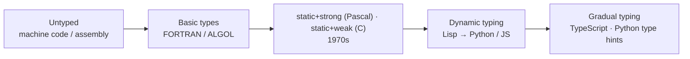

# Chapter 07 · Type System

[简体中文](./07-type-system.md) ｜ **English**

---

> The previous six chapters kept mentioning "types" — the compiler type-checks, the runtime keeps type information. This chapter answers head-on: what is a type, and what does it constrain? Why do some languages check types before running and others only at runtime? And what exactly are "strong / weak" and "type inference"? This is the closing chapter of Part 1, "Programming Fundamentals."

## 1. Learning Objectives

By the end of this chapter, you will be able to:

- State the essence of a type: a contract attached to data about "what it is and what it can do," and the checks based on it;
- Distinguish three **mutually independent** dimensions: **static vs. dynamic** (when checking happens), **strong vs. weak** (how much implicit conversion is tolerated), **explicit vs. inferred** (who writes the type);
- Understand the value and cost of type checking: safety / performance / self-documentation vs. flexibility / brevity;
- Connect the type system back to earlier chapters: static checking belongs to the compiler's semantic analysis; dynamic type information is kept by the runtime;
- Place the six languages clearly on these axes.

---

## 2. Why It Emerged (the Core Question)

> **Core question: memory holds only 0s and 1s. What makes a chunk of binary "an integer," "a string," or "a Student object"? And who keeps you from subtracting an integer from a string?**

The type system is exactly this **"contract + checking."** It turns "what this data is and what operations it can take part in" into machine-checkable rules, buying three things: **catching errors early** (subtracting a number from a string errors out), **letting the compiler optimize** (knowing it's an int lets it emit integer instructions directly), and **making code self-documenting** (the signature tells you what to pass).

Without types, everything is raw bytes — you can interpret any bit pattern as anything: flexible, but extremely dangerous.

---

## 3. The Historical Thread

- **Early on · Untyped**: in machine code and assembly, everything is a "word" — the same bit pattern can be read as an integer or an address at will — flexible but dangerous.
- **1950s–60s · Basic types appear**: FORTRAN and ALGOL introduce integers, floats, and other basic types.
- **1970s · Two roads**: Pascal takes the **strong static** route (rigorous, for teaching); C is **static but weak** (arbitrary `cast`s, pointer conversions).
- **1969 / 1978 · Type inference**: Hindley and Milner's type inference lets the compiler **infer** types automatically (the ML family), so static typing no longer means writing types everywhere.
- **The dynamic lineage**: Lisp, Smalltalk, and later Python / Ruby / JavaScript — type information rides on **values** and is checked at runtime.
- **Modern trend · Gradual typing**: adding **optional** static types to dynamic languages — TypeScript (2012), Python type hints (PEP 484, 2014). The two camps are converging.



---

## 4. What It Really Is · The Underlying Thread

**A type is a set of contracts attached to data: how big it is, how the bits are interpreted, and what operations it supports. The type system is a set of rules plus checks that decide "whether a given operation is legal on a given type."**

A language's typing style is characterized mainly by three **mutually independent** axes:

**① Static vs. Dynamic (when checking happens)**

- **Static**: check types at **compile time** (C++ / Java / C# / TypeScript). Errors caught early, optimizable, smart IDEs — but more verbose, and you must satisfy the compiler first.
- **Dynamic**: check only at **run time** (Python / JavaScript / Ruby). Flexible and quick to write, but a type error may not blow up until runtime.

```python
# Python (dynamic): a variable can change type; no error before running
x = 5
x = "hello"   # legal
```

```cpp
// C++ (static): types are fixed at compile time
int x = "hello";   // compile error
```

**② Strong vs. Weak (tolerance for implicit conversion)**

- **Strong**: does not tolerate reckless implicit conversions. Python: `"1" + 1` is a `TypeError`.
- **Weak**: tolerates many implicit conversions. JavaScript: `"1" + 1 === "11"`, `1 + true === 2`.
- Note: strong / weak is a **spectrum**, not black and white.

**③ Explicit vs. Inferred (who writes the type)**

- **Explicit**: `int x = 1;`
- **Inferred (type inference)**: `auto x = 1;` (C++), `var x = 1;` (Java / C#) — the compiler infers the type, but once fixed it **cannot change**; it's still static typing.

> ⚠️ **The most-confused point: "static / dynamic" and "strong / weak" are two independent axes, not the same thing.**
> - C is **static but weak** (types fixed at compile time, yet arbitrary `cast`s allowed);
> - Python is **dynamic but strong** (types fixed only at runtime, yet `"1" + 1` is rejected);
> - JavaScript is **dynamic and weak**; Haskell is **static and strong**.
>
> So "strongly typed" absolutely does not equal "statically typed" — this is beginners' most common misconception.

**Connecting back to earlier chapters**: static type checking happens in the compiler's **semantic analysis** stage (Chapter 03); dynamic type information (each value carries its own type tag) is kept by the **runtime** (Chapter 06) and powers reflection (Chapter 29). Types also directly affect **memory layout and performance** — a statically-known type can drop the runtime type tag and inline operations directly.

---

## 5. Key Concepts and Terms

- **Type / Type System**: the contracts on data / the rules that check those contracts.
- **Static typing / Dynamic typing**: checking at compile time / at run time.
- **Strong typing / Weak typing**: tolerance for implicit conversion (a spectrum).
- **Type Inference / explicit annotation**: the compiler infers types / you write them.
- **Type Safety**: how many illegal operations the type system can block.
- **Gradual Typing**: adding optional static types to a dynamic language (TypeScript, Python type hints).
- **Compile-time error vs. runtime error**: when the error is caught.

---

## 6. How This Shows Up in the Book's Six Languages

Placing the six languages on the three axes:

| Language | Static / Dynamic | Strong / Weak | How types are written |
|----------|:----------------:|:-------------:|-----------------------|
| JavaScript | dynamic | leaning weak (many implicit conversions) | none required (TypeScript adds optional static types) |
| Python | dynamic | strong (few implicit conversions) | none required (type hints optional) |
| Java | static | strong | mostly explicit; local `var` inference |
| C++ | static | leaning weak (arbitrary `cast` / implicit conversions) | explicit + `auto` inference |
| C# | static | strong | explicit + `var` inference |
| SQL | static (column types fixed) | dialect-dependent (has implicit conversions) | declared explicitly at table creation |

The same "number plus string" shows the strong/weak difference best:

```javascript
// JavaScript (weak): implicit conversion
"1" + 1;   // "11"
1 + true;  // 2
```

```python
# Python (strong): rejects implicit conversion
"1" + 1    # TypeError
```

The six languages nearly fill this 2-D space: JS (dynamic + weak), Python (dynamic + strong), Java / C# (static + strong), C++ (static + leaning weak), SQL (column-level static). The recent trend is convergence from both ends — TypeScript adds static checking to JS, Python adds type hints, both forms of gradual typing. Deeper type-system topics (generics, interfaces, reflection) come in Part 4, "Object-Oriented."

---

## 7. Common Misconceptions

- **"Strong = static, weak = dynamic."** The biggest misconception — these are **two independent axes**. Python is dynamic but strong; C is static but weak.
- **"Dynamic typing = no types."** There are types; they just ride on **values** and are checked at runtime, rather than riding on **variables** and checked at compile time.
- **"Static typing is just verbose."** It buys early error detection, better tooling, performance, and self-documentation.
- **"Type inference = dynamic typing."** No. `auto` / `var` are still **static** types — the compiler just infers them, and once fixed they can't change.
- **"With TypeScript, JS becomes strongly typed."** TS adds **static** checking (compile time), and its types are erased at runtime; strong / weak is a separate matter.

---

## 8. Questions to Ponder

1. "Static / dynamic" and "strong / weak" are two independent axes. Name one "static but leaning weak" and one "dynamic but strong" language, with your reasoning.
2. Do dynamically-typed languages really "have no types"? Where is the type information stored, and when is it checked?
3. `auto x = 1;` (C++) and Python's `x = 1` both look like "no type written," yet they are fundamentally different. What is the difference?

---

## 9. Summary

**In one sentence**: a type is a contract on data about "what it is and what it can do," and the type system checks by rules whether operations are legal; three independent axes — static / dynamic (when to check), strong / weak (tolerance for implicit conversion), explicit / inferred (who writes the type) — together characterize a language's typing style. Static checking belongs to the compiler's semantic analysis; dynamic type information is kept by the runtime.

**Checklist**:

- [ ] I can explain that "static / dynamic" and "strong / weak" are two independent axes, with a counterexample for each.
- [ ] I can explain that "dynamic typing is not the absence of types."
- [ ] I can distinguish "type inference" from "dynamic typing."
- [ ] I can roughly place the six languages on these axes.

**Wrapping up Part 1**: with this, Part 1 "Programming Fundamentals" is complete — from "what is a program" through compilers, interpreters, virtual machines, runtimes, and type systems, you now have a whole low-level map of "how code becomes execution and how a language works behind the scenes."

**Next chapter**: with that map in hand, we enter Part 2, "Language Basics," starting from the most basic building block — Chapter 08, "Variables" — and formally entering the full "six-languages-compared" chapter template.

---

## 10. Further Reading

- <a href="https://en.wikipedia.org/wiki/Type_system" target="_blank" rel="noopener">Wikipedia: Type system</a> — an overview of type-system dimensions and classifications.
- <a href="https://en.wikipedia.org/wiki/Type_inference" target="_blank" rel="noopener">Wikipedia: Type inference</a> — type inference (including Hindley–Milner).
- <a href="https://www.typescriptlang.org/docs/handbook/intro.html" target="_blank" rel="noopener">TypeScript Handbook</a> — the flagship of adding static types to a dynamic language (gradual typing).
- <a href="https://peps.python.org/pep-0484/" target="_blank" rel="noopener">PEP 484 · Type Hints</a> — the official proposal for Python's type annotations.
