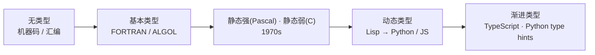

# 第 07 章 · 类型系统

**简体中文** ｜ [English](./07-type-system.en-US.md)

---

> 前六章我们一直在提"类型"——编译器做类型检查、运行时保存类型信息。这一章正面回答：类型到底是什么、约束了什么？为什么有的语言运行前就查类型、有的运行时才查？"强 / 弱""类型推导"又分别是什么？这是 Part 1「编程思想」的收官之章。

## 1. 学习目标

本章结束后，你将能够：

- 说清类型的本质：给数据附加的"它是什么、能做什么"的约定，以及据此进行的检查；
- 区分三条**互相独立**的维度：**静态 vs 动态**（何时检查）、**强 vs 弱**（是否容忍隐式转换）、**显式 vs 推导**（类型谁来写）；
- 理解类型检查的价值与代价：安全 / 性能 / 自文档 vs 灵活 / 简洁；
- 把类型系统接回前几章：静态检查属编译器的语义分析，动态类型信息由运行时保存；
- 把六门语言在这几条轴上的坐标画清楚。

---

## 2. 为什么会出现（核心问题）

> **核心问题：内存里其实只有 0 和 1。凭什么一段二进制"是整数""是字符串""是一个 Student 对象"？又是谁保证你不会把一个字符串当整数去做减法？**

类型系统就是这套“**约定 + 检查**”。它把"这块数据是什么、能参与哪些操作"变成机器可以检查的规则，从而带来三样东西：**尽早拦住错误**（把字符串当数字减，直接报错）、**让编译器能优化**（知道是 int 就能直接生成整数指令）、**让代码自带文档**（看签名就知道要传什么）。

没有类型，一切都是裸字节——你可以把任意一段位当任意东西解释，灵活，但极其危险。

---

## 3. 历史脉络

- **早期 · 无类型**：机器码与汇编里，一切都是"字（word）"，同一段位模式你想当整数还是地址都行——灵活却危险。
- **1950s–60s · 基本类型登场**：FORTRAN、ALGOL 引入整型 / 浮点等基本类型。
- **1970s · 两条路**：Pascal 走**强静态类型**（教学严谨）；C 是**静态但偏弱**（可随意 `cast`、指针互转）。
- **1969 / 1978 · 类型推导**：Hindley 与 Milner 提出的类型推断，让编译器能**自动推断**类型（ML 系语言），静态类型不再意味着到处手写类型。
- **动态类型谱系**：Lisp、Smalltalk，到后来的 Python / Ruby / JavaScript——类型信息附在**值**上、运行时才检查。
- **现代趋势 · 渐进类型（gradual typing）**：给动态语言加**可选的**静态类型——TypeScript（2012）、Python 类型标注（PEP 484，2014）。两个阵营正在互相靠拢。



---

## 4. 它到底是什么 · 底层主线

**类型是给数据附加的一组约定：它占多大、这些位如何解释、支持哪些操作。类型系统则是一套规则加检查，用来判断"某个操作对某个类型是否合法"。**

刻画一门语言的类型风格，主要看三条**彼此独立**的轴：

**① 静态 vs 动态（何时检查）**

- **静态**：**编译期**检查类型（C++ / Java / C# / TypeScript）。错误发现早、可优化、IDE 智能，但更啰嗦、得先让编译器满意。
- **动态**：**运行期**才检查（Python / JavaScript / Ruby）。灵活、写得快，但类型错误可能拖到运行时才炸。

```python
# Python（动态）：变量可以换类型，运行前不报错
x = 5
x = "hello"   # 合法
```

```cpp
// C++（静态）：类型编译期固定
int x = "hello";   // 编译错误
```

**② 强 vs 弱（对隐式转换的容忍度）**

- **强**：不容忍乱来的隐式转换。Python：`"1" + 1` 直接 `TypeError`。
- **弱**：容忍较多隐式转换。JavaScript：`"1" + 1 === "11"`、`1 + true === 2`。
- 注意：强 / 弱是一条**光谱**，不是非黑即白。

**③ 显式 vs 推导（类型谁来写）**

- **显式**：`int x = 1;`
- **推导（type inference）**：`auto x = 1;`（C++）、`var x = 1;`（Java / C#）——编译器帮你推断类型，但类型一经确定**不可再变**，仍是静态类型。

> ⚠️ **最容易混的一点："静态 / 动态"和"强 / 弱"是两条独立的轴，不是一回事。**
> - C 是**静态但偏弱**（编译期定类型，却允许随意 `cast`）；
> - Python 是**动态但强**（运行时才定类型，却不容忍 `"1" + 1`）；
> - JavaScript 是**动态且弱**；Haskell 是**静态且强**。
>
> 所以"强类型"绝不等于"静态类型"——这是初学者最常见的误解。

**接回前几章**：静态类型检查发生在编译器的**语义分析**阶段（第 03 章）；动态类型信息（每个值都带着自己的类型标签）由**运行时**保存（第 06 章），并支撑反射（第 29 章）。类型还直接影响**内存布局与性能**——静态已知类型可以省掉运行时的类型标签、直接内联操作。

---

## 5. 关键概念与术语

- **类型（Type）/ 类型系统（Type System）**：数据的约定 / 检查这些约定的规则。
- **静态类型 / 动态类型**：编译期检查 / 运行期检查。
- **强类型 / 弱类型**：对隐式转换的容忍度（是一条光谱）。
- **类型推导（Type Inference）/ 显式类型注解**：编译器推断类型 / 手写类型。
- **类型安全（Type Safety）**：类型系统能挡住多少非法操作。
- **渐进类型（Gradual Typing）**：给动态语言加可选静态类型（TypeScript、Python type hints）。
- **编译期错误 vs 运行期错误**：错误被抓住的时机。

---

## 6. 在本书六门语言中的体现

把六门语言放到这三条轴上：

| 语言 | 静 / 动 | 强 / 弱 | 类型怎么写 |
|------|:------:|:------:|-----------|
| JavaScript | 动态 | 偏弱（大量隐式转换） | 无需写（TypeScript 提供可选静态类型） |
| Python | 动态 | 强（少隐式转换） | 无需写（type hints 可选） |
| Java | 静态 | 强 | 显式为主，局部可用 `var` 推导 |
| C++ | 静态 | 偏弱（可随意 `cast` / 隐式转换） | 显式 + `auto` 推导 |
| C# | 静态 | 强 | 显式 + `var` 推导 |
| SQL | 静态（列类型固定） | 依方言（有隐式转换） | 建表时显式声明 |

同一个"数字加字符串"，最能看出强弱差异：

```javascript
// JavaScript（弱）：隐式转换
"1" + 1;   // "11"
1 + true;  // 2
```

```python
# Python（强）：拒绝隐式转换
"1" + 1    # TypeError
```

可以看到，六门语言几乎铺满了这个二维空间：JS（动态 + 弱）、Python（动态 + 强）、Java / C#（静态 + 强）、C++（静态 + 偏弱）、SQL（列级静态）。近年的趋势是两端互相靠拢——TypeScript 给 JS 加静态检查、Python 加类型标注，都是渐进类型。类型系统更深的内容（泛型、接口、反射）会在 Part 4「面向对象」展开。

---

## 7. 常见误解

- **"强类型 = 静态类型，弱类型 = 动态类型。"** 最大的误解——这是**两条独立的轴**。Python 动态但强，C 静态但弱。
- **"动态类型 = 没有类型。"** 有类型，只是类型附在**值**上、运行时检查，而非附在**变量**上、编译期检查。
- **"静态类型只是啰嗦。"** 它换来的是早发现错误、更好的工具、性能与自文档。
- **"类型推导 = 动态类型。"** 不是。`auto` / `var` 仍是**静态**类型，只是编译器帮你推断，一经确定不可变。
- **"用了 TypeScript，JS 就变强类型了。"** TS 加的是**静态**检查（编译期），而且类型在运行时会被擦除；强 / 弱是另一回事。

---

## 8. 思考题

1. "静态 / 动态"和"强 / 弱"是两条独立的轴。请各举一门"静态但偏弱"和"动态但强"的语言，并说明依据。
2. 动态类型语言真的"没有类型"吗？类型信息存放在哪里、何时被检查？
3. `auto x = 1;`（C++）和 Python 的 `x = 1` 看起来都"没写类型"，本质却完全不同。区别在哪？

---

## 9. 本章小结

**一句话总结**：类型是给数据附加的"是什么、能做什么"的约定，类型系统按规则检查操作是否合法；三条独立的轴——静 / 动（何时查）、强 / 弱（容不容忍隐式转换）、显式 / 推导（类型谁写）——共同刻画一门语言的类型风格。静态检查属编译器语义分析，动态类型信息由运行时保存。

**检查清单**：

- [ ] 我能说清"静态 / 动态"与"强 / 弱"是两条独立的轴，并各举反例。
- [ ] 我能解释"动态类型不等于没有类型"。
- [ ] 我能区分"类型推导"与"动态类型"。
- [ ] 我能把六门语言在这几条轴上大致定位。

**Part 1 收官**：至此，Part 1「编程思想」全部讲完——从"程序是什么"，到编译、解释、虚拟机、运行时、类型系统，你已经有了一整套"代码如何变成执行、语言在背后如何运作"的底层地图。

**下一章预告**：带着这套地图，我们进入 Part 2「语言基础」，从最基本的构件——第 08 章「变量」——开始，正式进入"六门语言逐一对照"的完整章节模板。

---

## 10. 延伸阅读

- <a href="https://en.wikipedia.org/wiki/Type_system" target="_blank" rel="noopener">Wikipedia：Type system</a> — 类型系统的维度与分类总览。
- <a href="https://en.wikipedia.org/wiki/Type_inference" target="_blank" rel="noopener">Wikipedia：Type inference</a> — 类型推导（含 Hindley–Milner）。
- <a href="https://www.typescriptlang.org/docs/handbook/intro.html" target="_blank" rel="noopener">TypeScript Handbook</a> — 给动态语言加静态类型的代表（渐进类型）。
- <a href="https://peps.python.org/pep-0484/" target="_blank" rel="noopener">PEP 484 · Type Hints</a> — Python 类型标注的官方提案。
