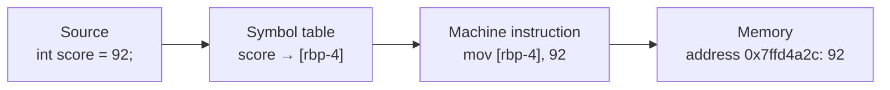
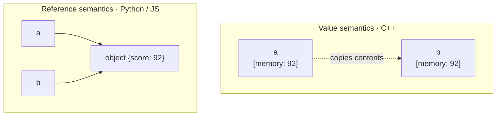

# Chapter 08 · Variables

[简体中文](./08-variables.md) ｜ **English**

---

> Welcome to Part 2. From this chapter on, we no longer merely "explain ideas" — we write **the same concept in all six languages** and compare them side by side.
>
> The first concept is the variable. It looks too simple to be worth discussing (who can't write `x = 1`?), yet this is exactly where the six languages diverge most deeply: the same line `b = a` **copies the data** in C++, but in Python it merely **gives the same object a second name**. Understand that difference and you hold the key to everything that follows in this book.

## 1. Learning Objectives

By the end of this chapter, you will be able to:

- State the essence of a variable: the binding chain **name → storage → value**, and why we don't just use memory addresses;
- Explain **where variable names go** after compilation (they vanish in compiled languages, but live on at runtime in dynamic ones);
- Distinguish **value semantics** from **reference semantics**, and predict the answer to "`b = a`; if `b` changes, does `a` change?" in each of the six languages;
- Write variable declarations, type annotations, and constants in all six languages;
- Avoid five classic variable pitfalls (hoisting, shared mutable objects, comparing references with `==`, uninitialized values, shadowing).

---

## 2. Why This Concept Exists

Recall the conclusion of Chapter 02: memory is just a long row of numbered slots, and the CPU only understands **addresses**. So the most primitive approach is to operate on addresses directly:

```asm
mov dword ptr [0x7ffd4a2c], 92    ; write 92 into address 0x7ffd4a2c
```

This has three fatal problems:

1. **Humans can't remember it**: what is `0x7ffd4a2c`? Three days later even you won't know;
2. **Change one thing, break everything**: insert data in the middle and every later address must be recomputed by hand;
3. **Not portable**: addresses are tied to a specific machine and layout.

Hence variables — **give a storage location a human-readable name, and let the compiler / runtime handle which memory that name actually refers to**.

```cpp
int score = 92;   // I just call it score; where and how many bytes is the compiler's job
```

This is a textbook **abstraction**: you give up direct control over addresses in exchange for readability, maintainability, and portability. It is the main thread of Chapter 01, replayed at the smallest possible scale.

---

## 3. How It Works

A variable is really the binding of three things:

```text
name  ──binds to──▶  storage  ──holds──▶  value
score                4 bytes on stack      92
```

At compile time or runtime, this chain is established like so:



**The key question: where does the variable name end up?** Two very different paths:

- **Statically compiled (C++)**: the name lives only at **compile time**. The compiler uses a **symbol table** to map `score` to a stack-frame offset `[rbp-4]`, then discards the name — the final machine code contains no string `score` at all (unless you compile with debug info). So accessing a variable is one memory instruction, at essentially zero cost.
- **Dynamically interpreted (Python / JavaScript)**: the name lives on **at runtime**. It is kept in a runtime mapping structure (Python's `globals()` dict / local variable array, JavaScript's Environment Record), while the value is an object on the heap. Accessing a variable may require a lookup — which is also exactly why `getattr`, `eval`, and `globals()` are possible.

**The second key question: what *is* a variable?** Here lies this chapter's deepest divide:

- **Variable as storage (the C++ model)**: the variable **is** that block of memory. `int a = 92;` means "this 4-byte block is named a." Assignment `b = a` **copies** the contents, after which the two are unrelated — this is **value semantics**.
- **Variable as name (the Python / JS model)**: a variable is merely a **label pointing at an object**. `a = 92` means "the name a is now bound to the object whose value is 92." Assignment `b = a` binds `b` to the **same object** — this is **reference semantics** (Python officially calls it *name binding*).



**Java / C# take the middle road**: they split types in two — **primitives / value types** (`int`, `double`, `struct`) use value semantics, while **reference types** (objects, arrays) use reference semantics. That is why `int b = a` and `int[] b = a` behave completely differently in Java.

> ⚠️ **Note: "reference" here is used loosely.**
> In this chapter, "reference semantics" means "the variable holds something pointing at an object." But **C++'s `int& ref` is a different thing** — it is an **alias** for a variable (a second name for the same memory), which is stricter than the "reference" discussed here. The precise distinctions (pointer / reference / value) come in Part 5, "Runtime," Chapters 33–35.

---

## 4. JavaScript

**Declaration**: modern JavaScript uses `let` (reassignable) and `const` (not reassignable); `var` is discouraged because of its scoping and hoisting behavior.

```javascript
let studentName = "Alice";     // mutable binding
const MAX_SCORE = 100;         // constant: cannot be reassigned
let age = 20;
let score = 92;

// Variables have no type; the type rides on the value
console.log(typeof score);     // "number"
score = "A+";
console.log(typeof score);     // "string" — same variable, new type
```

**Assignment semantics**: primitives (number / string / boolean, etc.) copy the value; objects copy the reference.

```javascript
let a = 92;
let b = a;
b = 60;
console.log(a, b);             // 92 60 — independent

let s1 = { name: "Alice", score: 92 };
let s2 = s1;                   // copies the reference, not the object
s2.score = 60;
console.log(s1.score);         // 60 — s1 "changed" too
```

> **Note**: `const` locks the **binding**, not the object's contents. `const s = {score: 92}; s.score = 60;` is perfectly legal, but `s = {}` throws.

---

## 5. Python

**Declaration**: no keyword needed — assignment creates a binding. Python has no true constants; **ALL-CAPS naming** expresses the convention.

```python
student_name = "Alice"
MAX_SCORE = 100          # a "constant" by convention; the language won't stop you
age = 20
score = 92

print(type(score).__name__)   # int
score = "A+"
print(type(score).__name__)   # str — the type rides on the value
```

**Assignment semantics**: in Python everything is an object, and a variable is always a **name binding**. What you observe depends on whether the object is **mutable**:

```python
a = 92
b = a
b = 60                 # int is immutable: b is rebound to a new object
print(a, b)            # 92 60

s1 = {"name": "Alice", "score": 92}
s2 = s1                # two names, one object
s2["score"] = 60       # dict is mutable: modified in place
print(s1["score"])     # 60
print(s1 is s2)        # True — confirming it's the same object
```

> **Note**: `b = a` never copies an object. When `a` is an `int` it merely *looks* independent, because `int` is **immutable** — `b = 60` can only rebind, never modify in place. Use `is` to ask "same object?" and `==` to ask "equal value?"

---

## 6. Java

**Declaration**: statically typed — you must state the type (or use Java 10+'s `var` for inference); `final` means "cannot be reassigned."

```java
String studentName = "Alice";
final int MAX_SCORE = 100;     // constant: cannot be reassigned
int age = 20;
var score = 92;                // inferred as int; still static — the type can't change later
```

**Assignment semantics**: determined by the type — primitives (`int`/`double`/`boolean`…) use value semantics, reference types (objects/arrays) use reference semantics.

```java
int a = 92;
int b = a;
b = 60;
System.out.println(a + " " + b);      // 92 60 — primitives copy the value

int[] s1 = {92};
int[] s2 = s1;                        // copies the reference
s2[0] = 60;
System.out.println(s1[0]);            // 60 — the same array
```

> **Note**: `final` works like JavaScript's `const` — it locks the binding, not the contents; the elements of a `final int[] arr` can still change. Also, `var` may only be used for **local variables** and must be initialized at declaration.

---

## 7. C++

**Declaration**: statically typed; `const` for constants, `auto` for type inference.

```cpp
std::string studentName = "Alice";
const int MAX_SCORE = 100;
int age = 20;
auto score = 92;               // inferred as int
```

**Assignment semantics**: **value semantics** by default — the variable *is* that memory, and assignment copies contents.

```cpp
int a = 92;
int b = a;                     // a full copy
b = 60;
std::cout << a << " " << b;    // 92 60

int& ref = a;                  // reference: an alias for a, not a new variable
ref = 60;
std::cout << a;                // 60 — because ref and a are the same memory
```

C++ is the only one of the six that lets you **see the address directly**, which best confirms "a variable is storage":

```cpp
std::cout << &a;               // prints a's memory address, e.g. 0x7ffd4a2c
```

> **Note**: an **uninitialized local variable holds an indeterminate value**, and reading it is undefined behavior (unlike Java/C#, which either error out or zero it). Always initialize at declaration.

---

## 8. C#

**Declaration**: statically typed, distinguishing `const` (compile-time constant) from `readonly` (runtime read-only); `var` for type inference.

```csharp
string studentName = "Alice";
const int MaxScore = 100;      // compile-time constant
int age = 20;
var score = 92;                // inferred as int
```

**Assignment semantics**: similar to Java, but C# lets **you decide** — a `struct` is a value type, a `class` is a reference type.

```csharp
int a = 92;
int b = a;                     // value type: copied
b = 60;
Console.WriteLine($"{a} {b}"); // 92 60

int[] s1 = { 92 };
int[] s2 = s1;                 // reference type: reference copied
s2[0] = 60;
Console.WriteLine(s1[0]);      // 60
```

> **Note**: `const` must be known at compile time and is limited to primitives / strings; for a constant assigned once at runtime, use `readonly`. C#'s value-type system is more complete than Java's (user-defined `struct`s), which significantly affects performance and memory layout (see Part 5).

---

## 9. SQL (where relevant)

SQL is a **declarative** language, so "variables" occupy a very different position here. Look at it in two layers:

**① Columns: the real counterpart of "typed storage"**

A column declared at table creation is the closest thing to a variable in the SQL world — it has a name, a type, and storage:

```sql
CREATE TABLE student (
    name  TEXT,
    age   INTEGER,
    score INTEGER
);
INSERT INTO student VALUES ('Alice', 20, 92);
```

**② Local / session variables: procedural extensions, differing by dialect**

Standard SQL itself has no universal variable syntax; these are per-database extensions:

```sql
-- SQL Server
DECLARE @max_score INT = 100;
-- MySQL
SET @max_score = 100;
-- PostgreSQL (inside a PL/pgSQL block)
DECLARE max_score int := 100;
```

To "name a value" portably across databases, use a CTE:

```sql
WITH params(max_score) AS (VALUES (100))
SELECT name, score,
       ROUND(score * 100.0 / (SELECT max_score FROM params), 1) AS pct
FROM student;
-- output: Alice|92|92.0
```

> **The essential difference**: in the other five languages, a variable is an "imperative container of state" — you keep reading and mutating it. A SQL column is "an attribute in a relation": you **describe** what you want rather than changing variables step by step. This is precisely the declarative branch from Chapter 01.

---

## 10. Cross-Language Comparison

**① Syntax comparison**

| Feature | JavaScript | Python | Java | C++ | C# |
|---------|-----------|--------|------|-----|-----|
| Mutable declaration | `let x = 1` | `x = 1` | `int x = 1` | `int x = 1` | `int x = 1` |
| Constant | `const X = 1` | `X = 1` (convention only) | `final int X = 1` | `const int X = 1` | `const int X = 1` |
| Type inference | untyped by nature | untyped by nature | `var x = 1` | `auto x = 1` | `var x = 1` |
| When types are checked | runtime | runtime | compile time | compile time | compile time |
| Can a variable change type | yes | yes | no | no | no |
| Default assignment semantics | primitive value / object reference | name binding | primitive value / object reference | **value (copy)** | value type / reference type |
| Uninitialized | `undefined` | `NameError` | compile error for locals | **indeterminate value** | compile error for locals |

**② What they share**

All five provide the core abstraction of "naming storage," all support some notion of constants (with differing strength), and all have scoping rules (detailed in Chapter 13).

**③ Differences and when they matter**

The real watershed is **assignment semantics**: C++ copies by default, Python/JS share a binding by default, Java/C# split by type. This is the most common source of bugs when working across languages — carrying the C++ intuition ("changing one variable can't affect another") into Python produces subtle bugs.

---

## 11. Underlying Implementation Comparison

| Language · Engine | Where the name lives | Where the value lives | Access cost |
|-------------------|---------------------|----------------------|-------------|
| **JavaScript · V8** | Environment Record; object properties via Hidden Classes | small values on the stack / objects on the GC heap | fast (inline caches make it near a direct load) |
| **Python · CPython** | locals in array slots, globals in a `dict` | always a heap `PyObject` with a reference count | slower (object boxing + possible dict lookup) |
| **Java · JVM** | slots in the Local Variable Table | primitives on the stack; objects on the heap, variable holds a reference | fast (near-native after JIT) |
| **C++ · Native** | **gone after compilation**, only a stack offset `[rbp-4]` remains | stack / heap / static area — you decide | fastest (one memory instruction) |
| **C# · CLR** | local variable slots | value types on the stack / inlined; reference types on the managed heap | fast (near-native after JIT) |

This table explains a lot of "why"s:

- **Why Python is slow**: in CPython, `a = 92` is not "write 92 into 4 bytes" but requires a full `PyObject` (with a type pointer and reference count), with the variable merely naming it. A single integer addition hides several layers of indirection.
- **Why C++ is fast**: the variable name does not exist at runtime at all; accessing a variable is one `mov` instruction.
- **Why JS can also be fast**: V8 uses hidden classes and inline caches to optimize dynamic lookups into near fixed-offset accesses (see Chapter 06 on JIT).

---

## 12. Performance Analysis

**Time complexity**: reading and writing a variable is **O(1)** everywhere, but the constant factors differ enormously:

| Operation | C++ | Java / C# | JavaScript | Python |
|-----------|-----|-----------|-----------|--------|
| Read a local | 1 memory instruction | ~1 after JIT | ~1 after optimization | array slot → pointer → dereference |
| Read a global | 1 memory instruction | static field access | scope-chain lookup | **dict hash lookup** |
| Integer addition | 1 CPU instruction | 1 after JIT | 1 after JIT | create/look up a `PyObject` |

**Space complexity**: an `int` is 4 bytes in C++/Java/C#; in CPython a small integer object is about 28 bytes (type pointer, reference count, etc.) — **nearly 7×**. This is exactly why data-heavy Python code reaches for NumPy (backed by compact C arrays).

**Practical advice**: prefer locals over globals (especially in Python, where locals use array slots and globals use a dict); in C++, pass large objects by reference to avoid copies.

---

## 13. Engineering Practice

**Recommended / discouraged in real projects**:

| Scenario | ✅ Recommended | ❌ Discouraged | Why |
|----------|---------------|---------------|-----|
| JavaScript declarations | `const` first, `let` only when reassigning | using `var` | `var` has function scoping and hoisting problems |
| Python "constants" | ALL-CAPS + type annotation, or `Final[int]` | relying on a comment | so tools can check it |
| Java params and locals | mark `final` where possible | freely reassignable | less mental load, better for concurrency |
| C++ parameter passing | `const T&` for large objects | passing large objects by value | avoids needless deep copies |
| C# constants | `const` for compile time, `readonly` for runtime | `const` everywhere | `const` gets inlined into calling assemblies |
| Cross-language work | document assignment semantics explicitly | assuming "it's like the language I know" | value/reference differences are the biggest cross-language trap |

**One general principle**: **default to immutable**. Write `const` / `final` first and loosen it only when you genuinely need to mutate. This eliminates a whole class of "who changed this?" bugs.

---

## 14. Best Practices

- **Name for intent**: `score` rather than `s`, `maxRetryCount` rather than `n`. Variable names exist for humans — that is the entire point of variables.
- **Follow each language's conventions**: `camelCase` in JavaScript/Java/C++, `snake_case` in Python, `PascalCase` for C# public members with `camelCase` locals; constants are usually `UPPER_SNAKE` (C# idiomatically uses `PascalCase`).
- **Initialize at declaration**: especially in C++, where an uninitialized local is undefined behavior.
- **Narrow the scope**: declare variables **as close to their use** as possible, not all at the top of a function.
- **One variable, one purpose**: don't reuse a variable to hold data with different meanings.
- **Prefer immutability**: see the previous section.

---

## 15. Common Pitfalls

**Pitfall 1 · JavaScript's `var` hoisting**

```javascript
console.log(x);   // undefined, not an error
var x = 5;
```
**Why it's wrong**: the `var` declaration is hoisted to the top of the function while the assignment stays put.
**How to avoid**: use `let` / `const`, whose temporal dead zone makes early access throw immediately.

**Pitfall 2 · Sharing mutable objects in Python / JS**

```python
a = [1, 2, 3]
b = a          # not a copy!
b.append(4)
print(a)       # [1, 2, 3, 4] — a changed too
```
**Why it's wrong**: assignment only adds another name; there is still only one object.
**How to avoid**: copy explicitly when you need one — `b = a.copy()` / `list(a)` (JS: `[...a]`), and `copy.deepcopy` for nested structures.

**Pitfall 3 · Comparing objects with `==` in Java / C#**

```java
String a = new String("hi");
String b = new String("hi");
System.out.println(a == b);        // false — compares references
System.out.println(a.equals(b));   // true  — compares contents
```
**Why it's wrong**: for reference types, `==` asks "is it the same object?"
**How to avoid**: always use `equals()` for value comparison (in C#, `Equals()` or an overloaded `==`).

**Pitfall 4 · Uninitialized variables in C++**

```cpp
int score;                  // holds an indeterminate value
std::cout << score;         // undefined behavior: maybe 0, maybe garbage
```
**Why it's wrong**: C++ does not zero locals automatically, in the name of zero overhead.
**How to avoid**: `int score = 0;` or `int score{};` — initialize at declaration.

**Pitfall 5 · Shadowing**

```python
score = 92
def f():
    print(score)     # UnboundLocalError!
    score = 60       # because of this line, score is local throughout the function
```
**Why it's wrong**: Python decides which names are local **when it compiles the function** — an assignment anywhere in the body makes that name local everywhere in it.
**How to avoid**: declare `global` / `nonlocal` explicitly when you must modify an outer variable; better still, use parameters and return values.

**Pitfall 6 · Assuming `const` / `final` freezes contents**

```javascript
const student = { score: 92 };
student.score = 60;      // legal! const only locks the binding
student = {};            // TypeError: cannot rebind
```
**How to avoid**: use `Object.freeze()` (JS), immutable collections (Java's `List.of()`), or `const T&` (C++) when you need truly frozen contents.

---

## 16. Interview Questions

**Basic**

1. What are the differences between `let`, `const`, and `var`? Why is `var` discouraged in modern JavaScript?
2. What is the difference between `int` and `Integer` in Java? What are their assignment semantics?
3. What is the difference between `is` and `==` in Python?

**Intermediate**

4. Explain this Python output and the object model behind it:
   ```python
   a = [1, 2]; b = a; b += [3]; print(a)     # [1, 2, 3]
   a = [1, 2]; b = a; b = b + [3]; print(a)  # [1, 2]
   ```
   (Hint: `+=` mutates a list in place; `+` creates a new object.)
5. What is the difference between `int& ref = a` and `int* ptr = &a` in C++?
6. Why do we say `const` / `final` lock the binding rather than the value? Give an example.

**Advanced**

7. Explain from memory layout: why does a CPython `int` take about 28 bytes while a C++ `int` takes 4? What does this mean for performance?
8. How do V8's hidden classes make property access in a dynamically typed language approach static-language speed?
9. The "Java pass-by-value" debate: is Java pass-by-value or pass-by-reference? Explain it clearly using the variable model. (Hint: Java is always pass-by-value — what is passed is a **copy of the reference**.)

---

## 17. Exercises

**Basic**

1. In all six languages, declare `Student`'s `name`, `age`, and `score` and print them, expressing `MAX_SCORE = 100` with each language's constant mechanism.
2. In JavaScript, Python, Java, C++, and C#, verify whether modifying `b` after `b = a` changes `a`. Try it once with a primitive type and once with an object/array, and record the results.

**Intermediate**

3. Write code proving that `b = a` in Python does not copy the object (hint: use `id()` or `is`), then write a correct "copy" version.
4. In C++, print the address of a variable and of its reference to verify that "a reference is an alias, not a new variable."
5. Build your own "assignment semantics cheat sheet" covering six languages × (primitive / collection types) and save it under `cheatsheets/`.

**Challenge**

6. In C++, write a function that takes a large object (e.g. a `std::vector` with a million elements) **by value** and by **`const&`**, measure the time difference with `std::chrono`, and explain it.
7. In Python, use `sys.getsizeof()` to measure the real memory footprint of `int`, `list`, and `dict`, compare against the corresponding C++ types, and write up your analysis.

---

## 18. Summary

**In one sentence**: a variable is the binding of "name → storage → value"; the six languages truly diverge not in syntax but in **what that chain means** — in C++ the variable **is** the storage (value semantics), in Python/JS it is only a **name pointing at an object** (reference semantics), and Java/C# split the difference by type.

**Core takeaways**

- Variables exist to replace raw memory addresses with readable names — a textbook abstraction.
- Variable names **vanish** after C++ compilation (leaving only stack offsets) but **live on at runtime** in Python/JS (which is what enables their dynamic features).
- What `b = a` means differs by language — the most common cross-language trap.
- `const` / `final` lock the **binding**, not the contents.

**Checklist**

- [ ] I can draw the "name → storage → value" chain and explain how each language differs.
- [ ] I can predict, in all six languages, whether modifying `b` after `b = a` changes `a`.
- [ ] I can explain why a CPython `int` is several times larger than a C++ `int`.
- [ ] I can name five or more common variable pitfalls and avoid them.

**Next chapter**: this chapter said variables have types — but what *is* a type? Why is an `int` 4 bytes? Why does `0.1 + 0.2 !== 0.3`? And how do the six languages' type systems map onto memory? That is Chapter 09, "Data Types."

---

## 19. Further Reading

- <a href="https://developer.mozilla.org/en-US/docs/Web/JavaScript/Reference/Statements/let" target="_blank" rel="noopener">MDN · let declaration</a> — the authoritative account of JavaScript declarations and the temporal dead zone.
- <a href="https://docs.python.org/3/reference/executionmodel.html" target="_blank" rel="noopener">The Python Language Reference · Execution model</a> — the official definition of *name binding*.
- <a href="https://docs.oracle.com/javase/specs/jls/se21/html/jls-4.html" target="_blank" rel="noopener">The Java Language Specification · Chapter 4: Types, Values, and Variables</a> — the normative definition of Java variables and types.
- <a href="https://en.cppreference.com/w/cpp/language/storage_duration" target="_blank" rel="noopener">cppreference · Storage duration and initialization</a> — C++ storage duration and uninitialized behavior.
- <a href="https://learn.microsoft.com/en-us/dotnet/csharp/language-reference/builtin-types/value-types" target="_blank" rel="noopener">Microsoft Learn · C# value types</a> — the official comparison of value and reference types in C#.
