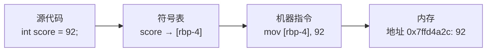
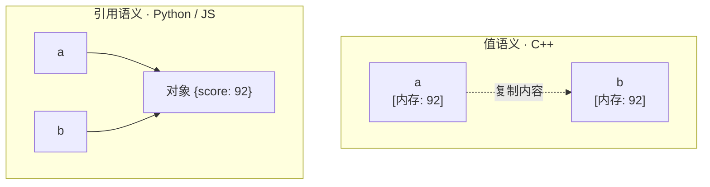

# 第 08 章 · 变量

**简体中文** ｜ [English](./08-variables.en-US.md)

---

> 欢迎来到 Part 2。从这一章起，我们不再只是"讲道理"，而是**同一个概念、六门语言各写一遍**，横向对比。
>
> 第一个概念就是变量——它看起来简单到不值一提（谁不会写 `x = 1`？），但恰恰是这里，六门语言的分歧最深：同样一行 `b = a`，在 C++ 里是**复制了一份数据**，在 Python 里却是**给同一个对象多起了一个名字**。理解了这个差异，你就拿到了理解全书后续所有内容的钥匙。

## 1. 学习目标

本章结束后，你将能够：

- 说清变量的本质：**名字 → 存储 → 值**这条绑定链，以及"为什么不直接用内存地址";
- 解释变量名在编译后**去了哪里**（编译型语言里消失，动态语言里仍活在运行时）；
- 区分**值语义**与**引用语义**，并预测 `b = a; b 变了，a 会不会变？`在六门语言中的不同答案；
- 写出六门语言的变量声明、类型标注与常量定义；
- 避开变量相关的五个经典陷阱（提升、共享可变对象、`==` 比较引用、未初始化、遮蔽）。

---

## 2. 为什么会出现这个概念

回到第 02 章的结论：内存只是一大排编了号的格子，CPU 只认**地址**。所以最原始的写法是直接操作地址：

```asm
mov dword ptr [0x7ffd4a2c], 92    ; 把 92 写进 0x7ffd4a2c 这个地址
```

这样写有三个致命问题：

1. **人记不住**：`0x7ffd4a2c` 是什么？三天后你自己也不知道；
2. **改一处、动全身**：想在中间插入一个数据，后面所有地址都得手工重算；
3. **不可移植**：地址与具体机器、具体布局强绑定。

于是有了变量——**给存储位置起一个人类可读的名字，让编译器 / 运行时去负责"名字到底对应哪块内存"**。

```cpp
int score = 92;   // 我只管叫它 score，具体放哪、放几个字节，编译器安排
```

这是一次典型的**抽象**：你交出了对地址的直接控制，换来了可读性、可维护性与可移植性。这正是第 01 章那条主线在最小尺度上的重演。

---

## 3. 底层原理

一个变量，实际上是三样东西的绑定：

```text
名字 (name)  ──绑定──▶  存储 (storage)  ──保存──▶  值 (value)
   score                栈上 4 字节            92
```

编译或运行时，这条链是这样建立的：



**关键问题：变量名最后去哪了？** 两条路径截然不同：

- **静态编译型（C++）**：变量名只活在**编译期**。编译器用一张**符号表**把 `score` 映射成"栈帧偏移 `[rbp-4]`"，然后名字就被丢弃了——最终的机器码里根本没有 `score` 这个字符串（除非你带调试信息编译）。所以访问变量 = 一条访存指令，几乎零开销。
- **动态解释型（Python / JavaScript）**：变量名活到**运行时**。名字被保存在一张运行时的映射结构里（Python 的 `globals()` 字典 / 局部变量数组，JS 的 Environment Record），值则是堆上的对象。所以访问变量可能需要一次查找，也因此才能支持 `getattr`、`eval`、`globals()` 这类动态能力。

**第二个关键问题：变量到底"是"什么？** 这里出现了本章最深的分水岭：

- **变量即存储（C++ 模型）**：变量**就是**那块内存。`int a = 92;` 的意思是"这块 4 字节内存名叫 a"。赋值 `b = a` 就是把内容**复制**过去，从此两者互不相干——这叫**值语义**。
- **变量即名字（Python / JS 模型）**：变量只是一个**指向对象的标签**。`a = 92` 的意思是"名字 a 现在绑定到那个值为 92 的对象"。赋值 `b = a` 是让 b 绑定到**同一个对象**——这叫**引用语义**（Python 官方称之为 *name binding*）。



**Java / C# 走的是折中路线**：把类型分成两类——**基本类型 / 值类型**（`int`、`double`、`struct`）用值语义，**引用类型**（对象、数组）用引用语义。这就是为什么 Java 里 `int b = a` 和 `int[] b = a` 行为完全不同。

> ⚠️ **注意：这里的"引用"是宽泛说法。**
> 本章说的"引用语义"指"变量存的是指向对象的东西"。但 **C++ 的 `int& ref` 是另一回事**——它是变量的**别名**（同一块内存的第二个名字），比这里说的"引用"更严格。三者的精确区别（指针 / 引用 / 值）会在 Part 5「运行时」第 33–35 章展开。

---

## 4. JavaScript

**声明方式**：现代 JavaScript 用 `let`（可重新赋值）和 `const`（不可重新赋值），`var` 因作用域与提升问题已不推荐。

```javascript
let studentName = "Alice";     // 可变
const MAX_SCORE = 100;         // 常量：不可重新赋值
let age = 20;
let score = 92;

// 变量无类型，类型跟着值走
console.log(typeof score);     // "number"
score = "A+";
console.log(typeof score);     // "string" —— 同一变量换了类型
```

**赋值语义**：原始类型（number / string / boolean 等）复制值，对象复制引用。

```javascript
let a = 92;
let b = a;
b = 60;
console.log(a, b);             // 92 60 —— 互不影响

let s1 = { name: "Alice", score: 92 };
let s2 = s1;                   // 复制的是引用，不是对象
s2.score = 60;
console.log(s1.score);         // 60 —— s1 也"变"了
```

> **注意事项**：`const` 锁住的是**绑定**，不是对象内容。`const s = {score: 92}; s.score = 60;` 完全合法；但 `s = {}` 会报错。

---

## 5. Python

**声明方式**：无需声明关键字，赋值即创建绑定。Python 没有真正的常量，靠**全大写命名**表达约定。

```python
student_name = "Alice"
MAX_SCORE = 100          # 约定俗成的"常量"，语言层面并不阻止修改
age = 20
score = 92

print(type(score).__name__)   # int
score = "A+"
print(type(score).__name__)   # str —— 类型跟着值走
```

> ⚠️ **为什么 Python 不用写类型，也不用写声明关键字？**
>
> - **不写类型**：在 Python 中，类型属于**值**，不属于变量。`92` 这个对象自己就知道它是整数，变量只是贴在它上面的标签——标签不需要类型。
> - **不写声明关键字**：在 Python 中，**赋值本身就是创建变量**，没有"先声明、再赋值"这两个步骤，自然也就不需要关键字去区分它们。
> - **没有常量**：Python 不提供常量机制，只用全大写命名表达"请勿修改"的约定。
>
> 另外澄清一个常见误解：**Python 是强类型语言**，不是弱类型。"动态"说的是类型在运行时才确定，"强"说的是不做隐式转换——`"1" + 1` 在 Python 里会直接报错。这是两件不同的事（详见第 07 章）。

**赋值语义**：Python 中一切皆对象，变量永远是**名字绑定**。差异表现取决于对象**是否可变**：

```python
a = 92
b = a
b = 60                 # int 不可变：b 重新绑定到新对象
print(a, b)            # 92 60

s1 = {"name": "Alice", "score": 92}
s2 = s1                # 两个名字，同一个对象
s2["score"] = 60       # dict 可变：原地修改
print(s1["score"])     # 60
print(s1 is s2)        # True —— 确认是同一对象
```

> **注意事项**：`b = a` 从不复制对象。`a` 是 `int` 时看起来"独立"，只是因为 `int` **不可变**，`b = 60` 只能重新绑定而无法原地改。用 `is` 判断"是否同一对象"，用 `==` 判断"值是否相等"。

---

## 6. Java

**声明方式**：静态类型，必须声明类型（或用 Java 10+ 的 `var` 让编译器推导）；`final` 表示不可重新赋值。

```java
String studentName = "Alice";
final int MAX_SCORE = 100;     // 常量：不可重新赋值
int age = 20;
var score = 92;                // 推导为 int，仍是静态类型，之后不可换类型
```

**赋值语义**：由类型决定——基本类型（`int`/`double`/`boolean`…）值语义，引用类型（对象/数组）引用语义。

```java
int a = 92;
int b = a;
b = 60;
System.out.println(a + " " + b);      // 92 60 —— 基本类型复制值

int[] s1 = {92};
int[] s2 = s1;                        // 复制引用
s2[0] = 60;
System.out.println(s1[0]);            // 60 —— 同一个数组
```

> **注意事项**：`final` 与 JavaScript 的 `const` 同理——锁定的是绑定而非内容，`final int[] arr` 的元素仍可修改。另外 `var` 只能用于**局部变量**，且必须在声明时初始化。

---

## 7. C++

**声明方式**：静态类型，`const` 表示常量，`auto` 让编译器推导类型。

```cpp
std::string studentName = "Alice";
const int MAX_SCORE = 100;
int age = 20;
auto score = 92;               // 推导为 int
```

**赋值语义**：默认**值语义**——变量就是那块内存，赋值即复制内容。

```cpp
int a = 92;
int b = a;                     // 完整复制
b = 60;
std::cout << a << " " << b;    // 92 60

int& ref = a;                  // 引用：a 的别名，不是新变量
ref = 60;
std::cout << a;                // 60 —— 因为 ref 和 a 是同一块内存
```

C++ 是唯一让你**直接看见地址**的语言，这也最能印证"变量就是存储"：

```cpp
std::cout << &a;               // 打印 a 的内存地址，如 0x7ffd4a2c
```

> **注意事项**：**未初始化的局部变量含有不确定值**，读取它是未定义行为（不像 Java/C# 会报错或清零）。务必声明即初始化。

---

## 8. C#

**声明方式**：静态类型，`const`（编译期常量）与 `readonly`（运行期只读）区分开，`var` 用于类型推导。

```csharp
string studentName = "Alice";
const int MaxScore = 100;      // 编译期常量
int age = 20;
var score = 92;                // 推导为 int
```

**赋值语义**：与 Java 类似，但 C# 让你**自己决定**——`struct` 是值类型，`class` 是引用类型。

```csharp
int a = 92;
int b = a;                     // 值类型：复制
b = 60;
Console.WriteLine($"{a} {b}"); // 92 60

int[] s1 = { 92 };
int[] s2 = s1;                 // 引用类型：复制引用
s2[0] = 60;
Console.WriteLine(s1[0]);      // 60
```

> **注意事项**：`const` 必须在编译期可知且只能用于基本类型 / 字符串；需要运行期赋值一次的常量用 `readonly`。C# 的值类型体系比 Java 更完整（自定义 `struct`），这会显著影响性能与内存布局（详见 Part 5）。

---

## 9. SQL

SQL 是**声明式**语言，"变量"在这里的地位与前五种完全不同，需要分两层看：

**① 列（Column）：真正对应"有类型的存储"**

建表时声明的列，才是 SQL 世界里最接近"变量"的东西——它有名字、有类型、有存储：

```sql
CREATE TABLE student (
    name  TEXT,
    age   INTEGER,
    score INTEGER
);
INSERT INTO student VALUES ('Alice', 20, 92);
```

**② 局部/会话变量：属于过程式扩展，各方言不同**

标准 SQL 本身没有通用的变量语法，这是各数据库的扩展：

```sql
-- SQL Server
DECLARE @max_score INT = 100;
-- MySQL
SET @max_score = 100;
-- PostgreSQL（PL/pgSQL 代码块内）
DECLARE max_score int := 100;
```

需要跨数据库地"给一个值起名"，可移植的做法是用 CTE：

```sql
WITH params(max_score) AS (VALUES (100))
SELECT name, score,
       ROUND(score * 100.0 / (SELECT max_score FROM params), 1) AS pct
FROM student;
-- 输出：Alice|92|92.0
```

> **本质区别**：前五门语言的变量是"命令式的状态容器"——你不断读它、改它；SQL 的列是"关系中的属性"，你**描述**要什么，而不是一步步改变量。这正是第 01 章说的声明式分支。

---

## 10. 五语言横向对比

**① 语法对比**

| 特性 | JavaScript | Python | Java | C++ | C# |
|------|-----------|--------|------|-----|-----|
| 声明可变变量 | `let x = 1` | `x = 1` | `int x = 1` | `int x = 1` | `int x = 1` |
| 常量 | `const X = 1` | `X = 1`（仅约定） | `final int X = 1` | `const int X = 1` | `const int X = 1` |
| 类型推导 | 天然无类型 | 天然无类型 | `var x = 1` | `auto x = 1` | `var x = 1` |
| 类型检查时机 | 运行期 | 运行期 | 编译期 | 编译期 | 编译期 |
| 变量能否换类型 | 能 | 能 | 不能 | 不能 | 不能 |
| 默认赋值语义 | 原始值/对象引用 | 名字绑定 | 基本值/对象引用 | **值（复制）** | 值类型/引用类型 |
| 未初始化 | `undefined` | `NameError` | 局部变量编译报错 | **未定义值** | 局部变量编译报错 |

**② 共同点**

五门语言都提供"给存储起名字"这一核心抽象，都支持常量语义（虽强度不同），也都有作用域概念（第 13 章详解）。

**③ 区别与适用场景**

真正的分水岭是**赋值语义**：C++ 默认复制，Python/JS 默认共享绑定，Java/C# 按类型二分。写跨语言代码时，这是最容易出错的地方——把"改一个变量不会影响另一个"的 C++ 直觉带到 Python，就会写出隐蔽的 bug。

---

## 11. 底层实现对比

| 语言 · 引擎 | 变量名保存在哪 | 值存在哪 | 访问代价 |
|------------|--------------|---------|---------|
| **JavaScript · V8** | Environment Record；对象属性走隐藏类（Hidden Class） | 栈上小值 / 堆上对象，带 GC | 快（内联缓存优化后接近直接访存） |
| **Python · CPython** | 局部变量在数组槽位、全局变量在 `dict` | 一律是堆上 `PyObject`，带引用计数 | 较慢（对象封装 + 可能的字典查找） |
| **Java · JVM** | 局部变量表（Local Variable Table）的槽位 | 基本类型在栈；对象在堆，变量存引用 | 快（JIT 后近似原生） |
| **C++ · Native** | **编译后消失**，只剩栈帧偏移 `[rbp-4]` | 栈 / 堆 / 静态区，由你决定 | 最快（一条访存指令） |
| **C# · CLR** | 局部变量槽位 | 值类型在栈/内联；引用类型在托管堆 | 快（JIT 后近似原生） |

这张表解释了很多"为什么"：

- **为什么 Python 慢**：`a = 92` 在 CPython 里不是"往 4 字节里写 92"，而是要有一个完整的 `PyObject` 对象（含类型指针和引用计数），变量只是指向它的名字。一次整数加法背后是好几层间接。
- **为什么 C++ 快**：变量名在运行时根本不存在，访问变量就是一条 `mov` 指令。
- **为什么 JS 也能很快**：V8 用隐藏类和内联缓存，把动态查找优化成近似固定偏移的访问（详见第 06 章 JIT）。

---

## 12. 性能分析

**时间复杂度**：变量的读写本身都是 **O(1)**，但常数因子差异巨大：

| 操作 | C++ | Java / C# | JavaScript | Python |
|------|-----|-----------|-----------|--------|
| 读局部变量 | 1 条访存指令 | JIT 后近似 1 条 | 优化后近似 1 条 | 数组槽位取指针 + 解引用 |
| 读全局变量 | 1 条访存指令 | 静态字段访问 | 作用域链查找 | **字典哈希查找** |
| 整数加法 | 1 条 CPU 指令 | JIT 后 1 条 | JIT 后 1 条 | 创建/查找 `PyObject` |

**空间复杂度**：一个 `int` 在 C++/Java/C# 里就是 4 字节；在 CPython 里，一个小整数对象约 28 字节（含类型指针、引用计数等）——**近 7 倍**。这就是为什么数据密集型 Python 代码要用 NumPy（底层是紧凑的 C 数组）。

**实践建议**：局部变量优先于全局变量（尤其在 Python 里，局部走数组槽位、全局走字典）；C++ 中大对象传参用引用避免复制。

---

## 13. 工程实践

**真实项目里的推荐 / 不推荐**：

| 场景 | ✅ 推荐 | ❌ 不推荐 | 原因 |
|------|--------|----------|------|
| JavaScript 声明 | `const` 优先，需要改才用 `let` | 用 `var` | `var` 有函数作用域与提升问题 |
| Python "常量" | 全大写 + 类型标注，或 `Final[int]` | 依赖注释说明 | 让工具能检查 |
| Java 参数与局部量 | 能 `final` 就 `final` | 到处可重新赋值 | 减少心智负担、利于并发 |
| C++ 传参 | `const T&` 传大对象 | 按值传大对象 | 避免不必要的深复制 |
| C# 常量 | 编译期用 `const`，运行期用 `readonly` | 全用 `const` | `const` 会被内联进调用方程序集 |
| 跨语言协作 | 明确文档化赋值语义 | 假设"和我熟悉的语言一样" | 值/引用语义差异是跨语言最大坑 |

**一条通用原则**：**默认不可变**。先写 `const` / `final`，只有确实需要改时才放开。这能消灭一大类"到底谁改了它"的 bug。

---

## 14. 最佳实践

- **命名表达意图**：`score` 而不是 `s`，`maxRetryCount` 而不是 `n`。变量名是给人看的——这正是变量存在的理由。
- **遵守各语言命名习惯**：JavaScript/Java/C++ 用 `camelCase`，Python 用 `snake_case`，C# 公开成员用 `PascalCase`、局部变量用 `camelCase`，常量各语言多用 `UPPER_SNAKE`（C# 惯用 `PascalCase`）。
- **声明即初始化**：尤其 C++，未初始化局部变量是未定义行为。
- **缩小作用域**：在**最接近使用处**声明变量，而不是全在函数开头。
- **一个变量一个用途**：不要复用同一变量装不同含义的数据。
- **优先不可变**：见上一节。

---

## 15. 常见坑

**坑 1 · JavaScript 的 `var` 提升**

```javascript
console.log(x);   // undefined，而不是报错
var x = 5;
```
**为什么错**：`var` 声明被提升到函数顶部，但赋值留在原地。
**如何避免**：用 `let` / `const`，它们有"暂时性死区"，提前访问会直接报错。

**坑 2 · Python / JS 共享可变对象**

```python
a = [1, 2, 3]
b = a          # 不是复制！
b.append(4)
print(a)       # [1, 2, 3, 4] —— a 也变了
```
**为什么错**：赋值只是多绑定一个名字，对象只有一个。
**如何避免**：需要副本时显式复制——`b = a.copy()` / `list(a)`（JS：`[...a]`），深层结构用 `copy.deepcopy`。

**坑 3 · Java / C# 用 `==` 比较对象**

```java
String a = new String("hi");
String b = new String("hi");
System.out.println(a == b);        // false —— 比的是引用
System.out.println(a.equals(b));   // true  —— 比的是内容
```
**为什么错**：对引用类型，`==` 比较的是"是不是同一个对象"。
**如何避免**：值比较一律用 `equals()`（C# 用 `Equals()` 或 `==` 重载后的语义）。

**坑 4 · C++ 未初始化变量**

```cpp
int score;                  // 含有不确定值
std::cout << score;         // 未定义行为：可能是 0，可能是垃圾值
```
**为什么错**：C++ 不会自动清零局部变量，为的是零开销。
**如何避免**：`int score = 0;` 或 `int score{};`——声明即初始化。

**坑 5 · 变量遮蔽（Shadowing）**

```python
score = 92
def f():
    print(score)     # UnboundLocalError!
    score = 60       # 因为这一行，score 在整个函数内都被当作局部变量
```
**为什么错**：Python 在**编译函数时**就决定了哪些名字是局部的——函数体内任何位置有赋值，该名字全程都是局部的。
**如何避免**：需要修改外层变量时显式声明 `global` / `nonlocal`；更好的做法是改用参数和返回值。

**坑 6 · 以为 `const` / `final` 冻结了内容**

```javascript
const student = { score: 92 };
student.score = 60;      // 合法！const 只锁绑定
student = {};            // TypeError：不能重新绑定
```
**如何避免**：需要真正冻结内容时用 `Object.freeze()`（JS）、不可变集合（Java `List.of()`）、或 `const T&`（C++）。

---

## 16. 面试题

**基础**

1. `let`、`const`、`var` 有什么区别？为什么现代 JavaScript 不推荐 `var`？
2. Java 中 `int` 和 `Integer` 有什么区别？各自的赋值语义是什么？
3. Python 里 `is` 和 `==` 有什么区别？

**中级**

4. 解释这段 Python 的输出，并说明背后的对象模型：
   ```python
   a = [1, 2]; b = a; b += [3]; print(a)     # [1, 2, 3]
   a = [1, 2]; b = a; b = b + [3]; print(a)  # [1, 2]
   ```
   （提示：`+=` 对列表是原地修改，`+` 创建新对象。）
5. C++ 中 `int& ref = a` 和 `int* ptr = &a` 有什么区别？
6. 为什么说 `const` / `final` 锁的是绑定而不是值？举例说明。

**高级**

7. 从内存布局解释：为什么 CPython 里一个 `int` 要占约 28 字节，而 C++ 只要 4 字节？这对性能意味着什么？
8. V8 的隐藏类（Hidden Class）如何让动态类型的属性访问接近静态语言的速度？
9. Java 的"值传递"争论：Java 到底是值传递还是引用传递？请用变量模型解释清楚。（提示：Java 永远是值传递——传递的是**引用的副本**。）

---

## 17. 练习

**基础**

1. 用六门语言各写一遍：声明 `Student` 的 `name`、`age`、`score` 三个变量并打印，其中 `MAX_SCORE = 100` 用各语言的常量机制表达。
2. 在 JavaScript、Python、Java、C++、C# 中分别验证：`b = a` 之后修改 `b`，`a` 会不会变？分别用"原始/基本类型"和"对象/数组"各试一次，记录结果。

**提高**

3. 写一段代码，证明 Python 中 `b = a` 没有复制对象（提示：用 `id()` 或 `is`）；再写出正确的"复制"版本。
4. 在 C++ 中打印同一变量的地址与其引用的地址，验证"引用是别名而非新变量"。
5. 制作一张你自己的"赋值语义速查表"，覆盖六门语言 × （基本类型 / 集合类型），存进 `cheatsheets/`。

**挑战**

6. 用 C++ 写一个函数，分别用**按值传参**和 **`const&` 传参**接收一个大对象（如含百万元素的 `std::vector`），用 `std::chrono` 测量耗时差异，解释原因。
7. 在 Python 中用 `sys.getsizeof()` 测量 `int`、`list`、`dict` 的实际内存占用，与 C++ 中对应类型对比，写出你的分析。

---

## 18. 本章总结

**一句话总结**：变量是"名字 → 存储 → 值"的绑定；六门语言的真正分歧不在语法，而在**这条绑定链的含义**——C++ 中变量**就是**存储（值语义），Python/JS 中变量只是**指向对象的名字**（引用语义），Java/C# 则按类型二分。

**核心知识点**

- 变量的存在是为了用可读的名字替代裸内存地址——一次典型的抽象。
- 变量名在 C++ 编译后**消失**（只剩栈偏移），在 Python/JS 中**活到运行时**（因而支持动态特性）。
- `b = a` 的含义因语言而异，这是跨语言最容易踩的坑。
- `const` / `final` 锁的是**绑定**，不是内容。

**检查清单**

- [ ] 我能画出"名字 → 存储 → 值"这条链，并说明各语言的差异。
- [ ] 我能预测 `b = a` 后修改 `b` 时，六门语言中 `a` 会不会变。
- [ ] 我能解释为什么 CPython 的 `int` 比 C++ 的 `int` 大好几倍。
- [ ] 我能说出五个以上变量相关的常见陷阱并避开它们。

**下一章预告**：这一章我们说"变量有类型"，但类型本身是什么？`int` 为什么是 4 字节？浮点数为什么会有 `0.1 + 0.2 !== 0.3`？六门语言的类型体系又如何映射到内存？这就是第 09 章「数据类型」。

---

## 19. 延伸阅读

- <a href="https://developer.mozilla.org/en-US/docs/Web/JavaScript/Reference/Statements/let" target="_blank" rel="noopener">MDN · let 声明</a> — JavaScript 变量声明与暂时性死区的权威说明。
- <a href="https://docs.python.org/3/reference/executionmodel.html" target="_blank" rel="noopener">Python 语言参考 · 执行模型</a> — 官方对"名字绑定（name binding）"的定义。
- <a href="https://docs.oracle.com/javase/specs/jls/se21/html/jls-4.html" target="_blank" rel="noopener">Java 语言规范 · 第 4 章 类型、值与变量</a> — Java 变量与类型体系的规范定义。
- <a href="https://en.cppreference.com/w/cpp/language/storage_duration" target="_blank" rel="noopener">cppreference · 存储期与初始化</a> — C++ 变量的存储期、未初始化行为。
- <a href="https://learn.microsoft.com/en-us/dotnet/csharp/language-reference/builtin-types/value-types" target="_blank" rel="noopener">Microsoft Learn · C# 值类型</a> — C# 值类型与引用类型的官方对比。
