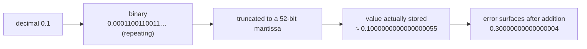

# Chapter 09 · Data Types

[简体中文](./09-data-types.md) ｜ **English**

---

> The last chapter said "variables have types." This chapter asks: what *is* a type?
>
> The answer is more concrete than you might expect — memory holds only 0s and 1s, and **a type is the rule for how those bits should be interpreted**. Once you grasp that, seemingly bizarre phenomena — `0.1 + 0.2 != 0.3`, an integer suddenly turning negative, the same emoji having length 1 or 4 — all become perfectly reasonable.

## 1. Learning Objectives

By the end of this chapter, you will be able to:

- State the essence of a type: **bit pattern + interpretation rule + width + permitted operations**;
- Explain the real reason `0.1 + 0.2 != 0.3`, and know that it holds in **every** language;
- Explain why integer overflow turns a positive number negative, and why Python never overflows;
- Explain why the same emoji has different lengths in different languages;
- Pick the right type for money, IDs, and cross-language transport, avoiding five classic traps.

---

## 2. Why This Concept Exists

Memory holds a string of bits, for example:

```text
01000001
```

What is it? The answer is — **it depends on what you treat it as**:

| Treated as | Result |
|------------|--------|
| Unsigned integer | `65` |
| ASCII character | `'A'` |
| A set of boolean flags | bits 0 and 6 are true |

**One bit pattern, three completely different meanings.** So bits carry no meaning on their own; something must specify "how to interpret them." That specification is the **type**.

A type answers four questions:

1. **How many bits** — `int` uses 32, `double` uses 64;
2. **How to interpret them** — two's-complement integer? IEEE 754 float? A character encoding?
3. **Which operations are allowed** — numbers can be subtracted, strings cannot;
4. **What range of values** — a 32-bit signed integer tops out around 2.1 billion.

Without types, you would have to remember yourself that "those 4 bytes at memory slot 100 are an integer" — and the moment you misremember, the program multiplies a piece of text as if it were a number. The type system turns this into a machine-checkable rule (Chapter 07).

---

## 3. How It Works

### Integers: two's complement and overflow

Integers are represented in **two's complement**. Taking an 8-bit signed integer:

```text
00000000 →    0
01111111 →  127   ← maximum
10000000 → -128   ← minimum (the top bit is the sign bit)
11111111 →   -1
```

The crucial point: **the width is fixed**. Add 1 to the maximum and the carry has nowhere to go, so it "wraps around" to the minimum — this is **overflow wraparound**. Measured (Java):

```text
2147483647 + 1 = -2147483648
```

A positive number plus one became negative — and **no error was raised**. This behavior is shared by C++, Java, and C# (strictly speaking, signed overflow in C++ is undefined behavior, though in practice it usually wraps).

Python is the sole exception: its `int` has **arbitrary precision** — as long as memory allows, it keeps going (`2 ** 200` stays exact). The cost is that every integer is a heap object (about 28 bytes and up), making arithmetic far slower.

### Floating point: IEEE 754 and that famous error

Nearly every language's floating-point numbers follow the **IEEE 754** standard. Double precision (`double`) splits its 64 bits into three parts:

```text
double precision (64 bits)
┌────┬───────────────┬──────────────────────────────────────┐
│sign│  exponent 11  │            mantissa 52                │
└────┴───────────────┴──────────────────────────────────────┘
 1 bit
```

Its value is roughly `± mantissa × 2^exponent` — note that it is a power of **2**. And there lies the problem:

**The decimal 0.1 is a repeating fraction in binary** (just as 1/3 cannot be written exactly in decimal). A 52-bit mantissa can only store a truncated version, so what actually goes into memory is a number very close to — but not equal to — 0.1. Add two such approximations and the error surfaces:

```text
0.1 + 0.2 = 0.30000000000000004
```

**Measured result: JavaScript, Python, Java, C++, and C# all print the same value, and all report `== 0.3` as false.**



> ⚠️ **This is not any language's bug — it is the inherent cost of representing decimal fractions with a finite number of binary digits.** So the fix is never to switch languages, but to switch types or switch how you compare (see sections 13 and 15).

### Strings: the encoding decides what "length" means

A string is a sequence of characters, but "how many units one character takes" depends on the **encoding**:

| Encoding | One unit | Notes |
|----------|---------|-------|
| ASCII | 1 byte | only 128 characters |
| UTF-8 | 1–4 bytes | variable; English 1 byte, Chinese 3, emoji 4 |
| UTF-16 | 2 or 4 bytes | common characters 2 bytes; emoji use two "code units" |

So asking "how long is this string" requires first asking "**what unit are you counting?**" For the same waving-hand emoji `👋`, measured:

| Language | Length | What is being counted |
|----------|:------:|----------------------|
| JavaScript | **2** | UTF-16 code units |
| Python | **1** | code points (one character is one character) |
| Java | **2** | UTF-16 code units (`codePointCount` gives 1) |
| C++ | **4** | UTF-8 bytes |
| C# | **2** | UTF-16 code units |

**One character, four answers, all of them "right"** — because the units they count are fundamentally different.

---

## 4. JavaScript

**Type system**: JavaScript has just 7 primitive types: `number`, `string`, `boolean`, `undefined`, `null`, `symbol`, `bigint`.

The most distinctive point: **there is no integer type** — every `number` is a 64-bit double-precision float.

```javascript
let score = 92;          // looks like an integer, but it's a double
let ratio = 0.92;
console.log(Number.isInteger(score));      // true (the value is integral; the type is still number)

// Hence a "safe integer" ceiling
console.log(Number.MAX_SAFE_INTEGER);      // 9007199254740991
console.log(Number.MAX_SAFE_INTEGER + 2);  // 9007199254740992 — same as +1; precision already lost

// Very large integers need BigInt
console.log(9007199254740993n + 2n);       // 9007199254740995n, exact
```

**There are two empty values**, a historical quirk of JavaScript:

```javascript
let a;                   // undefined: declared but never given a value
let b = null;            // null: explicitly "there is nothing here"
```

> **Note**: don't use `number` for money or large IDs (e.g. snowflake IDs) — beyond `MAX_SAFE_INTEGER` precision is lost silently. Use `BigInt`, or transport them as strings.

---

## 5. Python

**Type system**: `int`, `float`, `bool`, `str`, `bytes`, `None`, plus the built-in container types (covered in the next Part).

The most distinctive point: **`int` has arbitrary precision**.

```python
score = 92                 # int, arbitrary precision
big = 2 ** 200             # still exact, never overflows
print(len(str(big)))       # 61 digits

ratio = 0.92               # float is C's double — same IEEE 754 error
print(0.1 + 0.2)           # 0.30000000000000004
```

**For exact decimals, use `decimal`**:

```python
from decimal import Decimal
print(Decimal("0.1") + Decimal("0.2"))          # 0.3
print(Decimal("0.1") + Decimal("0.2") == Decimal("0.3"))   # True
```

**`bool` is a subclass of `int`**, an amusing detail:

```python
print(True + True)         # 2
print(isinstance(True, int))   # True
```

> **Note**: always construct `Decimal` from a **string**. `Decimal(0.1)` drags the float's error along with it, defeating the purpose.

---

## 6. Java

**Type system**: 8 primitive types plus reference types. Primitive widths are **fixed by the specification** and never vary by platform — the bedrock of Java's portability.

| Type | Width | Range |
|------|:-----:|-------|
| `byte` | 1 byte | -128 to 127 |
| `short` | 2 bytes | -32768 to 32767 |
| `int` | 4 bytes | -2147483648 to 2147483647 |
| `long` | 8 bytes | about ±9.2×10¹⁸ |
| `float` | 4 bytes | single precision |
| `double` | 8 bytes | double precision |
| `char` | 2 bytes | one UTF-16 code unit |
| `boolean` | unspecified | `true` / `false` |

```java
int score = 92;
long bigId = 9007199254740993L;      // note the L suffix
double ratio = 0.92;

// Overflow wraps silently
int max = Integer.MAX_VALUE;
System.out.println(max + 1);          // -2147483648
```

**Use `BigDecimal` for money**:

```java
import java.math.BigDecimal;
BigDecimal a = new BigDecimal("0.1");
BigDecimal b = new BigDecimal("0.2");
System.out.println(a.add(b));                          // 0.3
System.out.println(a.add(b).compareTo(new BigDecimal("0.3")) == 0);  // true
```

> **Note**: every primitive has a corresponding **wrapper class** (`int` ↔ `Integer`); wrappers are objects, can be `null`, and work in collections. Autoboxing is convenient, but boxing repeatedly inside a loop noticeably hurts performance.

---

## 7. C++

**Type system**: primitive widths are **implementation-defined**; the specification only guarantees minimum widths and relative ordering. This is C++'s biggest philosophical difference from Java — it hands performance and platform adaptation to the compiler.

```cpp
#include <iostream>
int main() {
    std::cout << sizeof(int);      // prints 4 here, but the spec only guarantees ≥ 2 bytes
    std::cout << sizeof(long);     // 8 here; usually 4 on Windows
}
```

**For fixed widths use `<cstdint>`**, the standard practice for portable code:

```cpp
#include <cstdint>
int32_t score = 92;          // explicitly 32-bit
int64_t bigId = 9007199254740993LL;
uint8_t flags = 255;         // explicitly 8-bit unsigned
```

```cpp
double ratio = 0.92;
std::cout << (0.1 + 0.2 == 0.3);   // 0 (false)
```

> **Note**: two traps to remember. ① **Integer division truncates**: `5 / 2` gives `2`; write `5.0 / 2`. ② **Signed integer overflow is undefined behavior**, and compilers may optimize based on that assumption — never rely on wraparound.

---

## 8. C#

**Type system**: similar to Java (fixed widths), plus one killer type: **`decimal`**.

```csharp
int score = 92;
long bigId = 9007199254740993L;
double ratio = 0.92;

Console.WriteLine(0.1 + 0.2 == 0.3);        // False — same as everyone else

// decimal: 128-bit decimal floating point, designed for finance
Console.WriteLine(0.1m + 0.2m);             // 0.3
Console.WriteLine(0.1m + 0.2m == 0.3m);     // True ✓
```

**Measured comparison** (one and the same C# program):

```text
0.1 + 0.2   = 0.30000000000000004   ==0.3  → False
0.1m + 0.2m = 0.3                   ==0.3m → True
```

C# is the only one of the six that builds exact decimals into the language as a **native type** (with the `m` literal suffix) — Java's `BigDecimal` and Python's `Decimal` are library types and far more verbose to write.

> **Note**: `decimal` is exact but slow (roughly an order of magnitude slower than `double`) with a smaller range. Use it for money, not for scientific computing.

---

## 9. SQL

SQL's type system differs **fundamentally** from the other five in two places, both worth memorizing.

### ① Numeric types include true exact decimals

Standard SQL's `DECIMAL(p, s)` / `NUMERIC(p, s)` are **fixed-point** and exact; `FLOAT` / `REAL` are the IEEE 754 floats.

```sql
CREATE TABLE product (
    name   TEXT,
    price  DECIMAL(10, 2),    -- exact to the cent: the right choice for money
    weight REAL               -- floating point, with error
);
```

> ⚠️ Note: **SQLite is an exception** — it has no true `DECIMAL`; `NUMERIC` is only a "type affinity" and still uses floating point underneath. For exact decimals, use `DECIMAL` in PostgreSQL / MySQL / SQL Server.

### ② NULL is not a value but "unknown"

This is SQL's most counter-intuitive design. When `NULL` takes part in a comparison, the result is neither true nor false but **unknown** — this is **three-valued logic**. Measured:

```sql
SELECT NULL = NULL;      -- yields NULL (not true!)
SELECT NULL IS NULL;     -- 1 (true) — you must use IS
```

So `WHERE score = NULL` **never matches any row**; you must write `WHERE score IS NULL`.

### ③ Type strictness also varies

Most databases check types strictly, but SQLite defaults to "type affinity" (weak):

```sql
CREATE TABLE t (n INTEGER);
INSERT INTO t VALUES ('123');       -- a string into an integer column
SELECT n, typeof(n) FROM t;         -- 123 | integer  ← silently converted
```

Adding `STRICT` makes it refuse:

```sql
CREATE TABLE s (n INTEGER) STRICT;
INSERT INTO s VALUES ('abc');
-- Runtime error: cannot store TEXT value in INTEGER column
```

---

## 10. Cross-Language Comparison

### ① Integers

| Feature | JavaScript | Python | Java | C++ | C# |
|---------|-----------|--------|------|-----|-----|
| Has a distinct integer type | ❌ (only `number`) | ✅ `int` | ✅ 4 widths | ✅ many widths | ✅ many widths |
| Width | none (double) | **arbitrary precision** | fixed by spec | **implementation-defined** | fixed by spec |
| Overflow behavior | loses precision past 2⁵³ | **never overflows** | wraps silently | undefined behavior | wraps silently (checkable) |
| Big-integer option | `BigInt` | native | `BigInteger` | `__int128` / third-party | `BigInteger` |

### ② Floating point and exact decimals

| Language | Float types | `0.1+0.2==0.3` | Exact-decimal option |
|----------|------------|:--------------:|---------------------|
| JavaScript | `number` (double) | ❌ | none native (use a library or integer cents) |
| Python | `float` (double) | ❌ | `decimal.Decimal` (library) |
| Java | `float` / `double` | ❌ | `BigDecimal` (library) |
| C++ | `float` / `double` / `long double` | ❌ | none standard (third-party) |
| C# | `float` / `double` | ❌ | **`decimal` (native to the language)** |

**Conclusion: `0.1+0.2 != 0.3` holds in all five languages**; they differ only in how good a remedy they offer.

### ③ Strings and empty values

| Feature | JavaScript | Python | Java | C++ | C# |
|---------|-----------|--------|------|-----|-----|
| Internal encoding | UTF-16 | code points (1/2/4 bytes as needed) | UTF-16 | byte sequence (encoding is up to you) | UTF-16 |
| Mutable | ❌ immutable | ❌ immutable | ❌ immutable | ✅ **mutable** | ❌ immutable |
| Empty value | `undefined` + `null` | `None` | `null` | `nullptr` | `null` (controllable via nullable reference types) |

### ④ Commonalities and how to choose

**In common**: all distinguish integers from floats, all follow IEEE 754, all provide booleans and strings.

**The root of the differences** is design orientation:
- **C++** leaves widths to the platform, chasing maximum performance and closeness to hardware;
- **Java / C#** fix the widths, chasing "write once, run anywhere";
- **Python** trades speed for arbitrary-precision integers that "never overflow";
- **JavaScript** goes minimal (one `number`), at the cost of distorting large integers.

---

## 11. Underlying Implementation Comparison

| Language · Engine | How integers are stored | How floats are stored | How strings are stored |
|-------------------|------------------------|----------------------|-----------------------|
| **JavaScript · V8** | small integers as **Smi** (31-bit tagged pointer, on the stack); larger ones boxed as `HeapNumber` | IEEE 754 double | UTF-16; short strings have several internal forms (`SeqString`/`ConsString`) |
| **Python · CPython** | `PyLongObject`: sign + a variable-length array of 30-bit "digits", hence arbitrary precision | `PyFloatObject` wrapping a C `double` | `PyUnicodeObject`: 1/2/4 bytes chosen by content (PEP 393) |
| **Java · JVM** | native 32/64-bit on the stack; `Integer` boxed on the heap (-128 to 127 cached) | native IEEE 754 on the stack | `byte[]` + an encoding flag (compact strings since JDK 9: pure ASCII uses 1 byte per character) |
| **C++ · Native** | literally the CPU's native integers, unwrapped | literally the CPU's native floats, via FPU/SIMD | `std::string` = pointer + length + capacity; short-string optimization (SSO) can store inline |
| **C# · CLR** | value types, on the stack or inlined into an object | native value types | UTF-16 `char[]`; `decimal` is a 128-bit struct |

This table explains several things:

- **Why Python integer arithmetic is slow**: every integer is a heap object, so addition goes through allocation, type checks, and reference counting;
- **Why V8's small integers are fast**: an Smi encodes the value inside the pointer itself, never touching the heap;
- **Why Java strings got cheaper in JDK 9**: pure-ASCII content uses 1 byte per character instead of a fixed 2.

---

## 12. Performance Analysis

**Cost of operations** (order-of-magnitude feel on one machine, not a precise benchmark):

| Operation | C++ / Java / C# | JavaScript | Python |
|-----------|----------------|-----------|--------|
| Integer addition | 1 CPU instruction | near-native on the Smi fast path | allocation + type dispatch; tens of times slower |
| Float addition | 1 FPU instruction | near-native | tens of times slower |
| Exact decimal addition | `decimal`/`BigDecimal` 10–100× slower | needs a library | `Decimal` 10–100× slower |
| String concatenation | `std::string` can append in place | immutable, needs a new one (engines optimize) | immutable; use `join` in loops |

**Memory cost**:

| Data | C++ / Java / C# | Python |
|------|----------------|--------|
| One integer | **4 bytes** | **about 28 bytes** |
| One float | 8 bytes | about 24 bytes |
| A million integers | 4 MB (native array) | tens of MB (a list of objects) |

**Practical conclusion**: for data-heavy work, Python needs NumPy (backed by compact C arrays); the gap can exceed an order of magnitude.

---

## 13. Engineering Practice

| Scenario | ✅ Recommended | ❌ Discouraged | Why |
|----------|---------------|---------------|-----|
| **Money, accounting** | `decimal` (C#) / `BigDecimal` (Java) / `Decimal` (Python) / SQL `DECIMAL` | `double` / `float` | float error accumulates into books that don't balance |
| Also fine | store the **smallest unit as an integer** (cents) | floats | simple, reliable, unambiguous across languages |
| **Large IDs** (snowflake, etc.) | `long` on the backend, **as a string to the frontend** | a JSON number | past 2⁵³ JavaScript silently loses precision |
| **Comparing floats** | compare whether the difference is below a tolerance | `a == b` | see Best Practices below |
| **Portable C++** | `int32_t` / `int64_t` from `<cstdint>` | bare `int` / `long` | `long` is 4 bytes on Windows, 8 on Linux |
| **Counters, indices** | a fixed width when the upper bound is known | reflexively using the largest type | balances memory and cache efficiency |
| **String length checks** | be explicit about "characters (code points)" vs "bytes" | just using `.length` | emoji and CJK make the two disagree |

**One iron rule**: **never use floating point for money.** This rule has prevented countless production incidents.

---

## 14. Best Practices

- **Compare floats with a tolerance**, never `==`:

  ```python
  abs(a - b) < 1e-9          # the general form
  math.isclose(a, b)         # Python's stdlib is more rigorous
  ```

- **Pick the smallest sufficient type**: if `int32` suffices, don't use `int64` — memory and cache both benefit.
- **Let the type express intent**: money as `decimal`, identifiers as strings or a dedicated ID type, rather than `int` for everything.
- **Prefer explicit conversion**: write `double(a) / b` instead of hoping the language guesses right.
- **Watch integer division**: in C++ / Java / C#, `5 / 2 == 2`; in Python `/` gives 2.5 and `//` gives 2.
- **Agree on types at cross-language boundaries**: JSON distinguishes neither integer from float nor 64-bit integers, so the API contract must say so explicitly.

---

## 15. Common Pitfalls

**Pitfall 1 · Comparing floats with `==`**

```javascript
console.log(0.1 + 0.2 === 0.3);    // false
```
**Why it's wrong**: IEEE 754 stores approximations.
**How to avoid**: compare the difference, `Math.abs(a-b) < 1e-9`; for money switch to exact decimals or integer cents.

**Pitfall 2 · Integer overflow happens silently**

```java
int total = Integer.MAX_VALUE;
System.out.println(total + 1);     // -2147483648, no error
```
**Why it's wrong**: fixed width + two's complement, so a lost carry wraps around.
**How to avoid**: estimate the bound and choose `long`; in Java, `Math.addExact()` throws on overflow.

**Pitfall 3 · JavaScript loses precision on large IDs**

```javascript
console.log(9007199254740993);     // 9007199254740992 — the last digit changed!
```
**Why it's wrong**: `number` is a double, so the safe integer range is only 2⁵³.
**How to avoid**: transport large IDs as **strings**, or use `BigInt`.

**Pitfall 4 · Assuming string length equals character count**

```javascript
"👋".length        // 2, not 1
```
**Why it's wrong**: `length` counts UTF-16 code units, and this emoji takes two.
**How to avoid**: count characters with `[..."👋"].length` (JS) or `codePointCount` (Java).

**Pitfall 5 · Integer division truncates**

```cpp
double ratio = 92 / 100;      // 0.0! not 0.92
double right = 92.0 / 100;    // 0.92 ✓
```
**Why it's wrong**: two integers divide by integer rules first (giving 0), and only then convert to double.
**How to avoid**: make at least one operand a float.

**Pitfall 6 · `Decimal(0.1)` accomplishes nothing**

```python
from decimal import Decimal
Decimal(0.1)          # Decimal('0.1000000000000000055511151231257827…')
Decimal("0.1")        # Decimal('0.1') ✓
```
**Why it's wrong**: the literal `0.1` already carries error; converting it to `Decimal` cannot recover it.
**How to avoid**: **always construct exact decimals from strings.**

**Pitfall 7 · Using `= NULL` to find empty values in SQL**

```sql
SELECT * FROM student WHERE score = NULL;    -- always returns 0 rows
SELECT * FROM student WHERE score IS NULL;   -- correct ✓
```
**Why it's wrong**: `NULL` means "unknown," so any comparison with it yields unknown, not true.
**How to avoid**: always test for empties with `IS NULL` / `IS NOT NULL`.

---

## 16. Interview Questions

**Basic**

1. Why is `0.1 + 0.2 != 0.3`? Is this a bug in the language?
2. What is the difference between Java's `int` and `long`? How many bytes and what range for each?
3. What do `null`, `undefined`, and `NaN` each mean in JavaScript?

**Intermediate**

4. Why does integer overflow turn a positive number negative? Explain using two's complement.
5. Why do Python's integers never overflow? What is the cost?
6. `"👋".length` is 2 in JavaScript but `len()` gives 1 in Python — why?
7. Why must money not be stored in a `double`? Give at least two correct approaches.

**Advanced**

8. Draw the bit layout of IEEE 754 double precision and explain why 0.1 cannot be represented exactly.
9. What is V8's Smi? How does it let small-integer arithmetic avoid heap allocation?
10. Why does C++ not require `int` to be 4 bytes? What does this "flaw" buy? How should portable code be written?

---

## 17. Exercises

**Basic**

1. In all six languages, print `0.1 + 0.2` and whether it equals `0.3`, and confirm the results agree.
2. In Java or C#, print the maximum `int`, add 1, and observe the overflow; retry with `long`.
3. Print `sizeof` / type ranges in each language and build a "type width cheat sheet" under `cheatsheets/`.

**Intermediate**

4. Write a "safe add" function that throws on overflow instead of wrapping (compare with Java's `Math.addExact`).
5. Implement a "sum two-decimal amounts" function with `Decimal` / `BigDecimal` / `decimal`, and compare the error against a `double` version after ten thousand additions.
6. Count both the "byte length" and the "character count" of a string containing CJK text and emoji, once in each language, and explain the differences.

**Challenge**

7. Without using any built-in big-integer type, implement arbitrary-precision addition yourself with an array, and check your results against Python's native `int`.
8. Write a program that finds which decimal fractions in `[0, 1]` **can be represented exactly** by a double (hint: denominators that are powers of 2), and explain the pattern.

---

## 18. Summary

**In one sentence**: a type is the rule for how a string of bits should be interpreted — it fixes the width, the interpretation, the permitted operations, and the range; the six languages diverge over **whether widths are fixed** (Java/C# fixed, C++ platform-defined, Python arbitrary precision, JS just one `number`) and **whether exact decimals are provided**.

**Core takeaways**

- The same bits can be an integer, a character, or a set of flags — **the type decides which**.
- Fixed-width integers + two's complement → **overflow wraps silently**; Python sidesteps this with arbitrary precision.
- `0.1 + 0.2 != 0.3` comes from IEEE 754 and **is the same in every language** — not a bug.
- A string's "length" depends on the unit you count — the same emoji can be 1, 2, or 4.
- **Never use floats for money**: use `decimal` / `BigDecimal`, or store the smallest unit as an integer.

**Checklist**

- [ ] I can explain a type's four jobs (width, interpretation, operations, range).
- [ ] I can explain integer overflow with two's complement and say which languages wrap.
- [ ] I can explain where the `0.1 + 0.2` error comes from and write a correct float comparison.
- [ ] I can explain why the same emoji has different lengths in different languages.
- [ ] I know which type to store money in, and how to send large IDs to a frontend.

**Next chapter**: with types in hand come the operations on those values. Why can `+` both add numbers and join strings? What exactly separates `==` from `===`? And which CPU instruction sits behind an operator? That is Chapter 10, "Operators."

---

## 19. Further Reading

- <a href="https://en.wikipedia.org/wiki/IEEE_754" target="_blank" rel="noopener">Wikipedia: IEEE 754</a> — the floating-point standard's bit layout and rounding rules.
- <a href="https://docs.python.org/3/library/stdtypes.html#numeric-types-int-float-complex" target="_blank" rel="noopener">Python docs · Numeric types</a> — the official account of arbitrary-precision `int` and `float`.
- <a href="https://docs.oracle.com/javase/tutorial/java/nutsandbolts/datatypes.html" target="_blank" rel="noopener">Oracle Java Tutorial · Primitive Data Types</a> — the fixed widths and ranges of the 8 primitives.
- <a href="https://en.cppreference.com/w/cpp/language/types" target="_blank" rel="noopener">cppreference · Fundamental types</a> — the normative text on implementation-defined widths in C++.
- <a href="https://learn.microsoft.com/en-us/dotnet/csharp/language-reference/builtin-types/floating-point-numeric-types" target="_blank" rel="noopener">Microsoft Learn · C# floating-point types</a> — the trade-offs among `float` / `double` / `decimal`.
- <a href="https://www.unicode.org/faq/utf_bom.html" target="_blank" rel="noopener">Unicode official FAQ · UTF and BOM</a> — the authoritative account of UTF-8 vs UTF-16.
