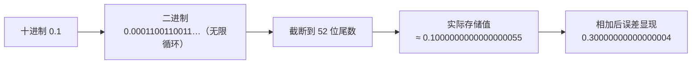

# 第 09 章 · 数据类型

**简体中文** ｜ [English](./09-data-types.en-US.md)

---

> 上一章我们说"变量有类型"。这一章追问：类型到底是什么？
>
> 答案会比你想的更实在——内存里只有 0 和 1，**类型就是"这些位该怎么解释"的规则**。理解了这一点，`0.1 + 0.2 != 0.3`、整数突然变成负数、同一个 emoji 长度是 1 还是 4，这些看似诡异的现象全都变得顺理成章。

## 1. 学习目标

本章结束后，你将能够：

- 说清类型的本质：**位模式 + 解释规则 + 宽度 + 允许的操作**；
- 解释 `0.1 + 0.2 != 0.3` 的真正原因，并知道它在**所有**语言中都成立；
- 说出整数溢出为什么会让正数变负数，以及为什么 Python 不会溢出；
- 解释同一个 emoji 在不同语言里长度不同的原因；
- 在金融、ID、跨语言传输等场景中选对类型，避开五个经典陷阱。

---

## 2. 为什么会出现这个概念

内存里存着一串位，比如：

```text
01000001
```

这串位是什么？答案是——**取决于你把它当成什么**：

| 当成 | 结果 |
|------|------|
| 无符号整数 | `65` |
| ASCII 字符 | `'A'` |
| 布尔标志组合 | 第 0 位和第 6 位为真 |

**同一串位，三种完全不同的含义。** 所以位本身没有意义，必须有人规定"怎么解释它"。这个规定，就是**类型**。

类型一共回答四个问题：

1. **占多少位**——`int` 用 32 位，`double` 用 64 位；
2. **怎么解释这些位**——补码整数？IEEE 754 浮点？字符编码？
3. **允许哪些操作**——数字能相减，字符串不能；
4. **取值范围**——32 位有符号整数最大只能到 21 亿。

如果没有类型，你就得自己记住"内存第 100 号格子里那 4 个字节是个整数"——一旦记错，程序会把一段文字当数字去做乘法。类型系统把这件事变成了机器可以检查的规则（第 07 章）。

---

## 3. 底层原理

### 整数：补码与溢出

整数用**二进制补码**表示。以 8 位有符号整数为例：

```text
00000000 →    0
01111111 →  127   ← 最大值
10000000 → -128   ← 最小值（最高位是符号位）
11111111 →   -1
```

关键点：**位数是固定的**。当你给最大值再加 1，进位无处可去，就"转了一圈"回到最小值——这叫**溢出回绕**。实测（Java）：

```text
2147483647 + 1 = -2147483648
```

正数加 1 变成了负数，而且**不报错**。这是 C++、Java、C# 共有的行为（C++ 的有符号溢出严格来说是未定义行为，实践中多表现为回绕）。

Python 是唯一的例外：它的 `int` 是**任意精度**——只要内存够，就能一直算下去（`2 ** 200` 照样精确）。代价是每个整数都是一个堆对象（约 28 字节起），运算慢得多。

### 浮点：IEEE 754 与那个著名的误差

几乎所有语言的浮点数都遵循 **IEEE 754** 标准。双精度（`double`）的 64 位被切成三段：

```text
双精度 double（64 位）
┌───┬──────────────┬──────────────────────────────────────┐
│符号│   指数 11 位  │            尾数 52 位                 │
└───┴──────────────┴──────────────────────────────────────┘
  1 位
```

它的值大致是 `± 尾数 × 2^指数`——注意是 **2 的幂**。这就是问题所在：

**十进制的 0.1，在二进制里是无限循环小数**（就像十进制写不出精确的 1/3）。52 位尾数只能截断保存，于是 `0.1` 存进去的其实是一个非常接近但不等于 0.1 的数。两个这样的近似值相加，误差就浮上了水面：

```text
0.1 + 0.2 = 0.30000000000000004
```

**实测结论：JavaScript、Python、Java、C++、C# 全部输出同一个值，全部 `== 0.3` 为假。**



> ⚠️ **这不是某门语言的 bug，而是"用有限的二进制位表示十进制小数"这件事本身的代价。** 所以正确的做法从来不是换语言，而是换类型或换比较方式（见第 13、15 节）。

### 字符串：编码决定了"长度"是什么

字符串是字符的序列，但"一个字符占几个单位"取决于**编码**：

| 编码 | 一个单位 | 说明 |
|------|---------|------|
| ASCII | 1 字节 | 只能表示 128 个字符 |
| UTF-8 | 1–4 字节 | 变长；英文 1 字节，中文 3 字节，emoji 4 字节 |
| UTF-16 | 2 或 4 字节 | 常用字符 2 字节，emoji 用两个"码元"表示 |

所以问"字符串多长"，必须先问"**你数的是什么单位**"。同一个挥手 emoji `👋`，实测结果：

| 语言 | 长度 | 数的是什么 |
|------|:----:|-----------|
| JavaScript | **2** | UTF-16 码元 |
| Python | **1** | 码点（一个字符就是一个字符） |
| Java | **2** | UTF-16 码元（`codePointCount` 才是 1） |
| C++ | **4** | UTF-8 字节 |
| C# | **2** | UTF-16 码元 |

**同一个字符，四种答案，全都"对"**——因为它们数的单位根本不同。

---

## 4. JavaScript

**类型体系**：JavaScript 的原始类型只有 7 种：`number`、`string`、`boolean`、`undefined`、`null`、`symbol`、`bigint`。

最特别的一点：**它没有整数类型**——所有 `number` 都是 64 位双精度浮点。

```javascript
let score = 92;          // 看起来是整数，其实是 double
let ratio = 0.92;
console.log(Number.isInteger(score));      // true（值是整数，但类型仍是 number）

// 因此存在"安全整数"上限
console.log(Number.MAX_SAFE_INTEGER);      // 9007199254740991
console.log(Number.MAX_SAFE_INTEGER + 2);  // 9007199254740992 —— 与 +1 结果相同，精度已丢失

// 超大整数要用 BigInt
console.log(9007199254740993n + 2n);       // 9007199254740995n，精确
```

**空值有两个**，这是 JavaScript 的历史包袱：

```javascript
let a;                   // undefined：声明了但没给值
let b = null;            // null：明确表示"这里是空的"
```

> **注意事项**：涉及金额、大 ID（如雪花 ID）时不要用 `number`——超过 `MAX_SAFE_INTEGER` 会静默丢精度。用 `BigInt` 或字符串传输。

---

## 5. Python

**类型体系**：`int`、`float`、`bool`、`str`、`bytes`、`None`，以及内置的容器类型（下一 Part 详述）。

最特别的一点：**`int` 是任意精度的**。

```python
score = 92                 # int，任意精度
big = 2 ** 200             # 照样精确，不会溢出
print(len(str(big)))       # 61 位数字

ratio = 0.92               # float 就是 C 的 double，同样有 IEEE 754 误差
print(0.1 + 0.2)           # 0.30000000000000004
```

**需要精确小数时用 `decimal`**：

```python
from decimal import Decimal
print(Decimal("0.1") + Decimal("0.2"))          # 0.3
print(Decimal("0.1") + Decimal("0.2") == Decimal("0.3"))   # True
```

**`bool` 是 `int` 的子类**，这是个有趣的细节：

```python
print(True + True)         # 2
print(isinstance(True, int))   # True
```

> **注意事项**：`Decimal` 必须从**字符串**构造。`Decimal(0.1)` 会把浮点的误差一起带进来，等于白做。

---

## 6. Java

**类型体系**：8 种基本类型 + 引用类型。基本类型的宽度由**规范固定**，不随平台变化——这是 Java 可移植性的基石。

| 类型 | 宽度 | 范围 |
|------|:----:|------|
| `byte` | 1 字节 | -128 ~ 127 |
| `short` | 2 字节 | -32768 ~ 32767 |
| `int` | 4 字节 | -2147483648 ~ 2147483647 |
| `long` | 8 字节 | 约 ±9.2×10¹⁸ |
| `float` | 4 字节 | 单精度 |
| `double` | 8 字节 | 双精度 |
| `char` | 2 字节 | 一个 UTF-16 码元 |
| `boolean` | 未规定 | `true` / `false` |

```java
int score = 92;
long bigId = 9007199254740993L;      // 注意 L 后缀
double ratio = 0.92;

// 溢出静默回绕
int max = Integer.MAX_VALUE;
System.out.println(max + 1);          // -2147483648
```

**金额用 `BigDecimal`**：

```java
import java.math.BigDecimal;
BigDecimal a = new BigDecimal("0.1");
BigDecimal b = new BigDecimal("0.2");
System.out.println(a.add(b));                          // 0.3
System.out.println(a.add(b).compareTo(new BigDecimal("0.3")) == 0);  // true
```

> **注意事项**：每个基本类型都有对应的**包装类**（`int` ↔ `Integer`），包装类是对象、可以为 `null`、参与集合。自动装箱很方便，但在循环里频繁装箱会明显拖慢性能。

---

## 7. C++

**类型体系**：基本类型的宽度**由实现决定**，规范只保证最小宽度和大小关系。这是 C++ 与 Java 最大的哲学差异——它把性能和平台适配权交给了编译器。

```cpp
#include <iostream>
int main() {
    std::cout << sizeof(int);      // 本机输出 4，但规范只保证 ≥ 2 字节
    std::cout << sizeof(long);     // 本机 8，Windows 上通常是 4
}
```

**要固定宽度就用 `<cstdint>`**，这是跨平台代码的标准做法：

```cpp
#include <cstdint>
int32_t score = 92;          // 明确 32 位
int64_t bigId = 9007199254740993LL;
uint8_t flags = 255;         // 明确 8 位无符号
```

```cpp
double ratio = 0.92;
std::cout << (0.1 + 0.2 == 0.3);   // 0（假）
```

> **注意事项**：两个坑要记牢。① **整数除法会截断**：`5 / 2` 得 `2`，要写 `5.0 / 2`。② **有符号整数溢出是未定义行为**，编译器可能据此做出意想不到的优化——不要依赖回绕。

---

## 8. C#

**类型体系**：与 Java 类似（宽度固定），但多了一个杀手级类型：**`decimal`**。

```csharp
int score = 92;
long bigId = 9007199254740993L;
double ratio = 0.92;

Console.WriteLine(0.1 + 0.2 == 0.3);        // False —— 和其他语言一样

// decimal：128 位十进制浮点，专为金融设计
Console.WriteLine(0.1m + 0.2m);             // 0.3
Console.WriteLine(0.1m + 0.2m == 0.3m);     // True ✓
```

**实测对比**（同一份 C# 程序）：

```text
0.1 + 0.2   = 0.30000000000000004   ==0.3  → False
0.1m + 0.2m = 0.3                   ==0.3m → True
```

C# 是六门语言里唯一把精确十进制**内置为语言原生类型**（带 `m` 字面量后缀）的——Java 的 `BigDecimal` 和 Python 的 `Decimal` 都是库类型，写起来啰嗦得多。

> **注意事项**：`decimal` 精确但慢（约比 `double` 慢一个数量级），且范围更小。用于钱，不用于科学计算。

---

## 9. SQL

SQL 的类型系统有两个地方与前五种语言**根本不同**，都值得单独记住。

### ① 数值类型有真正的精确小数

标准 SQL 的 `DECIMAL(p, s)` / `NUMERIC(p, s)` 是**定点数**，精确无误差；`FLOAT` / `REAL` 才是 IEEE 754 浮点。

```sql
CREATE TABLE product (
    name   TEXT,
    price  DECIMAL(10, 2),    -- 精确到分，金额的正确选择
    weight REAL               -- 浮点，有误差
);
```

> ⚠️ 注意：**SQLite 是个例外**——它没有真正的 `DECIMAL`，`NUMERIC` 只是"类型亲和性"，底层仍用浮点。要精确的十进制，请用 PostgreSQL / MySQL / SQL Server 的 `DECIMAL`。

### ② NULL 不是值，而是"未知"

这是 SQL 最反直觉的设计。`NULL` 参与比较时，结果既不是真也不是假，而是**未知**——这叫**三值逻辑**。实测：

```sql
SELECT NULL = NULL;      -- 结果为 NULL（不是真！）
SELECT NULL IS NULL;     -- 1（真）—— 必须用 IS 判断
```

所以 `WHERE score = NULL` **永远查不到任何行**，必须写 `WHERE score IS NULL`。

### ③ 类型严格程度也不同

大多数数据库严格检查类型，但 SQLite 默认采用"类型亲和性"（弱）：

```sql
CREATE TABLE t (n INTEGER);
INSERT INTO t VALUES ('123');       -- 字符串存进整数列
SELECT n, typeof(n) FROM t;         -- 123 | integer  ← 被悄悄转换了
```

加上 `STRICT` 才会拒绝：

```sql
CREATE TABLE s (n INTEGER) STRICT;
INSERT INTO s VALUES ('abc');
-- Runtime error: cannot store TEXT value in INTEGER column
```

---

## 10. 五语言横向对比

### ① 整数

| 特性 | JavaScript | Python | Java | C++ | C# |
|------|-----------|--------|------|-----|-----|
| 有独立整数类型 | ❌（只有 `number`） | ✅ `int` | ✅ 4 种宽度 | ✅ 多种宽度 | ✅ 多种宽度 |
| 宽度 | 无（双精度浮点） | **任意精度** | 规范固定 | **由实现决定** | 规范固定 |
| 溢出行为 | 超 2⁵³ 丢精度 | **不溢出** | 静默回绕 | 未定义行为 | 静默回绕（可查） |
| 大整数方案 | `BigInt` | 原生支持 | `BigInteger` | `__int128` / 第三方库 | `BigInteger` |

### ② 浮点与精确小数

| 语言 | 浮点类型 | `0.1+0.2==0.3` | 精确十进制方案 |
|------|---------|:--------------:|---------------|
| JavaScript | `number`（double） | ❌ | 无原生方案（用库或整数分） |
| Python | `float`（double） | ❌ | `decimal.Decimal`（库） |
| Java | `float` / `double` | ❌ | `BigDecimal`（库） |
| C++ | `float` / `double` / `long double` | ❌ | 无标准方案（第三方库） |
| C# | `float` / `double` | ❌ | **`decimal`（语言原生）** |

**结论：`0.1+0.2 != 0.3` 五语言全部成立**，差别只在"有没有好用的补救方案"。

### ③ 字符串与空值

| 特性 | JavaScript | Python | Java | C++ | C# |
|------|-----------|--------|------|-----|-----|
| 内部编码 | UTF-16 | 码点（内部按需 1/2/4 字节） | UTF-16 | 字节序列（编码由你定） | UTF-16 |
| 可变 | ❌ 不可变 | ❌ 不可变 | ❌ 不可变 | ✅ **可变** | ❌ 不可变 |
| 空值 | `undefined` + `null` | `None` | `null` | `nullptr` | `null`（可空引用类型可控） |

### ④ 共同点与选择建议

**共同点**：都区分整数与浮点，都遵循 IEEE 754，都提供布尔和字符串。

**差异的根源**是设计取向：
- **C++** 把宽度交给平台，追求极致性能与硬件贴合；
- **Java / C#** 固定宽度，追求"一次编写到处运行"；
- **Python** 用任意精度整数换取"永不溢出"的心智负担减免；
- **JavaScript** 极简（只有一个 number），代价是大整数失真。

---

## 11. 底层实现对比

| 语言 · 引擎 | 整数怎么存 | 浮点怎么存 | 字符串怎么存 |
|------------|-----------|-----------|-------------|
| **JavaScript · V8** | 小整数用 **Smi**（31 位标记指针，栈上）；大数装箱成 `HeapNumber` | IEEE 754 double | UTF-16；短字符串有多种内部表示（`SeqString`/`ConsString`） |
| **Python · CPython** | `PyLongObject`：符号 + 变长 30 位"数字"数组，故任意精度 | `PyFloatObject` 包一个 C `double` | `PyUnicodeObject`：按内容选 1/2/4 字节存储（PEP 393） |
| **Java · JVM** | 栈上原生 32/64 位；`Integer` 装箱到堆（-128~127 有缓存） | 栈上原生 IEEE 754 | `byte[]` + 编码标记（JDK 9 后紧凑字符串，纯 ASCII 只占 1 字节/字符） |
| **C++ · Native** | 直接就是 CPU 原生整数，无包装 | 直接就是 CPU 原生浮点，走 FPU/SIMD | `std::string` = 指针 + 长度 + 容量；短字符串优化（SSO）可内联存储 |
| **C# · CLR** | 值类型，栈上或内联在对象中 | 值类型原生 | UTF-16 `char[]`；`decimal` 是 128 位结构体 |

这张表解释了几件事：

- **为什么 Python 整数运算慢**：每个整数都是堆对象，加法要经过对象分配、类型检查、引用计数；
- **为什么 V8 的小整数快**：Smi 直接把值编码在指针里，根本不碰堆；
- **为什么 Java 字符串在 JDK 9 后省内存**：纯 ASCII 内容只用 1 字节/字符，而不是固定 2 字节。

---

## 12. 性能分析

**运算成本**（同一台机器的量级感受，非精确基准）：

| 操作 | C++ / Java / C# | JavaScript | Python |
|------|----------------|-----------|--------|
| 整数加法 | 1 条 CPU 指令 | Smi 快路径接近原生 | 对象分配 + 类型分派，慢数十倍 |
| 浮点加法 | 1 条 FPU 指令 | 接近原生 | 慢数十倍 |
| 精确十进制加法 | `decimal`/`BigDecimal` 慢 10–100 倍 | 需库支持 | `Decimal` 慢 10–100 倍 |
| 字符串拼接 | `std::string` 可原地追加 | 不可变，需新建（引擎有优化） | 不可变，循环拼接应用 `join` |

**内存成本**：

| 数据 | C++ / Java / C# | Python |
|------|----------------|--------|
| 一个整数 | **4 字节** | **约 28 字节** |
| 一个浮点 | 8 字节 | 约 24 字节 |
| 一百万个整数 | 4 MB（原生数组） | 数十 MB（list of objects） |

**实践结论**：数据密集场景下 Python 要用 NumPy（底层是紧凑的 C 数组），差距可达一个数量级以上。

---

## 13. 工程实践

| 场景 | ✅ 推荐 | ❌ 不推荐 | 原因 |
|------|--------|----------|------|
| **金额、账务** | `decimal`(C#) / `BigDecimal`(Java) / `Decimal`(Python) / 数据库 `DECIMAL` | `double` / `float` | 浮点误差会累积成对不上账的分 |
| 也可以 | 用**整数存最小单位**（分、厘） | 浮点 | 简单可靠，跨语言传输无歧义 |
| **大 ID**（雪花 ID 等） | 后端 `long`，**传给前端用字符串** | JSON 里传 number | 超过 2⁵³ 时 JavaScript 会静默丢精度 |
| **浮点比较** | 比较差值是否小于容差 | `a == b` | 见下方最佳实践 |
| **跨平台 C++** | `<cstdint>` 的 `int32_t` / `int64_t` | 裸 `int` / `long` | `long` 在 Windows 是 4 字节、Linux 是 8 字节 |
| **计数、下标** | 有明确上界时用固定宽度整数 | 无脑用最大类型 | 兼顾内存与缓存效率 |
| **字符串长度校验** | 明确按"字符（码点）"还是"字节"计数 | 直接用 `.length` | emoji、中文会让两者对不上 |

**一条铁律**：**钱不要用浮点**。这条规则救过无数生产事故。

---

## 14. 最佳实践

- **浮点比较用容差**，不要用 `==`：

  ```python
  abs(a - b) < 1e-9          # 通用写法
  math.isclose(a, b)         # Python 标准库更严谨
  ```

- **选够用的最小类型**：能用 `int32` 就不要用 `int64`——内存和缓存都受益。
- **让类型表达意图**：金额用 `decimal`，标识符用字符串或专门的 ID 类型，而不是一律 `int`。
- **显式转换优于隐式**：写清 `double(a) / b`，不要指望语言帮你猜。
- **注意整数除法**：C++ / Java / C# 中 `5 / 2 == 2`；Python 用 `/` 得 2.5、`//` 得 2。
- **跨语言接口约定好类型**：JSON 没有整数/浮点之分，也没有 64 位整数概念，接口文档必须写明。

---

## 15. 常见坑

**坑 1 · 用 `==` 比较浮点数**

```javascript
console.log(0.1 + 0.2 === 0.3);    // false
```
**为什么错**：IEEE 754 存的是近似值。
**如何避免**：比较差值 `Math.abs(a-b) < 1e-9`；金额场景改用精确十进制或整数分。

**坑 2 · 整数溢出无声无息**

```java
int total = Integer.MAX_VALUE;
System.out.println(total + 1);     // -2147483648，不报错
```
**为什么错**：固定宽度 + 补码，进位丢失后回绕。
**如何避免**：估算上界后选 `long`；Java 可用 `Math.addExact()` 在溢出时抛异常。

**坑 3 · JavaScript 处理大 ID 丢精度**

```javascript
console.log(9007199254740993);     // 9007199254740992 —— 末位被改了！
```
**为什么错**：`number` 是双精度浮点，整数安全范围只有 2⁵³。
**如何避免**：大 ID 用**字符串**传输，或用 `BigInt`。

**坑 4 · 以为字符串长度等于字符数**

```javascript
"👋".length        // 2，不是 1
```
**为什么错**：`length` 数的是 UTF-16 码元，emoji 占两个。
**如何避免**：需要按字符计数时用 `[..."👋"].length`（JS）或 `codePointCount`（Java）。

**坑 5 · 整数除法被截断**

```cpp
double ratio = 92 / 100;      // 0.0！不是 0.92
double right = 92.0 / 100;    // 0.92 ✓
```
**为什么错**：两个整数相除，先按整数规则算完（得 0）才转成 double。
**如何避免**：让至少一个操作数是浮点。

**坑 6 · `Decimal(0.1)` 白做**

```python
from decimal import Decimal
Decimal(0.1)          # Decimal('0.1000000000000000055511151231257827…')
Decimal("0.1")        # Decimal('0.1') ✓
```
**为什么错**：`0.1` 这个浮点字面量已经带着误差了，再转 `Decimal` 也救不回来。
**如何避免**：**永远从字符串构造**精确十进制。

**坑 7 · SQL 里用 `= NULL` 查空值**

```sql
SELECT * FROM student WHERE score = NULL;    -- 永远返回 0 行
SELECT * FROM student WHERE score IS NULL;   -- 正确 ✓
```
**为什么错**：`NULL` 表示"未知"，任何与它的比较都得到未知，而非真。
**如何避免**：判断空值一律用 `IS NULL` / `IS NOT NULL`。

---

## 16. 面试题

**基础**

1. 为什么 `0.1 + 0.2 != 0.3`？这是语言的 bug 吗？
2. Java 的 `int` 和 `long` 有什么区别？各占几个字节、范围多大？
3. `null`、`undefined`、`NaN` 在 JavaScript 里分别代表什么？

**中级**

4. 整数溢出为什么会让正数变成负数？请用补码解释。
5. 为什么 Python 的整数不会溢出？代价是什么？
6. `"👋".length` 在 JavaScript 里是 2，在 Python 里 `len()` 是 1，为什么？
7. 金额为什么不能用 `double` 存？给出至少两种正确方案。

**高级**

8. 请画出 IEEE 754 双精度的位布局，并解释为什么 0.1 无法精确表示。
9. V8 的 Smi 是什么？它如何让小整数运算避免堆分配？
10. 为什么 C++ 不规定 `int` 必须是 4 字节？这个"缺陷"换来了什么？跨平台代码应该怎么写？

---

## 17. 练习

**基础**

1. 在六门语言里各输出一次 `0.1 + 0.2` 和它是否等于 `0.3`，确认结果一致。
2. 在 Java 或 C# 中打印 `int` 的最大值，再加 1，观察溢出；改用 `long` 重试。
3. 用各语言打印 `sizeof` / 类型范围，做一张"类型宽度速查表"存进 `cheatsheets/`。

**提高**

4. 写一个"安全加法"函数：溢出时抛异常而不是回绕（Java 可对比 `Math.addExact`）。
5. 用 `Decimal` / `BigDecimal` / `decimal` 分别实现一个"两位小数金额累加"函数，与 `double` 版本累加一万次后对比误差。
6. 统计一个含中文和 emoji 的字符串的"字节数"和"字符数"，在六门语言里各实现一次，解释差异。

**挑战**

7. 不使用语言内置的大整数类型，自己用数组实现一个支持任意精度加法的 `BigInt`，并与 Python 原生 `int` 对比结果。
8. 写一段程序，找出 `[0, 1]` 区间内**能被 double 精确表示**的十进制小数（提示：分母是 2 的幂），并解释规律。

---

## 18. 本章总结

**一句话总结**：类型就是"这串位该怎么解释"的规则——它决定了宽度、解释方式、可用操作和取值范围；六门语言的分歧在于**是否固定宽度**（Java/C# 固定、C++ 交给平台、Python 任意精度、JS 只有一个 number）以及**是否提供精确十进制**。

**核心知识点**

- 同一串位可以是整数、字符或标志，**类型决定了它是什么**。
- 整数固定宽度 + 补码 → **溢出会静默回绕**；Python 用任意精度避开了这个问题。
- `0.1 + 0.2 != 0.3` 源于 IEEE 754，**所有语言都一样**，不是 bug。
- 字符串"长度"取决于计数单位——同一个 emoji 可以是 1、2 或 4。
- **钱不要用浮点**：用 `decimal` / `BigDecimal`，或用整数存最小单位。

**检查清单**

- [ ] 我能解释类型的四个作用（宽度、解释、操作、范围）。
- [ ] 我能用补码说清整数溢出，并知道哪些语言会回绕。
- [ ] 我能解释 `0.1 + 0.2` 的误差来源，并写出正确的浮点比较方式。
- [ ] 我能说清为什么同一个 emoji 在不同语言里长度不同。
- [ ] 我知道金额该用什么类型存，以及大 ID 该怎么传给前端。

**下一章预告**：有了类型，就有了对这些值的操作。`+` 为什么既能加数字又能拼字符串？`==` 和 `===` 到底差在哪？运算符背后又是哪条 CPU 指令？这就是第 10 章「运算符」。

---

## 19. 延伸阅读

- <a href="https://en.wikipedia.org/wiki/IEEE_754" target="_blank" rel="noopener">Wikipedia：IEEE 754</a> — 浮点标准的位布局与舍入规则。
- <a href="https://docs.python.org/3/library/stdtypes.html#numeric-types-int-float-complex" target="_blank" rel="noopener">Python 文档 · 数值类型</a> — `int` 任意精度与 `float` 的官方说明。
- <a href="https://docs.oracle.com/javase/tutorial/java/nutsandbolts/datatypes.html" target="_blank" rel="noopener">Oracle Java 教程 · 基本数据类型</a> — 8 种基本类型的固定宽度与范围。
- <a href="https://en.cppreference.com/w/cpp/language/types" target="_blank" rel="noopener">cppreference · 基本类型</a> — C++ 类型宽度"由实现决定"的规范原文。
- <a href="https://learn.microsoft.com/en-us/dotnet/csharp/language-reference/builtin-types/floating-point-numeric-types" target="_blank" rel="noopener">Microsoft Learn · C# 浮点类型</a> — `float` / `double` / `decimal` 的取舍对比。
- <a href="https://www.unicode.org/faq/utf_bom.html" target="_blank" rel="noopener">Unicode 官方 FAQ · UTF 与 BOM</a> — UTF-8 / UTF-16 编码差异的权威说明。
