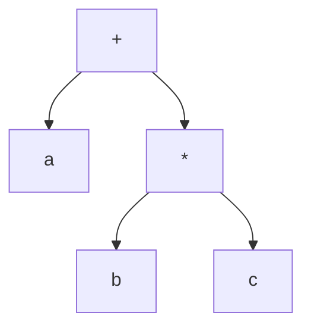
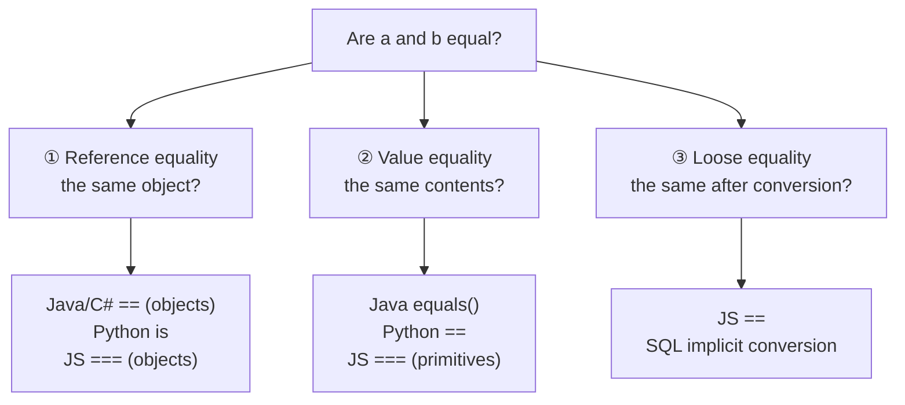

# Chapter 10 · Operators

[简体中文](./10-operators.md) ｜ **English**

---

> With variables and types in hand, the next step is to *do* things with them — add, subtract, compare, test truth. Writing those operations with symbols like `+`, `==`, and `&&` gives us **operators**.
>
> They look like mere symbols, but they hide the most valuable lesson of this chapter: **deciding whether two things are "equal" is far subtler than it looks.** In JavaScript `==` quietly converts types; in Java it asks "are these the same object?"; in Python it stands clearly apart from `is`. One symbol, six semantics.

## 1. Learning Objectives

By the end of this chapter, you will be able to:

- State what an operator really is: **shorthand for an operation**, backed either by a single CPU instruction or by a method call;
- Distinguish the **three levels of equality**: reference equality, value equality, and loose equality (with implicit conversion);
- Explain why `Integer 127 == 127` is true while `Integer 128 == 128` is false;
- Explain short-circuit evaluation and use it to write safer code;
- Know which languages allow **operator overloading**, and when you should use it.

---

## 2. Why This Concept Exists

Without operators, addition would have to be written like this:

```text
add(multiply(a, b), divide(c, d))
```

With operators:

```text
a * b + c / d
```

**The value of operators is readability** — they make code look like the mathematics we learned as children. This is a design purely in service of humans: the compiler treats `a + b` and `add(a, b)` identically, but people read them very differently.

Convenience has a price, though. **The same symbol takes on multiple meanings**:

```text
1 + 2         → 3          (numeric addition)
"1" + "2"     → "12"       (string concatenation)
[1] + [2]     → [1, 2]     (list concatenation, Python)
```

One `+`, three behaviors. This "one symbol, many meanings" is what the chapter untangles — and a prime breeding ground for bugs.

---

## 3. How It Works

### An operator is just shorthand for an operation

For primitive types, an operator maps **directly to a CPU instruction**:

```text
int c = a + b;
        ↓ after compilation
mov eax, [a]
add eax, [b]      ← a single CPU add instruction
mov [c], eax
```

But what if `a` and `b` are objects? Then `+` is **dispatched to a method call**:

| Language | What `a + b` actually calls |
|----------|----------------------------|
| Python | `a.__add__(b)` |
| C++ | `operator+(a, b)` |
| C# | `op_Addition(a, b)` |
| Java | the compiler special-cases `String` (concatenation) |

**So "operators" and "functions" were always the same thing, written differently.** That is also why some languages let you define what `+` means — it was a function all along.

### Precedence and associativity: an expression is really a tree

Why does `a + b * c` multiply first? Because operators have **precedence**. While parsing an expression, the compiler builds an **expression tree** (the AST from Chapter 03):



Leaves are evaluated first, so `b * c` runs first. **Associativity** decides which side wins at equal precedence: `a - b - c` is left-associative, i.e. `(a - b) - c`.

> Not remembering the precedence table is fine — **adding parentheses** is always more reliable than memorizing it.

### Short-circuit evaluation: `&&` and `||` are not ordinary operators

`a && b` does not dutifully evaluate both sides. If `a` is already false the result must be false, so `b` **is never executed**:

```python
False and boom()    # boom() is never called
True  or  boom()    # boom() is never called
```

It compiles not into an "and" instruction but into a **conditional jump**. This has practical value:

```javascript
if (user && user.name) { ... }    // won't crash when user is null
```

### The three levels of equality

This is the chapter's most important diagram. "Equal" is really three different questions:



**Most equality bugs come from picking the wrong level.**

---

## 4. JavaScript

**Two sets of equality operators** — JavaScript's most famous design controversy:

```javascript
// == converts types first (loose equality)
console.log(1 == "1");            // true  ← the string became a number
console.log(0 == false);          // true
console.log([] == false);         // true  ← an empty array counts as "falsy"
console.log(null == undefined);   // true

// === does no conversion; different types are simply unequal (strict equality)
console.log(1 === "1");           // false
console.log(null === undefined);  // false ✓
```

**The rule is simple: always use `===`.** There is one common exception — `x == null` tests for both `null` and `undefined`.

**`NaN` does not equal itself**:

```javascript
console.log(NaN === NaN);         // false
console.log(Number.isNaN(NaN));   // true ✓ the correct test
```

**Nullish coalescing and optional chaining** (modern JavaScript's best tools):

```javascript
const port = config.port ?? 8080;   // fall back only on null/undefined
const city = user?.address?.city;   // any missing link yields undefined instead of throwing
```

> **Note**: `??` differs from `||`. `0 || 8080` gives 8080 (0 is falsy), while `0 ?? 8080` gives 0 — for numeric defaults, `??` is the correct one.

---

## 5. Python

**`==` compares values, `is` compares identity**, and the two are kept strictly apart:

```python
a = [1, 2]
b = [1, 2]
print(a == b)     # True  — same contents
print(a is b)     # False — not the same object
```

**Never use `is` to compare values.** CPython caches small integers and folds constants, so the behavior **depends on implementation details**:

```python
print(int("256") is 256)   # True  ← small integers are cached
print(int("257") is 257)   # False ← outside the cache range
print(int("257") == 257)   # True  ← always reliable ✓
```

Python even warns you: `SyntaxWarning: "is" with a literal. Did you mean "=="?`

**`is` has exactly one proper use**: testing for `None` (and the `True`/`False` singletons):

```python
if value is None: ...      # ✓ the recommended form
```

**Conveniences unique to Python**:

```python
print(1 < 5 < 10)          # True — chained comparison, same as 1 < 5 and 5 < 10
print(2 ** 10)             # 1024 — exponentiation operator
print(7 // 2, 7 / 2)       # 3 3.5 — floor division and true division are separate
print("ab" * 3)            # ababab — strings can be "multiplied"
```

> **Note**: Python's logical operators are the words `and` / `or` / `not`, not `&&` / `||` / `!` (in Python, `&` and `|` are **bitwise** operators with entirely different meanings).

---

## 6. Java

**`==` compares references, `equals()` compares contents** — Java's most classic trap:

```java
String s1 = "hi";
String s2 = "hi";
String s3 = new String("hi");
System.out.println(s1 == s2);        // true  ← string constant pool, same object
System.out.println(s1 == s3);        // false ← same contents, different object
System.out.println(s1.equals(s3));   // true  ✓ the correct comparison
```

**The wrapper-class caching trap** (a frequent interview question):

```java
Integer x = 127, y = 127;
Integer m = 128, n = 128;
System.out.println(x == y);          // true  ← -128..127 are cached, same object
System.out.println(m == n);          // false ← beyond the cache, two objects
System.out.println(m.equals(n));     // true  ✓
```

**Identical code, opposite results, purely because of the value** — precisely why comparing objects with `==` is dangerous.

**Other points**:

```java
int[] a = {1, 2};
int[] b = {1, 2};
System.out.println(a == b);                 // false
System.out.println(java.util.Arrays.equals(a, b));  // true ✓ use Arrays.equals for arrays

// >>> is Java's unique unsigned right shift
System.out.println(-8 >> 1);    // -4  (sign preserved)
System.out.println(-8 >>> 1);   // 2147483644 (zero-filled)
```

> **Note**: Java **does not support operator overloading** (`String`'s `+` is a built-in special case). This is a deliberate trade — expressiveness given up for predictability.

---

## 7. C++

**Operators can be overloaded**, a major source of C++'s expressiveness:

```cpp
#include <iostream>
struct Score { int v; };

Score operator+(Score a, Score b) { return Score{a.v + b.v}; }

int main() {
    Score s = Score{90} + Score{5};
    std::cout << s.v;        // 95 — the custom + took effect
}
```

The standard library leans on this heavily: `std::string`'s `+` for concatenation and `std::cout`'s `<<` for output are both overloaded operators.

**Keep pointer and value comparison straight**:

```cpp
std::string a = "hi", b = "hi";
std::cout << (a == b);          // 1 (true) — string overloads ==, comparing contents

const char* p1 = "hi";
const char* p2 = "hi";
std::cout << (p1 == p2);        // compares addresses, not contents!
```

**The three-way comparison operator `<=>`** (C++20) generates all comparisons at once:

```cpp
auto r = (3 <=> 5);             // yields "less"; the compiler derives < > <= >= == from it
```

> **Note**: two frequent traps. ① Typing `=` for `==` — `if (x = 5)` assigns and is always true; modern compilers warn. ② Bitwise operators bind **looser** than comparison: `a & b == c` actually means `a & (b == c)`, so always parenthesize.

---

## 8. C#

**Combining Java's clarity with C++'s expressiveness**:

```csharp
string s1 = "hi";
string s2 = "hi";
Console.WriteLine(s1 == s2);          // True — C# overloads == for string, comparing contents
Console.WriteLine(s1.Equals(s2));     // True

object o1 = "hi", o2 = "hi";
Console.WriteLine(o1 == o2);          // compared as object (reference); may surprise you
```

**Operator overloading is supported**:

```csharp
public struct Score {
    public int V;
    public static Score operator +(Score a, Score b) => new Score { V = a.V + b.V };
}
```

**Handy operators unique to C#**:

```csharp
int? maybe = null;
int port = maybe ?? 8080;          // null coalescing
string city = user?.Address?.City; // optional chaining
Console.WriteLine($"score {score}"); // string interpolation

checked { int bad = int.MaxValue + 1; }   // throws on overflow (see Chapter 09)
```

> **Note**: `==` compares contents for `string`, but for **custom classes** it still compares references by default — unless you overload `==` and also override `Equals` and `GetHashCode` (all three must agree, or collections will misbehave).

---

## 9. SQL

SQL's operators differ **fundamentally** from the other five in three ways.

### ① There is only one equality: value equality

SQL has no notion of "object reference," so `=` always compares values:

```sql
SELECT * FROM student WHERE name = 'Alice';
```

### ② NULL makes logic three-valued: true / false / unknown

This is where SQL demands the most care. The measured truth table:

| Expression | Result | Why |
|------------|--------|-----|
| `NULL AND false` | **false** | whatever NULL is, AND-ing with false is false |
| `NULL AND true` | **unknown** | depends on what NULL actually is |
| `NULL OR true` | **true** | whatever NULL is, OR-ing with true is true |
| `NULL OR false` | **unknown** | depends on NULL |
| `NOT NULL` | **unknown** | the opposite of unknown is still unknown |

Hence (continuing from Chapter 09):

```sql
WHERE score = NULL      -- never matches any row
WHERE score IS NULL     -- correct ✓
```

### ③ Operators unique to SQL

```sql
SELECT * FROM student WHERE score BETWEEN 60 AND 90;    -- inclusive range
SELECT * FROM student WHERE name LIKE 'A%';             -- pattern matching, % is a wildcard
SELECT * FROM student WHERE grade IN ('A', 'B');        -- set membership
SELECT name || ' student' FROM student;                 -- standard concatenation (|| not +)
```

> ⚠️ **Note**: string concatenation varies by dialect — standard SQL, PostgreSQL, and SQLite use `||`, MySQL uses `CONCAT()`, SQL Server uses `+`. Also, `IN` behaves counter-intuitively with a set containing `NULL` (`NOT IN (1, NULL)` is never true), so be careful in production queries.

---

## 10. Cross-Language Comparison

### ① Equality testing (the most important table)

| Goal | JavaScript | Python | Java | C++ | C# |
|------|-----------|--------|------|-----|-----|
| Compare contents | `===` | `==` | `.equals()` | `==` (overloadable) | `==` (string) / `.Equals()` |
| Test same object | `===` (objects) | `is` | `==` | compare pointers | `ReferenceEquals()` |
| Compare with conversion | `==` | none | none | implicit conversions exist | none |
| Test for empty | `x == null` | `x is None` | `x == null` | `p == nullptr` | `x is null` |

**One-line mnemonics**:
- **JavaScript**: use `===`, not `==`
- **Python**: `==` for values; `is` only for `None`
- **Java**: `.equals()` for objects; `==` only for primitives
- **C#**: `==` is fine for `string`; for custom classes check whether it is overloaded

### ② Syntax differences

| Feature | JavaScript | Python | Java | C++ | C# |
|---------|-----------|--------|------|-----|-----|
| Logical and/or/not | `&& \|\| !` | `and or not` | `&& \|\| !` | `&& \|\| !` | `&& \|\| !` |
| Floor division | `Math.floor(a/b)` | `//` | `/` (between ints) | `/` (between ints) | `/` (between ints) |
| Exponentiation | `**` | `**` | `Math.pow()` | `std::pow()` | `Math.Pow()` |
| Chained comparison | ❌ | ✅ `1 < x < 10` | ❌ | ❌ | ❌ |
| Null coalescing | `??` | `or` (approximate) | ❌ | ❌ | `??` |
| Ternary | `? :` | `x if c else y` | `? :` | `? :` | `? :` |
| **Operator overloading** | ❌ | ✅ | ❌ | ✅ | ✅ |

### ③ Commonalities and the root of differences

**In common**: arithmetic, comparison, and logical operators are broadly the same across languages, and precedence rules are highly similar (both from mathematical tradition and C's influence); short-circuit evaluation is universal.

**The differences** come down to two design choices:
- **How much implicit conversion is allowed** — JavaScript allows the most (hence the mess around `==`), Python the least;
- **Whether operator overloading is allowed** — C++/Python/C# allow it (expressive, but abusable), Java/JavaScript don't (predictable, but verbose for math libraries).

---

## 11. Underlying Implementation Comparison

| Language · Engine | Primitive operations | Object operations |
|-------------------|---------------------|-------------------|
| **JavaScript · V8** | Smi fast path uses CPU instructions directly; a type mismatch falls to a slow path | inline caches remember types, approaching native on repeat execution |
| **Python · CPython** | every time goes through `PyNumber_Add` dispatch → look up the type's `__add__` | same; a major reason Python is slow |
| **Java · JVM** | bytecode `iadd`/`dadd`, becoming CPU instructions after JIT | `equals()` is a virtual call that the JIT can inline |
| **C++ · Native** | compiled straight to CPU instructions, zero overhead | an overloaded operator is an ordinary function and can be inlined |
| **C# · CLR** | IL's `add` instruction, CPU instructions after JIT | same as Java |

**Key insight**: `a + b` may be **one instruction** in C++ but a **full method dispatch** in Python (look up the type → find `__add__` → call → possibly allocate a new object). Inside a loop, that gap multiplies into tens of times.

---

## 12. Performance Analysis

| Operation | Relative cost | Notes |
|-----------|--------------|-------|
| Integer addition (C++/Java/C#) | 1 | one CPU instruction |
| Float addition | 1–3 | one FPU instruction |
| Integer division | 20–40 | division is far slower than addition |
| Modulo `%` | 20–40 | essentially a division |
| Python integer addition | tens | dispatch plus possible allocation |
| String concatenation (in a loop) | **O(n²)** | immutable strings rebuild each time, see below |

**Two practical optimizations**:

```python
# ❌ concatenating in a loop: O(n²)
s = ""
for w in words: s += w
# ✅ use join: O(n)
s = "".join(words)
```

```cpp
// when division/modulo can be replaced by a power of two, the compiler optimizes to bit ops
x / 8   → x >> 3        // the compiler does this; don't hand-write it
```

> **Important reminder**: don't sacrifice readability for these micro-optimizations. Measure first, then optimize — the vast majority of performance problems live in algorithms and I/O, not operators.

---

## 13. Engineering Practice

| Scenario | ✅ Recommended | ❌ Discouraged | Why |
|----------|---------------|---------------|-----|
| JavaScript comparison | `===` / `!==` | `==` / `!=` | avoids surprises from implicit conversion |
| Java object comparison | `.equals()`, or `Objects.equals(a,b)` | `==` | `==` compares references and has the cache trap |
| Python empty test | `if x is None` | `if x == None` | `is` is the correct way to test a singleton |
| Float comparison | tolerance-based | `==` | see Chapter 09 |
| Complex expressions | **add parentheses** | relying on remembered precedence | bitwise precedence is especially counter-intuitive |
| Guarding against null | `user?.name` (JS/C#) | nested `if`s | shorter and harder to miss a case |
| Custom types | when overloading `==` in C#/C++, **also** override `Equals`/`GetHashCode` | overloading `==` alone | inconsistency breaks collections |
| Operator overloading | only when the meaning is **obvious** (vector addition, adding money) | giving `+` a strange meaning | overloading exists for readability, not cleverness |

---

## 14. Best Practices

- **Default to strict comparison**: `===` in JavaScript, `==` in Python, `.equals()` in Java.
- **Parentheses beat precedence tables**: `(a & b) == c` is always safer than `a & b == c`.
- **Use short-circuiting as a guard**: `if (user && user.isActive)` — put the risky condition on the right.
- **Don't pack side effects into one expression**: code like `arr[i++] = i++` behaves differently across languages and compilers, and is either undefined or impossible to reason about.
- **`i++` vs `++i`**: identical as a standalone statement; as an expression, `i++` yields the old value and `++i` the new one. In C++, `++i` is more efficient for heavyweight iterators.
- **Keep overloaded operators intuitive**: let `+` do "combine/add" — don't make it write files.

---

## 15. Common Pitfalls

**Pitfall 1 · Surprises from JavaScript's `==`**

```javascript
[] == false          // true
"0" == false         // true
null == 0            // false, yet null >= 0 is true!
```
**Why it's wrong**: `==` converts types under a complicated set of rules.
**How to avoid**: always use `===`; use `x == null` only to test for `null`/`undefined`.

**Pitfall 2 · Comparing Java wrapper classes with `==`**

```java
Integer m = 128, n = 128;
System.out.println(m == n);      // false ← but true when the value is 127!
```
**Why it's wrong**: `Integer` caches -128..127; beyond that they are different objects.
**How to avoid**: always use `.equals()` for objects.

**Pitfall 3 · Comparing values with `is` in Python**

```python
int("257") is 257     # False
int("256") is 256     # True   ← same code shape, different result
```
**Why it's wrong**: small-integer caching and constant folding are **implementation details** you must not rely on.
**How to avoid**: use `==` for values; reserve `is` for `None`.

**Pitfall 4 · Bitwise operators bind looser than comparison**

```cpp
if (flags & MASK == 0)      // actually flags & (MASK == 0) — almost certainly not what you meant
if ((flags & MASK) == 0)    // correct ✓
```
**Why it's wrong**: a legacy of C-family precedence design.
**How to avoid**: always parenthesize bitwise operations.

**Pitfall 5 · Integer division truncates**

```java
double ratio = 92 / 100;     // 0.0, not 0.92
double right = 92.0 / 100;   // ✓
```
**How to avoid**: make at least one operand a float (Python's `/` avoids this entirely).

**Pitfall 6 · `NaN` does not equal itself**

```javascript
NaN === NaN              // false
[NaN].includes(NaN)      // true (includes uses a different algorithm)
```
**How to avoid**: use `Number.isNaN()` (JS) or `math.isnan()` (Python).

**Pitfall 7 · `NOT IN` with NULL in SQL**

```sql
SELECT * FROM student WHERE grade NOT IN ('A', NULL);   -- always returns 0 rows
```
**Why it's wrong**: under three-valued logic, comparing with `NULL` is "unknown," so `NOT IN` can never be true.
**How to avoid**: filter out NULLs first, or use `NOT EXISTS`.

---

## 16. Interview Questions

**Basic**

1. What is the difference between `==` and `===` in JavaScript? Why is `===` recommended?
2. To compare the contents of two strings in Java, should you use `==` or `equals()`? Why?
3. What is short-circuit evaluation? Give an example where it prevents a crash.

**Intermediate**

4. Explain this Java output and why it happens:
   ```java
   Integer a = 127, b = 127, c = 128, d = 128;
   System.out.println((a == b) + " " + (c == d));   // true false
   ```
5. What is the difference between `is` and `==` in Python? Why must you not compare numbers with `is`?
6. What is the difference between `i++` and `++i`? When do they produce different results?

**Advanced**

7. Why can `a + b` be a single CPU instruction in C++ yet tens of times slower in Python? Explain in terms of operator dispatch.
8. When overloading `==` in C#, why must you also override `Equals` and `GetHashCode`? What breaks if you don't?
9. Explain SQL's three-valued logic: why does `WHERE score = NULL` find nothing, and why is `NOT IN (1, NULL)` never true?

---

## 17. Exercises

**Basic**

1. In each of the six languages, compare two values that have the same contents but are not the same object, using the **correct** test for equality.
2. Rewrite a piece of null-unsafe code using short-circuit evaluation.
3. Compute `2 + 3 * 4 ** 2 / 8` in each language — by hand first, then verify (note that Java/C++ lack `**`).

**Intermediate**

4. Reproduce Java's `Integer` caching behavior, find the boundary value, and explain why it is that number.
5. In Python, find a pair of integers where `a == b` is true but `a is b` is false, and explain why.
6. In C++ or Python, overload `+` and `==` for a `Money` type that stores amounts as integer cents (echoing Chapter 09).

**Challenge**

7. Implement a safe comparison function that correctly handles `null`, `NaN`, and floating-point tolerance, once in each of the six languages.
8. Write an expression evaluator: given `"2 + 3 * 4"`, output 14 with correct precedence (hint: build the expression tree from section 3).

---

## 18. Summary

**In one sentence**: an operator is shorthand for an operation — a single CPU instruction for primitives, a method call for objects; the six languages diverge least on arithmetic and most on **how "equality" is decided**, and on **whether implicit conversion and operator overloading are allowed**.

**Core takeaways**

- An operator is syntactic sugar for a function, which is why some languages let you overload it.
- Equality has three levels — **reference / value / loose** — and picking the wrong one is a leading source of bugs.
- `Integer 127 == 127` is true while `128 == 128` is false — a **caching** trap showing that objects must be compared with `equals()`.
- Short-circuit evaluation is not an "optimization" but a guaranteed semantic you can use for guards.
- SQL's `NULL` makes logic **three-valued**, so `= NULL` never finds anything.

**Checklist**

- [ ] I can say which construct compares contents in each of the six languages.
- [ ] I can explain Java's `Integer` cache trap and Python's `is` trap.
- [ ] I can write null-safe guards using short-circuit evaluation.
- [ ] I know which languages support operator overloading and when to use it.
- [ ] I can explain how SQL's three-valued logic affects `AND`/`OR`/`NOT IN`.

**Next chapter**: with values and operations in place, a program needs to *choose* and to *repeat* — how does `if` change the direction of execution? What is a loop underneath? Why was `goto` considered harmful? That is Chapter 11, "Control Flow."

---

## 19. Further Reading

- <a href="https://developer.mozilla.org/en-US/docs/Web/JavaScript/Reference/Operators/Equality" target="_blank" rel="noopener">MDN · Equality operators</a> — the full conversion rules for `==` (reading them will make you prefer `===`).
- <a href="https://docs.python.org/3/reference/datamodel.html#special-method-names" target="_blank" rel="noopener">Python docs · Special method names</a> — the methods behind `__add__`, `__eq__`, and friends.
- <a href="https://docs.oracle.com/javase/specs/jls/se21/html/jls-15.html" target="_blank" rel="noopener">The Java Language Specification · Chapter 15: Expressions</a> — the normative definition of operator semantics and evaluation order.
- <a href="https://en.cppreference.com/w/cpp/language/operator_precedence" target="_blank" rel="noopener">cppreference · Operator precedence</a> — the complete precedence and associativity table.
- <a href="https://learn.microsoft.com/en-us/dotnet/csharp/language-reference/operators/" target="_blank" rel="noopener">Microsoft Learn · C# operators</a> — official coverage including operator overloading and null-coalescing.
