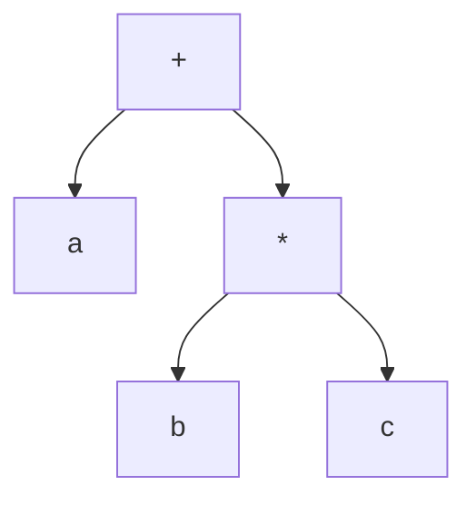
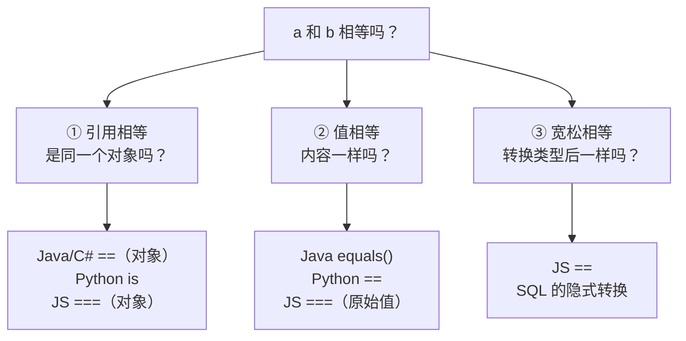

# 第 10 章 · 运算符

**简体中文** ｜ [English](./10-operators.en-US.md)

---

> 有了变量和类型，接下来就要对它们做事——加减乘除、比大小、判真假。这些操作用 `+`、`==`、`&&` 这些符号写出来，就是**运算符**。
>
> 它看起来只是"符号"，但藏着本章最值得学的一件事：**判断两个东西"相等"，比你想的复杂得多**。`==` 在 JavaScript 里会偷偷转换类型，在 Java 里比较的是"是不是同一个对象"，在 Python 里又和 `is` 泾渭分明。同一个符号，六种语义。

## 1. 学习目标

本章结束后，你将能够：

- 说清运算符的本质：**它只是"操作"的简写**，背后可能是一条 CPU 指令，也可能是一次方法调用；
- 区分相等性的**三个层次**：引用相等、值相等、宽松相等（带隐式转换）；
- 解释 `Integer 127 == 127` 为真而 `Integer 128 == 128` 为假的原因；
- 说清短路求值的机制，并用它写出更安全的代码；
- 知道哪些语言允许**运算符重载**，以及该不该用。

---

## 2. 为什么会出现这个概念

如果没有运算符，加法得写成这样：

```text
add(multiply(a, b), divide(c, d))
```

而有了运算符：

```text
a * b + c / d
```

**运算符的价值就是可读性**——它让代码贴近我们从小学习的数学写法。这是一种纯粹为人服务的设计：编译器把 `a + b` 和 `add(a, b)` 处理成同样的东西，但人读起来天差地别。

但便利也带来了代价。**同一个符号被赋予了多种含义**：

```text
1 + 2         → 3          （数字相加）
"1" + "2"     → "12"       （字符串拼接）
[1] + [2]     → [1, 2]     （列表合并，Python）
```

一个 `+` 三种行为。这种"一符多义"正是本章要理清的核心，也是 bug 的高发地带。

---

## 3. 底层原理

### 运算符只是"操作"的简写

对基本类型，运算符**直接对应 CPU 指令**：

```text
int c = a + b;
        ↓ 编译后
mov eax, [a]
add eax, [b]      ← 一条 CPU 加法指令
mov [c], eax
```

但如果 `a`、`b` 是对象呢？这时 `+` 会被**分派成一次方法调用**：

| 语言 | `a + b` 实际调用 |
|------|-----------------|
| Python | `a.__add__(b)` |
| C++ | `operator+(a, b)` |
| C# | `op_Addition(a, b)` |
| Java | 编译器对 `String` 特殊处理（拼接） |

**所以"运算符"和"函数"本来就是一回事，只是写法不同。** 这也解释了为什么某些语言允许你自定义 `+` 的行为——因为它本来就是个函数。

### 优先级与结合性：表达式其实是一棵树

`a + b * c` 为什么先算乘法？因为运算符有**优先级**。编译器解析表达式时会构造一棵**表达式树**（第 03 章的 AST）：



树的叶子先算，所以 `b * c` 先执行。**结合性**则决定同优先级时从哪边算起：`a - b - c` 是左结合，等于 `(a - b) - c`。

> 记不住优先级不是问题——**加括号**永远比背表格可靠。

### 短路求值：`&&` 和 `||` 不是普通运算符

`a && b` 不会老老实实算完两边。如果 `a` 已经是假，结果必定是假，`b` **根本不会被执行**：

```python
False and boom()    # boom() 从未被调用
True  or  boom()    # boom() 从未被调用
```

它编译后不是一条"与"指令，而是一个**条件跳转**。这个特性有实用价值：

```javascript
if (user && user.name) { ... }    // user 为 null 时不会崩
```

### 相等性的三个层次

这是本章最重要的一张图。"相等"其实有三种完全不同的问法：



**大多数相等性 bug，都源于用错了层次。**

---

## 4. JavaScript

**两套相等运算符**，这是 JavaScript 最著名的设计争议：

```javascript
// == 会先做类型转换（宽松相等）
console.log(1 == "1");            // true  ← 字符串被转成了数字
console.log(0 == false);          // true
console.log([] == false);         // true  ← 空数组也算"假"
console.log(null == undefined);   // true

// === 不做转换，类型不同直接为假（严格相等）
console.log(1 === "1");           // false
console.log(null === undefined);  // false ✓
```

**规则很简单：永远用 `===`。** 只有一个常见例外——`x == null` 可以同时判断 `null` 和 `undefined`。

**`NaN` 不等于自己**：

```javascript
console.log(NaN === NaN);         // false
console.log(Number.isNaN(NaN));   // true ✓ 正确的判断方式
```

**空值合并与可选链**（现代 JavaScript 的利器）：

```javascript
const port = config.port ?? 8080;   // 只在 null/undefined 时取默认值
const city = user?.address?.city;   // 任一层为空就返回 undefined，不报错
```

> **注意事项**：`??` 和 `||` 不同。`0 || 8080` 得到 8080（因为 0 是假值），而 `0 ?? 8080` 得到 0——涉及数字默认值时，`??` 才是对的。

---

## 5. Python

**`==` 比较值，`is` 比较身份**，两者泾渭分明：

```python
a = [1, 2]
b = [1, 2]
print(a == b)     # True  —— 内容相同
print(a is b)     # False —— 不是同一个对象
```

**绝不要用 `is` 比较值**。原因是 CPython 会缓存小整数、复用常量，导致行为**取决于实现细节**：

```python
print(int("256") is 256)   # True  ← 小整数被缓存
print(int("257") is 257)   # False ← 超出缓存范围
print(int("257") == 257)   # True  ← 永远可靠 ✓
```

Python 自己都会警告你：`SyntaxWarning: "is" with a literal. Did you mean "=="?`

**`is` 的正确用途**只有一个：判断是不是 `None`（以及 `True`/`False` 单例）：

```python
if value is None: ...      # ✓ 推荐写法
```

**Python 独有的便利**：

```python
print(1 < 5 < 10)          # True —— 链式比较，等价于 1 < 5 and 5 < 10
print(2 ** 10)             # 1024 —— 幂运算符
print(7 // 2, 7 / 2)       # 3 3.5 —— 整除与真除法分开
print("ab" * 3)            # ababab —— 字符串可以"乘"
```

> **注意事项**：Python 的逻辑运算符是英文单词 `and` / `or` / `not`，不是 `&&` / `||` / `!`（后者中 `&`、`|` 是**位运算**，含义完全不同）。

---

## 6. Java

**`==` 比较引用，`equals()` 比较内容**——这是 Java 最经典的坑：

```java
String s1 = "hi";
String s2 = "hi";
String s3 = new String("hi");
System.out.println(s1 == s2);        // true  ← 字符串常量池，指向同一对象
System.out.println(s1 == s3);        // false ← 内容相同，但不是同一对象
System.out.println(s1.equals(s3));   // true  ✓ 正确的比较方式
```

**包装类的缓存陷阱**（面试高频题）：

```java
Integer x = 127, y = 127;
Integer m = 128, n = 128;
System.out.println(x == y);          // true  ← -128~127 被缓存，是同一对象
System.out.println(m == n);          // false ← 超出缓存，是两个对象
System.out.println(m.equals(n));     // true  ✓
```

**同样的写法，只因数值不同就得到相反结果**——这正是"用 `==` 比较对象"的危险之处。

**其他要点**：

```java
int[] a = {1, 2};
int[] b = {1, 2};
System.out.println(a == b);                 // false
System.out.println(java.util.Arrays.equals(a, b));  // true ✓ 数组要用 Arrays.equals

// >>> 是 Java 独有的无符号右移
System.out.println(-8 >> 1);    // -4  （保留符号）
System.out.println(-8 >>> 1);   // 2147483644（补 0）
```

> **注意事项**：Java **不支持运算符重载**（`String` 的 `+` 是语言内置的特例）。这是 Java 有意的取舍——用表达力换取可预测性。

---

## 7. C++

**运算符可以重载**，这是 C++ 表达力的重要来源：

```cpp
#include <iostream>
struct Score { int v; };

Score operator+(Score a, Score b) { return Score{a.v + b.v}; }

int main() {
    Score s = Score{90} + Score{5};
    std::cout << s.v;        // 95 —— 自定义的 + 生效了
}
```

标准库大量使用这一机制：`std::string` 的 `+` 拼接、`std::cout` 的 `<<` 输出，本质都是重载的运算符。

**指针与值的比较要分清**：

```cpp
std::string a = "hi", b = "hi";
std::cout << (a == b);          // 1（真）—— string 重载了 ==，比较内容

const char* p1 = "hi";
const char* p2 = "hi";
std::cout << (p1 == p2);        // 比较的是地址，不是内容！
```

**三向比较运算符 `<=>`**（C++20）一次性生成所有比较：

```cpp
auto r = (3 <=> 5);             // 返回"小于"，编译器据此推导 < > <= >= ==
```

> **注意事项**：两个高频坑。① `=` 和 `==` 写错——`if (x = 5)` 是赋值且恒为真，现代编译器会警告。② 位运算优先级**低于**比较：`a & b == c` 实际是 `a & (b == c)`，务必加括号。

---

## 8. C#

**兼具 Java 的清晰与 C++ 的表达力**：

```csharp
string s1 = "hi";
string s2 = "hi";
Console.WriteLine(s1 == s2);          // True —— C# 为 string 重载了 ==，比较内容
Console.WriteLine(s1.Equals(s2));     // True

object o1 = "hi", o2 = "hi";
Console.WriteLine(o1 == o2);          // 按 object 比较引用，行为可能出人意料
```

**支持运算符重载**：

```csharp
public struct Score {
    public int V;
    public static Score operator +(Score a, Score b) => new Score { V = a.V + b.V };
}
```

**C# 特有的实用运算符**：

```csharp
int? maybe = null;
int port = maybe ?? 8080;          // 空合并
string city = user?.Address?.City; // 可选链
Console.WriteLine($"得分 {score}"); // 字符串插值

checked { int bad = int.MaxValue + 1; }   // 溢出时抛异常（见第 09 章）
```

> **注意事项**：`==` 对 `string` 比较内容，但对**自定义类**默认仍比较引用——除非你重载 `==` 并同时重写 `Equals` 和 `GetHashCode`（三者必须一致，否则集合行为会出错）。

---

## 9. SQL

SQL 的运算符有三点与其他五种语言**根本不同**。

### ① 只有一种相等：值相等

SQL 里没有"对象引用"的概念，`=` 永远比较值：

```sql
SELECT * FROM student WHERE name = 'Alice';
```

### ② NULL 让逻辑变成三值：真 / 假 / 未知

这是 SQL 最需要小心的地方。实测真值表：

| 表达式 | 结果 | 为什么 |
|--------|------|--------|
| `NULL AND 假` | **假** | 无论 NULL 是什么，与"假"相与都是假 |
| `NULL AND 真` | **未知** | 取决于 NULL 到底是什么 |
| `NULL OR 真` | **真** | 无论 NULL 是什么，或上"真"都是真 |
| `NULL OR 假` | **未知** | 取决于 NULL |
| `NOT NULL` | **未知** | 未知的反面还是未知 |

因此（承接第 09 章）：

```sql
WHERE score = NULL      -- 永远匹配不到任何行
WHERE score IS NULL     -- 正确 ✓
```

### ③ 专有运算符

```sql
SELECT * FROM student WHERE score BETWEEN 60 AND 90;    -- 闭区间
SELECT * FROM student WHERE name LIKE 'A%';             -- 模式匹配，% 通配任意字符
SELECT * FROM student WHERE grade IN ('A', 'B');        -- 集合成员
SELECT name || ' 同学' FROM student;                     -- 标准字符串拼接（|| 而非 +）
```

> ⚠️ **注意**：字符串拼接各方言不同——标准 SQL 与 PostgreSQL/SQLite 用 `||`，MySQL 用 `CONCAT()`，SQL Server 用 `+`。另外 `IN` 遇到含 `NULL` 的集合时行为反直觉（`NOT IN (1, NULL)` 永远不为真），生产查询要特别小心。

---

## 10. 五语言横向对比

### ① 相等性判断（最重要的一张表）

| 需求 | JavaScript | Python | Java | C++ | C# |
|------|-----------|--------|------|-----|-----|
| 判断内容相等 | `===` | `==` | `.equals()` | `==`（可重载） | `==`（string）/ `.Equals()` |
| 判断是否同一对象 | `===`（对象） | `is` | `==` | 比较指针 | `ReferenceEquals()` |
| 带类型转换的比较 | `==` | 无 | 无 | 有隐式转换 | 无 |
| 判空 | `x == null` | `x is None` | `x == null` | `p == nullptr` | `x is null` |

**一句话记法**：
- **JavaScript**：用 `===`，别用 `==`
- **Python**：值用 `==`，只有判 `None` 才用 `is`
- **Java**：对象一律 `.equals()`，`==` 只用于基本类型
- **C#**：`string` 可以用 `==`，自定义类要看有没有重载

### ② 运算符语法差异

| 特性 | JavaScript | Python | Java | C++ | C# |
|------|-----------|--------|------|-----|-----|
| 逻辑与或非 | `&& \|\| !` | `and or not` | `&& \|\| !` | `&& \|\| !` | `&& \|\| !` |
| 整除 | `Math.floor(a/b)` | `//` | `/`（整数间） | `/`（整数间） | `/`（整数间） |
| 幂 | `**` | `**` | `Math.pow()` | `std::pow()` | `Math.Pow()` |
| 链式比较 | ❌ | ✅ `1 < x < 10` | ❌ | ❌ | ❌ |
| 空合并 | `??` | `or`（近似） | ❌ | ❌ | `??` |
| 三元 | `? :` | `x if c else y` | `? :` | `? :` | `? :` |
| **运算符重载** | ❌ | ✅ | ❌ | ✅ | ✅ |

### ③ 共同点与差异根源

**共同点**：算术、比较、逻辑三大类运算符各语言基本一致，优先级规则也高度相似（都源自数学传统与 C 的影响），短路求值更是全体共有。

**差异根源**在两个设计选择上：
- **是否允许隐式转换** —— JavaScript 允许得最多（于是有了 `==` 的混乱），Python 最克制；
- **是否允许运算符重载** —— C++/Python/C# 允许（表达力强，但可能被滥用），Java/JavaScript 不允许（可预测，但写数学库很啰嗦）。

---

## 11. 底层实现对比

| 语言 · 引擎 | 基本类型运算 | 对象运算 |
|------------|-------------|---------|
| **JavaScript · V8** | Smi 快路径直接用 CPU 指令；类型不符时走慢路径 | 内联缓存记住类型，反复执行时接近原生 |
| **Python · CPython** | 每次都要经过 `PyNumber_Add` 分派 → 查类型的 `__add__` | 同左；这是 Python 慢的主要原因之一 |
| **Java · JVM** | 字节码 `iadd`/`dadd`，JIT 后即 CPU 指令 | `equals()` 是虚方法调用，JIT 可内联 |
| **C++ · Native** | 直接编译成 CPU 指令，零开销 | 重载的运算符就是普通函数，可被内联 |
| **C# · CLR** | IL 的 `add` 指令，JIT 后即 CPU 指令 | 同 Java |

**关键洞察**：`a + b` 在 C++ 里可能是**一条指令**，在 Python 里则是**一次完整的方法分派**（查类型 → 找 `__add__` → 调用 → 可能创建新对象）。这个差距在循环里会被放大成数十倍。

---

## 12. 性能分析

| 操作 | 相对成本 | 说明 |
|------|---------|------|
| 整数加法（C++/Java/C#） | 1 | 一条 CPU 指令 |
| 浮点加法 | 1–3 | 一条 FPU 指令 |
| 整数除法 | 20–40 | 除法比加法慢得多 |
| 取模 `%` | 20–40 | 本质是除法 |
| Python 整数加法 | 数十 | 对象分派 + 可能的分配 |
| 字符串拼接（循环中） | **O(n²)** | 不可变字符串每次都新建，见下 |

**两条实用优化**：

```python
# ❌ 循环内拼接字符串：O(n²)
s = ""
for w in words: s += w
# ✅ 用 join：O(n)
s = "".join(words)
```

```cpp
// 除法/取模可被 2 的幂替代时，编译器会自动优化成位运算
x / 8   → x >> 3        // 编译器会做，不必手写
```

> **重要提醒**：不要为了这些微优化牺牲可读性。先测量，再优化——绝大多数性能问题在算法和 I/O，不在运算符。

---

## 13. 工程实践

| 场景 | ✅ 推荐 | ❌ 不推荐 | 原因 |
|------|--------|----------|------|
| JavaScript 比较 | `===` / `!==` | `==` / `!=` | 避免隐式转换的意外 |
| Java 对象比较 | `.equals()`，或 `Objects.equals(a,b)` | `==` | `==` 比的是引用，且有缓存陷阱 |
| Python 判空 | `if x is None` | `if x == None` | `is` 是判单例的正确方式 |
| 浮点比较 | 容差比较 | `==` | 见第 09 章 |
| 复杂表达式 | **加括号** | 依赖优先级记忆 | 位运算优先级尤其反直觉 |
| 防空指针 | `user?.name`（JS/C#） | 层层 `if` 嵌套 | 更简洁且不易漏 |
| 自定义类型 | C#/C++ 重载 `==` 时**同时**重写 `Equals`/`GetHashCode` | 只重载 `==` | 不一致会导致集合行为错乱 |
| 运算符重载 | 只在语义**显而易见**时用（向量相加、金额相加） | 给 `+` 赋予奇怪含义 | 重载的目的是可读，不是炫技 |

---

## 14. 最佳实践

- **默认用严格比较**：JavaScript 的 `===`、Python 的 `==`、Java 的 `.equals()`。
- **括号胜过优先级表**：`(a & b) == c` 永远比 `a & b == c` 安全。
- **利用短路写守卫**：`if (user && user.isActive)`，把可能出错的条件放右边。
- **别在一个表达式里塞副作用**：`arr[i++] = i++` 这类代码在不同语言/编译器下结果不同，属于未定义或难以推理的写法。
- **`i++` 与 `++i`**：单独成句时没区别；作为表达式时 `i++` 返回旧值、`++i` 返回新值。C++ 中对复杂迭代器 `++i` 更高效。
- **运算符重载要保持直觉**：让 `+` 做"合并/相加"这类符合直觉的事，不要让它去写文件。

---

## 15. 常见坑

**坑 1 · JavaScript 用 `==` 导致的意外**

```javascript
[] == false          // true
"0" == false         // true
null == 0            // false，但 null >= 0 是 true！
```
**为什么错**：`==` 会按一套复杂规则做类型转换。
**如何避免**：一律用 `===`；只在判 `null`/`undefined` 时用 `x == null`。

**坑 2 · Java 用 `==` 比较包装类**

```java
Integer m = 128, n = 128;
System.out.println(m == n);      // false ← 但 127 时是 true！
```
**为什么错**：`Integer` 缓存 -128~127，超出范围就是不同对象。
**如何避免**：对象一律用 `.equals()`。

**坑 3 · Python 用 `is` 比较值**

```python
int("257") is 257     # False
int("256") is 256     # True   ← 同样的写法，结果不同
```
**为什么错**：小整数缓存与常量折叠是**实现细节**，不可依赖。
**如何避免**：值比较用 `==`，`is` 只用于 `None`。

**坑 4 · 位运算优先级低于比较**

```cpp
if (flags & MASK == 0)      // 实际是 flags & (MASK == 0) —— 几乎肯定不是你要的
if ((flags & MASK) == 0)    // 正确 ✓
```
**为什么错**：C 系语言的优先级设计遗留问题。
**如何避免**：位运算一律加括号。

**坑 5 · 整数除法被截断**

```java
double ratio = 92 / 100;     // 0.0，不是 0.92
double right = 92.0 / 100;   // ✓
```
**如何避免**：让至少一个操作数是浮点（Python 用 `/` 则无此问题）。

**坑 6 · `NaN` 不等于自己**

```javascript
NaN === NaN              // false
[NaN].includes(NaN)      // true（includes 用的是另一套算法）
```
**如何避免**：用 `Number.isNaN()`（JS）、`math.isnan()`（Python）。

**坑 7 · SQL 中 `NOT IN` 遇到 NULL**

```sql
SELECT * FROM student WHERE grade NOT IN ('A', NULL);   -- 永远返回 0 行
```
**为什么错**：三值逻辑下，与 `NULL` 的比较是"未知"，`NOT IN` 因此永远无法为真。
**如何避免**：先过滤掉 NULL，或改用 `NOT EXISTS`。

---

## 16. 面试题

**基础**

1. JavaScript 中 `==` 和 `===` 有什么区别？为什么推荐用 `===`？
2. Java 中比较两个字符串的内容，应该用 `==` 还是 `equals()`？为什么？
3. 什么是短路求值？举一个它能防止程序崩溃的例子。

**中级**

4. 解释这段 Java 代码的输出，并说明原因：
   ```java
   Integer a = 127, b = 127, c = 128, d = 128;
   System.out.println((a == b) + " " + (c == d));   // true false
   ```
5. Python 中 `is` 和 `==` 有什么区别？为什么不能用 `is` 比较数值？
6. `i++` 和 `++i` 有什么区别？在什么情况下会产生不同结果？

**高级**

7. 为什么 `a + b` 在 C++ 里可能只是一条 CPU 指令，在 Python 里却慢几十倍？请从运算符分派的角度解释。
8. 在 C# 中重载 `==` 时，为什么必须同时重写 `Equals` 和 `GetHashCode`？不这样做会发生什么？
9. 解释 SQL 的三值逻辑：为什么 `WHERE score = NULL` 查不到数据，而 `NOT IN (1, NULL)` 永远为假？

---

## 17. 练习

**基础**

1. 在六门语言中各写一段代码，比较两个内容相同但不是同一对象的值，用**正确**的方式判断它们相等。
2. 用短路求值改写一段有空指针风险的代码。
3. 计算 `2 + 3 * 4 ** 2 / 8` 在各语言中的结果，先手算再验证（注意 Java/C++ 没有 `**`）。

**提高**

4. 复现 Java 的 `Integer` 缓存现象，找出临界值，并解释为什么是这个数。
5. 在 Python 中找出一对 `a == b` 为真但 `a is b` 为假的整数，并解释原因。
6. 用 C++ 或 Python 为一个 `Money` 类型重载 `+` 和 `==`，要求金额用整数分存储（呼应第 09 章）。

**挑战**

7. 实现一个安全比较函数，能正确处理 `null`、`NaN`、浮点误差三种情况，在六门语言中各写一版。
8. 写一个表达式求值器：输入 `"2 + 3 * 4"`，按正确的优先级输出 14（提示：构造第 3 节讲的表达式树）。

---

## 18. 本章总结

**一句话总结**：运算符只是"操作"的简写——对基本类型它是一条 CPU 指令，对对象它是一次方法调用；六门语言最大的分歧不在算术运算，而在**如何判断“相等”**，以及**是否允许隐式转换和运算符重载**。

**核心知识点**

- 运算符本质是函数的语法糖，所以某些语言允许重载它。
- 相等性有三个层次：**引用相等 / 值相等 / 宽松相等**，用错层次是 bug 的主要来源。
- `Integer 127 == 127` 为真、`128 == 128` 为假——**缓存**导致的陷阱，说明对象比较必须用 `equals()`。
- 短路求值不是"优化"，而是明确的语义保证，可用来写守卫条件。
- SQL 的 `NULL` 让逻辑变成**三值**，`= NULL` 永远查不到数据。

**检查清单**

- [ ] 我能说出六门语言中"判断内容相等"分别该用什么。
- [ ] 我能解释 Java 的 `Integer` 缓存陷阱和 Python 的 `is` 陷阱。
- [ ] 我能用短路求值写出防空的守卫条件。
- [ ] 我知道哪些语言支持运算符重载，以及什么时候该用。
- [ ] 我能说清 SQL 三值逻辑对 `AND`/`OR`/`NOT IN` 的影响。

**下一章预告**：有了值和运算，接下来要让程序"做选择"和"重复做事"——`if` 为什么能改变执行方向？循环底层是什么？`goto` 为什么被认为有害？这就是第 11 章「流程控制」。

---

## 19. 延伸阅读

- <a href="https://developer.mozilla.org/en-US/docs/Web/JavaScript/Reference/Operators/Equality" target="_blank" rel="noopener">MDN · 相等运算符</a> — `==` 的完整转换规则（看完你会更想用 `===`）。
- <a href="https://docs.python.org/3/reference/datamodel.html#special-method-names" target="_blank" rel="noopener">Python 文档 · 特殊方法名</a> — `__add__`、`__eq__` 等运算符背后的方法。
- <a href="https://docs.oracle.com/javase/specs/jls/se21/html/jls-15.html" target="_blank" rel="noopener">Java 语言规范 · 第 15 章 表达式</a> — 运算符语义与求值顺序的规范定义。
- <a href="https://en.cppreference.com/w/cpp/language/operator_precedence" target="_blank" rel="noopener">cppreference · 运算符优先级</a> — 完整的优先级与结合性表格。
- <a href="https://learn.microsoft.com/en-us/dotnet/csharp/language-reference/operators/" target="_blank" rel="noopener">Microsoft Learn · C# 运算符</a> — 含运算符重载与空合并运算符的官方说明。
