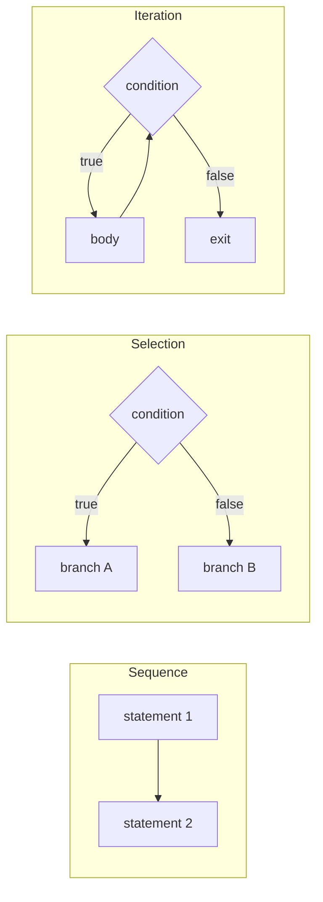

# Chapter 11 · Control Flow

[简体中文](./11-control-flow.md) ｜ **English**

---

> A program executes line by line, top to bottom, by default. But the real world requires "it depends" and "do this repeatedly" — hence `if` and `for`.
>
> This chapter reveals a plain truth: **all control flow is, underneath, just jumping.** `if`, `while`, `for`, and `switch` are all the same thing in different wrappings. Once you see that, you'll understand why `goto` was once treated as a menace, and what modern loop syntax is shielding you from.

## 1. Learning Objectives

By the end of this chapter, you will be able to:

- State what control flow really is: **conditional jumps plus unconditional jumps**;
- Use "sequence, selection, iteration" to explain why those three suffice to express any program;
- Explain where `switch` fall-through came from and how modern languages fixed it;
- Explain the classic closure-capture trap in loops (why `var` yields `[3,3,3]`);
- Understand how SQL expresses branching (`CASE`) and repetition (recursive CTEs) **declaratively**.

---

## 2. Why This Concept Exists

After executing one instruction, the CPU runs the next one by default — that is **sequential execution**. But a purely sequential program is nearly useless: it cannot ask "is the score passing?", nor "process every student."

So CPUs provide **jump instructions**: instead of the next instruction, continue at a specified location. With jumps, a program gains the ability to *choose* and to *repeat*.

Early high-level languages exposed jumping directly as `goto`:

```text
    if score < 60 goto FAIL
    print "passed"
    goto END
FAIL:
    print "failed"
END:
```

It works, but code quickly turns into a tangle — jumping back and forth until nobody can trace the execution path. The name for it is **spaghetti code**.

In 1968 Dijkstra published the famous *Go To Statement Considered Harmful*, arguing for structured control constructs over raw jumps. And the **Böhm–Jacopini theorem** proved it in theory: **any program can be written using only sequence, selection, and iteration** — no `goto` required.

Modern `if` / `while` / `for` are exactly that: jumps wrapped into these three readable structures.

---

## 3. How It Works

### Everything is a jump

Here is what `if` compiles to:

```text
if (score >= 60) { pass(); } else { fail(); }

        ↓ after compilation (schematic)

    cmp  score, 60
    jl   ELSE          ← conditional jump: if less, jump to ELSE
    call pass
    jmp  END           ← unconditional jump: skip the else branch
ELSE:
    call fail
END:
```

A loop is the same, except the jump goes **upward**:

```text
while (i < 3) { body(); i++; }

        ↓

LOOP:
    cmp  i, 3
    jge  END           ← leave when the condition fails
    call body
    inc  i
    jmp  LOOP          ← jump back, forming the loop
END:
```

**So the difference between `if` and `while` is only the direction of the jump.**

### The three basic structures



The Böhm–Jacopini theorem says these three are enough. That is the theoretical basis of "structured programming."

### Why `switch` "falls through"

C designed `switch` so that **a `case` is merely a jump label**: once you jump in, execution continues downward until it hits a `break`. Forget the `break` and you "fall through" into the next case. Measured (Java):

```text
switch(1) without break → prints "one two three"   ← fell all the way through
```

This is a C legacy (originally so several cases could share code) that proved to be a bug factory. Modern languages fixed it in turn: Go doesn't fall through by default, C# requires an explicit exit, and Java 14+ introduced a non-falling-through `switch` expression.

**Why `switch` is sometimes faster than `if-else`**: when case values are dense, the compiler generates a **jump table** — using the value as an index for a single jump, O(1) — whereas an `if-else` chain compares one by one, O(n).

### `for-each` and iterators

Modern languages generally provide `for-each`:

```text
for (item of collection)     ← you only say "iterate it"
```

It hands the error-prone details — taking the length, incrementing an index, checking bounds — to an **iterator**. Another instance of this book's abstraction theme: trading control for expressiveness.

---

## 4. JavaScript

**Selection**:

```javascript
if (score >= 90)      grade = "A";
else if (score >= 60) grade = "B";
else                  grade = "C";

// switch needs break, or it falls through
switch (grade) {
  case "A": console.log("excellent"); break;
  case "B": console.log("passing"); break;
  default:  console.log("failing");
}
```

**Loops**: three kinds of `for`, often confused:

```javascript
const scores = [92, 75, 50];

for (let i = 0; i < scores.length; i++) { }   // classic for
for (const i in scores)  { }                  // in: iterates KEYS ("0","1","2")
for (const s of scores)  { }                  // of: iterates VALUES (92,75,50) ✓ common
scores.forEach((s, i) => { });                // functional, but you cannot break
```

> ⚠️ **`for...in` vs `for...of` is the pair beginners confuse most**: `in` yields **keys (strings)**, `of` yields **values**. For arrays, `of` is almost always what you want.

**The most classic trap — closures capturing the loop variable** (measured):

```javascript
const fns = [];
for (var i = 0; i < 3; i++) fns.push(() => i);
console.log(fns.map(f => f()));    // [3, 3, 3]  ← all threes!

const fns2 = [];
for (let j = 0; j < 3; j++) fns2.push(() => j);
console.log(fns2.map(f => f()));   // [0, 1, 2]  ✓
```

**Why**: `var` is function-scoped, so all three closures share **one** `i`, which is 3 by the time the loop ends; `let` creates a **fresh binding** each iteration.

> **Note**: this is the most persuasive argument for "always use `let`/`const`, never `var`."

---

## 5. Python

**Selection**: indentation marks the block; there are no braces:

```python
if score >= 90:
    grade = "A"
elif score >= 60:      # note elif, not else if
    grade = "B"
else:
    grade = "C"
```

**Python 3.10 introduced `match`** (structural pattern matching, far more powerful than `switch`):

```python
# requires Python 3.10+
match command.split():
    case ["go", direction]:
        move(direction)          # can destructure into variables
    case ["quit"]:
        exit()
    case _:
        print("unknown command")
```

**Loops**: Python has only `for-each`, no C-style three-part `for`:

```python
for s in scores:            # iterate elements directly
    print(s)

for i, s in enumerate(scores):   # use enumerate when you need the index
    print(i, s)

for i in range(3):          # use range when you need a count
    print(i)
```

**Python's unique `for-else`** (measured) — the `else` runs when the loop **finishes normally** (no `break`):

```python
for x in items:
    if x == target:
        print("found it")
        break
else:
    print("loop finished without finding it")    # runs only if there was no break
```

This is genuinely handy for search, sparing you an extra flag variable.

> **Note**: `for-else`'s `else` reads like "otherwise" but really means "**runs if there was no break**." It is widely considered a poorly named but useful feature.

---

## 6. Java

**Selection**:

```java
if (score >= 90)      grade = "A";
else if (score >= 60) grade = "B";
else                  grade = "C";
```

**Java 14+'s `switch` expression** fixes fall-through and is the modern recommendation:

```java
// traditional form: easy to forget break and fall through
switch (grade) {
    case "A": System.out.println("excellent"); break;
    case "B": System.out.println("passing"); break;
    default:  System.out.println("failing");
}

// Java 14+ expression form: no fall-through, and it returns a value ✓
String msg = switch (grade) {
    case "A" -> "excellent";
    case "B" -> "passing";
    default  -> "failing";
};
```

**Loops**:

```java
for (int i = 0; i < scores.length; i++) { }    // classic for
for (int s : scores) { }                       // enhanced for (for-each) ✓
scores.forEach(s -> { });                      // Stream style (on collections)
```

**Labeled break** — an uncommon but useful Java feature for escaping nested loops:

```java
outer:
for (int i = 0; i < 3; i++) {
    for (int j = 0; j < 3; j++) {
        if (target(i, j)) break outer;    // exits both loops at once
    }
}
```

> **Note**: do **not** modify a collection while iterating it, or you get `ConcurrentModificationException`. To remove elements, use `Iterator.remove()` or `removeIf()`.

---

## 7. C++

**Selection**:

```cpp
if (score >= 90)      grade = 'A';
else if (score >= 60) grade = 'B';
else                  grade = 'C';

// C++17: declare a variable inside if, scoping it to the statement
if (auto it = m.find(key); it != m.end()) {
    use(it->second);         // it is visible only inside this if
}
```

**Loops**:

```cpp
for (int i = 0; i < n; ++i) { }              // classic for
for (const auto& s : scores) { }             // range-based for (C++11) ✓ preferred
while (cond) { }
do { } while (cond);                          // runs at least once
```

**C++ still has `goto`**, but its only remaining defensible use — jumping to shared cleanup from deep nesting — is handled automatically by **RAII** (Chapter 37), so `goto` is essentially unnecessary today.

> **Note**: a range-based `for` with `const auto&` avoids copying each element; use `auto&` when you need to modify them. Plain `auto` (no `&`) **copies**, a performance trap for large objects.

---

## 8. C#

**Selection**: C#'s `switch` **requires every branch to exit** (omitting `break` is a compile error), eliminating fall-through bugs at the language level:

```csharp
switch (grade) {
    case "A": Console.WriteLine("excellent"); break;   // no break → compile error
    case "B": Console.WriteLine("passing"); break;
    default:  Console.WriteLine("failing"); break;
}
```

**Switch expressions and pattern matching** (C# 8+, very powerful):

```csharp
string msg = score switch {
    >= 90 => "excellent",       // relational pattern
    >= 60 => "passing",
    _     => "failing"
};
```

**Loops**:

```csharp
for (int i = 0; i < n; i++) { }
foreach (var s in scores) { }        // ✓ common
while (cond) { }
do { } while (cond);
```

> **Note**: a collection **cannot be modified** while a `foreach` iterates it (it throws `InvalidOperationException`), matching Java's behavior.

---

## 9. SQL

SQL is **declarative**: it has no `if` statement and no `for` loop — yet it expresses branching and repetition in an entirely different way.

### ① Branching: the `CASE` expression

```sql
SELECT name,
       CASE WHEN score >= 90 THEN 'A'
            WHEN score >= 60 THEN 'B'
            ELSE 'C'
       END AS grade
FROM student;
-- Alice|A   Bob|B   Carol|C
```

Note that `CASE` is an **expression**, not a statement — it yields a value and can appear in `SELECT`, `WHERE`, or `ORDER BY`. That is fundamentally different from the `if` statement of the other five languages.

### ② Repetition: set operations instead of iteration

SQL's central idea is that **you don't need to "walk each row"** — `UPDATE` and `SELECT` naturally act on whole sets:

```sql
-- no loop needed; one statement bumps everyone's score
UPDATE student SET score = score + 5 WHERE score < 60;
```

When repetition really is required, use a **recursive CTE** (measured):

```sql
WITH RECURSIVE cnt(x) AS (
    SELECT 1                                  -- the starting point
    UNION ALL
    SELECT x + 1 FROM cnt WHERE x < 5         -- the step, until the condition fails
)
SELECT group_concat(x) FROM cnt;
-- output: 1,2,3,4,5
```

The real use of recursive CTEs is querying **hierarchical data** (org charts, comment trees, bills of materials).

> ⚠️ **An important engineering warning**: beginners often "loop in the application and run one SQL statement per iteration" (the **N+1 query** problem), degrading performance by orders of magnitude. **Let the database do the looping** — replace application-level loops with one set-based statement.

---

## 10. Cross-Language Comparison

### ① Syntax

| Feature | JavaScript | Python | Java | C++ | C# |
|---------|-----------|--------|------|-----|-----|
| Selection | `if/else if/else` | `if/elif/else` | `if/else if/else` | `if/else if/else` | `if/else if/else` |
| Block delimiter | `{ }` | **indentation** | `{ }` | `{ }` | `{ }` |
| Multi-way | `switch` (falls through) | `match` (3.10+) | `switch` (expression in 14+) | `switch` (falls through) | `switch` (**must exit**) |
| Iterate a collection | `for...of` | `for x in` | `for (T x : c)` | range-based `for` | `foreach` |
| Counting loop | `for(;;)` | `for i in range()` | `for(;;)` | `for(;;)` | `for(;;)` |
| Loop-else | ❌ | ✅ **unique** | ❌ | ❌ | ❌ |
| Labeled break | ✅ | ❌ | ✅ | ❌ (use `goto`) | ✅ `goto` |
| Ternary | `c ? a : b` | `a if c else b` | `c ? a : b` | `c ? a : b` | `c ? a : b` |

### ② Fall-through behavior of `switch`

| Language | What happens if you forget `break` |
|----------|-----------------------------------|
| C++ / JavaScript / Java (traditional form) | **silently falls through** to the next case — a bug magnet |
| C# | **compile error**; forbidden at the language level |
| Java 14+ `switch` expression | uses `->`; no fall-through |
| Python `match` (3.10+) | no fall-through, and supports destructuring patterns |

### ③ Commonalities and the root of differences

**In common**: all five provide sequence, selection, and iteration (Böhm–Jacopini in practice), all support `break` / `continue`, and their semantics agree closely.

**The differences**:
- **Syntactic form**: only Python replaces braces with indentation — enforcing consistent layout, at the cost of copy-paste fragility;
- **The evolution of `switch`** neatly tracks progress in language design: from C's "jump label" (falls through), to C#'s mandatory exit, to today's pattern-matching expressions;
- **SQL is on another axis entirely**: it does not iterate, it describes a transformation of a whole set.

---

## 11. Underlying Implementation Comparison

| Language · Engine | Selection | Iteration |
|-------------------|-----------|-----------|
| **JavaScript · V8** | bytecode conditional jumps; native branches after JIT, with branch-prediction optimization | hot loops get JIT-compiled and may be unrolled |
| **Python · CPython** | bytecodes such as `POP_JUMP_IF_FALSE`, dispatched by the interpreter loop | every iteration pays a bytecode dispatch — significant overhead |
| **Java · JVM** | bytecodes such as `if_icmpge`; native branches after JIT | the JIT unrolls loops and eliminates bounds checks |
| **C++ · Native** | emits `cmp` + `jXX` directly | the compiler unrolls and vectorizes (SIMD) |
| **C# · CLR** | IL `brtrue`/`brfalse`; native branches after JIT | same as Java |

**How `switch` gets compiled** (common across compilers/JITs):

| Distribution of case values | Compiles to | Complexity |
|----------------------------|-------------|-----------|
| Dense (e.g. 1,2,3,4) | a **jump table** (value as index) | O(1) |
| Sparse (e.g. 1,100,9999) | binary search or a comparison chain | O(log n) / O(n) |

**Branch prediction** is a key mechanism in modern CPUs: the CPU guesses which way a branch goes and runs ahead; a wrong guess flushes the pipeline (roughly 10–20 cycles). So **predictable branches** (always true, say) are nearly free while random branches are expensive — which is why "conditionally summing a sorted array" is often much faster than an unsorted one.

---

## 12. Performance Analysis

| Operation | Relative cost | Notes |
|-----------|--------------|-------|
| Predictable branch | ≈ 0 | prediction hits; essentially free |
| Random branch | 10–20 cycles | a misprediction flushes the pipeline |
| Jump-table switch | O(1) | one indirect jump |
| if-else chain | O(n) | n/2 comparisons on average |
| One Python loop iteration | tens of times a C++ one | bytecode dispatch overhead |

**Practical advice**:

```python
# ❌ hand-written numeric loop in Python
total = 0
for x in data: total += x * 2

# ✅ push the loop down to a lower level (NumPy loops in C)
total = (np.array(data) * 2).sum()
```

```sql
-- ❌ application loop plus N queries (the N+1 problem)
-- ✅ one statement over the whole set
UPDATE student SET score = score + 5 WHERE score < 60;
```

> **Reminder**: treating "fewer branches" as a routine optimization is usually not worth it. **Measure first** — the overwhelming majority of bottlenecks are algorithmic complexity and I/O, not branches.

---

## 13. Engineering Practice

| Scenario | ✅ Recommended | ❌ Discouraged | Why |
|----------|---------------|---------------|-----|
| Deeply nested conditions | **guard clauses with early return** | layers of nested `if` | more than 3 levels is hard to read |
| Iterating a collection | `for-of` / `foreach` | hand-written index loops | avoids off-by-one and out-of-bounds |
| JavaScript loop variables | `let` | `var` | the closure-capture trap |
| Multi-way branching | `switch` expressions / pattern matching | long `if-else` chains | clearer, and compilable to a jump table |
| Removing while iterating | `removeIf` / `Iterator.remove` | deleting inside the loop | throws a concurrent-modification exception |
| Database work | one set-based statement | looping queries in the app | avoids N+1 queries |
| Escaping nested loops | labeled break, or extract a function and `return` | a flag variable checked at each level | far more direct |

**Guard clauses** — the single biggest readability win:

```javascript
// ❌ nesting hell
function process(user) {
  if (user) {
    if (user.isActive) {
      if (user.hasPermission) {
        doWork();
      }
    }
  }
}

// ✅ guard clauses: rule out the exceptional cases first, keep the main logic at the top level
function process(user) {
  if (!user) return;
  if (!user.isActive) return;
  if (!user.hasPermission) return;
  doWork();
}
```

---

## 14. Best Practices

- **Prefer `for-each`**: if you don't need the index, don't write one — it eliminates a whole class of bounds bugs.
- **Keep loop bodies short**: past about 20 lines, extract a function.
- **Don't recompute inside the loop**: hoist `list.size()` out of `for (i = 0; i < list.size(); i++)` when the compiler can't.
- **Name loop variables meaningfully**: iterate `student`, not `x`; reserve `i` for pure counting.
- **Always write a `default` in `switch`**: it handles unexpected input and shows the reader you considered it.
- **Avoid assignment inside a condition**: `if (x = 5)` is almost always a typo (C++/Java warn about it).
- **Don't use floats as loop conditions**: accumulated error can produce the wrong iteration count or an infinite loop.

---

## 15. Common Pitfalls

**Pitfall 1 · `var` makes closures share one variable (JavaScript)**

```javascript
for (var i = 0; i < 3; i++) setTimeout(() => console.log(i));  // 3 3 3
for (let j = 0; j < 3; j++) setTimeout(() => console.log(j));  // 0 1 2 ✓
```
**Why it's wrong**: `var` is function-scoped, so every closure shares the same `i`.
**How to avoid**: use `let` — it creates a fresh binding per iteration.

**Pitfall 2 · Forgetting `break` in `switch`**

```java
switch (x) {
    case 1: doA();      // forgot break
    case 2: doB();      // runs too when x == 1!
}
```
**How to avoid**: use Java 14+ `switch` expressions, C#'s mandatory exit, or add `break` the moment you write a case.

**Pitfall 3 · Modifying a collection while iterating**

```java
for (String s : list) {
    if (s.isEmpty()) list.remove(s);   // ConcurrentModificationException
}
list.removeIf(String::isEmpty);        // ✓ correct
```

**Pitfall 4 · Off-by-one**

```java
for (int i = 0; i <= arr.length; i++)   // out of bounds! should be <
```
**How to avoid**: prefer `for-each` and never touch the bounds.

**Pitfall 5 · Confusing `for...in` with `for...of` (JavaScript)**

```javascript
for (const x of [10, 20]) console.log(x);   // 10 20 ✓ values
for (const x in [10, 20]) console.log(x);   // "0" "1" ← keys, and they're strings
```

**Pitfall 6 · Indentation mistakes change logic (Python)**

```python
for x in items:
    process(x)
total += 1        # one level less → runs outside the loop, only once
```
**How to avoid**: use 4 spaces consistently and configure your editor and formatter.

**Pitfall 7 · The N+1 query problem**

```text
❌ fetch 100 students, then loop 100 times to fetch each one's score → 101 queries
✅ one JOIN query does it
```
**Why it's wrong**: every query carries a network round trip, and the loop multiplies it hundreds of times.

---

## 16. Interview Questions

**Basic**

1. What is the difference between `while` and `do-while`? When is each appropriate?
2. What do `break` and `continue` do?
3. Why is `for-each` preferred over an index loop?

**Intermediate**

4. Explain why this prints `[3,3,3]` and how to fix it:
   ```javascript
   const fns = [];
   for (var i = 0; i < 3; i++) fns.push(() => i);
   console.log(fns.map(f => f()));
   ```
5. What is `switch` fall-through? Why did C design it that way, and how do modern languages fix it?
6. When does Python's `for-else` run the `else` branch? Give a practical use.

**Advanced**

7. When does a compiler turn `switch` into a jump table, and when into a comparison chain? Why?
8. What is branch prediction? Why can "conditionally summing a sorted array" be much faster than an unsorted one?
9. Why was `goto` considered harmful? What does the Böhm–Jacopini theorem state? Are there still legitimate uses of `goto`?

---

## 17. Exercises

**Basic**

1. In all six languages, print the even numbers from 1 to 100, once with a counting loop and once with for-each (or its equivalent).
2. Write a grading function (≥90 → A, ≥60 → B, else C) twice: once with `if-else` and once with `switch`/`CASE`.
3. Rewrite a three-level nested `if` using guard clauses.

**Intermediate**

4. Reproduce the `var`/`let` closure difference in JavaScript, then write a fixed version using an IIFE instead of `let`.
5. Implement "search and report if not found" with Python's `for-else`, then again with a flag variable, and compare readability.
6. Generate the first 10 Fibonacci numbers using a recursive CTE.

**Challenge**

7. Write a program comparing the runtime of the same conditional sum over a sorted versus a random array, and explain the difference via branch prediction.
8. Without using `break`/`continue`/`return`, rewrite a piece of code with multiple exits using only loop conditions — and feel both the constraints and the cost of structured programming.

---

## 18. Summary

**In one sentence**: all control flow is jumping underneath — `if` is a conditional jump, a loop is a backward jump, and `switch` may become a jump table; structured programming replaced raw `goto` with sequence, selection, and iteration, while SQL expresses the same intent declaratively via `CASE` and recursive CTEs.

**Core takeaways**

- The only essential difference between `if` and `while` is the **direction of the jump**.
- Böhm–Jacopini: three basic structures suffice for any program; `goto` is not required.
- `switch` fall-through is a C legacy; C# mandates exiting, and Java 14+ and Python 3.10+ fix it with expressions/pattern matching.
- **Closures capturing loop variables** is a cross-language classic trap, most visible with JavaScript's `var`.
- SQL does not iterate — let the database do the looping and avoid N+1 queries.

**Checklist**

- [ ] I can describe the jump structures that `if` and loops compile into.
- [ ] I can explain where `switch` fall-through came from and how each language fixed it.
- [ ] I can explain why the `var` version prints all threes, and give two fixes.
- [ ] I can flatten deep nesting with guard clauses.
- [ ] I know what an N+1 query is and why set-based SQL should replace application loops.

**Next chapter**: control flow lets code choose and repeat — but how do we reuse a block of code itself? What happens in memory to arguments and return values during a call? Why does recursion overflow the stack? That is Chapter 12, "Functions."

---

## 19. Further Reading

- <a href="https://homepages.cwi.nl/~storm/teaching/reader/Dijkstra68.pdf" target="_blank" rel="noopener">*Go To Statement Considered Harmful* (Dijkstra, 1968)</a> — the two-page classic that shaped modern control flow.
- <a href="https://developer.mozilla.org/en-US/docs/Web/JavaScript/Guide/Loops_and_iteration" target="_blank" rel="noopener">MDN · Loops and iteration</a> — the full account of JavaScript's loop forms.
- <a href="https://docs.python.org/3/tutorial/controlflow.html" target="_blank" rel="noopener">The Python Tutorial · Control flow</a> — includes the official explanation of `for-else`.
- <a href="https://peps.python.org/pep-0636/" target="_blank" rel="noopener">PEP 636 · Structural Pattern Matching Tutorial</a> — the official tutorial for Python 3.10's `match`.
- <a href="https://docs.oracle.com/javase/tutorial/java/nutsandbolts/flow.html" target="_blank" rel="noopener">Oracle Java Tutorial · Control Flow Statements</a> — Java's branching and looping, officially.
- <a href="https://learn.microsoft.com/en-us/dotnet/csharp/language-reference/statements/selection-statements" target="_blank" rel="noopener">Microsoft Learn · C# selection statements</a> — including switch expressions and pattern matching.
