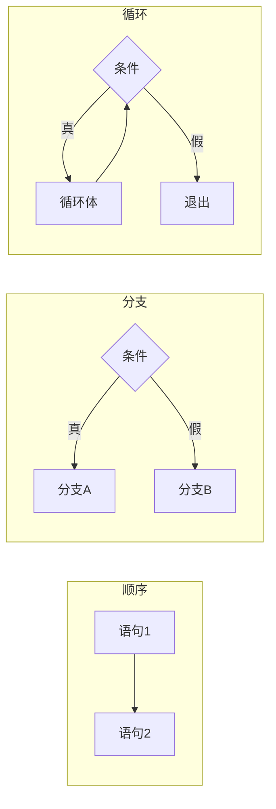

# 第 11 章 · 流程控制

**简体中文** ｜ [English](./11-control-flow.en-US.md)

---

> 程序默认从上往下一行行执行。但真实世界需要"看情况办事"和"重复做事"——于是有了 `if` 和 `for`。
>
> 这一章会揭开一个朴素的真相：**所有的流程控制，底层都只是"跳转"**。`if`、`while`、`for`、`switch` 全是同一件事的不同包装。理解了这点，你会明白为什么 `goto` 曾被视为洪水猛兽，也会明白现代语言的循环语法在替你挡掉什么。

## 1. 学习目标

本章结束后，你将能够：

- 说清流程控制的本质：**条件跳转 + 无条件跳转**；
- 用"顺序、分支、循环"三种结构解释为什么它们足以表达任何程序；
- 说清 `switch` 的穿透行为从哪来、现代语言如何修正它；
- 解释循环中闭包捕获变量的经典陷阱（为什么 `var` 得到 `[3,3,3]`）；
- 理解 SQL 如何用**声明式**表达分支（`CASE`）与循环（递归 CTE）。

---

## 2. 为什么会出现这个概念

CPU 执行完一条指令，默认执行下一条——这叫**顺序执行**。但只有顺序执行的程序几乎没用：它不能判断"分数及格吗"，也不能"把每个学生都处理一遍"。

于是 CPU 提供了**跳转指令**：不去下一条，而是跳到指定位置继续执行。有了跳转，程序就有了"选择"和"重复"的能力。

早期的高级语言把跳转直接暴露成 `goto`：

```text
    if score < 60 goto FAIL
    print "及格"
    goto END
FAIL:
    print "不及格"
END:
```

能用，但代码很快变成一团乱麻——跳来跳去，没人能理清执行路径，人称"**面条式代码**"。

1968 年，Dijkstra 发表了著名的《Go To Statement Considered Harmful》，主张用结构化的控制结构取代裸跳转。而 **Böhm–Jacopini 定理**从理论上证明了：**任何程序都可以只用「顺序、分支、循环」三种结构写出来**，不需要 `goto`。

现代语言的 `if` / `while` / `for`，就是把跳转包装成了这三种可读的结构。

---

## 3. 底层原理

### 一切都是跳转

看 `if` 编译后是什么：

```text
if (score >= 60) { pass(); } else { fail(); }

        ↓ 编译后（示意）

    cmp  score, 60
    jl   ELSE          ← 条件跳转：小于就跳到 ELSE
    call pass
    jmp  END           ← 无条件跳转：跳过 else 分支
ELSE:
    call fail
END:
```

循环也一样，只是跳转方向朝**上**：

```text
while (i < 3) { body(); i++; }

        ↓

LOOP:
    cmp  i, 3
    jge  END           ← 条件不满足就跳出
    call body
    inc  i
    jmp  LOOP          ← 回跳，形成循环
END:
```

**所以 `if` 和 `while` 的区别，只是跳转的方向。**

### 三种基本结构



Böhm–Jacopini 定理说：有这三种就够了。这就是"结构化编程"的理论基础。

### switch 为什么会"穿透"

`switch` 在 C 里的设计是：**`case` 只是一个跳转标签**，跳进去之后就一路往下执行，直到遇到 `break`。所以忘了写 `break` 就会"穿透"到下一个 case。实测（Java）：

```text
switch(1) 且不写 break → 输出「一 二 三」   ← 一路穿透
```

这是 C 的历史遗留（当年为了让多个 case 共享代码），后来被证明是 bug 的温床。现代语言纷纷修正：Go 默认不穿透、C# 强制要求跳出、Java 14+ 引入了不穿透的 `switch` 表达式。

**为什么 `switch` 有时比 `if-else` 快**：当 case 值密集时，编译器会生成**跳转表**——直接用值当索引一次跳到目标，O(1)；而 `if-else` 链要逐个比较，O(n)。

### `for-each` 与迭代器

现代语言普遍提供 `for-each`：

```text
for (item of collection)     ← 你只说"遍历它"
```

它把"取长度、下标累加、边界判断"这些容易出错的细节交给了**迭代器**。这也是"抽象"这条主线的又一次体现——用表达力换控制力。

---

## 4. JavaScript

**分支**：

```javascript
if (score >= 90)      grade = "A";
else if (score >= 60) grade = "B";
else                  grade = "C";

// switch 需要 break，否则穿透
switch (grade) {
  case "A": console.log("优秀"); break;
  case "B": console.log("及格"); break;
  default:  console.log("不及格");
}
```

**循环**：三种 `for` 各有用途，常被混淆：

```javascript
const scores = [92, 75, 50];

for (let i = 0; i < scores.length; i++) { }   // 经典 for
for (const i in scores)  { }                  // in：遍历「键」（"0","1","2"）
for (const s of scores)  { }                  // of：遍历「值」（92,75,50）✓ 常用
scores.forEach((s, i) => { });                // 函数式，但不能 break
```

> ⚠️ **`for...in` 和 `for...of` 是初学者最容易搞混的一对**：`in` 取的是**键名（字符串）**，`of` 取的是**值**。遍历数组几乎总该用 `of`。

**最经典的陷阱——闭包捕获循环变量**（实测）：

```javascript
const fns = [];
for (var i = 0; i < 3; i++) fns.push(() => i);
console.log(fns.map(f => f()));    // [3, 3, 3]  ← 全是 3！

const fns2 = [];
for (let j = 0; j < 3; j++) fns2.push(() => j);
console.log(fns2.map(f => f()));   // [0, 1, 2]  ✓
```

**原因**：`var` 是函数作用域，三个闭包共享**同一个** `i`，循环结束时它已是 3；而 `let` 每轮迭代都会创建一个**新的绑定**。

> **注意事项**：这是"永远用 `let`/`const`、不用 `var`"最有说服力的理由。

---

## 5. Python

**分支**：用缩进表示层级，没有大括号：

```python
if score >= 90:
    grade = "A"
elif score >= 60:      # 注意是 elif，不是 else if
    grade = "B"
else:
    grade = "C"
```

**Python 3.10 起有了 `match`**（结构化模式匹配，比 `switch` 强大得多）：

```python
# 需要 Python 3.10+
match command.split():
    case ["go", direction]:
        move(direction)          # 能解构出变量
    case ["quit"]:
        exit()
    case _:
        print("未知命令")
```

**循环**：Python 只有 `for-each`，没有 C 式的三段 `for`：

```python
for s in scores:            # 直接遍历元素
    print(s)

for i, s in enumerate(scores):   # 需要下标时用 enumerate
    print(i, s)

for i in range(3):          # 需要计数时用 range
    print(i)
```

**Python 独有的 `for-else`**（实测）——`else` 在循环**正常跑完**（没有 `break`）时执行：

```python
for x in items:
    if x == target:
        print("找到了")
        break
else:
    print("循环跑完也没找到")    # 只有没 break 时才执行
```

这在"查找"场景里非常好用，省去了额外的标志变量。

> **注意事项**：`for-else` 的 `else` 读起来像是"否则"，实际含义是"**没有 break 就执行**"。这是 Python 里公认命名不佳但很实用的特性。

---

## 6. Java

**分支**：

```java
if (score >= 90)      grade = "A";
else if (score >= 60) grade = "B";
else                  grade = "C";
```

**Java 14+ 的 `switch` 表达式**修正了穿透问题，是现代 Java 的推荐写法：

```java
// 传统写法：容易忘记 break 而穿透
switch (grade) {
    case "A": System.out.println("优秀"); break;
    case "B": System.out.println("及格"); break;
    default:  System.out.println("不及格");
}

// Java 14+ 表达式写法：不穿透，还能直接返回值 ✓
String msg = switch (grade) {
    case "A" -> "优秀";
    case "B" -> "及格";
    default  -> "不及格";
};
```

**循环**：

```java
for (int i = 0; i < scores.length; i++) { }    // 经典 for
for (int s : scores) { }                       // 增强 for（for-each）✓
scores.forEach(s -> { });                      // Stream 风格（集合上）
```

**带标签的 break**——Java 少见但实用的特性，用于跳出多层循环：

```java
outer:
for (int i = 0; i < 3; i++) {
    for (int j = 0; j < 3; j++) {
        if (target(i, j)) break outer;    // 一次跳出两层
    }
}
```

> **注意事项**：遍历集合时**不要在循环中修改它**，否则抛 `ConcurrentModificationException`。需要删除元素时用 `Iterator.remove()` 或 `removeIf()`。

---

## 7. C++

**分支**：

```cpp
if (score >= 90)      grade = 'A';
else if (score >= 60) grade = 'B';
else                  grade = 'C';

// C++17：if 里可以先声明变量，限制其作用域
if (auto it = m.find(key); it != m.end()) {
    use(it->second);         // it 只在这个 if 里可见
}
```

**循环**：

```cpp
for (int i = 0; i < n; ++i) { }              // 经典 for
for (const auto& s : scores) { }             // 范围 for（C++11）✓ 推荐
while (cond) { }
do { } while (cond);                          // 至少执行一次
```

**C++ 保留了 `goto`**，但唯一还算合理的用途是从深层嵌套中统一跳到清理代码——而现代 C++ 用 **RAII**（第 37 章）就能自动处理，所以 `goto` 基本无需再用。

> **注意事项**：范围 for 用 `const auto&` 可避免每次迭代复制元素；需要修改元素时用 `auto&`。写成 `auto`（无 `&`）会**复制**，对大对象是性能陷阱。

---

## 8. C#

**分支**：C# 的 `switch` **强制要求每个分支跳出**（不写 `break` 直接编译报错），从语言层面消灭了穿透 bug：

```csharp
switch (grade) {
    case "A": Console.WriteLine("优秀"); break;   // 不写 break → 编译错误
    case "B": Console.WriteLine("及格"); break;
    default:  Console.WriteLine("不及格"); break;
}
```

**switch 表达式与模式匹配**（C# 8+，非常强大）：

```csharp
string msg = score switch {
    >= 90 => "优秀",           // 关系模式
    >= 60 => "及格",
    _     => "不及格"
};
```

**循环**：

```csharp
for (int i = 0; i < n; i++) { }
foreach (var s in scores) { }        // ✓ 常用
while (cond) { }
do { } while (cond);
```

> **注意事项**：`foreach` 遍历时集合**不可修改**（会抛 `InvalidOperationException`），这点与 Java 一致。

---

## 9. SQL

SQL 是**声明式**语言，它没有 `if` 语句和 `for` 循环——但同样能表达分支与重复，方式完全不同。

### ① 分支：用 `CASE` 表达式

```sql
SELECT name,
       CASE WHEN score >= 90 THEN 'A'
            WHEN score >= 60 THEN 'B'
            ELSE 'C'
       END AS grade
FROM student;
-- Alice|A   Bob|B   Carol|C
```

注意 `CASE` 是**表达式**而不是语句——它返回一个值，可以出现在 `SELECT`、`WHERE`、`ORDER BY` 里。这与前五种语言的 `if` 语句有本质区别。

### ② 循环：靠集合运算，而不是遍历

SQL 最核心的思想是：**你不需要"遍历每一行"**——`UPDATE` / `SELECT` 天然就作用于整个集合：

```sql
-- 不需要循环，一句话给所有人加分
UPDATE student SET score = score + 5 WHERE score < 60;
```

真正需要"重复"时，用**递归 CTE**（实测）：

```sql
WITH RECURSIVE cnt(x) AS (
    SELECT 1                                  -- 起点
    UNION ALL
    SELECT x + 1 FROM cnt WHERE x < 5         -- 递推，直到条件不满足
)
SELECT group_concat(x) FROM cnt;
-- 输出：1,2,3,4,5
```

递归 CTE 的真实用途是查询**层级数据**（组织架构、评论树、物料清单）。

> ⚠️ **重要的工程提醒**：初学者常写"在应用里循环 + 每轮执行一条 SQL"（所谓 **N+1 查询**），这会让性能下降几个数量级。**正确做法是把循环交给数据库**——用一条作用于集合的 SQL 代替应用层循环。

---

## 10. 五语言横向对比

### ① 语法对比

| 特性 | JavaScript | Python | Java | C++ | C# |
|------|-----------|--------|------|-----|-----|
| 分支 | `if/else if/else` | `if/elif/else` | `if/else if/else` | `if/else if/else` | `if/else if/else` |
| 块的界定 | `{ }` | **缩进** | `{ }` | `{ }` | `{ }` |
| 多分支 | `switch`（会穿透） | `match`（3.10+） | `switch`（14+ 有表达式） | `switch`（会穿透） | `switch`（**强制跳出**） |
| 遍历集合 | `for...of` | `for x in` | `for (T x : c)` | 范围 `for` | `foreach` |
| 计数循环 | `for(;;)` | `for i in range()` | `for(;;)` | `for(;;)` | `for(;;)` |
| 循环-else | ❌ | ✅ **独有** | ❌ | ❌ | ❌ |
| 带标签 break | ✅ | ❌ | ✅ | ❌（用 `goto`） | ✅ `goto` |
| 三元表达式 | `c ? a : b` | `a if c else b` | `c ? a : b` | `c ? a : b` | `c ? a : b` |

### ② `switch` 穿透行为对比

| 语言 | 忘写 break 会怎样 |
|------|------------------|
| C++ / JavaScript / Java（传统写法） | **静默穿透**到下一个 case —— bug 高发 |
| C# | **编译报错**，语言层面禁止 |
| Java 14+ `switch` 表达式 | 用 `->` 语法，不穿透 |
| Python `match`（3.10+） | 不穿透，且支持解构模式 |

### ③ 共同点与差异根源

**共同点**：五门语言都提供顺序、分支、循环三种结构（Böhm–Jacopini 定理的实践），都支持 `break` / `continue`，语义高度一致。

**差异根源**：
- **语法形态**上，只有 Python 用缩进代替大括号——这强制了排版一致，代价是复制粘贴容易出错；
- **`switch` 的演进**清晰地反映了语言设计的进步：从 C 的"跳转标签"（会穿透），到 C# 的强制跳出，再到现代的模式匹配表达式；
- **SQL 完全在另一个维度**：它不遍历，而是描述整个集合的变换。

---

## 11. 底层实现对比

| 语言 · 引擎 | 分支 | 循环 |
|------------|------|------|
| **JavaScript · V8** | 字节码条件跳转；JIT 后为 CPU 分支指令，并做分支预测优化 | 热点循环会被 JIT 编译并可能展开 |
| **Python · CPython** | `POP_JUMP_IF_FALSE` 等字节码，由解释器循环分派 | 每轮迭代都要走一次字节码分派，开销显著 |
| **Java · JVM** | `if_icmpge` 等字节码；JIT 后为原生分支 | JIT 会做循环展开、边界检查消除 |
| **C++ · Native** | 直接生成 `cmp` + `jXX` 指令 | 编译器做循环展开、向量化（SIMD） |
| **C# · CLR** | IL 的 `brtrue`/`brfalse`；JIT 后为原生分支 | 同 Java |

**关于 `switch` 的编译策略**（各语言编译器/JIT 通用）：

| case 值分布 | 编译成 | 复杂度 |
|-----------|--------|--------|
| 密集（如 1,2,3,4） | **跳转表**（用值当索引） | O(1) |
| 稀疏（如 1,100,9999） | 二分查找或比较链 | O(log n) / O(n) |

**分支预测**是现代 CPU 的关键机制：CPU 会猜测分支走向并提前执行，猜错则要清空流水线（代价约 10–20 个周期）。所以**可预测的分支**（例如总是为真）几乎免费，而随机分支很昂贵——这解释了为什么"对已排序数组做条件累加"往往比未排序快得多。

---

## 12. 性能分析

| 操作 | 相对成本 | 说明 |
|------|---------|------|
| 可预测的分支 | ≈ 0 | 分支预测命中，几乎免费 |
| 随机分支 | 10–20 周期 | 预测失败要清空流水线 |
| 跳转表 switch | O(1) | 一次间接跳转 |
| 比较链 if-else | O(n) | 平均比较 n/2 次 |
| Python 循环单次迭代 | 数十倍于 C++ | 字节码分派开销 |

**实践建议**：

```python
# ❌ Python 中手写循环做数值计算
total = 0
for x in data: total += x * 2

# ✅ 交给底层实现（NumPy 的循环在 C 层）
total = (np.array(data) * 2).sum()
```

```sql
-- ❌ 应用层循环 + N 次查询（N+1 问题）
-- ✅ 一条 SQL 作用于整个集合
UPDATE student SET score = score + 5 WHERE score < 60;
```

> **提醒**：把"减少分支"当成日常优化手段通常得不偿失。**先测量**——绝大多数瓶颈在算法复杂度和 I/O，而不在分支。

---

## 13. 工程实践

| 场景 | ✅ 推荐 | ❌ 不推荐 | 原因 |
|------|--------|----------|------|
| 多层嵌套判断 | **卫语句提前返回** | 层层 `if` 嵌套 | 嵌套超过 3 层就很难读 |
| 遍历集合 | `for-of` / `foreach` | 手写下标循环 | 避免 off-by-one 与越界 |
| JavaScript 循环变量 | `let` | `var` | 闭包捕获陷阱 |
| 多分支 | `switch` 表达式 / 模式匹配 | 长 `if-else` 链 | 更清晰，且编译器可优化成跳转表 |
| 遍历时删除元素 | `removeIf` / `Iterator.remove` | 循环里直接删 | 会抛并发修改异常 |
| 数据库操作 | 一条集合 SQL | 应用层循环逐条查 | 避免 N+1 查询 |
| 跳出多层循环 | 带标签 break，或提取成函数用 `return` | 设标志变量层层判断 | 更直白 |

**卫语句示例**——这是可读性收益最大的一条：

```javascript
// ❌ 嵌套地狱
function process(user) {
  if (user) {
    if (user.isActive) {
      if (user.hasPermission) {
        doWork();
      }
    }
  }
}

// ✅ 卫语句：先排除异常情况，主逻辑保持在最外层
function process(user) {
  if (!user) return;
  if (!user.isActive) return;
  if (!user.hasPermission) return;
  doWork();
}
```

---

## 14. 最佳实践

- **优先用 `for-each`**：不需要下标就别写下标，能消灭一整类越界 bug。
- **循环体保持短小**：超过 20 行就考虑提取成函数。
- **别在循环里做重复计算**：把 `for (i = 0; i < list.size(); i++)` 中的 `size()` 提到循环外（若编译器不能自动优化）。
- **循环变量命名有意义**：遍历学生就用 `student` 而不是 `x`；只有纯计数才用 `i`。
- **`switch` 一定写 `default`**：处理意外输入，也让读者知道你考虑过。
- **避免在条件里赋值**：`if (x = 5)` 几乎总是笔误（C++/Java 会警告）。
- **循环条件别用浮点数**：累积误差可能导致次数不对或死循环。

---

## 15. 常见坑

**坑 1 · JavaScript 用 `var` 导致闭包捕获同一变量**

```javascript
for (var i = 0; i < 3; i++) setTimeout(() => console.log(i));  // 3 3 3
for (let j = 0; j < 3; j++) setTimeout(() => console.log(j));  // 0 1 2 ✓
```
**为什么错**：`var` 是函数作用域，所有闭包共享同一个 `i`。
**如何避免**：用 `let`——它每轮迭代创建新绑定。

**坑 2 · `switch` 忘写 `break` 导致穿透**

```java
switch (x) {
    case 1: doA();      // 忘了 break
    case 2: doB();      // x==1 时这里也会执行！
}
```
**如何避免**：用 Java 14+ 的 `switch` 表达式、C# 的强制跳出，或写完 case 立刻补 `break`。

**坑 3 · 遍历集合时修改它**

```java
for (String s : list) {
    if (s.isEmpty()) list.remove(s);   // ConcurrentModificationException
}
list.removeIf(String::isEmpty);        // ✓ 正确写法
```

**坑 4 · off-by-one（差一错误）**

```java
for (int i = 0; i <= arr.length; i++)   // 越界！应该是 <
```
**如何避免**：优先用 `for-each`，从根本上不碰边界。

**坑 5 · `for...in` 与 `for...of` 混淆（JavaScript）**

```javascript
for (const x of [10, 20]) console.log(x);   // 10 20 ✓ 值
for (const x in [10, 20]) console.log(x);   // "0" "1" ← 键名，而且是字符串
```

**坑 6 · Python 缩进错误改变逻辑**

```python
for x in items:
    process(x)
total += 1        # 缩进少一层 → 循环外执行，只加一次
```
**如何避免**：统一用 4 空格，配好编辑器和格式化工具。

**坑 7 · 数据库的 N+1 查询**

```text
❌ 查出 100 个学生，再循环 100 次逐个查成绩 → 101 次查询
✅ 一次 JOIN 查询搞定
```
**为什么错**：每次查询都有网络往返开销，循环放大成几百倍延迟。

---

## 16. 面试题

**基础**

1. `while` 和 `do-while` 有什么区别？各适合什么场景？
2. `break` 和 `continue` 分别做什么？
3. 为什么推荐用 `for-each` 而不是下标循环？

**中级**

4. 解释这段代码为什么输出 `[3,3,3]`，如何修正：
   ```javascript
   const fns = [];
   for (var i = 0; i < 3; i++) fns.push(() => i);
   console.log(fns.map(f => f()));
   ```
5. `switch` 的穿透行为是什么？为什么 C 当初这样设计？现代语言如何修正？
6. Python 的 `for-else` 什么时候执行 `else` 分支？举一个实用场景。

**高级**

7. 编译器什么时候把 `switch` 编译成跳转表，什么时候编译成比较链？为什么？
8. 什么是分支预测？为什么"对已排序数组做条件累加"可能比未排序快得多？
9. 为什么说 `goto` 有害？Böhm–Jacopini 定理说了什么？现代语言中还有 `goto` 的合理用途吗？

---

## 17. 练习

**基础**

1. 用六门语言各写一遍"打印 1 到 100 中的偶数"，分别用计数循环和 for-each（或等价物）。
2. 写一个成绩分级函数（≥90 为 A，≥60 为 B，否则 C），用 `if-else` 和 `switch`/`CASE` 各实现一次。
3. 用卫语句重写一段三层嵌套的 `if`。

**提高**

4. 在 JavaScript 中复现 `var`/`let` 的闭包捕获差异，并用 IIFE 再写一个不用 `let` 的修正版。
5. 用 Python 的 `for-else` 实现"查找元素，找不到时报告"，再用标志变量实现一遍，比较可读性。
6. 用递归 CTE 生成斐波那契数列的前 10 项。

**挑战**

7. 写一个程序对比"有序数组"与"随机数组"上同一条件累加的耗时，用分支预测解释结果差异。
8. 不使用 `break`/`continue`/`return`，只用循环条件重写一段带多重跳出的代码，体会结构化编程的约束与代价。

---

## 18. 本章总结

**一句话总结**：所有流程控制底层都是**跳转**——`if` 是条件跳转，循环是回跳，`switch` 可能被优化成跳转表；结构化编程用"顺序、分支、循环"三种结构取代了裸 `goto`，而 SQL 则用声明式的 `CASE` 与递归 CTE 表达同样的意图。

**核心知识点**

- `if` 和 `while` 的本质区别只是**跳转方向**。
- Böhm–Jacopini 定理：三种基本结构足以表达任何程序，`goto` 并非必需。
- `switch` 的穿透是 C 的遗留设计，C# 强制跳出、Java 14+ 与 Python 3.10+ 用表达式/模式匹配修正。
- **闭包捕获循环变量**是跨语言的经典陷阱，JavaScript 的 `var` 表现得最明显。
- SQL 不遍历——把循环交给数据库，避免 N+1 查询。

**检查清单**

- [ ] 我能说清 `if` 和循环编译后各是什么跳转结构。
- [ ] 我能解释 `switch` 穿透的来历，以及各语言如何修正。
- [ ] 我能解释 `var` 版闭包为什么全输出 3，并写出两种修正方式。
- [ ] 我会用卫语句消除深层嵌套。
- [ ] 我知道什么是 N+1 查询，以及为什么该用集合 SQL 代替应用层循环。

**下一章预告**：流程控制让代码能"选择"和"重复"，但重复的代码块本身该如何复用？调用一个函数时，参数和返回值在内存里经历了什么？递归为什么会栈溢出？这就是第 12 章「函数」。

---

## 19. 延伸阅读

- <a href="https://homepages.cwi.nl/~storm/teaching/reader/Dijkstra68.pdf" target="_blank" rel="noopener">《Go To Statement Considered Harmful》（Dijkstra, 1968）</a> — 塑造了现代流程控制的经典论文，只有两页。
- <a href="https://developer.mozilla.org/en-US/docs/Web/JavaScript/Guide/Loops_and_iteration" target="_blank" rel="noopener">MDN · 循环与迭代</a> — JavaScript 各种循环形式的完整说明。
- <a href="https://docs.python.org/3/tutorial/controlflow.html" target="_blank" rel="noopener">Python 官方教程 · 流程控制</a> — 含 `for-else` 的官方解释。
- <a href="https://peps.python.org/pep-0636/" target="_blank" rel="noopener">PEP 636 · 结构化模式匹配教程</a> — Python 3.10 `match` 语句的官方教程。
- <a href="https://docs.oracle.com/javase/tutorial/java/nutsandbolts/flow.html" target="_blank" rel="noopener">Oracle Java 教程 · 控制流语句</a> — Java 分支与循环的官方说明。
- <a href="https://learn.microsoft.com/en-us/dotnet/csharp/language-reference/statements/selection-statements" target="_blank" rel="noopener">Microsoft Learn · C# 选择语句</a> — 含 `switch` 表达式与模式匹配。
