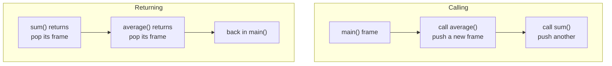
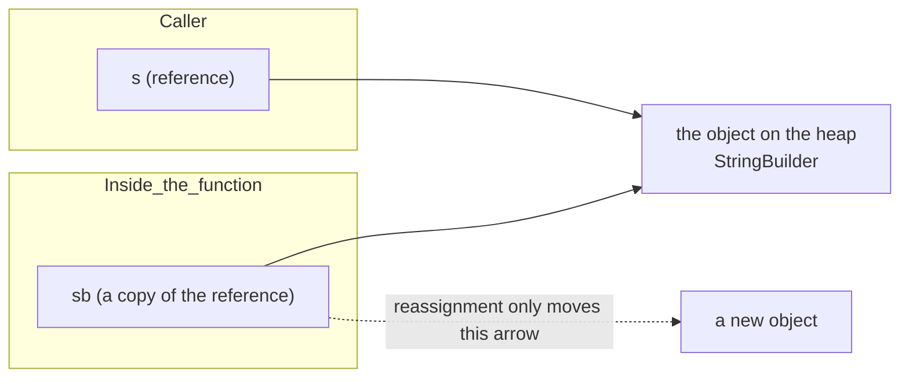

# Chapter 12 · Functions

[简体中文](./12-functions.md) ｜ **English**

---

> Chapter 08 said a variable is **a name for data**. A function is **a name for a piece of logic** — the same abstraction applied along a different dimension.
>
> But functions are about far more than "reusing code." Calling one sets off a precise sequence in memory: push a stack frame, pass arguments, record a return address. Understand that machinery and you can answer three questions almost every interview asks: **Why does recursion overflow the stack? Is Java pass-by-value or pass-by-reference? How does a closure "remember" outer variables?**

## 1. Learning Objectives

By the end of this chapter, you will be able to:

- Describe what happens on the **call stack** during a function call, and why recursion overflows it;
- Explain the truth about **value vs. reference passing** — why Java, Python, and JavaScript are all pass-by-value;
- Distinguish "modifying the object a parameter points to" from "reassigning the parameter," and predict which one the caller sees;
- Explain how a closure "remembers" outer variables and how it differs from an ordinary function;
- Avoid five classic traps, starting with Python's mutable default arguments.

---

## 2. Why This Concept Exists

Suppose you must compute the average score for three classes. Without functions:

```text
Class A: add all the scores, divide by the count
Class B: add all the scores, divide by the count     ← identical logic
Class C: add all the scores, divide by the count     ← again
```

The moment the algorithm changes (say, drop the highest and lowest), you must edit three places — and it's easy to miss one.

Functions solve three problems at once:

1. **Reuse** — write the logic once;
2. **Abstraction** — the caller only needs to know what `average(scores)` does, not how;
3. **Decomposition** — split a big problem into small ones, each function doing one thing.

Historically, early assembly used **subroutines** for reusable jumps, but they had a fatal problem: jumping away is easy — **how do you know where to jump back to?** The answer is this chapter's core: the **call stack**.

---

## 3. How It Works

### The call stack and stack frames

Each function call allocates a block on the **stack** called a **stack frame**. It holds everything this call needs:

```text
A stack frame contains:
├── return address   ← where to jump back when the function ends (crucial!)
├── arguments
├── local variables
└── saved registers
```

Calling and returning is simply **pushing** and **popping** frames:



**The stack is last-in-first-out** — the most recently called function returns first, exactly matching the nesting of calls. That is why the stack data structure (Chapter 18) is everywhere.

### Why recursion overflows the stack

Recursion is a function calling itself, and **each level occupies one frame**. Stack space is finite, so too many levels exhaust it:

| Language | Measured recursion limit | Error |
|----------|:-----------------------:|-------|
| Python | about 998 levels (default limit 1000) | `RecursionError` |
| JavaScript (Node) | about 9155 levels | `RangeError` |

> Python's limit is **set by the language itself** (`sys.getrecursionlimit()`) to give a friendly error before hitting the real system stack; JavaScript hits the engine's actual stack ceiling.

### The truth about parameter passing

This is the chapter's most confusing — and most worthwhile — point. Two definitions first:

- **Pass by value**: the argument's **value is copied** into the parameter. Changing the parameter does not affect the argument.
- **Pass by reference**: the parameter is an **alias** for the argument (the same memory). Changing the parameter *is* changing the argument.

**The key conclusion: Java, Python, JavaScript, and C# (by default) are all pass-by-value.** Only C++'s `int&` and C#'s `ref` are true pass-by-reference.

So why does "passing an object and modifying it inside" affect the outside? Because **what gets copied is the reference itself**. Measured (Java):

```java
static void modify(StringBuilder sb) { sb.append(" modified"); }        // change contents
static void reassign(StringBuilder sb) { sb = new StringBuilder("new"); } // reassign

StringBuilder s = new StringBuilder("original");
modify(s);      // s → "original modified"   ← visible outside
reassign(s);    // s → "original modified"   ← unchanged outside!
```



**Two arrows point at the same object**: follow either arrow to change the object's contents and both sides see it; but pointing the function's arrow elsewhere (reassignment) leaves the caller's arrow untouched.

### Closures: a function plus its captured environment

An ordinary function is discarded once used — its frame pops and is gone. But if a function **references outer variables**, those variables cannot vanish with the frame. Such a function is a **closure**:

```javascript
function counter() {
  let count = 0;            // would normally disappear when counter() returns
  return () => ++count;     // but the inner function still uses it → captured, moved to the heap
}
const c = counter();
c(); c();    // 1, 2 — count was "remembered"
```

A closure is essentially **a function plus the variable environment it captured**. Captured variables move to the heap (rather than the stack), extending their lifetime.

---

## 4. JavaScript

**Functions are first-class citizens** — assignable to variables, passable as arguments, returnable:

```javascript
function average(scores) {                    // function declaration (hoisted)
  return scores.reduce((a, b) => a + b, 0) / scores.length;
}
const avg = function (scores) { };            // function expression
const avg2 = (scores) => scores.length;       // arrow function
```

**Parameters are flexible but loose**:

```javascript
function greet(name = "student", ...rest) {   // default plus rest parameters
  console.log(name, rest);
}
greet();                    // "student" []  ← passing too few is fine
greet("Alice", 1, 2);       // "Alice" [1,2]  ← extras collect into rest
```

> ⚠️ JavaScript has **no function overloading**. A later definition simply replaces an earlier one; distinguishing by argument count is up to you.

**The key difference between arrow and regular functions** — `this` binding:

```javascript
const obj = {
  name: "Alice",
  normal() { return this.name; },        // this refers to obj ✓
  arrow: () => this?.name                // arrow functions don't bind this ✗
};
```

**A closure in practice**:

```javascript
function makeCounter() {
  let count = 0;
  return { inc: () => ++count, get: () => count };
}
```

> **Note**: arrow functions have no `this` or `arguments` of their own and cannot be constructors. Use an arrow function in a callback that needs the outer `this`; use a regular function for object methods.

---

## 5. Python

**Definitions and parameters** — Python's parameter machinery is the most flexible of the six:

```python
def average(scores):
    return sum(scores) / len(scores)

def greet(name="student", *args, **kwargs):   # defaults / varargs / keyword varargs
    print(name, args, kwargs)

greet("Alice", 1, 2, city="Shanghai")         # Alice (1, 2) {'city': 'Shanghai'}
```

**Named arguments make call sites self-documenting**:

```python
create_user(name="Alice", age=20, active=True)   # far clearer than create_user("Alice", 20, True)
```

**⚠️ The most classic trap: mutable default arguments** (measured)

```python
def bad(item, items=[]):        # the default is created ONCE, at definition time!
    items.append(item)
    return items

bad(1)    # [1]
bad(2)    # [1, 2]  ← last call's 1 is still there!
```

**The correct form**:

```python
def good(item, items=None):
    if items is None:
        items = []
    items.append(item)
    return items
```

**Python has no overloading either**, but defaults and `*args` compensate; `functools.singledispatch` provides type-based dispatch.

**Lambdas and higher-order functions**:

```python
scores = [92, 75, 50]
passed = list(filter(lambda s: s >= 60, scores))
doubled = [s * 2 for s in scores]           # a comprehension is usually more Pythonic than map/lambda
```

> **Note**: a Python lambda may contain only **a single expression**, no statements. Use `def` for anything more complex.

---

## 6. Java

**Methods must live inside a class** (Java has no free functions), and **overloading is supported**:

```java
public class MathUtil {
    // Overloading: same name, different parameter lists; resolved at compile time
    static int max(int a, int b) { return a > b ? a : b; }
    static double max(double a, double b) { return a > b ? a : b; }

    // Varargs
    static double average(int... scores) {
        int sum = 0;
        for (int s : scores) sum += s;
        return scores.length == 0 ? 0 : (double) sum / scores.length;
    }
}
```

**Java is always pass-by-value** (shown by measurement in section 3):

```java
static void addOne(int x) { x++; }              // primitive: caller unchanged
static void modify(StringBuilder sb) { sb.append("!"); }   // change contents: caller sees it
static void reassign(StringBuilder sb) { sb = new StringBuilder(); } // reassign: caller unchanged
```

**Lambdas and method references** (Java 8+):

```java
List<Integer> scores = List.of(92, 75, 50);
scores.stream().filter(s -> s >= 60).forEach(System.out::println);
```

> **Note**: Java has **no default parameters**; the usual workaround is **method overloading** — several same-named methods where the shorter one calls the longer one.

---

## 7. C++

**The only one of the six with true pass-by-reference** — its most fundamental difference from the rest:

```cpp
void byValue(int x)      { x = 100; }    // by value: a copy; caller unchanged
void byReference(int& x) { x = 100; }    // by reference: an alias; caller changes ✓
void byPointer(int* x)   { *x = 100; }   // pointer: dereference manually

int n = 5;
byValue(n);      // n is still 5
byReference(n);  // n becomes 100
```

**Pass large objects by `const&`** — a cornerstone of C++ performance practice:

```cpp
void process(const std::vector<int>& data);   // ✓ no copy, and promises not to modify
void process(std::vector<int> data);          // ✗ copies a million elements
```

**Default arguments and overloading are supported**:

```cpp
double average(const std::vector<int>& v, bool skipZero = false);
int  max(int a, int b);
double max(double a, double b);      // overload
```

**Lambdas require an explicit capture list** — making C++ closure semantics more explicit than other languages':

```cpp
int base = 10;
auto addByValue = [base](int x) { return x + base; };   // capture by value (copy)
auto addByRef   = [&base](int x) { return x + base; };  // capture by reference (risky: base must outlive it)
```

> **Note**: a lambda capturing by reference (`[&]`) that runs after the captured variable dies produces a **dangling reference** (undefined behavior). Always capture by value in asynchronous contexts.

---

## 8. C#

**Methods live in classes and support overloading, default parameters, and named arguments** — the best of both worlds:

```csharp
static double Average(int[] scores) => scores.Length == 0 ? 0 : scores.Average();

static void CreateUser(string name, int age = 18, bool active = true) { }
CreateUser("Alice", active: false);        // named argument, skipping a middle default
```

**C# enables reference passing explicitly with `ref` / `out`**:

```csharp
static void AddOne(int x)      { x++; }        // by value
static void AddOne(ref int x)  { x++; }        // by reference (ref required at the call site too)
static bool TryParse(string s, out int result) { ... }   // out: dedicated to "extra return values"

int n = 5;
AddOne(ref n);      // n becomes 6
```

> **Design insight**: C# requires `ref` **at the call site as well**, so a reader immediately sees "this variable may be modified by the call" — more readable than C++'s implicit references.

**Lambdas and local functions**:

```csharp
Func<int, int> square = x => x * x;
int Helper(int x) => x * 2;          // local function: defined inside a method
```

---

## 9. SQL

SQL's "functions" come in three kinds, quite unlike the other five languages.

### ① Built-in functions: scalar and aggregate

```sql
-- Scalar functions: applied to EACH row
SELECT name, UPPER(name), LENGTH(name) FROM student;

-- Aggregate functions: collapse MANY rows into one value — a concept unique to SQL
SELECT COUNT(*), AVG(score), MAX(score) FROM student;
```

**Aggregates are where SQL is most distinctive**: functions in the other five languages process one input per call, while an aggregate naturally operates over a set.

### ② User-defined functions (UDFs)

Syntax varies by database; a standard-ish example:

```sql
-- PostgreSQL
CREATE FUNCTION grade(score INT) RETURNS TEXT AS $$
  SELECT CASE WHEN score >= 90 THEN 'A' WHEN score >= 60 THEN 'B' ELSE 'C' END;
$$ LANGUAGE SQL;

SELECT name, grade(score) FROM student;
```

> ⚠️ **SQLite does not support `CREATE FUNCTION`** — its user-defined functions must be registered by the host program (Python, C, etc.). So this chapter's runnable examples use `CASE` expressions and views to achieve the same effect.

### ③ Functions vs. stored procedures

| | Function | Stored Procedure |
|---|---------|-----------------|
| Must return a value | ✅ | ❌ |
| Usable inside `SELECT` | ✅ | ❌ |
| May modify data | usually restricted | ✅ |
| How it's invoked | `SELECT f(x)` | `CALL p(x)` |

> **Engineering note**: putting complex business logic into stored procedures was once popular but is now generally **discouraged** — hard to version, test, and debug, and it locks logic into one database.

---

## 10. Cross-Language Comparison

### ① Syntax and capabilities

| Feature | JavaScript | Python | Java | C++ | C# |
|---------|-----------|--------|------|-----|-----|
| Free functions (outside classes) | ✅ | ✅ | ❌ must be in a class | ✅ | ❌ (top-level statements exist) |
| Overloading | ❌ | ❌ | ✅ | ✅ | ✅ |
| Default parameters | ✅ | ✅ | ❌ (simulate via overloads) | ✅ | ✅ |
| Named arguments | ❌ (use an object) | ✅ | ❌ | ❌ | ✅ |
| Varargs | `...rest` | `*args` | `int...` | templates / `initializer_list` | `params` |
| First-class functions | ✅ | ✅ | ✅ (lambdas, 8+) | ✅ | ✅ |
| Closures | ✅ | ✅ | ✅ (must be effectively final) | ✅ (explicit capture) | ✅ |
| Multiple return values | via array/object destructuring | ✅ tuples | ❌ (use an object/record) | ✅ `std::tuple` | ✅ tuples / `out` |

### ② Parameter-passing semantics (the most important table)

| Language | Default semantics | Modifying an object's **contents** | **Reassigning** the parameter | True pass-by-reference |
|----------|------------------|:---------------------------------:|:-----------------------------:|:----------------------:|
| JavaScript | by value | visible outside | not visible | ❌ |
| Python | by value (object references) | visible outside (if mutable) | not visible | ❌ |
| Java | **always by value** | visible outside | not visible | ❌ |
| C++ | by value (copy) by default | depends on whether you use a reference | depends | ✅ `T&` |
| C# | by value by default | visible outside | not visible | ✅ `ref` / `out` |

**In one line**: apart from C++'s `&` and C#'s `ref`, everything that "looks like pass-by-reference" is really **passing a copy of a reference**.

### ③ Commonalities and the root of differences

**In common**: all five have functions/methods, support recursion, treat functions as the basic unit of abstraction and reuse, and all now offer lambdas and higher-order functions (a shared trend of the last decade).

**The differences**:
- **Richness of the parameter machinery**: Python/C# are the most flexible (named arguments, defaults), Java the most conservative (compensating with overloads);
- **Whether reference passing is exposed**: only C++ and C# give the programmer that choice — more control, more cognitive load.

---

## 11. Underlying Implementation Comparison

| Language · Engine | Call overhead | Where captured variables live |
|-------------------|--------------|-------------------------------|
| **JavaScript · V8** | heavy while interpreting; hot functions are often **inlined** after JIT, approaching zero | promoted to a heap-allocated Context object |
| **Python · CPython** | every call creates a frame object (`PyFrameObject`) — significant | in cell objects, referenced via `__closure__` |
| **Java · JVM** | bytecodes like `invokevirtual`; the JIT inlines hot small methods | lambdas capture effectively-final values, copied into the object |
| **C++ · Native** | a plain `call` instruction; `inline` or optimization can remove it entirely | determined by the capture list (by value copies; by reference stores a pointer) |
| **C# · CLR** | IL `call`/`callvirt`; JIT inlining | the compiler generates a closure class whose fields are the captured variables |

**Key insight**: calls are not free — at minimum they push, jump, and return. But in C++/Java/C#, **inlining by the compiler or JIT** often erases the cost of small functions entirely, whereas CPython genuinely allocates a frame object per call — the main reason Python calls are comparatively expensive.

---

## 12. Performance Analysis

| Operation | Relative cost | Notes |
|-----------|--------------|-------|
| Inlined C++ call | ≈ 0 | the compiler expands the body in place |
| Ordinary C++/Java/C# call | a few cycles | push + jump + return |
| Python call | tens to hundreds of times more | frame object creation, argument packing |
| Recursion vs. iteration | recursion costs more | a frame per level |

**Practical advice**:

```python
# In Python, prefer built-ins (implemented in C) over hot-loop calls
total = sum(data)                # ✓ the built-in runs at C level
total = 0
for x in data: total += x        # ✗ bytecode dispatch every iteration
```

**Tail recursion**: in theory it can be optimized into a loop (no stack growth), but **Python, Java, and JavaScript engines do not perform tail-call optimization in practice**. So deep recursion must be rewritten iteratively:

```python
# ❌ deep recursion hits RecursionError (measured around 998)
def count(n): return 0 if n == 0 else 1 + count(n - 1)
# ✅ rewrite as a loop
def count(n):
    total = 0
    while n > 0: total, n = total + 1, n - 1
    return total
```

---

## 13. Engineering Practice

| Scenario | ✅ Recommended | ❌ Discouraged | Why |
|----------|---------------|---------------|-----|
| Function responsibility | **one function, one job** | a several-hundred-line function | testable, readable, reusable |
| Parameter count | no more than 3–4 | seven or eight in a row | beyond that, wrap them in an object |
| Boolean parameters | named arguments, or split into two functions | `process(data, true, false)` | unreadable at the call site |
| Python defaults | `None` plus in-function initialization | writing `[]` / `{}` directly | the mutable-default trap |
| Passing large objects in C++ | `const T&` | by value | avoids deep copies |
| Deep recursion | rewrite iteratively or use an explicit stack | relying on tail-call optimization | mainstream languages don't do TCO |
| Side effects | separate "pure computation" from "state change" | compute, mutate, and log all at once | pure functions are testable and concurrency-friendly |
| Return values | exceptions or a result type for errors | returning `-1`/`null` to signal failure | callers forget to check |

**The value of pure functions**: same input always yields the same output, and nothing external is modified. Such functions are inherently testable, cacheable, and parallelizable — functional programming's most practical gift to engineering.

---

## 14. Best Practices

- **Name functions with verbs**: `calculateAverage()` rather than `average2()`; the name should state what it does.
- **Keep them short**: fitting on one screen (roughly 20–30 lines) is a good target.
- **Return early**: use guard clauses (Chapter 11) to flatten nesting.
- **No "magic booleans"**: `setVisible(true)` is tolerable; `process(data, true, true, false)` is not.
- **Put defaults last**, and **never use mutable objects** as default values.
- **One abstraction level per function**: don't mix business rules and SQL string building in the same function.
- **Document side effects explicitly**: if a function modifies an argument, say so in the name or the docs.

---

## 15. Common Pitfalls

**Pitfall 1 · Python's mutable default arguments**

```python
def bad(item, items=[]):     # the default is created once, at definition time
    items.append(item)
    return items
bad(1)    # [1]
bad(2)    # [1, 2]  ← surprise!
```
**Why it's wrong**: the default is evaluated once **when the function is defined**, and every call shares that one list.
**How to avoid**: use `None` as the default and create a new object inside.

**Pitfall 2 · Believing Java is pass-by-reference**

```java
static void reassign(StringBuilder sb) { sb = new StringBuilder("new"); }
StringBuilder s = new StringBuilder("original");
reassign(s);
System.out.println(s);     // still "original" — unchanged outside
```
**Why it's wrong**: what was passed is a **copy of the reference**; reassignment only changes the copy.
**How to avoid**: remember "Java is always pass-by-value"; either modify the object's contents or return a new value.

**Pitfall 3 · Recursion without a base case (or too deep)**

```python
def f(n): return f(n - 1)      # never terminates → RecursionError (measured ~998)
```
**How to avoid**: write the base case first; rewrite deep recursion iteratively.

**Pitfall 4 · A C++ lambda dangling after capturing by reference**

```cpp
std::function<int()> make() {
    int local = 42;
    return [&local]() { return local; };   // ✗ local is gone → undefined behavior
}
```
**How to avoid**: capture **by value** for any lambda that outlives its scope.

**Pitfall 5 · Closures capturing a loop variable** (seen in Chapter 11, here from the function angle)

```javascript
for (var i = 0; i < 3; i++) fns.push(() => i);   // all threes
for (let j = 0; j < 3; j++) fns.push(() => j);   // 0,1,2 ✓
```
**Why it's wrong**: `var` has one binding that every closure shares.

**Pitfall 6 · Forgetting `return`**

```javascript
function grade(s) { if (s >= 60) "passing"; }    // no return → always undefined
```
**How to avoid**: enable a linter; Java/C++/C# compilers reject this outright.

**Pitfall 7 · A function quietly modifying its argument**

```python
def process(items):
    items.sort()          # the caller's list is modified, with nothing in the name to warn them
    return items[0]
```
**How to avoid**: either copy (`items = sorted(items)`) or make it explicit in the name and docs.

---

## 16. Interview Questions

**Basic**

1. Where do a function's parameters and return value live? Why do local variables disappear when it ends?
2. What is recursion? What must every recursive function have?
3. What is the difference between a parameter and an argument?

**Intermediate**

4. **Is Java pass-by-value or pass-by-reference?** Prove your answer with code. (Hint: demonstrate "modify contents" and "reassign" separately.)
5. Explain the cause of Python's mutable-default-argument trap and give the correct form.
6. What is a closure? Where do captured variables live, and why don't they die when the function returns?

**Advanced**

7. Why does recursion overflow the stack? What is tail-call optimization, and why don't Python/Java/JavaScript do it?
8. What makes up the cost of a function call? How does compiler/JIT inlining remove it?
9. Why does a C++ lambda require an explicit capture list while JavaScript does not? What trade-off does this difference reflect?

---

## 17. Exercises

**Basic**

1. Write an `average(scores)` function in each of the six languages, handling empty input.
2. Write factorial recursively, then iteratively, and compare their behavior on large inputs.
3. Rewrite a deeply nested validation function using guard clauses.

**Intermediate**

4. Write a set of overloads in Java or C#, then achieve the same effect with default parameters in Python/JavaScript, and compare the two approaches.
5. Reproduce Python's mutable-default trap, then write the fixed version plus a unit test.
6. Use closures to implement a counter and a "run only once" function (`once`).

**Challenge**

7. Measure the recursion depth limit for each language on your machine and explain why Python's number is far smaller than JavaScript's.
8. Without recursion, implement depth-first traversal of a binary tree using an **explicit stack**, experiencing what it means to simulate the call stack by hand.

---

## 18. Summary

**In one sentence**: a function is **a name for a piece of logic**; calling one pushes a stack frame (return address, arguments, locals) and returning pops it — which explains stack overflow in recursion; and the truth about "value vs. reference" is that **every language here is pass-by-value except C++'s `&` and C#'s `ref` — the value passed just happens to be a copy of a reference**.

**Core takeaways**

- The call stack is the infrastructure of function calls, and the frame's most crucial content is the **return address**.
- Recursion occupies one frame per level, hence a depth limit (measured: ~998 in Python, ~9155 in Node).
- **Java is always pass-by-value**: you can change an object's contents, but reassigning doesn't affect the caller.
- **A closure = a function plus its captured environment**, and captured variables move to the heap to outlive the frame.
- Python's mutable defaults are created **once at definition time** — one of the most classic traps.

**Checklist**

- [ ] I can draw how frames are pushed and popped during a call.
- [ ] I can prove with code that Java is pass-by-value, and explain "modify" vs. "reassign."
- [ ] I can explain stack overflow in recursion and convert deep recursion to iteration.
- [ ] I can say where a closure's captured variables live and why they persist.
- [ ] I can avoid mutable defaults, dangling captures, and the other traps.

**Next chapter**: variables inside a function are invisible outside — that is scope at work. But what exactly are the rules? Why does JavaScript have "hoisting"? Why does Python need `global` to modify an outer variable? That is Chapter 13, "Scope."

---

## 19. Further Reading

- <a href="https://en.wikipedia.org/wiki/Call_stack" target="_blank" rel="noopener">Wikipedia: Call stack</a> — an overview of the call stack and frame layout.
- <a href="https://en.wikipedia.org/wiki/Closure_(computer_programming)" target="_blank" rel="noopener">Wikipedia: Closure</a> — the definition and how various languages implement it.
- <a href="https://developer.mozilla.org/en-US/docs/Web/JavaScript/Guide/Functions" target="_blank" rel="noopener">MDN · Functions</a> — JavaScript functions, arrow functions, and closures in full.
- <a href="https://docs.python.org/3/tutorial/controlflow.html#defining-functions" target="_blank" rel="noopener">The Python Tutorial · Defining Functions</a> — including the official warning about default arguments.
- <a href="https://docs.oracle.com/javase/tutorial/java/javaOO/methods.html" target="_blank" rel="noopener">Oracle Java Tutorial · Methods</a> — definitions, overloading, and parameter passing.
- <a href="https://en.cppreference.com/w/cpp/language/functions" target="_blank" rel="noopener">cppreference · Functions</a> — C++ parameter passing, default arguments, and overload resolution.
- <a href="https://learn.microsoft.com/en-us/dotnet/csharp/programming-guide/classes-and-structs/methods" target="_blank" rel="noopener">Microsoft Learn · C# Methods</a> — including `ref` / `out` and named arguments.
