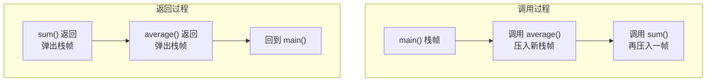
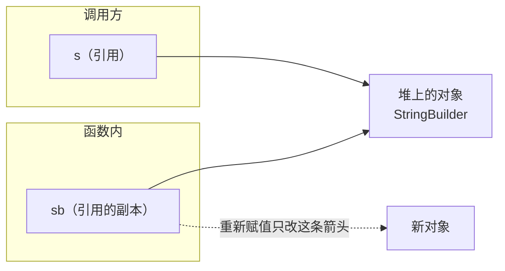

# 第 12 章 · 函数

**简体中文** ｜ [English](./12-functions.en-US.md)

---

> 第 08 章我们说，变量是**给数据起名字**。这一章的函数，则是**给一段逻辑起名字**——两者是同一种抽象在不同维度上的体现。
>
> 但函数的故事远不止"复用代码"。调用一个函数时，内存里会发生一整套精密的动作：压栈帧、传参数、留返回地址。理解了这套机制，你就能回答三个几乎所有面试都会问的问题：**递归为什么会栈溢出？Java 到底是值传递还是引用传递？闭包为什么能"记住"外面的变量？**

## 1. 学习目标

本章结束后，你将能够：

- 说清函数调用时**调用栈**上发生了什么，以及递归为什么会栈溢出；
- 讲清**值传递与引用传递的真相**——为什么说 Java、Python、JavaScript 全都是值传递；
- 区分"修改参数指向的对象"与"重新给参数赋值"，并预测哪种会影响调用方；
- 解释闭包如何"记住"外部变量，以及它与普通函数的区别；
- 避开 Python 可变默认参数等五个经典陷阱。

---

## 2. 为什么会出现这个概念

假设要给三个班计算平均分。没有函数时：

```text
班级A：把所有分数加起来，除以人数
班级B：把所有分数加起来，除以人数     ← 一模一样的逻辑
班级C：把所有分数加起来，除以人数     ← 又一遍
```

一旦算法要改（比如去掉最高最低分），你得改三处，还很容易漏掉一处。

函数解决了三件事：

1. **复用**——同样的逻辑只写一次；
2. **抽象**——调用者只需知道 `average(scores)` 做什么，不必关心怎么做；
3. **分解**——把大问题拆成小问题，每个函数只做一件事。

历史上，早期汇编用**子程序**（subroutine）实现跳转复用，但它有个致命问题：跳过去容易，**怎么知道该跳回哪里**？答案就是本章的核心——**调用栈**。

---

## 3. 底层原理

### 调用栈与栈帧

每次调用函数，系统会在**栈**上分配一块空间，叫**栈帧（stack frame）**。栈帧里装着这次调用所需的一切：

```text
栈帧包含：
├── 返回地址      ← 函数结束后跳回哪里（关键！）
├── 参数
├── 局部变量
└── 保存的寄存器
```

调用与返回的过程，就是栈帧的**压入**与**弹出**：



**栈是后进先出的**——最后调用的函数最先返回，正好匹配函数调用的嵌套结构。这就是第 18 章「栈」这个数据结构无处不在的原因。

### 递归为什么会栈溢出

递归就是函数调用自己，**每一层都要占一个栈帧**。栈空间是有限的，层数太多就会耗尽：

| 语言 | 实测递归深度上限 | 报错 |
|------|:---------------:|------|
| Python | 约 998 层（默认限制 1000） | `RecursionError` |
| JavaScript (Node) | 约 9155 层 | `RangeError` |

> Python 的限制是**语言主动设置的**（`sys.getrecursionlimit()`），为的是在真正撞上系统栈之前给出友好报错；JavaScript 则是撞到引擎的实际栈上限。

### 参数传递的真相

这是本章最容易混淆、也最值得讲清的一点。先定义两个概念：

- **值传递（pass by value）**：把实参的**值复制一份**给形参。改形参不影响实参。
- **引用传递（pass by reference）**：形参是实参的**别名**（同一块内存）。改形参 = 改实参。

**关键结论：Java、Python、JavaScript、C#（默认）全都是值传递。** 只有 C++ 的 `int&` 和 C# 的 `ref` 才是真正的引用传递。

那为什么"传对象进去，在函数里改了，外面也变了"？因为**复制的是引用本身**。实测（Java）：

```java
static void modify(StringBuilder sb) { sb.append(" 被改了"); }        // 改内容
static void reassign(StringBuilder sb) { sb = new StringBuilder("新"); } // 重新赋值

StringBuilder s = new StringBuilder("原始");
modify(s);      // s → "原始 被改了"   ← 外部看得到
reassign(s);    // s → "原始 被改了"   ← 外部没变！
```



**两条箭头指向同一个对象**：所以顺着箭头去改对象内容，双方都看得见；但把函数内的箭头改指向别处（重新赋值），调用方的箭头纹丝不动。

### 闭包：函数 + 它捕获的环境

普通函数用完即弃，栈帧一弹就没了。但如果一个函数**引用了外层的变量**，那些变量就不能随栈帧消失——这样的函数叫**闭包**：

```javascript
function counter() {
  let count = 0;            // 本应随 counter() 返回而消失
  return () => ++count;     // 但内部函数还在用它 → 被捕获，移到堆上
}
const c = counter();
c(); c();    // 1, 2 —— count 被"记住"了
```

闭包的本质是：**函数 + 它捕获的变量环境**。这些被捕获的变量会被移到堆上（而非栈上），生命周期由此延长。

---

## 4. JavaScript

**函数是一等公民**——可以赋值给变量、当参数传、当返回值：

```javascript
function average(scores) {                    // 函数声明（会提升）
  return scores.reduce((a, b) => a + b, 0) / scores.length;
}
const avg = function (scores) { };            // 函数表达式
const avg2 = (scores) => scores.length;       // 箭头函数
```

**参数灵活但也松散**：

```javascript
function greet(name = "同学", ...rest) {      // 默认参数 + 剩余参数
  console.log(name, rest);
}
greet();                    // "同学" []  ← 少传不报错
greet("Alice", 1, 2);       // "Alice" [1,2]  ← 多传收进 rest
```

> ⚠️ JavaScript **没有函数重载**。同名函数后面的会覆盖前面的，靠参数个数区分行为要自己判断。

**箭头函数与普通函数的关键差异**——`this` 的绑定：

```javascript
const obj = {
  name: "Alice",
  normal() { return this.name; },        // this 指向 obj ✓
  arrow: () => this?.name                // 箭头函数不绑定 this ✗
};
```

**闭包应用**：

```javascript
function makeCounter() {
  let count = 0;
  return { inc: () => ++count, get: () => count };
}
```

> **注意事项**：箭头函数没有自己的 `this`、`arguments`，也不能当构造函数。回调里想用外层 `this` 就用箭头函数，定义对象方法则用普通函数。

---

## 5. Python

**定义与参数**——Python 的参数机制是六门语言里最灵活的：

```python
def average(scores):
    return sum(scores) / len(scores)

def greet(name="同学", *args, **kwargs):   # 默认值 / 可变位置参数 / 可变关键字参数
    print(name, args, kwargs)

greet("Alice", 1, 2, city="上海")          # Alice (1, 2) {'city': '上海'}
```

**命名参数让调用处自解释**：

```python
create_user(name="Alice", age=20, active=True)   # 比 create_user("Alice", 20, True) 清晰得多
```

**⚠️ 最经典的陷阱：可变默认参数**（实测）

```python
def bad(item, items=[]):        # 默认值只在「定义时」创建一次！
    items.append(item)
    return items

bad(1)    # [1]
bad(2)    # [1, 2]  ← 上一次的 1 还在！
```

**正确写法**：

```python
def good(item, items=None):
    if items is None:
        items = []
    items.append(item)
    return items
```

**Python 也没有函数重载**，但有默认参数和 `*args` 弥补；`functools.singledispatch` 可实现按类型分派。

**Lambda 与高阶函数**：

```python
scores = [92, 75, 50]
passed = list(filter(lambda s: s >= 60, scores))
doubled = [s * 2 for s in scores]           # 列表推导式通常比 map/lambda 更 Pythonic
```

> **注意事项**：Python 的 lambda 只能写**单个表达式**，不能包含语句。复杂逻辑请用 `def`。

---

## 6. Java

**方法必须写在类里**（Java 没有独立函数），且**支持重载**：

```java
public class MathUtil {
    // 重载：同名不同参数列表，编译期根据参数类型决定调用哪个
    static int max(int a, int b) { return a > b ? a : b; }
    static double max(double a, double b) { return a > b ? a : b; }

    // 可变参数
    static double average(int... scores) {
        int sum = 0;
        for (int s : scores) sum += s;
        return scores.length == 0 ? 0 : (double) sum / scores.length;
    }
}
```

**Java 永远是值传递**（实测已在第 3 节展示）：

```java
static void addOne(int x) { x++; }              // 基本类型：外部不变
static void modify(StringBuilder sb) { sb.append("!"); }   // 改内容：外部可见
static void reassign(StringBuilder sb) { sb = new StringBuilder(); } // 重新赋值：外部不变
```

**Lambda 与方法引用**（Java 8+）：

```java
List<Integer> scores = List.of(92, 75, 50);
scores.stream().filter(s -> s >= 60).forEach(System.out::println);
```

> **注意事项**：Java **没有默认参数**，通常用**方法重载**模拟：写多个同名方法，参数少的那个调用参数多的那个。

---

## 7. C++

**唯一支持真正引用传递的语言**——这是 C++ 与其他五种最本质的差异：

```cpp
void byValue(int x)      { x = 100; }    // 值传递：复制，外部不变
void byReference(int& x) { x = 100; }    // 引用传递：别名，外部会变 ✓
void byPointer(int* x)   { *x = 100; }   // 指针：手动解引用

int n = 5;
byValue(n);      // n 仍是 5
byReference(n);  // n 变成 100
```

**大对象要用 `const&` 传参**，这是 C++ 性能实践的核心之一：

```cpp
void process(const std::vector<int>& data);   // ✓ 不复制，且承诺不修改
void process(std::vector<int> data);          // ✗ 完整复制百万元素
```

**支持默认参数与重载**：

```cpp
double average(const std::vector<int>& v, bool skipZero = false);
int  max(int a, int b);
double max(double a, double b);      // 重载
```

**Lambda 需要显式声明捕获方式**——这让 C++ 的闭包语义比其他语言更明确：

```cpp
int base = 10;
auto addByValue = [base](int x) { return x + base; };   // 按值捕获（复制）
auto addByRef   = [&base](int x) { return x + base; };  // 按引用捕获（危险：base 必须还活着）
```

> **注意事项**：按引用捕获（`[&]`）的 lambda 若在被捕获变量销毁后才执行，会产生**悬垂引用**（未定义行为）。异步场景务必按值捕获。

---

## 8. C#

**方法写在类里，支持重载、默认参数、命名参数**——集各家之长：

```csharp
static double Average(int[] scores) => scores.Length == 0 ? 0 : scores.Average();

static void CreateUser(string name, int age = 18, bool active = true) { }
CreateUser("Alice", active: false);        // 命名参数，可跳过中间的默认参数
```

**C# 用 `ref` / `out` 显式开启引用传递**：

```csharp
static void AddOne(int x)      { x++; }        // 值传递
static void AddOne(ref int x)  { x++; }        // 引用传递（调用处也要写 ref）
static bool TryParse(string s, out int result) { ... }   // out：专用于"额外返回值"

int n = 5;
AddOne(ref n);      // n 变成 6
```

> **设计洞察**：C# 要求**调用处也写 `ref`**，这样读代码时一眼就知道"这个变量可能被函数改掉"——比 C++ 的隐式引用更利于阅读。

**Lambda 与本地函数**：

```csharp
Func<int, int> square = x => x * x;
int Helper(int x) => x * 2;          // 本地函数：定义在方法内部
```

---

## 9. SQL

SQL 的"函数"分三类，与前五种语言的差别很大。

### ① 内置函数：标量函数与聚合函数

```sql
-- 标量函数：作用于「每一行」
SELECT name, UPPER(name), LENGTH(name) FROM student;

-- 聚合函数：把「多行」压缩成一个值 —— 这是 SQL 独有的概念
SELECT COUNT(*), AVG(score), MAX(score) FROM student;
```

**聚合函数是 SQL 最具特色的地方**：前五种语言的函数是"一次调用处理一个输入"，而聚合函数天然作用于一个集合。

### ② 用户自定义函数（UDF）

各数据库语法不同，以标准写法示意：

```sql
-- PostgreSQL
CREATE FUNCTION grade(score INT) RETURNS TEXT AS $$
  SELECT CASE WHEN score >= 90 THEN 'A' WHEN score >= 60 THEN 'B' ELSE 'C' END;
$$ LANGUAGE SQL;

SELECT name, grade(score) FROM student;
```

> ⚠️ **SQLite 不支持 `CREATE FUNCTION`**——它的自定义函数必须由宿主程序（Python/C 等）注册。所以本章的可运行示例改用 `CASE` 表达式与视图来达到同样效果。

### ③ 存储过程 vs 函数

| | 函数（Function） | 存储过程（Procedure） |
|---|---|---|
| 必须返回值 | ✅ | ❌ |
| 能否用在 `SELECT` 中 | ✅ | ❌ |
| 能否修改数据 | 通常受限 | ✅ |
| 调用方式 | `SELECT f(x)` | `CALL p(x)` |

> **工程提醒**：把复杂业务逻辑放进存储过程曾经很流行，但如今普遍**不推荐**——它难以版本管理、难以测试、难以调试，且把逻辑锁死在特定数据库上。

---

## 10. 五语言横向对比

### ① 语法与能力

| 特性 | JavaScript | Python | Java | C++ | C# |
|------|-----------|--------|------|-----|-----|
| 独立函数（不必在类里） | ✅ | ✅ | ❌ 必须在类中 | ✅ | ❌（有顶级语句） |
| 函数重载 | ❌ | ❌ | ✅ | ✅ | ✅ |
| 默认参数 | ✅ | ✅ | ❌（用重载模拟） | ✅ | ✅ |
| 命名参数 | ❌（用对象模拟） | ✅ | ❌ | ❌ | ✅ |
| 可变参数 | `...rest` | `*args` | `int...` | 模板/`initializer_list` | `params` |
| 一等函数 | ✅ | ✅ | ✅（Lambda，8+） | ✅ | ✅ |
| 闭包 | ✅ | ✅ | ✅（须 effectively final） | ✅（须声明捕获） | ✅ |
| 多返回值 | 靠数组/对象解构 | ✅ 元组 | ❌（用对象/记录） | ✅ `std::tuple` | ✅ 元组 / `out` |

### ② 参数传递语义（最重要的一张表）

| 语言 | 默认语义 | 传对象时改**内容** | 传对象时**重新赋值** | 真正的引用传递 |
|------|---------|:----------------:|:-----------------:|:-------------:|
| JavaScript | 值传递 | 外部可见 | 外部不变 | ❌ |
| Python | 值传递（对象引用） | 外部可见（若可变） | 外部不变 | ❌ |
| Java | **永远值传递** | 外部可见 | 外部不变 | ❌ |
| C++ | 默认值传递（复制） | 取决于是否用引用 | 取决于是否用引用 | ✅ `T&` |
| C# | 默认值传递 | 外部可见 | 外部不变 | ✅ `ref` / `out` |

**一句话**：除了 C++ 的 `&` 和 C# 的 `ref`，其余"看起来像引用传递"的现象，本质都是**传了引用的副本**。

### ③ 共同点与差异根源

**共同点**：五门语言都有函数/方法、都支持递归、都把函数当作抽象与复用的基本单位，都提供了 lambda 与高阶函数（近十年的共同演进方向）。

**差异根源**：
- **参数机制的丰富度**：Python/C# 最灵活（命名参数、默认值），Java 最保守（靠重载弥补）；
- **是否暴露引用传递**：只有 C++ 和 C# 给了程序员这个选择——多一分控制，多一分心智负担。

---

## 11. 底层实现对比

| 语言 · 引擎 | 函数调用开销 | 闭包变量存哪 |
|------------|-------------|-------------|
| **JavaScript · V8** | 解释时较重；JIT 后热点函数常被**内联**，开销接近零 | 捕获的变量提升到堆上的 Context 对象 |
| **Python · CPython** | 每次调用都创建栈帧对象（`PyFrameObject`），开销显著 | 存在 cell 对象中，由 `__closure__` 引用 |
| **Java · JVM** | 字节码 `invokevirtual` 等；JIT 会内联热点小方法 | Lambda 捕获的必须是 effectively final，值被复制进对象 |
| **C++ · Native** | 直接 `call` 指令；`inline` 或编译器优化后可完全消除 | 由 lambda 的捕获列表决定（值捕获复制、引用捕获存指针） |
| **C# · CLR** | IL `call`/`callvirt`；JIT 内联 | 编译器生成闭包类，捕获变量成为其字段 |

**关键洞察**：函数调用不是免费的——它至少涉及压栈、跳转、返回。但在 C++/Java/C# 中，**JIT 或编译器的内联优化**常常把小函数的开销完全抹平；而 CPython 每次调用都要真实地创建栈帧对象，这是 Python 函数调用相对昂贵的主因。

---

## 12. 性能分析

| 操作 | 相对成本 | 说明 |
|------|---------|------|
| C++ 内联后的函数调用 | ≈ 0 | 编译器直接把函数体展开 |
| C++/Java/C# 普通调用 | 几个周期 | 压栈 + 跳转 + 返回 |
| Python 函数调用 | 数十到上百倍 | 创建栈帧对象、参数打包 |
| 递归 vs 迭代 | 递归更贵 | 每层都有栈帧开销 |

**实践建议**：

```python
# Python 中，把热点循环里的函数调用内联，或改用内置函数（C 实现）
total = sum(data)                # ✓ 内置函数走 C 层
total = 0
for x in data: total += x        # ✗ 每轮都有字节码分派
```

**尾递归**：理论上可以优化成循环（不增长栈），但**Python、Java、JavaScript 引擎实际都不做尾调用优化**。所以深递归在这些语言里必须改写成迭代：

```python
# ❌ 深递归会 RecursionError（实测约 998 层）
def count(n): return 0 if n == 0 else 1 + count(n - 1)
# ✅ 改成循环
def count(n):
    total = 0
    while n > 0: total, n = total + 1, n - 1
    return total
```

---

## 13. 工程实践

| 场景 | ✅ 推荐 | ❌ 不推荐 | 原因 |
|------|--------|----------|------|
| 函数职责 | **一个函数只做一件事** | 一个函数几百行 | 易测、易读、易复用 |
| 参数个数 | 不超过 3–4 个 | 七八个参数排一排 | 超过就该封装成对象 |
| 布尔参数 | 用命名参数或拆成两个函数 | `process(data, true, false)` | 调用处完全看不懂 |
| Python 默认值 | `None` + 函数内初始化 | 直接写 `[]` / `{}` | 可变默认参数陷阱 |
| C++ 传大对象 | `const T&` | 按值传 | 避免深复制 |
| 深递归 | 改写成迭代或显式栈 | 依赖尾递归优化 | 主流语言都不做 TCO |
| 副作用 | 明确区分"纯计算"与"改状态" | 又算又改还打日志 | 纯函数易测易并发 |
| 返回值 | 出错用异常或结果类型 | 返回 `-1`/`null` 表示错误 | 调用方容易忘记检查 |

**纯函数的价值**：相同输入必得相同输出、不修改外部状态。这样的函数天生易测试、可缓存、可并发——是函数式编程给工程实践最实在的礼物。

---

## 14. 最佳实践

- **函数名用动词**：`calculateAverage()` 而不是 `average2()`；名字应说清"做什么"。
- **保持短小**：一屏放得下（约 20–30 行）是个好目标。
- **早返回**：用卫语句（第 11 章）消除嵌套。
- **参数不要"魔法布尔"**：`setVisible(true)` 尚可，`process(data, true, true, false)` 不可读。
- **默认参数放最后**，且**不要用可变对象**作默认值。
- **一个函数一个抽象层级**：不要在同一个函数里既写业务规则又拼 SQL 字符串。
- **明确文档化副作用**：如果函数会修改传入的对象，一定在文档/命名上说清楚。

---

## 15. 常见坑

**坑 1 · Python 可变默认参数**

```python
def bad(item, items=[]):     # 默认值只在定义时创建一次
    items.append(item)
    return items
bad(1)    # [1]
bad(2)    # [1, 2]  ← 意外！
```
**为什么错**：默认值在**函数定义时**求值一次，之后所有调用共享同一个列表。
**如何避免**：用 `None` 作默认值，在函数内创建新对象。

**坑 2 · 误以为 Java 是引用传递**

```java
static void reassign(StringBuilder sb) { sb = new StringBuilder("新"); }
StringBuilder s = new StringBuilder("原始");
reassign(s);
System.out.println(s);     // 仍是"原始" —— 外部没变
```
**为什么错**：传进去的是**引用的副本**，重新赋值只改副本。
**如何避免**：记住"Java 永远是值传递"；要改就改对象内容，或让函数返回新值。

**坑 3 · 递归没有终止条件（或层数过深）**

```python
def f(n): return f(n - 1)      # 永不终止 → RecursionError（实测约 998 层）
```
**如何避免**：先写终止条件；深递归改写成迭代。

**坑 4 · C++ lambda 按引用捕获后悬垂**

```cpp
std::function<int()> make() {
    int local = 42;
    return [&local]() { return local; };   // ✗ local 已销毁 → 未定义行为
}
```
**如何避免**：跨作用域使用的 lambda 一律**按值捕获**（`[=]` 或显式列出）。

**坑 5 · 闭包捕获循环变量**（第 11 章已见，这里是函数视角）

```javascript
for (var i = 0; i < 3; i++) fns.push(() => i);   // 全是 3
for (let j = 0; j < 3; j++) fns.push(() => j);   // 0,1,2 ✓
```
**为什么错**：`var` 只有一个绑定，所有闭包共享它。

**坑 6 · 忘记 return**

```javascript
function grade(s) { if (s >= 60) "及格"; }    // 忘了 return → 永远返回 undefined
```
**如何避免**：开启 linter；Java/C++/C# 的编译器会直接报错。

**坑 7 · 函数悄悄修改了传入的对象**

```python
def process(items):
    items.sort()          # 调用方的列表被改了，但函数名完全没提示
    return items[0]
```
**如何避免**：要么复制一份 `items = sorted(items)`，要么在函数名/文档中明确说明。

---

## 16. 面试题

**基础**

1. 函数的参数和返回值存放在哪里？为什么函数结束后局部变量就没了？
2. 什么是递归？写递归函数必须注意什么？
3. 形参和实参有什么区别？

**中级**

4. **Java 是值传递还是引用传递？** 请用代码证明你的结论。（提示：分别演示"改内容"与"重新赋值"。）
5. 解释 Python 可变默认参数陷阱的成因，并给出正确写法。
6. 什么是闭包？闭包捕获的变量存在哪里，为什么不会随函数返回而销毁？

**高级**

7. 递归为什么会栈溢出？什么是尾递归优化，为什么 Python/Java/JavaScript 都不做？
8. 函数调用的开销由哪些部分组成？编译器/JIT 的内联优化如何消除它？
9. C++ 的 lambda 为什么要求显式写捕获列表，而 JavaScript 不用？这个设计差异反映了什么取舍？

---

## 17. 练习

**基础**

1. 用六门语言各写一个 `average(scores)` 函数，要求处理空输入。
2. 写一个递归的阶乘函数，再写一个迭代版本，比较两者在大输入下的表现。
3. 用卫语句重写一个多层嵌套的校验函数。

**提高**

4. 在 Java 或 C# 中写一组重载方法，再在 Python/JavaScript 中用默认参数达到同样效果，对比两种方案。
5. 复现 Python 可变默认参数陷阱，并写出修正版与单元测试。
6. 用闭包实现一个计数器和一个"只执行一次"的函数（`once`）。

**挑战**

7. 实测你机器上各语言的递归深度上限，并解释为什么 Python 的数字远小于 JavaScript。
8. 不使用递归，用**显式栈**实现二叉树的深度优先遍历，体会"手动模拟调用栈"的过程。

---

## 18. 本章总结

**一句话总结**：函数是**给一段逻辑起名字**；调用时在栈上压入栈帧（含返回地址、参数、局部变量），返回时弹出——这解释了递归为什么会栈溢出；而"值传递 vs 引用传递"的真相是：**除 C++ 的 `&` 和 C# 的 `ref` 外，其余语言都是值传递，只是传的可能是引用的副本**。

**核心知识点**

- 调用栈是函数调用的基础设施，**栈帧**里最关键的是**返回地址**。
- 递归每层占一个栈帧，所以有深度上限（实测 Python 约 998、Node 约 9155）。
- **Java 永远是值传递**：能改对象内容，但重新赋值不影响调用方。
- **闭包 = 函数 + 捕获的环境**，被捕获的变量会被移到堆上以延长生命周期。
- Python 的可变默认参数只在**定义时**创建一次，是最经典的陷阱之一。

**检查清单**

- [ ] 我能画出函数调用时栈帧的压入与弹出过程。
- [ ] 我能用代码证明 Java 是值传递，并解释"改内容"与"重新赋值"的区别。
- [ ] 我能解释递归栈溢出的原因，并把深递归改写成迭代。
- [ ] 我能说清闭包捕获的变量存在哪里、为什么不会消失。
- [ ] 我能避开可变默认参数、悬垂捕获等陷阱。

**下一章预告**：函数内部的变量在外面看不见，这是"作用域"在起作用。但作用域规则到底是怎样的？为什么 JavaScript 有"提升"？为什么 Python 修改外层变量要写 `global`？这就是第 13 章「作用域」。

---

## 19. 延伸阅读

- <a href="https://en.wikipedia.org/wiki/Call_stack" target="_blank" rel="noopener">Wikipedia：Call stack</a> — 调用栈与栈帧结构的总览。
- <a href="https://en.wikipedia.org/wiki/Closure_(computer_programming)" target="_blank" rel="noopener">Wikipedia：Closure</a> — 闭包的定义与各语言实现方式。
- <a href="https://developer.mozilla.org/en-US/docs/Web/JavaScript/Guide/Functions" target="_blank" rel="noopener">MDN · 函数</a> — JavaScript 函数、箭头函数与闭包的完整说明。
- <a href="https://docs.python.org/3/tutorial/controlflow.html#defining-functions" target="_blank" rel="noopener">Python 官方教程 · 定义函数</a> — 含默认参数陷阱的官方提醒。
- <a href="https://docs.oracle.com/javase/tutorial/java/javaOO/methods.html" target="_blank" rel="noopener">Oracle Java 教程 · 方法</a> — 方法定义、重载与参数传递。
- <a href="https://en.cppreference.com/w/cpp/language/functions" target="_blank" rel="noopener">cppreference · 函数</a> — C++ 参数传递、默认参数与重载解析。
- <a href="https://learn.microsoft.com/en-us/dotnet/csharp/programming-guide/classes-and-structs/methods" target="_blank" rel="noopener">Microsoft Learn · C# 方法</a> — 含 `ref` / `out` 与命名参数。
