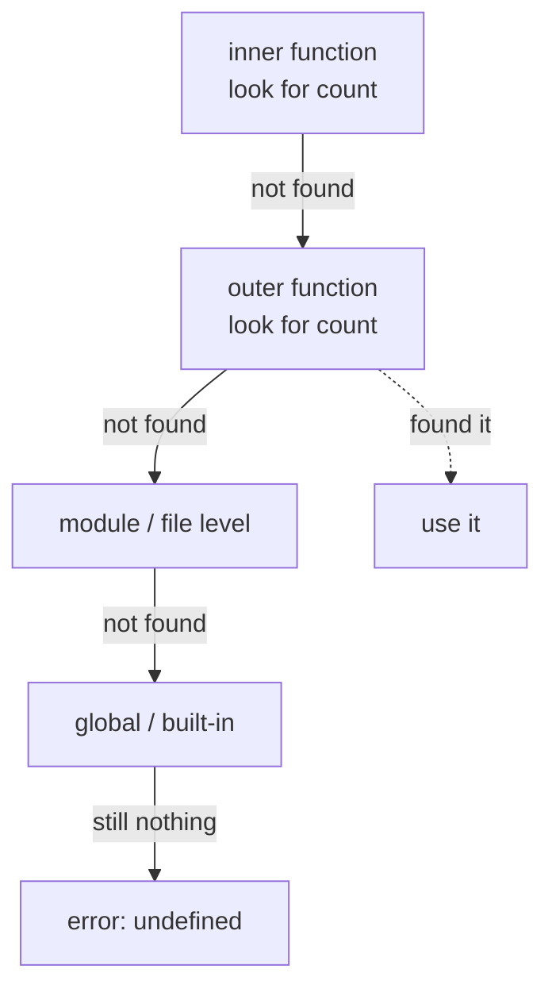

# Chapter 13 · Scope

[简体中文](./13-scope.md) ｜ **English**

---

> The previous chapter showed that a function's local variables vanish when it returns. But the more fundamental question is: **where can a name be seen?**
>
> That is scope. It looks like a mere syntactic rule about "where a variable is usable," yet it determines three big things: **how naming collisions are avoided, why closures work, and why JavaScript has that odd thing called "hoisting."** This chapter is also the final piece for understanding closures (Chapter 12).

## 1. Learning Objectives

By the end of this chapter, you will be able to:

- State what scope really is — **the visibility range of a name** — and how lookup walks outward along the **scope chain**;
- Distinguish **lexical** from **dynamic** scope, and explain why nearly every modern language chose the former;
- Explain JavaScript's **hoisting** and the **temporal dead zone**, and the fundamental difference between `var` and `let`;
- Use the **LEGB rule** to explain Python's lookup order and why `UnboundLocalError` happens;
- Know **which language has no block scope**, and what that implies.

---

## 2. Why This Concept Exists

Imagine a world without scope, where every variable is global:

```text
The program has 500 variables, all sharing one namespace.
You wrote i as a loop counter inside a function,
and another module used i as a counter too…
they overwrite each other, and the program breaks mysteriously.
```

Scope solves three problems:

1. **Avoiding name collisions** — the `i` in different functions don't interfere, so you needn't invent globally unique names;
2. **Information hiding** — a function's internals shouldn't be visible outside; this is **encapsulation** in its smallest form;
3. **Lifetime management** — locals leaving scope can be reclaimed (echoing the frame popping of Chapter 12).

In one line: **scope is the territory assigned to a name.**

---

## 3. How It Works

### Lexical vs. dynamic scope

This is the chapter's most fundamental divide:

- **Lexical (static) scope**: what a name refers to is decided by **where it is written in the code**, determinable at compile time.
- **Dynamic scope**: decided by the **call chain at runtime** — whoever called me supplies the variable.

One snippet makes the difference clear:

```text
x = "global"

function inner()  { print(x) }        ← which x does this refer to?
function outer()  { x = "outer's"; inner() }

outer()
```

- **Lexical scope**: `inner` is written at the global level, so its `x` is **the global one** → prints "global."
- **Dynamic scope**: `inner` was called by `outer`, so it uses **outer's** `x` → prints "outer's."

**Nearly every modern language (including all six here) uses lexical scope**, because it can be resolved at compile time, reads clearly, and optimizes well. Dynamic scope survives only in niches (Emacs Lisp, Bash variables).

### The scope chain: not found? look outward

Nested scopes form a chain. Looking up a name starts at the current level and walks outward:



**This is where closures come from** (Chapter 12): an inner function references an outer variable along the chain, so that variable must outlive the outer function — hence it moves to the heap.

### How compilers handle names

Back to the pipeline of Chapter 03: during **semantic analysis**, the compiler builds a **symbol table** per scope, resolving each name into "level N, slot M." That is why lexical scope can be free — **no lookup by name is needed at runtime** (especially in C++/Java).

Python and JavaScript retain name information at runtime (Chapter 08), which is what makes `eval` and `globals()` possible — at the cost of slower lookup.

### What hoisting really is

JavaScript's "hoisting" is often mystified, but it is simple: **declarations are registered on entering the scope, while assignments stay put.** Measured:

```javascript
console.log(a);   // undefined  ← var is registered but unassigned
var a = 1;

console.log(b);   // ReferenceError: Cannot access 'b' before initialization
let b = 1;
```

`let`/`const` are registered too, but accessing them before assignment throws — that "registered but unusable" interval is the **temporal dead zone (TDZ)**, a protection ES6 added deliberately.

---

## 4. JavaScript

**Three kinds of scope**: global, function, and block (since ES6).

```javascript
let global = "global";

function outer() {
  let fn = "function scope";
  if (true) {
    var v = "var: function-scoped";
    let l = "let: block-scoped";
  }
  console.log(v);      // ✓ var leaked out of the if
  // console.log(l);   // ✗ ReferenceError: let is confined to the block
}
```

**Measured comparison**:

```text
if (true) { var v = ...; let l = ...; }
accessing v outside the block → fine (var leaked out)
accessing l outside the block → ReferenceError (let is confined)
```

**Hoisting and the TDZ** (measured):

| Declaration | Result of early access |
|-------------|-----------------------|
| `var` | `undefined` (registered, unassigned) |
| `let` / `const` | `ReferenceError` (temporal dead zone) |
| `function` declaration | **callable normally** (the whole function is hoisted) |

**Closures and the scope chain**:

```javascript
function makeCounter() {
  let count = 0;                 // captured by the inner function
  return () => ++count;          // references outer count along the scope chain
}
```

> **Note**: assigning without a keyword (`x = 1`) creates an **implicit global** (an error in strict mode). Always declare explicitly, preferring `const`.

---

## 5. Python

**The LEGB rule** — Python's name-lookup order, the heart of this section:

```text
L  Local        inside the current function
E  Enclosing    an enclosing nested function
G  Global       module level
B  Built-in     built-ins (print, len, …)
```

```python
x = "global"                  # G

def outer():
    y = "enclosing"           # E (from inner's perspective)
    def inner():
        z = "local"           # L
        print(z, y, x, len)   # found in L → E → G → B, in that order
    inner()
```

**⚠️ Python has no block scope** — its biggest difference from the other four (measured):

```python
if True:
    inside_if = "defined inside if"
for i in range(3):
    pass

print(inside_if)    # ✓ prints fine; if creates no scope
print(i)            # ✓ prints 2; the loop variable leaks out
```

**Only functions, classes, and modules create scopes**; `if` / `for` / `while` do not.

**Modifying an outer variable requires an explicit declaration** (measured):

```python
x = "global"

def broken():
    print(x)          # ✗ UnboundLocalError!
    x = "local"       # because of this assignment, x is local throughout the function

def fixed():
    global x          # declare that you intend to modify the global
    x = "modified"

def nested():
    y = 1
    def inner():
        nonlocal y    # use nonlocal to modify an enclosing function's variable
        y += 1
    inner()
```

> **The key mechanism**: Python decides which names are local **when it compiles the function** — an assignment **anywhere** in the body makes that name local everywhere in it. That is the cause of `UnboundLocalError` (the deeper explanation of Chapter 08's pitfall 5).

---

## 6. Java

**Strict block scope** — braces are the boundary:

```java
public class Demo {
    static int classField = 1;          // class scope

    static void method() {
        int local = 2;                  // method scope
        if (true) {
            int inside = 3;             // block scope
        }
        // System.out.println(inside);  // ✗ compile error: not visible outside the block
        for (int i = 0; i < 3; i++) { }
        // System.out.println(i);       // ✗ compile error: i lives only inside the for
    }
}
```

**Java forbids shadowing a local with another local** — stricter than JavaScript/C++:

```java
int x = 1;
// int x = 2;      // ✗ compile error: no redeclaration
if (true) {
    // int x = 2;  // ✗ also an error, even in a nested block
}
```

But **fields may be shadowed by locals**, a common source of bugs:

```java
class Student {
    private int score;
    void setScore(int score) {          // the parameter shadows the field
        this.score = score;             // use this to disambiguate
    }
}
```

**Closure restriction**: a lambda may only capture locals that are `final` or **effectively final** (never reassigned):

```java
int count = 0;
Runnable r = () -> System.out.println(count);   // ✓ count is never modified afterwards
// count++;                                     // ✗ adding this makes the line above an error
```

> **Note**: the restriction exists because Java closures **copy the value** rather than capture a reference — allowing modification would make inside and outside disagree. For mutable state, wrap it in an array or `AtomicInteger`.

---

## 7. C++

**Block scope plus the richest set of scope kinds**:

```cpp
int global = 1;                  // global scope

namespace app { int x = 2; }     // namespace scope (Chapter 14)

void f() {
    int local = 3;               // function scope
    {
        int inner = 4;           // block scope
        int local = 5;           // ✓ C++ allows shadowing an outer local (Java doesn't)
        std::cout << local;      // 5 (the inner one)
    }
    std::cout << local;          // 3 (the outer one)
}
```

**The scope resolution operator `::`** names a scope explicitly (echoing the `std::` discussion of Chapter 08):

```cpp
int value = 10;
void g() {
    int value = 20;
    std::cout << value;        // 20 (the local)
    std::cout << ::value;      // 10 (the global) — :: means "the one at global scope"
}
```

**Since C++17 you can declare variables inside `if`/`switch`**, minimizing scope:

```cpp
if (auto it = m.find(key); it != m.end()) {
    use(it->second);          // it is visible only within this if statement
}
```

> **Note**: shadowing is allowed but error-prone. Enabling `-Wshadow` makes the compiler warn about it.

---

## 8. C#

**Block scope, stricter than Java** — C# forbids a local from shadowing an outer local:

```csharp
void Method() {
    int x = 1;
    if (true) {
        // int x = 2;      // ✗ compile error: C# forbids shadowing a local in a nested block
    }
}
```

**Fields can still be shadowed**, disambiguated with `this`:

```csharp
class Student {
    private int score;
    public void SetScore(int score) => this.score = score;
}
```

**C# closures capture the variable itself (a reference), not its value** — unlike Java:

```csharp
int count = 0;
Action print = () => Console.WriteLine(count);
count = 42;
print();        // prints 42 — the variable was captured, not the value at the time
```

> **Design contrast**: Java demands effectively final (capturing a value); C# permits capturing a mutable variable (capturing a reference). C# is more flexible, and for that reason it once had a `foreach` loop-variable capture trap similar to JavaScript's `var` (fixed in C# 5).

---

## 9. SQL

SQL has scope too, but it is governed by **logical execution order** rather than code position — a fundamental difference from the other five.

### ① Execution order decides when names become visible

```text
FROM → WHERE → GROUP BY → HAVING → SELECT → ORDER BY
                                      ↑
                              aliases come into being here
```

So in **standard SQL, `WHERE` cannot see aliases defined in `SELECT`**, while `ORDER BY` can:

```sql
-- standard SQL / PostgreSQL / SQL Server: using the alias in WHERE is an error
SELECT score * 1.1 AS adjusted FROM student WHERE adjusted > 60;   -- ✗

-- correct: repeat the expression, or wrap it in a subquery/CTE
SELECT name, score * 1.1 AS adjusted FROM student WHERE score * 1.1 > 60;   -- ✓
SELECT name, score * 1.1 AS adjusted FROM student ORDER BY adjusted DESC;   -- ✓ ORDER BY is fine
```

> ⚠️ **Measured caveat**: **SQLite and MySQL allow aliases in `WHERE` as an extension** (this chapter's example does run on SQLite), but it is **not portable**. Follow the standard when writing cross-database SQL.

### ② Subquery and CTE scope

```sql
-- A CTE names a query for reuse; its scope is this statement only
WITH passed AS (
    SELECT name, score FROM student WHERE score >= 60
)
SELECT * FROM passed ORDER BY score DESC;
```

**A correlated subquery may reference the outer query's columns** — exactly "scope chain lookup" expressed in SQL:

```sql
SELECT name FROM student s
WHERE score > (SELECT AVG(score) FROM student WHERE class = s.class);
                                                          ↑ references the outer s
```

### ③ Table alias scope

```sql
SELECT s.name, c.title
FROM student s JOIN course c ON s.id = c.student_id;
-- the aliases s and c are visible throughout the statement
```

---

## 10. Cross-Language Comparison

### ① Kinds of scope

| Feature | JavaScript | Python | Java | C++ | C# |
|---------|-----------|--------|------|-----|-----|
| Scope type | lexical | lexical | lexical | lexical | lexical |
| **Block scope** | ✅ (`let`/`const`) | ❌ **none** | ✅ | ✅ | ✅ |
| Function scope | ✅ (`var`) | ✅ | ✅ | ✅ | ✅ |
| Loop variable leaks out | `var` does / `let` doesn't | **yes** | ❌ | ❌ | ❌ |
| Hoisting | ✅ (`var`/function decls) | ❌ | ❌ | ❌ | ❌ |
| Temporal dead zone | ✅ (`let`/`const`) | ❌ | ❌ | ❌ | ❌ |
| May shadow an outer **local** | ✅ | ✅ | ❌ compile error | ✅ | ❌ compile error |
| Declaration needed to modify outer | ❌ | ✅ `global`/`nonlocal` | ❌ | ❌ | ❌ |

### ② Name-lookup rules

| Language | Lookup order |
|----------|-------------|
| JavaScript | current block → outer blocks → function → outer functions → module → global |
| Python | **LEGB**: Local → Enclosing → Global → Built-in |
| Java | block → method → class fields → superclass fields → static imports |
| C++ | block → function → class → namespace → global |
| C# | block → method → class fields → base class → namespace |

### ③ Commonalities and the root of differences

**In common**: all five use **lexical scope**, all follow inside-out lookup, and all use scope for encapsulation and name isolation.

**The differences**:
- **Python has no block scope**, for syntactic simplicity (having chosen indentation, adding block scope would complicate the rules). The price is leaking loop variables and needing `global`/`nonlocal` to write to outer names.
- **JavaScript's hoisting** is a product of its early design; ES6 fixed it with `let`/`const` + TDZ but kept `var` for compatibility.
- **Whether shadowing is allowed** reflects philosophy: Java/C# treat it as a bug source and forbid it; C++/JavaScript leave it to the programmer.

---

## 11. Underlying Implementation Comparison

| Language · Engine | How scope is implemented | Lookup cost |
|-------------------|-------------------------|-------------|
| **JavaScript · V8** | one Environment Record per scope; captured variables are promoted to a heap Context | locals compile to slot indices; cross-scope may walk the chain |
| **Python · CPython** | locals compile to `LOAD_FAST` (array index); globals use `LOAD_GLOBAL` (dict lookup) | **locals fast, globals slow** — a measurable difference |
| **Java · JVM** | resolved at compile time to local-variable-table slots; fields via `getfield` | done at compile time; no runtime lookup |
| **C++ · Native** | fully resolved at compile time to stack offsets (Chapter 08) | **zero cost**; names don't exist at runtime |
| **C# · CLR** | local slots; closures held by a compiler-generated class | resolved at compile time |

**A fact you can exploit directly**: in Python, **local access is significantly faster than global access**, because one is an array index and the other a dict hash lookup. So binding a global function to a local inside a hot loop is a real optimization:

```python
def hot_loop(data):
    local_len = len          # bind the built-in to a local
    for x in data:
        local_len(x)         # one fewer global lookup than len(x)
```

---

## 12. Performance Analysis

| Operation | Relative cost | Notes |
|-----------|--------------|-------|
| Local access in C++/Java/C# | 1 (stack offset) | compile-time resolved, one memory instruction |
| Python local (`LOAD_FAST`) | fast | array index |
| Python global (`LOAD_GLOBAL`) | **~60% slower (measured)**; locals are ~1.6× faster | dict hash lookup |
| JavaScript closure variable | slightly slower than a local | requires touching the Context object |
| Deeply nested scope lookup | grows with depth | walks the chain level by level |

**Practical advice**:

- In Python hot loops, bind frequently used globals (functions, constants) to locals;
- Avoid deeply nested closures — slow and hard to read;
- But these are **micro-optimizations**: measure before acting.

---

## 13. Engineering Practice

| Scenario | ✅ Recommended | ❌ Discouraged | Why |
|----------|---------------|---------------|-----|
| Where to declare | **as close to use as possible** | all at the top of the function | narrows scope, reduces misuse |
| JavaScript declarations | `const` first, `let` when reassigning | `var` | block scope + TDZ is safer |
| Global variables | avoid; if unavoidable, centralize and prefix them | defining globals everywhere | global state is a nightmare for concurrency and testing |
| Modifying outer state in Python | parameters and return values | overusing `global` | explicit data flow is easier to reason about |
| Shadowing | pick a different name | same name inside and out | confusing even where the language allows it |
| C++ | enable `-Wshadow` | default flags | let the compiler catch shadowing |
| Loop variables | declare in the `for` header | declare outside and reuse | confines scope, prevents leakage |
| SQL aliases | follow the standard across databases (no aliases in `WHERE`) | relying on SQLite/MySQL extensions | keeps queries portable |

**The principle of least scope**: **a name's visibility should cover exactly where it is used, and not an inch more.** That is this chapter's most valuable engineering rule.

---

## 14. Best Practices

- **Declare near first use**, a line or two before, rather than all at the top.
- **Prefer immutability**: `const` / `final` sharply reduce the burden of tracking "when did this change?"
- **Avoid implicit globals**: in JavaScript, use strict mode or modules (strict by default).
- **Don't shadow**: even where C++/JavaScript permit it, a different name is better.
- **Use `global` sparingly in Python**: for shared mutable state, prefer a class or explicit parameters.
- **Capture only what you need in closures**: in C++, write the capture list explicitly (`[count]` rather than `[&]`) for clearer, safer intent.

---

## 15. Common Pitfalls

**Pitfall 1 · Python's `UnboundLocalError`**

```python
x = 10
def f():
    print(x)      # ✗ UnboundLocalError
    x = 20        # this very line makes x local throughout the function
```
**Why it's wrong**: Python fixes locals when compiling the function; an assignment anywhere claims the name.
**How to avoid**: don't assign if you only read; use `global` for globals and `nonlocal` for enclosing variables.

**Pitfall 2 · Python loop variables leak**

```python
for i in range(3):
    pass
print(i)         # 2 — i still exists after the loop
```
**Why it's wrong**: Python has no block scope.
**How to avoid**: don't accidentally reuse `i` afterwards; `del i` or wrap in a function if needed.

**Pitfall 3 · JavaScript's TDZ**

```javascript
console.log(x);   // ReferenceError: Cannot access 'x' before initialization
let x = 1;
```
**How to avoid**: declare before use — good practice anyway; the TDZ merely enforces it.

**Pitfall 4 · Implicit globals**

```javascript
function f() { count = 1; }    // forgot let → creates a global (an error in strict mode)
```
**How to avoid**: use modules (strict by default) or an explicit `"use strict"`.

**Pitfall 5 · A parameter shadows a field and `this` is forgotten**

```java
class Student {
    private int score;
    void setScore(int score) {
        score = score;          // ✗ assigns to itself; the field never changes!
        this.score = score;     // ✓ correct
    }
}
```

**Pitfall 6 · A Java lambda capturing a non-effectively-final variable**

```java
int count = 0;
Runnable r = () -> System.out.println(count);
count++;      // ✗ adding this makes the line above a compile error
```
**How to avoid**: wrap mutable state in an array or `AtomicInteger`.

**Pitfall 7 · Using a `SELECT` alias in `WHERE`**

```sql
SELECT score * 1.1 AS adjusted FROM student WHERE adjusted > 60;
```
**Why it's wrong**: in logical order `WHERE` precedes `SELECT`, so the alias does not yet exist in standard SQL.
**How to avoid**: repeat the expression, or wrap it in a subquery/CTE. (SQLite/MySQL allow it, but it isn't portable.)

---

## 16. Interview Questions

**Basic**

1. What is scope? Why can't a function's variables be accessed from outside?
2. What are the dangers of global variables?
3. How do `let` and `var` differ in scope?

**Intermediate**

4. Explain JavaScript hoisting and the temporal dead zone. Why does early access to `var` yield `undefined` while `let` throws?
5. What is Python's LEGB rule? Explain why this raises `UnboundLocalError`:
   ```python
   x = 10
   def f():
       print(x)
       x = 20
   ```
6. Which language has no block scope? What consequences follow?

**Advanced**

7. What is the difference between lexical and dynamic scope? Why do modern languages almost all choose lexical?
8. Explain from the implementation why Python's local access is faster than global. (Hint: `LOAD_FAST` vs `LOAD_GLOBAL`.)
9. How do closures cooperate with the scope chain? Why must captured variables move from the stack to the heap?

---

## 17. Exercises

**Basic**

1. In each of the six languages, write code showing whether a variable declared inside a block is visible outside, and record the differences.
2. Write JavaScript demonstrating hoisting and the TDZ with `var` and `let`.
3. Reproduce Python's `UnboundLocalError`, then fix it twice: with `global`, and by switching to parameters and return values.

**Intermediate**

4. Use a closure to implement a "private variable" that is inaccessible from outside and manipulable only via returned methods.
5. Measure the performance difference between local and global access in Python (with `timeit`) and explain the result.
6. Write C++ demonstrating shadowing, then compile with `-Wshadow` and observe the warning.

**Challenge**

7. Write a correlated subquery in SQL to find students scoring above their own class's average, and explain how the inner query references the outer columns.
8. Implement a simple scope-chain resolver: given nested scope definitions and one variable lookup, print which level it resolves to (simulating section 3).

---

## 18. Summary

**In one sentence**: scope is **the visibility range of a name**; all six languages use **lexical scope** (decided by code position, known at compile time) and look names up **from the inside out along the scope chain** — their disagreements cluster in three places: **whether block scope exists** (Python's doesn't), **whether hoisting exists** (only JavaScript), and **whether modifying an outer variable needs a declaration** (only Python).

**Core takeaways**

- Lexical scope = where the code is written; dynamic scope = who called it. Modern languages choose the former almost universally.
- **Python has no block scope**: `if`/`for` create none, so loop variables leak.
- **JavaScript hoisting**: early `var` access yields `undefined`; `let`/`const` sit in the TDZ and throw.
- **Python's LEGB**: Local → Enclosing → Global → Built-in; an assignment inside a function makes the name local throughout.
- Closures work precisely because an inner function references outer variables along the chain, forcing them onto the heap.

**Checklist**

- [ ] I can explain lexical vs. dynamic scope and why modern languages chose the former.
- [ ] I can draw the scope-chain lookup process and relate it to closures.
- [ ] I can explain how `var` and `let` differ regarding hoisting and the TDZ.
- [ ] I can explain `UnboundLocalError` via LEGB and give two fixes.
- [ ] I know which language lacks block scope and the pitfalls that follow.

**Next chapter**: scope solves naming within one file — but with hundreds of files in a project, how do you organize code, avoid cross-file collisions, and reuse other people's libraries? That is Chapter 14, "Modules."

---

## 19. Further Reading

- <a href="https://en.wikipedia.org/wiki/Scope_(computer_science)" target="_blank" rel="noopener">Wikipedia: Scope (computer science)</a> — a full comparison of lexical and dynamic scope.
- <a href="https://developer.mozilla.org/en-US/docs/Glossary/Hoisting" target="_blank" rel="noopener">MDN · Hoisting</a> — the authoritative account of JavaScript hoisting.
- <a href="https://developer.mozilla.org/en-US/docs/Web/JavaScript/Guide/Closures" target="_blank" rel="noopener">MDN · Closures</a> — how closures relate to the scope chain.
- <a href="https://docs.python.org/3/reference/executionmodel.html#naming-and-binding" target="_blank" rel="noopener">The Python Language Reference · Naming and binding</a> — the normative definition of LEGB, `global`, and `nonlocal`.
- <a href="https://docs.oracle.com/javase/tutorial/java/javaOO/variables.html" target="_blank" rel="noopener">Oracle Java Tutorial · Variables</a> — the scope of each kind of Java variable.
- <a href="https://en.cppreference.com/w/cpp/language/scope" target="_blank" rel="noopener">cppreference · Scope</a> — C++ scope kinds and name-lookup rules.
- <a href="https://learn.microsoft.com/en-us/dotnet/csharp/language-reference/language-specification/basic-concepts" target="_blank" rel="noopener">The C# Language Specification · Basic concepts</a> — the normative definition of declarations and scopes.
