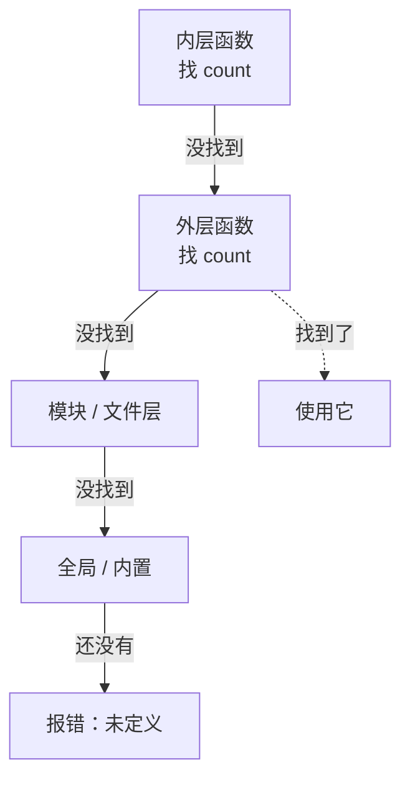

# 第 13 章 · 作用域

**简体中文** ｜ [English](./13-scope.en-US.md)

---

> 上一章我们看到，函数内的局部变量在函数返回后就消失了。但更根本的问题是：**一个名字，在哪些地方能被看见？**
>
> 这就是作用域。它看似只是"变量在哪儿可用"的语法规则，实则决定了三件大事：**命名冲突怎么避免、闭包为什么能工作、以及为什么 JavaScript 会有"提升"这种怪现象**。这一章也是理解闭包（第 12 章）的最后一块拼图。

## 1. 学习目标

本章结束后，你将能够：

- 说清作用域的本质：**名字的可见范围**，以及查找失败时如何沿**作用域链**向外找；
- 区分**词法作用域**与**动态作用域**，并说明为什么现代语言几乎都选前者；
- 解释 JavaScript 的**提升**与**暂时性死区**，说清 `var` 与 `let` 的根本区别；
- 用 **LEGB 规则**解释 Python 的查找顺序，以及 `UnboundLocalError` 为何发生；
- 知道**哪门语言没有块作用域**，以及这会带来什么影响。

---

## 2. 为什么会出现这个概念

想象一个没有作用域的世界——所有变量都是全局的：

```text
程序里有 500 个变量，全部共享一个名字空间。
你在函数里写了 i 做循环计数，
结果另一个模块也用 i 做计数……
两边互相覆盖，程序莫名其妙地错了。
```

作用域解决三个问题：

1. **避免命名冲突**——不同函数里的 `i` 互不干扰，你不必为每个变量想全局唯一的名字；
2. **信息隐藏**——函数的内部变量不该被外界看见，这是**封装**的最小形式；
3. **生命周期管理**——离开作用域的局部变量可以被回收（呼应第 12 章的栈帧弹出）。

一句话：**作用域是给名字划定的"势力范围"。**

---

## 3. 底层原理

### 词法作用域 vs 动态作用域

这是本章最根本的分野：

- **词法作用域（Lexical / Static Scope）**：一个名字指向谁，由它在**代码中的书写位置**决定，编译时就能确定。
- **动态作用域（Dynamic Scope）**：由**运行时的调用链**决定——谁调用了我，就用谁的变量。

用一段代码看清区别：

```text
x = "全局"

function inner()  { print(x) }        ← 这里的 x 指谁？
function outer()  { x = "outer 的"; inner() }

outer()
```

- **词法作用域**：`inner` 写在全局层，所以它的 `x` 就是**全局的那个** → 打印"全局"。
- **动态作用域**：`inner` 是被 `outer` 调用的，所以用 **outer 的** `x` → 打印"outer 的"。

**几乎所有现代语言（包括本书六门）都采用词法作用域**，因为它可以在编译期确定、可读性强、便于优化。动态作用域只在少数场景保留（如 Emacs Lisp、Bash 变量）。

### 作用域链：找不到就往外找

嵌套的作用域构成一条链。查找一个名字时，从当前层开始，逐层向外：



**闭包的原理就藏在这里**（第 12 章）：内层函数沿作用域链引用了外层变量，于是那个变量必须活得比外层函数更久——所以它被移到了堆上。

### 编译器怎么处理名字

回到第 03 章的编译流水线：在**语义分析**阶段，编译器为每层作用域建一张**符号表**，把名字解析成"第几层的第几个槽位"。这就是为什么词法作用域可以零成本——**运行时不需要按名字查找**（C++/Java 尤其如此）。

而 Python、JavaScript 保留了运行时的名字信息（第 08 章），所以才可能有 `eval`、`globals()` 这类动态能力——代价是查找更慢。

### 提升（Hoisting）的本质

JavaScript 的"提升"常被说得很玄，其实很简单：**声明在进入作用域时就已登记，但赋值还留在原地**。实测：

```javascript
console.log(a);   // undefined  ← var 已登记但未赋值
var a = 1;

console.log(b);   // ReferenceError: Cannot access 'b' before initialization
let b = 1;
```

`let`/`const` 同样会被登记，但在赋值之前访问会直接报错——这段"已登记但不可用"的区间叫**暂时性死区（TDZ）**。它是 ES6 有意加入的保护机制。

---

## 4. JavaScript

**三种作用域**：全局、函数、块（ES6 起）。

```javascript
let global = "全局";

function outer() {
  let fn = "函数作用域";
  if (true) {
    var v = "var：函数作用域";
    let l = "let：块作用域";
  }
  console.log(v);      // ✓ var 泄漏到 if 外面
  // console.log(l);   // ✗ ReferenceError：let 被块限制
}
```

**实测对比**：

```text
if (true) { var v = ...; let l = ...; }
块外访问 v → 正常（var 泄漏出来了）
块外访问 l → ReferenceError（let 被块限制）
```

**提升与 TDZ**（实测）：

| 声明方式 | 提前访问的结果 |
|---------|--------------|
| `var` | `undefined`（已登记未赋值） |
| `let` / `const` | `ReferenceError`（暂时性死区） |
| `function` 声明 | **可以正常调用**（整个函数被提升） |

**闭包与作用域链**：

```javascript
function makeCounter() {
  let count = 0;                 // 被内层函数捕获
  return () => ++count;          // 沿作用域链引用外层的 count
}
```

> **注意事项**：不写声明关键字直接赋值（`x = 1`）会创建**隐式全局变量**（严格模式下报错）。永远显式声明，并优先用 `const`。

---

## 5. Python

**LEGB 规则**——Python 的名字查找顺序，是本节的核心：

```text
L  Local        当前函数内
E  Enclosing    外层嵌套函数
G  Global       模块层
B  Built-in     内置（print、len 等）
```

```python
x = "全局"                    # G

def outer():
    y = "外层"                # E（对 inner 而言）
    def inner():
        z = "局部"            # L
        print(z, y, x, len)   # 依次在 L → E → G → B 中找到
    inner()
```

**⚠️ Python 没有块作用域**——这是它与其他四门语言最大的差异（实测）：

```python
if True:
    inside_if = "if 里定义的"
for i in range(3):
    pass

print(inside_if)    # ✓ 正常输出，if 不产生作用域
print(i)            # ✓ 输出 2，循环变量泄漏到循环外
```

**只有函数、类、模块才产生作用域**，`if` / `for` / `while` 都不会。

**修改外层变量必须显式声明**（实测）：

```python
x = "全局"

def broken():
    print(x)          # ✗ UnboundLocalError！
    x = "局部"        # 因为这一行赋值，x 在整个函数内都被视为局部变量

def fixed():
    global x          # 显式声明要修改全局变量
    x = "被修改了"

def nested():
    y = 1
    def inner():
        nonlocal y    # 修改外层函数的变量用 nonlocal
        y += 1
    inner()
```

> **关键机制**：Python 在**编译函数时**就静态决定了哪些名字是局部的——函数体内**任何位置**有赋值，该名字在整个函数内都是局部的。这正是 `UnboundLocalError` 的成因（第 08 章坑 5 的深层解释）。

---

## 6. Java

**块作用域严格**——大括号就是边界：

```java
public class Demo {
    static int classField = 1;          // 类作用域

    static void method() {
        int local = 2;                  // 方法作用域
        if (true) {
            int inside = 3;             // 块作用域
        }
        // System.out.println(inside);  // ✗ 编译错误：块外不可见
        for (int i = 0; i < 3; i++) { }
        // System.out.println(i);       // ✗ 编译错误：i 只在 for 内
    }
}
```

**Java 禁止局部变量遮蔽同名局部变量**——这是它比 JavaScript/C++ 更严格的地方：

```java
int x = 1;
// int x = 2;      // ✗ 编译错误：不允许重复声明
if (true) {
    // int x = 2;  // ✗ 同样报错（内层块也不行）
}
```

但**字段可以被局部变量遮蔽**，这是常见来源：

```java
class Student {
    private int score;
    void setScore(int score) {          // 参数遮蔽了字段
        this.score = score;             // 必须用 this 区分
    }
}
```

**闭包限制**：Lambda 捕获的局部变量必须是 `final` 或 **effectively final**（事实上不再改变）：

```java
int count = 0;
Runnable r = () -> System.out.println(count);   // ✓ count 之后不再修改
// count++;                                     // ✗ 加上这行则上面报错
```

> **注意事项**：这个限制源于 Java 的闭包**复制值**而非捕获引用——若允许修改，内外就会不一致。想要可变状态请用数组或 `AtomicInteger` 包装。

---

## 7. C++

**块作用域 + 最丰富的作用域种类**：

```cpp
int global = 1;                  // 全局作用域

namespace app { int x = 2; }     // 命名空间作用域（第 14 章详述）

void f() {
    int local = 3;               // 函数作用域
    {
        int inner = 4;           // 块作用域
        int local = 5;           // ✓ C++ 允许遮蔽外层同名变量（Java 不允许）
        std::cout << local;      // 5（内层的）
    }
    std::cout << local;          // 3（外层的）
}
```

**作用域解析运算符 `::`** 可以显式指定作用域（呼应第 08 章讨论过的 `std::`）：

```cpp
int value = 10;
void g() {
    int value = 20;
    std::cout << value;        // 20（局部）
    std::cout << ::value;      // 10（全局）—— :: 表示"全局作用域的那个"
}
```

**C++17 起可在 `if`/`switch` 中声明变量**，把作用域限制到最小：

```cpp
if (auto it = m.find(key); it != m.end()) {
    use(it->second);          // it 只在这个 if 语句中可见
}
```

> **注意事项**：C++ 允许遮蔽，虽灵活但易错。开启 `-Wshadow` 编译选项可以让编译器在遮蔽时警告。

---

## 8. C#

**块作用域，且比 Java 更严格**——C# 禁止局部变量与外层局部变量重名：

```csharp
void Method() {
    int x = 1;
    if (true) {
        // int x = 2;      // ✗ 编译错误：C# 不允许在嵌套块中遮蔽局部变量
    }
}
```

**字段仍可被遮蔽**，同样用 `this` 区分：

```csharp
class Student {
    private int score;
    public void SetScore(int score) => this.score = score;
}
```

**C# 的闭包捕获的是变量本身（引用），不是值**——这与 Java 不同：

```csharp
int count = 0;
Action print = () => Console.WriteLine(count);
count = 42;
print();        // 输出 42 —— 捕获的是变量，不是当时的值
```

> **设计对比**：Java 要求 effectively final（捕获值），C# 允许捕获可变变量（捕获引用）。C# 更灵活，但也因此在 C# 5 之前有过和 JavaScript `var` 类似的 `foreach` 循环变量捕获陷阱（C# 5 起已修正）。

---

## 9. SQL

SQL 也有作用域概念，但它由**逻辑执行顺序**决定，而非代码位置——这是它与前五种语言的根本差异。

### ① 逻辑执行顺序决定了名字何时可见

```text
FROM → WHERE → GROUP BY → HAVING → SELECT → ORDER BY
                                      ↑
                              别名在这一步才产生
```

所以**标准 SQL 中，`WHERE` 看不到 `SELECT` 里定义的别名**，而 `ORDER BY` 可以：

```sql
-- 标准 SQL / PostgreSQL / SQL Server：WHERE 中用别名会报错
SELECT score * 1.1 AS adjusted FROM student WHERE adjusted > 60;   -- ✗

-- 正确写法：重复表达式，或用子查询/CTE 包一层
SELECT name, score * 1.1 AS adjusted FROM student WHERE score * 1.1 > 60;   -- ✓
SELECT name, score * 1.1 AS adjusted FROM student ORDER BY adjusted DESC;   -- ✓ ORDER BY 可以
```

> ⚠️ **实测提醒**：**SQLite 和 MySQL 作为扩展允许在 `WHERE` 中使用别名**（本章示例在 SQLite 上确实能跑通），但这**不可移植**。写跨数据库的 SQL 时，请遵守标准。

### ② 子查询与 CTE 的作用域

```sql
-- CTE：相当于给一个查询起名字，后续可复用（作用域限于本条语句）
WITH passed AS (
    SELECT name, score FROM student WHERE score >= 60
)
SELECT * FROM passed ORDER BY score DESC;
```

**相关子查询可以引用外层的列**——这正是"作用域链向外查找"在 SQL 中的体现：

```sql
SELECT name FROM student s
WHERE score > (SELECT AVG(score) FROM student WHERE class = s.class);
                                                          ↑ 引用了外层的 s
```

### ③ 表别名的作用域

```sql
SELECT s.name, c.title
FROM student s JOIN course c ON s.id = c.student_id;
-- 别名 s、c 在整条语句中可见
```

---

## 10. 五语言横向对比

### ① 作用域种类

| 特性 | JavaScript | Python | Java | C++ | C# |
|------|-----------|--------|------|-----|-----|
| 作用域类型 | 词法 | 词法 | 词法 | 词法 | 词法 |
| **块作用域** | ✅（`let`/`const`） | ❌ **没有** | ✅ | ✅ | ✅ |
| 函数作用域 | ✅（`var`） | ✅ | ✅ | ✅ | ✅ |
| 循环变量泄漏到循环外 | `var` 会 / `let` 不会 | **会** | ❌ | ❌ | ❌ |
| 提升 | ✅（`var`/函数声明） | ❌ | ❌ | ❌ | ❌ |
| 暂时性死区 | ✅（`let`/`const`） | ❌ | ❌ | ❌ | ❌ |
| 允许遮蔽外层**局部**变量 | ✅ | ✅ | ❌ 编译错误 | ✅ | ❌ 编译错误 |
| 修改外层变量需声明 | ❌ | ✅ `global`/`nonlocal` | ❌ | ❌ | ❌ |

### ② 名字查找规则对照

| 语言 | 查找顺序 |
|------|---------|
| JavaScript | 当前块 → 外层块 → 函数 → 外层函数 → 模块 → 全局 |
| Python | **LEGB**：Local → Enclosing → Global → Built-in |
| Java | 块 → 方法 → 类字段 → 父类字段 → 静态导入 |
| C++ | 块 → 函数 → 类 → 命名空间 → 全局 |
| C# | 块 → 方法 → 类字段 → 基类 → 命名空间 |

### ③ 共同点与差异根源

**共同点**：五门语言全部采用**词法作用域**，都遵循"由内向外"的查找规则，都用作用域实现封装与命名隔离。

**差异根源**：
- **Python 没有块作用域**，是为了语法简洁（既然用缩进，再引入块作用域会让规则复杂）。代价是循环变量泄漏，以及必须用 `global`/`nonlocal` 显式声明写操作。
- **JavaScript 的提升**是早期设计的产物；ES6 用 `let`/`const` + TDZ 修正，但为兼容保留了 `var`。
- **是否允许遮蔽**反映了设计哲学：Java/C# 认为遮蔽是错误来源，直接禁止；C++/JavaScript 认为程序员应自己负责。

---

## 11. 底层实现对比

| 语言 · 引擎 | 作用域如何实现 | 名字查找成本 |
|------------|--------------|-------------|
| **JavaScript · V8** | 每个作用域一个 Environment Record；闭包捕获的变量提升到堆上的 Context | 局部变量编译成槽位索引；跨作用域可能沿链查找 |
| **Python · CPython** | 局部变量编译成 `LOAD_FAST`（数组索引）；全局用 `LOAD_GLOBAL`（字典查找） | **局部快、全局慢**——这是可测量的性能差异 |
| **Java · JVM** | 编译期解析为局部变量表槽位；字段访问用 `getfield` | 编译期完成，运行时零查找成本 |
| **C++ · Native** | 完全编译期解析成栈偏移（第 08 章） | **零成本**，运行时无名字概念 |
| **C# · CLR** | 局部变量槽位；闭包由编译器生成的类持有 | 编译期完成 |

**一个可直接利用的事实**：在 Python 中，**局部变量访问显著快于全局变量**，因为前者是数组索引、后者是字典哈希查找。所以热点循环里把全局函数存成局部变量是有效的优化：

```python
def hot_loop(data):
    local_len = len          # 把内置函数变成局部变量
    for x in data:
        local_len(x)         # 比直接用 len(x) 少一次全局查找
```

---

## 12. 性能分析

| 操作 | 相对成本 | 说明 |
|------|---------|------|
| C++/Java/C# 局部变量访问 | 1（栈偏移） | 编译期确定，一条访存指令 |
| Python 局部变量（`LOAD_FAST`） | 快 | 数组索引 |
| Python 全局变量（`LOAD_GLOBAL`） | **实测慢约 60%**（局部快 1.6 倍） | 字典哈希查找 |
| JavaScript 闭包变量 | 略慢于局部 | 需要访问 Context 对象 |
| 深层嵌套作用域查找 | 随层数增加 | 沿作用域链逐层查找 |

**实践建议**：

- Python 热点循环中，把频繁使用的全局名（函数、常量）绑定为局部变量；
- 避免过深的闭包嵌套——既慢又难读；
- 但这些都属于**微优化**，请先测量再动手。

---

## 13. 工程实践

| 场景 | ✅ 推荐 | ❌ 不推荐 | 原因 |
|------|--------|----------|------|
| 变量声明位置 | **离使用处最近** | 全在函数开头声明 | 缩小作用域，减少误用 |
| JavaScript 声明 | `const` 优先，需改用 `let` | `var` | 块作用域 + TDZ 更安全 |
| 全局变量 | 尽量不用；必须用时集中管理并加前缀 | 到处定义全局变量 | 全局状态是并发和测试的噩梦 |
| Python 修改外层状态 | 用参数和返回值 | 滥用 `global` | 显式的数据流更易推理 |
| 命名遮蔽 | 换个名字 | 内外层同名 | 即便语言允许也易混淆 |
| C++ | 开启 `-Wshadow` | 默认编译选项 | 让编译器帮你抓遮蔽 |
| 循环变量 | 在 `for` 头部声明 | 在循环外声明再复用 | 限制作用域，避免泄漏 |
| SQL 别名 | 跨库时遵守标准（`WHERE` 不用别名） | 依赖 SQLite/MySQL 的扩展 | 保证可移植性 |

**最小作用域原则**：**一个名字的可见范围，应该刚好覆盖它被使用的地方，一寸不多。** 这是本章最值得记住的工程准则。

---

## 14. 最佳实践

- **就近声明**：在第一次使用前一两行声明，而不是全部堆在函数顶部。
- **优先不可变**：`const` / `final` 能大幅降低"这个变量什么时候被改了"的推理负担。
- **避免隐式全局**：JavaScript 用严格模式或模块（默认严格）杜绝忘写声明。
- **不要遮蔽**：即使 C++/JavaScript 允许，也换个名字更好。
- **Python 慎用 `global`**：需要共享可变状态时，优先考虑类或显式传参。
- **闭包只捕获需要的东西**：C++ 中显式写捕获列表（`[count]` 而非 `[&]`），意图更清楚也更安全。

---

## 15. 常见坑

**坑 1 · Python 的 `UnboundLocalError`**

```python
x = 10
def f():
    print(x)      # ✗ UnboundLocalError
    x = 20        # 就是这一行让 x 在整个函数内都变成局部变量
```
**为什么错**：Python 编译函数时静态决定局部变量，函数体内任何位置的赋值都会"占用"这个名字。
**如何避免**：只读就别赋值；要改全局用 `global`，要改外层函数变量用 `nonlocal`。

**坑 2 · Python 循环变量泄漏**

```python
for i in range(3):
    pass
print(i)         # 2 —— 循环结束后 i 依然存在
```
**为什么错**：Python 没有块作用域。
**如何避免**：注意别在循环后误用 `i`；必要时用 `del i` 或封装成函数。

**坑 3 · JavaScript 的 TDZ**

```javascript
console.log(x);   // ReferenceError: Cannot access 'x' before initialization
let x = 1;
```
**如何避免**：先声明后使用——这本来就是好习惯，TDZ 只是把它强制化了。

**坑 4 · 隐式全局变量**

```javascript
function f() { count = 1; }    // 忘了 let → 创建了全局变量（严格模式报错）
```
**如何避免**：用模块（默认严格模式）或显式 `"use strict"`。

**坑 5 · 参数遮蔽字段忘了写 `this`**

```java
class Student {
    private int score;
    void setScore(int score) {
        score = score;          // ✗ 自己赋值给自己，字段没变！
        this.score = score;     // ✓ 正确
    }
}
```

**坑 6 · Java Lambda 捕获非 effectively final 变量**

```java
int count = 0;
Runnable r = () -> System.out.println(count);
count++;      // ✗ 加上这行，上面就编译报错
```
**如何避免**：用数组或 `AtomicInteger` 包装可变状态。

**坑 7 · SQL 中在 `WHERE` 里用了 `SELECT` 的别名**

```sql
SELECT score * 1.1 AS adjusted FROM student WHERE adjusted > 60;
```
**为什么错**：逻辑执行顺序中 `WHERE` 早于 `SELECT`，标准 SQL 中别名尚不存在。
**如何避免**：重复表达式，或用子查询/CTE 包一层。（注意 SQLite/MySQL 允许这么写，但不可移植。）

---

## 16. 面试题

**基础**

1. 什么是作用域？为什么函数内的变量在外面访问不到？
2. 全局变量有什么危害？
3. `let` 和 `var` 在作用域上有什么区别？

**中级**

4. 解释 JavaScript 的提升和暂时性死区。为什么 `var` 提前访问得到 `undefined`，而 `let` 直接报错？
5. Python 的 LEGB 规则是什么？解释下面代码为什么报 `UnboundLocalError`：
   ```python
   x = 10
   def f():
       print(x)
       x = 20
   ```
6. 哪门语言没有块作用域？这会带来什么后果？

**高级**

7. 词法作用域与动态作用域有什么区别？为什么现代语言几乎都选择词法作用域？
8. 从底层解释：为什么 Python 的局部变量访问比全局变量快？（提示：`LOAD_FAST` vs `LOAD_GLOBAL`。）
9. 闭包如何与作用域链协作？被捕获的变量为什么必须从栈移到堆？

---

## 17. 练习

**基础**

1. 在六门语言中各写一段代码，演示块内声明的变量在块外是否可见，记录差异。
2. 写一段 JavaScript 代码，分别用 `var` 和 `let` 演示提升与 TDZ 的区别。
3. 复现 Python 的 `UnboundLocalError`，并用 `global` 和"改用参数返回值"两种方式修正。

**提高**

4. 用闭包实现一个"私有变量"：外部无法直接访问，只能通过返回的方法操作。
5. 在 Python 中测量局部变量与全局变量访问的性能差异（用 `timeit`），解释结果。
6. 写一段 C++ 代码演示变量遮蔽，然后开启 `-Wshadow` 观察编译器警告。

**挑战**

7. 用 SQL 写一个相关子查询，找出"分数高于本班平均分"的学生，解释内层子查询如何引用外层的列。
8. 实现一个简单的作用域链解释器：给定嵌套的作用域定义和一次变量查找，输出它最终解析到哪一层（模拟第 3 节的查找过程）。

---

## 18. 本章总结

**一句话总结**：作用域是**名字的可见范围**；六门语言统一采用**词法作用域**（由代码位置决定，编译期可知），查找时沿**作用域链由内向外**——而它们的分歧集中在三处：**有没有块作用域**（Python 没有）、**有没有提升**（只有 JavaScript 有）、**修改外层变量要不要显式声明**（只有 Python 要）。

**核心知识点**

- 词法作用域 = 看代码写在哪；动态作用域 = 看谁调用了它。现代语言几乎都选前者。
- **Python 没有块作用域**：`if`/`for` 不产生作用域，循环变量会泄漏。
- **JavaScript 的提升**：`var` 提前访问得 `undefined`，`let`/`const` 落在 TDZ 中直接报错。
- **Python 的 LEGB**：Local → Enclosing → Global → Built-in；函数内有赋值就会让名字全程变局部。
- 闭包能工作，正是因为内层函数沿作用域链引用了外层变量，迫使它移到堆上。

**检查清单**

- [ ] 我能解释词法作用域与动态作用域的区别，并说出为什么现代语言选前者。
- [ ] 我能画出作用域链的查找过程，并说明闭包与它的关系。
- [ ] 我能解释 `var` 与 `let` 在提升和 TDZ 上的差异。
- [ ] 我能用 LEGB 解释 `UnboundLocalError`，并写出两种修正方式。
- [ ] 我知道哪门语言没有块作用域，以及由此带来的坑。

**下一章预告**：作用域解决了"一个文件内"的命名问题，但项目有成百上千个文件时，怎么组织代码、怎么避免跨文件的命名冲突、怎么复用别人写的库？这就是第 14 章「模块」。

---

## 19. 延伸阅读

- <a href="https://en.wikipedia.org/wiki/Scope_(computer_science)" target="_blank" rel="noopener">Wikipedia：Scope (computer science)</a> — 词法作用域与动态作用域的完整对比。
- <a href="https://developer.mozilla.org/en-US/docs/Glossary/Hoisting" target="_blank" rel="noopener">MDN · 提升（Hoisting）</a> — JavaScript 提升机制的权威说明。
- <a href="https://developer.mozilla.org/en-US/docs/Web/JavaScript/Guide/Closures" target="_blank" rel="noopener">MDN · 闭包</a> — 闭包与作用域链的关系。
- <a href="https://docs.python.org/3/reference/executionmodel.html#naming-and-binding" target="_blank" rel="noopener">Python 语言参考 · 命名与绑定</a> — LEGB 与 `global`/`nonlocal` 的规范定义。
- <a href="https://docs.oracle.com/javase/tutorial/java/javaOO/variables.html" target="_blank" rel="noopener">Oracle Java 教程 · 变量</a> — Java 各类变量的作用域。
- <a href="https://en.cppreference.com/w/cpp/language/scope" target="_blank" rel="noopener">cppreference · 作用域</a> — C++ 作用域种类与名字查找规则。
- <a href="https://learn.microsoft.com/en-us/dotnet/csharp/language-reference/language-specification/basic-concepts" target="_blank" rel="noopener">C# 语言规范 · 基本概念</a> — 声明与作用域的规范定义。
