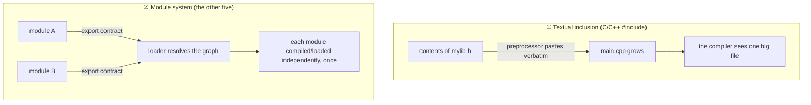

# Chapter 14 · Modules

[简体中文](./14-modules.md) ｜ **English**

---

> Chapter 13's scope solved naming *within one file*. But real projects have hundreds of files and depend on other people's libraries — **how do names avoid colliding across files? How is code organized? How are dependencies expressed?**
>
> That is what modules are for. This chapter reveals a fact that is easy to miss: **C++'s `#include` is not the same kind of thing as other languages' module systems** — it is merely text pasting. Grasp that difference and C++'s peculiar troubles (include guards, slow compiles) suddenly make sense.

## 1. Learning Objectives

By the end of this chapter, you will be able to:

- State what a module really is: **scope at a larger granularity, plus an explicit import/export contract**;
- Distinguish **textual inclusion (`#include`)** from a **true module system**, and explain the consequences;
- Explain the **load-once** caching mechanism and why it matters;
- Recognize and resolve **circular dependencies**;
- Explain why JavaScript ended up with two module systems, ESM and CommonJS.

---

## 2. Why This Concept Exists

When a project grows from one file to a hundred, three problems erupt at once:

1. **Name collisions** — you wrote `parse()`, so did a colleague, and so did a third-party library;
2. **Disorganization** — tens of thousands of lines piled together and nobody knows where to look;
3. **Opaque dependencies** — change one file and you can't tell who is affected.

Modules solve all three with one idea: **package related code, give it a name, and declare explicitly what it offers and what it needs.**

```text
Without modules: every name crowds into one space
    parse, format, parse(collision!), validate, parse(again!)

With modules: each module is its own namespace
    json.parse   csv.parse   xml.parse     ← no interference
```

Essentially, **a module is Chapter 13's "scope" scaled up to files and directories**.

---

## 3. How It Works

### The three parts of a module

| Part | Purpose |
|------|---------|
| **Namespace** | keeps internal names from colliding with the outside |
| **Encapsulation boundary** | states what is public and what is internal |
| **Dependency declaration** | `import` / `require` states "what I need" |

### Two fundamentally different mechanisms

This is the chapter's key divide:



**`#include` is just text substitution.** This is not a metaphor — measured with `g++ -E`:

```text
main.cpp originally has two lines:
    #include "mylib.h"
    int main() { return add(1, 2); }

after preprocessing it actually becomes:
    int add(int a, int b) { return a + b; }     ← the header's contents pasted verbatim
    int main() { return add(1, 2); }
```

That "pasting" directly causes a whole family of C++-only problems:

- **Include guards are required** (`#pragma once` / `#ifndef`) — otherwise including a header twice redefines everything;
- **Slow compilation** — every `.cpp` re-expands and recompiles all its headers;
- **Implementation leaks** — whatever is in the header is visible to every user.

C++20's `import` (true modules) exists precisely to fix this, though ecosystem migration is ongoing.

### Module resolution: finding the file

When you write `import json`, the language must answer "where is it?":

| Language | Search path |
|----------|------------|
| Python | `sys.path` (cwd → env vars → stdlib → site-packages) |
| Node.js | relative paths directly; bare names walk up looking for `node_modules` |
| Java | classpath / module path, with **package names mirroring directories** |
| C++ | `#include ""` checks the current directory first; `#include <>` searches system paths |
| C# | determined at compile time by assembly references |

### Modules load only once

Nearly every module system **caches**: importing the same module repeatedly executes it once. Measured (Python):

```text
first  import mymod  →  [mymod was executed]
second import mymod  →  (no output; served from cache)
```

Python keeps loaded modules in `sys.modules`. This guarantees **a module's top-level code runs exactly once**, which also makes modules natural singletons.

### Circular dependencies: a shared problem

A depends on B, B depends on A — what happens? Measured (Python):

```text
a_mod starts executing → hits import b_mod
    b_mod starts executing → hits import a_mod
        a_mod is already cached (but only half-executed!)
        b_mod tries to read a_mod.name  →  <doesn't exist yet!>
```

**The result is not an infinite loop but a half-built module** — some attributes are not yet defined. Such bugs are notoriously hard to trace, so the best strategy is to design circular dependencies away.

---

## 4. JavaScript

**JavaScript has two module systems**, a historical legacy:

```javascript
// ① ESM (ES Modules) — the modern standard, supported by browsers and Node
export function parse(text) { }
export default class Parser { }
import { parse } from "./parser.js";
import Parser from "./parser.js";

// ② CommonJS — Node.js's early scheme, still widespread
module.exports = { parse };
const { parse } = require("./parser.js");
```

**The key differences**:

| | ESM | CommonJS |
|---|-----|----------|
| Syntax | `import` / `export` | `require` / `module.exports` |
| When it loads | **statically** (known at compile time) | **dynamically** (at runtime) |
| Conditional import | needs dynamic `import()` | can sit inside an `if` |
| Tree shaking | ✅ (because it's static) | ❌ |
| File extension in Node | `.mjs`, or `"type": "module"` in package.json | `.cjs` or the default |

> ⚠️ **Why ESM being static matters**: because the import graph is known **before execution**, bundlers can perform **tree shaking** (dropping unused code). That is the core reason ESM replaced CommonJS.

**Dynamic import** (load on demand):

```javascript
if (needFeature) {
  const mod = await import("./heavy-feature.js");   // downloaded only when needed
}
```

> **Note**: don't mix the two systems in one project — `require`-ing an ESM module throws, and the reverse has many caveats. Use ESM for new projects.

---

## 5. Python

**One `.py` file is a module; a directory with `__init__.py` is a package**:

```python
# three ways to import
import json                         # the whole module, used as json.loads()
from json import loads              # just the names you need
from json import loads as parse     # aliased, to avoid collisions
```

**A module is itself an object** (measured) — Python's "everything is an object" philosophy at work:

```python
import mymod
print(type(mymod))       # <class 'module'>
print(mymod.value)       # accessing a module name is like accessing an attribute
```

**The `__name__ == "__main__"` idiom** lets a file be both importable and runnable:

```python
def main():
    print("running as a script")

if __name__ == "__main__":     # skipped on import; runs only when executed directly
    main()
```

**Convention over enforcement**: Python has no `private`, so naming expresses intent:

```python
_internal = "single underscore: internal by convention; import * skips it"
__all__ = ["public_func"]      # declares what `from module import *` exports
```

> **Note**: **avoid `from module import *`** — it pollutes the namespace, hides where names came from, and can silently shadow existing ones.

---

## 6. Java

**Packages mirror the directory structure** — a hallmark of Java:

```java
// the file must live at com/example/util/Parser.java
package com.example.util;

public class Parser {           // public: visible outside the package
    class Helper { }            // no modifier: package-private
}
```

```java
import com.example.util.Parser;      // one class
import com.example.util.*;           // the whole package (discouraged; collision-prone)
import static java.lang.Math.max;    // static import, so you can write max() directly
```

**Package names use reversed domains** (`com.example.xxx`) to guarantee global uniqueness — a convention still followed today.

**Java 9+'s module system (JPMS)** adds a layer above packages for stricter encapsulation:

```java
// module-info.java
module com.example.app {
    requires java.sql;              // declare dependencies
    exports com.example.util;       // declare which packages are public
}
```

> **Note**: among Java's four access levels (`public` / `protected` / default / `private`), the **default (package-private)** is often overlooked, yet it is the tool for "shared within the package, hidden outside."

---

## 7. C++

**The traditional approach: header plus source**

```cpp
// mylib.h — declarations (the public contract)
#pragma once                        // include guard: prevents double inclusion
int add(int a, int b);

// mylib.cpp — the implementation
#include "mylib.h"
int add(int a, int b) { return a + b; }

// main.cpp — usage
#include "mylib.h"                  // merely pastes the declarations in
```

**Two forms of `#include`**:

```cpp
#include "mylib.h"     // quotes: search the current directory first
#include <iostream>     // angle brackets: search system/standard paths
```

**Namespaces** are C++'s real name-isolation mechanism (discussed as `std::` in Chapter 08):

```cpp
namespace app {
    namespace util {
        int parse();
    }
}
app::util::parse();                 // fully qualified
namespace au = app::util;           // alias
au::parse();
```

**C++20 modules** — a true module system that fixes `#include`'s inherent problems:

```cpp
// mylib.ixx
export module mylib;
export int add(int a, int b) { return a + b; }

// main.cpp
import mylib;                       // no longer text pasting; compiled once and reused
```

> **Note**: `#pragma once` (or a traditional `#ifndef` guard) is essential, or indirect double inclusion causes redefinition errors. Also, **never write `using namespace std;` in a header** — it pollutes every file that includes it.

---

## 8. C#

**Namespaces are decoupled from the file layout** (unlike Java's forced correspondence):

```csharp
namespace Company.Project.Utils
{
    public class Parser { }
    internal class Helper { }        // internal: visible only within this assembly
}
```

**C# 10 supports file-scoped namespaces**, removing a level of indentation:

```csharp
namespace Company.Project.Utils;    // one line; the whole file is in this namespace

public class Parser { }
```

**Forms of `using`**:

```csharp
using System;                            // ordinary import
using Utils = Company.Project.Utils;     // alias
global using System.Text;                // C# 10: applies to the whole project
using static System.Math;                // static import, so you can write Max()
```

**The assembly is C#'s unit of deployment and encapsulation** — `internal` is scoped to the assembly, not the namespace:

| Modifier | Visibility |
|----------|-----------|
| `public` | all assemblies |
| `internal` | **this assembly only** |
| `private` | this type only |

> **Note**: namespaces handle naming; **assemblies handle encapsulation**. This differs from Java, where a package does both — a common source of beginner confusion.

---

## 9. SQL

SQL organizes database objects with **schemas**, playing a role much like modules.

### ① Three-level qualification

```text
database . schema . table
```

```sql
-- PostgreSQL / SQL Server
CREATE SCHEMA sales;
CREATE TABLE sales.orders (id INT, amount DECIMAL(10,2));
SELECT * FROM sales.orders;          -- fully qualified

-- set a search path and you may omit the schema (much like importing)
SET search_path TO sales;            -- PostgreSQL
SELECT * FROM orders;
```

This is exactly the idea behind Java's `com.example.util.Parser`: **hierarchical naming to avoid collisions**.

### ② Views: SQL's encapsulation

A view acts as a public interface, hiding complex queries and the underlying table layout:

```sql
CREATE VIEW passed_students AS
SELECT name, score FROM student WHERE score >= 60;

SELECT * FROM passed_students;       -- consumers need not know the internals
```

**This is the module idea of an "encapsulation boundary" in SQL**: the underlying tables may change, and as long as the view's definition holds, consumers are unaffected.

### ③ Permissions as access control

```sql
GRANT SELECT ON sales.orders TO analyst;    -- like making a "module member" visible
REVOKE ALL ON sales.orders FROM guest;
```

> ⚠️ **SQLite is an exception**: it has no `CREATE SCHEMA`. It uses `ATTACH DATABASE` to mount another database file, then accesses it as `alias.table` — the approach used in this chapter's examples.

---

## 10. Cross-Language Comparison

### ① Module mechanisms

| Feature | JavaScript | Python | Java | C++ | C# |
|---------|-----------|--------|------|-----|-----|
| Basic unit | file (module) | file (module) / directory (package) | package | header / C++20 module | namespace / assembly |
| Import syntax | `import` / `require` | `import` | `import` | `#include` / `import` | `using` |
| Export syntax | `export` | public by default | `public` | declarations in a header | `public` |
| Tied to directories | path is the module name | yes (package structure) | **yes (strictly)** | no | **no** |
| A true module system | ✅ | ✅ | ✅ | ❌ traditional / ✅ C++20 | ✅ |
| Loads once | ✅ | ✅ (`sys.modules`) | ✅ (class loader) | ❌ re-expanded every compile | ✅ |
| Access control | exported means public | convention (`_` prefix) | 4 modifiers | decided by the header | 4 modifiers + assembly |

### ② The same thing, five ways

Import a "parse" function and use it:

```javascript
import { parse } from "./parser.js";        // JavaScript (ESM)
```
```python
from parser import parse                     # Python
```
```java
import com.example.Parser;                   // Java (then Parser.parse())
```
```cpp
#include "parser.h"                          // C++ (text pasting)
```
```csharp
using Company.Utils;                         // C# (then Parser.Parse())
```

### ③ Commonalities and the root of differences

**In common**: all five use modules to solve collisions, organization, and dependency management; all offer some public/internal distinction; and all face circular dependencies.

**The differences**:
- **C++ is the outlier** — traditional `#include` is **preprocessor text substitution**, not a language-level module. A 1970s C legacy whose price is slow compiles, guards, and leaked implementations;
- **Java binds package names to directories**, buying determinism and tooling support at the cost of long paths;
- **JavaScript's two systems** are a product of gradual evolution; ESM's static nature is the prerequisite for tree shaking;
- **C# separates naming (namespaces) from encapsulation (assemblies)**, more flexible than Java's package doing both.

---

## 11. Underlying Implementation Comparison

| Language · Engine | How modules load |
|-------------------|-----------------|
| **JavaScript · V8/Node** | ESM has three phases: **resolve the graph → link (establish bindings) → evaluate**; CommonJS synchronously `require`s at runtime and caches |
| **Python · CPython** | search `sys.path` → compile to `.pyc` (cached in `__pycache__`) → run top-level code → store in `sys.modules` |
| **Java · JVM** | class loaders load `.class` on demand under the **parent-delegation** model; each class loads once |
| **C++ · Native** | the preprocessor expands `#include` → each translation unit compiles independently → the **linker** merges symbols (C++'s real "module merge" moment) |
| **C# · CLR** | assemblies (`.dll`) load on demand at runtime, with the CLR resolving dependencies |

**A key insight**: in C++, "stitching several files into one program" happens **not at compile time but at link time**. That explains why C++ has "compiles fine, fails to link" errors that other languages rarely produce — declarations (headers) and definitions (sources) are handled separately.

---

## 12. Performance Analysis

| Dimension | Notes |
|-----------|-------|
| **C++ compile time** | every `.cpp` expands all its headers; in a large project one header may be expanded thousands of times — the main reason C++ compiles slowly |
| **Python startup** | the first import compiles to `.pyc`; later runs use the cache. Importing many modules noticeably slows startup |
| **JavaScript bundle size** | ESM's static structure lets bundlers tree-shake, significantly shrinking output |
| **Java class loading** | loaded on demand (at first use): fast startup, small first-call latency |

**Practical optimizations**:

```cpp
// C++: use forward declarations instead of #include to cut compile-time coupling
class Parser;              // ✓ knowing the class exists is enough
void process(Parser& p);
// rather than #include "parser.h" (which drags in the whole header)
```

```python
# Python: defer heavy imports into functions to speed up startup
def analyze(data):
    import numpy as np      # imported only when actually called
    return np.mean(data)
```

```javascript
// JavaScript: dynamic import for code splitting
const chart = await import("./heavy-chart.js");   // loaded only when needed
```

---

## 13. Engineering Practice

| Scenario | ✅ Recommended | ❌ Discouraged | Why |
|----------|---------------|---------------|-----|
| Importing | import the specific names you need | `from x import *` / `import x.*` | avoids pollution; origins stay clear |
| Module boundaries | organize by **business capability** | by technical type (one giant utils package) | high cohesion; one feature, one place |
| Circular dependencies | extract the shared part into a third module | mutual imports | half-built modules are brutal to debug |
| C++ headers | always `#pragma once`; use forward declarations | `using namespace std;` in a header | prevents redefinition and pollution |
| JavaScript | standardize on ESM | mixing ESM and CommonJS | interop is full of caveats |
| Public API | declare it explicitly (`__all__` / `export` / `public`) | making everything public by default | smaller API surface, easier refactors |
| Module top level | definitions only, no side effects | connecting to a database at import time | importing shouldn't *do* things |

**Three ways to break a cycle**:

1. **Extract the shared part**: move what A and B both need into C, and have both depend on C;
2. **Invert the dependency**: let the high-level layer define an interface the low level implements (detailed in Part 8);
3. **Defer the import**: move `import` inside a function (a stopgap, not a cure).

---

## 14. Best Practices

- **One module, one responsibility**: the name should say what it does.
- **Put imports at the top** (Python/JavaScript convention) so dependencies are obvious.
- **Group imports**: standard library → third party → local, separated by blank lines.
- **Avoid deeply nested packages**: `com.example.project.module.sub.util.helper` usually signals a design problem.
- **No side effects at module top level**: importing shouldn't fire network requests or mutate global state.
- **Keep public interfaces stable**: internals may change freely, but renaming an export ripples out to every consumer.

---

## 15. Common Pitfalls

**Pitfall 1 · Circular dependencies yield a half-built module**

```text
a_mod half-executed → import b_mod → b_mod reads a_mod.name → <doesn't exist yet!>
```
**Why it's wrong**: a module may be cached while only partly executed.
**How to avoid**: redesign the dependencies; use a deferred import as a stopgap.

**Pitfall 2 · Forgetting a C++ include guard**

```cpp
// mylib.h without #pragma once
// included indirectly twice → error: redefinition of 'add'
```
**How to avoid**: make `#pragma once` the first line of every header.

**Pitfall 3 · `using namespace std;` in a header**

```cpp
// mylib.h
using namespace std;      // ✗ pollutes every file that includes this header
```
**Why it's wrong**: the pollution is contagious and consumers cannot undo it.
**How to avoid**: use it only in `.cpp` files, or just write `std::` everywhere.

**Pitfall 4 · Python's `import *` shadowing existing names**

```python
from os.path import *
from mymodule import *      # if both define join, the latter silently wins
```
**How to avoid**: import explicitly, or use `import module` to keep the prefix.

**Pitfall 5 · Mixing ESM and CommonJS in JavaScript**

```javascript
const esmModule = require("./module.mjs");   // ✗ error: cannot require an ESM module
```
**How to avoid**: standardize the whole project on ESM.

**Pitfall 6 · A module name colliding with the standard library**

```python
# you created json.py, so `import json` gets your file, not the stdlib
```
**How to avoid**: never name your files after stdlib modules (`json.py`, `random.py`, `test.py` are minefields).

**Pitfall 7 · Side effects at module top level**

```python
# config.py
connection = connect_to_database()    # ✗ importing it connects to the database
```
**How to avoid**: use a function or lazy initialization so the caller decides when.

---

## 16. Interview Questions

**Basic**

1. Why do we need modules? What problems do they solve?
2. What is the difference between `import x` and `from x import y` in Python?
3. Why is `from module import *` discouraged?

**Intermediate**

4. What is the fundamental difference between C++'s `#include` and other languages' `import`? What follows from it?
5. How do ESM and CommonJS differ? Why does ESM's "static" nature matter for bundling?
6. What is a circular dependency? What symptoms does it produce, and how do you resolve it?

**Advanced**

7. Explain from the implementation why a Python module executes only once. Where does that mechanism live?
8. Why does C++ produce "compiles but fails to link" errors that Java/C# rarely do?
9. What is the fundamental difference in access control between Java packages and C# namespaces? (Hint: assemblies.)

---

## 17. Exercises

**Basic**

1. In each of the six languages, create two files — one exporting a function, one importing and using it — and run them.
2. Use `g++ -E` to inspect a file containing `#include` after preprocessing, and count the change in line numbers.
3. Verify in Python that a module loads only once (add a top-level `print`, import twice, and observe).

**Intermediate**

4. Deliberately create a circular import in Python, observe the error or half-built module, then resolve it by extracting a shared module.
5. Remove the include guard from a C++ header, construct a double inclusion, observe the error, and put it back.
6. Convert a CommonJS Node project to ESM and record the problems you hit.

**Challenge**

7. Write a simple module loader: given a dependency graph, load in the correct order and detect cycles (hint: topological sort).
8. Compare compile times for the same C++ project written with "many `#include`s" versus "forward declarations + minimal includes," and quantify the difference.

---

## 18. Summary

**In one sentence**: a module is **scope scaled up to files** — namespaces prevent collisions, imports/exports declare dependencies, and public/private draws the encapsulation boundary; among the six languages only C++'s traditional `#include` is an outlier, being **preprocessor text pasting** rather than a real module system.

**Core takeaways**

- Module = namespace + encapsulation boundary + dependency declaration.
- **`#include` is text substitution** (verifiable with `g++ -E`), which is where include guards, slow compiles, and leaked implementations come from.
- **Modules load once** (Python's `sys.modules`), which makes them natural singletons.
- **A circular dependency doesn't hang — it hands you a half-built module**, one of the hardest bug classes to trace.
- ESM's **static** imports are the prerequisite for tree shaking — the core reason it replaced CommonJS.

**Checklist**

- [ ] I can state the three problems modules solve and how they relate to scope.
- [ ] I can explain `#include` versus a real module system and name three resulting C++ problems.
- [ ] I can explain module caching and why modules are singletons.
- [ ] I can spot a circular dependency and give at least two ways to resolve it.
- [ ] I can explain how ESM and CommonJS differ and when each applies.

**Next chapter**: modules organize code inside a project — but what about using other people's libraries? How do you download them, manage versions, and handle dependencies of dependencies? That is Part 2's closing chapter — Chapter 15, "Packages."

---

## 19. Further Reading

- <a href="https://en.wikipedia.org/wiki/Modular_programming" target="_blank" rel="noopener">Wikipedia: Modular programming</a> — the origins and principles of modularity.
- <a href="https://developer.mozilla.org/en-US/docs/Web/JavaScript/Guide/Modules" target="_blank" rel="noopener">MDN · JavaScript modules</a> — the complete ESM guide.
- <a href="https://nodejs.org/api/esm.html" target="_blank" rel="noopener">Node.js docs · ECMAScript modules</a> — the authoritative account of ESM/CommonJS interop.
- <a href="https://docs.python.org/3/tutorial/modules.html" target="_blank" rel="noopener">The Python Tutorial · Modules</a> — packages, `__all__`, and the search path.
- <a href="https://docs.oracle.com/javase/tutorial/java/package/packages.html" target="_blank" rel="noopener">Oracle Java Tutorial · Packages</a> — creating, naming, and access control.
- <a href="https://en.cppreference.com/w/cpp/language/modules" target="_blank" rel="noopener">cppreference · C++20 modules</a> — the real C++ module system.
- <a href="https://learn.microsoft.com/en-us/dotnet/csharp/fundamentals/types/namespaces" target="_blank" rel="noopener">Microsoft Learn · C# namespaces</a> — namespaces and their relationship to assemblies.
