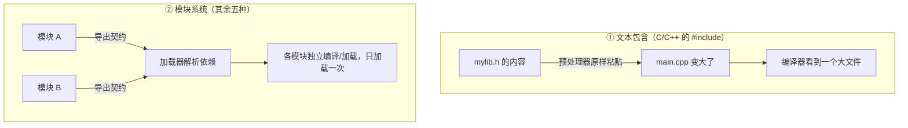

# 第 14 章 · 模块

**简体中文** ｜ [English](./14-modules.en-US.md)

---

> 第 13 章的作用域解决了"一个文件之内"的命名问题。但真实项目有成百上千个文件，还要用到别人写的库——**跨文件的命名怎么不打架？代码怎么组织？依赖关系怎么表达？**
>
> 这就是模块。这一章会揭示一个容易被忽略的事实：**C++ 的 `#include` 与其他语言的模块系统根本不是一回事**——它只是文本粘贴。理解这个差异，你就能明白 C++ 那些独有的麻烦（头文件守卫、编译缓慢）从何而来。

## 1. 学习目标

本章结束后，你将能够：

- 说清模块的本质：**更大粒度的作用域 + 显式的导入/导出契约**；
- 区分**文本包含（`#include`）**与**真正的模块系统**，并解释这个差异带来的后果；
- 说明模块**只加载一次**的缓存机制，以及它为什么重要；
- 识别并化解**循环依赖**；
- 讲清 JavaScript 为什么会有 ESM 和 CommonJS 两套模块系统。

---

## 2. 为什么会出现这个概念

当项目从一个文件长到一百个文件，三个问题会同时爆发：

1. **命名冲突**——你写了 `parse()`，同事也写了 `parse()`，第三方库还有一个 `parse()`；
2. **组织混乱**——几万行代码堆在一起，没人知道该去哪里找东西；
3. **依赖不明**——改动一个文件，不知道会影响谁。

模块用一个办法同时解决三者：**把一组相关的代码打包，给它一个名字，并明确声明「我对外提供什么」和「我需要什么」**。

```text
没有模块：所有名字挤在一个空间里
    parse, format, parse(冲突!), validate, parse(又冲突!)

有模块：每个模块自成一个命名空间
    json.parse   csv.parse   xml.parse     ← 互不干扰
```

本质上，**模块就是第 13 章"作用域"这个概念，放大到文件和目录的尺度**。

---

## 3. 底层原理

### 模块的三个组成

| 组成 | 作用 |
|------|------|
| **命名空间** | 让模块内的名字不与外界冲突 |
| **封装边界** | 明确哪些对外公开，哪些是内部实现 |
| **依赖声明** | 用 `import` / `require` 声明"我需要谁" |

### 两种根本不同的机制

这是本章最重要的分水岭：



**`#include` 只是文本替换。** 这不是比喻——实测用 `g++ -E` 看预处理结果：

```text
main.cpp 原本只有两行：
    #include "mylib.h"
    int main() { return add(1, 2); }

预处理后实际变成：
    int add(int a, int b) { return a + b; }     ← 头文件内容被原样粘贴进来
    int main() { return add(1, 2); }
```

这个"粘贴"机制直接导致了 C++ 的一系列独有问题：

- **需要头文件守卫**（`#pragma once` / `#ifndef`）——否则同一个头被包含两次就会重复定义；
- **编译缓慢**——每个 `.cpp` 都要把所有依赖的头重新展开、重新编译一遍；
- **实现细节泄漏**——头文件里写什么，使用者就全看见什么。

C++20 引入的 `import`（真正的模块）正是为了解决这些问题，但生态迁移仍在进行中。

### 模块解析：怎么找到文件

当你写 `import json`，语言需要回答"这个模块在哪"：

| 语言 | 查找路径 |
|------|---------|
| Python | `sys.path`（当前目录 → 环境变量 → 标准库 → site-packages） |
| Node.js | 相对路径直接找；裸名字则逐层向上找 `node_modules` |
| Java | classpath / module path，且**包名必须与目录结构对应** |
| C++ | `#include ""` 先找当前目录，`#include <>` 找系统路径 |
| C# | 编译时由程序集引用决定 |

### 模块只加载一次

几乎所有模块系统都有**缓存**：同一个模块被导入多次，只执行一次。实测（Python）：

```text
第一次 import mymod  →  [mymod 被执行了]
第二次 import mymod  →  （没有输出，直接用缓存）
```

Python 把已加载的模块存在 `sys.modules` 里。这个设计保证了**模块的顶层代码只运行一次**，也让模块天然成为单例。

### 循环依赖：共同的难题

A 依赖 B，B 又依赖 A，会发生什么？实测（Python）：

```text
a_mod 开始执行 → 遇到 import b_mod
    b_mod 开始执行 → 遇到 import a_mod
        a_mod 已在缓存中（但只执行了一半！）
        b_mod 试图访问 a_mod.name  →  <还不存在！>
```

**结果不是死循环，而是拿到一个"半成品"模块**——某些属性尚未定义。这类 bug 极难排查，所以最好的策略是从设计上避免循环依赖。

---

## 4. JavaScript

**JavaScript 有两套模块系统**，这是历史遗留问题：

```javascript
// ① ESM（ES Modules）—— 现代标准，浏览器和 Node 都支持
export function parse(text) { }
export default class Parser { }
import { parse } from "./parser.js";
import Parser from "./parser.js";

// ② CommonJS —— Node.js 早期方案，仍大量存在
module.exports = { parse };
const { parse } = require("./parser.js");
```

**两者的关键差异**：

| | ESM | CommonJS |
|---|---|---|
| 语法 | `import` / `export` | `require` / `module.exports` |
| 加载时机 | **静态**（编译时确定） | **动态**（运行时执行） |
| 能否条件导入 | 需用 `import()` 动态导入 | 可以直接写在 `if` 里 |
| 支持 Tree Shaking | ✅（因为是静态的） | ❌ |
| Node 中的文件扩展名 | `.mjs`，或 `package.json` 设 `"type": "module"` | `.cjs` 或默认 |

> ⚠️ **为什么 ESM 是静态的很重要**：因为导入关系在**运行前**就能确定，打包工具才能做 **Tree Shaking**（剔除没用到的代码）。这是 ESM 取代 CommonJS 的核心原因。

**动态导入**（按需加载）：

```javascript
if (needFeature) {
  const mod = await import("./heavy-feature.js");   // 用到时才下载
}
```

> **注意事项**：不要在同一个项目里混用两套模块系统——`require` 一个 ESM 模块会报错，反过来也有诸多限制。新项目一律用 ESM。

---

## 5. Python

**一个 `.py` 文件就是一个模块，一个带 `__init__.py` 的目录就是一个包**：

```python
# 三种导入方式
import json                         # 导入整个模块，用 json.loads()
from json import loads              # 只导入需要的名字
from json import loads as parse     # 起别名，避免冲突
```

**模块本身就是对象**（实测）——这体现了 Python "一切皆对象"的哲学：

```python
import mymod
print(type(mymod))       # <class 'module'>
print(mymod.value)       # 访问模块里的名字，就像访问对象属性
```

**`__name__ == "__main__"` 惯用法**——让文件既能被导入，又能直接运行：

```python
def main():
    print("作为脚本运行")

if __name__ == "__main__":     # 被 import 时不执行，直接运行时才执行
    main()
```

**约定优于强制**：Python 没有 `private`，用命名约定表达意图：

```python
_internal = "单下划线：约定为内部使用，import * 不会导入它"
__all__ = ["public_func"]      # 显式声明 from module import * 时导出什么
```

> **注意事项**：**避免 `from module import *`**——它会污染当前命名空间，让人搞不清名字从哪来，也容易覆盖已有名字。

---

## 6. Java

**包（package）与目录结构强绑定**，这是 Java 的鲜明特点：

```java
// 文件必须位于 com/example/util/Parser.java
package com.example.util;

public class Parser {           // public：包外可见
    class Helper { }            // 无修饰符：仅包内可见（package-private）
}
```

```java
import com.example.util.Parser;      // 导入单个类
import com.example.util.*;           // 导入整个包（不推荐，易冲突）
import static java.lang.Math.max;    // 静态导入，之后可直接写 max()
```

**包名用反写域名**（`com.example.xxx`）以保证全球唯一——这个约定沿用至今。

**Java 9+ 的模块系统**（JPMS）在包之上又加了一层，用于更严格的封装：

```java
// module-info.java
module com.example.app {
    requires java.sql;              // 声明依赖
    exports com.example.util;       // 声明哪些包对外公开
}
```

> **注意事项**：Java 的四种访问级别（`public` / `protected` / 默认 / `private`）中，**默认**（package-private）常被忽略，但它是实现"包内共享、包外隐藏"的利器。

---

## 7. C++

**传统方式：头文件 + 源文件分离**

```cpp
// mylib.h —— 声明（对外契约）
#pragma once                        // 头文件守卫：防止重复包含
int add(int a, int b);

// mylib.cpp —— 实现
#include "mylib.h"
int add(int a, int b) { return a + b; }

// main.cpp —— 使用
#include "mylib.h"                  // 只是把声明粘贴过来
```

**`#include` 的两种写法**：

```cpp
#include "mylib.h"     // 引号：先找当前目录
#include <iostream>     // 尖括号：找系统/标准库路径
```

**命名空间**才是 C++ 真正的命名隔离机制（第 08 章讨论过 `std::`）：

```cpp
namespace app {
    namespace util {
        int parse();
    }
}
app::util::parse();                 // 完整限定
namespace au = app::util;           // 起别名
au::parse();
```

**C++20 模块**——真正的模块系统，解决了 `#include` 的固有问题：

```cpp
// mylib.ixx
export module mylib;
export int add(int a, int b) { return a + b; }

// main.cpp
import mylib;                       // 不再是文本粘贴，编译一次即可复用
```

> **注意事项**：`#pragma once` 必不可少（或用传统的 `#ifndef` 守卫），否则同一头文件被间接包含两次就会导致重复定义错误。另外，**永远不要在头文件里写 `using namespace std;`**——它会污染所有包含该头的文件。

---

## 8. C#

**命名空间与文件结构解耦**（不像 Java 那样强制对应目录）：

```csharp
namespace Company.Project.Utils
{
    public class Parser { }
    internal class Helper { }        // internal：仅当前程序集可见
}
```

**C# 10 起支持文件级命名空间**，减少一层缩进：

```csharp
namespace Company.Project.Utils;    // 一行搞定，整个文件都在此命名空间下

public class Parser { }
```

**using 的多种形式**：

```csharp
using System;                            // 常规导入
using Utils = Company.Project.Utils;     // 起别名
global using System.Text;                // C# 10：全局导入，整个项目生效
using static System.Math;                // 静态导入，之后可直接写 Max()
```

**程序集（Assembly）是 C# 的部署与封装单位**——`internal` 的可见范围就是程序集，而非命名空间：

| 修饰符 | 可见范围 |
|--------|---------|
| `public` | 所有程序集 |
| `internal` | **仅当前程序集** |
| `private` | 仅当前类型 |

> **注意事项**：命名空间只管命名，**程序集才管封装**。这与 Java 的"包既管命名也管访问"不同，是初学者常混淆的一点。

---

## 9. SQL

SQL 用**模式**（Schema）来组织数据库对象，作用与其他语言的模块类似。

### ① 三层命名限定

```text
数据库(database) . 模式(schema) . 表(table)
```

```sql
-- PostgreSQL / SQL Server
CREATE SCHEMA sales;
CREATE TABLE sales.orders (id INT, amount DECIMAL(10,2));
SELECT * FROM sales.orders;          -- 完整限定名

-- 设置搜索路径后可省略模式名（类似 import）
SET search_path TO sales;            -- PostgreSQL
SELECT * FROM orders;
```

这与 Java 的 `com.example.util.Parser` 是同一个思路：**用层级命名避免冲突**。

### ② 视图：SQL 的封装手段

视图相当于"对外公开的接口"，把复杂查询和底层表结构隐藏起来：

```sql
CREATE VIEW passed_students AS
SELECT name, score FROM student WHERE score >= 60;

SELECT * FROM passed_students;       -- 使用者不必知道底层逻辑
```

**这正是模块"封装边界"思想在 SQL 中的体现**：底层表结构可以改，只要视图定义保持不变，使用方就不受影响。

### ③ 权限即访问控制

```sql
GRANT SELECT ON sales.orders TO analyst;    -- 相当于把某个"模块成员"设为可见
REVOKE ALL ON sales.orders FROM guest;
```

> ⚠️ **SQLite 例外**：SQLite 没有 `CREATE SCHEMA`。它用 `ATTACH DATABASE` 把另一个数据库文件挂载进来，然后用 `别名.表名` 访问——本章示例采用这种方式演示。

---

## 10. 五语言横向对比

### ① 模块机制对比

| 特性 | JavaScript | Python | Java | C++ | C# |
|------|-----------|--------|------|-----|-----|
| 基本单位 | 文件（模块） | 文件（模块）/ 目录（包） | 包（package） | 头文件 / C++20 模块 | 命名空间 / 程序集 |
| 导入语法 | `import` / `require` | `import` | `import` | `#include` / `import` | `using` |
| 导出语法 | `export` | 默认全部公开 | `public` | 头文件中的声明 | `public` |
| 与目录强绑定 | 路径即模块名 | 是（包结构） | **是（严格对应）** | 否 | **否** |
| 真正的模块系统 | ✅ | ✅ | ✅ | ❌ 传统 / ✅ C++20 | ✅ |
| 只加载一次 | ✅ | ✅（`sys.modules`） | ✅（类加载器） | ❌ 每次编译都展开 | ✅ |
| 访问控制 | 导出即公开 | 约定（`_` 前缀） | 4 级修饰符 | 头文件决定 | 4 级 + 程序集 |

### ② 同一件事的五种写法

导入一个"解析函数"并使用：

```javascript
import { parse } from "./parser.js";        // JavaScript (ESM)
```
```python
from parser import parse                     # Python
```
```java
import com.example.Parser;                   // Java（然后 Parser.parse()）
```
```cpp
#include "parser.h"                          // C++（文本粘贴）
```
```csharp
using Company.Utils;                         // C#（然后 Parser.Parse()）
```

### ③ 共同点与差异根源

**共同点**：五门语言都用模块解决命名冲突、代码组织和依赖管理，都提供了某种"公开 / 内部"的区分，也都面临循环依赖问题。

**差异根源**：
- **C++ 是唯一的异类**——传统 `#include` 是**预处理器文本替换**，而非语言层面的模块。这是 1970 年代 C 的设计遗留，代价是编译慢、需要守卫、实现泄漏；
- **Java 把包名与目录强绑定**，换来了确定性和工具友好，代价是目录层级冗长；
- **JavaScript 的双模块系统**是渐进演化的产物，ESM 的静态特性是 Tree Shaking 的前提；
- **C# 把"命名"（命名空间）与"封装"（程序集）分开**，比 Java 的"包管两件事"更灵活。

---

## 11. 底层实现对比

| 语言 · 引擎 | 模块如何被加载 |
|------------|--------------|
| **JavaScript · V8/Node** | ESM 分三阶段：**解析依赖图 → 链接（建立绑定）→ 求值**；CommonJS 则是运行时同步 `require` 并缓存 |
| **Python · CPython** | 按 `sys.path` 查找 → 编译成 `.pyc`（缓存在 `__pycache__`）→ 执行模块顶层代码 → 存入 `sys.modules` |
| **Java · JVM** | 类加载器按需加载 `.class`，遵循**双亲委派**模型，同一类只加载一次 |
| **C++ · Native** | 预处理器展开 `#include` → 每个翻译单元独立编译 → **链接器**合并符号（这才是 C++ 真正的"模块合并"时刻） |
| **C# · CLR** | 程序集（`.dll`）在运行时按需加载，由 CLR 解析依赖 |

**一个关键洞察**：C++ 中"把多个文件拼成一个程序"这件事，**不发生在编译期，而发生在链接期**。这解释了为什么 C++ 会有"编译通过但链接失败"这种其他语言少见的错误——声明（头文件）和定义（源文件）是分开处理的。

---

## 12. 性能分析

| 维度 | 说明 |
|------|------|
| **C++ 编译时间** | 每个 `.cpp` 都要展开全部头文件，大型项目中同一个头可能被展开上千次——这是 C++ 编译慢的主因 |
| **Python 启动时间** | 首次导入要编译成 `.pyc`；之后走缓存。导入大量模块会明显拖慢启动 |
| **JavaScript 打包体积** | ESM 的静态结构让打包器能做 Tree Shaking，显著减小产物体积 |
| **Java 类加载** | 按需加载（首次使用时才加载），启动快但首次调用有延迟 |

**实用优化**：

```cpp
// C++：用前置声明代替 #include，减少编译依赖
class Parser;              // ✓ 只需要知道有这个类
void process(Parser& p);
// 而不是 #include "parser.h"（会拖入整个头文件）
```

```python
# Python：把重量级导入延迟到函数内部，加快启动
def analyze(data):
    import numpy as np      # 只有真正调用时才导入
    return np.mean(data)
```

```javascript
// JavaScript：动态导入实现代码分割
const chart = await import("./heavy-chart.js");   // 用到时才加载
```

---

## 13. 工程实践

| 场景 | ✅ 推荐 | ❌ 不推荐 | 原因 |
|------|--------|----------|------|
| 导入方式 | 显式导入需要的名字 | `from x import *` / `import x.*` | 避免命名污染，来源清晰 |
| 模块划分 | 按**业务功能**划分 | 按技术类型（全部 utils 一个包） | 高内聚，改一个功能只动一处 |
| 循环依赖 | 提取公共部分成第三个模块 | 互相 import | 半成品模块极难排查 |
| C++ 头文件 | 必写 `#pragma once`；用前置声明 | 头文件里 `using namespace std;` | 防重复定义，防污染 |
| JavaScript | 统一用 ESM | 混用 ESM 和 CommonJS | 互操作限制多 |
| 公开接口 | 明确声明（`__all__` / `export` / `public`） | 全部默认公开 | 减小 API 表面，便于重构 |
| 模块顶层代码 | 只做定义，不做副作用 | 顶层直接连数据库、发请求 | 导入即执行会带来意外 |

**化解循环依赖的三种办法**：

1. **提取公共部分**：A 和 B 都依赖的东西抽到 C，让 A、B 都依赖 C；
2. **依赖倒置**：让高层定义接口，低层实现（Part 8 会详述）；
3. **延迟导入**：把 `import` 移进函数内部（治标不治本，但能应急）。

---

## 14. 最佳实践

- **一个模块一个职责**：模块名应该能说清它是干什么的。
- **导入放在文件顶部**（Python/JavaScript 惯例），让依赖一目了然。
- **导入顺序分组**：标准库 → 第三方库 → 本项目模块，组间空行。
- **避免深层嵌套的包结构**：`com.example.project.module.sub.util.helper` 过深，通常意味着划分有问题。
- **模块顶层不要有副作用**：导入一个模块不应该产生网络请求或修改全局状态。
- **公开接口要稳定**：内部实现可以随便改，但已导出的名字改动会波及所有使用者。

---

## 15. 常见坑

**坑 1 · 循环依赖导致拿到半成品模块**

```text
a_mod 执行到一半 → import b_mod → b_mod 访问 a_mod.name → <还不存在！>
```
**为什么错**：模块被缓存时可能只执行了一部分。
**如何避免**：重新设计依赖关系；应急可用延迟导入。

**坑 2 · C++ 忘记头文件守卫**

```cpp
// mylib.h 没写 #pragma once
// 被间接包含两次 → error: redefinition of 'add'
```
**如何避免**：每个头文件第一行写 `#pragma once`。

**坑 3 · 在头文件里 `using namespace std;`**

```cpp
// mylib.h
using namespace std;      // ✗ 所有包含此头的文件都被污染
```
**为什么错**：污染会传染，且使用者无法撤销。
**如何避免**：只在 `.cpp` 文件里用，或干脆全部写 `std::`。

**坑 4 · Python 的 `import *` 覆盖已有名字**

```python
from os.path import *
from mymodule import *      # 如果两者都有 join，后者悄悄覆盖前者
```
**如何避免**：显式导入，或用 `import module` 保留前缀。

**坑 5 · JavaScript 混用 ESM 与 CommonJS**

```javascript
const esmModule = require("./module.mjs");   // ✗ 报错：不能 require 一个 ESM
```
**如何避免**：整个项目统一用 ESM。

**坑 6 · 模块名与标准库冲突**

```python
# 你自己创建了 json.py，然后 import json 拿到的是你的文件，不是标准库
```
**如何避免**：不要用标准库的名字命名自己的文件（`json.py`、`random.py`、`test.py` 都是雷区）。

**坑 7 · 模块顶层有副作用**

```python
# config.py
connection = connect_to_database()    # ✗ 一被导入就连接数据库
```
**如何避免**：改成函数或惰性初始化，让使用者决定何时触发。

---

## 16. 面试题

**基础**

1. 为什么需要模块？它解决了哪些问题？
2. Python 中 `import x` 和 `from x import y` 有什么区别？
3. 为什么不推荐 `from module import *`？

**中级**

4. C++ 的 `#include` 和其他语言的 `import` 有什么本质区别？这个差异导致了什么后果？
5. ESM 和 CommonJS 有什么区别？为什么说 ESM 的"静态"特性对打包很重要？
6. 什么是循环依赖？它会导致什么现象？如何化解？

**高级**

7. 从底层解释：Python 的模块为什么只会被执行一次？这个机制存在哪里？
8. 为什么 C++ 会出现"编译通过但链接失败"，而 Java/C# 少见这种错误？
9. Java 的包和 C# 的命名空间在访问控制上有什么根本差异？（提示：程序集。）

---

## 17. 练习

**基础**

1. 在六门语言中各建两个文件，一个导出函数、一个导入使用，跑通它。
2. 用 `g++ -E` 查看一个含 `#include` 的文件预处理后的样子，数一数行数变化。
3. 在 Python 中验证模块只加载一次（在模块顶层加一句 `print`，导入两次观察）。

**提高**

4. 故意制造一个 Python 循环依赖，观察报错或半成品现象，然后用"提取公共模块"化解它。
5. 在 C++ 中删掉头文件守卫，构造重复包含并观察报错；再加回来验证。
6. 把一个 CommonJS 的 Node 项目改写成 ESM，记录遇到的问题。

**挑战**

7. 写一个简易的模块加载器：给定模块依赖关系，按正确顺序加载并检测循环依赖（提示：拓扑排序）。
8. 对比同一个 C++ 项目使用"大量 `#include`"与"前置声明 + 最小包含"两种写法的编译耗时，量化差异。

---

## 18. 本章总结

**一句话总结**：模块是**放大到文件尺度的作用域**——它用命名空间避免冲突、用导入导出声明依赖、用公开/私有划定封装边界；六门语言中只有 C++ 的传统 `#include` 是个异类，它只是**预处理器的文本粘贴**，而非真正的模块系统。

**核心知识点**

- 模块 = 命名空间 + 封装边界 + 依赖声明。
- **`#include` 是文本替换**（`g++ -E` 可实测验证），由此产生头文件守卫、编译慢、实现泄漏等 C++ 独有问题。
- **模块只加载一次**（Python 存在 `sys.modules`），所以模块天然是单例。
- **循环依赖不会死循环，而是给你半成品模块**——最难排查的一类问题。
- ESM 的**静态**导入是 Tree Shaking 的前提，这是它取代 CommonJS 的核心理由。

**检查清单**

- [ ] 我能说清模块解决的三个问题，以及它与作用域的关系。
- [ ] 我能解释 `#include` 与真正模块系统的区别，并说出三个由此产生的 C++ 问题。
- [ ] 我能说明模块缓存机制，并解释为什么模块是单例。
- [ ] 我能识别循环依赖，并说出至少两种化解办法。
- [ ] 我能讲清 ESM 与 CommonJS 的差异及各自适用场景。

**下一章预告**：模块解决了项目内部的代码组织，但如果要用别人写的库呢？怎么下载、怎么管理版本、依赖的依赖又怎么办？这就是 Part 2 的收官之章——第 15 章「包」。

---

## 19. 延伸阅读

- <a href="https://en.wikipedia.org/wiki/Modular_programming" target="_blank" rel="noopener">Wikipedia：模块化编程</a> — 模块化思想的起源与原则。
- <a href="https://developer.mozilla.org/en-US/docs/Web/JavaScript/Guide/Modules" target="_blank" rel="noopener">MDN · JavaScript 模块</a> — ESM 的完整指南。
- <a href="https://nodejs.org/api/esm.html" target="_blank" rel="noopener">Node.js 官方文档 · ECMAScript 模块</a> — ESM 与 CommonJS 互操作的权威说明。
- <a href="https://docs.python.org/3/tutorial/modules.html" target="_blank" rel="noopener">Python 官方教程 · 模块</a> — 含包、`__all__` 与搜索路径。
- <a href="https://docs.oracle.com/javase/tutorial/java/package/packages.html" target="_blank" rel="noopener">Oracle Java 教程 · 包</a> — 包的创建、命名与访问控制。
- <a href="https://en.cppreference.com/w/cpp/language/modules" target="_blank" rel="noopener">cppreference · C++20 模块</a> — 真正的 C++ 模块系统。
- <a href="https://learn.microsoft.com/en-us/dotnet/csharp/fundamentals/types/namespaces" target="_blank" rel="noopener">Microsoft Learn · C# 命名空间</a> — 命名空间与程序集的关系。
