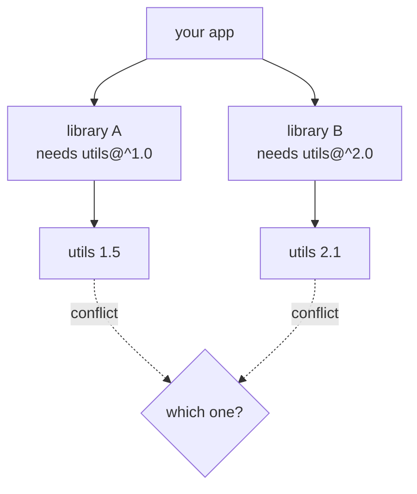

# Chapter 15 · Packages

[简体中文](./15-packages.md) ｜ **English**

---

> The previous chapter's modules organized code **inside** a project. This chapter tackles: **how do you use code other people wrote?**
>
> It looks like the trivial matter of "downloading a library," but behind it lies one of modern software engineering's hardest problems: how versions are labeled, what to do about dependencies of dependencies, what happens when two libraries demand different versions of the same package — and: **do you really know whose code is running in your project?**
>
> This is Part 2's closing chapter.

## 1. Learning Objectives

By the end of this chapter, you will be able to:

- State the difference between packages and modules: **a package = a set of modules + metadata (version, dependencies, license)**;
- Read and use **semantic versioning** correctly, explaining what `^1.2.3` and `~1.2.3` each allow;
- Explain why a **lock file** is the key to reproducible builds;
- Explain **dependency hell** (the diamond problem) and how each language's package manager resolves it differently;
- Develop **supply-chain security** awareness and know the basic defenses.

---

## 2. Why This Concept Exists

Before package managers, using someone else's code looked like this:

```text
1. Visit a website and download library-v2.3.zip
2. Unzip it and copy the files into your project
3. Discover it depends on another library → download that too
4. Six months later there's a security fix → repeat everything by hand
5. Your colleague's machine has a different version → "works on my machine"
```

Package managers automate all of it:

```bash
npm install lodash        # one command: download, install transitive deps, record versions
```

They solve four problems:

1. **Distribution** — where to download from, and how to verify integrity;
2. **Versioning** — how to label versions and express "which range I accept";
3. **Transitive dependencies** — dependencies of dependencies, installed automatically;
4. **Reproducibility** — guaranteeing everyone, everywhere, gets **exactly the same thing**.

**Packages vs. modules**: a module is a unit of code organization at the **language level**; a package is a unit at the **distribution level** — a set of modules plus metadata describing itself.

---

## 3. How It Works

### A package = modules + metadata

Every package carries an "ID card" (the real structure produced by `npm init -y`):

```json
{
  "name": "my-lib",           // unique identifier
  "version": "1.0.0",         // version number
  "main": "index.js",         // entry module
  "dependencies": {           // whom I depend on
    "lodash": "^4.17.21"
  },
  "license": "MIT"            // license
}
```

The equivalents: `package.json` (npm), `pyproject.toml` (Python), `pom.xml` (Maven), `.csproj` (NuGet), `vcpkg.json` (C++).

### Semantic versioning: the ecosystem's contract language

**SemVer** uses three numbers to say "will this upgrade break your code?":

```text
    1  .  2  .  3
    ↑     ↑     ↑
 MAJOR MINOR PATCH
```

| Position | Incremented when | What it means for consumers |
|----------|-----------------|----------------------------|
| **MAJOR** | there are **breaking changes** | ⚠️ upgrading may break your code |
| **MINOR** | features are added, **backward compatible** | ✅ safe to upgrade |
| **PATCH** | bugs are fixed, **backward compatible** | ✅ you should upgrade |

**Version ranges** let you express which upgrades you accept (measured with npm's own semver library):

| Range | Allowed versions | Meaning |
|-------|-----------------|---------|
| `^1.2.3` | 1.2.3 / 1.2.9 / 1.3.0 / 1.9.9 | MINOR + PATCH upgrades, **never across MAJOR** |
| `~1.2.3` | 1.2.3 / 1.2.9 | **PATCH upgrades only** |
| `>=1.2.3` | everything (including 2.0.0) | risky: may pull in breaking changes |
| `1.2.3` | only 1.2.3 | fully pinned |

> ⚠️ **An easy thing to get wrong**: versions compare **numerically**, not as strings. Measured: `1.10.0 > 1.9.0` is **true** — string comparison would say the opposite (since `"1.1..." < "1.9..."`). Also, prereleases sort **before** their release: `1.0.0-beta < 1.0.0`.

### Dependency resolution and dependency hell

Real dependencies form a graph, not a list. When the same package is reached by different paths demanding different versions, you get the **diamond dependency** problem:



**Three languages, three completely different answers** — the comparison most worth remembering in this chapter:

| Ecosystem | Strategy | Result |
|-----------|----------|--------|
| **npm** | **nested installs**, multiple versions coexist | everything installs, but output grows and you may get "two instances of the same class" |
| **Maven** | **nearest wins** (shortest path in the dependency tree) | one version is forced, possibly incompatible for some library |
| **pip** | **one global version**; error out if unsolvable | clean, but conflicts are yours to resolve |

### Lock files: the key to reproducible builds

`package.json` records a **range** (`^1.2.3`), while the **lock file** records **exactly which version was installed**:

```text
package.json      →  "lodash": "^4.17.21"     (intent: anything in this range)
package-lock.json →  lodash pinned to 4.17.21 (fact: this is what was installed)
```

Without a lock file, you install 4.17.21 today and your colleague may get 4.18.0 next week — **same code, different behavior**. Therefore:

> **Lock files must be committed to version control.** This is the chapter's single most important practice.

The lock files: `package-lock.json` / `yarn.lock`, `poetry.lock` / a pinned `requirements.txt`, Maven's `dependencyManagement`, and `packages.lock.json` (NuGet).

---

## 4. JavaScript

**Package managers**: npm (bundled), yarn, pnpm. The largest ecosystem — and the easiest to let sprawl.

```bash
npm init -y                     # generate package.json
npm install lodash              # install and record in dependencies
npm install --save-dev jest     # dev dependency (not shipped to production)
npm ci                          # install exactly per the lock file (use this in CI)
npm audit                       # check for known vulnerabilities
```

```json
{
  "dependencies":    { "lodash": "^4.17.21" },   // needed at runtime
  "devDependencies": { "jest": "^29.0.0" }       // needed only for dev/testing
}
```

**npm's distinctive trait: multiple versions of one package can coexist.** Conflicting versions are nested inside their own `node_modules`:

```text
node_modules/
├── utils/          (1.5, for library A)
└── libB/
    └── node_modules/
        └── utils/  (2.1, for library B)
```

The upside is that "can't install" almost never happens; the cost is an enormous `node_modules` and the possibility of two mutually unaware instances of the same class.

> **Note**: `npm install` re-resolves ranges and may update the lock file; in CI use **`npm ci`**, which installs strictly from the lock file — faster and more reliable.

---

## 5. Python

**Package managers**: pip (the base), Poetry / PDM (modern), conda (data science).

```bash
pip install requests
pip install -r requirements.txt      # install from a manifest
pip freeze > requirements.txt        # export the exact current versions
```

**Virtual environments are mandatory in Python**, because pip installs globally by default and projects interfere:

```bash
python3 -m venv .venv                # create an isolated environment
source .venv/bin/activate            # activate (Windows: .venv\Scripts\activate)
```

**The modern way uses `pyproject.toml`** (the PEP 621 standard):

```toml
[project]
name = "my-app"
version = "1.0.0"
dependencies = [
    "requests>=2.28,<3.0",
    "pandas~=2.0",              # ~= is Python's own "compatible release" operator
]
```

**Python's versioning spec is PEP 440**, slightly different from SemVer (it supports `1.0.0.post1`, `2.0.0rc1`, and so on).

> ⚠️ **A crucial difference**: pip does **not** allow multiple versions of the same package in one environment. A conflict is simply an error you must reconcile by hand — which is why Python dependency conflicts hurt more than npm's.

---

## 6. Java

**Package managers**: Maven (`pom.xml`), Gradle (`build.gradle`).

```xml
<dependencies>
  <dependency>
    <groupId>com.google.guava</groupId>       <!-- organization -->
    <artifactId>guava</artifactId>            <!-- package name -->
    <version>32.1.3-jre</version>             <!-- version -->
    <scope>compile</scope>                    <!-- scope -->
  </dependency>
</dependencies>
```

**The coordinate triple `groupId:artifactId:version`** uniquely identifies a package — the reversed-domain tradition (Chapter 14) carried forward.

**Maven's conflict resolution: nearest wins**

```text
your project → A → utils 1.0      (depth 2)
your project → utils 2.0           (depth 1) ← wins
```

The shorter path wins. Use `mvn dependency:tree` to inspect the full tree and `<exclusions>` to drop unwanted transitive dependencies.

**Maven has a local repository** (`~/.m2/repository`) shared by all projects — a sharp contrast with npm's per-project `node_modules`.

> **Note**: `<scope>` matters — `compile` (default: compile and run), `test` (tests only), `provided` (needed to compile but supplied by the container at runtime). Getting it wrong bloats your artifact or causes missing classes at runtime.

---

## 7. C++

**C++ long had no official package manager** — its biggest divergence from the other five.

```text
The traditional way: download sources by hand → compile them yourself → configure include and library paths manually
```

Modern options (all third-party):

```bash
# vcpkg (Microsoft)
vcpkg install fmt

# Conan
conan install .
```

```json
// vcpkg.json — a declarative dependency manifest
{
  "name": "my-app",
  "version": "1.0.0",
  "dependencies": [ "fmt", "nlohmann-json" ]
}
```

**Why is C++ package management so hard?** The root cause is the compilation model from Chapter 14:

- packages must be compiled **per platform, per compiler, per set of flags** (ABI incompatibility);
- headers plus static/shared libraries combine in many ways;
- there is no single build system (CMake, Make, and Bazel coexist).

So a C++ package manager must also manage **the build**, making it far more complex than its counterparts.

> **Note**: C++ projects typically pair CMake with vcpkg/Conan. Include paths, library paths, and flags must all line up — "getting it to compile" is itself an engineering task.

---

## 8. C#

**Package manager**: NuGet, deeply integrated with .NET.

```bash
dotnet add package Newtonsoft.Json          # add a dependency
dotnet restore                               # restore dependencies
dotnet list package --vulnerable             # check for vulnerabilities
```

```xml
<!-- .csproj -->
<ItemGroup>
  <PackageReference Include="Newtonsoft.Json" Version="13.0.3" />
</ItemGroup>
```

**NuGet's range syntax** uses interval notation, closer to mathematics than npm's:

| Notation | Meaning |
|----------|---------|
| `13.0.3` | minimum version (resolves to the lowest available ≥13.0.3) |
| `[13.0.3]` | exactly pinned |
| `[13.0,14.0)` | ≥13.0 and <14.0 (brackets inclusive, parentheses exclusive) |

**Conflict resolution** resembles Maven's nearest-wins, with warnings when a version is downgraded.

> **Note**: `dotnet restore` resolves ranges by default. For reproducibility, enable lock files (`RestorePackagesWithLockFile`), then commit the generated `packages.lock.json`.

---

## 9. SQL

Databases have no package manager in the traditional sense, yet they face **the same reuse and versioning problems**, with two answers.

### ① Database extensions

```sql
-- PostgreSQL: install official or third-party extensions
CREATE EXTENSION IF NOT EXISTS pgcrypto;     -- cryptographic functions
CREATE EXTENSION IF NOT EXISTS postgis;      -- geospatial support
SELECT * FROM pg_available_extensions;       -- list what's available
```

These are a database's "packages" — supplied by the vendor or community, adding new functions and types once installed.

### ② Database migrations: version control for schemas

This is the more important one. **A database's structure needs versioning too**, via tools like Flyway, Liquibase, or Alembic:

```text
migrations/
├── V1__create_student_table.sql
├── V2__add_email_column.sql
└── V3__create_index_on_score.sql
```

The tool maintains a version table inside the database recording "which version we're at," guaranteeing that:

- each migration runs **exactly once**;
- every environment (dev/test/prod) ends up with **identical** schemas;
- changes are traceable and reversible.

**This is the same idea as a lock file in the code world**: record precisely what the current state is, so every environment can reproduce it.

```sql
-- the version table a migration tool maintains looks roughly like this
CREATE TABLE schema_version (
    version     TEXT PRIMARY KEY,
    description TEXT,
    applied_at  TEXT
);
```

> **Engineering note**: **never modify a production schema by hand.** All changes should go through migration scripts, versioned, reviewed, and applied in order — the same reasoning as "don't copy library code into your project by hand."

---

## 10. Cross-Language Comparison

### ① Package managers

| Feature | JavaScript | Python | Java | C++ | C# |
|---------|-----------|--------|------|-----|-----|
| Main tools | npm / yarn / pnpm | pip / Poetry | Maven / Gradle | vcpkg / Conan | NuGet |
| Manifest | `package.json` | `pyproject.toml` | `pom.xml` | `vcpkg.json` | `.csproj` |
| Lock file | `package-lock.json` | `poetry.lock` | none (uses `dependencyManagement`) | yes (version manifest) | `packages.lock.json` |
| Officially bundled | ✅ | ✅ | ✅ | ❌ **none official** | ✅ |
| **Multiple versions coexist** | ✅ nested | ❌ | ❌ | ❌ | ❌ |
| Conflict strategy | nested coexistence | error; resolve by hand | nearest wins | tool-dependent | nearest wins + warning |
| Where deps live | one `node_modules` per project | virtual environment | shared global `~/.m2` | global or per project | shared global `~/.nuget` |

### ② The same task, five ways

Adding a dependency:

```bash
npm install lodash                                    # JavaScript
pip install requests                                  # Python
# Java: add a <dependency> block to pom.xml
vcpkg install fmt                                     # C++
dotnet add package Newtonsoft.Json                    # C#
```

### ③ Commonalities and the root of differences

**In common**: all follow "declare dependencies in a manifest + let a tool resolve transitives + fetch from a central registry," all use some range syntax, and all face conflicts and supply-chain risk.

**The differences**:
- **Whether multiple versions may coexist** is the great divide. npm's nesting makes "can't install" almost impossible, at the cost of size and possible instance mismatches; the rest insist on a single version — cleaner, but more painful on conflict;
- **C++ has no official package manager** because of its compilation model: packages must be built per platform/compiler/flags, far more complex than elsewhere;
- **Where dependencies live** (per project vs. globally shared) directly affects disk usage and build speed.

---

## 11. Underlying Implementation Comparison

| Ecosystem | How resolution works |
|-----------|---------------------|
| **npm** | walk the dependency tree → **flatten** to the top-level `node_modules` where possible → nest conflicting versions → write the lock file |
| **pip** | resolve dependencies → backtrack to find one **globally compatible** set of versions → error out if none exists (modern pip tries many combinations) |
| **Maven** | build the dependency tree → resolve conflicts by **nearest wins** → fetch from the local or remote repository |
| **NuGet** | similar to Maven, nearest wins → warns on downgrades |
| **vcpkg** | download sources → **compile on the spot** for your platform and flags → cache the artifacts |

**A key distinction**: npm/pip/Maven/NuGet distribute **prebuilt artifacts** (JS source, wheels, jars, dlls), while **vcpkg often distributes source that must be compiled on your machine** — precisely why C++ package management is slow and complex.

---

## 12. Performance Analysis

| Dimension | Notes |
|-----------|-------|
| **Install speed** | pnpm > npm > yarn (pnpm hard-links from a global store, avoiding duplicate copies) |
| **Disk usage** | npm keeps a `node_modules` per project (often hundreds of MB); Maven/NuGet share globally |
| **First C++ install** | requires local compilation, sometimes tens of minutes |
| **CI builds** | lock files plus caching can cut dependency install time by 50%–90% |

**Practical optimizations**:

```bash
npm ci                      # faster than npm install and strictly follows the lock file
pip install --no-deps       # skip resolution when you know the deps are complete
mvn -o                      # offline mode, local repository only
```

**Dependency size is a performance issue too**: every front-end dependency is more code your users download. Periodically review with `npm ls` and bundle analyzers: "do I really need this package?"

---

## 13. Engineering Practice

| Scenario | ✅ Recommended | ❌ Discouraged | Why |
|----------|---------------|---------------|-----|
| Lock files | **commit them** | adding them to `.gitignore` | without them there is no reproducible build |
| CI installs | `npm ci` / `pip install -r` (pinned) | `npm install` | guarantees parity with local |
| Version ranges | `^` for apps; looser for libraries | `>=` in an app | apps need stability, libraries need compatibility |
| Python environments | **one virtualenv per project** | global `pip install` | avoids cross-project pollution |
| Number of dependencies | ask "is it worth it?" first | a whole package for one small function | every dependency is long-term debt |
| Security | run `npm audit` / `dotnet list package --vulnerable` regularly | install and forget | known vulnerabilities get exploited automatically |
| Upgrades | small and regular | one giant upgrade every two years | the longer you wait, the harder it gets |
| Production deps | separate `dependencies` from `devDependencies` strictly | everything in dependencies | smaller artifacts and attack surface |

### Supply-chain security: a real lesson

In 2016, a developer unpublished his npm package **left-pad** — 11 lines that pad a string on the left. **Thousands of projects (including the Babel and React ecosystems) broke instantly**, because they depended on it indirectly.

The incident exposed how fragile modern dependency graphs are: **your project may run hundreds of packages you have never heard of**. Basic defenses:

- **lock files plus integrity hashes**;
- **regular audits** for known vulnerabilities;
- **beware typosquatting** (e.g. `1odash` instead of `lodash`);
- **assess dependency quality**: active maintenance, download counts, license compatibility.

---

## 14. Best Practices

- **Don't add a dependency if you can avoid it**: you take on the package, all of its dependencies, and long-term maintenance.
- **Always commit the lock file**, and install strictly in CI.
- **Upgrade regularly in small steps**: a quarterly upgrade beats being forced into a giant rewrite three years later.
- **Read the license**: GPL-family licenses may require open-sourcing your project; confirm before shipping commercially.
- **Separate dev and production dependencies.**
- **Read the CHANGELOG before a MAJOR upgrade** — by SemVer's contract, MAJOR means breaking changes exist.
- **Follow SemVer strictly when publishing**: if you break compatibility, bump MAJOR; don't sneak it into a PATCH.

---

## 15. Common Pitfalls

**Pitfall 1 · Not committing the lock file**

```text
you: lodash 4.17.21   colleague: 4.18.0   production: 4.17.5
→ "works on my machine"
```
**How to avoid**: commit `package-lock.json` / `poetry.lock`.

**Pitfall 2 · Comparing versions as strings**

```javascript
"1.10.0" > "1.9.0"           // false ← string comparison, wrong
semver.gt("1.10.0","1.9.0")  // true  ← numeric comparison, correct
```
**How to avoid**: use a real semver library; never hand-roll the comparison.

**Pitfall 3 · Using `>=` or `*` as a range**

```json
{ "dependencies": { "some-lib": ">=1.0.0" } }   // one day it installs 3.0.0 → everything breaks
```
**How to avoid**: use `^` in applications (never crossing MAJOR), or pin outright.

**Pitfall 4 · Skipping virtual environments in Python**

```text
project A needs django 3.x, project B needs django 4.x
→ a global install has them overwrite each other
```
**How to avoid**: `python3 -m venv .venv` per project.

**Pitfall 5 · Installing a typosquatted package**

```bash
npm install crossenv        # ✗ a real malicious package once existed (the real one is cross-env)
```
**How to avoid**: copy the install command from official docs rather than typing it; check downloads and publisher.

**Pitfall 6 · Putting a dependency in the wrong category**

```json
{ "dependencies": { "jest": "^29.0.0" } }    // a test framework in production deps
```
**How to avoid**: `npm install --save-dev`; in Maven use `<scope>test</scope>`.

**Pitfall 7 · Editing a production schema by hand**

```text
running ALTER TABLE directly in production → environments drift apart with no record
```
**How to avoid**: always go through migration scripts under version control.

---

## 16. Interview Questions

**Basic**

1. What is the difference between a package and a module?
2. When is each of `MAJOR.MINOR.PATCH` incremented?
3. Why must lock files be committed to version control?

**Intermediate**

4. Which versions do `^1.2.3` and `~1.2.3` each allow? Give examples.
5. What is a diamond dependency? How do npm, Maven, and pip each resolve it?
6. What is the difference between `npm install` and `npm ci`? Which belongs in CI?

**Advanced**

7. Why did C++ go so long without an official package manager? How does this relate to its compilation model?
8. npm lets multiple versions of one package coexist — what does that buy, and what does it risk?
9. Using the left-pad incident, discuss modern supply-chain risk and the engineering defenses that follow.

---

## 17. Exercises

**Basic**

1. Run `npm init -y` and study each field of the generated `package.json`.
2. Write out which versions these ranges match: `^0.2.3`, `~1.0.0`, `>=2.0.0 <3.0.0`. (Hint: `^0.x` behaves specially!)
3. Create a virtual environment for a Python project, install a package, and inspect the `.venv` layout.

**Intermediate**

4. Implement your own SemVer comparison that correctly handles `1.10.0 > 1.9.0` and prereleases.
5. Construct a diamond dependency (local packages will do) and observe how your package manager resolves it.
6. Run `npm audit` or `dotnet list package --vulnerable` on an existing project, read the report, and fix one issue.

**Challenge**

7. Write a simple dependency resolver: given packages and their version ranges, output a set of versions satisfying every constraint (hint: this is a constraint satisfaction problem).
8. Design three migrations for a small database (create table → add column → add index) and implement a runner that records versions and never re-applies one.

---

## 18. Summary

**In one sentence**: a package is **modules plus metadata**, the unit of cross-project reuse; **semantic versioning** is the ecosystem's contract language, the **lock file** guarantees reproducible builds, and **dependency conflicts** are resolved very differently across languages — npm lets versions coexist, Maven/NuGet pick the nearest, and pip demands one global version.

**Core takeaways**

- A module is a **language-level** unit; a package is a **distribution-level** one.
- SemVer: MAJOR breaks, MINOR adds, PATCH fixes; `^` allows MINOR+PATCH, `~` allows PATCH only.
- Versions compare **numerically** (`1.10.0 > 1.9.0`), and prereleases sort before releases.
- **Lock files must be committed** — the cure for "works on my machine."
- C++ has no official package manager because of its compilation model (built per platform/compiler).
- Supply-chain security is a real risk: left-pad, typosquatting, known vulnerabilities.

**Checklist**

- [ ] I can state the difference between packages and modules.
- [ ] I can explain `^1.2.3` versus `~1.2.3` and which versions each matches.
- [ ] I know why lock files are committed and which install command belongs in CI.
- [ ] I can explain diamond dependencies and how three ecosystems resolve them.
- [ ] I know the basic supply-chain defenses to put in place.

---

## 🎉 Part 2 Complete

With this, **Part 2 "Language Basics" is finished**. Looking back at the thread:

```text
08 Variables     → naming data
09 Data Types    → how the bits behind a name are interpreted
10 Operators     → operating on those values
11 Control Flow  → letting programs choose and repeat
12 Functions     → naming a piece of logic
13 Scope         → the visibility range of a name
14 Modules       → scope scaled up to files
15 Packages      → modules scaled up to a whole ecosystem
```

**From a single variable name all the way out to a globally shared software ecosystem** — these eight chapters were really about one thing: **how to name things, how to draw boundaries, and how to manage complexity.**

**Coming next**: Part 3, "Data Structures." When data is no longer a single value but thousands of records, how do you store it, find it, and order it? Why are arrays fast, linked lists flexible, and how do hash tables reach O(1)? We start with Chapter 16, "Array."

---

## 19. Further Reading

- <a href="https://semver.org/" target="_blank" rel="noopener">Semantic Versioning (SemVer)</a> — the original spec; short enough to read end to end.
- <a href="https://docs.npmjs.com/about-semantic-versioning" target="_blank" rel="noopener">npm docs · About semantic versioning</a> — the official account of `^`, `~`, and other ranges.
- <a href="https://peps.python.org/pep-0440/" target="_blank" rel="noopener">PEP 440 · Version Identification</a> — Python's versioning scheme and how it differs from SemVer.
- <a href="https://packaging.python.org/en/latest/tutorials/managing-dependencies/" target="_blank" rel="noopener">Python Packaging Guide · Managing dependencies</a> — virtual environments and modern dependency management.
- <a href="https://maven.apache.org/guides/introduction/introduction-to-dependency-mechanism.html" target="_blank" rel="noopener">Maven docs · Dependency mechanism</a> — including the nearest-wins rule.
- <a href="https://learn.microsoft.com/en-us/nuget/concepts/package-versioning" target="_blank" rel="noopener">Microsoft Learn · NuGet package versioning</a> — interval notation and conflict resolution.
- <a href="https://en.wikipedia.org/wiki/Dependency_hell" target="_blank" rel="noopener">Wikipedia: Dependency hell</a> — the forms of dependency conflict and how they're mitigated.
