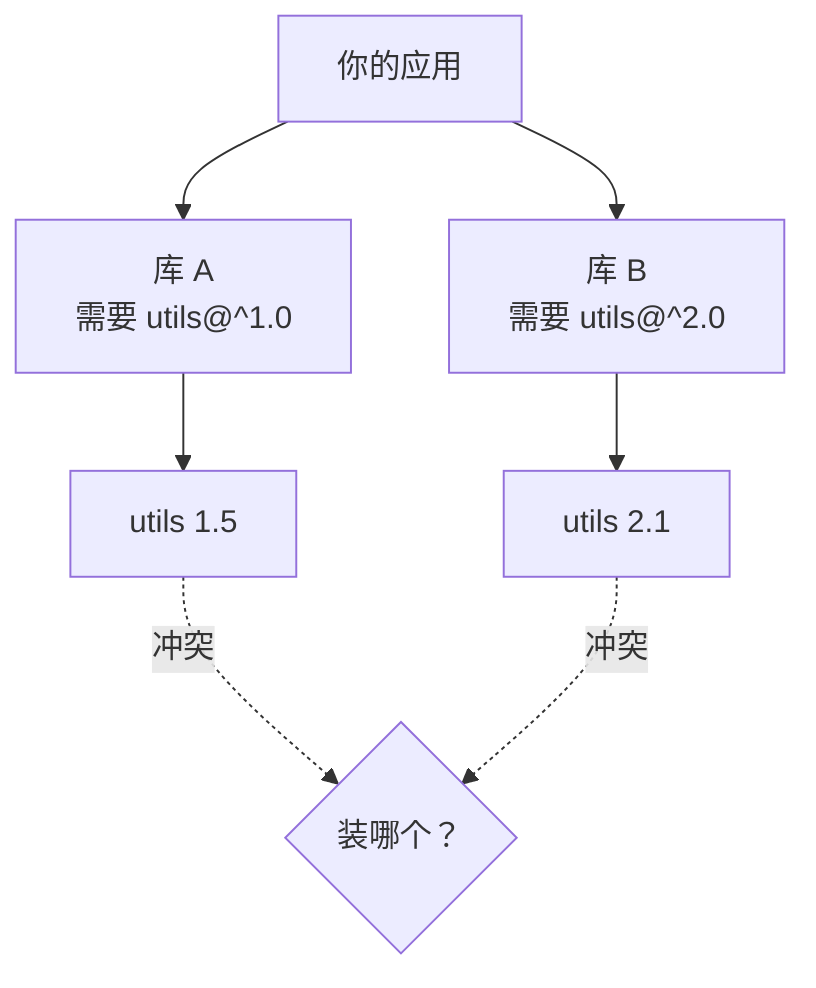

# 第 15 章 · 包

**简体中文** ｜ [English](./15-packages.en-US.md)

---

> 上一章的模块解决了**项目内部**的代码组织。这一章要解决的是：**怎么用别人写的代码？**
>
> 这看似只是"下载个库"的小事，背后却是现代软件工程最复杂的问题之一：版本怎么标记、依赖的依赖怎么办、两个库要求同一个包的不同版本时怎么办、以及——**你真的知道自己的项目里跑着谁的代码吗？**
>
> 这是 Part 2 的收官之章。

## 1. 学习目标

本章结束后，你将能够：

- 说清包与模块的区别：**包 = 模块集合 + 元数据（版本、依赖、许可）**；
- 读懂并正确使用**语义化版本**，解释 `^1.2.3` 和 `~1.2.3` 分别允许升级到哪；
- 说明**锁文件**为什么是可重现构建的关键；
- 解释**依赖地狱**（菱形依赖），并说出各语言包管理器的不同解决策略；
- 建立**供应链安全**意识，知道该做哪些基本防护。

---

## 2. 为什么会出现这个概念

没有包管理器的年代，用别人的代码是这样的：

```text
1. 去网站下载 library-v2.3.zip
2. 解压，把文件复制进自己的项目
3. 发现它还依赖另一个库 → 再下载一次
4. 半年后有安全更新 → 手工重复上述全部步骤
5. 同事的机器上版本不一样 → "在我这儿是好的啊"
```

包管理器把这一切自动化了：

```bash
npm install lodash        # 一条命令：下载、装依赖的依赖、记录版本
```

它解决四个问题：

1. **分发**——从哪里下载，怎么验证完整性；
2. **版本**——用什么标记版本，怎么表达"我要哪个范围"；
3. **传递依赖**——依赖的依赖，自动装好；
4. **可重现**——保证所有人、所有环境装到**完全相同**的东西。

**包与模块的区别**：模块是**语言层面**的代码组织单位；包是**分发层面**的单位——它是一组模块，外加描述自己的元数据。

---

## 3. 底层原理

### 包 = 模块 + 元数据

每个包都有一份"身份证"（实测 `npm init -y` 生成的真实结构）：

```json
{
  "name": "my-lib",           // 唯一标识
  "version": "1.0.0",         // 版本号
  "main": "index.js",         // 入口模块
  "dependencies": {           // 我依赖谁
    "lodash": "^4.17.21"
  },
  "license": "MIT"            // 许可协议
}
```

各语言的对应文件：`package.json`（npm）、`pyproject.toml`（Python）、`pom.xml`（Maven）、`.csproj`（NuGet）、`vcpkg.json`（C++）。

### 语义化版本：生态的契约语言

**SemVer** 用三个数字表达"这次升级会不会破坏你的代码"：

```text
    1  .  2  .  3
    ↑     ↑     ↑
 MAJOR MINOR PATCH
```

| 位 | 什么时候加一 | 对使用者意味着 |
|----|------------|--------------|
| **MAJOR** | 有**破坏性变更** | ⚠️ 升级可能导致你的代码报错 |
| **MINOR** | 新增功能，**向后兼容** | ✅ 可以安全升级 |
| **PATCH** | 修 bug，**向后兼容** | ✅ 应该升级 |

**版本范围**让你表达"我能接受哪些升级"（用 npm 自带的 semver 库实测）：

| 范围 | 允许的版本 | 含义 |
|------|-----------|------|
| `^1.2.3` | 1.2.3 / 1.2.9 / 1.3.0 / 1.9.9 | 允许 MINOR + PATCH 升级，**不跨 MAJOR** |
| `~1.2.3` | 1.2.3 / 1.2.9 | **只允许 PATCH 升级** |
| `>=1.2.3` | 全部（含 2.0.0） | 危险：可能引入破坏性变更 |
| `1.2.3` | 只有 1.2.3 | 完全锁死 |

> ⚠️ **一个容易搞错的点**：版本号按**数字**比较，不是字符串。实测 `1.10.0 > 1.9.0` 为**真**——若按字符串比较会得出相反结论（因为 `"1.1..." < "1.9..."`）。另外，预发布版排在正式版**之前**：`1.0.0-beta < 1.0.0`。

### 依赖解析与依赖地狱

真实项目的依赖不是一层，而是一张图。当同一个包被不同路径依赖到、且要求的版本不同，就出现了**菱形依赖**：



**三种语言，三种截然不同的解法**——这是本章最值得记住的对比：

| 生态 | 策略 | 结果 |
|------|------|------|
| **npm** | **嵌套安装**，允许多版本共存 | 都能装上，但产物变大，可能出现"同一个类的两份实例" |
| **Maven** | **最近者优先**（依赖树中路径最短的胜出） | 强制统一版本，可能导致某个库拿到不兼容的版本 |
| **pip** | **全局唯一版本**，解不开就报错 | 干净，但冲突时得你自己解决 |

### 锁文件：可重现构建的关键

`package.json` 写的是**范围**（`^1.2.3`），而**锁文件**记录的是**实际装了哪个精确版本**：

```text
package.json   →  "lodash": "^4.17.21"      （意图：这个范围都行）
package-lock.json →  lodash 锁定在 4.17.21   （事实：这次装的就是它）
```

没有锁文件，你今天装的是 4.17.21，同事下周装可能就是 4.18.0——**同样的代码，不同的行为**。所以：

> **锁文件必须提交到版本控制。** 这是本章最重要的一条工程实践。

各语言的锁文件：`package-lock.json` / `yarn.lock`、`poetry.lock` / `requirements.txt`（钉死版本）、Maven 的 `dependencyManagement`、`packages.lock.json`（NuGet）。

---

## 4. JavaScript

**包管理器**：npm（内置）、yarn、pnpm。生态规模最大，也最容易失控。

```bash
npm init -y                     # 生成 package.json
npm install lodash              # 安装并写入 dependencies
npm install --save-dev jest     # 开发依赖（不进生产环境）
npm ci                          # 按锁文件精确安装（CI 中应该用这个）
npm audit                       # 检查已知安全漏洞
```

```json
{
  "dependencies":    { "lodash": "^4.17.21" },   // 运行时需要
  "devDependencies": { "jest": "^29.0.0" }       // 只在开发/测试时需要
}
```

**npm 的独特之处：允许同一个包的多个版本共存**。它把冲突的版本嵌套安装在各自的 `node_modules` 里：

```text
node_modules/
├── utils/          (1.5，给库 A 用)
└── libB/
    └── node_modules/
        └── utils/  (2.1，给库 B 用)
```

好处是几乎不会出现"装不上"，代价是 `node_modules` 极其庞大，且可能出现同一个类有两份互不认识的实例。

> **注意事项**：`npm install` 会按范围重新解析并可能更新锁文件；CI 环境请用 **`npm ci`**，它严格按锁文件安装，更快也更可靠。

---

## 5. Python

**包管理器**：pip（基础）、Poetry / PDM（现代）、conda（数据科学）。

```bash
pip install requests
pip install -r requirements.txt      # 从清单安装
pip freeze > requirements.txt        # 导出当前精确版本
```

**虚拟环境是 Python 的必修课**——因为 pip 默认装到全局，不同项目会互相干扰：

```bash
python3 -m venv .venv                # 创建隔离环境
source .venv/bin/activate            # 激活（Windows: .venv\Scripts\activate）
```

**现代方式用 `pyproject.toml`**（PEP 621 标准）：

```toml
[project]
name = "my-app"
version = "1.0.0"
dependencies = [
    "requests>=2.28,<3.0",
    "pandas~=2.0",              # ~= 是 Python 特有的"兼容版本"运算符
]
```

**Python 的版本规范是 PEP 440**，与 SemVer 略有不同（比如支持 `1.0.0.post1`、`2.0.0rc1`）。

> ⚠️ **关键差异**：pip **不允许同一个包有多个版本**共存于一个环境。遇到冲突只能报错，需要你手动协调——这是 Python 依赖冲突比 npm 更"疼"的原因。

---

## 6. Java

**包管理器**：Maven（`pom.xml`）、Gradle（`build.gradle`）。

```xml
<dependencies>
  <dependency>
    <groupId>com.google.guava</groupId>       <!-- 组织 -->
    <artifactId>guava</artifactId>            <!-- 包名 -->
    <version>32.1.3-jre</version>             <!-- 版本 -->
    <scope>compile</scope>                    <!-- 作用范围 -->
  </dependency>
</dependencies>
```

**坐标三元组 `groupId:artifactId:version`** 唯一确定一个包——反写域名的传统（第 14 章）在这里延续。

**Maven 的冲突解决：最近者优先（nearest wins）**

```text
你的项目 → A → utils 1.0      （深度 2）
你的项目 → utils 2.0           （深度 1）← 胜出
```

路径更短的版本获胜。可以用 `mvn dependency:tree` 查看完整依赖树，用 `<exclusions>` 排除不想要的传递依赖。

**Maven 有本地仓库**（`~/.m2/repository`），所有项目共享已下载的包——这与 npm 每个项目一份 `node_modules` 形成鲜明对比。

> **注意事项**：`<scope>` 很重要——`compile`（默认，编译+运行）、`test`（仅测试）、`provided`（编译时需要但运行时由容器提供）。用错会导致打包体积膨胀或运行时缺类。

---

## 7. C++

**C++ 长期没有官方包管理器**，这是它与其他五门语言最大的差异。

```text
传统做法：手工下载源码 → 自己编译 → 手工配置头文件路径和链接库
```

现代方案（都是第三方）：

```bash
# vcpkg（微软）
vcpkg install fmt

# Conan
conan install .
```

```json
// vcpkg.json —— 声明式依赖清单
{
  "name": "my-app",
  "version": "1.0.0",
  "dependencies": [ "fmt", "nlohmann-json" ]
}
```

**为什么 C++ 这么难做包管理**？根源在第 14 章讲过的编译模型：

- 包必须**为每个平台、每个编译器、每套编译选项**分别编译（ABI 不兼容）；
- 头文件 + 静态库/动态库的组合方式繁多；
- 没有统一的构建系统（CMake、Make、Bazel 并存）。

所以 C++ 的包管理器本质上还要管**构建**，复杂度远超其他语言。

> **注意事项**：C++ 项目通常用 CMake 配合 vcpkg/Conan。头文件路径、库路径、编译选项都要正确配置，"能编译"本身就是一项工程。

---

## 8. C#

**包管理器**：NuGet，与 .NET 深度集成。

```bash
dotnet add package Newtonsoft.Json          # 添加依赖
dotnet restore                               # 恢复依赖
dotnet list package --vulnerable             # 检查漏洞
```

```xml
<!-- .csproj -->
<ItemGroup>
  <PackageReference Include="Newtonsoft.Json" Version="13.0.3" />
</ItemGroup>
```

**NuGet 的版本范围语法**（用区间记号，比 npm 更接近数学表达）：

| 写法 | 含义 |
|------|------|
| `13.0.3` | 最低版本（实际会选 ≥13.0.3 的最低可用版本） |
| `[13.0.3]` | 精确锁定 |
| `[13.0,14.0)` | ≥13.0 且 <14.0（方括号闭区间、圆括号开区间） |

**冲突解决**与 Maven 类似，采用"最近者优先"，并会在版本降级时给出警告。

> **注意事项**：`dotnet restore` 默认按范围解析。要保证可重现，需启用锁文件（`RestorePackagesWithLockFile`），生成 `packages.lock.json` 并提交。

---

## 9. SQL

数据库没有传统意义上的包管理器，但**同样面临"复用"与"版本"问题**，解法有两条。

### ① 数据库扩展

```sql
-- PostgreSQL：安装官方或第三方扩展
CREATE EXTENSION IF NOT EXISTS pgcrypto;     -- 加密函数
CREATE EXTENSION IF NOT EXISTS postgis;      -- 地理信息
SELECT * FROM pg_available_extensions;       -- 查看可用扩展
```

这相当于数据库的"包"——由数据库厂商或社区提供，安装后获得新的函数和类型。

### ② 数据库迁移：schema 的版本管理

这是更重要的一条。**数据库结构本身也需要版本控制**，工具有 Flyway、Liquibase、Alembic 等：

```text
migrations/
├── V1__create_student_table.sql
├── V2__add_email_column.sql
└── V3__create_index_on_score.sql
```

工具会在数据库里维护一张版本表，记录"已经执行到第几版"，从而保证：

- 每个迁移**只执行一次**；
- 所有环境（开发/测试/生产）的 schema **完全一致**；
- 变更过程可追溯、可回滚。

**这与代码世界的锁文件是同一种思想**：把"当前是什么状态"精确记录下来，让所有环境可重现。

```sql
-- 迁移工具维护的版本表大致长这样
CREATE TABLE schema_version (
    version     TEXT PRIMARY KEY,
    description TEXT,
    applied_at  TEXT
);
```

> **工程提醒**：**永远不要手工改生产库的结构**。所有变更都应通过迁移脚本，纳入版本控制、经过评审、按顺序执行——这和"不要手工往项目里复制粘贴库代码"是同一个道理。

---

## 10. 五语言横向对比

### ① 包管理器对比

| 特性 | JavaScript | Python | Java | C++ | C# |
|------|-----------|--------|------|-----|-----|
| 主流工具 | npm / yarn / pnpm | pip / Poetry | Maven / Gradle | vcpkg / Conan | NuGet |
| 清单文件 | `package.json` | `pyproject.toml` | `pom.xml` | `vcpkg.json` | `.csproj` |
| 锁文件 | `package-lock.json` | `poetry.lock` | 无（用 `dependencyManagement`） | 有（版本清单） | `packages.lock.json` |
| 官方内置 | ✅ | ✅ | ✅ | ❌ **无官方** | ✅ |
| **多版本共存** | ✅ 嵌套 | ❌ | ❌ | ❌ | ❌ |
| 冲突策略 | 嵌套共存 | 报错，需手动解决 | 最近者优先 | 由工具决定 | 最近者优先 + 警告 |
| 依赖存放 | 每项目一份 `node_modules` | 虚拟环境 | 全局 `~/.m2` 共享 | 全局或项目 | 全局 `~/.nuget` 共享 |

### ② 同一件事的五种写法

添加一个依赖：

```bash
npm install lodash                                    # JavaScript
pip install requests                                  # Python
# Java：在 pom.xml 中添加 <dependency> 块
vcpkg install fmt                                     # C++
dotnet add package Newtonsoft.Json                    # C#
```

### ③ 共同点与差异根源

**共同点**：都用"清单文件声明依赖 + 工具自动解析传递依赖 + 中央仓库分发"这套模式，都采用某种版本范围语法，也都面临依赖冲突与供应链安全问题。

**差异根源**：
- **是否允许多版本共存**是最大分野。npm 的嵌套方案让"装不上"几乎不存在，代价是体积与潜在的实例不一致；其余语言坚持单一版本，更干净但冲突时更痛；
- **C++ 没有官方包管理器**，源于它的编译模型——包必须按平台/编译器/选项分别构建，复杂度远高于其他语言；
- **依赖存放位置**（每项目 vs 全局共享）直接影响磁盘占用和构建速度。

---

## 11. 底层实现对比

| 生态 | 依赖解析过程 |
|------|-------------|
| **npm** | 递归拉取依赖树 → 尽量**扁平化**到顶层 `node_modules` → 版本冲突的嵌套安装 → 写入锁文件 |
| **pip** | 解析依赖 → 用回溯算法找一组**全局兼容**的版本 → 解不开就报错（新版 pip 的解析器会尝试多种组合） |
| **Maven** | 构建依赖树 → **最近者优先**裁决冲突 → 从本地仓库或远程拉取 |
| **NuGet** | 类似 Maven，最近者优先 → 版本降级时发出警告 |
| **vcpkg** | 下载源码 → **按当前平台和编译选项现场编译** → 缓存产物 |

**一个关键区别**：npm/pip/Maven/NuGet 分发的是**已构建好的产物**（JS 源码、wheel、jar、dll），而 **vcpkg 分发的往往是源码，需要在你的机器上编译**——这正是 C++ 包管理慢且复杂的根本原因。

---

## 12. 性能分析

| 维度 | 说明 |
|------|------|
| **安装速度** | pnpm > npm > yarn（pnpm 用硬链接共享全局存储，避免重复复制） |
| **磁盘占用** | npm 每项目一份 `node_modules`（可达数百 MB）；Maven/NuGet 全局共享 |
| **C++ 首次安装** | 需现场编译，可能耗时数十分钟 |
| **CI 构建** | 用锁文件 + 缓存可节省 50%–90% 的依赖安装时间 |

**实用优化**：

```bash
npm ci                      # 比 npm install 快，且严格遵循锁文件
pip install --no-deps       # 已知依赖完整时跳过解析
mvn -o                      # 离线模式，只用本地仓库
```

**依赖体积也是性能问题**：前端每多一个依赖，用户就要多下载一份代码。定期用 `npm ls`、打包分析工具审视"我真的需要这个包吗"。

---

## 13. 工程实践

| 场景 | ✅ 推荐 | ❌ 不推荐 | 原因 |
|------|--------|----------|------|
| 锁文件 | **提交到版本控制** | 加进 `.gitignore` | 没有它就没有可重现构建 |
| CI 安装 | `npm ci` / `pip install -r`（钉死版本） | `npm install` | 保证与本地完全一致 |
| 版本范围 | 应用用 `^`，库尽量宽松 | 应用用 `>=` | 应用要稳定，库要兼容 |
| Python 环境 | **每个项目一个虚拟环境** | 全局 pip install | 避免项目间互相污染 |
| 依赖数量 | 引入前先问"值得吗" | 为一个小函数装一个包 | 每个依赖都是长期负债 |
| 安全 | 定期 `npm audit` / `dotnet list package --vulnerable` | 装了就不管 | 已知漏洞会被自动化攻击 |
| 升级 | 小步、定期升级 | 攒两年一次性大升级 | 积累越久越难升 |
| 生产依赖 | 严格区分 `dependencies` 与 `devDependencies` | 全塞进 dependencies | 减小生产产物与攻击面 |

### 供应链安全：一个真实的教训

2016 年，一位开发者从 npm 撤下了自己名为 **left-pad** 的包——它只有 11 行代码，功能是给字符串左侧补空格。结果**成千上万个项目（包括 Babel、React 生态）当场构建失败**，因为它们间接依赖了这个包。

这件事暴露了现代依赖体系的脆弱：**你的项目里可能跑着几百个你从没听说过的包**。基本防护：

- **锁文件 + 完整性校验**（`integrity` 哈希）；
- **定期审计**已知漏洞；
- **警惕仿冒包**（typosquatting，如把 `lodash` 打成 `1odash`）；
- **评估依赖质量**：维护是否活跃、下载量、许可协议是否兼容。

---

## 14. 最佳实践

- **能不加依赖就不加**：一个依赖带来的是它自己 + 它的所有依赖 + 长期维护责任。
- **锁文件永远提交**，并在 CI 中用严格模式安装。
- **定期而小步地升级**：每季度跑一次升级，比三年后被迫大改要容易得多。
- **读懂许可协议**：GPL 类协议可能要求你的项目也开源，商业项目务必确认。
- **区分开发依赖与生产依赖**。
- **升级 MAJOR 版本前先读 CHANGELOG**——按 SemVer 约定，MAJOR 意味着一定有破坏性变更。
- **自己发布包时严格遵守 SemVer**：破坏兼容就升 MAJOR，别偷偷塞进 PATCH。

---

## 15. 常见坑

**坑 1 · 不提交锁文件**

```text
你本地：lodash 4.17.21   同事：lodash 4.18.0   生产：4.17.5
→ "在我这儿是好的啊"
```
**如何避免**：把 `package-lock.json` / `poetry.lock` 提交到仓库。

**坑 2 · 把版本号当字符串比较**

```javascript
"1.10.0" > "1.9.0"        // false ← 字符串比较，错误
semver.gt("1.10.0","1.9.0")  // true  ← 数字比较，正确
```
**如何避免**：用专门的 semver 库，不要自己写比较逻辑。

**坑 3 · 用 `>=` 或 `*` 作为版本范围**

```json
{ "dependencies": { "some-lib": ">=1.0.0" } }   // 某天自动装上 3.0.0 → 全线崩溃
```
**如何避免**：应用项目用 `^`（不跨 MAJOR），或直接钉死。

**坑 4 · Python 不用虚拟环境**

```text
项目 A 需要 django 3.x，项目 B 需要 django 4.x
→ 全局安装时互相覆盖
```
**如何避免**：每个项目 `python3 -m venv .venv`。

**坑 5 · 误装仿冒包（typosquatting）**

```bash
npm install crossenv        # ✗ 真实存在过的恶意包（真包叫 cross-env）
```
**如何避免**：复制官方文档里的安装命令，别手打；留意下载量和发布者。

**坑 6 · 依赖装错了类别**

```json
{ "dependencies": { "jest": "^29.0.0" } }    // 测试框架进了生产依赖
```
**如何避免**：`npm install --save-dev`；Maven 用 `<scope>test</scope>`。

**坑 7 · 手工修改生产数据库结构**

```text
直接在生产库执行 ALTER TABLE → 各环境 schema 不一致，且无记录可查
```
**如何避免**：一律走迁移脚本，纳入版本控制。

---

## 16. 面试题

**基础**

1. 包和模块有什么区别？
2. 语义化版本 `MAJOR.MINOR.PATCH` 各在什么时候递增？
3. 为什么锁文件必须提交到版本控制？

**中级**

4. `^1.2.3` 和 `~1.2.3` 分别允许升级到哪些版本？举例说明。
5. 什么是菱形依赖？npm、Maven、pip 分别怎么解决？
6. `npm install` 和 `npm ci` 有什么区别？CI 环境该用哪个？

**高级**

7. 为什么 C++ 长期没有官方包管理器？这与它的编译模型有什么关系？
8. npm 允许同一个包多版本共存，这带来了什么好处和什么隐患？
9. 从 left-pad 事件谈谈现代软件的供应链风险，以及工程上应该做哪些防护。

---

## 17. 练习

**基础**

1. 用 `npm init -y` 创建一个包，观察生成的 `package.json` 各字段含义。
2. 写出下列范围各自匹配哪些版本：`^0.2.3`、`~1.0.0`、`>=2.0.0 <3.0.0`。（提示：`^0.x` 的行为很特殊！）
3. 为一个 Python 项目创建虚拟环境并安装一个包，观察 `.venv` 目录结构。

**提高**

4. 自己实现一个 SemVer 比较函数，能正确处理 `1.10.0 > 1.9.0` 和预发布版本。
5. 构造一个菱形依赖场景（可以用本地包模拟），观察你的包管理器如何解决。
6. 在一个已有项目上运行 `npm audit` 或 `dotnet list package --vulnerable`，阅读报告并修复一个问题。

**挑战**

7. 实现一个简易依赖解析器：输入包及其版本范围的依赖关系，输出一组满足所有约束的版本组合（提示：这本质是约束满足问题）。
8. 为一个小型数据库设计三个迁移脚本（建表 → 加字段 → 建索引），并实现一个能记录版本、避免重复执行的迁移执行器。

---

## 18. 本章总结

**一句话总结**：包是**模块集合 + 元数据**，是跨项目复用的分发单位；**语义化版本**是整个生态的契约语言，**锁文件**是可重现构建的保证，而**依赖冲突**在各语言中有截然不同的解法——npm 允许多版本共存，Maven/NuGet 最近者优先，pip 则要求全局唯一。

**核心知识点**

- 模块是**语言层**的组织单位，包是**分发层**的单位。
- SemVer：MAJOR 破坏兼容、MINOR 加功能、PATCH 修 bug；`^` 允许 MINOR+PATCH，`~` 只允许 PATCH。
- 版本号按**数字**比较（`1.10.0 > 1.9.0`），预发布版排在正式版之前。
- **锁文件必须提交**——这是"在我这儿是好的"这类问题的根治办法。
- C++ 没有官方包管理器，根源在于它的编译模型（需按平台/编译器分别构建）。
- 供应链安全是真实风险：left-pad 事件、仿冒包、已知漏洞。

**检查清单**

- [ ] 我能说清包与模块的区别。
- [ ] 我能解释 `^1.2.3` 与 `~1.2.3` 的差别，并说出各自匹配哪些版本。
- [ ] 我知道为什么锁文件要提交，以及 CI 里该用哪个安装命令。
- [ ] 我能解释菱形依赖，并说出三种生态的不同解法。
- [ ] 我知道该做哪些供应链安全防护。

---

## 🎉 Part 2 完结

至此，**Part 2「语言基础」全部完成**。回顾这条主线：

```text
08 变量   → 给数据起名字
09 数据类型 → 名字背后的位如何解释
10 运算符  → 对这些值做操作
11 流程控制 → 让程序选择与重复
12 函数   → 给一段逻辑起名字
13 作用域  → 名字的可见范围
14 模块   → 把作用域放大到文件
15 包     → 把模块放大到整个生态
```

**从一个变量名，一路扩展到全球共享的软件生态**——这八章其实在讲同一件事：**如何给东西命名、如何划定边界、如何管理复杂度**。

**下一步预告**：Part 3「数据结构」。当数据不再是单个值，而是成千上万条记录时，怎么存、怎么找、怎么排？数组为什么快、链表为什么灵活、哈希表凭什么做到 O(1)？我们从第 16 章「数组」开始。

---

## 19. 延伸阅读

- <a href="https://semver.org/" target="_blank" rel="noopener">语义化版本规范（SemVer）</a> — 版本号约定的原始规范，篇幅不长，值得完整读一遍。
- <a href="https://docs.npmjs.com/about-semantic-versioning" target="_blank" rel="noopener">npm 文档 · 关于语义化版本</a> — `^`、`~` 等范围语法的官方说明。
- <a href="https://peps.python.org/pep-0440/" target="_blank" rel="noopener">PEP 440 · 版本标识规范</a> — Python 版本方案（与 SemVer 的差异所在）。
- <a href="https://packaging.python.org/en/latest/tutorials/managing-dependencies/" target="_blank" rel="noopener">Python 打包指南 · 管理依赖</a> — 虚拟环境与现代依赖管理。
- <a href="https://maven.apache.org/guides/introduction/introduction-to-dependency-mechanism.html" target="_blank" rel="noopener">Maven 官方文档 · 依赖机制</a> — 含"最近者优先"的裁决规则。
- <a href="https://learn.microsoft.com/en-us/nuget/concepts/package-versioning" target="_blank" rel="noopener">Microsoft Learn · NuGet 包版本</a> — 区间记号与冲突解决。
- <a href="https://en.wikipedia.org/wiki/Dependency_hell" target="_blank" rel="noopener">Wikipedia：依赖地狱</a> — 各种依赖冲突形态及其缓解手段。
