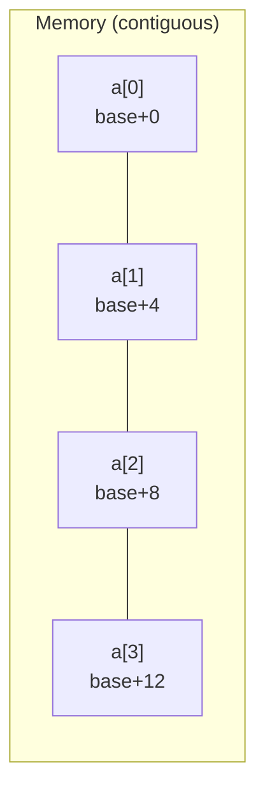

# Chapter 16 · Array

[简体中文](./16-array.md) ｜ **English**

---

> Welcome to Part 3. The first two Parts were about **individual values** — one variable, one type, one function. From here on we face **thousands of values**: how to store them, find them, and organize them.
>
> The array is where every data structure begins, and it takes only one sentence to define: **a contiguous block of memory**. Yet that sentence yields two profound consequences — it explains **why indices start at 0**, and it reveals something more important than "O(1) access": **an array's real speed comes from the cache, not from complexity**. This chapter proves it with measurements (the same O(n²) code runs nearly 19× slower with a different traversal order).

## 1. Learning Objectives

By the end of this chapter, you will be able to:

- Use `address = base + index × element size` to explain **O(1) random access** and **why indices start at 0**;
- Explain **cache locality** — why it determines real performance more than time complexity does;
- Tell which languages' "arrays" are **genuinely contiguous memory** and which only look like arrays;
- State how the five languages each react to **out-of-bounds access**, and which is most dangerous;
- Understand **row-major vs. column-major** order and write cache-friendly loops accordingly.

---

## 2. Why This Concept Exists

Suppose you must store the scores of 100 students. Without arrays:

```text
score1 = 92
score2 = 75
score3 = 88
...
score100 = 60
```

This is nearly unusable — you cannot "iterate over all scores" or "get the i-th score," because `i` is a runtime value while variable names are fixed at compile time.

The array's answer: **put them contiguously and access them by number**.

```text
scores = [92, 75, 88, ..., 60]
scores[i]        ← i can be any value computed at runtime
```

That gives two crucial abilities:

1. **Bulk processing** — you can loop over them (Chapter 11's `for` finally has a purpose);
2. **Random access** — give an index, get the element instantly, no matter how large the array.

**The array is the most fundamental data structure**: lists, stacks, queues, and hash tables are usually built on top of one.

---

## 3. How It Works

### Contiguous memory and address arithmetic

An array's definition is one sentence: **a contiguous block of memory divided into equal-sized slots**.



From that follows the formula that determines everything:

```text
element address = base + index × element size
```

Measured (printing the real addresses of a C++ `int a[5]`):

```text
sizeof(int) = 4 bytes
a[0] at 0x16efa22e0   offset from base: 0 bytes
a[1] at 0x16efa22e4   offset from base: 4 bytes
a[2] at 0x16efa22e8   offset from base: 8 bytes
```

The formula explains two things:

- **Why random access is O(1)**: whether the array holds 10 or 10 million elements, it's one multiply plus one add;
- **Why indices start at 0**: an index is really an **offset** — `a[0]` means "zero elements from the start." Starting at 1 would force a subtraction on every access.

### Cache locality: why arrays are really fast

This is the most important section of the chapter. You may think arrays are fast because of "O(1) access," but in the real world **the cache matters more**.

A CPU does not read memory byte by byte; it moves a whole **cache line** (typically 64 bytes) at a time. So when you read `a[0]`, elements `a[1]`–`a[15]` come along into fast cache — accessing them next is nearly free.

**Measured**: the same 2000×2000 two-dimensional array, changing only the traversal order:

```cpp
for (i) for (j) sum += a[i][j];   // row-major: sequential access
for (j) for (i) sum += a[i][j];   // column-major: jumps a whole row each step
```

| Traversal | Time | Why |
|-----------|------|-----|
| Row-major (sequential) | **0.73 ms** | every cache line is fully used |
| Column-major (jumping) | **13.80 ms** | one element used per line, then it jumps away |

**Same O(n²), same element count — column-major was 18.8× slower.**

> ⚠️ **But that number comes with conditions — read them carefully.** The measurement above used **C++ with `-O2`, a `vector<vector<int>>`, at 2000×2000**. Change the conditions and the gap changes drastically; here are several controls we measured:
>
> | Condition | How much slower is column-major |
> |-----------|:---:|
> | C++ `-O2` + 2-D vector | **18.8×** |
> | C++ `-O2` + 1-D contiguous array | 5.5× |
> | C++ **without optimization** | **essentially none** (1.0×) |
> | Java + array of arrays (warmed up) | 3.8× |
> | Java + 1-D simulating 2-D (warmed up) | 1.1× |
> | JavaScript / Python / C# | around 1× |
>
> **Three reasons flatten the difference**: ① **without optimization**, loop overhead dwarfs the memory-access difference and hides the cache effect; ② **a JIT may reorder loops automatically** (loop interchange), quietly turning your column-major loop back into row-major; ③ **an "array of arrays" is already non-contiguous between rows** (Java/JS/Python), so column-major isn't "even less contiguous."
>
> **What to remember is the principle, not the number**: complexity describes growth, while **cache locality sets the constant factor**; sequential access is never worse than jumping. As for how much it matters in *your* language on *your* machine — **measure it yourself** (this chapter's examples run as-is).

### Multidimensional arrays: row-major and column-major

A 2-D array is still a straight line in memory; there are just two conventions for flattening two dimensions into one:

```text
matrix        Row-major                  Column-major
1 2 3         memory: 1 2 3 4 5 6        memory: 1 4 2 5 3 6
4 5 6         (row by row)                (column by column)
```

| Convention | Used by |
|------------|---------|
| **Row-major** | C / C++ / Java / C# / Python (NumPy default) |
| **Column-major** | Fortran / MATLAB / R / NumPy (`order='F'`) |

**This dictates your loop order**: in row-major languages the innermost loop should iterate the **last dimension** (the row-major form above).

### Fixed-size vs. dynamic

| Kind | Size | Examples |
|------|------|----------|
| **Static array** | fixed at creation | C++ `int a[5]`, Java `int[]`, C# `int[]` |
| **Dynamic array** | grows automatically | C++ `vector`, Java `ArrayList`, Python `list`, JS `Array` |

How dynamic arrays grow (doubling, amortized O(1)) is the subject of **Chapter 17, "List"** — we defer it here.

---

## 4. JavaScript

**JavaScript's `Array` is not an array in the traditional sense** — it is an object whose keys are numeric strings:

```javascript
const scores = [92, 75, 88];
console.log(scores.length);       // 3
console.log(typeof scores);       // "object" ← it's an object, not its own type
console.log(Array.isArray(scores)); // true  ← use this to test for arrays
```

**It can be heterogeneous, variable-length, even sparse**:

```javascript
const mixed = [1, "two", true, null, {x: 1}];   // element types may differ
const sparse = [1, , 3];                         // sparse array: a hole in the middle
sparse[100] = 9;                                 // length jumps to 101
console.log(sparse.length);                      // 101
```

**Out-of-bounds access does not throw** (measured) — JavaScript's most dangerous trait here:

```javascript
const a = [10, 20, 30];
console.log(a[10]);      // undefined  ← silently returned, no exception!
console.log(a[-1]);      // undefined  ← no negative indexing (unlike Python)
```

**Common methods** (all higher-order functions, echoing Chapter 12):

```javascript
scores.map(s => s * 1.1);            // transform
scores.filter(s => s >= 60);         // select
scores.reduce((a, b) => a + b, 0);   // reduce
```

> **Note**: V8 uses **fast elements** (nearly real contiguous memory) for arrays whose elements share a type and whose indices are dense; but insert a different type or create a hole and it degrades to **dictionary mode**, and performance falls off a cliff. So **don't make arrays sparse, and don't mix types**.

---

## 5. Python

**Python's `list` does not store values contiguously either** — it is an **array of pointers**: each slot holds a pointer to a `PyObject`, with the objects scattered across the heap.

```python
scores = [92, 75, 88]
print(len(scores), type(scores))     # 3 <class 'list'>
mixed = [1, "two", True, None]       # heterogeneous is fine
```

This explains Chapter 09's figure: a million integers take 4 MB in C++ but tens of MB in Python — you are storing a million pointers **plus** a million objects.

**Negative indices and slicing** are Python's signature features:

```python
print(scores[-1])        # 88   ← counts from the end (measured)
print(scores[0:2])       # [92, 75]
print(scores[::-1])      # reversed
```

**Out of bounds raises `IndexError`** (measured) — far safer than JavaScript's silent `undefined`.

**For genuinely contiguous arrays, Python offers two options**:

```python
from array import array
a = array("i", [92, 75, 88])       # stdlib: same type, contiguous storage

import numpy as np                  # the de facto standard for numerics
arr = np.array([92, 75, 88])        # contiguous memory + vectorized operations
```

> **Note**: **numeric workloads should always use NumPy.** Backed by contiguous C arrays, it saves memory and exploits cache and SIMD — the gap is often an order of magnitude or more.

---

## 6. Java

**Java arrays are truly contiguous memory**, and are **fixed-length** with a **uniform type**:

```java
int[] scores = new int[3];              // defaults to all zeros
int[] init = {92, 75, 88};              // initialized at declaration
System.out.println(scores.length);      // 3 ← length is a field, not a method
```

**Primitive arrays store values; object arrays store references** — a crucial distinction:

```java
int[] nums = {1, 2, 3};                 // three contiguous 4-byte integers in memory
String[] names = {"a", "b"};            // two contiguous references; the strings live elsewhere on the heap
```

**Out of bounds throws `ArrayIndexOutOfBoundsException`** (measured) — the JVM bounds-checks every access.

**Multidimensional arrays are really "arrays of arrays,"** so rows may differ in length (jagged arrays):

```java
int[][] matrix = new int[3][4];         // regular 2-D
int[][] jagged = new int[3][];          // jagged array
jagged[0] = new int[2];
jagged[1] = new int[5];                 // rows may have different lengths
```

> ⚠️ **Note**: because it is an array of arrays, Java's 2-D rows **are not necessarily adjacent in memory** — which weakens cache locality. For performance-critical code, simulate 2-D with a 1-D array (`a[i * cols + j]`).

**Utilities** live in `java.util.Arrays`:

```java
Arrays.sort(scores);
Arrays.toString(scores);          // required for printing (printing directly gives a hash)
Arrays.equals(a, b);              // compares contents (== compares references, Chapter 10)
```

---

## 7. C++

**C++ offers the full spectrum from "raw memory" to "modern containers"**:

```cpp
int raw[5] = {92, 75, 88};              // C-style array: closest to the hardware
std::array<int, 5> arr = {92, 75, 88};  // C++11: fixed size, but with size(), bounds checks, etc.
std::vector<int> vec = {92, 75, 88};    // dynamic array (Chapter 17)
```

**An array name "decays" to a pointer** — a trap unique to C/C++:

```cpp
void f(int a[]) {                        // actually equivalent to int* a
    std::cout << sizeof(a);              // prints the pointer size (8), not the array's!
}
int a[5];
std::cout << sizeof(a);                  // 20 (5 × 4) — the true size, at the definition
std::cout << sizeof(a) / sizeof(a[0]);   // 5 — the classic length idiom
```

**No bounds checking** (measured) — C++'s most dangerous and most "fast" design:

```cpp
std::vector<int> v{10, 20, 30};
std::cout << v[10];        // undefined behavior: reads garbage, no error!
v.at(10);                  // throws std::out_of_range — .at() does check
```

**C++'s 2-D arrays are genuinely contiguous** (unlike Java's):

```cpp
int m[3][4];               // 12 contiguous ints in memory, row-major
```

> **Note**: use `operator[]` when performance rules (no check) and `.at()` when safety does. Modern C++ prefers `std::array` / `std::vector` over raw arrays — they don't decay to pointers and work with iterators and the algorithm library.

---

## 8. C#

**C# arrays are reference types whose elements are stored contiguously**:

```csharp
int[] scores = new int[3];              // defaults to all zeros
int[] init = { 92, 75, 88 };
Console.WriteLine(scores.Length);       // Length is a property (Java's is a field)
```

**C# has two kinds of 2-D arrays**, which sets it apart from Java:

```csharp
int[,] rect = new int[3, 4];            // rectangular array: one truly contiguous 2-D block ✓
int[][] jagged = new int[3][];          // jagged array: array of arrays (like Java)
jagged[0] = new int[2];
```

**A rectangular `int[,]` is fully contiguous in memory**, hence cache-friendly — an advantage over Java.

**Out of bounds throws `IndexOutOfRangeException`**, again with runtime checks.

**Range and index syntax** (C# 8+, quite elegant):

```csharp
int[] a = { 10, 20, 30, 40, 50 };
Console.WriteLine(a[^1]);               // 50 ← ^1 means "first from the end" (like Python's -1)
int[] slice = a[1..3];                  // {20, 30} ← slicing
```

**For high performance, use `Span<T>`**:

```csharp
Span<int> span = a.AsSpan(1, 3);        // references a slice with zero copying
```

> **Note**: when performance is critical, `Span<T>` / `Memory<T>` let you work on array slices without copying — a key capability for systems programming in C#.

---

## 9. SQL

A relational database is built on **tables**, not arrays — but the relationship is worth spelling out.

### ① A table is not an array: unordered vs. ordered

```sql
CREATE TABLE student (name TEXT, score INTEGER);
INSERT INTO student VALUES ('Alice', 92), ('Bob', 75);
```

**Rows in a table are logically an unordered set** — there is no "third row." To get order you must ask for it:

```sql
SELECT * FROM student ORDER BY score DESC;         -- ORDER BY is mandatory
SELECT * FROM student ORDER BY score LIMIT 2 OFFSET 1;   -- "the 2nd and 3rd place"
```

> ⚠️ **A common misconception**: without `ORDER BY`, the returned order is **not guaranteed** even if it looks sorted once. This is the opposite of an array, where the index *is* the order.

### ② Some databases have array types

```sql
-- PostgreSQL supports array columns natively
CREATE TABLE student (name TEXT, scores INTEGER[]);
INSERT INTO student VALUES ('Alice', ARRAY[92, 75, 88]);
SELECT name, scores[1] FROM student;        -- note: PostgreSQL arrays are 1-indexed!
```

> ⚠️ **PostgreSQL array indices start at 1**, the opposite of this chapter's rule — because it follows mathematical convention rather than memory offsets.

### ③ Simulating an "index" with row numbers

The standard approach is a window function (seen in Chapter 12):

```sql
SELECT ROW_NUMBER() OVER (ORDER BY score DESC) AS rank, name, score
FROM student;
```

> **Design note**: **the relational model favors a related table over stuffing an array into a column.** Storing several scores in an array column makes querying, indexing, and aggregation awkward — unless you truly read and write it as one opaque blob.

---

## 10. Cross-Language Comparison

### ① Array characteristics

| Feature | JavaScript | Python | Java | C++ | C# |
|---------|-----------|--------|------|-----|-----|
| Built-in type | `Array` | `list` | `int[]` | `array` / `vector` | `int[]` |
| **Truly contiguous** | ⚠️ only when optimized | ❌ array of pointers | ✅ primitive arrays | ✅ | ✅ |
| Fixed length | ❌ growable | ❌ growable | ✅ fixed | `array` fixed / `vector` growable | ✅ fixed |
| Uniform element type required | ❌ | ❌ | ✅ | ✅ | ✅ |
| Negative indices | ❌ | ✅ `a[-1]` | ❌ | ❌ | ✅ `a[^1]` |
| Slicing | `slice()` | ✅ `a[1:3]` | `Arrays.copyOfRange` | C++20 `span` | ✅ `a[1..3]` |
| Length | `.length` | `len(a)` | `.length` (field) | `.size()` | `.Length` (property) |
| Truly contiguous 2-D | ❌ | ❌ (NumPy ✅) | ❌ array of arrays | ✅ | ✅ `int[,]` |

### ② Out-of-bounds: five reactions (measured)

| Language | `a[10]` on a length-3 array | Danger |
|----------|----------------------------|--------|
| **JavaScript** | returns `undefined`, **no error** | ⚠️⚠️⚠️ most dangerous: the bug is swallowed silently |
| **C++** | **undefined behavior**, reads garbage | ⚠️⚠️⚠️ most dangerous: may crash or become a security hole |
| Python | raises `IndexError` | ✅ safe |
| Java | throws `ArrayIndexOutOfBoundsException` | ✅ safe |
| C# | throws `IndexOutOfRangeException` | ✅ safe |

> **The two dangers differ in kind**: JavaScript **fails silently** (the bug hides), while C++ has **undefined behavior** (it may read arbitrary memory — the root of buffer-overflow vulnerabilities). For safety in C++, use `.at()`.

### ③ Commonalities and the root of differences

**In common**: all index by subscript (0-based except PostgreSQL), all support iteration, and all underpin other data structures.

**The differences** come down to one trade-off: **performance vs. flexibility.**

- **C++ / Java / C#** choose performance: fixed length, uniform type, contiguous memory — for the best cache behavior;
- **JavaScript / Python** choose flexibility: growable, heterogeneous, object-based — for convenience, at a cost in memory and speed.

Which is why Python numerics circle back to NumPy — **when performance matters, you end up back at contiguous, uniformly-typed memory.**

---

## 11. Underlying Implementation Comparison

| Language · Engine | Memory layout |
|-------------------|--------------|
| **JavaScript · V8** | two modes: **fast elements** (contiguous, when types are uniform) and **dictionary mode** (degrades to a hash table when sparse or heterogeneous) |
| **Python · CPython** | `PyListObject` = a pointer to an array of `PyObject*` — **it stores pointers, not values**; the `array` module and NumPy store values contiguously |
| **Java · JVM** | object header + `length` field + contiguous element region; primitives store values, objects store references; 2-D is an array of arrays |
| **C++ · Native** | just raw memory, no overhead; `std::array` is a zero-cost abstraction, `vector` adds a pointer + size + capacity |
| **C# · CLR** | like Java, but `int[,]` is one truly contiguous 2-D block |

**This table explains two "why"s**:

- **Why iterating a Python list is slow**: each access dereferences a pointer and then reads a value inside an object — poor cache behavior;
- **Why you shouldn't mix types in a JS array**: once dictionary mode kicks in, the array becomes a hash table and the constant factor explodes.

---

## 12. Performance Analysis

### Time complexity

| Operation | Complexity | Notes |
|-----------|:----------:|-------|
| Indexed access `a[i]` | **O(1)** | one multiply plus one add |
| Assignment `a[i] = x` | **O(1)** | same |
| Traversal | O(n) | sequential, cache-friendly |
| Search (unsorted) | O(n) | must compare one by one |
| Search (sorted + binary) | O(log n) | requires sorting first |
| Insert/delete in the middle | **O(n)** | must shift all following elements |
| Append (dynamic array) | amortized O(1) | see Chapter 17 |

### The cache is what matters (measured)

| Traversal order | Time (2000×2000, C++ `-O2`) | Factor |
|-----------------|:----------------:|:------:|
| Row-major | 0.73 ms | 1× |
| Column-major | 13.80 ms | **18.8×** |

**Remember the principle, not the number** (see the conditions in section 3): for real performance problems, "improving the memory access pattern" often pays off faster than "lowering the time complexity" — but the actual gain depends on language, compiler optimization, and data layout, so **measure it**.

**Practical advice**:

```cpp
// ✓ in a row-major language, iterate the last dimension innermost
for (int i = 0; i < N; i++)
    for (int j = 0; j < N; j++)
        sum += a[i][j];
```

```python
# ✓ in Python, use NumPy to push the loop down to C
total = arr.sum()            # rather than: for x in arr: total += x
```

---

## 13. Engineering Practice

| Scenario | ✅ Recommended | ❌ Discouraged | Why |
|----------|---------------|---------------|-----|
| Size known and fixed | a fixed-size array | a dynamic one | avoids growth overhead and an extra indirection |
| Frequent middle insert/delete | a linked list or other structure (Chapter 17) | an array | middle insertion is O(n) |
| Python numerics | **NumPy** | native `list` | contiguous + vectorized: an order of magnitude faster |
| JavaScript arrays | keep types uniform and indices dense | mixing types, creating holes | avoids dictionary mode |
| C++ bounds safety | `.at()` or check first | bare `[]` without validation | undefined behavior breeds vulnerabilities |
| Traversing 2-D | follow memory order (rows in row-major) | the reverse | measured 18.8× difference |
| High-performance 2-D in Java | simulate with 1-D `a[i*cols+j]` | `int[][]` | guarantees true contiguity |
| Printing a Java array | `Arrays.toString(a)` | `System.out.println(a)` | the latter prints a hash |

---

## 14. Best Practices

- **Prefer for-each** (Chapter 11): if you never touch an index, you can't go out of bounds.
- **When you do need indices, get the bound right**: `i < n`, never `i <= n`.
- **Take the length from the array itself**, not a hard-coded `for (i = 0; i < 100; i++)`.
- **Don't use arrays for frequent middle insertion/deletion** — that's a job for other structures.
- **Consider layout for large arrays**: array-of-structs (AoS) versus struct-of-arrays (SoA) differ enormously in cache behavior.
- **Test for arrays in JavaScript with `Array.isArray()`**, not `typeof` (which returns `"object"`).
- **Do bulk numeric work in Python with NumPy.**

---

## 15. Common Pitfalls

**Pitfall 1 · JavaScript silently returns `undefined` out of bounds**

```javascript
const a = [10, 20, 30];
const v = a[10];          // undefined, no error
console.log(v * 2);       // NaN ← the bug only surfaces here, hard to trace
```
**How to avoid**: check `i < a.length` first, or use `at()` (still undefined, but clearer intent).

**Pitfall 2 · C++ out-of-bounds is undefined behavior**

```cpp
std::vector<int> v{10, 20, 30};
std::cout << v[10];       // reads garbage; can even be exploited
```
**How to avoid**: use `.at()`, or enable debug checks such as `-D_GLIBCXX_ASSERTIONS`.

**Pitfall 3 · Off-by-one**

```java
for (int i = 0; i <= a.length; i++)   // ✗ the last iteration is out of bounds
for (int i = 0; i < a.length; i++)    // ✓
```
**How to avoid**: prefer for-each.

**Pitfall 4 · Printing a Java array directly**

```java
int[] a = {1, 2, 3};
System.out.println(a);                 // [I@1b6d3586 ← a hash, not the contents
System.out.println(Arrays.toString(a)); // [1, 2, 3] ✓
```

**Pitfall 5 · Comparing array contents with `==`**

```java
int[] a = {1,2}, b = {1,2};
a == b                    // false (compares references, Chapter 10)
Arrays.equals(a, b)       // true ✓
```

**Pitfall 6 · Column-major traversal**

```cpp
for (int j = 0; j < N; j++)
    for (int i = 0; i < N; i++)
        sum += a[i][j];    // measured 18.8× slower
```
**How to avoid**: in row-major languages, let the innermost loop walk the last dimension.

**Pitfall 7 · Modifying an array's length while iterating**

```javascript
for (let i = 0; i < arr.length; i++) {
  if (cond) arr.splice(i, 1);   // elements shift left, so the next one is skipped
}
```
**How to avoid**: iterate backwards, or build a new array with `filter`.

**Pitfall 8 · Assuming Python's `list` is a contiguous array**

```python
# a million integers: about 4 MB in C++, tens of MB as a Python list
```
**How to avoid**: use the `array` module or NumPy for numeric data.

---

## 16. Interview Questions

**Basic**

1. Why can an array provide O(1) random access?
2. Why do array indices start at 0?
3. What are the main differences between an array and a linked list, and when does each fit?

**Intermediate**

4. What is cache locality? Why is row-major traversal so much faster than column-major?
5. How do the five languages handle out-of-bounds access? Which is most dangerous, and why?
6. What is the difference between Java's `int[][]` and C#'s `int[,]`? Which is more cache-friendly?

**Advanced**

7. Why does a Python `list` use far more memory than a C++ `vector<int>`? Explain via the object model.
8. What is the difference between V8's fast elements and dictionary mode? What operations cause the degradation?
9. What are AoS (array of structs) and SoA (struct of arrays)? When does SoA perform better?

---

## 17. Exercises

**Basic**

1. In each of the six languages, create an array of five scores, iterate it, and compute the average.
2. Measure the out-of-bounds behavior of each language and tabulate the results.
3. In C++, print the addresses of an array's elements to verify `address = base + index × element size`.

**Intermediate**

4. Reproduce this chapter's cache experiment: measure row-major versus column-major traversal on your machine.
5. Implement binary search over a sorted array and compare its timing with linear search.
6. Simulate a 2-D array with a 1-D one (`a[i * cols + j]`) and compare performance with a native 2-D array.

**Challenge**

7. In Python, compare `list`, the `array` module, and NumPy for "sum a million integers" in both time and memory, and explain the differences.
8. Design an experiment to discover your machine's cache line size (hint: stride through an array with varying steps and watch for the timing knee).

---

## 18. Summary

**In one sentence**: an array is **a contiguous block of memory** — from which follows `address = base + index × element size`, explaining both O(1) random access and why indices start at 0; and its real-world speed comes chiefly from **cache locality**, measured here at nearly a 19× difference.

**Core takeaways**

- **The address formula** is the source of every array property.
- **Cache locality decides real performance more than complexity does** (row- vs. column-major measured at 18.8×).
- **Not every "array" is a real array**: JS's `Array` is an object and Python's `list` is an array of pointers; C++/Java/C# give you contiguous memory.
- **Out-of-bounds behavior differs five ways**: JS silently returns `undefined` and C++ is undefined behavior (both dangerous); Python/Java/C# throw.
- Row-major vs. column-major dictates the order your loops should take.

**Checklist**

- [ ] I can explain O(1) access and 0-based indexing with the address formula.
- [ ] I can explain cache locality and write a cache-friendly 2-D traversal.
- [ ] I know which languages give genuinely contiguous arrays.
- [ ] I can state each language's out-of-bounds behavior and which is most dangerous.
- [ ] I know why Python numerics must use NumPy.

**Next chapter**: an array's fatal weakness is being **fixed-length** — once full, it must be reallocated. So how do `vector`, `ArrayList`, and `list` support "unlimited appending"? Why does growth double rather than add one? And why is appending "amortized O(1)"? That is Chapter 17, "List."

---

## 19. Further Reading

- <a href="https://en.wikipedia.org/wiki/Array_(data_structure)" target="_blank" rel="noopener">Wikipedia: Array (data structure)</a> — definitions, address arithmetic, and variants.
- <a href="https://en.wikipedia.org/wiki/Locality_of_reference" target="_blank" rel="noopener">Wikipedia: Locality of reference</a> — temporal and spatial locality, the theory behind cache optimization.
- <a href="https://en.wikipedia.org/wiki/Row-_and_column-major_order" target="_blank" rel="noopener">Wikipedia: Row- and column-major order</a> — the two layout conventions and who uses them.
- <a href="https://developer.mozilla.org/en-US/docs/Web/JavaScript/Reference/Global_Objects/Array" target="_blank" rel="noopener">MDN · Array</a> — the complete JavaScript array API and semantics.
- <a href="https://docs.python.org/3/library/array.html" target="_blank" rel="noopener">Python docs · array module</a> — genuinely contiguous arrays in the standard library.
- <a href="https://numpy.org/doc/stable/reference/arrays.ndarray.html" target="_blank" rel="noopener">NumPy docs · ndarray</a> — the contiguous multidimensional array behind Python numerics.
- <a href="https://en.cppreference.com/w/cpp/container/array" target="_blank" rel="noopener">cppreference · std::array</a> — C++'s fixed-size array container.
