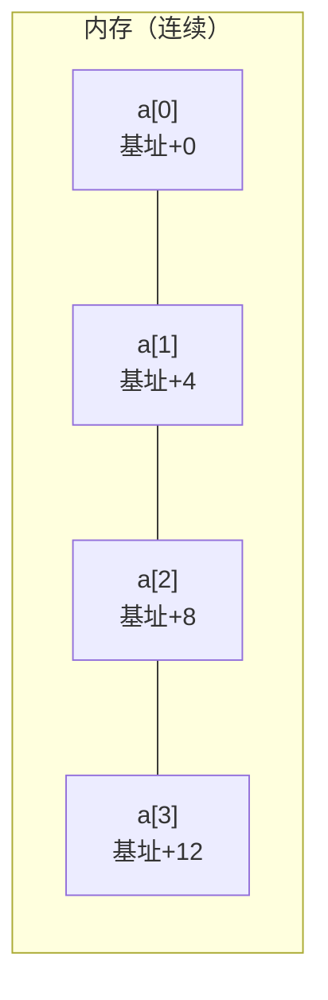

# 第 16 章 · 数组

**简体中文** ｜ [English](./16-array.en-US.md)

---

> 欢迎来到 Part 3。前面两个 Part 讲的是**单个值**——一个变量、一个类型、一个函数。从这一章起，我们面对的是**成千上万个值**：怎么存、怎么找、怎么组织。
>
> 数组是所有数据结构的起点，简单到只有一句话就能说清：**一块连续的内存**。但正是这句话，带来了两个深刻的结论——它解释了**为什么下标从 0 开始**，也解释了一个比"O(1) 访问"更重要的事实：**数组真正快的原因是缓存，不是复杂度**。本章会用实测数据证明这一点（同样是 O(n²) 的代码，换个遍历顺序竟慢了近 19 倍）。

## 1. 学习目标

本章结束后，你将能够：

- 用 `地址 = 基址 + 索引 × 元素大小` 解释数组为什么能 **O(1) 随机访问**，以及**下标为何从 0 开始**；
- 说清**缓存局部性**——为什么它比时间复杂度更能决定真实性能；
- 分辨哪些语言的"数组"是**真正的连续内存**，哪些只是"看起来像数组"；
- 说出五门语言**越界访问**时各自的反应，并知道哪种最危险；
- 理解**行主序 / 列主序**，并据此写出对缓存友好的循环。

---

## 2. 为什么会出现这个概念

假设要保存一个班 100 名学生的分数。没有数组时：

```text
score1 = 92
score2 = 75
score3 = 88
...
score100 = 60
```

这几乎无法使用——你没法"遍历所有分数"，也没法"取第 i 个分数"，因为 `i` 是运行时才知道的值，而变量名是编译期就固定的。

数组给出的答案是：**把它们连续地放在一起，用编号访问**。

```text
scores = [92, 75, 88, ..., 60]
scores[i]        ← i 可以是任意运行时计算出的值
```

这带来两个关键能力：

1. **批量处理**——可以循环遍历（第 11 章的 `for` 终于有了用武之地）；
2. **随机访问**——给出编号，立刻拿到元素，无论数组多大。

**数组是最基础的数据结构**：后面的列表、栈、队列、哈希表，底层往往都由数组实现。

---

## 3. 底层原理

### 连续内存与地址计算

数组的定义只有一句话：**一块连续内存，等分成大小相同的格子**。



由此得到那条决定一切的公式：

```text
元素地址 = 基址 + 索引 × 元素大小
```

实测（C++ 打印 `int a[5]` 的真实地址）：

```text
sizeof(int) = 4 字节
a[0] 地址 0x16efa22e0   与首地址相差 0 字节
a[1] 地址 0x16efa22e4   与首地址相差 4 字节
a[2] 地址 0x16efa22e8   与首地址相差 8 字节
```

这条公式解释了两件事：

- **为什么随机访问是 O(1)**：无论数组有 10 个还是 1000 万个元素，都只是一次乘法加一次加法；
- **为什么下标从 0 开始**：下标的本质是**偏移量**——`a[0]` 就是"距离首地址偏移 0 个元素"。从 1 开始反而要每次多做一次减法。

### 缓存局部性：数组真正快的原因

这是本章最重要的一节。你可能以为数组快是因为"O(1) 访问"，但真实世界里，**更关键的是缓存**。

CPU 从内存读数据时，不是一个字节一个字节读，而是一次搬运一整条**缓存行**（通常 64 字节）。所以当你读了 `a[0]`，`a[1]`~`a[15]` 也顺带被搬进了高速缓存——接下来访问它们几乎免费。

**实测**：同一个 2000×2000 的二维数组，只改变遍历顺序：

```cpp
for (i) for (j) sum += a[i][j];   // 行优先：顺序访问
for (j) for (i) sum += a[i][j];   // 列优先：每次跳一整行
```

| 遍历方式 | 耗时 | 说明 |
|---------|------|------|
| 行优先（顺序） | **0.73 ms** | 每条缓存行都被充分利用 |
| 列优先（跳跃） | **13.80 ms** | 每次只用一个元素就跳走 |

**同样的 O(n²)，同样的元素个数，列优先慢了 18.8 倍。**

> ⚠️ **但这个数字有前提，务必看清楚。** 上面是在 **C++、开启 `-O2` 优化、`vector<vector<int>>`、2000×2000** 的条件下测得的。换个条件，差距会大不相同——我们实测了几组对照：
>
> | 条件 | 列优先慢多少 |
> |------|:---:|
> | C++ `-O2` + 二维 vector | **18.8 倍** |
> | C++ `-O2` + 一维连续数组 | 5.5 倍 |
> | C++ **不开优化** | **几乎无差异**（1.0 倍） |
> | Java + 数组的数组（含预热） | 3.8 倍 |
> | Java + 一维模拟二维（含预热） | 1.1 倍 |
> | JavaScript / Python / C# | 1 倍上下 |
>
> **三个原因导致差异被抹平**：① **不开优化时**，循环本身的开销远大于访存差异，掩盖了缓存效应；② **JIT 编译器可能自动重排循环**（loop interchange），把你写的列优先悄悄改回行优先；③ **"数组的数组"结构本来行与行就不连续**（Java/JS/Python），列优先并没有"更不连续"。
>
> **该记住的不是那个数字，而是这条原理**：时间复杂度描述增长趋势，**缓存局部性决定常数因子**；顺序访问总是不劣于跳跃访问。至于在你的语言和机器上差多少——**请自己跑一遍**（本章示例可直接运行）。

### 多维数组：行主序与列主序

二维数组在内存里其实还是一条直线，只是"怎么把二维压平成一维"有两种约定：

```text
矩阵          行主序（Row-major）        列主序（Column-major）
1 2 3         内存: 1 2 3 4 5 6          内存: 1 4 2 5 3 6
4 5 6         （逐行铺开）                （逐列铺开）
```

| 约定 | 采用者 |
|------|--------|
| **行主序** | C / C++ / Java / C# / Python(NumPy 默认) |
| **列主序** | Fortran / MATLAB / R / NumPy(可选 order='F') |

**这决定了你该按哪个顺序循环**：行主序语言里，最内层循环应该遍历**最后一维**（也就是上面的行优先写法）。

### 定长 vs 动态

| 类型 | 大小 | 例子 |
|------|------|------|
| **静态数组** | 创建后固定 | C++ `int a[5]`、Java `int[]`、C# `int[]` |
| **动态数组** | 可自动扩容 | C++ `vector`、Java `ArrayList`、Python `list`、JS `Array` |

动态数组的扩容机制（成倍增长、摊还 O(1)）是**第 17 章**「列表」的主题，这里先按下不表。

---

## 4. JavaScript

**JavaScript 的 `Array` 并不是传统意义的数组**——它本质上是一个对象，键是数字形式的字符串：

```javascript
const scores = [92, 75, 88];
console.log(scores.length);       // 3
console.log(typeof scores);       // "object" ← 它是对象，不是独立类型
console.log(Array.isArray(scores)); // true  ← 判断数组要用这个
```

**它可以异构、可以变长、甚至可以稀疏**：

```javascript
const mixed = [1, "两", true, null, {x: 1}];   // 元素类型可以不同
const sparse = [1, , 3];                        // 稀疏数组：中间是"空洞"
sparse[100] = 9;                                // 长度直接变成 101
console.log(sparse.length);                     // 101
```

**越界访问不报错**（实测）——这是 JavaScript 最危险的一点：

```javascript
const a = [10, 20, 30];
console.log(a[10]);      // undefined  ← 静默返回，不抛异常！
console.log(a[-1]);      // undefined  ← 不支持负索引（与 Python 不同）
```

**常用方法**（都是高阶函数，呼应第 12 章）：

```javascript
scores.map(s => s * 1.1);            // 变换
scores.filter(s => s >= 60);         // 筛选
scores.reduce((a, b) => a + b, 0);   // 归约
```

> **注意事项**：V8 内部对"元素类型一致且下标连续"的数组会用**紧凑数组**（fast elements）优化，接近真正的连续内存；但一旦你插入了不同类型或制造了空洞，它会退化成**字典模式**，性能骤降。所以**别让数组变稀疏、别混放类型**。

---

## 5. Python

**Python 的 `list` 也不是连续存放"值"的数组**——它是一个**指针数组**：每个槽位存的是指向 `PyObject` 的指针，对象本身散落在堆上。

```python
scores = [92, 75, 88]
print(len(scores), type(scores))     # 3 <class 'list'>
mixed = [1, "两", True, None]        # 可以异构
```

这解释了第 09 章的那个数据：一百万个整数在 C++ 里占 4 MB，在 Python 里要几十 MB——因为你存的是一百万个指针**外加**一百万个对象。

**负索引与切片**是 Python 的招牌特性：

```python
print(scores[-1])        # 88   ← 从末尾数（实测）
print(scores[0:2])       # [92, 75]
print(scores[::-1])      # 反转
```

**越界会抛 `IndexError`**（实测），比 JavaScript 的静默 `undefined` 安全得多。

**要真正的连续数组，Python 有两个选择**：

```python
from array import array
a = array("i", [92, 75, 88])       # 标准库：同类型、连续存储

import numpy as np                  # 数值计算的事实标准
arr = np.array([92, 75, 88])        # 连续内存 + 向量化运算
```

> **注意事项**：**数值密集的场景一定要用 NumPy**。它底层是连续的 C 数组，既省内存又能利用缓存和 SIMD——性能差距常常是一个数量级以上。

---

## 6. Java

**Java 的数组是真正的连续内存**，且**定长**、**类型统一**：

```java
int[] scores = new int[3];              // 默认值全为 0
int[] init = {92, 75, 88};              // 声明时初始化
System.out.println(scores.length);      // 3 ← length 是字段，不是方法
```

**基本类型数组直接存值，对象数组存引用**——这个区别至关重要：

```java
int[] nums = {1, 2, 3};                 // 内存里就是 3 个连续的 4 字节整数
String[] names = {"a", "b"};            // 内存里是 2 个连续的引用，字符串在堆上别处
```

**越界抛 `ArrayIndexOutOfBoundsException`**（实测）——JVM 在每次访问时都做边界检查。

**多维数组实际是"数组的数组"**，因此各行可以不等长（交错数组）：

```java
int[][] matrix = new int[3][4];         // 常规二维
int[][] jagged = new int[3][];          // 交错数组
jagged[0] = new int[2];
jagged[1] = new int[5];                 // 各行长度可以不同
```

> ⚠️ **注意**：正因为是"数组的数组"，Java 的二维数组**各行在内存中未必相邻**——这削弱了缓存局部性。对性能敏感的场景，可以用一维数组手工模拟二维（`a[i * cols + j]`）。

**常用工具**在 `java.util.Arrays`：

```java
Arrays.sort(scores);
Arrays.toString(scores);          // 打印数组必须用它（直接打印会输出哈希）
Arrays.equals(a, b);              // 比较内容（第 10 章讲过 == 比较引用）
```

---

## 7. C++

**C++ 提供了从"裸内存"到"现代容器"的完整谱系**：

```cpp
int raw[5] = {92, 75, 88};              // C 风格数组：最贴近硬件
std::array<int, 5> arr = {92, 75, 88};  // C++11：定长，但带 size()、边界检查等
std::vector<int> vec = {92, 75, 88};    // 动态数组（第 17 章详述）
```

**数组名会"退化"为指针**——这是 C/C++ 特有的坑：

```cpp
void f(int a[]) {                        // 实际等价于 int* a
    std::cout << sizeof(a);              // 输出指针大小（8），不是数组大小！
}
int a[5];
std::cout << sizeof(a);                  // 20（5 × 4）—— 在定义处才是真实大小
std::cout << sizeof(a) / sizeof(a[0]);   // 5 —— 经典的求长度写法
```

**越界不检查**（实测）——这是 C++ 最危险也最"快"的设计：

```cpp
std::vector<int> v{10, 20, 30};
std::cout << v[10];        // 未定义行为：读到垃圾值，不报错！
v.at(10);                  // 抛 std::out_of_range —— .at() 才检查
```

**C++ 的二维数组是真正连续的**（与 Java 不同）：

```cpp
int m[3][4];               // 内存中就是连续的 12 个 int，行主序
```

> **注意事项**：性能优先用 `operator[]`（不检查），安全优先用 `.at()`（检查）。现代 C++ 推荐用 `std::array` / `std::vector` 而非裸数组——它们不会退化成指针，且能配合迭代器与算法库。

---

## 8. C#

**C# 的数组是引用类型，但元素连续存储**：

```csharp
int[] scores = new int[3];              // 默认全 0
int[] init = { 92, 75, 88 };
Console.WriteLine(scores.Length);       // Length 是属性（Java 是字段）
```

**C# 有两种二维数组**，这是它区别于 Java 的地方：

```csharp
int[,] rect = new int[3, 4];            // 矩形数组：真正连续的二维块 ✓
int[][] jagged = new int[3][];          // 交错数组：数组的数组（同 Java）
jagged[0] = new int[2];
```

**矩形数组 `int[,]` 在内存中是完全连续的**，缓存友好，是 C# 相对 Java 的一个优势。

**越界抛 `IndexOutOfRangeException`**，同样有运行时检查。

**范围与索引语法**（C# 8+，很优雅）：

```csharp
int[] a = { 10, 20, 30, 40, 50 };
Console.WriteLine(a[^1]);               // 50 ← ^1 表示倒数第一（类似 Python 的 -1）
int[] slice = a[1..3];                  // {20, 30} ← 切片
```

**高性能场景可用 `Span<T>`**：

```csharp
Span<int> span = a.AsSpan(1, 3);        // 零拷贝地引用数组的一段
```

> **注意事项**：需要极致性能时，`Span<T>` / `Memory<T>` 能在不复制数据的前提下操作数组切片——这是 C# 在系统编程方向的重要能力。

---

## 9. SQL

关系数据库的核心是**表**，而不是数组——但两者的关系值得说清。

### ① 表 ≠ 数组：无序 vs 有序

```sql
CREATE TABLE student (name TEXT, score INTEGER);
INSERT INTO student VALUES ('Alice', 92), ('Bob', 75);
```

**表中的行在逻辑上是无序集合**，没有"第 3 行"这个概念。想要顺序，必须显式指定：

```sql
SELECT * FROM student ORDER BY score DESC;         -- 必须写 ORDER BY
SELECT * FROM student ORDER BY score LIMIT 2 OFFSET 1;   -- "取第 2、3 名"
```

> ⚠️ **一个常见误解**：不写 `ORDER BY` 时返回的顺序**不保证稳定**，即使某次看起来有序。这与数组"下标即顺序"截然不同。

### ② 有些数据库支持数组类型

```sql
-- PostgreSQL 原生支持数组列
CREATE TABLE student (name TEXT, scores INTEGER[]);
INSERT INTO student VALUES ('Alice', ARRAY[92, 75, 88]);
SELECT name, scores[1] FROM student;        -- 注意：PostgreSQL 数组下标从 1 开始！
```

> ⚠️ **PostgreSQL 的数组下标从 1 开始**，与本章讲的"从 0 开始"相反——因为它遵循的是数学惯例而非内存偏移。

### ③ 用行号模拟"下标"

标准做法是用窗口函数（第 12 章见过）：

```sql
SELECT ROW_NUMBER() OVER (ORDER BY score DESC) AS rank, name, score
FROM student;
```

> **设计提醒**：**关系模型鼓励"用一张关联表"而不是"在一列里塞数组"**。把多个分数存进数组列，会让查询、索引和统计都变得困难——除非你确实只把它当作一个整体读写。

---

## 10. 五语言横向对比

### ① 数组特性对比

| 特性 | JavaScript | Python | Java | C++ | C# |
|------|-----------|--------|------|-----|-----|
| 内置类型 | `Array` | `list` | `int[]` | `array` / `vector` | `int[]` |
| **真·连续内存** | ⚠️ 引擎优化时才是 | ❌ 是指针数组 | ✅ 基本类型数组 | ✅ | ✅ |
| 定长 | ❌ 可变 | ❌ 可变 | ✅ 定长 | `array` 定长 / `vector` 可变 | ✅ 定长 |
| 元素类型必须一致 | ❌ | ❌ | ✅ | ✅ | ✅ |
| 负索引 | ❌ | ✅ `a[-1]` | ❌ | ❌ | ✅ `a[^1]` |
| 切片 | `slice()` | ✅ `a[1:3]` | `Arrays.copyOfRange` | C++20 `span` | ✅ `a[1..3]` |
| 求长度 | `.length` | `len(a)` | `.length`（字段） | `.size()` | `.Length`（属性） |
| 真·二维连续 | ❌ | ❌（NumPy ✅） | ❌ 数组的数组 | ✅ | ✅ `int[,]` |

### ② 越界访问：五种反应（实测）

| 语言 | `a[10]`（长度为 3） | 危险程度 |
|------|-------------------|---------|
| **JavaScript** | 返回 `undefined`，**不报错** | ⚠️⚠️⚠️ 最危险：错误被静默吞掉 |
| **C++** | **未定义行为**，读到垃圾值 | ⚠️⚠️⚠️ 最危险：可能崩溃或产生安全漏洞 |
| Python | 抛 `IndexError` | ✅ 安全 |
| Java | 抛 `ArrayIndexOutOfBoundsException` | ✅ 安全 |
| C# | 抛 `IndexOutOfRangeException` | ✅ 安全 |

> **两种"危险"性质不同**：JavaScript 是**静默失败**（bug 藏得很深），C++ 是**未定义行为**（可能读到任意内存，是缓冲区溢出类漏洞的根源）。C++ 想要安全就用 `.at()`。

### ③ 共同点与差异根源

**共同点**：都用下标访问（除 PostgreSQL 外都从 0 开始）、都支持遍历、都是其他数据结构的基础。

**差异根源**在一个核心权衡：**性能 vs 灵活性**。

- **C++ / Java / C#** 选择性能：定长、同类型、连续内存 —— 换来最优的缓存表现；
- **JavaScript / Python** 选择灵活：变长、异构、对象化 —— 换来开发便利，代价是内存和速度。

这也是为什么 Python 数值计算必须回到 NumPy——**当性能重要时，你终究要回到"连续的同类型内存"**。

---

## 11. 底层实现对比

| 语言 · 引擎 | 内存布局 |
|------------|---------|
| **JavaScript · V8** | 两种模式：**Fast Elements**（连续、类型一致时，接近真数组）与 **Dictionary Mode**（稀疏或异构时退化为哈希表） |
| **Python · CPython** | `PyListObject` = 指向 `PyObject*` 数组的指针 —— **存的是指针，不是值**；`array` 模块和 NumPy 才是连续的值 |
| **Java · JVM** | 对象头 + `length` 字段 + 连续元素区；基本类型存值，对象类型存引用；二维是"数组的数组" |
| **C++ · Native** | 就是一段裸内存，无额外开销；`std::array` 零开销抽象，`vector` 多一个指针+size+capacity |
| **C# · CLR** | 类似 Java，但 `int[,]` 是真正连续的二维块 |

**这张表解释了两个"为什么"**：

- **为什么 Python 遍历列表慢**：每次访问都要解引用指针、再取对象里的值，缓存命中率低；
- **为什么 JS 数组不要混放类型**：一旦触发 Dictionary Mode，数组就变成了哈希表，O(1) 的常数因子暴涨。

---

## 12. 性能分析

### 时间复杂度

| 操作 | 复杂度 | 说明 |
|------|:------:|------|
| 按下标访问 `a[i]` | **O(1)** | 一次乘法 + 一次加法 |
| 修改 `a[i] = x` | **O(1)** | 同上 |
| 遍历 | O(n) | 顺序访问，缓存友好 |
| 查找（无序） | O(n) | 必须逐个比较 |
| 查找（有序 + 二分） | O(log n) | 需要先排序 |
| 中间插入/删除 | **O(n)** | 要移动后续所有元素 |
| 末尾追加（动态数组） | 摊还 O(1) | 见第 17 章 |

### 缓存才是关键（实测）

| 遍历顺序 | 耗时（2000×2000，C++ `-O2`） | 倍数 |
|---------|:----------------:|:----:|
| 行优先 | 0.73 ms | 1× |
| 列优先 | 13.80 ms | **18.8×** |

**记住的应该是原理，而不是这个数字**（见第 3 节的条件说明）：在真实性能问题面前，"改善内存访问模式"常常比"降低时间复杂度"更立竿见影——但具体收益取决于语言、编译器优化和数据布局，**必须实测**。

**实践建议**：

```cpp
// ✓ 行主序语言中，让最内层循环遍历最后一维
for (int i = 0; i < N; i++)
    for (int j = 0; j < N; j++)
        sum += a[i][j];
```

```python
# ✓ Python 数值计算用 NumPy，把循环下沉到 C 层
total = arr.sum()            # 而不是 for x in arr: total += x
```

---

## 13. 工程实践

| 场景 | ✅ 推荐 | ❌ 不推荐 | 原因 |
|------|--------|----------|------|
| 大小已知且固定 | 定长数组 | 动态数组 | 省去扩容开销与额外指针 |
| 频繁中间插入删除 | 链表 / 其他结构（第 17 章） | 数组 | 数组中间插入是 O(n) |
| Python 数值计算 | **NumPy** | 原生 `list` | 连续内存 + 向量化，快一个数量级 |
| JavaScript 数组 | 保持类型一致、下标连续 | 混放类型、制造空洞 | 避免退化为字典模式 |
| C++ 越界安全 | `.at()` 或先检查 | 直接 `[]` 且不校验 | 未定义行为是安全漏洞温床 |
| 遍历二维 | 按内存顺序（行主序走行） | 反着遍历 | 实测差 18.8 倍 |
| Java 高性能二维 | 一维数组模拟 `a[i*cols+j]` | `int[][]` | 保证真正连续 |
| 打印 Java 数组 | `Arrays.toString(a)` | `System.out.println(a)` | 后者输出的是哈希值 |

---

## 14. 最佳实践

- **优先用增强 for / for-each**（第 11 章）：不碰下标就不会越界。
- **需要下标时，边界写清楚**：`i < n` 而不是 `i <= n`。
- **数组长度用常量或从数组本身取**：别硬编码 `for (i = 0; i < 100; i++)`。
- **不要用数组做频繁的中间增删**：那是链表或其他结构的活。
- **大数组考虑内存布局**：结构体数组（AoS）与数组结构体（SoA）在缓存表现上差异巨大。
- **JavaScript 中判断数组用 `Array.isArray()`**，不要用 `typeof`（它返回 `"object"`）。
- **Python 中批量数值运算一律走 NumPy**。

---

## 15. 常见坑

**坑 1 · JavaScript 越界静默返回 `undefined`**

```javascript
const a = [10, 20, 30];
const v = a[10];          // undefined，不报错
console.log(v * 2);       // NaN ← 错误在这里才暴露，且原因难查
```
**如何避免**：访问前检查 `i < a.length`，或用 `at()`（越界同样返回 undefined，但语义更清晰）。

**坑 2 · C++ 越界是未定义行为**

```cpp
std::vector<int> v{10, 20, 30};
std::cout << v[10];       // 读到垃圾值，甚至可能被利用为安全漏洞
```
**如何避免**：用 `.at()`，或开启 `-D_GLIBCXX_ASSERTIONS` 等调试检查。

**坑 3 · 差一错误（off-by-one）**

```java
for (int i = 0; i <= a.length; i++)   // ✗ 最后一次越界
for (int i = 0; i < a.length; i++)    // ✓
```
**如何避免**：优先用 for-each。

**坑 4 · Java 直接打印数组**

```java
int[] a = {1, 2, 3};
System.out.println(a);                 // [I@1b6d3586 ← 哈希值，不是内容
System.out.println(Arrays.toString(a)); // [1, 2, 3] ✓
```

**坑 5 · 用 `==` 比较数组内容**

```java
int[] a = {1,2}, b = {1,2};
a == b                    // false（比较引用，第 10 章）
Arrays.equals(a, b)       // true ✓
```

**坑 6 · 列优先遍历二维数组**

```cpp
for (int j = 0; j < N; j++)
    for (int i = 0; i < N; i++)
        sum += a[i][j];    // 实测慢 18.8 倍
```
**如何避免**：行主序语言中让最内层循环走最后一维。

**坑 7 · 在遍历中修改数组长度**

```javascript
for (let i = 0; i < arr.length; i++) {
  if (cond) arr.splice(i, 1);   // 删除后元素前移，下一个被跳过
}
```
**如何避免**：倒序遍历，或用 `filter` 生成新数组。

**坑 8 · 误以为 Python 的 `list` 是连续数组**

```python
# 一百万个整数：C++ 约 4 MB，Python list 数十 MB
```
**如何避免**：数值场景用 `array` 模块或 NumPy。

---

## 16. 面试题

**基础**

1. 数组为什么能 O(1) 随机访问？
2. 数组的下标为什么从 0 开始？
3. 数组和链表的主要区别是什么？各适合什么场景？

**中级**

4. 什么是缓存局部性？为什么行优先遍历比列优先快得多？
5. 五门语言在数组越界时分别怎么处理？哪种最危险，为什么？
6. Java 的 `int[][]` 和 C# 的 `int[,]` 有什么区别？哪个缓存更友好？

**高级**

7. 为什么 Python 的 `list` 比 C++ 的 `vector<int>` 占用多得多的内存？请从对象模型解释。
8. V8 的 Fast Elements 和 Dictionary Mode 有什么区别？什么操作会导致数组退化？
9. 什么是 AoS（结构体数组）与 SoA（数组结构体）？在什么场景下 SoA 性能更好？

---

## 17. 练习

**基础**

1. 在六门语言中各创建一个包含五个分数的数组，遍历并计算平均分。
2. 实测各语言越界访问的行为，记录结果并整理成表。
3. 用 C++ 打印一个数组各元素的地址，验证 `地址 = 基址 + 索引 × 元素大小`。

**提高**

4. 复现本章的缓存实验：在你的机器上测量行优先与列优先遍历的耗时差异。
5. 实现一个函数，在有序数组中用二分查找定位元素，与线性查找对比耗时。
6. 用一维数组模拟二维数组（`a[i * cols + j]`），与原生二维数组对比性能。

**挑战**

7. 在 Python 中对比 `list`、`array` 模块和 NumPy 在"一百万个整数求和"上的耗时与内存占用，解释差异。
8. 设计一个实验，找出你机器的缓存行大小（提示：以不同步长跳跃访问数组，观察耗时拐点）。

---

## 18. 本章总结

**一句话总结**：数组就是**一块连续内存**——由此推出 `地址 = 基址 + 索引 × 元素大小`，既解释了 O(1) 随机访问，也解释了下标为何从 0 开始；而它在真实世界中快的**根本原因是缓存局部性**，实测可达近 19 倍差距。

**核心知识点**

- **地址计算公式**是数组一切特性的源头。
- **缓存局部性比时间复杂度更能决定真实性能**（实测行优先 vs 列优先差 18.8 倍）。
- **不是所有"数组"都是真数组**：JS 的 `Array` 是对象、Python 的 `list` 是指针数组；C++/Java/C# 的才是连续内存。
- **越界行为五语言五样**：JS 静默返回 `undefined`、C++ 是未定义行为（两者都危险），Python/Java/C# 抛异常。
- 行主序 vs 列主序决定了你该按什么顺序写循环。

**检查清单**

- [ ] 我能用地址公式解释 O(1) 访问和"下标从 0 开始"。
- [ ] 我能说清缓存局部性，并写出对缓存友好的二维遍历。
- [ ] 我知道哪些语言的数组是真正连续的内存。
- [ ] 我能说出五门语言越界时的不同反应，并指出哪种最危险。
- [ ] 我知道 Python 数值计算为什么必须用 NumPy。

**下一章预告**：数组的致命弱点是**定长**——满了就得重新分配。那么 `vector`、`ArrayList`、`list` 是怎么做到"无限追加"的？扩容为什么要成倍增长而不是每次加一？为什么说追加是"摊还 O(1)"？这就是第 17 章「列表」。

---

## 19. 延伸阅读

- <a href="https://en.wikipedia.org/wiki/Array_(data_structure)" target="_blank" rel="noopener">Wikipedia：数组（数据结构）</a> — 数组的定义、地址计算与变体。
- <a href="https://en.wikipedia.org/wiki/Locality_of_reference" target="_blank" rel="noopener">Wikipedia：局部性原理</a> — 时间局部性与空间局部性，缓存优化的理论基础。
- <a href="https://en.wikipedia.org/wiki/Row-_and_column-major_order" target="_blank" rel="noopener">Wikipedia：行主序与列主序</a> — 多维数组内存布局的两种约定及采用者。
- <a href="https://developer.mozilla.org/en-US/docs/Web/JavaScript/Reference/Global_Objects/Array" target="_blank" rel="noopener">MDN · Array</a> — JavaScript 数组的完整 API 与特性。
- <a href="https://docs.python.org/3/library/array.html" target="_blank" rel="noopener">Python 文档 · array 模块</a> — 标准库中真正连续存储的数组。
- <a href="https://numpy.org/doc/stable/reference/arrays.ndarray.html" target="_blank" rel="noopener">NumPy 文档 · ndarray</a> — Python 数值计算的连续多维数组。
- <a href="https://en.cppreference.com/w/cpp/container/array" target="_blank" rel="noopener">cppreference · std::array</a> — C++ 定长数组容器。
