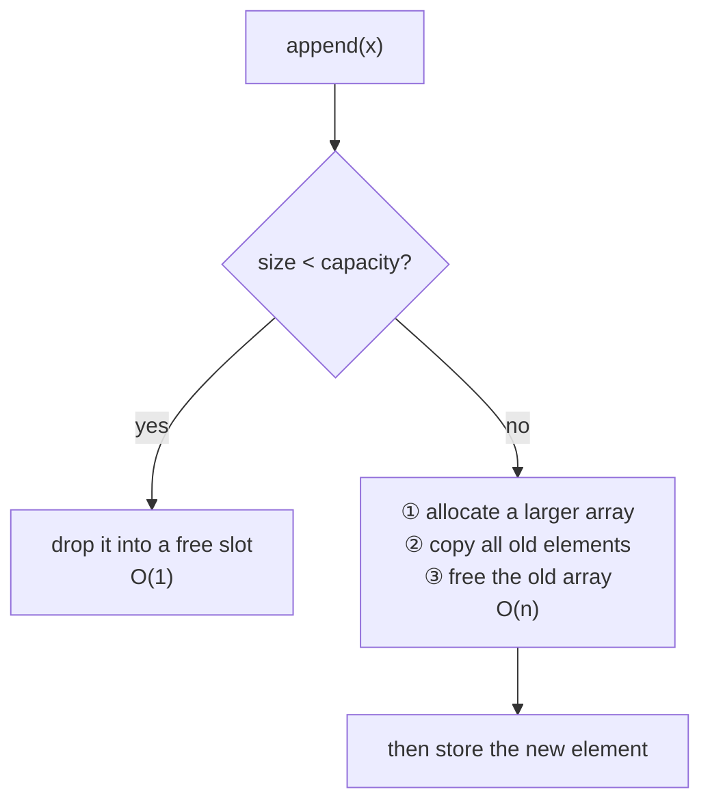

# Chapter 17 · List

[简体中文](./17-list.md) ｜ **English**

---

> The previous chapter's array has a fatal weakness: **it is fixed-length**. Declare `int a[5]` and there is no room for a sixth element. Yet in everyday code we call `list.append()`, `vector.push_back()`, and `arr.push()` without a second thought, as if capacity were infinite.
>
> How do they do it? This chapter reveals every secret of the dynamic array and answers one elegant question: **why does growth double rather than add one?** The measured answer is striking — the naive approach was over **four thousand times** slower.

## 1. Learning Objectives

By the end of this chapter, you will be able to:

- Distinguish **capacity from size** — the key to understanding dynamic arrays;
- Explain the **growth mechanism** and why appending is **amortized O(1)**;
- Derive why growth must be multiplicative, and why adding one degrades to **O(n²)**;
- State each language's **growth factor** and the trade-off behind it;
- Choose correctly between array and linked list, knowing each one's strength and cost.

---

## 2. Why This Concept Exists

The problem with fixed-length arrays is blunt: **you must know the count in advance**.

```text
int scores[100];        // what if a 101st student shows up?
int scores[10000];      // so make it big? but only 30 are used — 99.7% wasted
```

The dilemma: **too small and it overflows, too large and it wastes**. In real programs the count is usually known only at runtime (reading a file, receiving requests, user input).

The dynamic array's idea: **start with some land, and move to a bigger plot when it runs out**.

```text
list.append(x)     ← you just add; capacity is its problem
```

The cost is "moving" (reallocating and copying), and this chapter is about **how that cost is amortized into insignificance**.

---

## 3. How It Works

### Capacity and size: two different numbers

To understand dynamic arrays, separate two concepts:

| Concept | Meaning |
|---------|---------|
| **Size / length** | how many elements are **actually stored** |
| **Capacity** | how many the underlying array **can hold** |

**Capacity ≥ size**, and the gap is reserved space. When appending:



**Most of the time it's O(1) (just store); occasionally it's O(n) (move house).** So what is the average? That calls for **amortized analysis**.

### Amortized analysis: why appending is O(1)

Suppose capacity **doubles** when full, starting at 1, and we append n elements. Copies happen at capacities 1, 2, 4, 8… and each copy moves that many elements:

```text
total copies = 1 + 2 + 4 + 8 + ... + n/2 + n
             < 2n              ← geometric series
```

**n appends copy fewer than 2n elements in total.** Averaged per append:

```text
average cost = 2n / n = 2 = O(1)
```

That is **amortized O(1)**: a single operation may cost O(n) in the worst case, but **any sequence of n operations costs O(n) in total**, so the average per operation is constant.

> **A note on terminology**: amortized O(1) ≠ average O(1). The former is a **guarantee over any sequence of operations**; the latter is only a statistical expectation. Amortized analysis gives the stronger guarantee.

### Why not "add one each time"

If capacity grows by 1, every append copies everything:

```text
total copies = 1 + 2 + 3 + ... + n = n(n+1)/2 ≈ n²/2   →  O(n²)
```

**Measured** (C++ `-O2`, appending 60,000 elements):

| Growth strategy | Time | Complexity |
|-----------------|------|------------|
| Capacity +1 each time | **131.26 ms** | O(n²) |
| Double when full | **0.03 ms** | amortized O(1) |

**The naive approach was roughly 4300× slower.** That is the strongest defense of multiplicative growth.

> ⚠️ As in the previous chapter, this ratio depends on the environment (optimization, machine, element count). **Remember the order-of-magnitude difference (O(n²) vs O(n)), not the exact number** — run this chapter's examples on your own machine.

### The trade-off in the growth factor

Doubling is not the only option. With growth factor k:

- **Larger k**: fewer reallocations (faster), but **more wasted memory** (up to half idle in the worst case);
- **Smaller k**: less memory, but more frequent reallocations.

**Measured growth in each language**:

| Language | Growth factor | Observation |
|----------|--------------|-------------|
| **C++ (libc++)** | **2.0** | capacity: 1→2→4→8→16→32→64→128 (strict doubling) |
| **Python (CPython)** | **about 1.125 + a constant** | capacity: 4→8→16→24→32→40→52→64… (factor decays from 2.0 to below 1.2) |
| **Java (ArrayList)** | **1.5** | `newCap = oldCap + (oldCap >> 1)` |
| **C# (List\<T\>)** | **2.0** | capacity doubles |

**Python's strategy is clever**: grow fast when small (escaping frequent reallocation quickly), then settle to about 1.125 when large (avoiding big wasted blocks) — a design that covers both ends.

### The other road: linked lists

Dynamic arrays are not the only "growable sequence." A **linked list** solves the problem completely differently — no contiguity required; each node stores a value and a pointer to the next:

```text
array:  [92][75][88]              contiguous; address computed from the index
list:   [92|→][75|→][88|∅]        nodes scattered, strung together by pointers
```

| | Array (dynamic) | Linked list |
|---|---|---|
| Random access `a[i]` | **O(1)** | O(n) (must walk from the head) |
| Insert/delete at head | O(n) (shift everything) | **O(1)** |
| Insert in the middle (position known) | O(n) | **O(1)** |
| Append at the end | amortized O(1) | O(1) |
| Memory overhead | compact | one extra pointer per element |
| **Cache friendliness** | ✅ **excellent** | ❌ poor (nodes are scattered) |

**Measured** (Python, 20,000 insertions at the head):

| Structure | Time |
|-----------|------|
| `list.insert(0, x)` (array) | **518.6 ms** |
| `deque.appendleft(x)` (deque) | **0.6 ms** |

**About 800× faster.** But recall the previous chapter's lesson — **an array's cache advantage often outweighs its theoretical disadvantage**: at small and medium sizes with traversal-heavy access, arrays still tend to win.

---

## 4. JavaScript

**JavaScript has only `Array`**, which is dynamic by nature (there is no separate fixed-length array):

```javascript
const scores = [92, 75];
scores.push(88);            // append: amortized O(1)
scores.pop();               // remove last: O(1)
scores.unshift(100);        // insert at head: O(n) ← shifts everything
scores.shift();             // remove first: O(n)
scores.splice(1, 0, 60);    // insert in the middle: O(n)
```

**Capacity is not exposed** — V8 manages it, and you cannot preallocate (unlike C++'s `reserve`).

**But `TypedArray` gives you fixed-length, contiguous, uniformly-typed storage**:

```javascript
const buf = new Int32Array(1000);   // fixed length, genuinely contiguous
buf[0] = 92;
```

**A performance note**:

```javascript
// ❌ repeated head insertion is O(n²)
for (const x of items) result.unshift(x);
// ✅ append then reverse
for (const x of items) result.push(x);
result.reverse();
```

> **Note**: `unshift` / `shift` / `splice` are all O(n). When you need frequent operations at both ends, simulate a queue with two arrays or change the algorithm.

---

## 5. Python

**`list` is a dynamic array** (not a linked list — the name misleads):

```python
scores = [92, 75]
scores.append(88)          # append: amortized O(1)
scores.pop()               # remove last: O(1)
scores.insert(0, 100)      # insert at head: O(n) ← slow
scores.pop(0)              # remove first: O(n) ← slow
```

**You can observe the growth** (measured, deriving capacity from `sys.getsizeof`):

```python
import sys
lst = []
base = sys.getsizeof(lst)
for i in range(100):
    lst.append(i)
    cap = (sys.getsizeof(lst) - base) // 8    # 8 bytes per pointer
```

The measured output shows capacity growing `4 → 8 → 16 → 24 → 32 → 40 → 52 → 64 → 76 → 92 → 108` — **the factor decaying from 2.0 down to about 1.17**.

**Use `deque` when you need both ends**:

```python
from collections import deque
dq = deque([92, 75])
dq.appendleft(100)         # O(1) ← about 800× faster than list.insert(0, x) (measured)
dq.popleft()               # O(1)
```

**Comprehensions usually beat a loop of `append`** (fewer method calls):

```python
squares = [x * x for x in range(1000)]        # ✓ preferred
```

> **Note**: `list` suits "end operations + random access"; `deque` suits "operations at both ends." **Using the wrong one for head-heavy work costs an order of magnitude.**

---

## 6. Java

**`ArrayList` is a dynamic array; `LinkedList` is a doubly linked list** — both implement `List`:

```java
List<Integer> list = new ArrayList<>();
list.add(92);              // append: amortized O(1)
list.get(0);               // random access: O(1)
list.add(0, 100);          // insert at head: O(n)
list.remove(0);            // remove first: O(n)
```

**ArrayList's growth factor is 1.5** (`newCapacity = oldCapacity + (oldCapacity >> 1)` in the source).

**You can preallocate** — a clear win when the size is known:

```java
List<Integer> list = new ArrayList<>(10000);   // initial capacity, avoiding repeated growth
```

**`LinkedList` is rarely the right choice**: although head insertion is theoretically O(1), poor cache behavior and per-node overhead often make it **slower than `ArrayList` in practice**. For queue semantics, prefer `ArrayDeque`:

```java
Deque<Integer> deque = new ArrayDeque<>();     // faster than LinkedList as a deque
deque.addFirst(1);
deque.addLast(2);
```

> **Note**: `List.of(...)` creates an **immutable** list; calling `add` throws `UnsupportedOperationException`. For a mutable one, use `new ArrayList<>(List.of(...))`.

---

## 7. C++

**`std::vector` is the standard dynamic array**, and it **exposes capacity fully** — C++'s transparency philosophy:

```cpp
std::vector<int> v;
v.push_back(92);           // append: amortized O(1)
std::cout << v.size();     // size
std::cout << v.capacity(); // capacity ← most other languages hide this
```

**Measured growth** (libc++): capacity doubles strictly, `1 → 2 → 4 → 8 → 16 → 32 → 64 → 128`.

**`reserve` is an important optimization** (measured, five million appends):

| Approach | Time |
|----------|------|
| plain `push_back` | 14.1 ms |
| `reserve(N)` first | **5.6 ms** |

**About 2.5× faster**, because every intermediate reallocation and copy is eliminated.

**C++ offers a full spectrum of sequence containers**:

| Container | Underlying | Traits |
|-----------|-----------|--------|
| `vector` | dynamic array | O(1) random access, amortized O(1) append |
| `deque` | segmented arrays | O(1) at both ends, still O(1) random access |
| `list` | doubly linked list | O(1) insertion anywhere, but no random access |
| `forward_list` | singly linked list | the leanest linked list |

> ⚠️ **Note**: **growth invalidates all iterators, pointers, and references.** This code is undefined behavior:
> ```cpp
> auto it = v.begin();
> v.push_back(1);        // may reallocate → it is now invalid
> *it;                   // undefined behavior!
> ```

---

## 8. C#

**`List<T>` is a dynamic array** with growth factor **2.0**:

```csharp
var list = new List<int>();
list.Add(92);              // append: amortized O(1)
list[0];                   // random access: O(1)
list.Insert(0, 100);       // insert at head: O(n)
Console.WriteLine(list.Count);      // size
Console.WriteLine(list.Capacity);   // capacity ← C# exposes it too
```

**C# also supports preallocation**:

```csharp
var list = new List<int>(10000);        // initial capacity
list.Capacity = 20000;                   // or set it later
list.TrimExcess();                       // release surplus capacity
```

**A rich collection family**:

| Type | Purpose |
|------|---------|
| `List<T>` | dynamic array, the workhorse |
| `LinkedList<T>` | doubly linked list |
| `Queue<T>` / `Stack<T>` | queue / stack (Chapters 18–19) |
| `ImmutableList<T>` | immutable list |

> **Note**: C#'s `List<T>` **exposes `Capacity`** (Java's `ArrayList` does not), making performance tuning more direct.

---

## 9. SQL

Databases have no "dynamic array," but **the idea of capacity and growth exists all the same** — down in the storage layer.

### ① Table growth: pages and extents

A database manages storage in **pages** (typically 4–16 KB). When inserting a row, if the current page is full, a new one is allocated:

```sql
CREATE TABLE student (name TEXT, score INTEGER);
INSERT INTO student VALUES ('Alice', 92);   -- goes straight in if the page has room
-- page full → allocate a new page (much like a dynamic array growing)
```

**This is the same idea as batch allocation**: rather than asking the OS for space per row, ask for a large block at once and amortize the overhead.

### ② Bulk inserts far outperform row-by-row

The most direct practical parallel:

```sql
-- ❌ one at a time: transaction and log overhead per statement
INSERT INTO student VALUES ('A', 90);
INSERT INTO student VALUES ('B', 85);

-- ✅ one bulk statement
INSERT INTO student VALUES ('A', 90), ('B', 85), ('C', 78);
```

**The logic matches `reserve`**: merge n small operations into one large one and amortize the fixed cost.

### ③ The ordering counterpart

Recall Chapter 16: a table is an **unordered set** with no notion of "append to the end." For list semantics (ordered, positionally addressable) you must add an explicit position column:

```sql
CREATE TABLE playlist (
    position INTEGER,       -- order maintained explicitly
    song     TEXT
);
INSERT INTO playlist VALUES (1, 'first'), (2, 'second');
SELECT song FROM playlist ORDER BY position;
```

> ⚠️ **Note**: with a `position` column, **inserting in the middle requires updating every later row's position** — the database version of "middle insertion is O(n)." In practice people use fractional or sparse integers (10, 20, 30) to leave room.

---

## 10. Cross-Language Comparison

### ① Dynamic array traits

| Feature | JavaScript | Python | Java | C++ | C# |
|---------|-----------|--------|------|-----|-----|
| Type | `Array` | `list` | `ArrayList` | `vector` | `List<T>` |
| **Growth factor** | engine-internal | ~1.125, decaying | **1.5** | **2.0** | **2.0** |
| Exposes capacity | ❌ | ❌ (observable indirectly) | ❌ | ✅ `capacity()` | ✅ `Capacity` |
| Preallocation | ❌ | ❌ | ✅ constructor | ✅ `reserve()` | ✅ constructor/property |
| Append | `push` | `append` | `add` | `push_back` | `Add` |
| Head insert | `unshift` O(n) | `insert(0,x)` O(n) | `add(0,x)` O(n) | `insert(begin())` O(n) | `Insert(0,x)` O(n) |
| Efficient deque | ❌ (roll your own) | `deque` | `ArrayDeque` | `deque` | `LinkedList<T>` |

### ② Operation complexity (identical across languages)

| Operation | Dynamic array | Linked list |
|-----------|:-------------:|:-----------:|
| Indexed access | **O(1)** | O(n) |
| Append | amortized O(1) | O(1) |
| Remove last | O(1) | O(1) |
| Insert/delete at head | O(n) | **O(1)** |
| Insert in middle (position known) | O(n) | **O(1)** |
| Search | O(n) | O(n) |
| Memory locality | **excellent** | poor |

### ③ Commonalities and the root of differences

**In common**: the default "list" in all five languages is **a dynamic array** (not a linked list), all use multiplicative growth, and all provide amortized O(1) append.

**The differences** come down to two points:
- **The growth factor trade-off**: C++/C# choose 2.0 (fast, but up to half the memory idle), Java chooses 1.5 (a compromise), Python decays the factor (fast when small, frugal when large);
- **Whether capacity is exposed**: C++/C# expose it (finer tuning), JS/Python/Java hide it (less to think about) — the familiar "control vs. simplicity" trade-off.

---

## 11. Underlying Implementation Comparison

| Language · Implementation | Internal structure | Growth policy |
|---------------------------|-------------------|---------------|
| **JavaScript · V8** | `JSArray` + backing store (contiguous under fast elements) | engine-internal heuristics |
| **Python · CPython** | `PyListObject`: pointer array + `ob_size` + `allocated` | `new_allocated = newsize + (newsize >> 3) + 6` (~1.125× plus a constant) |
| **Java · JVM** | `ArrayList`: `Object[] elementData` + `size` | `newCapacity = oldCapacity + (oldCapacity >> 1)` (1.5×) |
| **C++ · libstdc++/libc++** | three pointers: `begin` / `end` / `capacity_end` | typically 2× (libc++ measured at strict doubling) |
| **C# · CLR** | `T[] _items` + `_size` | doubling, starting at 4 |

**An interesting theoretical detail**: some argue the growth factor should be the **golden ratio 1.618** rather than 2.0 — because with doubling, **a new block can never reuse the sum of all previously freed blocks** (1+2+4 < 8), while a factor below the golden ratio lets the allocator reuse old space more easily. Java's 1.5 sits close to that reasoning.

---

## 12. Performance Analysis

### Complexity summary

| Operation | Complexity | Notes |
|-----------|:----------:|-------|
| `append` / `push_back` | **amortized O(1)** | total copies < 2n |
| Indexed access | O(1) | inherited from the array |
| Head/middle insert or delete | O(n) | must shift the rest |
| Search (unsorted) | O(n) | element by element |

### Measured data (conditions noted)

**① Order-of-magnitude difference in growth strategy** (C++ `-O2`, 60,000 appends):

| Strategy | Time | Complexity |
|----------|------|------------|
| +1 each time | 131.26 ms | O(n²) |
| Doubling | 0.03 ms | amortized O(1) |

**② Preallocation gain** (C++ `-O2`, five million appends): 14.1 ms without → 5.6 ms with `reserve`, **about 2.5× faster**.

**③ Structural choice** (Python, 20,000 head insertions): `list.insert(0,x)` 518.6 ms → `deque.appendleft(x)` 0.6 ms, **about 800× faster**.

> ⚠️ All three depend on the environment (optimization, machine, data size). **Remember the orders of magnitude, not the exact figures** — the examples run as-is, so verify on your own machine.

**Practical advice**:

```cpp
v.reserve(n);              // preallocate when the size is known
```
```python
result = [f(x) for x in items]      # a comprehension beats a loop of append
```

---

## 13. Engineering Practice

| Scenario | ✅ Recommended | ❌ Discouraged | Why |
|----------|---------------|---------------|-----|
| Count known in advance | preallocate (`reserve` / constructor) | repeated appends | eliminates all intermediate growth |
| Frequent head insertion | `deque` / `ArrayDeque` | `list.insert(0,x)` | measured ~800× difference |
| Traversal plus appends only | dynamic array | linked list | cache-friendly, faster in practice |
| Large data, memory-sensitive | `TrimExcess` / `shrink_to_fit` when done | leaving capacity idle | up to half the memory may be idle |
| Holding element locations in C++ | store indices | store pointers/iterators | growth invalidates them all |
| Bulk construction in Python | list comprehension | loop of `append` | faster and clearer |
| Database inserts | bulk `INSERT` | one row at a time | again, amortizing fixed cost |

**One general rule**: **default to a dynamic array.** Switch to a linked list or deque only when you genuinely need frequent insertion at the ends or middle *and* you have measured it — because the array's cache advantage often cancels its theoretical disadvantage.

---

## 14. Best Practices

- **Preallocate when you can estimate the size**: one `reserve(n)` is often the cheapest optimization available.
- **Never insert/delete at the head inside a loop**: it turns an O(n) loop into O(n²).
- **Use a queue type when you need queue semantics** rather than forcing a list to do it.
- **In C++, iterators die on growth** — don't hold one across a `push_back`.
- **In Java, prefer `ArrayList` and `ArrayDeque`**; `LinkedList` has almost no use case.
- **Watch out for immutable collections**: `List.of()` (Java) and `tuple` (Python) cannot be modified.
- **Consider shrinking capacity after deleting many elements** in memory-sensitive code.

---

## 15. Common Pitfalls

**Pitfall 1 · Repeated head insertion in a loop**

```python
result = []
for x in items:
    result.insert(0, x)        # ✗ O(n) each time → O(n²) overall
result = list(reversed(items)) # ✓ or append then reverse
```

**Pitfall 2 · Iterator invalidation on growth in C++**

```cpp
std::vector<int> v{1,2,3};
auto it = v.begin();
v.push_back(4);       // may reallocate
std::cout << *it;     // ✗ undefined behavior
```
**How to avoid**: store an **index** rather than an iterator, or `reserve` enough capacity first.

**Pitfall 3 · Removing while iterating**

```java
for (String s : list) {
    if (s.isEmpty()) list.remove(s);   // ✗ ConcurrentModificationException
}
list.removeIf(String::isEmpty);        // ✓
```

**Pitfall 4 · Assuming Python's `list` is a linked list**

```python
# list is a dynamic array; head operations are O(n), not O(1)
```
**How to avoid**: use `collections.deque` for both-end operations.

**Pitfall 5 · Modifying an immutable list**

```java
List<Integer> list = List.of(1, 2, 3);
list.add(4);          // ✗ UnsupportedOperationException
new ArrayList<>(List.of(1,2,3)).add(4);   // ✓
```

**Pitfall 6 · Ignoring memory wasted by growth**

```text
with a 2× factor, nearly half the space may sit idle in the worst case
```
**How to avoid**: `shrink_to_fit()` (C++) / `TrimExcess()` (C#) when memory matters.

**Pitfall 7 · Using a list for frequent membership tests**

```python
if x in big_list:      # ✗ O(n)
if x in big_set:       # ✓ O(1) (Chapter 20, "Hash")
```

---

## 16. Interview Questions

**Basic**

1. What is the difference between a dynamic array's capacity and its size?
2. What is the difference between `ArrayList` and `LinkedList`, and when does each fit?
3. Why is inserting at the head slower than appending at the end?

**Intermediate**

4. Why is appending to a dynamic array "amortized O(1)"? Give the derivation.
5. Why must growth be multiplicative rather than +1? What is the complexity of the latter?
6. What growth factor does each language use? Why does Java pick 1.5 while C++ picks 2.0?

**Advanced**

7. Why does growth invalidate iterators in C++? How do you avoid the problem?
8. Some argue the growth factor should be below the golden ratio 1.618 — what is the reasoning?
9. Head insertion is theoretically O(1) for a linked list, so why is `ArrayList` often faster than `LinkedList` in practice?

---

## 17. Exercises

**Basic**

1. In each of the six languages, append ten thousand elements and time it.
2. In C++, print `capacity` while appending and identify the growth pattern.
3. In Python, observe capacity growth with `sys.getsizeof` and compare with C++.

**Intermediate**

4. Implement your own dynamic array (with growth logic) and benchmark it against the standard library.
5. Measure "+1 each time" versus "doubling" and verify O(n²) against O(n).
6. Plot the timing curves of `list.insert(0,x)` and `deque.appendleft(x)` across data sizes.

**Challenge**

7. Implement a **circular buffer** with O(1) insertion at both ends and compare it with `deque`.
8. Design an experiment: at what size and access pattern does a linked list actually beat a dynamic array? Report your measurements and explanation.

---

## 18. Summary

**In one sentence**: a dynamic array is **an array plus automatic growth**; the key is separating **capacity from size**, and the "double when full" policy makes appending **amortized O(1)** — because n appends copy fewer than 2n elements in total; growing by one instead degrades to O(n²) (measured ~4300× slower).

**Core takeaways**

- **Capacity ≥ size**, with the gap reserved; growth = allocate, copy, free.
- **The amortized O(1) derivation**: `1+2+4+…+n < 2n`, a constant per append.
- **Growth factors differ**: C++/C# 2.0, Java 1.5, Python ~1.125 decaying — speed versus thrift.
- **Head/middle operations are O(n)**; switch to a `deque` when needed (measured ~800× faster).
- **An array's cache advantage often cancels a linked list's theoretical edge** — which is why `LinkedList` is rare in practice.

**Checklist**

- [ ] I can explain capacity vs. size and describe the growth process.
- [ ] I can derive why appending is amortized O(1).
- [ ] I can explain why growth must be multiplicative and what +1 costs.
- [ ] I know each language's growth factor and why they differ.
- [ ] I know when to reach for a deque instead of a list.

**Next chapter**: a list allows operations anywhere, but one structure deliberately **allows entry and exit at one end only** — and that restriction makes it one of the most important structures there is: function calls rely on it, expression evaluation relies on it, and so does undo. That is Chapter 18, "Stack."

---

## 19. Further Reading

- <a href="https://en.wikipedia.org/wiki/Dynamic_array" target="_blank" rel="noopener">Wikipedia: Dynamic array</a> — growth strategies and factors in full.
- <a href="https://en.wikipedia.org/wiki/Amortized_analysis" target="_blank" rel="noopener">Wikipedia: Amortized analysis</a> — the aggregate, accounting, and potential methods.
- <a href="https://github.com/python/cpython/blob/main/Objects/listobject.c" target="_blank" rel="noopener">CPython source · listobject.c</a> — search for `list_resize` to see the real growth formula.
- <a href="https://docs.oracle.com/en/java/javase/21/docs/api/java.base/java/util/ArrayList.html" target="_blank" rel="noopener">Java docs · ArrayList</a> — the official word on capacity and growth.
- <a href="https://en.cppreference.com/w/cpp/container/vector" target="_blank" rel="noopener">cppreference · std::vector</a> — capacity, `reserve`, and iterator invalidation rules.
- <a href="https://learn.microsoft.com/en-us/dotnet/api/system.collections.generic.list-1" target="_blank" rel="noopener">Microsoft Learn · List\<T\></a> — `Capacity` and `TrimExcess` documentation.
- <a href="https://docs.python.org/3/library/collections.html#collections.deque" target="_blank" rel="noopener">Python docs · collections.deque</a> — the double-ended queue with O(1) at both ends.
