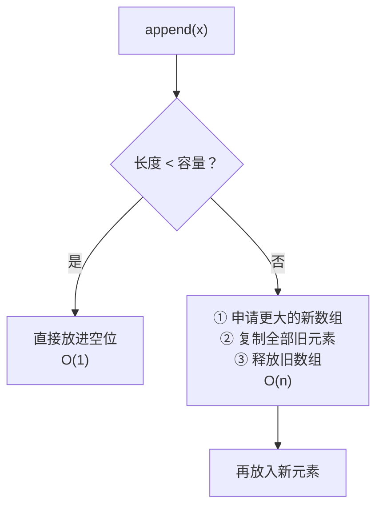

# 第 17 章 · 列表

**简体中文** ｜ [English](./17-list.en-US.md)

---

> 上一章的数组有个致命弱点：**定长**。声明 `int a[5]` 之后就装不下第 6 个元素了。可我们平时写代码时，`list.append()`、`vector.push_back()`、`arr.push()` 用得毫无负担，好像容量是无限的。
>
> 它们是怎么做到的？这一章会揭开动态数组的全部秘密，并回答一个漂亮的问题：**为什么扩容要"成倍增长"，而不是"每次加一"？** 实测答案会让你印象深刻——朴素做法慢了**四千多倍**。

## 1. 学习目标

本章结束后，你将能够：

- 区分**容量（capacity）与长度（size）**——这是理解动态数组的钥匙；
- 说清**扩容机制**，并解释为什么追加是**摊还 O(1)**；
- 推导出"为什么必须成倍增长"，并说明每次加一为何退化成 **O(n²)**；
- 说出五门语言各自的**增长因子**及其取舍；
- 在"数组 vs 链表"之间做出正确选择，知道各自的强项与代价。

---

## 2. 为什么会出现这个概念

定长数组的问题很直接：**你必须提前知道要装多少个元素**。

```text
int scores[100];        // 万一来了第 101 个学生？
int scores[10000];      // 那就开大点？可实际只用了 30 个，浪费了 99.7%
```

两难在于：**开小了装不下，开大了浪费**。而在真实程序里，元素个数常常是运行时才知道的（读文件、收网络请求、用户输入）。

动态数组的思路是：**先给一块地，不够了就搬家到更大的地方**。

```text
list.append(x)     ← 你只管加，容量的事交给它
```

代价是"搬家"（重新分配 + 复制），而这一章要讲的，就是**如何让搬家的代价摊薄到可以忽略**。

---

## 3. 底层原理

### 容量与长度：两个不同的数

理解动态数组，先分清两个概念：

| 概念 | 含义 |
|------|------|
| **长度（size / length）** | 当前**实际存了几个**元素 |
| **容量（capacity）** | 底层数组**能装下几个**元素 |

**容量 ≥ 长度**，中间的差额就是预留的空位。追加元素时：



**大多数时候是 O(1)（直接放），偶尔是 O(n)（要搬家）。** 那么平均下来是多少？这就要用到**摊还分析**。

### 摊还分析：为什么追加是 O(1)

假设容量满了就**翻倍**，从容量 1 开始追加 n 个元素。发生复制的时刻是容量 1、2、4、8……每次复制的元素数就是当时的容量：

```text
总复制次数 = 1 + 2 + 4 + 8 + ... + n/2 + n
          < 2n              ← 等比数列求和
```

**n 次追加，总共只复制了不到 2n 次。** 平均到每次追加：

```text
平均代价 = 2n / n = 2 = O(1)
```

这就是**摊还 O(1)**（amortized O(1)）：单次操作最坏是 O(n)，但**任意连续 n 次操作的总代价是 O(n)**，所以平均每次是常数。

> **注意用词**：摊还 O(1) ≠ 平均 O(1)。前者是**对任意操作序列的保证**，后者只是统计意义上的期望——摊还分析给出的保证更强。

### 为什么不能"每次加一"

如果每次只把容量加 1，每次追加都要复制全部元素：

```text
总复制次数 = 1 + 2 + 3 + ... + n = n(n+1)/2 ≈ n²/2   →  O(n²)
```

**实测对比**（C++ `-O2`，追加 6 万个元素）：

| 扩容策略 | 耗时 | 复杂度 |
|---------|------|--------|
| 每次容量 +1 | **131.26 ms** | O(n²) |
| 满了就翻倍 | **0.03 ms** | 摊还 O(1) |

**朴素做法慢了约 4300 倍。** 这是"成倍增长"这个设计最有力的辩护。

> ⚠️ 与上一章一样，这个倍数依赖具体环境（编译优化、机器、元素数量）。**要记住的是量级差异（O(n²) vs O(n)）而非确切数字**——请在自己机器上跑一遍本章示例。

### 增长因子的取舍

翻倍不是唯一选择。增长因子 k 的取舍是：

- **k 越大**：扩容次数越少（更快），但**内存浪费越多**（最坏时一半空间闲置）；
- **k 越小**：内存更省，但扩容更频繁。

**实测各语言的实际增长规律**：

| 语言 | 增长因子 | 实测观察 |
|------|---------|---------|
| **C++ (libc++)** | **2.0** | capacity: 1→2→4→8→16→32→64→128（严格翻倍） |
| **Python (CPython)** | **约 1.125 + 常数** | 容量: 4→8→16→24→32→40→52→64…（倍数从 2.0 递减到 1.2 以下） |
| **Java (ArrayList)** | **1.5** | `newCap = oldCap + (oldCap >> 1)` |
| **C# (List\<T\>)** | **2.0** | 容量翻倍 |

**Python 的策略很有意思**：小列表时增长快（迅速摆脱频繁扩容），大列表时因子降到约 1.125（避免大块内存浪费）。这是一种"两头兼顾"的设计。

### 另一条路：链表

动态数组不是唯一的"可变长序列"。**链表**用完全不同的方式解决问题——不要求连续内存，每个节点存一个值和指向下一个节点的指针：

```text
数组:  [92][75][88]              连续内存，靠下标计算地址
链表:  [92|→][75|→][88|∅]        节点散落各处，靠指针串起来
```

| | 数组（动态数组） | 链表 |
|---|---|---|
| 随机访问 `a[i]` | **O(1)** | O(n)（必须从头走） |
| 头部插入/删除 | O(n)（要搬移全部） | **O(1)** |
| 中间插入（已知位置） | O(n) | **O(1)** |
| 末尾追加 | 摊还 O(1) | O(1) |
| 内存开销 | 紧凑 | 每个元素多一个指针 |
| **缓存友好** | ✅ **很好** | ❌ 差（节点分散） |

**实测**（Python，2 万次头部插入）：

| 结构 | 耗时 |
|------|------|
| `list.insert(0, x)`（数组） | **518.6 ms** |
| `deque.appendleft(x)`（双端队列） | **0.6 ms** |

**快了约 800 倍。** 但请注意上一章的教训——**数组的缓存优势往往能弥补理论劣势**：在中小规模、以遍历为主的场景下，数组常常仍然胜出。

---

## 4. JavaScript

**JavaScript 只有 `Array`**，它本身就是动态的（没有单独的"定长数组"概念）：

```javascript
const scores = [92, 75];
scores.push(88);            // 末尾追加：摊还 O(1)
scores.pop();               // 末尾删除：O(1)
scores.unshift(100);        // 头部插入：O(n) ← 要搬移全部元素
scores.shift();             // 头部删除：O(n)
scores.splice(1, 0, 60);    // 中间插入：O(n)
```

**没有暴露容量**——V8 内部管理，你无法预分配（不像 C++ 的 `reserve`）。

**但可以用 `TypedArray` 获得定长、连续、同类型的数组**：

```javascript
const buf = new Int32Array(1000);   // 定长，真正的连续内存
buf[0] = 92;
```

**性能提示**：

```javascript
// ❌ 头部反复插入是 O(n²)
for (const x of items) result.unshift(x);
// ✅ 先追加再反转，或直接用 reverse
for (const x of items) result.push(x);
result.reverse();
```

> **注意事项**：`Array` 上的 `unshift` / `shift` / `splice` 都是 O(n)。需要频繁在两端操作时，考虑用两个数组模拟队列，或改变算法。

---

## 5. Python

**`list` 就是动态数组**（不是链表——名字容易误导）：

```python
scores = [92, 75]
scores.append(88)          # 末尾追加：摊还 O(1)
scores.pop()               # 末尾删除：O(1)
scores.insert(0, 100)      # 头部插入：O(n) ← 慢
scores.pop(0)              # 头部删除：O(n) ← 慢
```

**可以观察到扩容**（实测，用 `sys.getsizeof` 反推容量）：

```python
import sys
lst = []
base = sys.getsizeof(lst)
for i in range(100):
    lst.append(i)
    cap = (sys.getsizeof(lst) - base) // 8    # 每个指针 8 字节
```

实测输出显示容量按 `4 → 8 → 16 → 24 → 32 → 40 → 52 → 64 → 76 → 92 → 108` 增长——**增长倍数从 2.0 一路递减到约 1.17**。

**需要两端高效操作时用 `deque`**：

```python
from collections import deque
dq = deque([92, 75])
dq.appendleft(100)         # O(1) ← 比 list.insert(0, x) 快约 800 倍（实测）
dq.popleft()               # O(1)
```

**列表推导式通常比循环 append 更快**（少了方法调用开销）：

```python
squares = [x * x for x in range(1000)]        # ✓ 推荐
```

> **注意事项**：`list` 适合"末尾操作 + 随机访问"，`deque` 适合"两端操作"。**需要频繁在头部操作时，用错结构会带来数量级的性能差距**。

---

## 6. Java

**`ArrayList` 是动态数组，`LinkedList` 是双向链表**，两者都实现 `List` 接口：

```java
List<Integer> list = new ArrayList<>();
list.add(92);              // 末尾追加：摊还 O(1)
list.get(0);               // 随机访问：O(1)
list.add(0, 100);          // 头部插入：O(n)
list.remove(0);            // 头部删除：O(n)
```

**ArrayList 的增长因子是 1.5**（源码 `newCapacity = oldCapacity + (oldCapacity >> 1)`）。

**可以预分配容量**——已知规模时能明显减少扩容：

```java
List<Integer> list = new ArrayList<>(10000);   // 初始容量，避免反复扩容
```

**`LinkedList` 在实践中很少用**：虽然理论上头部插入是 O(1)，但由于缓存不友好、每个节点有额外开销，**实际性能常常不如 `ArrayList`**。需要队列语义时，推荐 `ArrayDeque`：

```java
Deque<Integer> deque = new ArrayDeque<>();     // 比 LinkedList 更快的双端队列
deque.addFirst(1);
deque.addLast(2);
```

> **注意事项**：`List.of(...)` 创建的是**不可变列表**，调用 `add` 会抛 `UnsupportedOperationException`。需要可变列表要用 `new ArrayList<>(List.of(...))`。

---

## 7. C++

**`std::vector` 是标准的动态数组**，而且它**把容量完全暴露给你**——这是 C++ 的透明哲学：

```cpp
std::vector<int> v;
v.push_back(92);           // 末尾追加：摊还 O(1)
std::cout << v.size();     // 长度
std::cout << v.capacity(); // 容量 ← 其他语言大多不暴露这个
```

**实测扩容规律**（libc++）：容量按 `1 → 2 → 4 → 8 → 16 → 32 → 64 → 128` 严格翻倍。

**`reserve` 预分配是重要的优化手段**（实测，追加五百万个元素）：

| 写法 | 耗时 |
|------|------|
| 直接 `push_back` | 14.1 ms |
| 先 `reserve(N)` 再 push | **5.6 ms** |

**快约 2.5 倍**，因为省掉了所有中间扩容与复制。

**C++ 提供了完整的序列容器谱系**：

| 容器 | 底层 | 特点 |
|------|------|------|
| `vector` | 动态数组 | 随机访问 O(1)，末尾追加摊还 O(1) |
| `deque` | 分段数组 | 两端操作 O(1)，随机访问仍 O(1) |
| `list` | 双向链表 | 任意位置插入 O(1)，但无随机访问 |
| `forward_list` | 单向链表 | 最省内存的链表 |

> ⚠️ **注意事项**：**扩容会使所有迭代器、指针、引用失效**。下面这段代码是未定义行为：
> ```cpp
> auto it = v.begin();
> v.push_back(1);        // 可能触发扩容 → it 已失效
> *it;                   // 未定义行为！
> ```

---

## 8. C#

**`List<T>` 是动态数组**，增长因子为 **2.0**：

```csharp
var list = new List<int>();
list.Add(92);              // 末尾追加：摊还 O(1)
list[0];                   // 随机访问：O(1)
list.Insert(0, 100);       // 头部插入：O(n)
Console.WriteLine(list.Count);      // 长度
Console.WriteLine(list.Capacity);   // 容量 ← C# 也暴露容量
```

**C# 同样支持预分配**：

```csharp
var list = new List<int>(10000);        // 初始容量
list.Capacity = 20000;                   // 也可以后续设置
list.TrimExcess();                       // 释放多余容量
```

**丰富的集合家族**：

| 类型 | 用途 |
|------|------|
| `List<T>` | 动态数组，最常用 |
| `LinkedList<T>` | 双向链表 |
| `Queue<T>` / `Stack<T>` | 队列 / 栈（第 18–19 章） |
| `ImmutableList<T>` | 不可变列表 |

> **注意事项**：C# 的 `List<T>` **暴露了 `Capacity` 属性**（Java 的 `ArrayList` 不暴露），这让性能调优更直接。

---

## 9. SQL

数据库里没有"动态数组"这个结构，但"**容量与增长**"的思想同样存在——只是发生在存储层。

### ① 表的增长：页与扩展

数据库按**页**（page，通常 4KB–16KB）管理存储。插入行时，如果当前页放不下，就分配新页：

```sql
CREATE TABLE student (name TEXT, score INTEGER);
INSERT INTO student VALUES ('Alice', 92);   -- 页有空间就直接放
-- 页满了 → 分配新页（类似动态数组的扩容）
```

**这与动态数组的"成批分配"是同一种思想**：不是每来一行就找操作系统要一次空间，而是**一次要一大块，摊薄开销**。

### ② 批量插入远快于逐条插入

这是最直接的实践对应：

```sql
-- ❌ 逐条插入：每条都有事务与日志开销
INSERT INTO student VALUES ('A', 90);
INSERT INTO student VALUES ('B', 85);

-- ✅ 批量插入：一次搞定
INSERT INTO student VALUES ('A', 90), ('B', 85), ('C', 78);
```

**道理和 `reserve` 一样**：把 n 次小操作合并成一次大操作，摊薄固定开销。

### ③ 有序性的对应

回顾第 16 章：表是**无序集合**，没有"追加到末尾"的概念。需要"列表语义"（有序、可按位置访问）时，要显式加序号列：

```sql
CREATE TABLE playlist (
    position INTEGER,       -- 显式维护顺序
    song     TEXT
);
INSERT INTO playlist VALUES (1, '第一首'), (2, '第二首');
SELECT song FROM playlist ORDER BY position;
```

> ⚠️ **注意**：用 `position` 列模拟列表时，**在中间插入需要更新后续所有行的 position**——这正是数组"中间插入 O(n)"的数据库版本。实践中常用小数或稀疏整数（10、20、30）留出插入空间。

---

## 10. 五语言横向对比

### ① 动态数组特性

| 特性 | JavaScript | Python | Java | C++ | C# |
|------|-----------|--------|------|-----|-----|
| 类型 | `Array` | `list` | `ArrayList` | `vector` | `List<T>` |
| **增长因子** | 引擎内部 | 约 1.125 递减 | **1.5** | **2.0** | **2.0** |
| 暴露容量 | ❌ | ❌（可间接观察） | ❌ | ✅ `capacity()` | ✅ `Capacity` |
| 可预分配 | ❌ | ❌ | ✅ 构造参数 | ✅ `reserve()` | ✅ 构造参数/属性 |
| 末尾追加 | `push` | `append` | `add` | `push_back` | `Add` |
| 头部插入 | `unshift` O(n) | `insert(0,x)` O(n) | `add(0,x)` O(n) | `insert(begin())` O(n) | `Insert(0,x)` O(n) |
| 高效双端结构 | ❌（需自己实现） | `deque` | `ArrayDeque` | `deque` | `LinkedList<T>` |

### ② 操作复杂度（所有语言一致）

| 操作 | 动态数组 | 链表 |
|------|:-------:|:----:|
| 按下标访问 | **O(1)** | O(n) |
| 末尾追加 | 摊还 O(1) | O(1) |
| 末尾删除 | O(1) | O(1) |
| 头部插入/删除 | O(n) | **O(1)** |
| 中间插入（已知位置） | O(n) | **O(1)** |
| 查找元素 | O(n) | O(n) |
| 内存局部性 | **优** | 差 |

### ③ 共同点与差异根源

**共同点**：五门语言的"列表"默认实现**全都是动态数组**（不是链表），都采用成倍增长策略，都提供摊还 O(1) 的末尾追加。

**差异根源**在两点：
- **增长因子的取舍**：C++/C# 选 2.0（快，但最坏浪费一半内存），Java 选 1.5（折中），Python 用递减因子（小列表快、大列表省）；
- **是否暴露容量**：C++/C# 暴露（便于精细调优），JS/Python/Java 隐藏（简化心智负担）。这体现了"控制力 vs 简洁性"的一贯权衡。

---

## 11. 底层实现对比

| 语言 · 实现 | 内部结构 | 扩容策略 |
|------------|---------|---------|
| **JavaScript · V8** | `JSArray` + 后备存储（fast elements 时是连续的） | 引擎内部启发式增长 |
| **Python · CPython** | `PyListObject`：指针数组 + `ob_size` + `allocated` | `new_allocated = newsize + (newsize >> 3) + 6`（约 1.125 倍 + 常数） |
| **Java · JVM** | `ArrayList`：`Object[] elementData` + `size` | `newCapacity = oldCapacity + (oldCapacity >> 1)`（1.5 倍） |
| **C++ · libstdc++/libc++** | 三个指针：`begin` / `end` / `capacity_end` | 通常 2 倍（实测 libc++ 严格翻倍） |
| **C# · CLR** | `T[] _items` + `_size` | 容量翻倍，初始为 4 |

**一个有趣的理论细节**：有人主张增长因子应取**黄金比例 1.618** 而非 2.0——因为翻倍时，**新申请的块永远无法复用之前释放的所有块之和**（1+2+4 < 8），而小于黄金比例的因子可以让内存分配器更容易复用旧空间。Java 的 1.5 正接近这个考量。

---

## 12. 性能分析

### 时间复杂度小结

| 操作 | 复杂度 | 说明 |
|------|:------:|------|
| `append` / `push_back` | **摊还 O(1)** | 总复制次数 < 2n |
| 按下标访问 | O(1) | 继承自数组 |
| 头部/中间插入删除 | O(n) | 需搬移后续元素 |
| 查找（无序） | O(n) | 逐个比较 |

### 实测数据（条件已注明）

**① 扩容策略的量级差异**（C++ `-O2`，6 万次追加）：

| 策略 | 耗时 | 复杂度 |
|------|------|--------|
| 每次 +1 | 131.26 ms | O(n²) |
| 翻倍 | 0.03 ms | 摊还 O(1) |

**② 预分配收益**（C++ `-O2`，五百万次追加）：不预分配 14.1 ms → `reserve` 后 5.6 ms，**快约 2.5 倍**。

**③ 结构选择的影响**（Python，2 万次头部插入）：`list.insert(0,x)` 518.6 ms → `deque.appendleft(x)` 0.6 ms，**快约 800 倍**。

> ⚠️ 三组数字都依赖具体环境（编译优化、机器、数据规模）。**记住量级关系，不要记死数字**——本章示例可直接运行，请在你自己的机器上验证。

**实践建议**：

```cpp
v.reserve(n);              // 已知规模就预分配
```
```python
result = [f(x) for x in items]      # 推导式优于循环 append
```

---

## 13. 工程实践

| 场景 | ✅ 推荐 | ❌ 不推荐 | 原因 |
|------|--------|----------|------|
| 已知元素个数 | 预分配容量（`reserve` / 构造参数） | 直接反复追加 | 省掉全部中间扩容 |
| 频繁头部插入 | `deque` / `ArrayDeque` | `list.insert(0,x)` | 实测差约 800 倍 |
| 只需遍历和末尾追加 | 动态数组 | 链表 | 缓存友好，实际更快 |
| 大量数据 + 内存敏感 | 用完 `TrimExcess` / `shrink_to_fit` | 放任容量闲置 | 最坏可能浪费一半内存 |
| C++ 保存元素地址 | 保存索引 | 保存指针/迭代器 | 扩容会让它们全部失效 |
| Python 批量构造 | 列表推导式 | 循环 `append` | 更快也更清晰 |
| 数据库插入 | 批量 `INSERT` | 逐条插入 | 同样是"摊薄固定开销" |

**一条通用原则**：**默认用动态数组**。只有在"确实需要频繁在两端或中间增删"且经过测量后，才换用链表或双端队列——因为数组的缓存优势常常能抵消理论上的复杂度劣势。

---

## 14. 最佳实践

- **能预估大小就预分配**：一行 `reserve(n)` 常常是最省力的优化。
- **不要在循环里对头部做增删**：这会把 O(n) 的循环变成 O(n²)。
- **需要队列语义就用队列结构**，不要用列表硬凑。
- **C++ 中扩容后旧迭代器失效**——不要跨 `push_back` 持有迭代器。
- **Java 优先 `ArrayList` 与 `ArrayDeque`**，`LinkedList` 几乎没有使用场景。
- **注意不可变集合**：`List.of()`（Java）、`tuple`（Python）不能修改。
- **删除大量元素后考虑收缩容量**（内存敏感场景）。

---

## 15. 常见坑

**坑 1 · 在循环中反复头部插入**

```python
result = []
for x in items:
    result.insert(0, x)        # ✗ 每次 O(n) → 整体 O(n²)
result = list(reversed(items)) # ✓ 或先 append 再 reverse
```

**坑 2 · C++ 扩容导致迭代器失效**

```cpp
std::vector<int> v{1,2,3};
auto it = v.begin();
v.push_back(4);       // 可能重新分配内存
std::cout << *it;     // ✗ 未定义行为
```
**如何避免**：保存**索引**而非迭代器；或先 `reserve` 到足够容量。

**坑 3 · 遍历时删除元素**

```java
for (String s : list) {
    if (s.isEmpty()) list.remove(s);   // ✗ ConcurrentModificationException
}
list.removeIf(String::isEmpty);        // ✓
```

**坑 4 · 误以为 Python 的 `list` 是链表**

```python
# list 是动态数组，头部操作是 O(n)，不是 O(1)
```
**如何避免**：需要两端操作用 `collections.deque`。

**坑 5 · 修改不可变列表**

```java
List<Integer> list = List.of(1, 2, 3);
list.add(4);          // ✗ UnsupportedOperationException
new ArrayList<>(List.of(1,2,3)).add(4);   // ✓
```

**坑 6 · 忽视扩容带来的内存浪费**

```text
容量 2 倍增长时，最坏情况下有近一半空间是闲置的
```
**如何避免**：内存敏感时用 `shrink_to_fit()`（C++）/ `TrimExcess()`（C#）。

**坑 7 · 用列表做频繁的成员检查**

```python
if x in big_list:      # ✗ O(n)
if x in big_set:       # ✓ O(1)（第 20 章「哈希」）
```

---

## 16. 面试题

**基础**

1. 动态数组的容量和长度有什么区别？
2. `ArrayList` 和 `LinkedList` 有什么区别？各适合什么场景？
3. 为什么在列表头部插入元素比在末尾追加慢？

**中级**

4. 为什么说动态数组的追加是"摊还 O(1)"？请给出推导。
5. 为什么扩容要成倍增长而不是每次加一？后者的复杂度是多少？
6. 各语言的增长因子是多少？为什么 Java 选 1.5 而 C++ 选 2.0？

**高级**

7. 为什么 C++ 中扩容会导致迭代器失效？如何规避？
8. 有观点认为增长因子应该小于黄金比例 1.618，理由是什么？
9. 理论上链表的头部插入是 O(1)，但为什么实践中 `ArrayList` 常常比 `LinkedList` 还快？

---

## 17. 练习

**基础**

1. 在六门语言中各写一段代码，追加一万个元素并计时。
2. 在 C++ 中打印 `vector` 追加过程中 `capacity` 的变化，找出增长规律。
3. 在 Python 中用 `sys.getsizeof` 观察 `list` 的容量增长，与 C++ 对比。

**提高**

4. 自己实现一个动态数组（含扩容逻辑），并与标准库对比性能。
5. 实测"每次容量 +1"与"翻倍"两种策略的耗时差异，验证 O(n²) 与 O(n)。
6. 对比 `list.insert(0,x)` 与 `deque.appendleft(x)` 在不同数据量下的耗时曲线。

**挑战**

7. 实现一个支持 O(1) 头尾插入的**环形缓冲区**（circular buffer），并与 `deque` 对比。
8. 设计实验：在什么数据规模和访问模式下，链表才真的比动态数组快？给出你的测量结果与解释。

---

## 18. 本章总结

**一句话总结**：动态数组＝**数组 + 自动扩容**；关键是分清**容量与长度**，而"满了就成倍增长"这一策略让追加达到**摊还 O(1)**——因为 n 次追加的总复制次数不超过 2n；若改成每次加一，就会退化成 O(n²)（实测慢约 4300 倍）。

**核心知识点**

- **容量 ≥ 长度**，差额是预留空位；扩容 = 申请新数组 + 复制 + 释放旧的。
- **摊还 O(1)** 的推导：`1+2+4+…+n < 2n`，平均每次常数代价。
- **各语言增长因子不同**：C++/C# 2.0、Java 1.5、Python 约 1.125 递减——快与省的权衡。
- **头部/中间操作是 O(n)**，需要时改用 `deque`（实测快约 800 倍）。
- **数组的缓存优势常能抵消链表的理论优势**——这也是 `LinkedList` 在实践中罕用的原因。

**检查清单**

- [ ] 我能解释容量与长度的区别，并说清扩容过程。
- [ ] 我能推导"为什么追加是摊还 O(1)"。
- [ ] 我能说明为什么必须成倍增长，以及每次加一的后果。
- [ ] 我知道各语言的增长因子，以及为什么它们选择不同。
- [ ] 我知道什么时候该用双端队列而不是列表。

**下一章预告**：列表可以在任意位置操作，但有一种结构故意**只允许在一端进出**——这个限制反而让它成了最重要的数据结构之一：函数调用靠它、表达式求值靠它、撤销操作也靠它。这就是第 18 章「栈」。

---

## 19. 延伸阅读

- <a href="https://en.wikipedia.org/wiki/Dynamic_array" target="_blank" rel="noopener">Wikipedia：动态数组</a> — 扩容策略与增长因子的完整讨论。
- <a href="https://en.wikipedia.org/wiki/Amortized_analysis" target="_blank" rel="noopener">Wikipedia：摊还分析</a> — 聚合法、记账法、势能法三种分析方式。
- <a href="https://github.com/python/cpython/blob/main/Objects/listobject.c" target="_blank" rel="noopener">CPython 源码 · listobject.c</a> — 搜索 `list_resize` 可以看到真实的增长公式。
- <a href="https://docs.oracle.com/en/java/javase/21/docs/api/java.base/java/util/ArrayList.html" target="_blank" rel="noopener">Java 文档 · ArrayList</a> — 含容量与增长策略的官方说明。
- <a href="https://en.cppreference.com/w/cpp/container/vector" target="_blank" rel="noopener">cppreference · std::vector</a> — 容量、`reserve` 与迭代器失效规则。
- <a href="https://learn.microsoft.com/en-us/dotnet/api/system.collections.generic.list-1" target="_blank" rel="noopener">Microsoft Learn · List\<T\></a> — `Capacity` 与 `TrimExcess` 的官方文档。
- <a href="https://docs.python.org/3/library/collections.html#collections.deque" target="_blank" rel="noopener">Python 文档 · collections.deque</a> — 两端 O(1) 操作的双端队列。
