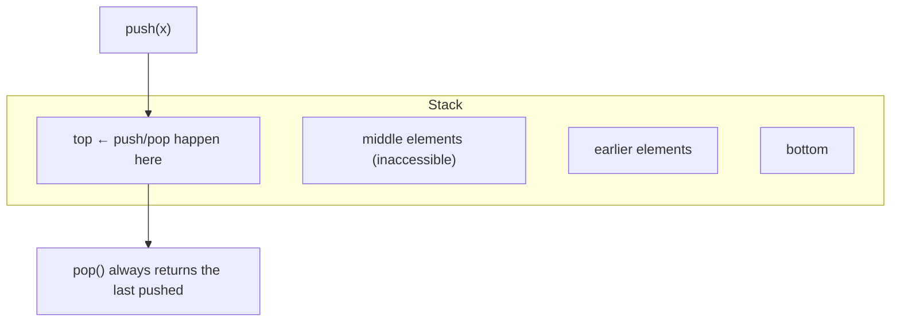

# Chapter 18 · Stack

[简体中文](./18-stack.md) ｜ **English**

---

> Arrays and lists in the previous chapters were "free": you can read and write anywhere. The stack is the opposite — it **allows entry and exit at one end only**.
>
> That sounds like a step backwards: fewer capabilities, so why bother? Yet this is the chapter's central lesson: **the restriction is not a flaw, it is the entire point.** Because a whole class of real-world problems is inherently last-in-first-out — **anything nested needs a stack**. Nested calls, nested brackets, nested tags, undo history… every line of code you write already runs on one.

## 1. Learning Objectives

By the end of this chapter, you will be able to:

- Define a stack (**LIFO**) and its core operations, and explain why the restriction is an advantage;
- Recognize the general pattern **"nested structure ⇒ use a stack"** and name at least four applications;
- Implement **bracket matching** and **postfix evaluation** with a stack, and see how it makes operator precedence vanish;
- Explain the **equivalence of recursion and stacks**, and convert recursion into an explicit-stack loop;
- Know which stack implementation to use per language, and why **Java's `Stack` class should no longer be used**.

---

## 2. Why This Concept Exists

Start with a real problem: **how do you check whether brackets in a piece of code are balanced?**

```text
(a[b]{c})     ← valid
(a[b)]        ← invalid: they cross
```

A single counter won't do — you must remember "which unclosed bracket came most recently." And that "most recently" is the crux: **the last one opened must be the first one closed.**

That is **LIFO (Last In, First Out)**, and a stack is that rule turned into a data structure:

| Operation | Meaning |
|-----------|---------|
| `push(x)` | put on top |
| `pop()` | remove from the top |
| `peek()` / `top()` | look at the top without removing |
| `isEmpty()` | is it empty |

**Note what it cannot do**: no access to the middle, no indexing, no iteration. **Those restrictions are what make a stack reliable** — you cannot misuse it, and its behavior is entirely predictable.

> **An important idea in data structure design**: **restriction is guarantee**. A structure exposing only the necessary operations is safer and easier to reason about than one that can do everything.

---

## 3. How It Works

### LIFO: one way in and out



**The stack-of-plates analogy**: you can only add a plate on top and only take one from the top — to reach the bottom one, you must remove everything above it.

### Why nested structures naturally need a stack

This is the chapter's core insight. Notice what these have in common:

```text
Function calls: main() → average() → sum()      ← sum returns first, main last
Brackets:       ( [ { } ] )                      ← last opened, first closed
HTML tags:      <div><p><b></b></p></div>        ← the innermost closes first
Undo:           edit A → edit B → edit C, undo C first
```

**All of them are "what started last finishes first."** Which is exactly LIFO. Therefore:

> **Whenever you meet a nested structure, the answer is almost certainly a stack.**

### Application 1: the call stack (revisiting Chapter 12)

Why do function calls use a stack? Because calls nest — `main` calls `average`, which calls `sum`, so `sum` must return first. Each call pushes a frame; each return pops one:

```text
call main()      → push main's frame
  call average() → push average's frame
    call sum()   → push sum's frame
    sum returns  → pop
  average returns → pop
main returns      → pop
```

**Recursion overflows the stack** (Chapter 12 measured Python at about 998 levels) for exactly this reason: every level pushes a frame, and stack space is finite.

### Application 2: expression evaluation — precedence disappears

We normally write **infix** expressions like `3 + 4 * 2`, which require precedence and parentheses. But in **postfix** (reverse Polish) form, `3 4 2 * +`, evaluation becomes trivial — **one stack, one left-to-right scan**:

```text
read 3   → push        stack: [3]
read 4   → push        stack: [3, 4]
read 2   → push        stack: [3, 4, 2]
read *   → pop 2 and 4, compute 4*2=8, push  stack: [3, 8]
read +   → pop 8 and 3, compute 3+8=11, push stack: [11]
result = 11
```

**Measured**: evaluating `"3 4 2 * +"` yields `11.0` ✓ (equivalent to infix `3 + 4 * 2`).

**Precedence and parentheses have vanished** — they were baked into the postfix ordering. And converting infix to postfix uses a stack too (the **shunting yard algorithm**, invented by Dijkstra).

> This is part of what a compiler does (Chapter 03): turn your infix expression into a form that is easy to evaluate.

### Application 3: bracket matching

```text
opening bracket → push
closing bracket → pop and check that it matches
empty stack at the end → everything matched
```

**Measured**: `(a[b]{c})` → matches; `(a[b)]` → does not (crossing); `(((` → does not (leftovers).

### Application 4: undo and depth-first search

- **Undo**: push each operation, pop to undo — the principle behind `Ctrl+Z`;
- **Depth-first search**: the recursive version uses the call stack, the iterative version an explicit stack — the two are equivalent.

### Recursion ⇄ explicit stack: interchangeable

Since recursion rides on the call stack, **any recursion can be rewritten iteratively with an explicit stack**:

```python
# recursive
def dfs(node):
    if not node: return
    visit(node); dfs(node.left); dfs(node.right)

# explicit stack (equivalent, and won't overflow)
def dfs_iter(root):
    stack = [root]
    while stack:
        node = stack.pop()
        if not node: continue
        visit(node)
        stack.append(node.right)   # note the order: last pushed is processed first
        stack.append(node.left)
```

**This is the concrete technique behind Chapter 12's "rewrite deep recursion as iteration."**

### Two implementations

| Implementation | Pros | Cons |
|----------------|------|------|
| **Array / dynamic array** | cache-friendly, no pointer overhead | may need to grow (amortized O(1)) |
| **Linked list** | every push is truly O(1), no growth | cache-unfriendly, one extra pointer per node |

**Practice almost always uses an array** — the same reasoning as Chapter 17: the cache advantage outweighs the theoretical one.

---

## 4. JavaScript

**JavaScript has no built-in Stack class**; just use `Array`'s `push` / `pop` (both O(1)):

```javascript
const stack = [];
stack.push(1);          // push
stack.push(2);
console.log(stack.pop());              // 2 ← last in, first out
console.log(stack[stack.length - 1]);  // peek at the top
console.log(stack.length === 0);       // empty?
```

**Bracket matching**:

```javascript
function isBalanced(s) {
  const pairs = { ")": "(", "]": "[", "}": "{" };
  const stack = [];
  for (const ch of s) {
    if ("([{".includes(ch)) stack.push(ch);
    else if (ch in pairs) {
      if (stack.pop() !== pairs[ch]) return false;
    }
  }
  return stack.length === 0;
}
```

> ⚠️ **Note**: **never use `shift()` as pop** — `pop()` from the end is O(1) while `shift()` from the front is **O(n)** (Chapter 17). A stack belongs at the end of the array.

---

## 5. Python

**Python has no separate Stack class either**; the official docs recommend `list`:

```python
stack = []
stack.append(1)         # push (just append)
stack.append(2)
print(stack.pop())      # 2 ← pop the top
print(stack[-1])        # peek
print(not stack)        # empty?
```

**Postfix evaluation with a stack** (measured):

```python
def eval_rpn(tokens):
    st = []
    for t in tokens:
        if t in "+-*/":
            b, a = st.pop(), st.pop()       # note: the first pop is the RIGHT operand
            st.append({"+": a+b, "-": a-b, "*": a*b, "/": a/b}[t])
        else:
            st.append(float(t))
    return st[0]

eval_rpn("3 4 2 * +".split())    # 11.0
```

**`deque` works as a stack too**, though `list` suffices (deque's edge is at both ends):

```python
from collections import deque
stack = deque()
stack.append(1); stack.pop()
```

> ⚠️ **Note**: **don't use `list.pop(0)`** — that is an O(n) removal from the front. `pop()` with no argument (from the end) is the O(1) one.

---

## 6. Java

Java has two "stacks," but **only one you should use**.

**❌ `java.util.Stack` (not recommended)** — a Java 1.0 legacy class with two serious flaws:

```java
Stack<String> bad = new Stack<>();
bad.push("bottom"); bad.push("middle"); bad.push("top");
System.out.println(bad.get(0));   // "bottom" ← indexing actually works!
```

**Flaw one: a design error.** `Stack` **extends `Vector`**, inheriting `get(i)`, `add(i, x)`, and friends — **which destroys the "one end only" semantics** (measured: `get(0)` really does return the bottom).

**Flaw two: performance.** All of `Vector`'s methods are `synchronized`, so even single-threaded code pays for locking. Measured (20 million push+pop each):

| Implementation | Time |
|----------------|------|
| `java.util.Stack` | 329 ms |
| `ArrayDeque` | **177 ms** |

**ArrayDeque is about 1.9× faster.**

**✅ `ArrayDeque` (officially recommended)**:

```java
Deque<Integer> stack = new ArrayDeque<>();
stack.push(1);          // push (equivalent to addFirst)
stack.push(2);
stack.pop();            // 2
stack.peek();           // look at the top
stack.isEmpty();
```

> **The Java docs say it directly**: `ArrayDeque` is faster than `Stack` when used as a stack. **Use `ArrayDeque` in all new code.**

---

## 7. C++

**C++'s `std::stack` is a container adapter** — not a container itself, but **a restriction layer on top of another container**:

```cpp
#include <stack>
std::stack<int> s;              // backed by deque by default
s.push(1);
s.push(2);
std::cout << s.top();           // 2 ← peek (called top, not peek)
s.pop();                        // remove (note: pop() returns nothing!)
std::cout << s.empty();
```

**You can choose the backing container**:

```cpp
std::stack<int, std::vector<int>> s1;   // vector (leaner memory)
std::stack<int, std::list<int>> s2;     // linked list
```

**This is the textbook demonstration of "restriction is guarantee"**: `stack` deliberately seals off the backing container's random access and iteration, leaving only the LIFO interface — **you cannot misuse it** (contrast Java's `Stack`, which leaks `get(i)`).

> ⚠️ **Two things to watch**:
> ① **`pop()` returns nothing** (unlike other languages) — call `top()` first, then `pop()`. This is for exception safety (if returning by value threw during the copy, the element would be lost).
> ② **Calling `top()` / `pop()` on an empty stack is undefined behavior** — always check `empty()` first.

---

## 8. C#

**`Stack<T>` is a dedicated stack type** with a clean design (it does not inherit from a list, unlike Java's):

```csharp
var stack = new Stack<int>();
stack.Push(1);
stack.Push(2);
Console.WriteLine(stack.Pop());     // 2 ← pops and returns
Console.WriteLine(stack.Peek());    // look at the top
Console.WriteLine(stack.Count);
```

**C#'s `Pop()` returns the value** (more convenient than C++), and there is a safe variant:

```csharp
if (stack.TryPop(out int value))    // false on empty, no exception
    Console.WriteLine(value);
```

**Iteration goes from top to bottom**:

```csharp
foreach (var x in stack)            // most recently pushed first
    Console.WriteLine(x);
```

> **Note**: `Stack<T>` supports `foreach` but **not indexing** — a far cleaner semantic boundary than Java's `Stack`.

---

## 9. SQL

SQL has no stack data structure, but **stack semantics do appear in databases** — most clearly in **savepoints**.

### ① Savepoints: a stack inside a transaction

Savepoints let you set multiple rollback anchors within one transaction, and they behave **exactly like a stack**:

```sql
BEGIN;
INSERT INTO student VALUES ('Alice', 92);
SAVEPOINT sp1;                      -- push
INSERT INTO student VALUES ('Bob', 75);
SAVEPOINT sp2;                      -- push again
INSERT INTO student VALUES ('Carol', 50);

ROLLBACK TO sp2;                    -- back to sp2: undo Carol
ROLLBACK TO sp1;                    -- back to sp1: undo Bob (sp2 is discarded too)
COMMIT;                             -- only Alice survives
```

**Rolling back to a savepoint discards every savepoint above it** — precisely "pop the top and everything above." **Nested ⇒ stack** holds once again.

### ② Evaluating recursive queries

Chapter 11's recursive CTE maintains a working set during evaluation whose expansion order is conceptually related to stack/queue traversal — walking hierarchical data is naturally stack- or queue-shaped.

### ③ The nested-transaction analogy

```text
Application: BEGIN → SAVEPOINT → SAVEPOINT → ROLLBACK TO → COMMIT
Stack ops:   push  →   push    →   push    →  pop(to a level) → clear
```

> **A practical note**: many ORM frameworks implement "nested transactions" with savepoints. Understanding the stack semantics explains why an inner rollback doesn't affect the outer transaction.

---

## 10. Cross-Language Comparison

### ① Implementations

| Language | Recommended | Push | Pop | Peek |
|----------|-------------|------|-----|------|
| JavaScript | `Array` | `push` | `pop` | `arr[arr.length-1]` |
| Python | `list` | `append` | `pop` | `lst[-1]` |
| Java | **`ArrayDeque`** | `push` | `pop` | `peek` |
| C++ | `std::stack` | `push` | `pop` (returns nothing) | `top` |
| C# | `Stack<T>` | `Push` | `Pop` | `Peek` |

### ② Design comparison: who encapsulates best

| Language | Dedicated stack type | Indexing possible | Verdict |
|----------|:-------------------:|:-----------------:|---------|
| **C++ `std::stack`** | ✅ adapter | ❌ **completely sealed** | **strictest encapsulation** — restriction is guarantee |
| **C# `Stack<T>`** | ✅ | ❌ | clean; iterable but not indexable |
| **Java `ArrayDeque`** | it's a deque | ❌ | the recommended choice |
| **Java `Stack`** | ✅ (obsolete) | ⚠️ **yes!** | **a design error**: extending Vector leaks the list interface |
| JavaScript / Python | ❌ list stands in | ⚠️ yes | by convention; the language doesn't enforce it |

**This table captures a philosophical difference**: C++ enforces the restriction through the type system, while Python/JS rely on convention — more flexible, but easier to misuse.

### ③ Commonalities and the root of differences

**In common**: stack operations are O(1) everywhere, all are built on arrays or linked lists, and all serve the same scenarios (nesting, backtracking, undo).

**The differences**:
- **Whether a dedicated type exists** reflects how much the language cares about encapsulation. C++/C# provide one; JS/Python consider a list sufficient;
- **Java's historical baggage** is the clearest case: `Stack extends Vector` was a 1.0-era mistake that compatibility prevents fixing, so the docs steer you to `ArrayDeque` instead.

---

## 11. Underlying Implementation Comparison

| Language · Implementation | Backing structure | Traits |
|---------------------------|-------------------|--------|
| **JavaScript · Array** | dynamic array (V8 fast elements) | O(1) at the end, cache-friendly |
| **Python · list** | pointer array | `append`/`pop` amortized O(1) |
| **Java · ArrayDeque** | **circular array** | no synchronization, O(1) at both ends |
| **Java · Stack** | `Vector` (synchronized array) | locks on every operation → measured 1.9× slower |
| **C++ · std::stack** | adapter, `deque` by default | can switch to `vector` for leaner memory |
| **C# · Stack\<T\>** | `T[]` plus a count | doubling growth (Chapter 17) |

**A detail worth noting**: Java's `ArrayDeque` uses a **circular array**, which is how it achieves O(1) at both ends without shifting elements — exactly the "circular buffer" from Chapter 17's exercises.

---

## 12. Performance Analysis

| Operation | Complexity | Notes |
|-----------|:----------:|-------|
| `push` | **amortized O(1)** | array-backed versions occasionally grow |
| `pop` | **O(1)** | touches only the top |
| `peek` / `top` | **O(1)** | reads the top |
| Search | O(n) | but a stack isn't for searching |
| Space | O(n) | array-backed is more compact |

**Measured** (Java, 20 million push+pop each, warmed up):

| Implementation | Time |
|----------------|------|
| `java.util.Stack` | 329 ms |
| `ArrayDeque` | **177 ms** |

**About 1.9× faster** — the gap comes from `Vector`'s synchronization.

> ⚠️ As in the last two chapters, the number depends on the environment (JIT, machine, size). **Remember the conclusion ("use ArrayDeque"), and measure the ratio yourself.**

**Practical advice**:

```java
Deque<Integer> stack = new ArrayDeque<>(expectedSize);   // preallocate (Chapter 17)
```

---

## 13. Engineering Practice

| Scenario | ✅ Recommended | ❌ Discouraged | Why |
|----------|---------------|---------------|-----|
| Stacks in Java | `ArrayDeque` | `java.util.Stack` | synchronization overhead and leaked semantics |
| Stacks in JavaScript | `push` / `pop` | `push` / `shift` | `shift` is O(n) |
| Stacks in Python | `append` / `pop()` | `insert(0,x)` / `pop(0)` | those are O(n) |
| Reading the top in C++ | `top()` then `pop()` | expecting `pop()` to return | `pop()` returns nothing |
| Empty-stack safety | check `empty()` / use `TryPop` | calling `pop()` blindly | undefined behavior in C++ |
| Deep recursion | rewrite with an explicit stack | relying on recursion | avoids overflow (Chapter 12) |
| Nested structures | **use a stack** | a hand-rolled state machine | nesting maps naturally onto LIFO |

**The "nested ⇒ stack" playbook**:

| Problem | Stack-based solution |
|---------|---------------------|
| Bracket / tag matching | push openers, pop on closers; the stack must end empty |
| Expression evaluation | convert to postfix, scan with one stack |
| Undo / redo | two stacks (undo and redo) |
| Browser back/forward | same as above |
| DFS / backtracking | an explicit stack instead of recursion |
| Function calls | the runtime maintains it for you |

---

## 14. Best Practices

- **Use a stack type when you need stack semantics** — the type itself is documentation.
- **In new Java code always use `ArrayDeque`**; treat `java.util.Stack` as legacy.
- **Check for empty before popping**: behavior differs by language (exception / undefined / undefined behavior).
- **Preallocate when the depth is predictable**, to reduce growth.
- **Rewrite deep recursion with an explicit stack** — no overflow, and easier to checkpoint.
- **Implement undo with two stacks**: one for done operations, one for undone ones.

---

## 15. Common Pitfalls

**Pitfall 1 · Using `java.util.Stack` in Java**

```java
Stack<String> s = new Stack<>();
s.push("bottom"); s.push("top");
s.get(0);              // ✗ legal! returns the bottom, destroying LIFO semantics
```
**Why it's wrong**: it extends `Vector` and leaks the list interface.
**How to avoid**: use `ArrayDeque`.

**Pitfall 2 · Expecting C++'s `pop()` to return a value**

```cpp
std::stack<int> s; s.push(1);
int x = s.pop();       // ✗ compile error: pop() returns void
int y = s.top(); s.pop();   // ✓ correct
```

**Pitfall 3 · Operating on an empty stack**

```cpp
std::stack<int> s;
s.top();               // ✗ undefined behavior (not an exception!)
if (!s.empty()) s.top();    // ✓
```
```python
stack = []
stack.pop()            # ✗ IndexError
if stack: stack.pop()  # ✓
```

**Pitfall 4 · Using `shift()` as pop in JavaScript**

```javascript
stack.push(1);
stack.shift();         // ✗ O(n), and it takes the FIRST in (queue semantics)
stack.pop();           // ✓ O(1), LIFO
```

**Pitfall 5 · Using `pop(0)` as pop in Python**

```python
stack.pop(0)           # ✗ O(n), and it's queue semantics
stack.pop()            # ✓ O(1)
```

**Pitfall 6 · Reversing operand order in postfix evaluation**

```python
b, a = st.pop(), st.pop()      # ✓ the FIRST pop is the RIGHT operand
result = a - b                  # getting this backwards breaks subtraction and division
```

**Pitfall 7 · Recursing over deeply nested data**

```python
def parse(node):  return parse(node.child)     # tens of thousands deep → RecursionError
```
**How to avoid**: switch to the explicit-stack iteration.

---

## 16. Interview Questions

**Basic**

1. What characterizes a stack? Name three real applications.
2. What is the difference between a stack and a queue?
3. Why are function calls managed with a stack?

**Intermediate**

4. How do you check bracket balance with a stack? What about multiple bracket types?
5. What is postfix notation? Why is evaluating it with a stack so simple?
6. Why do the Java docs recommend `ArrayDeque` over `Stack`? (Hint: design and performance.)

**Advanced**

7. How do you convert a recursive function into an iterative one with an explicit stack? Can it still overflow?
8. Why does C++'s `std::stack::pop()` return nothing? (Hint: exception safety.)
9. Implement a queue with two stacks — what is the complexity of each operation? (Hint: amortized analysis.)

---

## 17. Exercises

**Basic**

1. Implement the basic stack operations (push / pop / peek / isEmpty) in each of the six languages.
2. Implement bracket matching supporting `()`, `[]`, and `{}`.
3. Reverse a string using a stack.

**Intermediate**

4. Write a postfix expression evaluator supporting the four arithmetic operators.
5. Implement infix-to-postfix conversion (the shunting yard algorithm) and chain it with the previous exercise into a calculator.
6. Implement undo/redo with two stacks.

**Challenge**

7. Implement a queue using two stacks and analyze its amortized complexity.
8. Implement a `MinStack` that returns the minimum in O(1) (hint: an auxiliary stack).
9. Convert recursive binary-tree traversal into an explicit-stack iteration and verify the results match.

---

## 18. Summary

**In one sentence**: a stack is a **LIFO structure that allows entry and exit at one end only** — and its value comes precisely from that restriction; whenever a problem is **nested** (calls, brackets, tags, undo, DFS), a stack is the natural answer.

**Core takeaways**

- **Restriction is guarantee**: a stack hides its middle, so it cannot be misused — C++'s `std::stack` is the model.
- **Nested ⇒ stack**: the most practical pattern recognition in this chapter.
- **Postfix plus one stack** eliminates operator precedence entirely.
- **Recursion ⇄ explicit stack are interchangeable** — the standard cure for stack overflow.
- **Java's `Stack` is a design error** (extends `Vector`, leaks `get(i)`, carries synchronization) and measured about 1.9× slower than `ArrayDeque`.

**Checklist**

- [ ] I can name the four basic operations and explain why the restriction helps.
- [ ] I recognize nested structures and reach for a stack immediately.
- [ ] I can implement bracket matching and postfix evaluation with a stack.
- [ ] I can convert recursion into an explicit-stack loop.
- [ ] I know which stack to use per language, especially Java's trap.

**Next chapter**: a stack is last-in-first-out — is there a first-in-first-out counterpart? Ticket queues, print jobs, message queues, breadth-first search all need one. And its implementation is subtler than the stack's (why a circular array?). That is Chapter 19, "Queue."

---

## 19. Further Reading

- <a href="https://en.wikipedia.org/wiki/Stack_(abstract_data_type)" target="_blank" rel="noopener">Wikipedia: Stack (abstract data type)</a> — definition, implementations, and applications.
- <a href="https://en.wikipedia.org/wiki/Reverse_Polish_notation" target="_blank" rel="noopener">Wikipedia: Reverse Polish notation</a> — the origin of postfix notation and how to evaluate it.
- <a href="https://en.wikipedia.org/wiki/Shunting_yard_algorithm" target="_blank" rel="noopener">Wikipedia: Shunting yard algorithm</a> — Dijkstra's infix-to-postfix algorithm.
- <a href="https://docs.oracle.com/en/java/javase/21/docs/api/java.base/java/util/ArrayDeque.html" target="_blank" rel="noopener">Java docs · ArrayDeque</a> — where the docs recommend it over `Stack`.
- <a href="https://en.cppreference.com/w/cpp/container/stack" target="_blank" rel="noopener">cppreference · std::stack</a> — the container adapter's design and interface.
- <a href="https://docs.python.org/3/tutorial/datastructures.html#using-lists-as-stacks" target="_blank" rel="noopener">The Python Tutorial · Using lists as stacks</a> — the officially recommended approach.
- <a href="https://learn.microsoft.com/en-us/dotnet/api/system.collections.generic.stack-1" target="_blank" rel="noopener">Microsoft Learn · Stack\<T\></a> — the full C# stack API.
