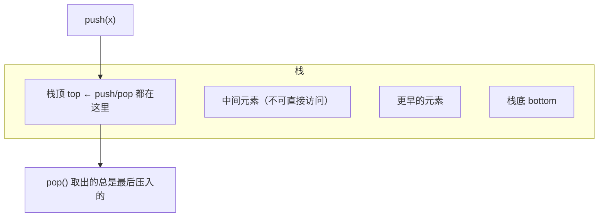

# 第 18 章 · 栈

**简体中文** ｜ [English](./18-stack.en-US.md)

---

> 前两章的数组和列表都很"自由"：任意位置都能读写。这一章的栈恰恰相反——它**只允许在一端进出**。
>
> 听起来是个倒退：功能更少了，为什么还要它？但这正是本章最值得体会的地方：**这个限制不是缺陷，而是它的全部价值**。因为现实世界里有一类问题天生就是"后进先出"的——**凡是嵌套的东西，都需要栈**。函数调用嵌套、括号嵌套、标签嵌套、撤销历史……你写的每一行代码，其实都跑在一个栈上。

## 1. 学习目标

本章结束后，你将能够：

- 说清栈的定义（**LIFO**）与两个核心操作，并解释"限制为什么反而是优点"；
- 识别出"**嵌套结构 ⇒ 用栈**"这条通用模式，并列举至少四个应用；
- 用栈实现**括号匹配**与**后缀表达式求值**，理解栈如何让运算符优先级问题消失；
- 说明**递归与栈的等价关系**，并把递归改写成显式栈的迭代；
- 知道各语言该用哪个栈实现，以及为什么 **Java 的 `Stack` 类不该再用**。

---

## 2. 为什么会出现这个概念

先看一个真实问题：**怎么判断一段代码的括号是否配对？**

```text
(a[b]{c})     ← 合法
(a[b)]        ← 不合法：交叉了
```

你没法只用一个计数器解决——因为要记住"最近一个没闭合的是什么"。而且这个"最近"是关键：**最后打开的，必须最先关闭**。

这就是**后进先出（LIFO, Last In First Out）**。而栈，就是把这条规则固化成数据结构：

| 操作 | 含义 |
|------|------|
| `push(x)` | 压入栈顶 |
| `pop()` | 弹出栈顶 |
| `peek()` / `top()` | 查看栈顶（不弹出） |
| `isEmpty()` | 是否为空 |

**注意它"不能"做什么**：不能访问中间元素、不能按下标读取、不能遍历。**正是这些限制，让栈变得可靠**——你无法误用它，它的行为完全可预测。

> **这是数据结构设计的一个重要思想**：**限制即保证**。一个只暴露必要操作的结构，比一个什么都能做的结构更安全、更容易推理。

---

## 3. 底层原理

### LIFO：一个进出口



**盘子堆的类比**：你只能往最上面放盘子，也只能从最上面取——想拿最下面那个，必须先把上面的全部取走。

### 为什么"嵌套结构"天然需要栈

这是本章的核心洞察。观察这几件事的共同点：

```text
函数调用：  main() → average() → sum()      ← sum 先返回，main 最后返回
括号：      ( [ { } ] )                      ← 最后开的最先闭
HTML 标签： <div><p><b></b></p></div>        ← 最内层最先闭合
撤销操作：  改A → 改B → 改C，撤销时先撤 C   ← 最后做的最先撤销
```

**它们全都是"后开始的先结束"**。而这正是 LIFO 的定义。所以：

> **只要遇到嵌套结构，答案十有八九是栈。**

### 应用一：调用栈（回顾第 12 章）

函数调用为什么用栈？因为调用天然嵌套——`main` 调 `average`，`average` 调 `sum`，那么 `sum` 必须先返回。每次调用压入一个栈帧，返回时弹出：

```text
调用 main()    → 压入 main 的栈帧
  调用 average() → 压入 average 的栈帧
    调用 sum()   → 压入 sum 的栈帧
    sum 返回     → 弹出
  average 返回   → 弹出
main 返回        → 弹出
```

**递归会栈溢出**（第 12 章实测 Python 约 998 层），根源就在这里：每层递归压一个栈帧，栈空间有限。

### 应用二：表达式求值——让优先级问题消失

我们平时写的是**中缀表达式** `3 + 4 * 2`，需要考虑优先级和括号。但如果写成**后缀表达式**（逆波兰式）`3 4 2 * +`，求值就变得极其简单——**只用一个栈，从左到右扫一遍**：

```text
读 3   → 压栈        栈: [3]
读 4   → 压栈        栈: [3, 4]
读 2   → 压栈        栈: [3, 4, 2]
读 *   → 弹出 2 和 4，算 4*2=8，压回   栈: [3, 8]
读 +   → 弹出 8 和 3，算 3+8=11，压回  栈: [11]
结果 = 11
```

**实测验证**：`"3 4 2 * +"` 求值得到 `11.0` ✓（等价于中缀的 `3 + 4 * 2`）

**优先级和括号完全消失了**——因为它们已经被编码进了后缀表达式的顺序里。而"中缀转后缀"同样用栈完成（**调度场算法**，Dijkstra 发明）。

> 这正是第 03 章编译器的工作之一：把你写的中缀表达式转成便于求值的形式。

### 应用三：括号匹配

```text
遇到左括号 → 压栈
遇到右括号 → 弹出栈顶，检查是否配对
结束时栈为空 → 全部匹配
```

**实测**：`(a[b]{c})` → 匹配；`(a[b)]` → 不匹配（交叉）；`(((` → 不匹配（有剩余）。

### 应用四：撤销与深度优先搜索

- **撤销（Undo）**：每次操作压栈，撤销时弹出——这就是编辑器 `Ctrl+Z` 的原理；
- **深度优先搜索（DFS）**：递归版本用调用栈，迭代版本用显式栈——两者完全等价。

### 递归 ⇄ 显式栈：可以互相改写

既然递归靠调用栈，那么**任何递归都可以用显式栈改写成迭代**：

```python
# 递归版
def dfs(node):
    if not node: return
    visit(node); dfs(node.left); dfs(node.right)

# 显式栈版（等价，且不会栈溢出）
def dfs_iter(root):
    stack = [root]
    while stack:
        node = stack.pop()
        if not node: continue
        visit(node)
        stack.append(node.right)   # 注意顺序：后压的先处理
        stack.append(node.left)
```

**这就是第 12 章说"深递归改写成迭代"的具体做法。**

### 两种实现方式

| 实现 | 优点 | 缺点 |
|------|------|------|
| **数组 / 动态数组** | 缓存友好、无指针开销 | 可能需要扩容（摊还 O(1)） |
| **链表** | 每次 push 都是真 O(1)、无需扩容 | 缓存不友好、每个节点多一个指针 |

**实践中几乎都用数组实现**——理由和第 17 章一样：缓存优势压倒理论优势。

---

## 4. JavaScript

**JavaScript 没有内置的 Stack 类**，直接用 `Array` 的 `push` / `pop` 即可（两者都是 O(1)）：

```javascript
const stack = [];
stack.push(1);          // 压栈
stack.push(2);
console.log(stack.pop());              // 2 ← 最后进的先出
console.log(stack[stack.length - 1]);  // 查看栈顶（peek）
console.log(stack.length === 0);       // 是否为空
```

**括号匹配实现**：

```javascript
function isBalanced(s) {
  const pairs = { ")": "(", "]": "[", "}": "{" };
  const stack = [];
  for (const ch of s) {
    if ("([{".includes(ch)) stack.push(ch);
    else if (ch in pairs) {
      if (stack.pop() !== pairs[ch]) return false;
    }
  }
  return stack.length === 0;
}
```

> ⚠️ **注意事项**：**千万不要用 `shift()` 当作 pop**——`pop()` 从末尾取是 O(1)，而 `shift()` 从头部取是 **O(n)**（第 17 章）。栈就该用末尾进出。

---

## 5. Python

**Python 同样没有独立的 Stack 类**，官方文档明确推荐用 `list`：

```python
stack = []
stack.append(1)         # 压栈（就是 append）
stack.append(2)
print(stack.pop())      # 2 ← 弹出栈顶
print(stack[-1])        # 查看栈顶（peek）
print(not stack)        # 是否为空
```

**用栈求值后缀表达式**（实测）：

```python
def eval_rpn(tokens):
    st = []
    for t in tokens:
        if t in "+-*/":
            b, a = st.pop(), st.pop()       # 注意顺序：先弹出的是右操作数
            st.append({"+": a+b, "-": a-b, "*": a*b, "/": a/b}[t])
        else:
            st.append(float(t))
    return st[0]

eval_rpn("3 4 2 * +".split())    # 11.0
```

**`deque` 也可以当栈**，但对栈而言 `list` 已经足够（`deque` 的优势在于两端操作）：

```python
from collections import deque
stack = deque()
stack.append(1); stack.pop()
```

> ⚠️ **注意事项**：**不要用 `list.pop(0)` 当出栈**——那是 O(n) 的头部删除。`pop()`（无参数，从末尾）才是 O(1)。

---

## 6. Java

Java 有两个"栈"，但**只有一个该用**。

**❌ `java.util.Stack`（不推荐）** —— 它是 Java 1.0 的遗留类，有两个硬伤：

```java
Stack<String> bad = new Stack<>();
bad.push("底"); bad.push("中"); bad.push("顶");
System.out.println(bad.get(0));   // "底" ← 竟然能按下标访问！
```

**问题一：设计错误**。`Stack` **继承自 `Vector`**，因此继承了 `get(i)`、`add(i, x)` 等方法——**这直接破坏了"只能在一端进出"的语义**（实测确认可以 `get(0)` 拿到栈底）。

**问题二：性能**。`Vector` 的所有方法都是 `synchronized`，即使单线程也要付出同步开销。实测（各两千万次 push+pop）：

| 实现 | 耗时 |
|------|------|
| `java.util.Stack` | 329 ms |
| `ArrayDeque` | **177 ms** |

**ArrayDeque 快约 1.9 倍。**

**✅ `ArrayDeque`（官方推荐）**：

```java
Deque<Integer> stack = new ArrayDeque<>();
stack.push(1);          // 压栈（等价于 addFirst）
stack.push(2);
stack.pop();            // 2 ← 弹出
stack.peek();           // 查看栈顶
stack.isEmpty();
```

> **Java 官方文档原话**：`ArrayDeque` 作为栈使用时，比 `Stack` 更快。**新代码一律用 `ArrayDeque`。**

---

## 7. C++

**C++ 的 `std::stack` 是一个"容器适配器"**——它不是独立容器，而是**在别的容器之上加了一层限制**：

```cpp
#include <stack>
std::stack<int> s;              // 默认底层用 deque
s.push(1);
s.push(2);
std::cout << s.top();           // 2 ← 查看栈顶（注意叫 top 不叫 peek）
s.pop();                        // 弹出（注意：pop() 不返回值！）
std::cout << s.empty();
```

**可以指定底层容器**：

```cpp
std::stack<int, std::vector<int>> s1;   // 用 vector（更省内存）
std::stack<int, std::list<int>> s2;     // 用链表
```

**这正是"限制即保证"思想的教科书式体现**：`stack` 主动把底层容器的随机访问、遍历等能力全部封死，只留下 LIFO 接口——**你无法误用它**（对比 Java 的 `Stack` 泄漏了 `get(i)`）。

> ⚠️ **两个必须注意的点**：
> ① **`pop()` 不返回值**（与其他语言不同）——要取值必须先 `top()` 再 `pop()`。这是为了异常安全（若返回值时拷贝构造抛异常，元素就丢了）。
> ② **对空栈调用 `top()` / `pop()` 是未定义行为**，务必先判 `empty()`。

---

## 8. C#

**`Stack<T>` 是专门的栈类型**，设计干净（不像 Java 那样继承自列表）：

```csharp
var stack = new Stack<int>();
stack.Push(1);
stack.Push(2);
Console.WriteLine(stack.Pop());     // 2 ← 弹出并返回
Console.WriteLine(stack.Peek());    // 查看栈顶
Console.WriteLine(stack.Count);
```

**C# 的 `Pop()` 会返回值**（比 C++ 方便），也提供安全版本：

```csharp
if (stack.TryPop(out int value))    // 空栈时返回 false，不抛异常
    Console.WriteLine(value);
```

**遍历顺序是从栈顶到栈底**：

```csharp
foreach (var x in stack)            // 先输出最近压入的
    Console.WriteLine(x);
```

> **注意事项**：C# 的 `Stack<T>` 虽然支持 `foreach` 遍历，但**不支持按下标访问**——语义边界比 Java 的 `Stack` 清晰得多。

---

## 9. SQL

SQL 里没有栈这个数据结构，但**栈的语义在数据库中确实存在**，最典型的是**保存点（SAVEPOINT）**。

### ① 保存点：事务中的栈

保存点让你在一个事务内设置多个"回滚锚点"，它们的行为**完全是栈式的**：

```sql
BEGIN;
INSERT INTO student VALUES ('Alice', 92);
SAVEPOINT sp1;                      -- 压入栈
INSERT INTO student VALUES ('Bob', 75);
SAVEPOINT sp2;                      -- 再压入
INSERT INTO student VALUES ('Carol', 50);

ROLLBACK TO sp2;                    -- 回到 sp2：撤销 Carol
ROLLBACK TO sp1;                    -- 再回到 sp1：撤销 Bob（sp2 也随之失效）
COMMIT;                             -- 只有 Alice 被保留
```

**回滚到某个保存点，会把它之后的所有保存点一并作废**——这正是"弹出栈顶及其之上的所有元素"。**嵌套 ⇒ 栈**这条规律在这里再次应验。

### ② 递归查询的求值

第 11 章的递归 CTE，其求值过程本质上也维护着一个待处理集合（工作表），概念上与栈/队列的展开顺序相关——层级数据的遍历天然是栈式或队列式的。

### ③ 嵌套事务的类比

```text
应用层：  BEGIN → SAVEPOINT → SAVEPOINT → ROLLBACK TO → COMMIT
栈操作：  push  →   push    →   push    →    pop(到某层) → 清空
```

> **一个实用提醒**：很多 ORM 框架的"嵌套事务"底层就是用 SAVEPOINT 实现的。理解它的栈语义，能帮你搞清楚"内层事务回滚为什么不影响外层"。

---

## 10. 五语言横向对比

### ① 栈的实现方式

| 语言 | 推荐做法 | 压栈 | 弹栈 | 查看栈顶 |
|------|---------|------|------|---------|
| JavaScript | `Array` | `push` | `pop` | `arr[arr.length-1]` |
| Python | `list` | `append` | `pop` | `lst[-1]` |
| Java | **`ArrayDeque`** | `push` | `pop` | `peek` |
| C++ | `std::stack` | `push` | `pop`（不返回值） | `top` |
| C# | `Stack<T>` | `Push` | `Pop` | `Peek` |

### ② 设计对比：谁封装得最好

| 语言 | 有专门的栈类型 | 能否按下标访问 | 评价 |
|------|:------------:|:------------:|------|
| **C++ `std::stack`** | ✅ 容器适配器 | ❌ **完全封死** | **封装最严格**——限制即保证 |
| **C# `Stack<T>`** | ✅ | ❌ | 干净，可遍历但不可索引 |
| **Java `ArrayDeque`** | 是双端队列 | ❌ | 推荐做法 |
| **Java `Stack`** | ✅（已过时） | ⚠️ **可以！** | **设计失误**：继承 Vector 泄漏了列表接口 |
| JavaScript / Python | ❌ 用列表模拟 | ⚠️ 可以 | 靠约定，语言不强制 |

**这张表体现了一个设计哲学的差异**：C++ 用类型系统**强制**限制，Python/JS 靠**约定**——后者更灵活，但也更容易被误用。

### ③ 共同点与差异根源

**共同点**：所有语言的栈操作都是 O(1)，都基于数组或链表实现，都服务于同一批场景（嵌套、回溯、撤销）。

**差异根源**：
- **是否提供专门类型**反映了语言对"封装"的重视程度。C++/C# 提供，JS/Python 认为"列表已经够用"；
- **Java 的历史包袱**最典型：`Stack` 继承 `Vector` 是 1.0 时代的失误，因兼容性无法修复，只能通过文档推荐 `ArrayDeque` 来绕开。

---

## 11. 底层实现对比

| 语言 · 实现 | 底层结构 | 特点 |
|------------|---------|------|
| **JavaScript · Array** | 动态数组（V8 fast elements） | 末尾操作 O(1)，缓存友好 |
| **Python · list** | 指针数组 | `append`/`pop` 摊还 O(1) |
| **Java · ArrayDeque** | **环形数组** | 无同步开销，两端 O(1) |
| **Java · Stack** | `Vector`（同步数组） | 每次操作都加锁 → 实测慢 1.9 倍 |
| **C++ · std::stack** | 适配器，默认 `deque` | 可换 `vector` 更省内存 |
| **C# · Stack\<T\>** | `T[]` 数组 + 计数 | 容量翻倍增长（第 17 章） |

**一个值得注意的细节**：Java 的 `ArrayDeque` 用**环形数组**（circular buffer）实现，这让它在两端都能 O(1) 操作而不需要搬移元素——第 17 章练习题里的"环形缓冲区"正是这个结构。

---

## 12. 性能分析

| 操作 | 复杂度 | 说明 |
|------|:------:|------|
| `push` | **摊还 O(1)** | 数组实现偶尔要扩容 |
| `pop` | **O(1)** | 只动栈顶 |
| `peek` / `top` | **O(1)** | 只读栈顶 |
| 查找元素 | O(n) | 但栈本就不该用来查找 |
| 空间 | O(n) | 数组实现更紧凑 |

**实测数据**（Java，各两千万次 push+pop，已预热）：

| 实现 | 耗时 |
|------|------|
| `java.util.Stack` | 329 ms |
| `ArrayDeque` | **177 ms** |

**快约 1.9 倍**——差距来自 `Vector` 的同步开销。

> ⚠️ 同前两章：数字依赖环境（JIT、机器、规模），**记住"该用 ArrayDeque"这个结论即可**，倍数请自行实测。

**实践建议**：

```java
Deque<Integer> stack = new ArrayDeque<>(expectedSize);   // 预分配（第 17 章）
```

---

## 13. 工程实践

| 场景 | ✅ 推荐 | ❌ 不推荐 | 原因 |
|------|--------|----------|------|
| Java 用栈 | `ArrayDeque` | `java.util.Stack` | 后者有同步开销且语义泄漏 |
| JavaScript 用栈 | `push` / `pop` | `push` / `shift` | `shift` 是 O(n) |
| Python 用栈 | `append` / `pop()` | `insert(0,x)` / `pop(0)` | 后者是 O(n) |
| C++ 取栈顶值 | 先 `top()` 再 `pop()` | 期待 `pop()` 返回值 | `pop()` 不返回值 |
| 空栈保护 | 先判 `empty()` / 用 `TryPop` | 直接 `pop()` | C++ 是未定义行为 |
| 深递归 | 改写成显式栈迭代 | 依赖递归 | 避免栈溢出（第 12 章） |
| 处理嵌套结构 | **用栈** | 手写复杂状态机 | 嵌套天然匹配 LIFO |

**"嵌套 ⇒ 栈"的实战清单**：

| 问题 | 用栈怎么解 |
|------|-----------|
| 括号 / 标签匹配 | 左压右弹，结束时栈应为空 |
| 表达式求值 | 转后缀 + 单栈扫描 |
| 撤销 / 重做 | 两个栈（撤销栈 + 重做栈） |
| 浏览器前进后退 | 同上 |
| DFS / 回溯 | 显式栈代替递归 |
| 函数调用 | 语言运行时替你维护 |

---

## 14. 最佳实践

- **需要栈语义时就用栈类型**，不要用列表"顺手"模拟——类型本身就是文档。
- **Java 新代码永远用 `ArrayDeque`**，把 `java.util.Stack` 当作历史遗留。
- **操作前检查空栈**：`pop` 空栈在不同语言表现不同（抛异常 / 返回 undefined / 未定义行为）。
- **能预估深度就预分配容量**，减少扩容。
- **深递归改用显式栈**：既避免栈溢出，也便于中途保存状态。
- **撤销功能用两个栈**：一个存已做操作，一个存已撤销操作。

---

## 15. 常见坑

**坑 1 · Java 误用 `java.util.Stack`**

```java
Stack<String> s = new Stack<>();
s.push("底"); s.push("顶");
s.get(0);              // ✗ 竟然合法！返回栈底，破坏了 LIFO 语义
```
**为什么错**：它继承自 `Vector`，泄漏了列表接口。
**如何避免**：用 `ArrayDeque`。

**坑 2 · C++ 以为 `pop()` 返回值**

```cpp
std::stack<int> s; s.push(1);
int x = s.pop();       // ✗ 编译错误：pop() 返回 void
int y = s.top(); s.pop();   // ✓ 正确用法
```

**坑 3 · 对空栈操作**

```cpp
std::stack<int> s;
s.top();               // ✗ 未定义行为（不是抛异常！）
if (!s.empty()) s.top();    // ✓
```
```python
stack = []
stack.pop()            # ✗ IndexError
if stack: stack.pop()  # ✓
```

**坑 4 · JavaScript 用 `shift()` 当出栈**

```javascript
stack.push(1);
stack.shift();         // ✗ 这是 O(n)，而且取的是最先进的（那是队列语义）
stack.pop();           // ✓ O(1)，LIFO
```

**坑 5 · Python 用 `pop(0)` 当出栈**

```python
stack.pop(0)           # ✗ O(n)，且语义是队列
stack.pop()            # ✓ O(1)
```

**坑 6 · 后缀表达式求值时操作数顺序弄反**

```python
b, a = st.pop(), st.pop()      # ✓ 先弹出的是「右」操作数
result = a - b                  # 顺序反了会让减法、除法算错
```

**坑 7 · 用递归处理深层嵌套导致栈溢出**

```python
def parse(node):  return parse(node.child)     # 嵌套上万层 → RecursionError
```
**如何避免**：改用显式栈的迭代版本。

---

## 16. 面试题

**基础**

1. 栈的特点是什么？列举三个实际应用。
2. 栈和队列有什么区别？
3. 为什么函数调用要用栈来管理？

**中级**

4. 如何用栈判断括号是否匹配？如果有多种括号呢？
5. 什么是后缀表达式？为什么用栈求值它特别简单？
6. 为什么 Java 官方推荐用 `ArrayDeque` 而不是 `Stack`？（提示：设计与性能两方面。）

**高级**

7. 如何把一个递归函数改写成用显式栈的迭代版本？改写后还会栈溢出吗？
8. 为什么 C++ 的 `std::stack::pop()` 不返回值？（提示：异常安全。）
9. 用两个栈实现一个队列，各操作的复杂度是多少？（提示：摊还分析。）

---

## 17. 练习

**基础**

1. 在六门语言中各实现一个栈的基本操作（push / pop / peek / isEmpty）。
2. 实现括号匹配函数，支持 `()`、`[]`、`{}` 三种括号。
3. 实现"逆序打印字符串"——用栈完成。

**提高**

4. 实现后缀表达式求值器，支持四则运算。
5. 实现"中缀转后缀"（调度场算法），并与上一题串联成一个完整的计算器。
6. 用两个栈实现撤销 / 重做功能。

**挑战**

7. 用两个栈实现一个队列，并分析其摊还复杂度。
8. 实现一个 `MinStack`：在 O(1) 时间内返回栈中最小值（提示：辅助栈）。
9. 把二叉树的递归遍历改写成显式栈的迭代版本，验证结果一致。

---

## 18. 本章总结

**一句话总结**：栈是**只允许一端进出的 LIFO 结构**——它的价值恰恰来自这个限制；而现实中凡是**嵌套**的问题（函数调用、括号、标签、撤销、DFS），栈都是天然的答案。

**核心知识点**

- **限制即保证**：栈不暴露中间元素，因此不会被误用——C++ 的 `std::stack` 是这一思想的典范。
- **嵌套 ⇒ 栈**：这是本章最实用的模式识别。
- **后缀表达式 + 一个栈**，就能消灭运算符优先级问题。
- **递归 ⇄ 显式栈可以互相改写**——这是治理栈溢出的标准手段。
- **Java 的 `Stack` 是设计失误**（继承 `Vector`，泄漏 `get(i)`，且带同步开销），实测比 `ArrayDeque` 慢约 1.9 倍。

**检查清单**

- [ ] 我能说清栈的四个基本操作，以及"限制为什么是优点"。
- [ ] 我能识别"嵌套结构"并立刻想到用栈。
- [ ] 我能用栈实现括号匹配和后缀表达式求值。
- [ ] 我能把递归改写成显式栈的迭代。
- [ ] 我知道各语言该用哪个栈实现，尤其是 Java 的坑。

**下一章预告**：栈是"后进先出"，那有没有"先进先出"的结构？排队买票、打印任务、消息队列、广度优先搜索——这些场景需要的正是它。而且它的实现比栈更微妙（为什么用环形数组？）。这就是第 19 章「队列」。

---

## 19. 延伸阅读

- <a href="https://en.wikipedia.org/wiki/Stack_(abstract_data_type)" target="_blank" rel="noopener">Wikipedia：栈（抽象数据类型）</a> — 定义、实现与应用全览。
- <a href="https://en.wikipedia.org/wiki/Reverse_Polish_notation" target="_blank" rel="noopener">Wikipedia：逆波兰表示法</a> — 后缀表达式的由来与求值方法。
- <a href="https://en.wikipedia.org/wiki/Shunting_yard_algorithm" target="_blank" rel="noopener">Wikipedia：调度场算法</a> — Dijkstra 提出的中缀转后缀算法。
- <a href="https://docs.oracle.com/en/java/javase/21/docs/api/java.base/java/util/ArrayDeque.html" target="_blank" rel="noopener">Java 文档 · ArrayDeque</a> — 官方明确推荐它替代 `Stack`。
- <a href="https://en.cppreference.com/w/cpp/container/stack" target="_blank" rel="noopener">cppreference · std::stack</a> — 容器适配器的设计与接口。
- <a href="https://docs.python.org/3/tutorial/datastructures.html#using-lists-as-stacks" target="_blank" rel="noopener">Python 官方教程 · 用列表作栈</a> — 官方推荐的栈用法。
- <a href="https://learn.microsoft.com/en-us/dotnet/api/system.collections.generic.stack-1" target="_blank" rel="noopener">Microsoft Learn · Stack\<T\></a> — C# 栈类型的完整 API。
