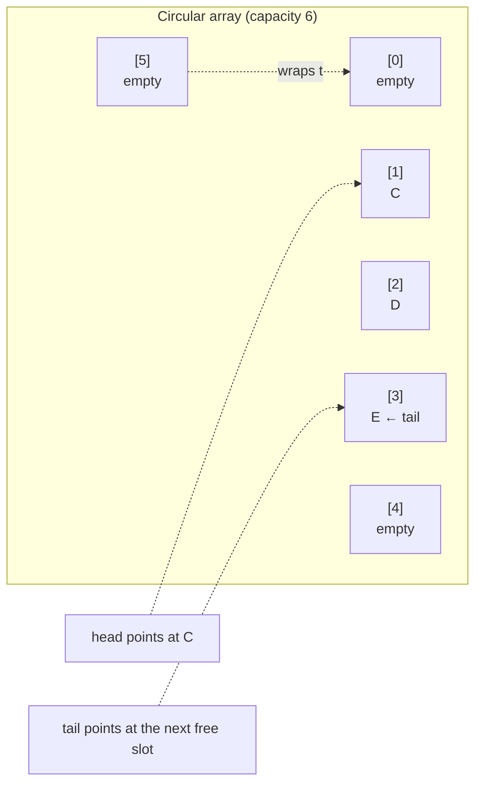
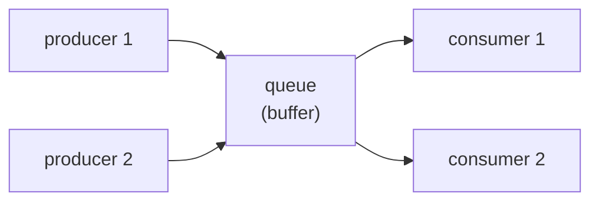

# Chapter 19 · Queue

[简体中文](./19-queue.md) ｜ **English**

---

> The previous chapter's stack was **last-in-first-out** — the newest leaves first. The queue is the opposite: **first-in-first-out**, first come first served. Like queuing for tickets.
>
> That sounds like a mere reversal, but the implementations differ enormously. A stack only touches one end of an array; a queue touches **both** — and the naive approach makes dequeuing O(n), measured at over **500× slower**. The fix is an elegant trick: **join the array's ends into a ring**.
>
> Better still: swap the stack in last chapter's DFS for a queue and **the same code becomes BFS** — a one-line change.

## 1. Learning Objectives

By the end of this chapter, you will be able to:

- Define a queue (**FIFO**) and its core operations, and see why it represents "fairness";
- Explain the problem with **naive array-backed queues** and how a **circular array** brings dequeuing down to O(1);
- Demonstrate with a one-line difference that **stack ⇒ DFS, queue ⇒ BFS**;
- Distinguish three important variants: **deque, priority queue, blocking queue**;
- Explain the queue's central role in **asynchronous systems** (producer-consumer, message queues).

---

## 2. Why This Concept Exists

Stacks solve nesting; queues solve a different problem: **order and fairness**.

```text
Ticket lines   ← first to arrive buys first; cutting in is unfair
Print jobs     ← submitted first, printed first
Message handling ← received first, processed first
```

What they share is the requirement: **first come, first served (FIFO)**.

A queue has just two core operations (plus two queries):

| Operation | Meaning |
|-----------|---------|
| `enqueue(x)` / `push` / `offer` | add at the **tail** |
| `dequeue()` / `pop` / `poll` | remove from the **head** |
| `front()` / `peek` | look at the head without removing |
| `isEmpty()` | is it empty |

**Note the key difference from a stack**: a stack works at **one** end, a queue at **both** — **which is exactly why it is trickier to implement.**

---

## 3. How It Works

### The problem with the naive implementation

The obvious array-backed approach is: enqueue with `push_back`, dequeue by removing from the front. But **removing from the front is O(n)** (Chapter 17) — everything after must shift one slot left:

```text
before: [A][B][C][D]
dequeue A: [B][C][D]      ← B, C, D all shift left
```

**Measured cost** (C++ `-O2`, 100,000 elements enqueued and dequeued):

| Implementation | Time |
|----------------|------|
| Naive array (O(n) dequeue) | **273.92 ms** |
| Circular array (O(1) dequeue) | **0.52 ms** |

**About 522× slower.** So queues need a different implementation.

### The circular array: joining the ends

The key insight: **why can't the slots freed at the front be reused?**

Hence the **circular buffer** — two indices, `head` and `tail`, that **wrap around** the array, returning to the start when they reach the end:



It comes down to the modulo operator:

```text
enqueue: buf[tail] = x;  tail = (tail + 1) % capacity
dequeue: x = buf[head];  head = (head + 1) % capacity
empty:   head == tail
```

**Both indices only advance; no element is ever shifted**, so enqueue and dequeue are **both O(1)**. This is the structure behind Java's `ArrayDeque` from the last chapter.

> 💡 **An implementation detail**: how do you tell "empty" from "full"? Both look like `head == tail`. The usual fixes are to **sacrifice one slot** (a capacity-n array holds n-1) or to track a separate `size`.

### Stack vs. queue = DFS vs. BFS

This is the chapter's most elegant contrast. The traversal below is **both DFS and BFS — differing by one line**:

```python
def traverse(root, use_stack):
    box = [root]                                        # serves as stack or queue
    order = []
    while box:
        node = box.pop() if use_stack else box.pop(0)   # ← the only difference
        order.append(node)
        box.extend(children[node])
    return order
```

**Measured** (on the same tree):

```text
        1
       / \
      2   3
     /|   |\
    4 5   6 7

with a stack (LIFO) → DFS: [1, 3, 7, 6, 2, 5, 4]   ← dives down one path
with a queue (FIFO) → BFS: [1, 2, 3, 4, 5, 6, 7]   ← sweeps level by level
```

> **Worth remembering**: **choosing a stack or a queue decides "go deep first" versus "spread out first."** Shortest paths need BFS (a queue); exhaustive exploration suits DFS (a stack).

### Three important variants

**① Deque (double-ended queue)** — both ends open, a superset of queue and stack:

```text
        ← addFirst        addLast →
        → removeFirst   removeLast ←
```

It serves as a stack (one end) or a queue (in one end, out the other). Java's `ArrayDeque` and Python's `collections.deque` are these.

**② Priority queue** — **breaks FIFO**: dequeue order is set by **priority**, not arrival. Measured:

```text
enqueued:        low-priority → urgent → normal
plain queue:     low-priority → urgent → normal    (arrival order)
priority queue:  urgent → normal → low-priority    (priority order)
```

It is usually backed by a **heap** — a special tree (Chapter 21). Enqueue and dequeue are **O(log n)**; peeking at the top is O(1).

**③ Blocking queue** — taking from an empty queue **waits**, and adding to a full one waits too. This is the foundation of the **producer-consumer pattern** and a core tool of multithreading (detailed in Part 6).

### Queues are the backbone of asynchronous systems



The queue plays three roles here:

- **Decoupling**: producers needn't know who consumes, and vice versa;
- **Smoothing**: bursts queue up while consumers work at their own pace;
- **Asynchrony**: the producer returns after handing off, without waiting for processing.

This is exactly what message brokers like RabbitMQ and Kafka are — one data structure scaled up into the skeleton of a distributed system.

---

## 4. JavaScript

**JavaScript has no built-in queue**, and simulating one with `Array` requires care:

```javascript
const queue = [];
queue.push(1);            // enqueue: O(1)
queue.push(2);
console.log(queue.shift());   // dequeue: ⚠️ O(n)! shifts everything
```

> ⚠️ **`shift()` is O(n)**. Fine at small scale, but **at volume you must change implementation.**

**Use two pointers to avoid shifting** (a simple circular idea):

```javascript
class Queue {
  constructor() { this.items = {}; this.head = 0; this.tail = 0; }
  enqueue(x) { this.items[this.tail++] = x; }
  dequeue() {
    if (this.head === this.tail) return undefined;
    const x = this.items[this.head];
    delete this.items[this.head++];
    return x;
  }
  get size() { return this.tail - this.head; }
}
```

**BFS** (the queue's classic application):

```javascript
function bfs(root, childrenOf) {
  const queue = [root], order = [];
  let head = 0;                       // an index instead of shift(), avoiding O(n)
  while (head < queue.length) {
    const node = queue[head++];
    order.push(node);
    queue.push(...childrenOf(node));
  }
  return order;
}
```

> **Note**: in the JavaScript ecosystem, high-performance queues are usually hand-rolled circular buffers or third-party libraries (such as `denque`).

---

## 5. Python

**The right answer in Python is `collections.deque`** — a true double-ended queue with O(1) at both ends:

```python
from collections import deque

q = deque()
q.append(1)          # enqueue (right): O(1)
q.append(2)
print(q.popleft())   # dequeue (left): O(1) ✓
```

**❌ Don't use `list` as a queue**:

```python
q = []
q.append(1)
q.pop(0)             # ✗ O(n) — Chapter 17 measured it ~800× slower than deque
```

**`deque` also supports a max length** (auto-dropping the oldest), perfect for "the last N records":

```python
recent = deque(maxlen=3)
for x in [1, 2, 3, 4, 5]:
    recent.append(x)
print(recent)        # deque([3, 4, 5]) ← the oldest are dropped automatically
```

**Priority queues use `heapq`**:

```python
import heapq
pq = []
heapq.heappush(pq, (3, "low"))
heapq.heappush(pq, (1, "urgent"))
heapq.heappop(pq)    # (1, 'urgent') ← smallest first (min-heap)
```

**Thread-safe queues use `queue.Queue`** (detailed in Part 6):

```python
from queue import Queue
q = Queue()          # built-in locking, for multithreaded producer-consumer
```

> **Note**: three different "queues," three purposes — `deque` for single-threaded speed, `queue.Queue` for threads, `heapq` for priority.

---

## 6. Java

**Java has the most complete queue family**, and the easiest one to pick wrong. The core interfaces are `Queue` and `Deque`:

```java
Queue<Integer> q = new ArrayDeque<>();   // ✅ the recommended implementation
q.offer(1);              // enqueue (returns false when full, no exception)
q.poll();                // dequeue (returns null when empty, no exception)
q.peek();                // look at the head
```

**Two API families with different behavior** — the thing to watch most in Java queues:

| Operation | Throwing version | Special-value version |
|-----------|-----------------|----------------------|
| Enqueue | `add(x)` | `offer(x)` → false |
| Dequeue | `remove()` | `poll()` → null |
| Peek | `element()` | `peek()` → null |

> **Advice**: use `offer` / `poll` / `peek` normally — no exceptions, cleaner code.

**Choosing an implementation**:

| Implementation | Use |
|----------------|-----|
| **`ArrayDeque`** | ✅ the single-threaded default (circular array, no synchronization) |
| `LinkedList` | also a Deque, but cache-unfriendly; not recommended |
| `PriorityQueue` | priority queue (heap-backed) |
| `ArrayBlockingQueue` / `LinkedBlockingQueue` | blocking queues for threads |
| `ConcurrentLinkedQueue` | lock-free concurrent queue |

**Priority queue**:

```java
PriorityQueue<Integer> pq = new PriorityQueue<>();
pq.offer(3); pq.offer(1); pq.offer(2);
pq.poll();    // 1 ← min-heap by default
PriorityQueue<Integer> maxHeap = new PriorityQueue<>(Comparator.reverseOrder());
```

> ⚠️ **Note**: a `PriorityQueue`'s **iteration order is not sorted** — only `poll()` guarantees priority order. Printing it with `toString()` shows the heap's internal array layout.

---

## 7. C++

**`std::queue`, like `std::stack`, is a container adapter** — the same "restriction is guarantee" idea:

```cpp
#include <queue>
std::queue<int> q;
q.push(1);              // enqueue
q.push(2);
std::cout << q.front(); // 1 ← the head
std::cout << q.back();  // 2 ← the tail
q.pop();                // dequeue (⚠️ again, returns nothing)
```

**It is backed by `std::deque` by default** (segmented arrays), guaranteeing O(1) at both ends.

**`std::deque` is usable directly too** — it adds efficient front operations over `vector`:

```cpp
#include <deque>
std::deque<int> d;
d.push_back(1);         // back: O(1)
d.push_front(0);        // front: O(1) ← vector can't do this
d[0];                   // still O(1) random access
```

**Priority queue**:

```cpp
#include <queue>
std::priority_queue<int> pq;              // a MAX-heap by default
pq.push(3); pq.push(1); pq.push(2);
pq.top();                                  // 3 ← note: max-heap!
std::priority_queue<int, std::vector<int>, std::greater<int>> minHeap;   // min-heap
```

> ⚠️ **Two traps**: ① `std::priority_queue` **defaults to a max-heap** (Java/Python default to min-heaps), which is very easy to get wrong across languages; ② like `stack`, `pop()` returns nothing, and calling `front()`/`pop()` on an empty queue is undefined behavior.

---

## 8. C#

**`Queue<T>` is a dedicated queue type**, backed by a circular array:

```csharp
var queue = new Queue<int>();
queue.Enqueue(1);        // enqueue
queue.Enqueue(2);
Console.WriteLine(queue.Dequeue());   // 1 ← dequeues and returns
Console.WriteLine(queue.Peek());      // look at the head
Console.WriteLine(queue.Count);
```

**The method names are the clearest of the bunch** (`Enqueue` / `Dequeue`), with safe variants available:

```csharp
if (queue.TryDequeue(out int value))  // false when empty, no exception
    Console.WriteLine(value);
```

**Priority queue** (built in only since .NET 6):

```csharp
var pq = new PriorityQueue<string, int>();   // element and priority are separate
pq.Enqueue("low", 3);
pq.Enqueue("urgent", 1);
pq.Dequeue();            // "urgent" ← min-heap by default
```

**Concurrent queues** (Part 6):

```csharp
var cq = new ConcurrentQueue<int>();          // thread-safe, lock-free
var bc = new BlockingCollection<int>();       // blocking queue
```

> **Note**: C#'s `PriorityQueue<TElement, TPriority>` splits **element and priority into two type parameters**, clearer than Java's need for tuples or a custom `Comparator`.

---

## 9. SQL

A database is not a queue, but **implementing a task queue as a database table is extremely common in practice** — especially in small and mid-sized systems that would rather not add Kafka or RabbitMQ.

### ① A table as a task queue

```sql
CREATE TABLE task_queue (
    id       INTEGER PRIMARY KEY AUTOINCREMENT,   -- autoincrement preserves FIFO order
    payload  TEXT,
    status   TEXT DEFAULT 'pending',              -- pending / processing / done
    created  TEXT DEFAULT CURRENT_TIMESTAMP
);

-- enqueue: insert a row
INSERT INTO task_queue (payload) VALUES ('send email'), ('build report');

-- dequeue: take the earliest pending task (ORDER BY is mandatory — Chapter 16: tables are unordered)
SELECT * FROM task_queue WHERE status = 'pending' ORDER BY id LIMIT 1;
```

> ⚠️ **The key point**: a table is an **unordered set**, so "first in, first out" must be expressed explicitly with `ORDER BY id` — quite unlike an array, where the index *is* the order.

### ② The classic concurrency problem

Multiple consumers polling at once will grab **the same** row. The standard fix is `SKIP LOCKED`:

```sql
-- PostgreSQL / MySQL 8+: skip rows already locked by others
SELECT * FROM task_queue
WHERE status = 'pending'
ORDER BY id
LIMIT 1
FOR UPDATE SKIP LOCKED;      -- ← the key: concurrent consumers each get their own
```

> ⚠️ **SQLite does not support `FOR UPDATE SKIP LOCKED`** (it locks the whole database), so this chapter's example demonstrates an atomic `UPDATE` claim instead.

### ③ Atomic claiming: the portable approach

```sql
-- claim a task atomically with one UPDATE, avoiding races
UPDATE task_queue
SET status = 'processing'
WHERE id = (SELECT id FROM task_queue WHERE status = 'pending' ORDER BY id LIMIT 1);
```

**This is the same idea as enqueue/dequeue**, only with the queue's state persisted to disk — which buys **durability** (tasks survive a crash).

> **Engineering note**: database queues suit **low-to-moderate throughput** (hundreds to thousands per second). True high throughput (tens of thousands) calls for a dedicated message broker — whose core is still the data structure in this chapter.

---

## 10. Cross-Language Comparison

### ① Queue implementations

| Language | Recommended | Enqueue | Dequeue | Backing structure |
|----------|-------------|---------|---------|-------------------|
| JavaScript | roll your own (two indices) | `push` | ⚠️ avoid `shift()` | none built in |
| Python | **`collections.deque`** | `append` | `popleft` | segmented doubly linked list |
| Java | **`ArrayDeque`** | `offer` | `poll` | **circular array** |
| C++ | `std::queue` | `push` | `pop` (returns nothing) | `deque` by default |
| C# | `Queue<T>` | `Enqueue` | `Dequeue` | **circular array** |

### ② Priority queues (a minefield of gotchas)

| Language | Type | **Default heap order** | Notes |
|----------|------|:---------------------:|-------|
| Python | `heapq` (module over a list) | **min-heap** | functions, not a class |
| Java | `PriorityQueue` | **min-heap** | iteration order is unsorted |
| C++ | `std::priority_queue` | ⚠️ **max-heap** | **opposite of the others!** |
| C# | `PriorityQueue<T,P>` | **min-heap** | .NET 6+, element and priority separate |
| JavaScript | none built in | — | roll your own or use a library |

> ⚠️ **The biggest cross-language trap**: **C++'s priority queue defaults to a max-heap while everyone else defaults to a min-heap.** Coming from Python or Java, you will almost certainly trip over it.

### ③ Commonalities and the root of differences

**In common**: every language offers FIFO semantics with O(1) enqueue and dequeue (in a correct implementation), plus priority and concurrent variants.

**The differences**:
- **Whether a queue type is built in**: C#/Java/C++ have one, Python's `deque` doubles as one, and **JavaScript has none** — another instance of its thin standard library;
- **Backing structure**: Java/C# use circular arrays, while Python's `deque` uses a segmented doubly linked list (hence unbounded length with fast ends);
- **Priority-queue default direction**: C++ stands alone, a historical inconsistency.

---

## 11. Underlying Implementation Comparison

| Language · Implementation | Internal structure | Traits |
|---------------------------|-------------------|--------|
| **Python · deque** | **segmented doubly linked list** (each block a fixed-size array) | O(1) at both ends, no global growth, but O(n) random access |
| **Java · ArrayDeque** | **circular array** | O(1) at both ends, cache-friendly; doubles when full |
| **C++ · std::deque** | **segmented arrays + an index map** | O(1) at both ends, **and keeps O(1) random access** |
| **C# · Queue\<T\>** | **circular array** with head/tail | similar to Java |
| **JavaScript · Array** | dynamic array | `shift()` is O(n); unsuitable as a queue |

**The trade-off between two typical designs**:

| Design | Pros | Cons |
|--------|------|------|
| **Circular array** | cache-friendly, compact | needs growth; capacity bookkeeping |
| **Segmented / linked** | no global shifting, grows naturally | somewhat worse locality |

**Python's `deque` deserves a note**: it is not a pure linked list but **fixed-size array blocks strung on a doubly linked list** — balancing O(1) ends with some cache friendliness. The price is **O(n) random access** (so `deque[5000]` is slow).

---

## 12. Performance Analysis

### Complexity comparison

| Operation | Queue (correct) | Stack | Priority queue |
|-----------|:---------------:|:-----:|:--------------:|
| Enqueue / push | **O(1)** | O(1) | **O(log n)** |
| Dequeue / pop | **O(1)** | O(1) | **O(log n)** |
| Peek | O(1) | O(1) | **O(1)** |
| Random access | unsupported (except deque) | unsupported | unsupported |

### Measured data (conditions noted)

**① Why a circular array is necessary** (C++ `-O2`, 100,000 elements in and out):

| Implementation | Time |
|----------------|------|
| Naive array (O(n) dequeue) | 273.92 ms |
| Circular array (O(1) dequeue) | **0.52 ms** |

**About 522× slower** — which is why no language implements queues with a naive array.

**② Python's choice matters** (measured in Chapter 17): `list.pop(0)` is about **800×** slower than `deque.popleft()`.

> ⚠️ Numbers depend on the environment (optimization, machine, size). **Remember the conclusion ("use a circular/deque structure")** and measure ratios yourself.

**Practical advice**:

```python
from collections import deque      # ✓ the only right answer for queues in Python
```
```java
Queue<Integer> q = new ArrayDeque<>(expectedSize);   // ✓ preallocate (Chapter 17)
```

---

## 13. Engineering Practice

| Scenario | ✅ Recommended | ❌ Discouraged | Why |
|----------|---------------|---------------|-----|
| Queues in Python | `collections.deque` | `list` + `pop(0)` | the latter is O(n), ~800× slower |
| Queues in JavaScript | two indices / circular | `Array.shift()` | `shift()` is O(n) |
| Queues in Java | `ArrayDeque` | `LinkedList` | cache-friendly, no node overhead |
| Java API choice | `offer` / `poll` / `peek` | `add` / `remove` / `element` | non-throwing, cleaner code |
| Multithreaded queues | `BlockingQueue` (Java) / `queue.Queue` (Python) | locking a plain queue yourself | proven implementations |
| Needing priority | a priority queue (heap) | re-sorting the whole list | O(log n) vs O(n log n) |
| Last N records | `deque(maxlen=N)` | trimming a list manually | drops the oldest automatically |
| Database task queues | `ORDER BY id` + atomic claim / `SKIP LOCKED` | plain SELECT then UPDATE | prevents concurrent consumers grabbing the same row |

**The canonical BFS** (the queue's most classic use):

```python
from collections import deque

def bfs(start, neighbors):
    visited = {start}
    queue = deque([start])
    while queue:
        node = queue.popleft()          # FIFO → expands level by level
        for nxt in neighbors(node):
            if nxt not in visited:
                visited.add(nxt)
                queue.append(nxt)
    return visited
```

> **Remember**: **shortest paths require BFS** (a queue), because it guarantees that whatever is reached first is at the fewest levels. A DFS path is not guaranteed shortest.

---

## 14. Best Practices

- **Use a queue type when you need FIFO** — never make do with `shift()` / `pop(0)`.
- **Preallocate when the size is predictable** (Chapter 17).
- **Use concurrent/blocking queues for threads** rather than locking a plain one yourself.
- **Mind the default heap order**: C++ is a max-heap, everyone else a min-heap.
- **Never iterate a priority queue**: iteration order isn't priority order; only dequeuing is.
- **Mark visited nodes in BFS**, or a cyclic graph loops forever.
- **Database queues need concurrency and retry handling**, not just the happy path.

---

## 15. Common Pitfalls

**Pitfall 1 · Using `list.pop(0)` / `Array.shift()` to dequeue**

```python
q = []; q.append(1); q.pop(0)     # ✗ O(n)
from collections import deque
q = deque(); q.append(1); q.popleft()   # ✓ O(1)
```

**Pitfall 2 · C++'s priority queue defaults to a max-heap**

```cpp
std::priority_queue<int> pq;      // ⚠️ max-heap! opposite of Java/Python
pq.push(3); pq.push(1);
pq.top();                          // 3 (not 1)
// for a min-heap:
std::priority_queue<int, std::vector<int>, std::greater<int>> minHeap;
```

**Pitfall 3 · Assuming a priority queue iterates in order**

```java
PriorityQueue<Integer> pq = new PriorityQueue<>(List.of(3,1,2));
System.out.println(pq);           // ✗ prints the heap's internal layout, not sorted order
while (!pq.isEmpty()) pq.poll();  // ✓ only dequeuing guarantees order
```

**Pitfall 4 · Mixing Java's two queue APIs**

```java
queue.remove();     // throws NoSuchElementException when empty
queue.poll();       // returns null when empty ✓ usually what you want
```

**Pitfall 5 · Forgetting to mark visited in BFS**

```python
queue = deque([start])
while queue:
    node = queue.popleft()
    for nxt in neighbors(node):
        queue.append(nxt)        # ✗ loops forever on a cyclic graph
```
**How to avoid**: check and record in a `visited` set before enqueuing.

**Pitfall 6 · Confusing "empty" and "full" in a circular array**

```text
head == tail — is the queue empty or full?
```
**How to avoid**: sacrifice one slot (capacity n holds n-1), or track `size` separately.

**Pitfall 7 · Concurrent consumption from a database queue**

```sql
-- ✗ several consumers grab the same row
SELECT * FROM task_queue WHERE status='pending' LIMIT 1;
-- ✓ use SKIP LOCKED or an atomic UPDATE claim
```

---

## 16. Interview Questions

**Basic**

1. What is the difference between a queue and a stack? Give two applications of each.
2. Why is dequeuing O(n) in a naive array-backed queue? How do you fix it?
3. What is a deque? How does it relate to queues and stacks?

**Intermediate**

4. How does a circular array achieve O(1) enqueue and dequeue? How do you distinguish empty from full?
5. What is the difference between BFS and DFS? Why must shortest paths use BFS?
6. What structure backs a priority queue, and what are the operation complexities?

**Advanced**

7. What is Python's `deque` internally? Why is it O(1) at both ends but O(n) for random access?
8. How is a blocking queue implemented? What problem does it solve in producer-consumer?
9. How would you build a reliable task queue on a database table? How do you handle concurrent consumers?

---

## 17. Exercises

**Basic**

1. Implement the basic queue operations in each of the six languages.
2. Traverse a tree with BFS using a queue and compare the output with stack-based DFS.
3. Use `deque(maxlen=N)` to keep "the last N log lines."

**Intermediate**

4. Implement a circular-array queue (with growth) and benchmark it against the standard library.
5. Implement a queue with two stacks (echoing Chapter 18's challenge) and analyze the amortized complexity.
6. Build a simple task scheduler using a priority queue.

**Challenge**

7. Implement a thread-safe blocking queue (producer-consumer) and verify correctness under threads.
8. Solve a maze's shortest path with BFS and explain why DFS cannot guarantee the shortest.
9. Implement a database-backed task queue supporting concurrent consumption, retries, and timeout recovery.

---

## 18. Summary

**In one sentence**: a queue is a **first-in-first-out** structure representing fairness; the key to implementing it is the **circular array** — joining the ends and letting head/tail wrap around brings dequeuing from O(n) down to O(1) (measured ~522× difference).

**Core takeaways**

- **A queue works at both ends**, making it harder to implement than a stack — the naive array dequeue is O(n).
- **The circular array** uses modulo to wrap two indices, giving O(1) at both ends; it backs `ArrayDeque` and `Queue<T>`.
- **Stack ⇒ DFS, queue ⇒ BFS**: one line apart, entirely different orders; **shortest paths require BFS**.
- **Three variants**: deque (both ends), priority queue (by priority, heap-backed, O(log n)), blocking queue (the multithreading foundation).
- **⚠️ C++'s priority queue defaults to a max-heap**, unlike Java/Python/C#.
- **Queues are the skeleton of asynchronous systems**: decoupling, smoothing, asynchrony — exactly what message brokers are.

**Checklist**

- [ ] I can explain the naive queue's problem and how a circular array fixes it.
- [ ] I can demonstrate DFS versus BFS with a one-line difference.
- [ ] I know which queue implementation to use per language, especially the Python and JavaScript traps.
- [ ] I remember that C++'s priority queue defaults to a max-heap.
- [ ] I know how to build a database-backed task queue and handle concurrent consumers.

**Next chapter**: arrays locate elements in O(1) by index — but what if I want to look up by an **arbitrary key** (a student's name, say)? Comparing one by one is O(n), far too slow. Can "look up a score by name" also be O(1)? The answer is to **turn the key into an index** — that is Chapter 20, "Hash."

---

## 19. Further Reading

- <a href="https://en.wikipedia.org/wiki/Queue_(abstract_data_type)" target="_blank" rel="noopener">Wikipedia: Queue (abstract data type)</a> — definitions, implementations, and variants.
- <a href="https://en.wikipedia.org/wiki/Circular_buffer" target="_blank" rel="noopener">Wikipedia: Circular buffer</a> — the full account of this chapter's core technique.
- <a href="https://en.wikipedia.org/wiki/Breadth-first_search" target="_blank" rel="noopener">Wikipedia: Breadth-first search</a> — the queue's most classic algorithmic application.
- <a href="https://en.wikipedia.org/wiki/Priority_queue" target="_blank" rel="noopener">Wikipedia: Priority queue</a> — heap implementations and complexity.
- <a href="https://docs.python.org/3/library/heapq.html" target="_blank" rel="noopener">Python docs · heapq</a> — Python's heap queue algorithm.
- <a href="https://docs.oracle.com/en/java/javase/21/docs/api/java.base/java/util/concurrent/BlockingQueue.html" target="_blank" rel="noopener">Java docs · BlockingQueue</a> — the standard producer-consumer tool.
- <a href="https://en.cppreference.com/w/cpp/container/priority_queue" target="_blank" rel="noopener">cppreference · std::priority_queue</a> — note that it defaults to a max-heap.
