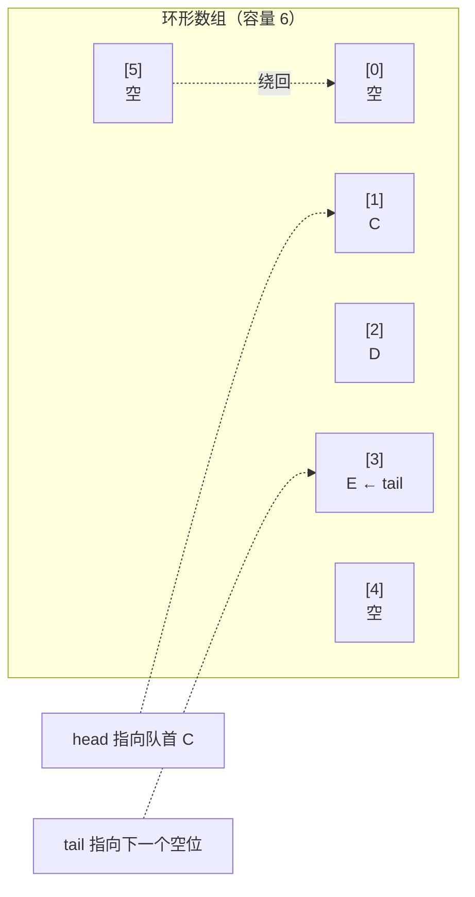
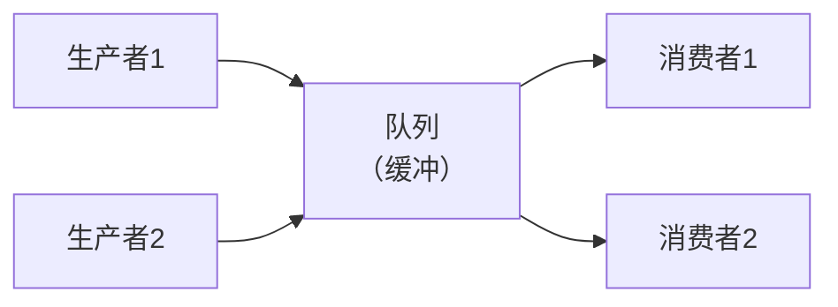

# 第 19 章 · 队列

**简体中文** ｜ [English](./19-queue.en-US.md)

---

> 上一章的栈是**后进先出**——最后来的最先走。这一章的队列恰好相反：**先进先出**，先来的先服务。就像排队买票。
>
> 听起来只是"反过来"，但实现难度天差地别。栈用数组一头进出就完事了，而队列要在**两头**操作——朴素做法会让出队变成 O(n)，实测慢了 **500 多倍**。解决办法是一个优雅的技巧：**让数组首尾相接，绕成一个圈**。
>
> 更妙的是：把上一章 DFS 里的栈换成队列，**同一段代码就变成了 BFS**——只改一行。

## 1. 学习目标

本章结束后，你将能够：

- 说清队列的定义（**FIFO**）与核心操作，理解它为什么代表"公平"；
- 说明**朴素数组实现队列的问题**，并解释**环形数组**如何把出队降到 O(1)；
- 用一行代码的差别演示**栈 ⇒ DFS、队列 ⇒ BFS**；
- 区分三种重要变体：**双端队列、优先队列、阻塞队列**；
- 说清队列在**异步系统**（生产者-消费者、消息队列）中的核心作用。

---

## 2. 为什么会出现这个概念

栈解决的是"嵌套"，队列解决的是另一类问题：**顺序与公平**。

```text
排队买票    ← 先到先买，插队会被骂
打印任务    ← 先提交的先打印
消息处理    ← 先收到的先处理
```

这些场景的共同要求是：**先来的先服务（FIFO, First In First Out）**。

队列的核心操作只有两个（加上两个查询）：

| 操作 | 含义 |
|------|------|
| `enqueue(x)` / `push` / `offer` | 从**队尾**入队 |
| `dequeue()` / `pop` / `poll` | 从**队首**出队 |
| `front()` / `peek` | 查看队首（不出队） |
| `isEmpty()` | 是否为空 |

**注意与栈的关键差异**：栈只在**一端**操作，队列要在**两端**操作——**这正是它实现起来更微妙的原因**。

---

## 3. 底层原理

### 朴素实现的问题

用数组实现队列，最直接的想法是：入队 `push_back`，出队从头部删除。但**头部删除是 O(n)**（第 17 章）——每次都要把后面所有元素往前搬一格：

```text
出队前: [A][B][C][D]
出队 A: [B][C][D]      ← B、C、D 全都要往左移一位
```

**实测代价**（C++ `-O2`，十万个元素入队+出队）：

| 实现 | 耗时 |
|------|------|
| 朴素数组（出队 O(n)） | **273.92 ms** |
| 环形数组（出队 O(1)） | **0.52 ms** |

**慢了约 522 倍。** 所以队列必须换一种实现方式。

### 环形数组：让首尾相接

关键洞察是：**出队后前面空出来的位置，为什么不能重新利用？**

于是有了**环形数组（circular buffer）**——用两个下标 `head` 和 `tail`，让它们在数组里**绕圈移动**，走到末尾就回到开头：



核心就是**取模运算**：

```text
入队:  buf[tail] = x;  tail = (tail + 1) % capacity
出队:  x = buf[head];  head = (head + 1) % capacity
空:    head == tail
```

**两个指针都只前进、不搬移元素**，所以入队和出队**都是 O(1)**。这就是上一章提到的 Java `ArrayDeque` 的底层结构。

> 💡 **一个实现细节**：如何区分"空"和"满"？两者都是 `head == tail`。常见做法是**牺牲一个格子**（容量 n 的数组只装 n-1 个），或额外维护一个 `size` 计数。

### 栈 vs 队列 = DFS vs BFS

这是本章最漂亮的一个对照。看下面这段遍历代码——**它既是 DFS 也是 BFS，区别只有一行**：

```python
def traverse(root, use_stack):
    box = [root]                                        # 既当栈也当队列
    order = []
    while box:
        node = box.pop() if use_stack else box.pop(0)   # ← 唯一的区别在这里
        order.append(node)
        box.extend(children[node])
    return order
```

**实测**（对同一棵树）：

```text
        1
       / \
      2   3
     /|   |\
    4 5   6 7

用栈 (LIFO) → 深度优先 DFS: [1, 3, 7, 6, 2, 5, 4]   ← 一条路走到底
用队列(FIFO) → 广度优先 BFS: [1, 2, 3, 4, 5, 6, 7]   ← 逐层扫描
```

> **这个对照值得记住**：**"用栈还是用队列"直接决定了"先深入还是先铺开"**。求最短路径要用 BFS（队列），探索所有可能要用 DFS（栈）。

### 三种重要变体

**① 双端队列（Deque）**——两端都能进出，是队列和栈的超集：

```text
        ← addFirst        addLast →
        → removeFirst   removeLast ←
```

用它既能当栈（一端进出），也能当队列（一端进另一端出）。Java 的 `ArrayDeque`、Python 的 `collections.deque` 都是这个。

**② 优先队列（Priority Queue）**——**打破 FIFO**：出队顺序由**优先级**决定，而非入队顺序。实测：

```text
入队顺序:   低优先级任务 → 紧急任务 → 普通任务
普通队列:   低优先级任务 → 紧急任务 → 普通任务    （按入队顺序）
优先队列:   紧急任务 → 普通任务 → 低优先级任务    （按优先级）
```

底层通常是**堆（heap）**——一种特殊的树（第 21 章会讲树）。入队和出队都是 **O(log n)**，查看最高优先级是 O(1)。

**③ 阻塞队列（Blocking Queue）**——队列为空时取会**等待**，队列满时放也会**等待**。这是**生产者-消费者模式**的基础，也是多线程编程的核心工具（Part 6 会详述）。

### 队列是异步系统的基石



队列在这里起了三个作用：

- **解耦**：生产者不必知道谁在消费，反之亦然；
- **削峰**：突发流量先进队列排队，消费者按自己的速度处理；
- **异步**：生产者投递完就返回，不必等待处理完成。

这正是 RabbitMQ、Kafka 这类**消息队列**中间件的本质——把一个数据结构放大成了分布式系统的骨架。

---

## 4. JavaScript

**JavaScript 没有内置队列**，用 `Array` 模拟时要小心性能：

```javascript
const queue = [];
queue.push(1);            // 入队：O(1)
queue.push(2);
console.log(queue.shift());   // 出队：⚠️ O(n)！要搬移所有元素
```

> ⚠️ **`shift()` 是 O(n)**。小规模无所谓，**数据量大时必须换实现**。

**用两个指针避免搬移**（简易环形思路）：

```javascript
class Queue {
  constructor() { this.items = {}; this.head = 0; this.tail = 0; }
  enqueue(x) { this.items[this.tail++] = x; }
  dequeue() {
    if (this.head === this.tail) return undefined;
    const x = this.items[this.head];
    delete this.items[this.head++];
    return x;
  }
  get size() { return this.tail - this.head; }
}
```

**BFS 实现**（队列的经典应用）：

```javascript
function bfs(root, childrenOf) {
  const queue = [root], order = [];
  let head = 0;                       // 用指针代替 shift()，避免 O(n)
  while (head < queue.length) {
    const node = queue[head++];
    order.push(node);
    queue.push(...childrenOf(node));
  }
  return order;
}
```

> **注意事项**：JavaScript 生态里若需要高性能队列，通常自己实现环形缓冲或用第三方库（如 `denque`）。

---

## 5. Python

**Python 的正解是 `collections.deque`**——它是真正的双端队列，两端操作都是 O(1)：

```python
from collections import deque

q = deque()
q.append(1)          # 入队（右端）：O(1)
q.append(2)
print(q.popleft())   # 出队（左端）：O(1) ✓
```

**❌ 不要用 `list` 当队列**：

```python
q = []
q.append(1)
q.pop(0)             # ✗ O(n)——第 17 章实测比 deque 慢约 800 倍
```

**`deque` 还支持限长**（自动丢弃最旧的），非常适合做"最近 N 条记录"：

```python
recent = deque(maxlen=3)
for x in [1, 2, 3, 4, 5]:
    recent.append(x)
print(recent)        # deque([3, 4, 5]) ← 自动丢掉最早的
```

**优先队列用 `heapq`**：

```python
import heapq
pq = []
heapq.heappush(pq, (3, "低优先级"))
heapq.heappush(pq, (1, "紧急"))
heapq.heappop(pq)    # (1, '紧急') ← 数字小的先出（最小堆）
```

**线程安全队列用 `queue.Queue`**（Part 6 会详述）：

```python
from queue import Queue
q = Queue()          # 内置锁，适合多线程的生产者-消费者
```

> **注意事项**：三个"队列"各有用途——`deque` 用于单线程高性能，`queue.Queue` 用于多线程，`heapq` 用于优先级。

---

## 6. Java

**Java 的队列体系最完整**，但也最容易选错。核心接口是 `Queue` 和 `Deque`：

```java
Queue<Integer> q = new ArrayDeque<>();   // ✅ 推荐实现
q.offer(1);              // 入队（满了返回 false，不抛异常）
q.poll();                // 出队（空了返回 null，不抛异常）
q.peek();                // 查看队首
```

**两套 API，行为不同**——这是 Java 队列最需要注意的点：

| 操作 | 抛异常版本 | 返回特殊值版本 |
|------|-----------|--------------|
| 入队 | `add(x)` | `offer(x)` → false |
| 出队 | `remove()` | `poll()` → null |
| 查看 | `element()` | `peek()` → null |

> **建议**：常规场景用 `offer` / `poll` / `peek`（不抛异常，代码更干净）。

**实现选择**：

| 实现 | 用途 |
|------|------|
| **`ArrayDeque`** | ✅ 单线程首选（环形数组，无同步开销） |
| `LinkedList` | 也实现了 Deque，但缓存不友好，不推荐 |
| `PriorityQueue` | 优先队列（底层是堆） |
| `ArrayBlockingQueue` / `LinkedBlockingQueue` | 阻塞队列，用于多线程 |
| `ConcurrentLinkedQueue` | 无锁并发队列 |

**优先队列**：

```java
PriorityQueue<Integer> pq = new PriorityQueue<>();
pq.offer(3); pq.offer(1); pq.offer(2);
pq.poll();    // 1 ← 默认最小堆
PriorityQueue<Integer> maxHeap = new PriorityQueue<>(Comparator.reverseOrder());
```

> ⚠️ **注意事项**：`PriorityQueue` 的**迭代顺序不是有序的**——只有 `poll()` 才保证按优先级出队。直接 `toString()` 打印看到的是堆的内部数组布局。

---

## 7. C++

**`std::queue` 与 `std::stack` 一样是容器适配器**——同样体现"限制即保证"：

```cpp
#include <queue>
std::queue<int> q;
q.push(1);              // 入队
q.push(2);
std::cout << q.front(); // 1 ← 查看队首
std::cout << q.back();  // 2 ← 查看队尾
q.pop();                // 出队（⚠️ 同样不返回值）
```

**默认底层是 `std::deque`**（分段数组），这保证了两端操作都是 O(1)。

**`std::deque` 本身也可直接用**——它比 `vector` 多了高效的头部操作：

```cpp
#include <deque>
std::deque<int> d;
d.push_back(1);         // 尾部 O(1)
d.push_front(0);        // 头部 O(1) ← vector 做不到
d[0];                   // 仍支持随机访问 O(1)
```

**优先队列**：

```cpp
#include <queue>
std::priority_queue<int> pq;              // 默认最大堆
pq.push(3); pq.push(1); pq.push(2);
pq.top();                                  // 3 ← 注意：默认是最大堆！
std::priority_queue<int, std::vector<int>, std::greater<int>> minHeap;   // 最小堆
```

> ⚠️ **两个坑**：① `std::priority_queue` **默认是最大堆**（Java/Python 默认最小堆），跨语言写代码时极易搞错；② 和 `stack` 一样，`pop()` 不返回值，且空队列调用 `front()`/`pop()` 是未定义行为。

---

## 8. C#

**`Queue<T>` 是专门的队列类型**，底层是环形数组：

```csharp
var queue = new Queue<int>();
queue.Enqueue(1);        // 入队
queue.Enqueue(2);
Console.WriteLine(queue.Dequeue());   // 1 ← 出队并返回
Console.WriteLine(queue.Peek());      // 查看队首
Console.WriteLine(queue.Count);
```

**方法名最直白**（`Enqueue` / `Dequeue`，语义一目了然），并提供安全版本：

```csharp
if (queue.TryDequeue(out int value))  // 空队列返回 false，不抛异常
    Console.WriteLine(value);
```

**优先队列**（.NET 6+ 才内置）：

```csharp
var pq = new PriorityQueue<string, int>();   // 元素 + 优先级分开
pq.Enqueue("低优先级", 3);
pq.Enqueue("紧急", 1);
pq.Dequeue();            // "紧急" ← 默认最小堆
```

**并发队列**（Part 6）：

```csharp
var cq = new ConcurrentQueue<int>();          // 线程安全，无锁
var bc = new BlockingCollection<int>();       // 阻塞队列
```

> **注意事项**：C# 的 `PriorityQueue<TElement, TPriority>` 把**元素和优先级分成两个类型参数**，比 Java 需要包装成元组或自定义 `Comparator` 更清晰。

---

## 9. SQL

数据库本身不是队列，但"**用数据库表实现任务队列**"是极其常见的工程做法——尤其在不想引入 Kafka/RabbitMQ 的中小系统里。

### ① 用表实现任务队列

```sql
CREATE TABLE task_queue (
    id       INTEGER PRIMARY KEY AUTOINCREMENT,   -- 自增保证 FIFO 顺序
    payload  TEXT,
    status   TEXT DEFAULT 'pending',              -- pending / processing / done
    created  TEXT DEFAULT CURRENT_TIMESTAMP
);

-- 入队：插入一行
INSERT INTO task_queue (payload) VALUES ('发送邮件'), ('生成报表');

-- 出队：取最早的待处理任务（必须 ORDER BY，回顾第 16 章：表是无序集合）
SELECT * FROM task_queue WHERE status = 'pending' ORDER BY id LIMIT 1;
```

> ⚠️ **关键点**：表是**无序集合**，"先进先出"必须靠 `ORDER BY id` 显式表达——这与数组"下标即顺序"完全不同。

### ② 并发消费的经典难题

多个消费者同时取任务时，会取到**同一条**记录。标准解法是 `SKIP LOCKED`：

```sql
-- PostgreSQL / MySQL 8+：跳过已被别人锁定的行
SELECT * FROM task_queue
WHERE status = 'pending'
ORDER BY id
LIMIT 1
FOR UPDATE SKIP LOCKED;      -- ← 关键：让并发消费者各取各的
```

> ⚠️ **SQLite 不支持 `FOR UPDATE SKIP LOCKED`**（它用整库锁），所以本章示例改用"原子 UPDATE 抢占"的方式演示。

### ③ 原子抢占：可移植的做法

```sql
-- 用一条 UPDATE 原子地"抢占"任务，避免竞争
UPDATE task_queue
SET status = 'processing'
WHERE id = (SELECT id FROM task_queue WHERE status = 'pending' ORDER BY id LIMIT 1);
```

**这与"入队/出队"是同一个思想**：只是把队列的状态持久化到了磁盘上，从而获得了**可靠性**（进程崩溃后任务不丢）。

> **工程提醒**：数据库队列适合**中低吞吐**场景（每秒几百到几千）。真正的高吞吐（每秒万级以上）应该用专门的消息队列——但那些系统的核心，依然是本章讲的这个数据结构。

---

## 10. 五语言横向对比

### ① 队列实现对比

| 语言 | 推荐实现 | 入队 | 出队 | 底层结构 |
|------|---------|------|------|---------|
| JavaScript | 自己实现（双指针） | `push` | ⚠️ 避免 `shift()` | 无内置 |
| Python | **`collections.deque`** | `append` | `popleft` | 分段双向链表 |
| Java | **`ArrayDeque`** | `offer` | `poll` | **环形数组** |
| C++ | `std::queue` | `push` | `pop`（不返回值） | 默认 `deque` |
| C# | `Queue<T>` | `Enqueue` | `Dequeue` | **环形数组** |

### ② 优先队列对比（易错点集中营）

| 语言 | 类型 | **默认堆序** | 备注 |
|------|------|:-----------:|------|
| Python | `heapq`（模块，作用于 list） | **最小堆** | 不是类，是一组函数 |
| Java | `PriorityQueue` | **最小堆** | 迭代顺序无序 |
| C++ | `std::priority_queue` | ⚠️ **最大堆** | **与其他语言相反！** |
| C# | `PriorityQueue<T,P>` | **最小堆** | .NET 6+，元素与优先级分离 |
| JavaScript | 无内置 | — | 需自己实现或用库 |

> ⚠️ **跨语言最大的坑**：**C++ 的优先队列默认是最大堆，其余都是最小堆。** 写惯了 Python/Java 再写 C++，几乎必踩。

### ③ 共同点与差异根源

**共同点**：所有语言的队列都提供 FIFO 语义，入队出队都是 O(1)（正确实现下），都有优先队列和并发队列变体。

**差异根源**：
- **是否内置队列类型**：C#/Java/C++ 有，Python 用 `deque` 兼任，**JavaScript 完全没有**（这是 JS 标准库偏薄的又一例证）；
- **底层结构**：Java/C# 用环形数组，Python 的 `deque` 用分段双向链表（因此支持任意长度且两端都快）；
- **优先队列的默认方向**：C++ 与众不同，是历史沿革导致的不一致。

---

## 11. 底层实现对比

| 语言 · 实现 | 内部结构 | 特点 |
|------------|---------|------|
| **Python · deque** | **分段双向链表**（每段是固定大小的数组块） | 两端 O(1)，不需要整体扩容，但随机访问是 O(n) |
| **Java · ArrayDeque** | **环形数组** | 两端 O(1)，缓存友好；容量满时翻倍 |
| **C++ · std::deque** | **分段数组 + 索引表** | 两端 O(1)，且**保留 O(1) 随机访问** |
| **C# · Queue\<T\>** | **环形数组** + head/tail | 与 Java 类似 |
| **JavaScript · Array** | 动态数组 | `shift()` 是 O(n)，不适合做队列 |

**两种典型实现的取舍**：

| 方案 | 优点 | 缺点 |
|------|------|------|
| **环形数组** | 缓存友好、内存紧凑 | 需要扩容；容量管理稍复杂 |
| **分段/链式** | 无需整体搬移、天然无限增长 | 缓存局部性差一些 |

**Python 的 `deque` 值得单独一提**：它不是纯链表，而是**双向链表把"固定大小的数组块"串起来**——兼顾了两端 O(1) 与一定的缓存友好性。代价是**随机访问退化为 O(n)**（所以 `deque[5000]` 很慢）。

---

## 12. 性能分析

### 复杂度对比

| 操作 | 队列（正确实现） | 栈 | 优先队列 |
|------|:---------------:|:--:|:-------:|
| 入队 / 压入 | **O(1)** | O(1) | **O(log n)** |
| 出队 / 弹出 | **O(1)** | O(1) | **O(log n)** |
| 查看首元素 | O(1) | O(1) | **O(1)** |
| 随机访问 | 不支持（deque 除外） | 不支持 | 不支持 |

### 实测数据（条件已注明）

**① 环形数组的必要性**（C++ `-O2`，十万个元素入队+出队）：

| 实现 | 耗时 |
|------|------|
| 朴素数组（出队 O(n)） | 273.92 ms |
| 环形数组（出队 O(1)） | **0.52 ms** |

**慢约 522 倍** —— 这就是为什么所有语言的队列都不用朴素数组实现。

**② Python 的选择差异**（第 17 章实测）：`list.pop(0)` 比 `deque.popleft()` 慢约 **800 倍**。

> ⚠️ 数字依赖环境（编译优化、机器、规模），**记住"必须用环形/双端结构"这个结论**，倍数请自行实测。

**实践建议**：

```python
from collections import deque      # ✓ Python 队列的唯一正解
```
```java
Queue<Integer> q = new ArrayDeque<>(expectedSize);   // ✓ 预分配（第 17 章）
```

---

## 13. 工程实践

| 场景 | ✅ 推荐 | ❌ 不推荐 | 原因 |
|------|--------|----------|------|
| Python 队列 | `collections.deque` | `list` + `pop(0)` | 后者 O(n)，实测慢约 800 倍 |
| JavaScript 队列 | 双指针 / 环形实现 | `Array.shift()` | `shift()` 是 O(n) |
| Java 队列 | `ArrayDeque` | `LinkedList` | 缓存友好、无节点开销 |
| Java API 选择 | `offer` / `poll` / `peek` | `add` / `remove` / `element` | 前者不抛异常，代码更干净 |
| 多线程队列 | `BlockingQueue`（Java）/ `queue.Queue`（Python） | 普通队列加锁 | 现成实现更可靠 |
| 需要优先级 | 优先队列（堆） | 每次排序整个列表 | O(log n) vs O(n log n) |
| 最近 N 条记录 | `deque(maxlen=N)` | 手动裁剪列表 | 自动丢弃最旧的 |
| 数据库任务队列 | `ORDER BY id` + 原子抢占 / `SKIP LOCKED` | 直接 SELECT 后 UPDATE | 避免并发消费者取到同一条 |

**BFS 的标准写法**（队列最经典的应用）：

```python
from collections import deque

def bfs(start, neighbors):
    visited = {start}
    queue = deque([start])
    while queue:
        node = queue.popleft()          # FIFO → 逐层扩散
        for nxt in neighbors(node):
            if nxt not in visited:
                visited.add(nxt)
                queue.append(nxt)
    return visited
```

> **记住**：**求最短路径必须用 BFS**（队列），因为它保证"先访问到的一定是层数更少的"。用 DFS（栈）找到的路径不保证最短。

---

## 14. 最佳实践

- **需要 FIFO 就用队列类型**，别用列表凑合——尤其别用 `shift()` / `pop(0)`。
- **能预估容量就预分配**，减少扩容（第 17 章）。
- **多线程场景直接用并发/阻塞队列**，不要自己给普通队列加锁。
- **优先队列注意默认堆序**：C++ 是最大堆，其余是最小堆。
- **别遍历优先队列**：迭代顺序不代表优先级顺序，只有出队才保证。
- **BFS 记得标记已访问**，否则有环的图会无限循环。
- **数据库队列要考虑并发消费与失败重试**，别只写 happy path。

---

## 15. 常见坑

**坑 1 · 用 `list.pop(0)` / `Array.shift()` 当出队**

```python
q = []; q.append(1); q.pop(0)     # ✗ O(n)
from collections import deque
q = deque(); q.append(1); q.popleft()   # ✓ O(1)
```

**坑 2 · C++ 优先队列默认是最大堆**

```cpp
std::priority_queue<int> pq;      // ⚠️ 最大堆！与 Java/Python 相反
pq.push(3); pq.push(1);
pq.top();                          // 3（不是 1）
// 要最小堆：
std::priority_queue<int, std::vector<int>, std::greater<int>> minHeap;
```

**坑 3 · 遍历优先队列以为是有序的**

```java
PriorityQueue<Integer> pq = new PriorityQueue<>(List.of(3,1,2));
System.out.println(pq);           // ✗ 打印的是堆的内部布局，不是有序序列
while (!pq.isEmpty()) pq.poll();  // ✓ 只有出队才保证有序
```

**坑 4 · 混用 Java 的两套队列 API**

```java
queue.remove();     // 空队列抛 NoSuchElementException
queue.poll();       // 空队列返回 null ✓ 更常用
```

**坑 5 · BFS 忘记标记已访问**

```python
queue = deque([start])
while queue:
    node = queue.popleft()
    for nxt in neighbors(node):
        queue.append(nxt)        # ✗ 有环时无限循环
```
**如何避免**：入队前检查并加入 `visited` 集合。

**坑 6 · 环形数组分不清"空"与"满"**

```text
head == tail 时，队列是空还是满？
```
**如何避免**：牺牲一个格子（容量 n 只装 n-1），或额外维护 `size`。

**坑 7 · 数据库队列的并发消费**

```sql
-- ✗ 多个消费者会取到同一条
SELECT * FROM task_queue WHERE status='pending' LIMIT 1;
-- ✓ 用 SKIP LOCKED 或原子 UPDATE 抢占
```

---

## 16. 面试题

**基础**

1. 队列和栈有什么区别？各举两个应用场景。
2. 为什么用数组实现队列时，出队会是 O(n)？如何解决？
3. 什么是双端队列？它和队列、栈是什么关系？

**中级**

4. 环形数组如何实现 O(1) 的入队和出队？怎么区分空和满？
5. BFS 和 DFS 的区别是什么？为什么求最短路径要用 BFS？
6. 优先队列的底层是什么结构？各操作的复杂度是多少？

**高级**

7. Python 的 `deque` 底层是什么结构？为什么它两端都是 O(1)，随机访问却是 O(n)？
8. 阻塞队列如何实现？它在生产者-消费者模式中解决了什么问题？
9. 如何用数据库表实现一个可靠的任务队列？并发消费怎么处理？

---

## 17. 练习

**基础**

1. 在六门语言中各实现基本队列操作（入队、出队、查看队首、判空）。
2. 用队列实现 BFS 遍历一棵树，与栈实现的 DFS 对比输出顺序。
3. 用 `deque(maxlen=N)` 实现"保留最近 N 条日志"。

**提高**

4. 自己实现一个环形数组队列（含扩容），与标准库对比性能。
5. 用两个栈实现一个队列（呼应第 18 章的挑战题），分析摊还复杂度。
6. 用优先队列实现一个简单的任务调度器。

**挑战**

7. 实现一个线程安全的阻塞队列（生产者-消费者），验证多线程下的正确性。
8. 用 BFS 求解迷宫最短路径，并解释为什么 DFS 不能保证最短。
9. 用数据库表实现任务队列，支持并发消费、失败重试与超时回收。

---

## 18. 本章总结

**一句话总结**：队列是**先进先出**的结构，代表"公平"；它的实现关键是**环形数组**——把首尾相接，让 head/tail 绕圈移动，从而把出队从 O(n) 降到 O(1)（实测差约 522 倍）。

**核心知识点**

- **队列在两端操作**，所以比栈难实现——朴素数组的出队是 O(n)。
- **环形数组**用取模让两个指针绕圈，入队出队都是 O(1)；这就是 `ArrayDeque` / `Queue<T>` 的底层。
- **栈 ⇒ DFS，队列 ⇒ BFS**：同一段代码只改一行，遍历顺序完全不同；**求最短路径必须用 BFS**。
- **三种变体**：双端队列（两端进出）、优先队列（按优先级，底层是堆，O(log n)）、阻塞队列（多线程基石）。
- **⚠️ C++ 的优先队列默认是最大堆**，与 Java/Python/C# 相反。
- **队列是异步系统的骨架**：解耦、削峰、异步——消息队列中间件的本质就是它。

**检查清单**

- [ ] 我能解释朴素数组队列的问题，并说清环形数组如何解决。
- [ ] 我能用一行代码的差别演示 DFS 与 BFS。
- [ ] 我知道各语言该用哪个队列实现，尤其是 Python 和 JavaScript 的坑。
- [ ] 我记得 C++ 优先队列默认是最大堆。
- [ ] 我知道怎么用数据库表实现任务队列，以及并发消费的处理方式。

**下一章预告**：数组靠下标 O(1) 定位，但如果我想用**任意的键**（比如学生姓名）来查呢？逐个比较是 O(n)，太慢了。有没有办法让"用名字查分数"也做到 O(1)？答案是把键**变成**下标——这就是第 20 章「哈希」。

---

## 19. 延伸阅读

- <a href="https://en.wikipedia.org/wiki/Queue_(abstract_data_type)" target="_blank" rel="noopener">Wikipedia：队列（抽象数据类型）</a> — 定义、实现与变体全览。
- <a href="https://en.wikipedia.org/wiki/Circular_buffer" target="_blank" rel="noopener">Wikipedia：环形缓冲区</a> — 本章核心技术的完整说明。
- <a href="https://en.wikipedia.org/wiki/Breadth-first_search" target="_blank" rel="noopener">Wikipedia：广度优先搜索</a> — 队列最经典的算法应用。
- <a href="https://en.wikipedia.org/wiki/Priority_queue" target="_blank" rel="noopener">Wikipedia：优先队列</a> — 堆实现与复杂度分析。
- <a href="https://docs.python.org/3/library/heapq.html" target="_blank" rel="noopener">Python 文档 · heapq</a> — Python 的堆队列算法。
- <a href="https://docs.oracle.com/en/java/javase/21/docs/api/java.base/java/util/concurrent/BlockingQueue.html" target="_blank" rel="noopener">Java 文档 · BlockingQueue</a> — 生产者-消费者的标准工具。
- <a href="https://en.cppreference.com/w/cpp/container/priority_queue" target="_blank" rel="noopener">cppreference · std::priority_queue</a> — 注意它默认是最大堆。
