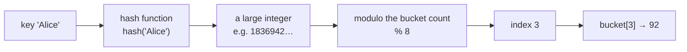
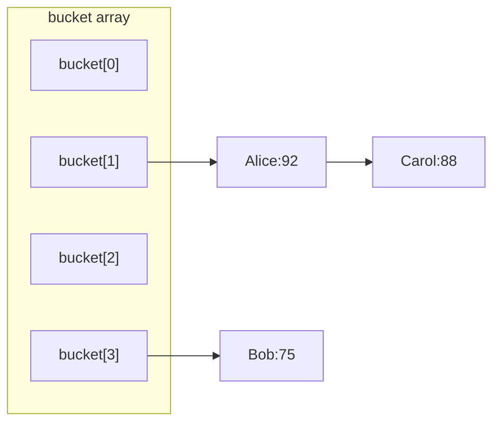

# Chapter 20 · Hash

[简体中文](./20-hash.md) ｜ **English**

---

> Chapter 16 showed that arrays give O(1) access via `address = base + index × element size`. But that assumes one thing: **you know the index.**
>
> In practice we usually want to ask "**what is Alice's score?**" — the key is a name, not a number. Comparing one by one is O(n): measured at **172 milliseconds** across two hundred thousand records, versus **0.04 milliseconds** with a hash — nearly **four thousand times faster**.
>
> How? The answer is startlingly plain: **if an array needs an index, then compute an index from the key.** This chapter unpacks everything behind that "compute" — including the trouble it inevitably brings (collisions) and a trap almost every Java programmer has fallen into.

## 1. Learning Objectives

By the end of this chapter, you will be able to:

- State the core idea: **a hash function turns a key into an array index**, reusing the array's O(1);
- Explain **why collisions are inevitable** (the pigeonhole principle) and compare **separate chaining** with **open addressing**;
- Explain the role of the **load factor** and of **rehashing**;
- Explain why hashing is **average O(1) but worst-case O(n)**, and what that means for security;
- Remember the contract that **`equals` and `hashCode` must agree**, and what happens when it is violated.

---

## 2. Why This Concept Exists

We already have arrays (O(1) but integer indices only) and lists (searchable but O(n)). Reality asks for something else:

```text
"What is Alice's score?"        ← the key is a string
"Status of order A1B2C3?"       ← an arbitrary string key
"Have I seen this word?"        ← fast membership testing
```

**Measured, the gap is enormous** (300 lookups among 200,000 elements):

| Approach | Time |
|----------|------|
| Linear search in a list, O(n) | **171.97 ms** |
| Hash lookup, O(1) | **0.04 ms** |

**About 3825× faster** — the largest performance gap in this book so far, and why the hash table is **the most-used data structure there is**.

So the core question becomes: **how do we make "look up by name" as fast as "look up by index"?**

---

## 3. How It Works

### The core idea: turn the key into an index

The whole essence of a hash table is one line:

```text
index = hash(key) % number_of_buckets
```

With an index in hand, the rest is just the array's O(1) access:



**Three requirements for a hash function**:

| Requirement | Why |
|-------------|-----|
| **Deterministic** | the same key must always hash the same |
| **Uniform** | different keys should spread out, not pile into one bucket |
| **Fast** | otherwise it defeats the purpose |

### Collisions are inevitable: the pigeonhole principle

**Keys are unlimited; buckets are not** — so two different keys must eventually land in the same bucket. That is the **pigeonhole principle** (n+1 pigeons in n holes means some hole has two).

> **So a hash table's design is never about "avoiding collisions" but about "what to do when they happen."**

### Two collision strategies

**① Separate chaining** — each bucket holds a list (or tree):



Colliding keys line up in one chain; lookup finds the bucket, then compares along the chain. **Java's `HashMap` uses this** (converting a chain to a red-black tree once it exceeds 8 entries with at least 64 buckets, capping the worst case).

**② Open addressing** — no chains; on collision, probe for another free slot in the array:

```text
bucket[3] taken → try bucket[4] → taken → try bucket[5] → free, store here
```

**Python's `dict` and C#'s `Dictionary` take this route.** The upside is that all data lives in one contiguous array, which is **cache-friendly** (Chapter 16); the downside is that deletion is fiddly (you cannot simply blank a slot, or you break probe chains).

| | Separate chaining | Open addressing |
|---|---|---|
| Used by | Java HashMap | Python dict, C# Dictionary |
| Cache friendliness | moderate (scattered nodes) | **good** (contiguous data) |
| Deletion | simple | complex (tombstones) |
| Under high load | degrades gently | degrades sharply |

### Load factor and rehashing

**Load factor = elements / buckets.** The higher it goes, the more collisions. So hash tables **grow and redistribute every element (rehash)** past a threshold:

| Language | Default load factor | Growth |
|----------|:------------------:|--------|
| Java HashMap | **0.75** | capacity doubles |
| Python dict | **~0.66** | roughly 3× used slots |
| C# Dictionary | ~1.0 | next prime |
| C++ unordered_map | **1.0** | more buckets and rehash |

> **Rehashing is O(n)** — which makes hash-table insertion **amortized O(1)** (echoing Chapter 17's dynamic array).

### Why "average O(1), worst O(n)"

- **Average case**: a uniform hash puts a constant number of entries per bucket → O(1);
- **Worst case**: every key lands in one bucket → a linear scan → **O(n)**.

**Measured degradation** (Python, 3000 insertions plus lookups):

| Scenario | Time |
|----------|------|
| Normal hash distribution | **1.5 ms** |
| All keys hash to the same value | **486.9 ms** |

**About 324× slower.**

> ⚠️ **This is not just a performance issue but a security one.** If an attacker can predict the hash function, they can **deliberately craft colliding keys** (say, carefully chosen HTTP parameter names) so the server's hash table degrades to a linked list and the CPU saturates — the **hash collision denial-of-service attack (Hash-DoS)**. Modern languages counter it by **seeding the hash function randomly** (Python randomizes by default via `PYTHONHASHSEED`; Java 8+ falls back to red-black trees).

### The `equals` / `hashCode` contract

This is the trap **every Java programmer hits once**. The rule:

```text
If a.equals(b) is true, then a.hashCode() must equal b.hashCode()
```

**Why?** Lookup happens in two steps: **`hashCode` picks the bucket, then `equals` identifies the entry within it.** Override only `equals`, and two "equal" objects hash differently, landing in different buckets — **so what you stored cannot be found.**

**Measured** (Java):

```java
// only equals overridden, hashCode forgotten
map.put(new BadKey("Alice"), "92");
map.get(new BadKey("Alice"));      // → null  ← stored but unfindable!
new BadKey("Alice").equals(new BadKey("Alice"));   // → true (equals says they're equal)
```

**Result**: `equals` reports equality while `get` returns `null`. Override both and everything works.

> **Remember this**: **`hashCode` decides which bucket to search, `equals` decides which entry it is — you need both.**

---

## 4. JavaScript

**JavaScript has two key-value structures**, and the distinction matters:

```javascript
// ① plain objects: keys can only be strings or Symbols
const obj = { Alice: 92, Bob: 75 };
obj[1] = "x";                 // a numeric key becomes the string "1"
console.log(Object.keys(obj));  // ["1", "Alice", "Bob"]

// ② Map: keys of any type, and insertion order is preserved
const map = new Map();
map.set("Alice", 92);
map.set(1, "numeric key");     // stays a number
map.set({id: 1}, "objects work as keys too");
console.log(map.get("Alice"));  // 92
console.log(map.size);          // 3
```

**When `Map` beats `Object`**:

| Need | Choose |
|------|--------|
| Non-string keys | **`Map`** |
| Frequent insertion/deletion | **`Map`** (better performance) |
| Knowing the size | **`Map`** (`.size`) |
| JSON serialization | `Object` |
| Fixed-shape records | `Object` |

**`Set` for deduplication and membership**:

```javascript
const seen = new Set([1, 2, 2, 3]);
console.log(seen.size);        // 3 ← duplicates removed
console.log(seen.has(2));      // true ← O(1) membership
```

> ⚠️ **Note**: `Map` / `Set` compare keys with **SameValueZero** (like `===`, except `NaN` equals itself). **Object keys compare by reference** — after `map.set({a:1}, x)`, a different `{a:1}` will not find it.

---

## 5. Python

**`dict` is Python's core data structure** — even object attributes and module namespaces are dicts underneath:

```python
scores = {"Alice": 92, "Bob": 75}
print(scores["Alice"])          # 92
print(scores.get("Carol", 0))   # 0 ← default instead of an exception
scores["Carol"] = 88            # insert
print("Bob" in scores)          # True ← O(1) membership
```

**Python 3.7+ guarantees `dict` preserves insertion order** (measured):

```python
d = {}
for k in ["zebra", "apple", "mango"]: d[k] = len(k)
list(d.keys())        # ['zebra', 'apple', 'mango'] ← matches insertion order
```

> **Note**: that is **insertion order**, not **sorted order**. Sorting still needs `sorted(d.items())`.

**Keys must be hashable (immutable)**:

```python
d = {(1, 2): "tuples are fine"}   # ✓ immutable, hashable
d = {[1, 2]: "lists are not"}     # ✗ TypeError: unhashable type: 'list'
```

**Custom classes must implement both `__hash__` and `__eq__`** (Java's contract by another name):

```python
class Student:
    def __init__(self, name): self.name = name
    def __eq__(self, o): return isinstance(o, Student) and o.name == self.name
    def __hash__(self): return hash(self.name)      # must agree with __eq__
```

> ⚠️ **A Python-specific twist**: **defining `__eq__` without `__hash__` makes the class unhashable** (`__hash__` is set to `None` automatically) — which is arguably safer than Java's silent failure, because it errors out immediately.

**`set` for deduplication and set algebra**:

```python
a, b = {1, 2, 3}, {2, 3, 4}
print(a & b, a | b, a - b)     # {2,3} {1,2,3,4} {1}
```

---

## 6. Java

**`HashMap` is the workhorse**:

```java
Map<String, Integer> scores = new HashMap<>();
scores.put("Alice", 92);
scores.get("Alice");                  // 92
scores.getOrDefault("Carol", 0);      // 0 ← default when absent
scores.containsKey("Bob");            // O(1)
scores.computeIfAbsent("Dave", k -> 0);   // compute and store only if missing
```

**Java's Map family**:

| Implementation | Traits |
|----------------|--------|
| **`HashMap`** | fastest, **unordered** |
| `LinkedHashMap` | preserves **insertion order** (or access order, for an LRU cache) |
| `TreeMap` | **sorted by key** (red-black tree, O(log n)) |
| `ConcurrentHashMap` | thread-safe (Part 6) |

**⚠️ The `equals` / `hashCode` contract** (measured in section 3):

```java
class Student {
    private final String name;
    @Override public boolean equals(Object o) { /* compare name */ }
    @Override public int hashCode() { return Objects.hash(name); }   // override both!
}
```

**Java 8's key improvement**: when one bucket's chain exceeds 8 entries (with at least 64 buckets total), **the chain becomes a red-black tree**, lowering the worst case from O(n) to **O(log n)** — precisely to blunt hash collision attacks.

> **Note**: **key objects should be immutable.** Modify a field used by `hashCode` after inserting, and the entry is effectively lost (it sits in the old bucket but is looked up by the new hash).

---

## 7. C++

**C++ has two mapping families, and the `unordered_` prefix is the tell**:

```cpp
#include <unordered_map>
#include <map>

std::unordered_map<std::string, int> hashMap;   // hash table, average O(1), unordered
std::map<std::string, int> treeMap;             // red-black tree, O(log n), key-ordered

hashMap["Alice"] = 92;
hashMap.at("Alice");             // bounds-checked (throws when missing)
hashMap.count("Bob");            // membership
if (auto it = hashMap.find("Bob"); it != hashMap.end()) { /* C++17 form */ }
```

> ⚠️ **A subtle trap**: `operator[]` **silently inserts a default value** when the key is missing!

```cpp
std::unordered_map<std::string, int> m;
if (m["missing"] == 0) { }       // ✗ this line just inserted "missing"!
std::cout << m.size();           // 1 ← a "read" added an element
// ✓ read-only alternatives:
if (m.count("missing")) { }
if (m.find("missing") != m.end()) { }
```

**Custom key types need a hash function**:

```cpp
struct Student { std::string name; };
struct StudentHash {
    size_t operator()(const Student& s) const { return std::hash<std::string>{}(s.name); }
};
std::unordered_map<Student, int, StudentHash> m;   // pass the hasher explicitly
```

**C++ lets you inspect and tune the table's internals** (the transparency philosophy, echoing Chapter 17's `capacity`):

```cpp
m.bucket_count();        // number of buckets
m.load_factor();         // current load factor
m.max_load_factor(0.5);  // set the threshold
m.reserve(1000);         // preallocate, avoiding repeated rehashes
```

---

## 8. C#

**`Dictionary<K,V>` is the standard** (a hybrid of open addressing and chained buckets):

```csharp
var scores = new Dictionary<string, int>();
scores["Alice"] = 92;
scores.TryGetValue("Bob", out int v);        // ✓ safe retrieval, no exception
scores.ContainsKey("Alice");                  // O(1)
scores.TryAdd("Carol", 88);                   // add only if absent
```

**C#'s Map family**:

| Type | Traits |
|------|--------|
| `Dictionary<K,V>` | hash table, fastest |
| `SortedDictionary<K,V>` | red-black tree, key-ordered |
| `HashSet<T>` | hash set |
| `ConcurrentDictionary<K,V>` | thread-safe |

**Custom keys must override `Equals` and `GetHashCode`** (as in Java; Chapter 10 covered why all three must agree):

```csharp
public record Student(string Name);    // ✓ record auto-generates Equals/GetHashCode
```

> **A C# convenience**: defining key types as **`record`** makes the compiler generate correct `Equals` and `GetHashCode` — **eliminating Java's classic trap at the language level.**

---

## 9. SQL

Hashing is everywhere in databases, but its role differs sharply from in-memory hash tables.

### ① Hash index vs. B-tree index

```sql
-- PostgreSQL supports both
CREATE INDEX idx_hash ON student USING HASH (name);   -- hash index
CREATE INDEX idx_btree ON student (name);             -- B-tree index (default)
```

| | Hash index | B-tree index |
|---|---|---|
| Equality `=` | **O(1), faster** | O(log n) |
| **Range queries** `>` `<` `BETWEEN` | ❌ **not supported at all** | ✅ supported |
| `ORDER BY` | ❌ no | ✅ yes |
| Prefix `LIKE 'A%'` | ❌ no | ✅ yes |

> **This answers a common question: databases can use hash indexes, so why is B-tree the default?** Because **hashing throws away all ordering information** — it can answer "equals" but never "greater than." Real queries need ranges and sorting constantly. B-trees trade O(log n) for order, and in a database that is a very good deal (Chapter 21 covers trees).

### ② Hash join

Hashing matters even more in **query execution**. Joining two large tables on equality typically uses a hash join:

```sql
SELECT s.name, c.title
FROM student s JOIN course c ON s.id = c.student_id;
```

The engine **builds a hash table from the smaller table in memory, then scans the larger one probing it** — turning an O(n×m) nested loop into roughly O(n+m). That is this chapter's idea applied directly.

### ③ Hash aggregation and deduplication

```sql
SELECT class, COUNT(*) FROM student GROUP BY class;   -- often a HashAggregate
SELECT DISTINCT class FROM student;                    -- hashing works here too
```

A typical `GROUP BY` implementation **accumulates into a hash table keyed by the grouping columns** — the same thing you do with a `dict` when counting words.

> **Engineering note**: to see which strategy your database chose, run `EXPLAIN` and look for `Hash Join` and `HashAggregate`.

---

## 10. Cross-Language Comparison

### ① Hash structures

| Feature | JavaScript | Python | Java | C++ | C# |
|---------|-----------|--------|------|-----|-----|
| Hash map | `Map` / `Object` | `dict` | `HashMap` | `unordered_map` | `Dictionary<K,V>` |
| Hash set | `Set` | `set` | `HashSet` | `unordered_set` | `HashSet<T>` |
| Ordered map | none (`Map` keeps insertion order) | none (`dict` keeps insertion order) | `TreeMap` | `map` (red-black tree) | `SortedDictionary` |
| **Preserves insertion order** | ✅ `Map` | ✅ **guaranteed since 3.7** | ❌ (use `LinkedHashMap`) | ❌ | ❌ |
| Collision strategy | engine-internal | **open addressing** | **chaining + red-black tree** | usually chaining | chained buckets |
| Key equality | SameValueZero | `__eq__` + `__hash__` | `equals` + `hashCode` | `==` + `std::hash` | `Equals` + `GetHashCode` |
| Default load factor | engine-internal | ~0.66 | **0.75** | 1.0 | ~1.0 |

### ② Behavior when a key is missing (a common trap)

| Language | Retrieval | When absent |
|----------|-----------|-------------|
| JavaScript | `map.get(k)` | `undefined` |
| Python | `d[k]` | ⚠️ raises `KeyError` |
| Python | `d.get(k, default)` | returns the default ✓ |
| Java | `map.get(k)` | `null` |
| C++ | `m[k]` | ⚠️ **silently inserts a default!** |
| C++ | `m.at(k)` | throws `std::out_of_range` |
| C# | `d[k]` | throws `KeyNotFoundException` |
| C# | `d.TryGetValue(k, out v)` | returns false ✓ |

> ⚠️ **C++'s `operator[]` is the most dangerous of these** — a mere "read" changes the container's size.

### ③ Commonalities and the root of differences

**In common**: every hash table is "hash function + bucket array + collision resolution + load-factor growth," all offer average O(1) operations, and all require keys to be hashable with equality consistent with the hash.

**The differences**:
- **Collision strategy**: Python/C# choose open addressing (cache-friendly), Java chooses chaining (steadier under load, with red-black trees as a backstop since Java 8);
- **Ordering**: Python 3.7 wrote "preserves insertion order" into the language spec (it began as a CPython implementation side effect), while Java offers it through a separate `LinkedHashMap`;
- **How hard the contract is enforced**: C#'s `record` and Python's "define `__eq__` and you become unhashable" both **actively prevent** contract violations, while Java relies on discipline — which is why that trap endures.

---

## 11. Underlying Implementation Comparison

| Language · Implementation | Structure | Key design |
|---------------------------|-----------|-----------|
| **JavaScript · V8** | `Map` uses a hash table plus an ordered entry array | objects use hidden classes / dictionary mode (Chapter 16) |
| **Python · CPython** | **open addressing** + **compact layout** | an index array plus a dense entry array: **saves memory and preserves order for free** |
| **Java · JVM** | **array + linked list**, becoming a **red-black tree** past 8 entries (with ≥64 buckets) | load factor 0.75; capacity is always a power of two (bitwise AND instead of modulo) |
| **C++ · libstdc++** | bucket array + singly linked lists | prime bucket counts, `max_load_factor` 1.0 by default |
| **C# · CLR** | bucket array + entry array (chained) | prime bucket counts to reduce clustering |

**Two implementation details worth remembering**:

- **Python's compact dict**: splitting "indices" and "data" into two arrays, with data stored densely in insertion order — **saving roughly 30% memory and preserving order as a side effect.** Python 3.7 simply promoted that side effect to a language guarantee.
- **Java replaces modulo with bitwise AND**: because capacity is always a power of two, `hash % n` becomes `hash & (n-1)` — **modulo costs tens of cycles, a bitwise AND costs one** (echoing Chapter 10's operator costs).

---

## 12. Performance Analysis

### Complexity

| Operation | Average | Worst | Notes |
|-----------|:-------:|:-----:|-------|
| Lookup | **O(1)** | O(n) | worst = total collisions; O(log n) after Java 8's treeification |
| Insert | **amortized O(1)** | O(n) | O(n) when rehashing |
| Delete | **O(1)** | O(n) | same |
| Iteration | O(n + buckets) | — | too many buckets slows iteration |
| Space | O(n) | — | overhead from the load factor (about 1.3–1.5×) |

### Measured data (conditions noted)

**① Hash vs. linear search** (Python, 300 lookups among 200,000 elements):

| Approach | Time |
|----------|------|
| `list` linear search | 171.97 ms |
| `set` hash lookup | **0.04 ms** |

**About 3825× faster** — the largest gap in this book so far.

**② The cost of collisions** (Python, 3000 insertions plus lookups):

| Scenario | Time |
|----------|------|
| Normal distribution | 1.5 ms |
| All keys hash alike | **486.9 ms** |

**About 324× slower** — the mechanism behind Hash-DoS.

> ⚠️ Numbers depend on environment and data size; **what matters are the orders of magnitude and the fact that the worst case degrades.**

**Practical advice**:

```java
Map<String,Integer> m = new HashMap<>(expectedSize / 0.75f + 1);  // size it to avoid rehashing
```
```cpp
m.reserve(1000);      // same idea in C++
```

---

## 13. Engineering Practice

| Scenario | ✅ Recommended | ❌ Discouraged | Why |
|----------|---------------|---------------|-----|
| Membership testing | `set` / `HashSet` | scanning a list | O(1) vs O(n); measured thousands of times faster |
| Counting / grouping | a hash map | nested loops | one pass suffices |
| Custom classes as keys | **implement equality and hashing together** | only one of them | stored but unfindable |
| Key mutability | **use immutable objects** | mutable ones | changing a field loses the entry |
| Read-only checks in C++ | `count()` / `find()` | `operator[]` | it inserts a default |
| Retrieval in Python | `d.get(k, default)` | `d[k]` wrapped in try/except | shorter |
| Known size | set an initial capacity | letting it rehash repeatedly | rehashing is O(n) |
| Needing order | `TreeMap` / `SortedDictionary` | a hash map plus sorting each time | hashing discards order |
| External input as keys | be mindful of collision risk | trusting it blindly | Hash-DoS is real |

**Word counting — the hash table's most classic application**:

```python
from collections import Counter
counts = Counter(words)              # ✓ one line; a dict underneath
```
```java
Map<String,Integer> counts = new HashMap<>();
for (String w : words) counts.merge(w, 1, Integer::sum);   // ✓ concise
```

---

## 14. Best Practices

- **Keys should be immutable**: strings, numbers, tuples, and `record`s are all good.
- **Implement equality and hashing together**, over **the same fields**.
- **Keep the hash function fast and uniform** — use the language's combinators (`Objects.hash`, `hash(tuple)`).
- **Don't rely on iteration order** unless the language guarantees it (as Python 3.7+ does).
- **Size the table up front** to reduce rehashing.
- **Use an ordered map when you need order**, rather than sorting a hash map's contents repeatedly.
- **Be careful with attacker-controlled keys**: modern languages randomize hashing by default — don't turn it off.

---

## 15. Common Pitfalls

**Pitfall 1 · Overriding `equals` but not `hashCode` (Java's classic)**

```java
map.put(new BadKey("Alice"), "92");
map.get(new BadKey("Alice"));    // ✗ null — stored yet unfindable
```
**Why it's wrong**: different hashes send them to different buckets.
**How to avoid**: always override both; let the IDE generate them, or use a `record`.

**Pitfall 2 · C++'s `operator[]` inserting a default**

```cpp
if (m["missing"] == 0) { }     // ✗ this inserted "missing"
if (m.count("missing")) { }    // ✓ read-only
```

**Pitfall 3 · Mutable objects as keys**

```python
key = [1, 2]                    # lists are unhashable → an immediate error (Python is safer here)
```
```java
List<Integer> key = new ArrayList<>(List.of(1,2));
map.put(key, "value");
key.add(3);                     // ✗ the hash changed → the entry is lost
```

**Pitfall 4 · Relying on a hash table's iteration order**

```java
for (String k : hashMap.keySet())    // ✗ unspecified, and may change across versions
```
**How to avoid**: use `LinkedHashMap` (insertion order) or `TreeMap` (key order).

**Pitfall 5 · Using `d[k]` in Python for possibly-missing keys**

```python
d["missing"]              # ✗ KeyError
d.get("missing", 0)       # ✓
d.setdefault("k", []).append(1)   # ✓ initialize when absent
```

**Pitfall 6 · A poor hash function**

```python
def __hash__(self): return 1        # ✗ total collisions; measured 324× slower
def __hash__(self): return hash(self.name)   # ✓
```

**Pitfall 7 · Ignoring hash collision attacks**

```text
external input used directly as keys → an attacker crafts colliding keys → CPU saturates
```
**How to avoid**: keep the language's default hash randomization; rate-limit huge inputs or use another structure.

---

## 16. Interview Questions

**Basic**

1. How does a hash table achieve O(1) lookup?
2. What is a hash collision, and why is it inevitable?
3. When should you choose an array versus a hash table?

**Intermediate**

4. What are the pros and cons of chaining versus open addressing? Which does each language use?
5. What is the load factor and why is rehashing needed? What does it cost?
6. Why must `equals` and `hashCode` be overridden together? What happens with only one?

**Advanced**

7. A hash table's worst case is O(n) — what does that mean for security, and how do languages mitigate it?
8. Why did Java 8 add red-black trees to `HashMap`? Under what conditions do they kick in?
9. Why do database indexes default to B-trees rather than hashes? (Hint: what does hashing discard?)

---

## 17. Exercises

**Basic**

1. Write a word-frequency counter in each of the six languages.
2. Deduplicate with a hash set and compare performance against "sort then dedupe."
3. Measure the timing difference of `in` on a large `list` versus a `set`.

**Intermediate**

4. Implement your own hash table (chaining) with insertion, deletion, lookup, and automatic growth.
5. In Java, build a class that overrides only `equals`, reproduce "stored but unfindable," then fix it.
6. Construct many colliding keys and measure how far performance degrades.

**Challenge**

7. Implement a hash table with open addressing, handling deletion correctly (tombstones).
8. Implement an LRU cache (hash map + doubly linked list, O(1) read and write).
9. Investigate and explain why Python's compact dict both saves memory and preserves order. Draw its two-layer structure.

---

## 18. Summary

**In one sentence**: a hash table's core idea is to **use a hash function to turn any key into an array index**, reusing the array's O(1); because keys are unlimited and buckets are not, **collisions are inevitable** (the pigeonhole principle), so the real design work is collision resolution (chaining / open addressing) and load-factor growth.

**Core takeaways**

- **`index = hash(key) % buckets`** is the whole essence; measured, hash lookup beat linear search by about **3825×**.
- **Collisions are inevitable**, with two solutions: chaining (Java) and open addressing (Python/C#).
- **Average O(1), worst O(n)** — measured at about **324× slower** under total collision, which is the mechanism behind **Hash-DoS**.
- **`equals` and `hashCode` must agree**: the latter picks the bucket, the former picks the entry; violating the contract means **stored but unfindable**.
- **Hashing discards ordering** — which is exactly why database indexes default to B-trees.

**Checklist**

- [ ] I can explain how a hash table achieves O(1) and why collisions are inevitable.
- [ ] I can compare chaining with open addressing and say which language uses which.
- [ ] I know what the load factor does and what rehashing costs.
- [ ] I can state the `equals`/`hashCode` contract and reproduce the consequence of breaking it.
- [ ] I understand the security implications of the worst case, and why databases use B-trees.

**Next chapter**: hashing is fast, but it throws order away entirely — it cannot answer "who scored above 80," "sort by name," or "find the nearest value." Is there a structure that is both fast to search and order-preserving? The answer is to organize data into **levels** — that is Chapter 21, "Tree."

---

## 19. Further Reading

- <a href="https://en.wikipedia.org/wiki/Hash_table" target="_blank" rel="noopener">Wikipedia: Hash table</a> — structure, collision resolution, and performance.
- <a href="https://en.wikipedia.org/wiki/Hash_function" target="_blank" rel="noopener">Wikipedia: Hash function</a> — design requirements and common algorithms.
- <a href="https://en.wikipedia.org/wiki/Collision_resolution" target="_blank" rel="noopener">Wikipedia: Collision resolution</a> — chaining versus open addressing in detail.
- <a href="https://docs.oracle.com/en/java/javase/21/docs/api/java.base/java/util/HashMap.html" target="_blank" rel="noopener">Java docs · HashMap</a> — the official account of load factor and treeification.
- <a href="https://github.com/python/cpython/blob/main/Objects/dictobject.c" target="_blank" rel="noopener">CPython source · dictobject.c</a> — the real compact-dict implementation.
- <a href="https://en.cppreference.com/w/cpp/container/unordered_map" target="_blank" rel="noopener">cppreference · unordered_map</a> — the bucket interface and load-factor controls.
- <a href="https://learn.microsoft.com/en-us/dotnet/api/system.collections.generic.dictionary-2" target="_blank" rel="noopener">Microsoft Learn · Dictionary\<K,V\></a> — the complete C# API.
