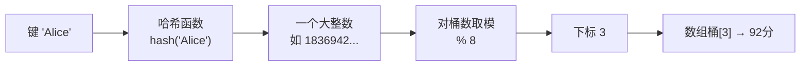
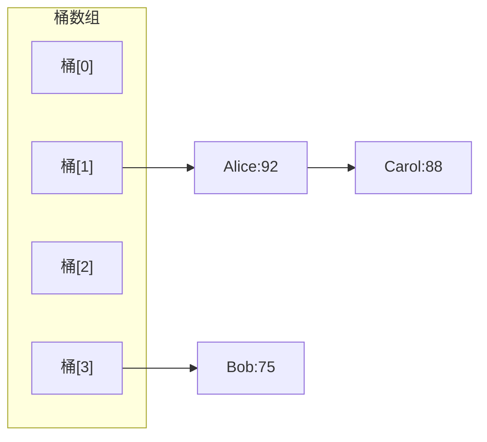

# 第 20 章 · 哈希

**简体中文** ｜ [English](./20-hash.en-US.md)

---

> 第 16 章我们看到，数组能 O(1) 访问，靠的是 `地址 = 基址 + 下标 × 元素大小`。但这有个前提：**你得知道下标**。
>
> 可现实中我们想查的往往是"**Alice 的分数是多少**"——键是名字，不是数字。逐个比较是 O(n)，在二十万条数据里实测要 **172 毫秒**；而哈希只要 **0.04 毫秒**，**快了近四千倍**。
>
> 它是怎么做到的？答案朴素得惊人：**既然数组要下标，那就把键算成下标**。这一章要讲清这个"算"字背后的全部学问——包括它必然带来的麻烦（冲突），以及一个几乎每个 Java 程序员都踩过的坑。

## 1. 学习目标

本章结束后，你将能够：

- 说清哈希表的核心思想：**用哈希函数把键变成数组下标**，从而复用数组的 O(1)；
- 解释**为什么冲突不可避免**（鸽巢原理），并对比**链地址法**与**开放寻址**两种解法；
- 说明**负载因子**与**扩容**（rehash）的作用；
- 解释为什么哈希是**平均 O(1) 但最坏 O(n)**，并知道这对安全意味着什么；
- 牢记 **`equals` 与 `hashCode` 必须一致**这条契约，以及违反它的后果。

---

## 2. 为什么会出现这个概念

我们已经有了数组（O(1) 但只能用整数下标）和列表（可以查找但要 O(n)）。现实需求却是：

```text
"Alice 的分数是多少？"      ← 键是字符串
"订单号 A1B2C3 的状态？"    ← 键是任意字符串
"这个单词出现过吗？"        ← 需要快速判重
```

**实测这个差距有多大**（在二十万个元素中查找 300 次）：

| 方式 | 耗时 |
|------|------|
| 列表线性查找 O(n) | **171.97 ms** |
| 哈希查找 O(1) | **0.04 ms** |

**快了约 3825 倍。** 这是本书目前出现过的最大性能差距——也说明了为什么哈希表是**使用频率最高的数据结构**。

那么核心问题就是：**怎么让"用名字查"也像"用下标查"一样快？**

---

## 3. 底层原理

### 核心思想：把键变成下标

哈希表的全部精髓就是一句话：

```text
下标 = 哈希函数(键) % 桶数量
```

有了下标，剩下的就是数组的 O(1) 访问了：



**哈希函数的三个要求**：

| 要求 | 说明 |
|------|------|
| **确定性** | 同一个键必须永远得到同一个哈希值 |
| **均匀分布** | 不同的键尽量散开，避免挤在同一个桶 |
| **计算快** | 否则得不偿失（本来就是为了快） |

### 冲突不可避免：鸽巢原理

**键的数量是无限的，桶的数量是有限的**——所以必然有两个不同的键映射到同一个桶。这就是**鸽巢原理**（把 n+1 只鸽子放进 n 个巢，必有一个巢有两只）。

> **所以哈希表的设计重点，从来不是"避免冲突"，而是"冲突了怎么办"。**

### 两种冲突解决方案

**① 链地址法（Separate Chaining）**——每个桶挂一条链表（或树）：



冲突的键排在同一条链上，查找时先定位桶、再沿链比较。**Java 的 `HashMap` 用这个**（链表长度超过 8 且桶数≥64 时转成红黑树，避免最坏情况）。

**② 开放寻址（Open Addressing）**——不挂链，冲突了就在数组里另找空位：

```text
桶[3] 被占了 → 试桶[4] → 还占着 → 试桶[5] → 空的，放这里
```

**Python 的 `dict` 和 C# 的 `Dictionary` 走这条路**。优点是全部数据都在一个连续数组里，**缓存友好**（呼应第 16 章）；缺点是删除比较麻烦（不能直接置空，否则会截断查找链）。

| | 链地址法 | 开放寻址 |
|---|---|---|
| 代表 | Java HashMap | Python dict、C# Dictionary |
| 缓存友好 | 一般（链表节点分散） | **好**（数据连续） |
| 删除 | 简单 | 复杂（需墓碑标记） |
| 高负载表现 | 较稳 | 急剧退化 |

### 负载因子与扩容

**负载因子 = 元素数 / 桶数**。它越高，冲突越多。所以哈希表会在超过阈值时**扩容并重新分布所有元素（rehash）**：

| 语言 | 默认负载因子 | 扩容策略 |
|------|:-----------:|---------|
| Java HashMap | **0.75** | 容量翻倍 |
| Python dict | **约 0.66** | 增长约 3 倍（按已用槽位） |
| C# Dictionary | ~1.0 | 扩到下一个质数 |
| C++ unordered_map | **1.0** | 桶数增大并 rehash |

> **rehash 是 O(n) 的**——所以哈希表的插入也是**摊还 O(1)**（呼应第 17 章的动态数组）。

### 为什么"平均 O(1)，最坏 O(n)"

- **平均情况**：哈希函数分布均匀，每个桶只有常数个元素 → O(1)；
- **最坏情况**：所有键都撞进同一个桶 → 退化成链表遍历 → **O(n)**。

**实测这个退化有多严重**（Python，3000 次插入+查找）：

| 场景 | 耗时 |
|------|------|
| 哈希分布正常 | **1.5 ms** |
| 所有键哈希值相同 | **486.9 ms** |

**慢了约 324 倍。**

> ⚠️ **这不只是性能问题，更是安全问题**。攻击者若能预测哈希函数，就能**故意构造大量冲突的键**（比如精心设计的 HTTP 参数名），让服务器的哈希表退化成链表，CPU 被打满——这就是**哈希碰撞拒绝服务攻击（Hash-DoS）**。现代语言的对策是**为哈希函数加随机种子**（Python 默认开启 `PYTHONHASHSEED` 随机化，Java 8+ 用红黑树兜底）。

### `equals` 与 `hashCode` 的契约

这是**每个 Java 程序员都会踩一次的坑**。规则是：

```text
若 a.equals(b) 为真，则 a.hashCode() 必须等于 b.hashCode()
```

**为什么？** 因为查找分两步：**先用 `hashCode` 决定去哪个桶找，再用 `equals` 判断桶里哪个才是**。如果只重写 `equals`，两个"相等"的对象会算出不同的哈希值，被分到不同的桶——**于是存进去的东西查不出来**。

**实测**（Java）：

```java
// 只重写 equals，忘了 hashCode
map.put(new BadKey("Alice"), "92分");
map.get(new BadKey("Alice"));      // → null  ← 存进去了却查不到！
new BadKey("Alice").equals(new BadKey("Alice"));   // → true（equals 说它们相等）
```

**结果**：`equals` 说相等，`get` 却返回 `null`。而两个都正确重写后，一切正常。

> **记住这句话**：**`hashCode` 决定去哪个桶找，`equals` 决定桶里哪个才是——缺一不可。**

---

## 4. JavaScript

**JavaScript 有两套键值结构**，区别很重要：

```javascript
// ① 普通对象：键只能是字符串或 Symbol
const obj = { Alice: 92, Bob: 75 };
obj[1] = "x";                 // 数字键会被转成字符串 "1"
console.log(Object.keys(obj));  // ["1", "Alice", "Bob"]

// ② Map：键可以是任意类型，且保持插入顺序
const map = new Map();
map.set("Alice", 92);
map.set(1, "数字键");          // 保持数字类型
map.set({id: 1}, "对象也能当键");
console.log(map.get("Alice"));  // 92
console.log(map.size);          // 3
```

**`Map` 优于 `Object` 的场景**：

| 需求 | 推荐 |
|------|------|
| 键不是字符串 | **`Map`** |
| 需要频繁增删 | **`Map`**（性能更好） |
| 需要知道大小 | **`Map`**（`.size`） |
| 需要 JSON 序列化 | `Object` |
| 固定结构的记录 | `Object` |

**`Set` 用于去重与判重**：

```javascript
const seen = new Set([1, 2, 2, 3]);
console.log(seen.size);        // 3 ← 自动去重
console.log(seen.has(2));      // true ← O(1) 判重
```

> ⚠️ **注意事项**：`Map` / `Set` 判断键相等用的是 **SameValueZero**（类似 `===`，但 `NaN` 等于自身）。**对象键按引用比较**——`map.set({a:1}, x)` 之后用另一个 `{a:1}` 是取不到的。

---

## 5. Python

**`dict` 是 Python 的核心数据结构**——连对象的属性、模块的命名空间底层都是 dict：

```python
scores = {"Alice": 92, "Bob": 75}
print(scores["Alice"])          # 92
print(scores.get("Carol", 0))   # 0 ← 键不存在时返回默认值，不抛异常
scores["Carol"] = 88            # 插入
print("Bob" in scores)          # True ← O(1) 判重
```

**Python 3.7+ 保证 `dict` 保持插入顺序**（实测验证）：

```python
d = {}
for k in ["zebra", "apple", "mango"]: d[k] = len(k)
list(d.keys())        # ['zebra', 'apple', 'mango'] ← 与插入顺序一致
```

> **注意**：这是**插入序**，不是**排序**。要排序仍需 `sorted(d.items())`。

**键必须可哈希（不可变）**：

```python
d = {(1, 2): "元组可以"}       # ✓ 元组不可变，可哈希
d = {[1, 2]: "列表不行"}       # ✗ TypeError: unhashable type: 'list'
```

**自定义类要同时实现 `__hash__` 和 `__eq__`**（对应 Java 的契约）：

```python
class Student:
    def __init__(self, name): self.name = name
    def __eq__(self, o): return isinstance(o, Student) and o.name == self.name
    def __hash__(self): return hash(self.name)      # 必须与 __eq__ 一致
```

> ⚠️ **一个 Python 特有的陷阱**：**只定义 `__eq__` 而不定义 `__hash__`，Python 会把类变成不可哈希的**（`__hash__` 被自动设为 `None`）——这反而比 Java "静默出错"更安全，因为它会直接报错。

**`set` 用于去重与集合运算**：

```python
a, b = {1, 2, 3}, {2, 3, 4}
print(a & b, a | b, a - b)     # {2,3} {1,2,3,4} {1}
```

---

## 6. Java

**`HashMap` 是最常用的实现**：

```java
Map<String, Integer> scores = new HashMap<>();
scores.put("Alice", 92);
scores.get("Alice");                  // 92
scores.getOrDefault("Carol", 0);      // 0 ← 键不存在时的默认值
scores.containsKey("Bob");            // O(1)
scores.computeIfAbsent("Dave", k -> 0);   // 不存在才计算并放入
```

**Java 的 Map 家族**：

| 实现 | 特点 |
|------|------|
| **`HashMap`** | 最快，**无序** |
| `LinkedHashMap` | 保持**插入顺序**（或访问顺序，可做 LRU 缓存） |
| `TreeMap` | 按**键排序**（底层红黑树，O(log n)） |
| `ConcurrentHashMap` | 线程安全（Part 6） |

**⚠️ `equals` / `hashCode` 契约**（实测已在第 3 节演示）：

```java
class Student {
    private final String name;
    @Override public boolean equals(Object o) { /* 比较 name */ }
    @Override public int hashCode() { return Objects.hash(name); }   // 必须一起重写！
}
```

**Java 8 的重要改进**：当单个桶的链表长度超过 8（且桶总数 ≥ 64）时，**链表会转成红黑树**，把最坏情况从 O(n) 降到 **O(log n)**——这正是为了缓解哈希碰撞攻击。

> **注意事项**：**用作键的对象应当是不可变的**。如果放进 Map 后修改了参与 `hashCode` 计算的字段，那个条目就"丢失"了（在旧桶里，但按新哈希值去找不到）。

---

## 7. C++

**C++ 有两套映射，前缀 `unordered_` 是关键**：

```cpp
#include <unordered_map>
#include <map>

std::unordered_map<std::string, int> hashMap;   // 哈希表，平均 O(1)，无序
std::map<std::string, int> treeMap;             // 红黑树，O(log n)，按键有序

hashMap["Alice"] = 92;
hashMap.at("Alice");             // 带边界检查（键不存在抛异常）
hashMap.count("Bob");            // 判存在
if (auto it = hashMap.find("Bob"); it != hashMap.end()) { /* C++17 写法 */ }
```

> ⚠️ **一个隐蔽的坑**：`operator[]` 在键不存在时会**默默插入一个默认值**！

```cpp
std::unordered_map<std::string, int> m;
if (m["missing"] == 0) { }       // ✗ 这行代码把 "missing" 插进去了！
std::cout << m.size();           // 1 ← 只是"读"了一下，却多了一个元素
// ✓ 正确的只读写法：
if (m.count("missing")) { }
if (m.find("missing") != m.end()) { }
```

**自定义类型作键需要提供哈希函数**：

```cpp
struct Student { std::string name; };
struct StudentHash {
    size_t operator()(const Student& s) const { return std::hash<std::string>{}(s.name); }
};
std::unordered_map<Student, int, StudentHash> m;   // 显式传入哈希器
```

**C++ 允许查看和调整哈希表内部状态**（透明哲学，呼应第 17 章的 `capacity`）：

```cpp
m.bucket_count();        // 桶数量
m.load_factor();         // 当前负载因子
m.max_load_factor(0.5);  // 设置阈值
m.reserve(1000);         // 预分配，避免多次 rehash
```

---

## 8. C#

**`Dictionary<K,V>` 是标准实现**（开放寻址 + 链式桶的混合结构）：

```csharp
var scores = new Dictionary<string, int>();
scores["Alice"] = 92;
scores.TryGetValue("Bob", out int v);        // ✓ 安全取值，不抛异常
scores.ContainsKey("Alice");                  // O(1)
scores.TryAdd("Carol", 88);                   // 不存在才添加
```

**C# 的 Map 家族**：

| 类型 | 特点 |
|------|------|
| `Dictionary<K,V>` | 哈希表，最快 |
| `SortedDictionary<K,V>` | 红黑树，按键有序 |
| `HashSet<T>` | 哈希集合 |
| `ConcurrentDictionary<K,V>` | 线程安全 |

**自定义键要重写 `Equals` 和 `GetHashCode`**（与 Java 同理，第 10 章讲过三者必须一致）：

```csharp
public record Student(string Name);    // ✓ record 自动生成 Equals/GetHashCode
```

> **一个 C# 的便利**：用 **`record`** 定义键类型时，编译器会自动生成正确的 `Equals` 和 `GetHashCode`——**从语言层面消灭了 Java 的那个经典坑**。

---

## 9. SQL

数据库里哈希无处不在，但它的角色和内存中的哈希表**很不一样**。

### ① 哈希索引 vs B 树索引

```sql
-- PostgreSQL 支持两种索引
CREATE INDEX idx_hash ON student USING HASH (name);   -- 哈希索引
CREATE INDEX idx_btree ON student (name);             -- B 树索引（默认）
```

| | 哈希索引 | B 树索引 |
|---|---|---|
| 等值查询 `=` | **O(1)，更快** | O(log n) |
| **范围查询** `>` `<` `BETWEEN` | ❌ **完全不支持** | ✅ 支持 |
| 排序 `ORDER BY` | ❌ 不支持 | ✅ 支持 |
| 前缀匹配 `LIKE 'A%'` | ❌ 不支持 | ✅ 支持 |

> **这解释了一个常见疑问：数据库明明可以用哈希索引，为什么默认是 B 树？** 因为**哈希把顺序信息彻底丢掉了**——它只能回答"等于"，不能回答"大于"。而真实查询里范围和排序太常见了。B 树以 O(log n) 换取了顺序性，这笔交易在数据库场景中非常划算（第 21 章会详细讲树）。

### ② 哈希连接（Hash Join）

哈希在**查询执行**中的作用更大。当两张大表做等值连接时，数据库常用 Hash Join：

```sql
SELECT s.name, c.title
FROM student s JOIN course c ON s.id = c.student_id;
```

执行时：**把小表读进内存建一个哈希表，再扫描大表逐行探测**——把 O(n×m) 的嵌套循环降到约 O(n+m)。这正是本章"用哈希把查找降到 O(1)"思想的直接应用。

### ③ 哈希聚合与去重

```sql
SELECT class, COUNT(*) FROM student GROUP BY class;   -- 常用 HashAggregate
SELECT DISTINCT class FROM student;                    -- 同样可用哈希去重
```

`GROUP BY` 的一种典型实现就是**用哈希表按分组键累积**——与你在代码里用 `dict` 统计词频是同一件事。

> **工程提醒**：想知道数据库实际用了哪种策略，用 `EXPLAIN` 查看执行计划，你会看到 `Hash Join`、`HashAggregate` 这类字样。

---

## 10. 五语言横向对比

### ① 哈希结构对比

| 特性 | JavaScript | Python | Java | C++ | C# |
|------|-----------|--------|------|-----|-----|
| 哈希映射 | `Map` / `Object` | `dict` | `HashMap` | `unordered_map` | `Dictionary<K,V>` |
| 哈希集合 | `Set` | `set` | `HashSet` | `unordered_set` | `HashSet<T>` |
| 有序映射 | 无（`Map` 保插入序） | 无（`dict` 保插入序） | `TreeMap` | `map`（红黑树） | `SortedDictionary` |
| **保持插入顺序** | ✅ `Map` | ✅ **3.7+ 保证** | ❌（用 `LinkedHashMap`） | ❌ | ❌ |
| 冲突解决 | 引擎内部 | **开放寻址** | **链地址 + 红黑树** | 通常链地址 | 链式桶 |
| 键的相等判定 | SameValueZero | `__eq__` + `__hash__` | `equals` + `hashCode` | `==` + `std::hash` | `Equals` + `GetHashCode` |
| 默认负载因子 | 引擎内部 | ~0.66 | **0.75** | 1.0 | ~1.0 |

### ② 键不存在时的行为（易错点）

| 语言 | 取值写法 | 键不存在时 |
|------|---------|-----------|
| JavaScript | `map.get(k)` | `undefined` |
| Python | `d[k]` | ⚠️ 抛 `KeyError` |
| Python | `d.get(k, default)` | 返回默认值 ✓ |
| Java | `map.get(k)` | `null` |
| C++ | `m[k]` | ⚠️ **默默插入默认值！** |
| C++ | `m.at(k)` | 抛 `std::out_of_range` |
| C# | `d[k]` | 抛 `KeyNotFoundException` |
| C# | `d.TryGetValue(k, out v)` | 返回 false ✓ |

> ⚠️ **C++ 的 `operator[]` 是这里最危险的**——一次"读取"就悄悄改变了容器大小。

### ③ 共同点与差异根源

**共同点**：所有语言的哈希表都是"哈希函数 + 桶数组 + 冲突解决 + 负载因子扩容"这套结构，都提供平均 O(1) 的增删查，都要求键可哈希且相等判定与哈希一致。

**差异根源**：
- **冲突策略**：Python/C# 选开放寻址（缓存友好），Java 选链地址（高负载更稳，且 Java 8 加了红黑树兜底）；
- **有序性**：Python 3.7 把"保持插入顺序"写进了语言规范（原本只是 CPython 的实现副产品），Java 则用单独的 `LinkedHashMap` 提供；
- **契约的强制力**：C# 的 `record`、Python 的"只写 `__eq__` 就变不可哈希"都在**主动防止**契约被破坏，而 Java 只能靠程序员自觉——这也是那个坑长盛不衰的原因。

---

## 11. 底层实现对比

| 语言 · 实现 | 结构 | 关键设计 |
|------------|------|---------|
| **JavaScript · V8** | `Map` 用哈希表 + 有序条目数组 | 对象则用隐藏类 + 字典模式（第 16 章） |
| **Python · CPython** | **开放寻址** + **紧凑布局**（PEP 468/509） | 索引数组 + 稠密条目数组：**既省内存又天然保序** |
| **Java · JVM** | **数组 + 链表**，链长 > 8 且桶数 ≥ 64 转**红黑树** | 负载因子 0.75，容量总是 2 的幂（用位运算代替取模） |
| **C++ · libstdc++** | 桶数组 + 单向链表 | 桶数是质数，`max_load_factor` 默认 1.0 |
| **C# · CLR** | 桶数组 + 条目数组（链式） | 桶数取质数，减少哈希聚集 |

**两个值得记住的实现细节**：

- **Python 的紧凑字典**：把"索引"和"数据"分成两个数组，数据数组按插入顺序稠密排列——**这既省了内存（约 30%），又顺带实现了保序**。Python 3.7 干脆把这个副产品写进了语言规范。
- **Java 用位运算代替取模**：因为容量总是 2 的幂，`hash % n` 可以写成 `hash & (n-1)`——**取模是几十个周期，位与只要一个**（呼应第 10 章的运算符成本）。

---

## 12. 性能分析

### 复杂度

| 操作 | 平均 | 最坏 | 说明 |
|------|:----:|:----:|------|
| 查找 | **O(1)** | O(n) | 最坏＝全部冲突；Java 8+ 树化后为 O(log n) |
| 插入 | **摊还 O(1)** | O(n) | 触发 rehash 时是 O(n) |
| 删除 | **O(1)** | O(n) | 同上 |
| 遍历 | O(n + 桶数) | — | 桶太多会拖慢遍历 |
| 空间 | O(n) | — | 因负载因子有额外开销（约 1.3–1.5 倍） |

### 实测数据（条件已注明）

**① 哈希 vs 线性查找**（Python，二十万元素中查找 300 次）：

| 方式 | 耗时 |
|------|------|
| `list` 线性查找 | 171.97 ms |
| `set` 哈希查找 | **0.04 ms** |

**快约 3825 倍** —— 本书目前最大的性能差距。

**② 哈希冲突的代价**（Python，3000 次插入+查找）：

| 场景 | 耗时 |
|------|------|
| 哈希分布正常 | 1.5 ms |
| 所有键哈希值相同 | **486.9 ms** |

**慢约 324 倍** —— 这就是 Hash-DoS 攻击的原理。

> ⚠️ 数字依赖环境与数据规模，**记住的应是"数量级差异"与"最坏情况会退化"这两个结论**。

**实践建议**：

```java
Map<String,Integer> m = new HashMap<>(expectedSize / 0.75f + 1);  // 预估容量，避免 rehash
```
```cpp
m.reserve(1000);      // C++ 同理
```

---

## 13. 工程实践

| 场景 | ✅ 推荐 | ❌ 不推荐 | 原因 |
|------|--------|----------|------|
| 判断元素是否存在 | `set` / `HashSet` | 遍历列表 | O(1) vs O(n)，实测差数千倍 |
| 计数 / 分组统计 | 哈希映射 | 嵌套循环 | 一次遍历搞定 |
| 自定义类作键 | **同时实现相等与哈希** | 只写其中一个 | 存了查不到 |
| 键的可变性 | **用不可变对象作键** | 用可变对象 | 改了字段就找不到了 |
| C++ 只读检查 | `count()` / `find()` | `operator[]` | 后者会插入默认值 |
| Python 取值 | `d.get(k, default)` | `d[k]` 后接异常处理 | 更简洁 |
| 已知规模 | 预设初始容量 | 让它反复 rehash | rehash 是 O(n) |
| 需要有序 | `TreeMap` / `SortedDictionary` | 哈希表 + 每次排序 | 哈希丢失了顺序信息 |
| 处理外部输入作键 | 注意哈希碰撞风险 | 直接信任 | Hash-DoS 是真实威胁 |

**词频统计——哈希表最经典的应用**：

```python
from collections import Counter
counts = Counter(words)              # ✓ 一行搞定，底层就是 dict
```
```java
Map<String,Integer> counts = new HashMap<>();
for (String w : words) counts.merge(w, 1, Integer::sum);   // ✓ 简洁写法
```

---

## 14. 最佳实践

- **键要不可变**：字符串、数字、元组、`record` 都是好选择。
- **相等与哈希必须成对实现**，且基于**同一组字段**。
- **哈希函数要快且分布均匀**——直接用语言提供的组合工具（`Objects.hash`、`hash(tuple)`）。
- **不要依赖遍历顺序**，除非语言明确保证（如 Python 3.7+ 的插入序）。
- **预估容量**，减少 rehash。
- **需要顺序就用有序映射**，别在哈希表外面套排序。
- **对外部可控的键保持警惕**：现代语言默认开启哈希随机化，别自己关掉它。

---

## 15. 常见坑

**坑 1 · 只重写 `equals` 忘了 `hashCode`（Java 经典坑）**

```java
map.put(new BadKey("Alice"), "92分");
map.get(new BadKey("Alice"));    // ✗ null —— 存进去了却查不到
```
**为什么错**：哈希值不同 → 去了不同的桶找。
**如何避免**：两者必须一起重写；用 IDE 生成，或改用 `record`。

**坑 2 · C++ 的 `operator[]` 会插入默认值**

```cpp
if (m["missing"] == 0) { }     // ✗ 这行把 "missing" 插进去了
if (m.count("missing")) { }    // ✓ 只读
```

**坑 3 · 用可变对象作键**

```python
key = [1, 2]                    # 列表不可哈希 → 直接报错（Python 比较安全）
```
```java
List<Integer> key = new ArrayList<>(List.of(1,2));
map.put(key, "值");
key.add(3);                     // ✗ 哈希值变了 → 这个条目再也找不到
```

**坑 4 · 依赖哈希表的遍历顺序**

```java
for (String k : hashMap.keySet())    // ✗ 顺序不保证，且可能随版本变化
```
**如何避免**：需要顺序用 `LinkedHashMap`（插入序）或 `TreeMap`（键序）。

**坑 5 · Python 用 `d[k]` 取可能不存在的键**

```python
d["missing"]              # ✗ KeyError
d.get("missing", 0)       # ✓
d.setdefault("k", []).append(1)   # ✓ 不存在就初始化
```

**坑 6 · 哈希函数写得太差**

```python
def __hash__(self): return 1        # ✗ 全部冲突，实测慢 324 倍
def __hash__(self): return hash(self.name)   # ✓
```

**坑 7 · 忽视哈希碰撞攻击**

```text
外部输入直接作为哈希表的键 → 攻击者构造大量冲突键 → CPU 打满
```
**如何避免**：保持语言默认的哈希随机化；对超大输入做限流或改用其他结构。

---

## 16. 面试题

**基础**

1. 哈希表是如何做到 O(1) 查找的？
2. 什么是哈希冲突？为什么它不可避免？
3. 数组和哈希表各适合什么场景？

**中级**

4. 链地址法和开放寻址各有什么优缺点？各语言分别用哪种？
5. 什么是负载因子？为什么需要扩容？扩容的代价是多少？
6. 为什么 `equals` 和 `hashCode` 必须一起重写？只写一个会怎样？

**高级**

7. 哈希表最坏情况是 O(n)，这在安全上意味着什么？语言层面如何缓解？
8. Java 8 为什么给 `HashMap` 加了红黑树？触发条件是什么？
9. 为什么数据库索引默认用 B 树而不是哈希？（提示：哈希丢失了什么信息。）

---

## 17. 练习

**基础**

1. 在六门语言中各实现一个词频统计器。
2. 用哈希集合去重，并与"排序后去重"对比性能。
3. 实测 `list` 与 `set` 在大数据量下 `in` 操作的耗时差异。

**提高**

4. 自己实现一个哈希表（链地址法），支持增删查和自动扩容。
5. 在 Java 中构造"只重写 equals"的类，复现"存了查不到"的现象，然后修复它。
6. 构造大量哈希冲突的键，实测哈希表性能的退化幅度。

**挑战**

7. 用开放寻址实现哈希表，并正确处理删除（墓碑标记）。
8. 实现一个 LRU 缓存（哈希表 + 双向链表，O(1) 读写）。
9. 研究并说明：为什么 Python 的紧凑字典既省内存又能保序？画出它的两层结构。

---

## 18. 本章总结

**一句话总结**：哈希表的核心思想是**用哈希函数把任意键变成数组下标**，从而复用数组的 O(1)；由于键无限而桶有限，**冲突必然发生**（鸽巢原理），因此真正的设计重点是冲突解决（链地址 / 开放寻址）与负载因子扩容。

**核心知识点**

- **`下标 = 哈希(键) % 桶数`** 是全部精髓；实测哈希查找比线性查找快约 **3825 倍**。
- **冲突不可避免**，两种解法：链地址法（Java）、开放寻址（Python/C#）。
- **平均 O(1)，最坏 O(n)**——实测全冲突时慢约 **324 倍**，这也是 **Hash-DoS 攻击**的原理。
- **`equals` 与 `hashCode` 必须一致**：前者决定"桶里哪个才是"，后者决定"去哪个桶找"，实测违反契约会导致**存了查不到**。
- **哈希丢失了顺序信息**——这正是数据库索引默认用 B 树而非哈希的原因。

**检查清单**

- [ ] 我能解释哈希表如何做到 O(1)，以及为什么冲突不可避免。
- [ ] 我能对比链地址法与开放寻址，并说出各语言的选择。
- [ ] 我知道负载因子的作用，以及 rehash 的代价。
- [ ] 我能说清 `equals`/`hashCode` 契约，并复现违反它的后果。
- [ ] 我理解哈希最坏情况的安全含义，以及为什么数据库索引用 B 树。

**下一章预告**：哈希很快，但它把顺序彻底丢掉了——没法回答"分数大于 80 的有哪些""按名字排序""找最接近的值"。有没有一种结构，既能快速查找，又能保持有序？答案是把数据组织成**层级**——这就是第 21 章「树」。

---

## 19. 延伸阅读

- <a href="https://en.wikipedia.org/wiki/Hash_table" target="_blank" rel="noopener">Wikipedia：哈希表</a> — 结构、冲突解决与性能分析全览。
- <a href="https://en.wikipedia.org/wiki/Hash_function" target="_blank" rel="noopener">Wikipedia：哈希函数</a> — 设计要求与常见算法。
- <a href="https://en.wikipedia.org/wiki/Collision_resolution" target="_blank" rel="noopener">Wikipedia：冲突解决</a> — 链地址法与开放寻址的详细对比。
- <a href="https://docs.oracle.com/en/java/javase/21/docs/api/java.base/java/util/HashMap.html" target="_blank" rel="noopener">Java 文档 · HashMap</a> — 含负载因子与树化阈值的官方说明。
- <a href="https://github.com/python/cpython/blob/main/Objects/dictobject.c" target="_blank" rel="noopener">CPython 源码 · dictobject.c</a> — 紧凑字典的真实实现。
- <a href="https://en.cppreference.com/w/cpp/container/unordered_map" target="_blank" rel="noopener">cppreference · unordered_map</a> — 桶接口与负载因子控制。
- <a href="https://learn.microsoft.com/en-us/dotnet/api/system.collections.generic.dictionary-2" target="_blank" rel="noopener">Microsoft Learn · Dictionary\<K,V\></a> — C# 哈希字典的完整 API。
