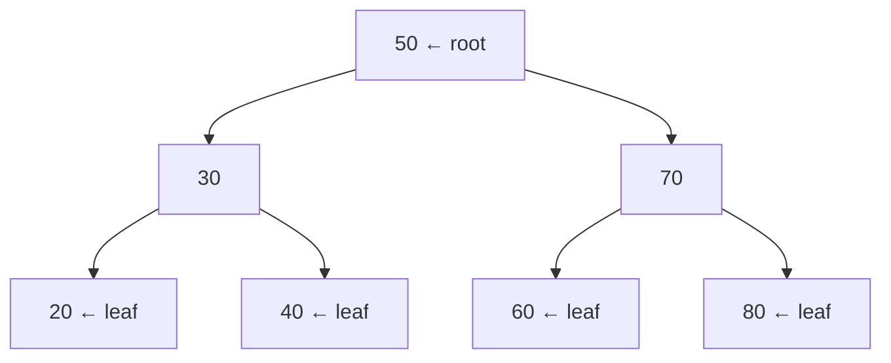
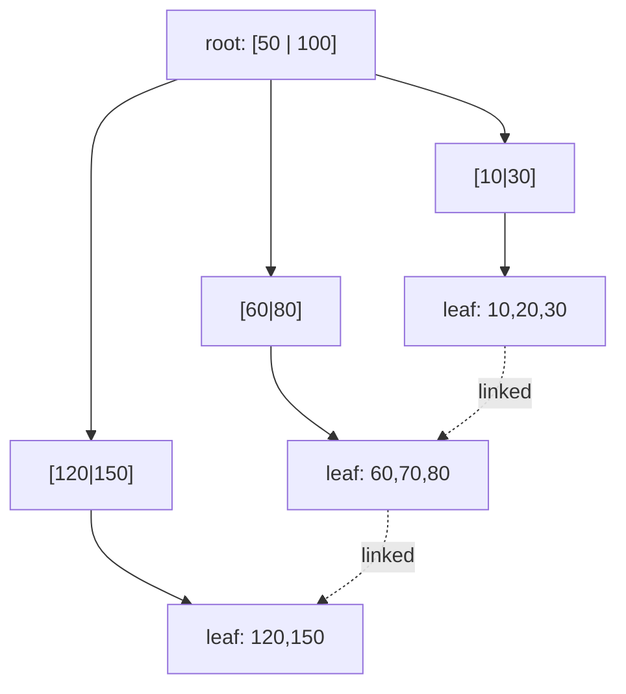

# Chapter 21 · Trees

[简体中文](./21-tree.md) ｜ **English**

---

> The hash table from the previous chapter is astonishingly fast, but it has one fatal weakness: **order is completely discarded**. You cannot ask it "who scored above 80," "sort these by name," or "which value is closest to 90."
>
> Is there a structure that is both fast to search and keeps things ordered? The answer is to organize data into a **hierarchy** — each comparison eliminates half the data, and since `log₂(1000000) ≈ 20`, a million records need only twenty comparisons.
>
> But a trap hides here: **if you insert data in sorted order, the tree degenerates into a linked list**. In measurements, inserting 2,000 random numbers produced a tree of height **24–27**, while inserting them in sorted order produced a height of **2000** — performance collapsing from O(log n) to O(n). Understanding this degeneration is what lets you truly understand why balanced trees exist, and why every database in the world uses B+ trees.

## 1. Learning Objectives

By the end of this chapter, you will be able to:

- Explain the basic terminology of trees and why they naturally express **hierarchical relationships**;
- Explain how a **binary search tree** achieves O(log n) by "halving each time," and why **in-order traversal yields a sorted sequence**;
- Demonstrate **BST degeneration** and explain how **balanced trees** (AVL / red-black) solve it;
- Explain **why database indexes use B+ trees rather than binary trees** (hint: disk I/O);
- Choose correctly between a **hash table and an ordered tree**.

---

## 2. Why This Concept Exists

Trees solve two entirely different problems.

**① Expressing hierarchy** — the real world is full of hierarchies:

```text
File system:   / → home → user → docs → file.txt
DOM tree:      html → body → div → p
Org chart:     CEO → Director → Manager → Employee
Categories:    Electronics → Phones → Smartphones
```

Arrays and hash tables are "flat" — they cannot express parent-child relationships.

**② Combining fast lookup with order** — this is the technical focus of the chapter. Recall the structures so far:

| Structure | Lookup | Ordered | Range query |
|-----------|:------:|:-------:|:-----------:|
| Array (unsorted) | O(n) | ❌ | ❌ |
| Array (sorted) | O(log n) binary search | ✅ | ✅ |
| Hash table | **O(1)** | ❌ | ❌ |
| **Tree** | **O(log n)** | ✅ | ✅ |

**A sorted array already supports binary search — so why do we need trees?** Because of **insertion**. To stay sorted, an array must shift elements on every insert — O(n). A tree inserts in O(log n).

> **In one sentence**: a tree trades O(log n) lookup for having **both order and efficient insertion**.

---

## 3. How It Works

### Basic terminology



| Term | Meaning |
|------|---------|
| **Root** | The topmost node, with no parent |
| **Leaf** | A node with no children |
| **Depth** | Number of edges from the root to this node |
| **Height** | Number of edges from this node to its deepest leaf; **height determines worst-case lookup cost** |

### Binary search trees: halving each time

A **binary search tree (BST)** has just one rule: **everything in the left subtree < the current node < everything in the right subtree**.

This rule produces two important consequences:

**① Lookup becomes a guessing game** — each comparison eliminates half:

```text
Find 40:  start at 50 → 40 < 50, look left only (entire right subtree eliminated)
          reach 30    → 40 > 30, look right only
          reach 40    → found!

With a million nodes, ideally only log₂(1000000) ≈ 20 comparisons
```

**② In-order traversal automatically yields a sorted sequence** — this is the defining property of a BST. Measured:

```text
Insertion order: [50, 30, 70, 20, 40, 60, 80]
In-order:        [20, 30, 40, 50, 60, 70, 80]   ← automatically sorted!
```

**In-order = left → root → right**. Because "everything on the left is smaller and everything on the right is larger," walking in this order necessarily produces sorted output.

### ⚠️ The fatal weakness: BSTs degenerate

The O(log n) of a BST has a **precondition: the tree is balanced**. If you **insert in sorted order**, every new node hangs off the right side and the tree becomes a chain:

```text
Inserting 1,2,3,4,5 in order:

1
 \
  2
   \
    3
     \
      4
       \
        5          ← this is a linked list; lookup degrades to O(n)
```

**Measured** (inserting 2,000 numbers):

| Insertion order | Tree height | Ideal |
|-----------------|:-----------:|:-----:|
| Random | **24–27** | log₂(2000) ≈ 11 |
| **Sorted** | **2000** | ← fully degenerated! |

> Random insertion yields a height roughly 2–3× the ideal (the expected height of a random BST, varying with the seed) — still O(log n) in scale; sorted insertion turns it straight into O(n).

> ⚠️ **This is a real trap**: data is often naturally sorted (auto-increment IDs, timestamps, pre-sorted import files). Storing such data in a naive BST makes performance collapse outright.

### Balanced trees: keeping the tree short automatically

The solution is: **after each insert/delete, check for imbalance and use "rotations" to straighten the tree back out**.

| Balanced tree | Balance condition | Character |
|---------------|-------------------|-----------|
| **AVL tree** | Subtree heights differ by ≤ 1 | Strictest → fastest lookups, but frequent rotations |
| **Red-black tree** | Coloring rules keep the longest path ≤ 2× the shortest | Looser → faster insert/delete, **most widely used** |

**Red-black trees are the industry default**: Java's `TreeMap`, C++'s `std::map`, C#'s `SortedDictionary`, and Java 8+ `HashMap`'s treeified bins all use one. It sacrifices a bit of lookup speed for fewer rotations — **a better bargain in real workloads with frequent inserts and deletes**.

### B-trees / B+ trees: built for disk

This is the most valuable section of the chapter. **Why don't databases use binary trees instead of B+ trees?**

The key is that **disk I/O is roughly a hundred thousand times slower than memory access**. So for a database, **reducing the number of I/O operations** matters far more than reducing comparisons — and each level of the tree typically means one I/O.

Hence the idea: **flatten the tree**. A binary tree gives each node 2 branches; a B-tree lets a single node hold **hundreds of keys**:

```text
One hundred million records:
  Binary tree height = log₂(100,000,000) ≈ 27 levels  → about 27 disk I/Os
  B+ tree (order 500) = log₅₀₀(100,000,000) ≈ 3 levels  → only 3 I/Os!
```

**B+ trees add two key improvements over B-trees**:



1. **Data lives only in leaf nodes** (internal nodes hold index keys only) → each node fits more keys → shorter tree;
2. **All leaves are chained in a linked list** → **range queries are extremely fast** (find the start, then scan along the chain without returning to the root).

> **This is why `WHERE score BETWEEN 80 AND 95` is fast**: the B+ tree locates 80, then scans the leaf chain through to 95 — something a hash index simply cannot do.

### Heaps: another kind of tree

A **heap** is a **complete binary tree** with one simple rule: **a parent is always ≤ (or ≥) its children**.

- It is **not** sorted (in-order traversal does not produce a sorted sequence);
- But it guarantees **the root is always the minimum (or maximum)** → O(1) access to the extreme;
- Insert and delete are both O(log n).

This is exactly how a **priority queue** (Chapter 19) is implemented. And it is typically **stored in an array** — because a complete binary tree lets you compute parent-child relationships directly from indices, making it cache-friendly:

```text
For node i: left child = 2i+1, right child = 2i+2, parent = (i-1)/2
```

### The four traversals

| Traversal | Order | Use |
|-----------|-------|-----|
| **Pre-order** | root → left → right | Copying a tree, serialization |
| **In-order** | left → root → right | **Sorted sequence from a BST** |
| **Post-order** | left → right → root | Deleting a tree, computing directory sizes |
| **Level-order** | level by level, left to right | **Implemented with a queue** (BFS, Chapter 19) |

---

## 4. JavaScript

**JavaScript's standard library has no tree structure** — there is no `TreeMap`, and `Map` is a hash table (it preserves insertion order, but does not sort).

**Common approaches when you need order**:

```javascript
// ① Need sorted output: Map + sort (good for read-heavy workloads)
const map = new Map([["zebra", 1], ["apple", 2]]);
const sorted = [...map.entries()].sort((a, b) => a[0].localeCompare(b[0]));

// ② Need frequent range queries: sorted array + binary search
function binarySearch(arr, target) {
  let lo = 0, hi = arr.length - 1;
  while (lo <= hi) {
    const mid = (lo + hi) >> 1;
    if (arr[mid] === target) return mid;
    arr[mid] < target ? (lo = mid + 1) : (hi = mid - 1);
  }
  return -1;
}
```

**Writing a BST by hand** (the core exercise of this chapter):

```javascript
class BST {
  constructor() { this.root = null; }
  insert(v) {
    const node = { v, left: null, right: null };
    if (!this.root) { this.root = node; return; }
    let cur = this.root;
    while (true) {
      if (v < cur.v) {
        if (!cur.left) { cur.left = node; return; }
        cur = cur.left;
      } else {
        if (!cur.right) { cur.right = node; return; }
        cur = cur.right;
      }
    }
  }
  inorder(node = this.root, out = []) {      // in-order traversal → sorted
    if (node) { this.inorder(node.left, out); out.push(node.v); this.inorder(node.right, out); }
    return out;
  }
}
```

**But the tree that is truly everywhere in JavaScript is the DOM**:

```javascript
document.querySelector("div").children;    // child nodes
element.parentNode;                         // parent node
```

> **Note**: when the JavaScript ecosystem needs an ordered map, it usually reaches for a third-party library (such as `sorted-btree`) or "array + binary search." Do not implement your own red-black tree — it is notoriously hard to get right.

---

## 5. Python

**Python's standard library also lacks a built-in balanced tree**, but offers two excellent alternatives:

**① The `bisect` module** — binary search and insertion on a **sorted list**:

```python
import bisect

sorted_scores = [60, 75, 88, 92]
bisect.insort(sorted_scores, 80)         # insert while keeping order
print(sorted_scores)                      # [60, 75, 80, 88, 92]
print(bisect.bisect_left(sorted_scores, 80))   # 2 ← find position: O(log n)
```

> **Note**: `bisect` **searches in O(log n), but insertion is still O(n)** (elements must be shifted). Good for read-heavy workloads.

**② `heapq`** — a heap (covered in Chapter 19), O(1) access to the extreme:

```python
import heapq
h = [5, 1, 3]
heapq.heapify(h)          # build heap, O(n)
heapq.heappop(h)          # 1 ← minimum
```

**Writing a BST and verifying in-order ordering**:

```python
class Node:
    def __init__(self, v): self.v, self.left, self.right = v, None, None

def insert(root, v):
    if root is None: return Node(v)
    if v < root.v: root.left = insert(root.left, v)
    else: root.right = insert(root.right, v)
    return root

def inorder(node, out=None):
    if out is None: out = []
    if node:
        inorder(node.left, out); out.append(node.v); inorder(node.right, out)
    return out
```

**Trees are everywhere in Python**: `os.walk()` traverses the directory tree, the `ast` module produces syntax trees (Chapter 03), and XML/JSON are nested structures.

> **Note**: when you need a genuine balanced tree, use the third-party `sortedcontainers` library (pure Python but excellent performance, and very widely used).

---

## 6. Java

**Java has the most complete tree support** — `TreeMap` and `TreeSet` are both backed by **red-black trees**:

```java
TreeMap<String, Integer> scores = new TreeMap<>();
scores.put("zebra", 1);
scores.put("apple", 2);
System.out.println(scores.keySet());   // [apple, zebra] ← automatically sorted by key
```

**What `TreeMap` can do that a hash table cannot** (measured):

```java
TreeMap<Integer, Integer> tm = new TreeMap<>();
// ... insert 0..199999
tm.firstKey();                  // 0      ← smallest key
tm.lastKey();                   // 199999 ← largest key
tm.subMap(100, 105).keySet();   // [100, 101, 102, 103, 104] ← range query
tm.floorKey(99999);             // 99999  ← largest key ≤ the given value
tm.ceilingKey(50);              // 50     ← smallest key ≥ the given value
```

**The performance cost** (measured, 200,000 inserts + lookups, after JIT warm-up, three runs):

| Implementation | Time |
|----------------|------|
| `HashMap` | **6–11 ms** |
| `TreeMap` | 31–49 ms |

**Hashing is about 4–5× faster** — that is the price of order. (This ratio varies enormously across languages; see the conditions table in Section 12.)

**`PriorityQueue` is a heap** (Chapter 19):

```java
PriorityQueue<Integer> pq = new PriorityQueue<>();   // a binary heap, array-backed
```

> **Note**: `TreeMap` requires keys to implement `Comparable`, or a `Comparator` at construction. **It decides equality with `compareTo`, not `equals`** — this differs from `HashMap` and is an easily overlooked distinction.

---

## 7. C++

**C++ container names expose their underlying structure directly** (echoing Chapter 20):

```cpp
#include <map>
#include <set>

std::map<std::string, int> treeMap;        // red-black tree, ordered, O(log n)
std::set<int> treeSet;                      // red-black tree set
std::unordered_map<std::string, int> hash;  // hash table, unordered, O(1)
```

**The ordered capabilities of `std::map`**:

```cpp
std::map<int, std::string> m{{10,"a"},{20,"b"},{30,"c"}};
m.begin()->first;                    // 10 ← smallest key
m.rbegin()->first;                   // 30 ← largest key
m.lower_bound(15);                   // points to 20 (first key >= 15)
m.upper_bound(20);                   // points to 30 (first key > 20)
for (auto& [k,v] : m) { }            // iteration is automatically ordered
```

**Range queries**:

```cpp
auto begin = m.lower_bound(10), end = m.upper_bound(25);
for (auto it = begin; it != end; ++it) { /* handle the [10, 25] range */ }
```

**Heap operations live in `<algorithm>`** (not a container, but algorithms operating on arrays):

```cpp
#include <algorithm>
std::vector<int> v{3,1,4,1,5};
std::make_heap(v.begin(), v.end());   // build the heap
std::push_heap(...); std::pop_heap(...);
```

> **Note**: `std::map` and `std::unordered_map` have nearly identical interfaces, so **swapping one word switches the implementation** — which makes "start ordered, switch to hashing when you find a bottleneck" very easy. But note that `map` iterators remain valid after inserts and deletes (a red-black tree does not move nodes), while `unordered_map` iterators are invalidated by a rehash.

---

## 8. C#

**`SortedDictionary` and `SortedList` represent two different trade-offs** — a detail unique to C#:

```csharp
var tree = new SortedDictionary<string, int>();   // red-black tree
var list = new SortedList<string, int>();          // sorted array (two parallel arrays)
```

| | `SortedDictionary` | `SortedList` |
|---|---|---|
| Backing store | Red-black tree | Sorted array |
| Insert/delete | **O(log n)** | O(n) (shifting) |
| Access by index | ❌ | ✅ **O(1)** |
| Memory | More (node pointers) | **Less** (compact) |
| Best for | Frequent modification | Build once, query often |

```csharp
var scores = new SortedDictionary<string, int> { ["zebra"] = 1, ["apple"] = 2 };
foreach (var kv in scores) Console.WriteLine(kv.Key);   // apple, zebra ← automatically sorted
```

**.NET 6+'s `PriorityQueue` is a heap** (Chapter 19).

**LINQ offers convenient sorting** (but it is O(n log n) every time):

```csharp
var sorted = dict.OrderBy(kv => kv.Key);    // fine for occasional sorting, not for frequent queries
```

> **Note**: if you only "build once and then read," **`SortedList` is often better than `SortedDictionary`** — less memory, more cache-friendly, and it supports access by index.

---

## 9. SQL

**This section is the centerpiece of the chapter**: a database index *is* a tree, and understanding it will directly improve your SQL.

### ① B+ tree indexes: why this structure

```sql
CREATE INDEX idx_score ON student(score);   -- creates a B+ tree index by default
```

**Why not a binary tree?** Because disk I/O is a hundred thousand times slower, and **each level of the tree ≈ one I/O**:

| Structure | Height for 100M rows | Disk I/Os |
|-----------|:--------------------:|:---------:|
| Binary tree | ≈ 27 levels | about 27 |
| **B+ tree (order ≈ 500)** | **≈ 3 levels** | **about 3** |

**Why not a hash?** Because hashing discards order (Chapter 20) and cannot answer range queries.

### ② Which queries a B+ tree accelerates

```sql
-- ✅ Can use the index
SELECT * FROM student WHERE score = 92;              -- equality
SELECT * FROM student WHERE score BETWEEN 80 AND 95; -- range (scan the leaf chain)
SELECT * FROM student ORDER BY score;                -- sorting (the index is already ordered)
SELECT MIN(score), MAX(score) FROM student;          -- extremes (leftmost/rightmost leaf)
SELECT * FROM student WHERE name LIKE 'A%';          -- prefix match
```

```sql
-- ❌ Cannot use the index
SELECT * FROM student WHERE score + 10 > 100;        -- arithmetic on the column
SELECT * FROM student WHERE ABS(score) = 92;         -- function on the column
SELECT * FROM student WHERE name LIKE '%son';        -- leading wildcard
```

> **The root cause of index invalidation**: a B+ tree is sorted by the **raw values of the column**. The moment you apply arithmetic or a function to that column, **the ordering relationship is destroyed**, and the database can only do a full table scan.
>
> **The fix**: move the arithmetic to the constant side — `WHERE score > 90` rather than `WHERE score + 10 > 100`.

### ③ Composite indexes and the leftmost-prefix rule

```sql
CREATE INDEX idx_class_score ON student(class, score);   -- sorted by class, then by score within each class
```

```sql
-- ✅ Usable
WHERE class = 'A'                       -- uses the first column
WHERE class = 'A' AND score > 80        -- uses both columns

-- ❌ Not usable (skips the first column)
WHERE score > 80                        -- second column only
```

**This is the leftmost-prefix principle**: a composite index is like a phone book sorted by last name then first name — you can quickly find "everyone named Smith," but not "everyone whose first name is John."

### ④ Recursive queries: storing tree-shaped data

Databases also need to store hierarchies (org charts, comment threads). The classic approach is an **adjacency list plus a recursive CTE** (Chapter 11):

```sql
CREATE TABLE emp (id INTEGER, name TEXT, boss INTEGER);   -- boss points to the parent

WITH RECURSIVE tree(id, name, level) AS (
    SELECT id, name, 0 FROM emp WHERE boss IS NULL         -- root nodes
    UNION ALL
    SELECT e.id, e.name, t.level + 1                        -- descend level by level
    FROM emp e JOIN tree t ON e.boss = t.id
)
SELECT level, name FROM tree ORDER BY level;
```

> **Practical tip**: in an execution plan, `Index Scan` means the index was used, while `Seq Scan` (full table scan) means it was not — `EXPLAIN` is the tool for verifying every rule above.

---

## 10. Cross-Language Comparison

### ① Ordered structures

| Feature | JavaScript | Python | Java | C++ | C# |
|---------|-----------|--------|------|-----|-----|
| Built-in balanced tree | ❌ | ❌ | ✅ `TreeMap` | ✅ `std::map` | ✅ `SortedDictionary` |
| Backing structure | — | — | Red-black tree | Red-black tree | Red-black tree |
| Alternative | Array+binary search / library | `bisect` / `sortedcontainers` | — | — | `SortedList` (sorted array) |
| Heap / priority queue | ❌ roll your own | `heapq` | `PriorityQueue` | `priority_queue` | `PriorityQueue` |
| Range query | Manual | `bisect` | `subMap` | `lower_bound` | Manual / LINQ |
| Nearest-key lookup | Manual | `bisect` | `floorKey`/`ceilingKey` | `lower_bound` | Manual |

### ② Hash vs. tree: how to choose

| Requirement | Choose hash | Choose tree |
|-------------|:-----------:|:-----------:|
| Equality lookup by key only | ✅ **O(1)** | O(log n) |
| Ordered iteration | ❌ | ✅ |
| Range queries (>, BETWEEN) | ❌ | ✅ |
| Min / max / nearest | ❌ | ✅ |
| Absolute lookup speed | ✅ | — |
| Worst-case guarantee | ❌ O(n) | ✅ **O(log n)** |

**Measured cost**: hashing really is faster, but **how much faster depends entirely on the implementation** — measured anywhere from about 3× to about 25× (see the conditions table in Section 12).

> **Decision rule**: **default to hashing; use a tree only when you need order.** But note the tree has one extra advantage — its O(log n) is a **worst-case guarantee**, unlike hashing, which can degrade to O(n) in extreme cases (Chapter 20).

### ③ Commonalities and the roots of the differences

**In common**: every language's ordered map is backed by a red-black tree, offers O(log n) insert/delete/lookup, and yields a sorted sequence via in-order traversal.

**Roots of the differences**:
- **JavaScript and Python have no built-in balanced tree** — their design philosophy favors a small set of well-chosen built-in types, leaving ordering to libraries or "array + binary search";
- **C# alone provides `SortedList`** — recognizing that "build once, query often" is a common scenario worth a more memory-efficient sorted-array implementation;
- **C++ exposes the implementation in the container name** (`map` vs. `unordered_map`), so the complexity is visible at a glance.

---

## 11. Implementation Comparison

| Language · Implementation | Structure | Key design point |
|---------------------------|-----------|------------------|
| **Java · TreeMap** | Red-black tree | Equality via `compareTo`/`Comparator` (**not `equals`**) |
| **Java · HashMap treeified bin** | Red-black tree | Converts when a chain exceeds 8 and the table has ≥ 64 bins (Chapter 20) |
| **C++ · std::map** | Red-black tree | Iterators **stay valid** across inserts/deletes (nodes are not moved) |
| **C# · SortedDictionary** | Red-black tree | O(log n) insert/delete |
| **C# · SortedList** | **Two parallel arrays** (keys, values) | O(log n) lookup, O(n) insert, but compact and indexable |
| **Python · heapq** | **Complete binary tree in an array** | Parent-child by index: left `2i+1`, right `2i+2` |
| **Database · B+ tree** | Multi-way balanced tree | Data only in leaves; leaves chained for range queries |

**One implementation detail worth remembering**: **heaps are stored in arrays**. Because the shape of a complete binary tree is fixed, parent-child relationships can be computed directly from indices — **no pointers needed at all**. This saves memory and is cache-friendly, a classic case of "replacing pointers with arithmetic" (echoing the address formula in Chapter 16).

---

## 12. Performance Analysis

### Complexity comparison

| Operation | Balanced tree | Hash table | Sorted array | Unsorted array |
|-----------|:-------------:|:----------:|:------------:|:--------------:|
| Lookup | O(log n) | **O(1)** | O(log n) | O(n) |
| Insert | **O(log n)** | O(1) | O(n) | O(1) |
| Delete | **O(log n)** | O(1) | O(n) | O(n) |
| Range query | **O(log n + k)** | ❌ | O(log n + k) | O(n) |
| Min / max | **O(log n)** | O(n) | **O(1)** | O(n) |
| Ordered iteration | **O(n)** | needs sort, O(n log n) | O(n) | needs sort |
| **Worst case** | **O(log n)** ✅ | O(n) ⚠️ | O(n) | O(n) |

### Measured results

**① BST degeneration** (inserting 2,000 numbers):

| Insertion order | Tree height |
|-----------------|:-----------:|
| Random | 24–27 |
| **Sorted** | **2000** |

**This is the entire justification for balanced trees.**

**② The cost of order — the ratio depends heavily on the implementation**

This point deserves its own emphasis. For the identical workload (200,000 inserts + lookups, keys 0–199999), the measured results differ enormously by language:

| Language · Environment | Hash table | Ordered tree | Tree slower by |
|------------------------|:----------:|:------------:|:--------------:|
| C++ (`-O2`, `unordered_map` vs. `map`) | 3–9 ms | 17–24 ms | **about 3–5×** |
| Java (after JIT warm-up, `HashMap` vs. `TreeMap`) | 6–11 ms | 31–49 ms | **about 4–5×** |
| C# (`Dictionary` vs. `SortedDictionary`) | 4–9 ms | 187–222 ms | **about 20–30×** |

**Same algorithm, same data size — and the ratio ranges from 3× to 30×, a full order of magnitude apart.**

The gap comes mainly from **the implementation quality of each language's ordered container**, not from the algorithm. On this machine, .NET's `SortedDictionary` is markedly slower than Java's and C++'s red-black trees.

> **A hypothesis that was falsified**: I initially assumed C# was slow because "the keys are strictly increasing, forcing constant red-black rotations." A controlled experiment refuted it — **sorted keys 200 ms vs. random keys 215 ms, essentially no difference**. So the cause lies in the implementation, not the key order.
>
> I will not speculate further about the specific cause, because **an explanation with no measurement behind it is fabrication**.

> ⚠️ **Remember the principle, not the number**: the algorithmic conclusion is stable — **hashing's O(1) beats a tree's O(log n), and the tree buys you ordering**. But measure the actual ratio in your own environment at your own data scale; do not copy any number from this book.

**③ Tree height vs. I/O** (database scenario):

| Structure | Height for 100M rows |
|-----------|:--------------------:|
| Binary tree | ≈ 27 |
| B+ tree (order 500) | **≈ 3** |

---

## 13. Engineering Practice

| Scenario | ✅ Recommended | ❌ Not recommended | Why |
|----------|---------------|-------------------|-----|
| Key lookup only | Hash table | Tree | O(1) is faster |
| Need sorting / range queries | Ordered tree | Hash + sort each time | Hashing discards order |
| Build once, query often | C# `SortedList` / sorted array | Balanced tree | Less memory, cache-friendly |
| Frequent extreme-value access | **Heap** | Sorting every time | O(log n) vs. O(n log n) |
| Implementing a BST | **Don't write your own balanced tree** | Hand-rolled red-black tree | Extremely error-prone; use the stdlib |
| Data may arrive sorted | Stdlib balanced tree | Naive BST | Sorted insertion degenerates |
| Database queries | Keep indexed columns "bare" | Arithmetic/functions on indexed columns | Invalidates the index |
| Composite indexes | Honor the leftmost prefix | Query skipping the first column | The index cannot be used |
| Tree data in a database | Adjacency list + recursive CTE | Recursing in application code | Avoids N+1 (Chapter 11) |

**You use trees in more places than you might think**:

```text
File systems, the DOM, JSON/XML parsing, compiler ASTs (Chapter 03),
database indexes, priority queues (Chapter 19), decision trees, routing tables,
Git object trees, treeified HashMap bins (Chapter 20)...
```

---

## 14. Best Practices

- **Prefer the standard library's balanced tree**; do not hand-roll a red-black tree — it is notoriously hard to get right.
- **Default to hashing and use a tree only when you need order**; the cost depends on the implementation (measured 3–30×), so **measure in your own environment before shipping**.
- **Beware of sorted data**: storing auto-increment IDs in a naive BST degenerates immediately.
- **Keep indexed columns out of expressions**: `WHERE col > 100`, not `WHERE col + 10 > 110`.
- **Honor the leftmost prefix** in composite indexes, and put the most selective column first.
- **Use a heap when you need extremes frequently**, rather than sorting the whole collection.
- **Watch recursion depth when traversing trees** (Chapter 12) — very deep trees need an explicit stack (Chapter 18).

---

## 15. Common Pitfalls

**Pitfall 1 · Storing sorted data in a naive BST**

```python
for i in range(10000): insert(root, i)   # ✗ height 10000, degenerated into a list
```
**How to avoid**: use the standard library's balanced tree (`TreeMap` / `std::map`).

**Pitfall 2 · `TreeMap` uses `compareTo`, not `equals`**

```java
TreeMap<Student, Integer> tm = new TreeMap<>(Comparator.comparing(Student::getAge));
// ⚠️ Two students with the same age but different names are treated as the same key!
```
**How to avoid**: make the `Comparator` cover every distinguishing field.

**Pitfall 3 · Recursive traversal of deep trees overflows the stack**

```python
def inorder(node):
    if node: inorder(node.left); ...      # RecursionError once height reaches thousands
```
**How to avoid**: switch to an iterative version with an explicit stack (Chapter 18).

**Pitfall 4 · Arithmetic on an indexed column invalidates the index**

```sql
WHERE YEAR(created) = 2026        -- ✗ index unusable, full table scan
WHERE created >= '2026-01-01' AND created < '2027-01-01'   -- ✓ uses the index
```

**Pitfall 5 · Violating the leftmost prefix of a composite index**

```sql
CREATE INDEX idx ON t(a, b);
WHERE b = 1                       -- ✗ index unusable
WHERE a = 1 AND b = 1             -- ✓
```

**Pitfall 6 · Assuming a heap is sorted**

```python
import heapq
h = [5,1,3]; heapq.heapify(h)
print(h)          # [1, 5, 3] ← not a sorted array! only the root is guaranteed minimal
```
**How to avoid**: a heap only guarantees **the root is the extreme**; for full order you must `heappop` repeatedly.

**Pitfall 7 · Expecting a built-in ordered map in JavaScript/Python**

```javascript
new Map()      // ⚠️ a hash table: preserves "insertion order," not "key order"
```
**How to avoid**: use "array + binary search" or a third-party library (`sortedcontainers` / `sorted-btree`).

---

## 16. Interview Questions

**Basic**

1. What is a binary search tree? Why is its lookup O(log n)?
2. What are the four tree traversals? What does in-order traversal of a BST produce?
3. What scenarios suit a tree, and which suit a hash table?

**Intermediate**

4. Under what conditions does a BST degenerate? What is the resulting complexity, and how do you avoid it?
5. What is the difference between an AVL tree and a red-black tree? Why does industry prefer red-black trees?
6. What kind of structure is a heap? Why can it be stored in an array?

**Advanced**

7. **Why do database indexes use B+ trees rather than binary trees or hashes?** (Hint: disk I/O, range queries.)
8. What is the difference between a B-tree and a B+ tree? What does each of the B+ tree's two improvements buy you?
9. In what situations does a database index become unusable? Explain why from B+ tree principles.

---

## 17. Exercises

**Basic**

1. Write a BST by hand supporting insert and lookup, and verify ordering via in-order traversal.
2. Implement all four traversals (pre-order, in-order, post-order, level-order).
3. In all six languages, use an ordered map (or an alternative) to print students sorted by score.

**Intermediate**

4. Measure the tree-height difference between random and sorted insertion in a BST, verifying the degeneration.
5. Implement a binary heap in an array, supporting insert and extract-min.
6. Compare `HashMap` and `TreeMap` on insertion, lookup, and range query.

**Advanced**

7. Implement an AVL tree (all four rotations) and verify that inserting sorted data still yields O(log n) height.
8. Use `EXPLAIN` to observe the execution plan before and after applying arithmetic to an indexed column, verifying index invalidation.
9. Implement a simplified B-tree (order 4) to understand why it suits disk storage better than a binary tree.

---

## 18. Chapter Summary

**In one sentence**: trees use **hierarchy** to solve two problems at once — expressing parent-child relationships, and achieving O(log n) lookup and insertion **while preserving order**; but a naive BST degenerates into a linked list under sorted insertion (measured height went from about 25 to 2000), which is why industry universally uses **balanced trees** (red-black), and why databases use **B+ trees** to flatten the tree and minimize disk I/O.

**Key points**

- **The BST rule**: smaller left, larger right → halve each time → O(log n); **in-order traversal automatically yields a sorted sequence**.
- **Degeneration is a real trap**: sorted insertion took height from about 25 to 2000, collapsing O(log n) into O(n).
- **Red-black trees are the industry standard**: `TreeMap`, `std::map`, and `SortedDictionary` all use one.
- **B+ trees are built for disk**: for 100M rows, a binary tree is 27 levels vs. 3 for a B+ tree; the leaf chain makes range queries fast.
- **Heaps live in arrays**: parent-child by arithmetic on indices, no pointers — "arithmetic instead of pointers."
- **Hash vs. tree**: hashing is faster (measured 3–30×, heavily implementation-dependent); a tree buys order, ranges, and a worst-case guarantee.

**Checklist**

- [ ] I can explain why a BST is O(log n) and what in-order traversal yields.
- [ ] I can state the conditions under which a BST degenerates and how balanced trees fix it.
- [ ] I can explain why databases use B+ trees rather than binary trees or hashes.
- [ ] I know when to reach for a hash table and when for an ordered tree.
- [ ] I can name at least three SQL patterns that make an index unusable.

**Coming next**: a tree expresses "hierarchy" — every node has exactly one parent. But real-world relationships are often messier: people follow each other on social networks, cities connect in every direction on a map, and dependencies can form cycles. When "parent and child" becomes "any connection at all," a tree becomes — Chapter 22, "Graphs," the closing chapter of Part 3.

---

## 19. Further Reading

- <a href="https://en.wikipedia.org/wiki/Tree_(abstract_data_type)" target="_blank" rel="noopener">Wikipedia: Tree (abstract data type)</a> — terminology, properties, and applications.
- <a href="https://en.wikipedia.org/wiki/Binary_search_tree" target="_blank" rel="noopener">Wikipedia: Binary search tree</a> — definition, operations, and degeneration analysis.
- <a href="https://en.wikipedia.org/wiki/Red%E2%80%93black_tree" target="_blank" rel="noopener">Wikipedia: Red-black tree</a> — the industry's most widely used balanced tree.
- <a href="https://en.wikipedia.org/wiki/B-tree" target="_blank" rel="noopener">Wikipedia: B-tree</a> — the foundation of database and filesystem indexes.
- <a href="https://en.wikipedia.org/wiki/Binary_heap" target="_blank" rel="noopener">Wikipedia: Binary heap</a> — the structure behind priority queues.
- <a href="https://docs.oracle.com/en/java/javase/21/docs/api/java.base/java/util/TreeMap.html" target="_blank" rel="noopener">Java docs · TreeMap</a> — including `subMap`, `floorKey`, and other ordered operations.
- <a href="https://en.cppreference.com/w/cpp/container/map" target="_blank" rel="noopener">cppreference · std::map</a> — the red-black tree container and the `lower_bound` family.
