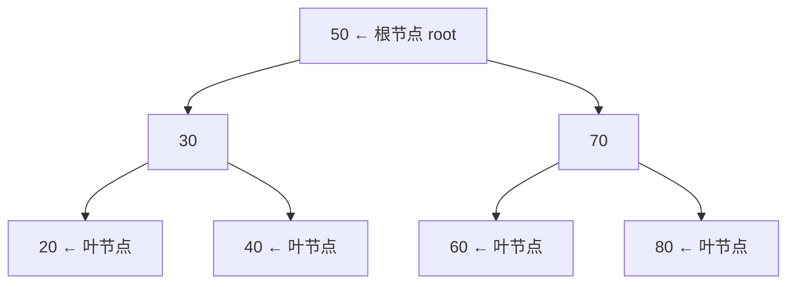
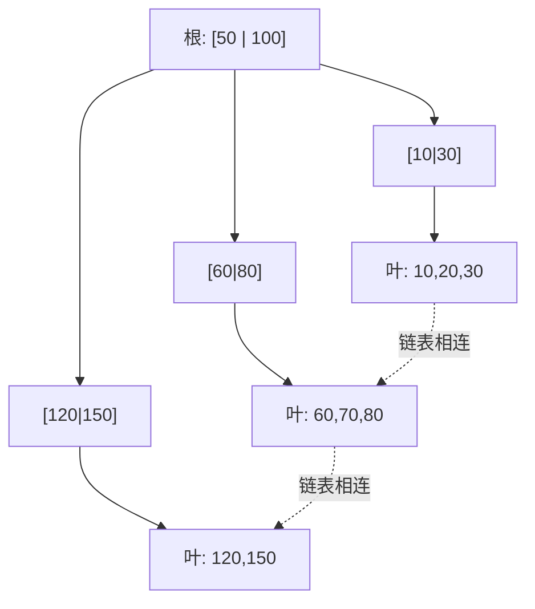

# 第 21 章 · 树

**简体中文** ｜ [English](./21-tree.en-US.md)

---

> 上一章的哈希表快得惊人，但它有个致命短板：**顺序被彻底丢掉了**。你没法问它"分数大于 80 的有谁""按名字排序""最接近 90 的是哪个"。
>
> 有没有一种结构，既能快速查找，又能保持有序？答案是把数据组织成**层级**——每次比较砍掉一半，`log₂(1000000) ≈ 20`，一百万条数据只要二十次比较。
>
> 但这里藏着一个陷阱：**如果你按顺序插入数据，这棵树会退化成一根链表**。实测中，随机插入 2000 个数树高只有 **24～27**，而有序插入的树高是 **2000**——性能从 O(log n) 崩塌成 O(n)。理解这个退化，你才能真正理解为什么会有"平衡树"，以及为什么全世界的数据库都用 B+ 树。

## 1. 学习目标

本章结束后，你将能够：

- 说清树的基本概念，以及它为什么天然适合表达**层级关系**；
- 解释**二叉搜索树**如何用"每次砍一半"实现 O(log n)，并说明**中序遍历得到有序序列**这一性质；
- 演示 **BST 的退化问题**，并说明**平衡树**（AVL / 红黑树）如何解决它；
- 解释**为什么数据库索引用 B+ 树而不是二叉树**（提示：磁盘 I/O）；
- 在**哈希表与有序树**之间做出正确选择。

---

## 2. 为什么会出现这个概念

树解决两类完全不同的问题。

**① 表达层级关系**——现实世界里到处是层级：

```text
文件系统:  / → home → user → docs → file.txt
DOM 树:    html → body → div → p
组织架构:  CEO → 总监 → 组长 → 员工
分类目录:  电子产品 → 手机 → 智能手机
```

数组和哈希都是"平的"，表达不了这种父子关系。

**② 兼顾"快速查找"与"有序"**——这是本章的技术重点。回顾前面的结构：

| 结构 | 查找 | 有序 | 范围查询 |
|------|:----:|:----:|:-------:|
| 数组（无序） | O(n) | ❌ | ❌ |
| 数组（有序） | O(log n) 二分 | ✅ | ✅ | 
| 哈希表 | **O(1)** | ❌ | ❌ |
| **树** | **O(log n)** | ✅ | ✅ |

**有序数组已经能二分查找了，为什么还要树？** 因为**插入**。有序数组要保持有序，每次插入都得搬移元素——O(n)。而树的插入是 O(log n)。

> **一句话**：树用 O(log n) 的查找，换来了**有序性**和**高效插入**的兼得。

---

## 3. 底层原理

### 基本概念



| 术语 | 含义 |
|------|------|
| **根（root）** | 最顶端、没有父节点的节点 |
| **叶（leaf）** | 没有子节点的节点 |
| **深度（depth）** | 从根到该节点的边数 |
| **高度（height）** | 从该节点到最深叶子的边数；**树高决定了查找的最坏代价** |

### 二叉搜索树：每次砍一半

**二叉搜索树**（BST）只有一条规则：**左子树的所有值 < 当前节点 < 右子树的所有值**。

这条规则带来了两个重要结果：

**① 查找变成"猜数字"游戏**——每次比较排除一半：

```text
找 40：  从 50 开始 → 40 < 50，只看左边（右边整棵砍掉）
        到 30      → 40 > 30，只看右边
        到 40      → 找到！

一百万个节点，理想情况只需 log₂(1000000) ≈ 20 次比较
```

**② 中序遍历自动得到有序序列**——这是 BST 的定义性质。实测：

```text
插入顺序: [50, 30, 70, 20, 40, 60, 80]
中序遍历: [20, 30, 40, 50, 60, 70, 80]   ← 自动有序！
```

**中序 = 左 → 根 → 右**。因为"左边都比我小、右边都比我大"，所以按这个顺序走出来必然有序。

### ⚠️ 致命弱点：BST 会退化

BST 的 O(log n) 有个**前提：树是平衡的**。而如果你**按顺序插入**，每个新节点都会挂到右边，树就变成了一根链条：

```text
有序插入 1,2,3,4,5：

1
 \
  2
   \
    3
     \
      4
       \
        5          ← 这已经是链表了，查找退化成 O(n)
```

**实测**（插入 2000 个数）：

| 插入方式 | 树高 | 理想值 |
|---------|:----:|:------:|
| 随机插入 | **24～27** | log₂(2000) ≈ 11 |
| **有序插入** | **2000** | ← 完全退化！ |

> 随机插入的树高约为理想值的 2～3 倍（这是随机 BST 的期望高度，随种子波动），仍是 O(log n) 量级；而有序插入直接变成 O(n)。

> ⚠️ **这是个真实的坑**：数据往往天然有序（自增 ID、时间戳、排好序的导入文件）。用朴素 BST 存这些数据，性能会直接崩塌。

### 平衡树：让树自己保持矮

解决办法是：**每次插入/删除后检查是否失衡，通过"旋转"把树掰回来**。

| 平衡树 | 平衡条件 | 特点 |
|--------|---------|------|
| **AVL 树** | 左右子树高度差 ≤ 1 | 最严格 → 查询最快，但旋转频繁 |
| **红黑树** | 通过染色规则保证最长路径 ≤ 最短路径的 2 倍 | 稍松 → 插入删除更快，**最常用** |

**红黑树是工业界的默认选择**：Java 的 `TreeMap`、C++ 的 `std::map`、C# 的 `SortedDictionary`、以及 Java 8+ `HashMap` 的树化桶，用的都是它。它牺牲一点查询速度，换取更少的旋转次数——**在插入删除频繁的真实场景里更划算**。

### B 树 / B+ 树：为磁盘而生

这是本章最有价值的一节。**数据库为什么不用二叉树，而用 B+ 树？**

关键在于**磁盘 I/O 比内存访问慢约十万倍**。所以对数据库来说，**减少 I/O 次数**远比减少比较次数重要。而树的每一层通常意味着一次 I/O。

于是思路变成：**把树压矮**。二叉树每个节点只有 2 个分支，B 树让一个节点存**几百个键**：

```text
一亿条数据：
  二叉树高度 = log₂(100,000,000) ≈ 27 层  → 约 27 次磁盘 I/O
  B+ 树(阶=500) = log₅₀₀(100,000,000) ≈ 3 层  → 只要 3 次 I/O！
```

**B+ 树相比 B 树还有两个关键改进**：



1. **数据只放在叶子节点**（内部节点只存索引键）→ 一个节点能装下更多键 → 树更矮；
2. **所有叶子用链表串起来** → **范围查询极快**（找到起点后顺着链表扫，不用回到根节点）。

> **这就是 `WHERE score BETWEEN 80 AND 95` 为什么快**：B+ 树先定位到 80，然后沿叶子链表一路扫到 95 —— 而哈希索引完全做不到这件事。

### 堆：另一种树

**堆**是一棵**完全二叉树**，规则很简单：**父节点总是 ≤（或 ≥）子节点**。

- 它**不是**有序的（中序遍历不会得到有序序列）；
- 但它保证**根节点永远是最小（或最大）值** → 取最值 O(1)；
- 插入和删除都是 O(log n)。

这正是**优先队列**（第 19 章）的底层实现。而且它通常**用数组存储**（完全二叉树可以直接用下标算出父子关系），所以缓存友好：

```text
节点 i 的左子 = 2i+1，右子 = 2i+2，父节点 = (i-1)/2
```

### 四种遍历

| 遍历 | 顺序 | 用途 |
|------|------|------|
| **前序** | 根 → 左 → 右 | 复制树、序列化 |
| **中序** | 左 → 根 → 右 | **BST 中得到有序序列** |
| **后序** | 左 → 右 → 根 | 删除树、计算目录大小 |
| **层序** | 逐层从左到右 | **用队列实现**（第 19 章的 BFS） |

---

## 4. JavaScript

**JavaScript 标准库没有树结构**——没有 `TreeMap`，`Map` 是哈希表（保持插入序，但不排序）。

**需要有序时的常见做法**：

```javascript
// ① 需要排序输出：Map + 排序（适合读多写少）
const map = new Map([["zebra", 1], ["apple", 2]]);
const sorted = [...map.entries()].sort((a, b) => a[0].localeCompare(b[0]));

// ② 需要频繁范围查询：用有序数组 + 二分查找
function binarySearch(arr, target) {
  let lo = 0, hi = arr.length - 1;
  while (lo <= hi) {
    const mid = (lo + hi) >> 1;
    if (arr[mid] === target) return mid;
    arr[mid] < target ? (lo = mid + 1) : (hi = mid - 1);
  }
  return -1;
}
```

**手写一棵 BST**（本章的核心练习）：

```javascript
class BST {
  constructor() { this.root = null; }
  insert(v) {
    const node = { v, left: null, right: null };
    if (!this.root) { this.root = node; return; }
    let cur = this.root;
    while (true) {
      if (v < cur.v) {
        if (!cur.left) { cur.left = node; return; }
        cur = cur.left;
      } else {
        if (!cur.right) { cur.right = node; return; }
        cur = cur.right;
      }
    }
  }
  inorder(node = this.root, out = []) {      // 中序遍历 → 有序
    if (node) { this.inorder(node.left, out); out.push(node.v); this.inorder(node.right, out); }
    return out;
  }
}
```

**但 JavaScript 里真正无处不在的树是 DOM**：

```javascript
document.querySelector("div").children;    // 子节点
element.parentNode;                         // 父节点
```

> **注意事项**：JavaScript 生态需要有序映射时，通常用第三方库（如 `sorted-btree`）或"数组+二分"。别自己实现红黑树——那是出了名难写对的。

---

## 5. Python

**Python 标准库也没有内置的平衡树**，但有两个优秀的替代方案：

**① `bisect` 模块**——在**有序列表**上做二分查找与插入：

```python
import bisect

sorted_scores = [60, 75, 88, 92]
bisect.insort(sorted_scores, 80)         # 插入并保持有序
print(sorted_scores)                      # [60, 75, 80, 88, 92]
print(bisect.bisect_left(sorted_scores, 80))   # 2 ← 找位置：O(log n)
```

> **注意**：`bisect` 的**查找是 O(log n)，但插入仍是 O(n)**（要搬移元素）。适合"读多写少"。

**② `heapq`**——堆（第 19 章讲过），取最值 O(1)：

```python
import heapq
h = [5, 1, 3]
heapq.heapify(h)          # 建堆 O(n)
heapq.heappop(h)          # 1 ← 最小值
```

**手写 BST 并验证中序有序**：

```python
class Node:
    def __init__(self, v): self.v, self.left, self.right = v, None, None

def insert(root, v):
    if root is None: return Node(v)
    if v < root.v: root.left = insert(root.left, v)
    else: root.right = insert(root.right, v)
    return root

def inorder(node, out=None):
    if out is None: out = []
    if node:
        inorder(node.left, out); out.append(node.v); inorder(node.right, out)
    return out
```

**Python 里的树无处不在**：`os.walk()` 遍历目录树、`ast` 模块解析出的语法树（第 03 章）、XML/JSON 的嵌套结构。

> **注意事项**：需要真正的平衡树时用第三方库 `sortedcontainers`（纯 Python 实现但性能优异，被广泛使用）。

---

## 6. Java

**Java 的树支持最完整**，`TreeMap` / `TreeSet` 底层都是**红黑树**：

```java
TreeMap<String, Integer> scores = new TreeMap<>();
scores.put("zebra", 1);
scores.put("apple", 2);
System.out.println(scores.keySet());   // [apple, zebra] ← 自动按键排序
```

**`TreeMap` 能做哈希做不到的事**（实测）：

```java
TreeMap<Integer, Integer> tm = new TreeMap<>();
// ... 放入 0..199999
tm.firstKey();                  // 0     ← 最小键
tm.lastKey();                   // 199999 ← 最大键
tm.subMap(100, 105).keySet();   // [100, 101, 102, 103, 104] ← 范围查询
tm.floorKey(99999);             // 99999  ← 小于等于给定值的最大键
tm.ceilingKey(50);              // 50     ← 大于等于给定值的最小键
```

**性能代价**（实测，20 万次插入+查找，JIT 预热后取三次）：

| 实现 | 耗时 |
|------|------|
| `HashMap` | **6～11 ms** |
| `TreeMap` | 31～49 ms |

**哈希快约 4～5 倍**——这就是"有序"的价格。（不同语言的这个倍数差别很大，见第 12 节的条件表。）

**`PriorityQueue` 是堆**（第 19 章）：

```java
PriorityQueue<Integer> pq = new PriorityQueue<>();   // 底层是二叉堆（数组实现）
```

> **注意事项**：`TreeMap` 要求键实现 `Comparable`，或在构造时提供 `Comparator`。**它用 `compareTo` 判断相等，而不是 `equals`**——这与 `HashMap` 不同，是个容易忽略的差异。

---

## 7. C++

**C++ 的容器命名直接体现了底层结构**（呼应第 20 章）：

```cpp
#include <map>
#include <set>

std::map<std::string, int> treeMap;        // 红黑树，有序，O(log n)
std::set<int> treeSet;                      // 红黑树集合
std::unordered_map<std::string, int> hash;  // 哈希表，无序，O(1)
```

**`std::map` 的有序能力**：

```cpp
std::map<int, std::string> m{{10,"a"},{20,"b"},{30,"c"}};
m.begin()->first;                    // 10 ← 最小键
m.rbegin()->first;                   // 30 ← 最大键
m.lower_bound(15);                   // 指向 20（第一个 >= 15 的）
m.upper_bound(20);                   // 指向 30（第一个 > 20 的）
for (auto& [k,v] : m) { }            // 遍历自动有序
```

**范围查询**：

```cpp
auto begin = m.lower_bound(10), end = m.upper_bound(25);
for (auto it = begin; it != end; ++it) { /* 处理 [10, 25] 区间 */ }
```

**堆操作在 `<algorithm>` 里**（不是容器，而是作用于数组的算法）：

```cpp
#include <algorithm>
std::vector<int> v{3,1,4,1,5};
std::make_heap(v.begin(), v.end());   // 建堆
std::push_heap(...); std::pop_heap(...);
```

> **注意事项**：`std::map` 与 `std::unordered_map` 的接口几乎一样，**换掉一个词就能切换实现**——这让"先用有序、发现瓶颈再换哈希"变得非常容易。但注意 `map` 的迭代器在插入删除后仍然有效（红黑树不搬移节点），而 `unordered_map` 在 rehash 后会失效。

---

## 8. C#

**`SortedDictionary` 与 `SortedList` 是两种不同的权衡**——这是 C# 特有的细节：

```csharp
var tree = new SortedDictionary<string, int>();   // 红黑树
var list = new SortedList<string, int>();          // 有序数组（两个并行数组）
```

| | `SortedDictionary` | `SortedList` |
|---|---|---|
| 底层 | 红黑树 | 有序数组 |
| 插入/删除 | **O(log n)** | O(n)（要搬移） |
| 按索引访问 | ❌ | ✅ **O(1)** |
| 内存 | 较多（节点指针） | **较少**（紧凑） |
| 适合 | 频繁增删 | 一次构建、多次查询 |

```csharp
var scores = new SortedDictionary<string, int> { ["zebra"] = 1, ["apple"] = 2 };
foreach (var kv in scores) Console.WriteLine(kv.Key);   // apple, zebra ← 自动排序
```

**.NET 6+ 的 `PriorityQueue` 是堆**（第 19 章）。

**LINQ 提供了便捷的排序**（但每次都是 O(n log n)）：

```csharp
var sorted = dict.OrderBy(kv => kv.Key);    // 适合偶尔排序，不适合频繁查询
```

> **注意事项**：如果只是"构建一次、之后只读"，**`SortedList` 往往比 `SortedDictionary` 更好**——更省内存、缓存更友好，还支持按索引访问。

---

## 9. SQL

**这一节是本章的重头戏**：数据库索引就是树，理解它能直接提升你的 SQL 水平。

### ① B+ 树索引：为什么是它

```sql
CREATE INDEX idx_score ON student(score);   -- 默认创建 B+ 树索引
```

**为什么不是二叉树？** 因为磁盘 I/O 慢十万倍，而**树的每一层≈一次 I/O**：

| 结构 | 一亿条数据的树高 | 磁盘 I/O 次数 |
|------|:---------------:|:------------:|
| 二叉树 | ≈ 27 层 | 约 27 次 |
| **B+ 树（阶≈500）** | **≈ 3 层** | **约 3 次** |

**为什么不是哈希？** 因为哈希丢掉了顺序（第 20 章），无法回答范围查询。

### ② B+ 树让哪些查询变快

```sql
-- ✅ 能用上索引
SELECT * FROM student WHERE score = 92;              -- 等值
SELECT * FROM student WHERE score BETWEEN 80 AND 95; -- 范围（沿叶子链表扫）
SELECT * FROM student ORDER BY score;                -- 排序（索引本身有序）
SELECT MIN(score), MAX(score) FROM student;          -- 最值（最左/最右叶子）
SELECT * FROM student WHERE name LIKE 'A%';          -- 前缀匹配
```

```sql
-- ❌ 用不上索引（索引失效）
SELECT * FROM student WHERE score + 10 > 100;        -- 对列做运算
SELECT * FROM student WHERE ABS(score) = 92;         -- 对列用函数
SELECT * FROM student WHERE name LIKE '%son';        -- 前导通配符
```

> **索引失效的根本原因**：B+ 树是**按列的原始值**排序的。一旦你对列做运算或加函数，**排序关系就被破坏了**，数据库只能全表扫描。
>
> **正确做法**：把运算移到常量侧 —— `WHERE score > 90` 而不是 `WHERE score + 10 > 100`。

### ③ 复合索引与最左前缀

```sql
CREATE INDEX idx_class_score ON student(class, score);   -- 先按 class 排，class 相同再按 score 排
```

```sql
-- ✅ 能用上
WHERE class = '一班'                      -- 用到第一列
WHERE class = '一班' AND score > 80       -- 两列都用上

-- ❌ 用不上（跳过了第一列）
WHERE score > 80                          -- 只有第二列
```

**这就是"最左前缀原则"**：复合索引像按"姓、名"排序的电话簿——你能快速找到"所有姓张的"，但没法快速找到"所有名叫伟的"。

### ④ 递归查询：树形数据的存储

数据库里也要存树形数据（组织架构、评论树）。经典做法是**邻接表 + 递归 CTE**（第 11 章）：

```sql
CREATE TABLE emp (id INTEGER, name TEXT, boss INTEGER);   -- boss 指向父节点

WITH RECURSIVE tree(id, name, level) AS (
    SELECT id, name, 0 FROM emp WHERE boss IS NULL        -- 根节点
    UNION ALL
    SELECT e.id, e.name, t.level + 1                       -- 逐层向下
    FROM emp e JOIN tree t ON e.boss = t.id
)
SELECT level, name FROM tree ORDER BY level;
```

> **工程提醒**：查执行计划时看到 `Index Scan` 说明用上了索引，`Seq Scan`（全表扫描）则说明没用上——`EXPLAIN` 是你检验上述规则的工具。

---

## 10. 五语言横向对比

### ① 有序结构对比

| 特性 | JavaScript | Python | Java | C++ | C# |
|------|-----------|--------|------|-----|-----|
| 内置平衡树 | ❌ | ❌ | ✅ `TreeMap` | ✅ `std::map` | ✅ `SortedDictionary` |
| 底层结构 | — | — | 红黑树 | 红黑树 | 红黑树 |
| 替代方案 | 数组+二分 / 第三方库 | `bisect` / `sortedcontainers` | — | — | `SortedList`（有序数组） |
| 堆 / 优先队列 | ❌ 需自己实现 | `heapq` | `PriorityQueue` | `priority_queue` | `PriorityQueue` |
| 范围查询 | 手动实现 | `bisect` | `subMap` | `lower_bound` | 手动 / LINQ |
| 最接近查找 | 手动 | `bisect` | `floorKey`/`ceilingKey` | `lower_bound` | 手动 |

### ② 哈希 vs 树：怎么选

| 需求 | 选哈希 | 选树 |
|------|:------:|:----:|
| 只按键等值查找 | ✅ **O(1)** | O(log n) |
| 需要排序遍历 | ❌ | ✅ |
| 范围查询（>、BETWEEN） | ❌ | ✅ |
| 找最大/最小/最接近 | ❌ | ✅ |
| 极致查找性能 | ✅ | — |
| 最坏情况保证 | ❌ O(n) | ✅ **O(log n)** |

**实测代价**：哈希确实更快，但**快多少完全取决于语言实现**——实测从约 3 倍到约 25 倍不等（见第 12 节的条件表）。

> **决策原则**：**默认用哈希；只有当你需要"顺序"时才用树。** 但注意树有个额外优点——它的 O(log n) 是**最坏情况保证**，不像哈希在极端情况下会退化到 O(n)（第 20 章）。

### ③ 共同点与差异根源

**共同点**：所有语言的有序映射底层都是红黑树，都提供 O(log n) 的增删查，中序遍历都能得到有序序列。

**差异根源**：
- **JavaScript 和 Python 没有内置平衡树**——因为它们的设计哲学更偏向"少而精的内置类型"，把有序需求交给库或"数组+二分"；
- **C# 独有 `SortedList`**——它意识到"一次构建、多次查询"是常见场景，为此提供了更省内存的有序数组实现；
- **C++ 用容器名直接暴露实现**（`map` vs `unordered_map`），让程序员一眼看出复杂度。

---

## 11. 底层实现对比

| 语言 · 实现 | 结构 | 关键设计 |
|------------|------|---------|
| **Java · TreeMap** | 红黑树 | 用 `compareTo`/`Comparator` 判等（**不是 `equals`**） |
| **Java · HashMap 树化桶** | 红黑树 | 链长 > 8 且桶数 ≥ 64 时转树（第 20 章） |
| **C++ · std::map** | 红黑树 | 迭代器在增删后**仍有效**（节点不搬移） |
| **C# · SortedDictionary** | 红黑树 | 增删 O(log n) |
| **C# · SortedList** | **两个并行数组**（键、值） | 查找 O(log n)，插入 O(n)，但内存紧凑、可按索引访问 |
| **Python · heapq** | **数组存的完全二叉树** | 父子关系用下标算：左子 `2i+1`、右子 `2i+2` |
| **数据库 · B+ 树** | 多路平衡树 | 数据只在叶子；叶子用链表相连（范围查询） |

**一个值得记住的实现细节**：**堆用数组存储**。因为完全二叉树的形状是确定的，父子关系可以直接用下标算出来——**不需要任何指针**。这既省内存又缓存友好，是"用数学关系代替指针"的经典案例（呼应第 16 章的地址计算公式）。

---

## 12. 性能分析

### 复杂度对比

| 操作 | 平衡树 | 哈希表 | 有序数组 | 无序数组 |
|------|:------:|:------:|:-------:|:-------:|
| 查找 | O(log n) | **O(1)** | O(log n) | O(n) |
| 插入 | **O(log n)** | O(1) | O(n) | O(1) |
| 删除 | **O(log n)** | O(1) | O(n) | O(n) |
| 范围查询 | **O(log n + k)** | ❌ | O(log n + k) | O(n) |
| 最值 | **O(log n)** | O(n) | **O(1)** | O(n) |
| 有序遍历 | **O(n)** | 需排序 O(n log n) | O(n) | 需排序 |
| **最坏情况** | **O(log n)** ✅ | O(n) ⚠️ | O(n) | O(n) |

### 实测数据

**① BST 退化**（插入 2000 个数）：

| 插入方式 | 树高 |
|---------|:----:|
| 随机 | 24～27 |
| **有序** | **2000** |

**这就是平衡树存在的全部理由。**

**② 有序的代价 —— 倍数强依赖语言实现**

这一点值得单独强调。同样是"20 万次插入+查找、键为 0～199999"，各语言实测差异极大：

| 语言 · 环境 | 哈希表 | 有序树 | 树慢约 |
|------------|:------:|:------:|:------:|
| C++（`-O2`，`unordered_map` vs `map`） | 3～9 ms | 17～24 ms | **约 3～5 倍** |
| Java（JIT 预热后，`HashMap` vs `TreeMap`） | 6～11 ms | 31～49 ms | **约 4～5 倍** |
| C#（`Dictionary` vs `SortedDictionary`） | 4～9 ms | 187～222 ms | **约 20～30 倍** |

**同样的算法，同样的数据量，倍数从 3 倍到 30 倍——差了一个数量级。**

差距主要来自**各语言有序容器的实现质量**，而不是算法本身。本机上 .NET 的 `SortedDictionary` 明显比 Java 和 C++ 的红黑树慢得多。

> **一个被证伪的猜测**：我最初以为 C# 慢是因为"插入的是严格递增的有序键，导致红黑树持续旋转"。于是做了对照实验——**有序键 200 ms vs 随机键 215 ms，几乎没有差别**，假设被推翻。所以原因在实现本身，而非键的顺序。
>
> 这里不进一步猜测具体原因，因为**没有测量支撑的解释就是编造**。

> ⚠️ **记原理不记数字**：算法层面的结论是稳定的——**哈希 O(1) 比树 O(log n) 快，树换来顺序能力**。但具体倍数请在你自己的环境、你自己的数据规模上实测，不要照搬本书的任何数字。

**③ 树高与 I/O 的关系**（数据库场景）：

| 结构 | 一亿条数据的树高 |
|------|:---------------:|
| 二叉树 | ≈ 27 |
| B+ 树（阶 500） | **≈ 3** |

---

## 13. 工程实践

| 场景 | ✅ 推荐 | ❌ 不推荐 | 原因 |
|------|--------|----------|------|
| 只按键查找 | 哈希表 | 树 | O(1) 更快 |
| 需要排序/范围查询 | 有序树 | 哈希 + 每次排序 | 哈希丢失了顺序 |
| 一次构建多次查询 | C# `SortedList` / 有序数组 | 平衡树 | 更省内存、缓存友好 |
| 频繁取最值 | **堆** | 每次排序 | O(log n) vs O(n log n) |
| 自己实现 BST | **别自己写平衡树** | 手写红黑树 | 极易写错，用标准库 |
| 数据可能有序 | 用标准库的平衡树 | 朴素 BST | 有序插入会退化 |
| 数据库查询 | 让索引列保持"裸露" | 对索引列做运算/加函数 | 会导致索引失效 |
| 复合索引 | 遵守最左前缀 | 跳过第一列查询 | 用不上索引 |
| 树形数据存数据库 | 邻接表 + 递归 CTE | 应用层递归查询 | 避免 N+1（第 11 章） |

**实践中你会用到树的地方，可能比你以为的多**：

```text
文件系统、DOM、JSON/XML 解析、编译器的 AST（第 03 章）、
数据库索引、优先队列（第 19 章）、决策树、路由表、
Git 的对象树、HashMap 的树化桶（第 20 章）……
```

---

## 14. 最佳实践

- **优先用标准库的平衡树**，不要手写红黑树——它是出了名的难写对。
- **默认哈希，需要顺序时才用树**；代价视语言实现而定（实测 3～30 倍），**上线前请在自己的环境实测**。
- **警惕有序数据**：用朴素 BST 存自增 ID 会直接退化。
- **数据库索引列不要参与运算**：`WHERE col > 100` 而不是 `WHERE col + 10 > 110`。
- **复合索引遵守最左前缀**，并按选择性高的列在前的原则设计。
- **需要频繁取最值就用堆**，而不是排序整个集合。
- **递归遍历树时注意深度**（第 12 章）——极深的树要改用显式栈（第 18 章）。

---

## 15. 常见坑

**坑 1 · 用朴素 BST 存有序数据**

```python
for i in range(10000): insert(root, i)   # ✗ 树高 10000，退化成链表
```
**如何避免**：用标准库的平衡树（`TreeMap` / `std::map`）。

**坑 2 · `TreeMap` 用 `compareTo` 而非 `equals` 判等**

```java
TreeMap<Student, Integer> tm = new TreeMap<>(Comparator.comparing(Student::getAge));
// ⚠️ 两个年龄相同但姓名不同的学生，会被 TreeMap 当成同一个键！
```
**如何避免**：让 `Comparator` 覆盖所有区分性字段。

**坑 3 · 递归遍历深树导致栈溢出**

```python
def inorder(node):
    if node: inorder(node.left); ...      # 树高上万时 RecursionError
```
**如何避免**：改用显式栈的迭代版本（第 18 章）。

**坑 4 · 对索引列做运算导致索引失效**

```sql
WHERE YEAR(created) = 2026        -- ✗ 索引失效，全表扫描
WHERE created >= '2026-01-01' AND created < '2027-01-01'   -- ✓ 能用索引
```

**坑 5 · 复合索引违反最左前缀**

```sql
CREATE INDEX idx ON t(a, b);
WHERE b = 1                       -- ✗ 用不上索引
WHERE a = 1 AND b = 1             -- ✓
```

**坑 6 · 以为堆是有序的**

```python
import heapq
h = [5,1,3]; heapq.heapify(h)
print(h)          # [1, 5, 3] ← 不是有序数组！只保证堆顶是最小
```
**如何避免**：堆只保证**根是最值**；要有序必须逐个 `heappop`。

**坑 7 · 在 JavaScript/Python 里期待内置有序映射**

```javascript
new Map()      // ⚠️ 是哈希表，保持"插入顺序"而非"键排序"
```
**如何避免**：用"数组+二分"或第三方库（`sortedcontainers` / `sorted-btree`）。

---

## 16. 面试题

**基础**

1. 什么是二叉搜索树？它的查找为什么是 O(log n)？
2. 二叉树的四种遍历分别是什么？中序遍历 BST 会得到什么？
3. 树和哈希表各适合什么场景？

**中级**

4. 二叉搜索树在什么情况下会退化？退化后的复杂度是多少？如何避免？
5. AVL 树和红黑树有什么区别？为什么工业界更常用红黑树？
6. 堆是什么结构？它为什么能用数组存储？

**高级**

7. **为什么数据库索引用 B+ 树而不是二叉树或哈希？**（提示：磁盘 I/O、范围查询。）
8. B 树和 B+ 树有什么区别？B+ 树的两个改进各带来什么好处？
9. 什么情况下数据库索引会失效？从 B+ 树的原理解释为什么。

---

## 17. 练习

**基础**

1. 手写一棵 BST，支持插入与查找，并用中序遍历验证有序性。
2. 实现二叉树的四种遍历（前序、中序、后序、层序）。
3. 在六门语言中各用有序映射（或替代方案）实现"按分数排序输出学生"。

**提高**

4. 实测 BST 在随机插入与有序插入下的树高差异，验证退化现象。
5. 用数组实现一个二叉堆，支持插入与取最小值。
6. 对比 `HashMap` 与 `TreeMap` 在插入、查找、范围查询三种操作上的性能。

**挑战**

7. 实现一棵 AVL 树（含四种旋转），并验证插入有序数据后树高仍是 O(log n)。
8. 用 `EXPLAIN` 观察数据库在"对索引列做运算"前后的执行计划差异，验证索引失效。
9. 实现一个简化的 B 树（阶为 4），理解为什么它比二叉树更适合磁盘存储。

---

## 18. 本章总结

**一句话总结**：树用**层级结构**同时解决了两个问题——表达父子关系，以及在**保持有序**的前提下实现 O(log n) 的查找与插入；但朴素 BST 会因有序插入而退化成链表（实测树高从约 25 变成 2000），因此工业界一律使用**平衡树**（红黑树），而数据库则用**B+ 树**把树压矮以减少磁盘 I/O。

**核心知识点**

- **BST 的规则**：左小右大 → 每次砍一半 → O(log n)；**中序遍历自动得到有序序列**。
- **退化是真实的坑**：有序插入使树高从约 25 变成 2000，O(log n) 崩塌成 O(n)。
- **红黑树是工业标准**：`TreeMap` / `std::map` / `SortedDictionary` 都是它。
- **B+ 树为磁盘而生**：一亿条数据，二叉树 27 层 vs B+ 树 3 层；叶子链表让范围查询极快。
- **堆用数组存储**：靠下标算父子关系，无需指针——"用数学代替指针"。
- **哈希 vs 树**：哈希更快（实测 3～30 倍，强依赖实现），树换来顺序、范围与最坏情况保证。

**检查清单**

- [ ] 我能解释 BST 为什么是 O(log n)，以及中序遍历的性质。
- [ ] 我能说清 BST 的退化条件，以及平衡树如何解决它。
- [ ] 我能解释数据库为什么用 B+ 树而非二叉树或哈希。
- [ ] 我知道什么时候该用哈希、什么时候该用有序树。
- [ ] 我能说出至少三种导致数据库索引失效的写法。

**下一章预告**：树表达的是"层级"——每个节点只有一个父亲。但现实中的关系往往更复杂：社交网络里人与人互相关注、地图上城市之间四通八达、依赖关系可能成环。当"父子"变成"任意连接"，树就变成了——第 22 章「图」，也是 Part 3 的收官之章。

---

## 19. 延伸阅读

- <a href="https://en.wikipedia.org/wiki/Tree_(abstract_data_type)" target="_blank" rel="noopener">Wikipedia：树（抽象数据类型）</a> — 术语、性质与应用总览。
- <a href="https://en.wikipedia.org/wiki/Binary_search_tree" target="_blank" rel="noopener">Wikipedia：二叉搜索树</a> — 定义、操作与退化分析。
- <a href="https://en.wikipedia.org/wiki/Red%E2%80%93black_tree" target="_blank" rel="noopener">Wikipedia：红黑树</a> — 工业界最常用的平衡树。
- <a href="https://en.wikipedia.org/wiki/B-tree" target="_blank" rel="noopener">Wikipedia：B 树</a> — 数据库与文件系统索引的基础。
- <a href="https://en.wikipedia.org/wiki/Binary_heap" target="_blank" rel="noopener">Wikipedia：二叉堆</a> — 优先队列的底层结构。
- <a href="https://docs.oracle.com/en/java/javase/21/docs/api/java.base/java/util/TreeMap.html" target="_blank" rel="noopener">Java 文档 · TreeMap</a> — 含 `subMap` / `floorKey` 等有序操作。
- <a href="https://en.cppreference.com/w/cpp/container/map" target="_blank" rel="noopener">cppreference · std::map</a> — 红黑树容器与 `lower_bound` 系列接口。
