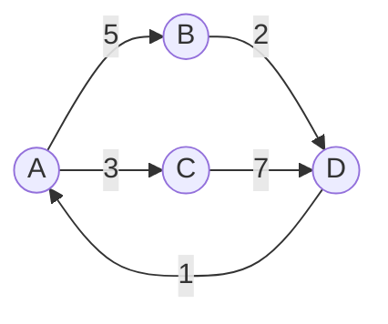
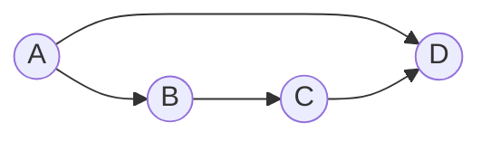

# Chapter 22 · Graphs

[简体中文](./22-graph.md) ｜ **English**

---

> The tree from the previous chapter carries an implicit constraint: **every node has exactly one parent**. But real-world relationships are far looser — the people you follow may follow you back, cities connect in every direction, and module A may depend on B while B depends back on A.
>
> When "parent and child" becomes "any two points may be connected," a tree becomes a **graph**. This is the most general data structure in the book so far: **arrays, linked lists, and trees are all special cases of graphs**.
>
> Two measurements in this chapter are especially worth remembering. First, **the choice of representation can differ by a factor of a hundred in memory** — for a sparse graph of 2,000 vertices, an adjacency matrix takes 30.64 MB while an adjacency list takes only 0.29 MB. Second, a common misconception: **depth-first search does not find the shortest path** — on the same graph, DFS returns `A→B→C→D` (three steps) while BFS returns `A→D` (one step).
>
> And the most practically valuable application of graphs is an algorithm you use indirectly every day: **topological sorting** — the machinery behind `npm`'s "circular dependency" error, a build system's compilation order, and Excel's "circular reference" warning.

## 1. Learning Objectives

By the end of this chapter, you will be able to:

- Explain the difference between graphs and trees, and why graphs are the **most general** data structure;
- Choose correctly between an **adjacency matrix** and an **adjacency list**, and explain why sparse graphs demand the list;
- Implement **BFS and DFS**, and explain **why shortest paths require BFS**;
- Use **topological sorting** to detect circular dependencies, and relate it to real build tools;
- Understand how **Dijkstra's algorithm** uses a heap to find weighted shortest paths.

---

## 2. Why This Concept Exists

**A graph is the most straightforward model of "relationships"**: a set of points plus the connections between them. It matters because real-world relationships are almost never hierarchical:

```text
Social network:  you ↔ friend ↔ friend's friend (may loop back to you)
Navigation:      cities connect in all directions, with distances
Module deps:     utils → db → api → ui
Web links:       A links to B, and B may link back to A (the basis of PageRank)
Task scheduling: some tasks can only start after others finish
State machines:  order: pending → paid → shipped → complete
```

**How graphs relate to trees** — a tree is in fact a special case of a graph:

| | Tree | Graph |
|---|---|---|
| Parents | Exactly one | Any number |
| Cycles | Not allowed | **Allowed** |
| Connectivity | Always connected | May have isolated components |
| Edge count | Exactly `n-1` | 0 to `n(n-1)/2` |

> **In one sentence**: **a tree is an acyclic connected graph**. Arrays and linked lists are degenerate graphs too (each node connects only to the next). **This is why graphs are the most general structure** — learn it, and every earlier structure becomes a special case.

---

## 3. How It Works

### Basic terminology



| Term | Meaning |
|------|---------|
| **Vertex** | A point in the graph, also called a node |
| **Edge** | A connection between two vertices |
| **Directed / undirected** | Whether edges have direction. "Follows" is directed; "friends" is undirected |
| **Weighted** | Edges carry a value (distance, cost, duration) |
| **Degree** | How many edges touch a vertex; directed graphs distinguish **in-degree** and **out-degree** |
| **Cycle** | Following edges can return you to the start |
| **DAG** | **Directed acyclic graph** — the standard model for dependencies and task scheduling |

### Two representations: the chapter's first key decision

**① Adjacency matrix** — a 2-D array where `matrix[i][j]` says whether an edge runs from i to j:

```text
      A  B  C  D
   A [0, 5, 3, 0]
   B [0, 0, 0, 2]
   C [0, 0, 0, 7]
   D [1, 0, 0, 0]
```

**② Adjacency list** — each vertex stores a list of "who I connect to":

```text
   A → [(B,5), (C,3)]
   B → [(D,2)]
   C → [(D,7)]
   D → [(A,1)]
```

**Measured memory comparison** (a sparse graph of 2,000 vertices and 8,000 edges):

| Representation | Memory |
|----------------|--------|
| Adjacency matrix | **30.64 MB** |
| Adjacency list | **0.29 MB** |

**The matrix uses 105× as much.** The reason is plain: a matrix reserves a cell whether or not an edge exists, so `V=2000` means four million cells for only 8,000 actual edges — **99.8% of the space stores "no edge here."**

The gap grows sharply with scale:

| Vertices | Avg. degree | Matrix cells | List entries | Ratio |
|---------:|-----------:|-------------:|-------------:|------:|
| 100 | 4 | 10,000 | 400 | 25× |
| 1,000 | 4 | 1,000,000 | 4,000 | 250× |
| 10,000 | 4 | 100,000,000 | 40,000 | **2500×** |
| 10,000 | 100 | 100,000,000 | 1,000,000 | 100× |

**How to choose**:

| | Adjacency matrix | Adjacency list |
|---|---|---|
| Space | O(V²) | **O(V+E)** |
| "Is there an edge i→j?" | **O(1)** | O(degree) |
| Iterate a vertex's neighbors | O(V) | **O(degree)** |
| Best for | **Dense graphs** (edges near V²) | **Sparse graphs** (nearly every real case) |

> **Default to the adjacency list.** Real graphs are almost always sparse — your contact list is not the world's population, a city does not connect to every other city, and a module does not depend on every other module.

### BFS and DFS: two traversals with entirely different purposes

The difference between these algorithms comes down to **whether you use a queue or a stack** — a direct application of Chapters 18 and 19.

| | BFS (breadth-first) | DFS (depth-first) |
|---|---|---|
| Container | **Queue** (Chapter 19) | **Stack** (Chapter 18) or recursion |
| Movement | Expands outward layer by layer | Follows one path to the end, then backtracks |
| Used for | **Shortest paths**, level relationships, nearest N | Connectivity, path existence, topological sort, cycle detection |

### ⚠️ Key conclusion: DFS does not find the shortest path

This is a very common misconception. Consider this graph — A reaches D by two routes:



**Measured result**:

```text
DFS found: A → B → C → D   (three steps — it dove down the B branch first)
BFS found: A → D           ← the actual shortest path
```

**Why**: DFS commits to a neighbor and follows it to the end, returning as soon as it gets through — it guarantees it will **find** a path, but never that the path is **shortest**. BFS expands layer by layer, so the first time it reaches the target it has necessarily crossed the fewest layers.

> **Remember**: **for shortest paths in an unweighted graph, you must use BFS.** Weighted graphs need Dijkstra (later in this section).

### Topological sorting: the most practically valuable part of this chapter

**The problem**: given tasks with dependencies, can you order them so every task starts only after its dependencies are complete?

**Kahn's algorithm** is beautifully simple: **repeatedly take any node with no unfinished dependencies** (in-degree 0).

**Measured · Scenario A (normal dependencies)**:

```text
Deps: utils→db, config→db, db→api, api→ui, ui→app, utils→api
Build order: utils → config → db → api → ui → app   ✓
```

**Measured · Scenario B (circular dependency)**:

```text
Deps: auth→user, user→order, order→payment, payment→user
Topological sort result: None
⚠️ Circular dependency detected among: ['user', 'order', 'payment']
```

**Why it detects cycles**: if nodes remain after the sort finishes, their in-degrees can **never reach 0** — they are waiting on each other, forming a cycle.

> **This is the algorithm you use every day**:
> - The **circular dependency** errors from `npm` / `Maven` / `Gradle`;
> - A build system deciding **which module to compile first**;
> - Excel's **circular reference** warning;
> - **Task dependency scheduling** in CI/CD;
> - The **execution order** of database migration scripts.

### Cycle detection: three-color marking

Topological sorting detects cycles as a side effect, but if detection is all you need, DFS with **three-color marking** is more direct:

| Color | Meaning |
|-------|---------|
| **White** | Not yet visited |
| **Gray** | **On the path currently being explored** (not yet backtracked) |
| **Black** | Fully explored |

**The rule: encountering a gray node during DFS means there is a cycle** (you have looped back onto the path you are currently walking).

**Measured**:

```text
A→B→C→A              Cycle? True
A→B, A→C, B→D, C→D   Cycle? False   ← note this one!
```

In the second example D is visited twice (via B and via C), but **that is not a cycle** — it is a DAG (a diamond dependency). **Distinguishing "revisited" from "looped back onto the current path" is the crux of cycle detection**, and where beginners most often go wrong.

### Dijkstra: shortest paths in weighted graphs

BFS solves shortest paths when every edge costs the same. When edges carry weights (distance, duration, cost), you need **Dijkstra**.

**The core idea**: repeatedly take, from the not-yet-finalized nodes, the one with the **smallest known distance** — and "take the minimum" is exactly what a **heap** (Chapters 19 and 21) is for.

**Measured**:

```text
Road network: Beijing-Tianjin 120, Beijing-Jinan 400, Tianjin-Jinan 320,
              Tianjin-Qingdao 550, Jinan-Qingdao 360

Dijkstra result:
  Beijing → Tianjin: 120 km
  Beijing → Jinan:   400 km
  Beijing → Qingdao: 670 km
  Shortest path: Beijing → Tianjin → Qingdao

Exhaustive verification:
  Beijing→Tianjin→Qingdao       = 120+550     = 670  ✓ shortest
  Beijing→Jinan→Qingdao         = 400+360     = 760
  Beijing→Tianjin→Jinan→Qingdao = 120+320+360 = 800
```

> **Note**: Dijkstra **does not support negative edge weights**. Those require the Bellman-Ford algorithm — because Dijkstra's greedy assumption that "a finalized shortest distance will never shrink further" breaks down with negative weights.

---

## 4. JavaScript

JavaScript has no built-in graph type; **building an adjacency list from `Map` and arrays** is the natural approach:

```javascript
class Graph {
  constructor() { this.adj = new Map(); }

  addEdge(from, to, weight = 1) {
    if (!this.adj.has(from)) this.adj.set(from, []);
    if (!this.adj.has(to)) this.adj.set(to, []);   // make sure the target exists too
    this.adj.get(from).push({ to, weight });
  }

  // BFS: uses a queue, finds the shortest path
  shortestPath(start, goal) {
    const queue = [[start]];
    const seen = new Set([start]);
    while (queue.length) {
      const path = queue.shift();
      const node = path[path.length - 1];
      if (node === goal) return path;
      for (const { to } of this.adj.get(node) ?? []) {
        if (!seen.has(to)) { seen.add(to); queue.push([...path, to]); }
      }
    }
    return null;
  }
}
```

**Topological sorting** (detecting circular dependencies):

```javascript
function topoSort(nodes, edges) {
  const indeg = new Map(nodes.map((n) => [n, 0]));
  const g = new Map(nodes.map((n) => [n, []]));
  for (const [a, b] of edges) { g.get(a).push(b); indeg.set(b, indeg.get(b) + 1); }

  const queue = nodes.filter((n) => indeg.get(n) === 0);
  const order = [];
  while (queue.length) {
    const n = queue.shift();
    order.push(n);
    for (const m of g.get(n)) {
      indeg.set(m, indeg.get(m) - 1);
      if (indeg.get(m) === 0) queue.push(m);
    }
  }
  // Didn't finish → the remaining nodes are in a cycle
  return order.length === nodes.length ? order : null;
}
```

> **Note**: `queue.shift()` above is **O(n)** (the array must shift every element, per Chapter 19). On large graphs, switch to a two-pointer or linked-list queue, or BFS degrades to O(n²).

---

## 5. Python

**Python 3.9+ ships with topological sorting** — `graphlib.TopologicalSorter`, the only out-of-the-box implementation among our six languages:

```python
from graphlib import TopologicalSorter, CycleError

# Keys are nodes; values are "what it depends on"
ts = TopologicalSorter({
    "db": {"utils", "config"},
    "api": {"db"},
    "ui": {"api"},
    "app": {"ui"},
})
print(list(ts.static_order()))
# ['utils', 'config', 'db', 'api', 'ui', 'app']
```

**A circular dependency raises immediately** (measured):

```python
try:
    TopologicalSorter({
        "user": {"payment"}, "order": {"user"}, "payment": {"order"}
    }).prepare()
except CycleError as e:
    print(e.args[0])   # nodes are in a cycle
    print(e.args[1])   # ['user', 'order', 'payment', 'user'] ← tells you exactly where
```

**BFS / DFS** — `deque` is the correct queue (Chapter 19):

```python
from collections import deque, defaultdict

def bfs_shortest(g, start, goal):
    queue, seen = deque([[start]]), {start}
    while queue:
        path = queue.popleft()          # O(1) — never use list.pop(0)
        if path[-1] == goal:
            return path
        for nxt in g[path[-1]]:
            if nxt not in seen:
                seen.add(nxt)
                queue.append(path + [nxt])
    return None
```

**Dijkstra uses `heapq`** (the heap from Chapters 19 and 21):

```python
import heapq

def dijkstra(g, start):
    dist = {n: float("inf") for n in g}
    dist[start] = 0
    pq = [(0, start)]
    while pq:
        d, n = heapq.heappop(pq)        # greedily take the nearest
        if d > dist[n]:
            continue                     # stale entry, skip
        for m, w in g[n]:
            if d + w < dist[m]:
                dist[m] = d + w
                heapq.heappush(pq, (d + w, m))
    return dist
```

> **Note**: watch recursion depth when writing DFS recursively (Chapter 12). Python's default limit is around 1000, so deep graphs raise `RecursionError` — switch to an explicit stack (Chapter 18).

---

## 6. Java

Java has no built-in graph, but the collections framework makes adjacency lists comfortable:

```java
Map<String, List<String>> graph = new HashMap<>();
graph.computeIfAbsent("A", k -> new ArrayList<>()).add("B");   // the idiom
```

**BFS uses `ArrayDeque`** (Chapter 19):

```java
static List<String> bfsShortest(Map<String, List<String>> g, String start, String goal) {
    Deque<List<String>> queue = new ArrayDeque<>();
    queue.add(List.of(start));
    Set<String> seen = new HashSet<>(Set.of(start));
    while (!queue.isEmpty()) {
        List<String> path = queue.poll();
        String node = path.get(path.size() - 1);
        if (node.equals(goal)) return path;
        for (String next : g.getOrDefault(node, List.of())) {
            if (seen.add(next)) {                    // add returns false if already present
                List<String> np = new ArrayList<>(path);
                np.add(next);
                queue.add(np);
            }
        }
    }
    return null;
}
```

**Dijkstra uses `PriorityQueue`** (a heap, Chapter 19):

```java
PriorityQueue<int[]> pq = new PriorityQueue<>(Comparator.comparingInt(a -> a[1]));
pq.add(new int[]{startNode, 0});
```

> **Note**: the boolean return of `seen.add(next)` is genuinely useful — **one call performs both "is it present?" and "add it"**, saving a hash lookup compared to `contains` followed by `add`.

---

## 7. C++

C++ commonly uses `vector<vector<int>>` as an adjacency list (numbering vertices as integers is the most compact option):

```cpp
std::vector<std::vector<int>> adj(n);       // n vertices
adj[0].push_back(1);                         // 0 → 1
```

**Weighted graphs** use `pair`:

```cpp
std::vector<std::vector<std::pair<int,int>>> adj(n);   // {neighbor, weight}
adj[0].push_back({1, 5});
```

**BFS**:

```cpp
std::vector<int> bfs(const std::vector<std::vector<int>>& adj, int start) {
    std::vector<int> dist(adj.size(), -1);
    std::queue<int> q;
    q.push(start);
    dist[start] = 0;
    while (!q.empty()) {
        int n = q.front(); q.pop();
        for (int m : adj[n])
            if (dist[m] == -1) {             // -1 means not yet visited
                dist[m] = dist[n] + 1;
                q.push(m);
            }
    }
    return dist;
}
```

**Dijkstra uses `priority_queue`** (note the default is a max-heap, so a min-heap needs `greater`):

```cpp
std::priority_queue<std::pair<int,int>,
                    std::vector<std::pair<int,int>>,
                    std::greater<>> pq;      // min-heap
```

> **Note**: C++'s `priority_queue` is a **max-heap by default**, the opposite of Java's and Python's min-heaps. Forgetting `std::greater<>` in Dijkstra is an extremely common bug — the code compiles and runs, but the answers are wrong.

---

## 8. C#

C# builds adjacency lists from `Dictionary<T, List<T>>`:

```csharp
var graph = new Dictionary<string, List<string>>();
graph.TryAdd("A", new List<string>());
graph["A"].Add("B");
```

**BFS uses `Queue<T>`** (Chapter 19):

```csharp
static List<string> BfsShortest(Dictionary<string, List<string>> g, string start, string goal)
{
    var queue = new Queue<List<string>>();
    queue.Enqueue(new List<string> { start });
    var seen = new HashSet<string> { start };
    while (queue.Count > 0)
    {
        var path = queue.Dequeue();
        var node = path[^1];                       // ^1 = last element
        if (node == goal) return path;
        foreach (var next in g.GetValueOrDefault(node, new List<string>()))
            if (seen.Add(next))                     // Add returns bool
                queue.Enqueue(new List<string>(path) { next });
    }
    return null;
}
```

**Dijkstra uses `PriorityQueue`** (.NET 6+):

```csharp
var pq = new PriorityQueue<string, int>();   // element + priority, min-heap by default
pq.Enqueue("A", 0);
```

> **Note**: C#'s `PriorityQueue<TElement, TPriority>` splits the element and its priority into **two type parameters**, which reads more directly than Java's `Comparator` requirement — a deliberate improvement when .NET 6 introduced it.

---

## 9. SQL

Graph data in a database is stored as an **adjacency list and queried with recursive CTEs** (Chapters 11 and 21).

### ① Storage: an edge table

```sql
CREATE TABLE follows (follower TEXT, followee TEXT);   -- directed: who follows whom
INSERT INTO follows VALUES
 ('Alice','Bob'), ('Bob','Carol'), ('Carol','Dave'), ('Alice','Dave');
```

### ② BFS: querying "N degrees of connection"

```sql
WITH RECURSIVE reach(person, depth) AS (
    SELECT 'Alice', 0                                    -- starting point
    UNION ALL
    SELECT f.followee, r.depth + 1
    FROM follows f JOIN reach r ON f.follower = r.person
    WHERE r.depth < 3                                     -- cap the depth to prevent blowup
)
SELECT DISTINCT person, MIN(depth) AS shortest_distance
FROM reach GROUP BY person ORDER BY shortest_distance;
```

> **Note the `MIN(depth)`**: the same person may be reachable via several paths, and the minimum is the true shortest distance — this is BFS thinking expressed in SQL.

### ③ ⚠️ Cycles make recursive queries loop forever

```sql
-- If the data contains A→B→C→A, this query never terminates
WITH RECURSIVE r(p) AS (
    SELECT 'A' UNION ALL SELECT f.followee FROM follows f JOIN r ON f.follower = r.p
)
SELECT * FROM r;      -- ⚠️ infinite loop!
```

**Two defenses**:

```sql
-- ① Cap the depth
WHERE depth < 5

-- ② Track the path and never revisit (real cycle detection)
WITH RECURSIVE r(p, path) AS (
    SELECT 'A', ',A,'
    UNION ALL
    SELECT f.followee, r.path || f.followee || ','
    FROM follows f JOIN r ON f.follower = r.p
    WHERE r.path NOT LIKE '%,' || f.followee || ',%'      -- stop if already on the path
)
SELECT p, path FROM r;
```

> **Practical warning**: **always cap recursion depth in production**. An unguarded recursive query against cyclic data can peg a database CPU — this is a real category of incident.
>
> **Also**: if graph queries are core to your business (social recommendations, knowledge graphs, fraud-detection networks), a relational database will struggle and a dedicated graph database is worth considering.

---

## 10. Cross-Language Comparison

### ① Graph-related capabilities

| Feature | JavaScript | Python | Java | C++ | C# |
|---------|-----------|--------|------|-----|-----|
| Built-in graph type | ❌ | ❌ | ❌ | ❌ | ❌ |
| **Built-in topological sort** | ❌ | ✅ **`graphlib`** | ❌ | ❌ | ❌ |
| Usual adjacency list | `Map` + arrays | `dict` + `list` | `Map<T,List<T>>` | `vector<vector<int>>` | `Dictionary<T,List<T>>` |
| BFS queue | Array (`shift` is slow) | `deque` | `ArrayDeque` | `queue` | `Queue<T>` |
| Dijkstra's heap | Roll your own | `heapq` | `PriorityQueue` | `priority_queue` | `PriorityQueue` |
| Default heap direction | — | Min | Min | ⚠️ **Max** | Min |

**Two differences worth remembering**:

1. **Only Python ships topological sorting** (`graphlib`, 3.9+), and a circular dependency raises `CycleError` telling you exactly where the cycle is. Every other language requires writing Kahn's algorithm yourself.
2. **Only C++ defaults to a max-heap.** Forgetting `std::greater<>` in Dijkstra is a frequent bug.

### ② Commonalities and the roots of the differences

**In common**: none of the six languages has a built-in graph type — because **graphs vary too much in shape** (directed/undirected, weighted/unweighted, sparse/dense) for one implementation to serve every case efficiently. So standard libraries provide the **parts needed to build a graph** (maps, queues, heaps) and leave assembly to you.

**Root of the difference**: Python ships `graphlib` because it treats topological sorting as **one concrete, frequent need** (build tools, task scheduling) rather than as general graph capability — a textbook case of "solve the specific problem instead of shipping an abstract framework."

---

## 11. Implementation Comparison

| Representation · Use | Structure | Key characteristic |
|----------------------|-----------|--------------------|
| **Adjacency matrix** | 2-D array (Chapter 16) | O(V²) space; O(1) edge lookup; cache-friendly but extremely wasteful |
| **Adjacency list** | Array + linked list / dynamic array (Chapter 17) | O(V+E) space; O(degree) neighbor iteration |
| **BFS** | **Queue** (Chapter 19) | Layer-by-layer → guarantees shortest paths |
| **DFS** | **Stack** (Chapter 18) or recursion (Chapter 12) | Follows one path → no shortest guarantee |
| **Topological sort** | Queue + in-degree counters | Unfinished nodes = a cycle |
| **Dijkstra** | **Heap** (Chapters 19, 21) | Greedily take the nearest; no negative weights |

**This table is Part 3 in miniature**: graph algorithms introduce no new storage structure of their own — they **combine** everything from the earlier chapters: arrays for matrices, linked lists for adjacency lists, queues for BFS, stacks for DFS, heaps for Dijkstra, and hash tables to record visited nodes.

---

## 12. Performance Analysis

### Complexity comparison

Let V be the vertex count and E the edge count:

| Operation | Adjacency matrix | Adjacency list |
|-----------|:----------------:|:--------------:|
| Space | O(V²) | **O(V+E)** |
| Add an edge | **O(1)** | **O(1)** |
| Is there an edge i→j? | **O(1)** | O(degree) |
| Iterate a vertex's neighbors | O(V) | **O(degree)** |
| Full BFS / DFS | O(V²) | **O(V+E)** |

| Algorithm | Complexity | Purpose |
|-----------|:----------:|---------|
| BFS | O(V+E) | Unweighted shortest path |
| DFS | O(V+E) | Connectivity, path existence |
| Topological sort | O(V+E) | Dependency order, cycle detection |
| Dijkstra (heap) | O((V+E) log V) | Weighted shortest path (no negatives) |

### Measured results

**① Adjacency matrix vs. adjacency list** (2,000 vertices, 8,000 edges):

| Representation | Memory |
|----------------|--------|
| Adjacency matrix | 30.64 MB |
| Adjacency list | **0.29 MB** |

**The matrix uses 105× as much**, and the gap grows with the square of the vertex count.

**② Structural facts (environment-independent)**:

| Vertices | Avg. degree | Matrix cells | List entries | Ratio |
|---------:|-----------:|-------------:|-------------:|------:|
| 1,000 | 4 | 1,000,000 | 4,000 | 250× |
| 10,000 | 4 | 100,000,000 | 40,000 | **2500×** |

> These numbers are **not performance measurements but pure arithmetic** (`V²` versus `E`), so they do not depend on machine, language, or compiler flags — among the few figures in this book you can safely quote directly.

---

## 13. Engineering Practice

| Scenario | ✅ Recommended | ❌ Not recommended | Why |
|----------|---------------|-------------------|-----|
| General graph storage | Adjacency list | Adjacency matrix | Real graphs are almost always sparse |
| Dense graph / frequent "is there an edge?" | Adjacency matrix | Adjacency list | O(1) edge lookup |
| Unweighted shortest path | **BFS** | DFS | DFS gives no shortest guarantee |
| Weighted shortest path | Dijkstra | BFS | BFS ignores weights |
| Negative edge weights | Bellman-Ford | Dijkstra | The greedy assumption fails |
| Dependency / build order | Topological sort | Manual ordering | Detects cycles for free |
| BFS queue in JS | Two pointers / linked list | `array.shift()` | `shift` is O(n) (Chapter 19) |
| Recursive DFS on deep graphs | Explicit stack | Recursion | Avoids stack overflow (Chapters 12, 18) |
| Recursive SQL graph queries | **Cap the depth** | Unbounded recursion | Cycles cause infinite loops |
| Graphs central to the business | Graph database | Forcing a relational DB | Multi-hop queries get expensive |

**Graph algorithms you use indirectly every day**:

```text
Topological sort → npm/Maven dependency resolution, build order,
                   Excel circular-reference detection, CI task scheduling
BFS              → social "N degrees," fewest transfers, layered crawling
DFS              → filesystem traversal, connectivity, compiler dependency analysis
Dijkstra         → map navigation, network routing, least-cost paths
DAG              → Git commit history, Spark/Airflow pipelines, React dependency tracking
```

---

## 14. Best Practices

- **Default to the adjacency list**; use a matrix only when the graph is genuinely dense and you frequently ask "is there an edge between these two?"
- **Before finding a shortest path, ask: are edges weighted?** Unweighted → BFS, weighted → Dijkstra, negative weights → Bellman-Ford.
- **Always track visited nodes** — otherwise a cyclic graph loops forever.
- **Handle every dependency relationship with a topological sort**, which detects circular dependencies as a bonus.
- **Distinguish "revisited" from "back on the current path"** in cycle detection (three-color marking), or you will flag DAGs as cyclic.
- **Always cap recursion depth in SQL recursive queries** — a common source of production incidents.
- **Prefer iteration over recursion on large graphs** (Chapter 18) to avoid stack overflow.

---

## 15. Common Pitfalls

**Pitfall 1 · Using DFS to find the shortest path**

```python
dfs_path(g, "A", "D")   # ✗ returns A→B→C→D, but the shortest is A→D
```
**How to avoid**: in an unweighted graph, **shortest paths require BFS**.

**Pitfall 2 · Forgetting to track visited nodes → infinite loop**

```python
def dfs(n):
    for m in g[n]: dfs(m)     # ✗ never terminates on a cyclic graph
```
**How to avoid**: always maintain a `visited` set. This is the biggest operational difference between graphs and trees — **trees never need it, graphs always do**.

**Pitfall 3 · C++'s `priority_queue` defaults to a max-heap**

```cpp
std::priority_queue<std::pair<int,int>> pq;   // ✗ Dijkstra produces wrong answers
```
**How to avoid**: add `std::greater<>` to specify a min-heap explicitly.

**Pitfall 4 · Using `shift()` as a BFS queue in JavaScript**

```javascript
const node = queue.shift();   // ⚠️ O(n) — BFS degrades to O(n²) on large graphs
```
**How to avoid**: use an index pointer instead of `shift` (Chapter 19).

**Pitfall 5 · Cycle detection flagging a DAG as cyclic**

```text
A→B, A→C, B→D, C→D    ← D is visited twice, but this is not a cycle!
```
**How to avoid**: use three-color marking; only a **gray** node (on the current path) means a cycle.

**Pitfall 6 · Running Dijkstra on negative weights**

```text
Dijkstra assumes "a finalized shortest distance never shrinks" — negative edges break this
```
**How to avoid**: use Bellman-Ford when weights can be negative.

**Pitfall 7 · SQL recursive queries against cyclic data**

```sql
WITH RECURSIVE r(p) AS (SELECT 'A' UNION ALL SELECT ... )   -- ✗ no depth limit
```
**How to avoid**: add `WHERE depth < N`, or track a path column for cycle detection.

---

## 16. Interview Questions

**Basic**

1. What is the difference between a graph and a tree? Why is a tree a special case of a graph?
2. What are the trade-offs between an adjacency matrix and an adjacency list? When does each fit?
3. Which data structures implement BFS and DFS respectively?

**Intermediate**

4. **Why must shortest-path search use BFS rather than DFS?** Give an example of what DFS returns.
5. What is topological sorting? How does it detect circular dependencies?
6. Why must graph traversal track visited nodes when tree traversal does not?

**Advanced**

7. Why does Dijkstra's algorithm use a heap? What is its time complexity?
8. Why can't Dijkstra handle negative edge weights? What should you use instead?
9. In cycle detection, how do you distinguish a "revisited node" from an actual cycle?

---

## 17. Exercises

**Basic**

1. Implement a graph with an adjacency list supporting add-vertex, add-edge, and neighbor iteration.
2. Implement BFS and DFS, then compare the paths they find on the same graph.
3. Compute the memory a 2,000-vertex sparse graph needs as a matrix versus a list, verifying the 100× gap.

**Intermediate**

4. Implement Kahn's topological sort and have it report the nodes in the cycle when one exists.
5. Implement three-color cycle detection and verify it does not flag a diamond dependency (a DAG) as cyclic.
6. Implement Dijkstra with a heap, finding shortest distances and reconstructing the path.

**Advanced**

7. Build a simplified package dependency resolver: read dependency declarations, output an install order, and on a circular dependency report the cycle.
8. Query "N degrees of connection" with a SQL recursive CTE, including cycle protection.
9. Compare BFS and Dijkstra on a graph where **all weights are 1**, and explain why they are equivalent there.

---

## 18. Chapter Summary

**In one sentence**: a graph is the **most general data structure** (trees, linked lists, and arrays are all special cases), an **adjacency list** can save a hundredfold memory over a matrix, **BFS with a queue guarantees shortest paths while DFS with a stack only guarantees finding one** — and **topological sorting**, the algorithm running behind every `npm install`, both produces a dependency order and detects circular dependencies.

**Key points**

- **A tree is an acyclic connected graph**; graphs allow cycles and multiple parents, so **graph traversal must track visited nodes**.
- **Adjacency list vs. matrix**: 105× measured memory difference (2,000-vertex sparse graph), growing with V²; **default to the list**.
- **DFS does not find the shortest path**: measured, DFS gave `A→B→C→D` while BFS gave `A→D`.
- **Topological sort = repeatedly take nodes with in-degree 0**; if it cannot finish, there is a cycle.
- **Dijkstra greedily takes the nearest node using a heap**, and does not support negative weights.
- **Graph algorithms compose every earlier structure**: arrays, linked lists, stacks, queues, hashes, and heaps all appear.

**Checklist**

- [ ] I can explain why a tree is a special case of a graph, and why traversal must track state.
- [ ] I can choose an adjacency list or matrix based on graph density.
- [ ] I can state the container difference between BFS and DFS, and why shortest paths need BFS.
- [ ] I can detect circular dependencies with a topological sort and name its uses in real tools.
- [ ] I know why Dijkstra uses a heap and where it stops applying.

---

### 🎓 Part 3 Wrap-Up

This chapter also closes **Part 3, "Data Structures."** Looking back across these seven chapters, they form a single thread — **each structure addresses the shortcoming of the one before it**:

```text
Ch. 16 Array       Contiguous memory + address arithmetic → O(1) random access,
                   but insertion and deletion must shift elements
Ch. 17 Linked list Pointers instead of contiguity → O(1) insert/delete,
                   at the cost of random access
Ch. 18 Stack       Restricted to one end → last-in-first-out, the basis of
                   function calls and backtracking
Ch. 19 Queue       Two ends with distinct roles → first-in-first-out, the basis
                   of BFS and task scheduling
Ch. 20 Hash        Compute the key into an index → O(1) lookup, but order is lost
Ch. 21 Tree        Organize into a hierarchy → O(log n) with order preserved,
                   at some speed cost
Ch. 22 Graph       Allow arbitrary connections → the most general; every earlier
                   structure is a special case of it
```

**Three threads running through the whole Part**:

1. **Everything is a space-time trade-off** — hashing spends extra buckets on lookup speed; an adjacency matrix spends O(V²) space on O(1) edge lookup.
2. **There is no best structure, only the most appropriate one** — which is why every chapter in this Part carries a "how to choose" table.
3. **Performance numbers must be measured** — this Part repeatedly hit cases where expectation and measurement diverged (cache locality in Chapter 16, the 3–30× cross-language spread in Chapter 21). **Remember the principle, not the number.**

**Coming next**: so far we have only discussed **how data is stored**. But in real programs data rarely stands alone — it comes bundled with "what you can do to it." Packaging data and behavior into one unit gives you an **object**. Chapter 23 opens **Part 4, "Object-Oriented Programming,"** starting from the most fundamental question: **what exactly are classes and objects, and why do we need them?**

---

## 19. Further Reading

- <a href="https://en.wikipedia.org/wiki/Graph_(abstract_data_type)" target="_blank" rel="noopener">Wikipedia: Graph (abstract data type)</a> — terminology, representations, and basic operations.
- <a href="https://en.wikipedia.org/wiki/Breadth-first_search" target="_blank" rel="noopener">Wikipedia: Breadth-first search</a> — why it guarantees shortest paths.
- <a href="https://en.wikipedia.org/wiki/Depth-first_search" target="_blank" rel="noopener">Wikipedia: Depth-first search</a> — traversal order and three-color marking.
- <a href="https://en.wikipedia.org/wiki/Topological_sorting" target="_blank" rel="noopener">Wikipedia: Topological sorting</a> — Kahn's algorithm and cycle detection.
- <a href="https://en.wikipedia.org/wiki/Directed_acyclic_graph" target="_blank" rel="noopener">Wikipedia: Directed acyclic graph (DAG)</a> — the standard model for dependencies and scheduling.
- <a href="https://en.wikipedia.org/wiki/Dijkstra%27s_algorithm" target="_blank" rel="noopener">Wikipedia: Dijkstra's algorithm</a> — weighted shortest paths and the negative-weight limitation.
- <a href="https://docs.python.org/3/library/graphlib.html" target="_blank" rel="noopener">Python docs · graphlib</a> — the only built-in topological sort among the six languages.
