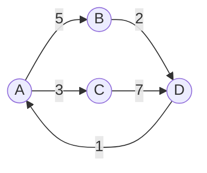
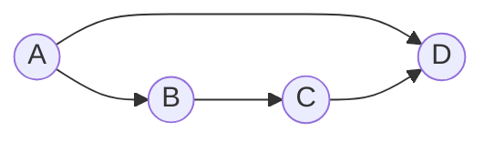

# 第 22 章 · 图

**简体中文** ｜ [English](./22-graph.en-US.md)

---

> 上一章的树有个隐含约束：**每个节点只有一个父亲**。可现实里的关系远比这松散——你关注的人也可能关注你、地图上的城市四通八达、模块 A 依赖 B 而 B 又依赖回 A。
>
> 当"父子"变成"任意两点之间都可能有连接"，树就变成了**图**。这是本书目前最通用的数据结构：**数组、链表、树都是图的特例**。
>
> 本章有两个实测特别值得记住。一是**存储方式的选择能差出百倍内存**——2000 个顶点的稀疏图，邻接矩阵占 30.64 MB，邻接表只占 0.29 MB。二是一个常见误解：**深度优先搜索找到的路径不是最短路径**——同一张图里 DFS 给出 `A→B→C→D`（三步），而 BFS 给出 `A→D`（一步）。
>
> 而图最有工程价值的应用，是那个你每天都在间接使用的算法：**拓扑排序**——`npm` 报的 "circular dependency"、构建系统决定编译顺序、Excel 的"循环引用"警告，背后都是它。

## 1. 学习目标

本章结束后，你将能够：

- 说清图与树的区别，并解释为什么图是**最通用**的数据结构；
- 在**邻接矩阵**与**邻接表**之间做出正确选择，并说明为什么稀疏图必须用邻接表；
- 实现 **BFS 与 DFS**，并解释**为什么求最短路径必须用 BFS**；
- 用**拓扑排序**检测循环依赖，并说明它与真实构建工具的关系；
- 理解 **Dijkstra 算法**如何用堆求带权最短路径。

---

## 2. 为什么会出现这个概念

**图是对"关系"最朴素的建模**：一堆点，加上点与点之间的连线。它之所以重要，是因为现实中的关系几乎都不是层级的：

```text
社交网络:  你 ↔ 朋友 ↔ 朋友的朋友（可能绕回你自己）
地图导航:  城市之间四通八达，还带距离
模块依赖:  utils → db → api → ui
网页链接:  A 链到 B，B 也可能链回 A（PageRank 的基础）
任务调度:  某些任务必须在另一些完成后才能开始
状态机:    订单：待付款 → 已付款 → 已发货 → 已完成
```

**图与树的关系**——树其实是图的一个特例：

| | 树 | 图 |
|---|---|---|
| 父节点 | 只有一个 | 任意多个 |
| 环 | 不允许 | **允许** |
| 连通性 | 必然连通 | 可能有孤岛 |
| 边数 | 恰好 `n-1` | 0 到 `n(n-1)/2` |

> **一句话**：**树 = 无环连通图**。而数组、链表也都是图的退化形式（每个节点只连下一个）。**这就是为什么图是最通用的结构**——学会它，前面所有结构都成了它的特例。

---

## 3. 底层原理

### 基本概念



| 术语 | 含义 |
|------|------|
| **顶点（vertex）** | 图中的点，也叫节点 |
| **边（edge）** | 连接两个顶点的线 |
| **有向 / 无向** | 边有没有方向。"关注"是有向的，"好友"是无向的 |
| **带权（weighted）** | 边上有数值（距离、费用、耗时） |
| **度（degree）** | 一个顶点连了多少条边；有向图分**入度**与**出度** |
| **环（cycle）** | 沿着边能走回起点 |
| **DAG** | **有向无环图**——依赖关系、任务调度的标准模型 |

### 两种表示法：这是本章第一个关键决策

**① 邻接矩阵**——用二维数组，`matrix[i][j]` 表示 i 到 j 有没有边：

```text
      A  B  C  D
   A [0, 5, 3, 0]
   B [0, 0, 0, 2]
   C [0, 0, 0, 7]
   D [1, 0, 0, 0]
```

**② 邻接表**——每个顶点存一个"我连到谁"的列表：

```text
   A → [(B,5), (C,3)]
   B → [(D,2)]
   C → [(D,7)]
   D → [(A,1)]
```

**实测内存对比**（2000 个顶点、8000 条边的稀疏图）：

| 表示法 | 内存 |
|--------|------|
| 邻接矩阵 | **30.64 MB** |
| 邻接表 | **0.29 MB** |

**矩阵占用是表的 105 倍。** 原因很直白：矩阵不管有没有边都要占一个格子，`V=2000` 就是四百万个格子，而实际只有 8000 条边——**99.8% 的空间存的都是"没有边"**。

差距随规模急剧放大：

| 顶点数 | 平均度 | 矩阵格子 | 表条目 | 倍数 |
|-------:|------:|---------:|-------:|-----:|
| 100 | 4 | 10,000 | 400 | 25× |
| 1,000 | 4 | 1,000,000 | 4,000 | 250× |
| 10,000 | 4 | 100,000,000 | 40,000 | **2500×** |
| 10,000 | 100 | 100,000,000 | 1,000,000 | 100× |

**怎么选**：

| | 邻接矩阵 | 邻接表 |
|---|---|---|
| 空间 | O(V²) | **O(V+E)** |
| 查"i 到 j 有边吗" | **O(1)** | O(度) |
| 遍历某点所有邻居 | O(V) | **O(度)** |
| 适合 | **稠密图**（边接近 V²） | **稀疏图**（绝大多数真实场景） |

> **默认用邻接表**。现实中的图几乎都是稀疏的——你的微信好友不会是全世界人口，一个城市不会通向所有其他城市，一个模块不会依赖所有模块。

### BFS 与 DFS：两种遍历，用途完全不同

这两个算法的区别，本质上就是**用队列还是用栈**——正好是第 18、19 两章的直接应用。

| | BFS 广度优先 | DFS 深度优先 |
|---|---|---|
| 容器 | **队列**（第 19 章） | **栈**（第 18 章）或递归 |
| 走法 | 一层一层向外扩散 | 一条路走到黑，再回头 |
| 用途 | **最短路径**、层级关系、最近的 N 个 | 连通性、路径存在性、拓扑排序、环检测 |

### ⚠️ 关键结论：DFS 找到的不是最短路径

这是个非常常见的误解。看这张图——A 到 D 有两条路：



**实测结果**：

```text
DFS 找到: A → B → C → D   （三步，因为它先钻进了 B 这条深路）
BFS 找到: A → D           ← 才是最短路径
```

**为什么**：DFS 认准一个邻居就一路走到底，只要走通了就返回——它保证"**找得到**"，但完全不保证"**最短**"。而 BFS 逐层扩散，第一次到达终点时经过的层数必然最少。

> **记住**：**无权图求最短路径，必须用 BFS**。带权图则要用 Dijkstra（本节稍后）。

### 拓扑排序：本章最有工程价值的部分

**问题**：给定一堆有依赖关系的任务，能不能排出一个顺序，使得每个任务开始时它的依赖都已完成？

**Kahn 算法**的思路极其朴素：**反复取出"没有任何未完成依赖"的节点**（即入度为 0）。

**实测 · 场景 A（正常依赖）**：

```text
依赖: utils→db, config→db, db→api, api→ui, ui→app, utils→api
构建顺序: utils → config → db → api → ui → app   ✓
```

**实测 · 场景 B（循环依赖）**：

```text
依赖: auth→user, user→order, order→payment, payment→user
拓扑排序结果: None
⚠️ 检测到循环依赖，涉及模块: ['user', 'order', 'payment']
```

**为什么能检测出环**：如果排完之后还有节点没被输出，说明这些节点的入度**永远降不到 0**——它们互相等待，形成了环。

> **这就是你每天在用的算法**：
> - `npm` / `Maven` / `Gradle` 报的 **circular dependency**；
> - 构建系统决定**先编译哪个模块**；
> - Excel 报的**循环引用**；
> - CI/CD 里的**任务依赖调度**；
> - 数据库迁移脚本的**执行顺序**。

### 环检测：三色标记法

拓扑排序能顺带检测环，但如果只想检测环，用 DFS 的**三色标记**更直接：

| 颜色 | 含义 |
|------|------|
| **白** | 还没访问 |
| **灰** | **正在访问的路径上**（还没回溯完） |
| **黑** | 已完全访问完 |

**规则：DFS 时遇到灰色节点 = 有环**（说明绕回了当前正在走的路径上）。

**实测**：

```text
A→B→C→A              有环? True
A→B, A→C, B→D, C→D   有环? False   ← 注意这个！
```

第二个例子里 D 被访问了两次（经 B 和经 C），但**这不是环**——它是一个 DAG（菱形依赖）。**区分"重复访问"与"回到正在访问的路径上"，是环检测的关键**，也是初学者最容易写错的地方。

### Dijkstra：带权图的最短路径

BFS 解决的是"每条边代价相同"的最短路径。如果边带权重（距离、耗时、费用），就要用 **Dijkstra**。

**核心思路**：每次从"尚未确定的节点"中，贪心地取出**当前已知距离最近**的那个——而"取最小值"正是**堆**（第 19、21 章）的看家本领。

**实测**：

```text
路网: 北京-天津 120, 北京-济南 400, 天津-济南 320,
      天津-青岛 550, 济南-青岛 360

Dijkstra 结果:
  北京 → 天津: 120 km
  北京 → 济南: 400 km
  北京 → 青岛: 670 km
  最短路径: 北京 → 天津 → 青岛

穷举验证:
  北京→天津→青岛      = 120+550     = 670  ✓ 最短
  北京→济南→青岛      = 400+360     = 760
  北京→天津→济南→青岛 = 120+320+360 = 800
```

> **注意**：Dijkstra **不支持负权边**。有负权时需要 Bellman-Ford 算法——因为 Dijkstra 的贪心假设"已确定的最短距离不会再变小"在负权下不成立。

---

## 4. JavaScript

JavaScript 没有内置图结构，**用 `Map` + 数组构造邻接表**是最自然的做法：

```javascript
class Graph {
  constructor() { this.adj = new Map(); }

  addEdge(from, to, weight = 1) {
    if (!this.adj.has(from)) this.adj.set(from, []);
    if (!this.adj.has(to)) this.adj.set(to, []);   // 保证终点也在图里
    this.adj.get(from).push({ to, weight });
  }

  // BFS：用队列，求最短路径
  shortestPath(start, goal) {
    const queue = [[start]];
    const seen = new Set([start]);
    while (queue.length) {
      const path = queue.shift();
      const node = path[path.length - 1];
      if (node === goal) return path;
      for (const { to } of this.adj.get(node) ?? []) {
        if (!seen.has(to)) { seen.add(to); queue.push([...path, to]); }
      }
    }
    return null;
  }
}
```

**拓扑排序**（检测循环依赖）：

```javascript
function topoSort(nodes, edges) {
  const indeg = new Map(nodes.map((n) => [n, 0]));
  const g = new Map(nodes.map((n) => [n, []]));
  for (const [a, b] of edges) { g.get(a).push(b); indeg.set(b, indeg.get(b) + 1); }

  const queue = nodes.filter((n) => indeg.get(n) === 0);
  const order = [];
  while (queue.length) {
    const n = queue.shift();
    order.push(n);
    for (const m of g.get(n)) {
      indeg.set(m, indeg.get(m) - 1);
      if (indeg.get(m) === 0) queue.push(m);
    }
  }
  // 没排完 → 剩下的节点在环里
  return order.length === nodes.length ? order : null;
}
```

> **注意事项**：上面 BFS 里的 `queue.shift()` 是 **O(n)**（数组要整体前移，第 19 章讲过）。图很大时应改用双指针或链表实现的队列，否则 BFS 会退化成 O(n²)。

---

## 5. Python

**Python 3.9+ 内置了拓扑排序**——`graphlib.TopologicalSorter`，这是六门语言里唯一开箱即用的：

```python
from graphlib import TopologicalSorter, CycleError

# 键是节点，值是「它依赖谁」
ts = TopologicalSorter({
    "db": {"utils", "config"},
    "api": {"db"},
    "ui": {"api"},
    "app": {"ui"},
})
print(list(ts.static_order()))
# ['utils', 'config', 'db', 'api', 'ui', 'app']
```

**循环依赖会直接抛异常**（实测）：

```python
try:
    TopologicalSorter({
        "user": {"payment"}, "order": {"user"}, "payment": {"order"}
    }).prepare()
except CycleError as e:
    print(e.args[0])   # nodes are in a cycle
    print(e.args[1])   # ['user', 'order', 'payment', 'user'] ← 直接告诉你环在哪
```

**BFS / DFS**——`deque` 是队列的正确选择（第 19 章）：

```python
from collections import deque, defaultdict

def bfs_shortest(g, start, goal):
    queue, seen = deque([[start]]), {start}
    while queue:
        path = queue.popleft()          # O(1)，别用 list.pop(0)
        if path[-1] == goal:
            return path
        for nxt in g[path[-1]]:
            if nxt not in seen:
                seen.add(nxt)
                queue.append(path + [nxt])
    return None
```

**Dijkstra 用 `heapq`**（第 19、21 章的堆）：

```python
import heapq

def dijkstra(g, start):
    dist = {n: float("inf") for n in g}
    dist[start] = 0
    pq = [(0, start)]
    while pq:
        d, n = heapq.heappop(pq)        # 贪心取当前最近的
        if d > dist[n]:
            continue                     # 过期条目，跳过
        for m, w in g[n]:
            if d + w < dist[m]:
                dist[m] = d + w
                heapq.heappush(pq, (d + w, m))
    return dist
```

> **注意事项**：递归写 DFS 时注意深度限制（第 12 章）。Python 默认递归上限约 1000，深图会 `RecursionError`——改用显式栈（第 18 章）。

---

## 6. Java

Java 没有内置图，但集合框架让邻接表写起来很顺：

```java
Map<String, List<String>> graph = new HashMap<>();
graph.computeIfAbsent("A", k -> new ArrayList<>()).add("B");   // 惯用法
```

**BFS 用 `ArrayDeque`**（第 19 章）：

```java
static List<String> bfsShortest(Map<String, List<String>> g, String start, String goal) {
    Deque<List<String>> queue = new ArrayDeque<>();
    queue.add(List.of(start));
    Set<String> seen = new HashSet<>(Set.of(start));
    while (!queue.isEmpty()) {
        List<String> path = queue.poll();
        String node = path.get(path.size() - 1);
        if (node.equals(goal)) return path;
        for (String next : g.getOrDefault(node, List.of())) {
            if (seen.add(next)) {                    // add 返回 false 说明已存在
                List<String> np = new ArrayList<>(path);
                np.add(next);
                queue.add(np);
            }
        }
    }
    return null;
}
```

**Dijkstra 用 `PriorityQueue`**（堆，第 19 章）：

```java
PriorityQueue<int[]> pq = new PriorityQueue<>(Comparator.comparingInt(a -> a[1]));
pq.add(new int[]{startNode, 0});
```

> **注意事项**：`seen.add(next)` 返回布尔值这个特性很好用——**一次调用同时完成"判断是否存在"和"加入"**，比先 `contains` 再 `add` 少一次哈希查找。

---

## 7. C++

C++ 常用 `vector<vector<int>>` 做邻接表（顶点用整数编号，最省空间）：

```cpp
std::vector<std::vector<int>> adj(n);       // n 个顶点
adj[0].push_back(1);                         // 0 → 1
```

**带权图**用 `pair`：

```cpp
std::vector<std::vector<std::pair<int,int>>> adj(n);   // {邻居, 权重}
adj[0].push_back({1, 5});
```

**BFS**：

```cpp
std::vector<int> bfs(const std::vector<std::vector<int>>& adj, int start) {
    std::vector<int> dist(adj.size(), -1);
    std::queue<int> q;
    q.push(start);
    dist[start] = 0;
    while (!q.empty()) {
        int n = q.front(); q.pop();
        for (int m : adj[n])
            if (dist[m] == -1) {             // -1 表示还没访问
                dist[m] = dist[n] + 1;
                q.push(m);
            }
    }
    return dist;
}
```

**Dijkstra 用 `priority_queue`**（注意默认是大顶堆，求最小值要加 `greater`）：

```cpp
std::priority_queue<std::pair<int,int>,
                    std::vector<std::pair<int,int>>,
                    std::greater<>> pq;      // 小顶堆
```

> **注意事项**：C++ 的 `priority_queue` **默认是大顶堆**，这与 Java、Python 的默认小顶堆相反。写 Dijkstra 时忘了加 `std::greater<>` 是极常见的 bug——代码能编译能跑，但结果是错的。

---

## 8. C#

C# 用 `Dictionary<T, List<T>>` 构造邻接表：

```csharp
var graph = new Dictionary<string, List<string>>();
graph.TryAdd("A", new List<string>());
graph["A"].Add("B");
```

**BFS 用 `Queue<T>`**（第 19 章）：

```csharp
static List<string> BfsShortest(Dictionary<string, List<string>> g, string start, string goal)
{
    var queue = new Queue<List<string>>();
    queue.Enqueue(new List<string> { start });
    var seen = new HashSet<string> { start };
    while (queue.Count > 0)
    {
        var path = queue.Dequeue();
        var node = path[^1];                       // ^1 = 最后一个元素
        if (node == goal) return path;
        foreach (var next in g.GetValueOrDefault(node, new List<string>()))
            if (seen.Add(next))                     // Add 返回 bool
                queue.Enqueue(new List<string>(path) { next });
    }
    return null;
}
```

**Dijkstra 用 `PriorityQueue`**（.NET 6+）：

```csharp
var pq = new PriorityQueue<string, int>();   // 元素 + 优先级，默认小顶堆
pq.Enqueue("A", 0);
```

> **注意事项**：C# 的 `PriorityQueue<TElement, TPriority>` 把元素和优先级**分成两个泛型参数**，比 Java 需要写 `Comparator` 更直观——这是 .NET 6 引入时刻意改进的设计。

---

## 9. SQL

数据库里的图数据用**邻接表存储 + 递归 CTE 查询**（第 11、21 章）。

### ① 存储：一张边表

```sql
CREATE TABLE follows (follower TEXT, followee TEXT);   -- 有向图：谁关注了谁
INSERT INTO follows VALUES
 ('Alice','Bob'), ('Bob','Carol'), ('Carol','Dave'), ('Alice','Dave');
```

### ② BFS：查"N 度人脉"

```sql
WITH RECURSIVE reach(person, depth) AS (
    SELECT 'Alice', 0                                    -- 起点
    UNION ALL
    SELECT f.followee, r.depth + 1
    FROM follows f JOIN reach r ON f.follower = r.person
    WHERE r.depth < 3                                     -- 限制深度，防止爆炸
)
SELECT DISTINCT person, MIN(depth) AS 最短距离
FROM reach GROUP BY person ORDER BY 最短距离;
```

> **注意 `MIN(depth)`**：同一个人可能通过多条路径到达，取最小值才是最短距离——这正是 BFS 的思想在 SQL 里的体现。

### ③ ⚠️ 环会让递归查询无限循环

```sql
-- 如果数据里存在 A→B→C→A，下面这个查询永远不会结束
WITH RECURSIVE r(p) AS (
    SELECT 'A' UNION ALL SELECT f.followee FROM follows f JOIN r ON f.follower = r.p
)
SELECT * FROM r;      -- ⚠️ 无限循环！
```

**两种防护手段**：

```sql
-- ① 限制深度
WHERE depth < 5

-- ② 记录路径，走过的不再走（真正的环检测）
WITH RECURSIVE r(p, path) AS (
    SELECT 'A', ',A,'
    UNION ALL
    SELECT f.followee, r.path || f.followee || ','
    FROM follows f JOIN r ON f.follower = r.p
    WHERE r.path NOT LIKE '%,' || f.followee || ',%'      -- 已在路径中就停
)
SELECT p, path FROM r;
```

> **工程提醒**：生产环境的递归 CTE **务必加深度限制**。一条没有防护的递归查询遇到环形数据，能把数据库 CPU 打满——这是真实发生过的事故类型。
>
> **另外**：如果图查询是业务核心（社交推荐、知识图谱、风控关系网），关系型数据库会力不从心，应考虑专门的图数据库。

---

## 10. 五语言横向对比

### ① 图相关能力

| 特性 | JavaScript | Python | Java | C++ | C# |
|------|-----------|--------|------|-----|-----|
| 内置图结构 | ❌ | ❌ | ❌ | ❌ | ❌ |
| **内置拓扑排序** | ❌ | ✅ **`graphlib`** | ❌ | ❌ | ❌ |
| 常用邻接表 | `Map` + 数组 | `dict` + `list` | `Map<T,List<T>>` | `vector<vector<int>>` | `Dictionary<T,List<T>>` |
| BFS 队列 | 数组（`shift` 慢）| `deque` | `ArrayDeque` | `queue` | `Queue<T>` |
| Dijkstra 的堆 | 手写 | `heapq` | `PriorityQueue` | `priority_queue` | `PriorityQueue` |
| 堆默认方向 | — | 小顶 | 小顶 | ⚠️ **大顶** | 小顶 |

**两个值得记住的差异**：

1. **只有 Python 内置了拓扑排序**（3.9+ 的 `graphlib`），而且循环依赖会直接抛出 `CycleError` 并告诉你环在哪。其余语言都得自己写 Kahn 算法。
2. **只有 C++ 的堆默认是大顶堆**。写 Dijkstra 忘加 `std::greater<>` 是高频 bug。

### ② 共同点与差异根源

**共同点**：六门语言都没有内置图类型——因为**图的形态太多样**（有向/无向、带权/不带权、稀疏/稠密），没有一种通用实现能同时高效满足所有场景。所以标准库只提供**构造图所需的零件**（映射、队列、堆），把组装留给使用者。

**差异根源**：Python 之所以内置 `graphlib`，是因为它把拓扑排序视为**一个具体且高频的需求**（构建工具、任务调度），而非通用图能力——这是"解决具体问题而非提供抽象框架"的典型取舍。

---

## 11. 底层实现对比

| 表示法 · 场景 | 结构 | 关键特征 |
|--------------|------|---------|
| **邻接矩阵** | 二维数组（第 16 章） | O(V²) 空间；查边 O(1)；缓存友好但极度浪费 |
| **邻接表** | 数组 + 链表/动态数组（第 17 章） | O(V+E) 空间；遍历邻居 O(度) |
| **BFS** | **队列**（第 19 章） | 逐层扩散 → 保证最短路径 |
| **DFS** | **栈**（第 18 章）或递归（第 12 章） | 一路到底 → 不保证最短 |
| **拓扑排序** | 队列 + 入度计数 | 排不完 = 有环 |
| **Dijkstra** | **堆**（第 19、21 章） | 贪心取最近；不支持负权 |

**这张表就是 Part 3 的缩影**：图算法本身不引入新的存储结构，它把前面所有章节的结构**组合起来使用**——数组存矩阵、链表存邻接表、队列做 BFS、栈做 DFS、堆做 Dijkstra、哈希表记录访问过的节点。

---

## 12. 性能分析

### 复杂度对比

设 V 为顶点数、E 为边数：

| 操作 | 邻接矩阵 | 邻接表 |
|------|:--------:|:------:|
| 空间 | O(V²) | **O(V+E)** |
| 加一条边 | **O(1)** | **O(1)** |
| 查 i→j 是否有边 | **O(1)** | O(度) |
| 遍历某点的邻居 | O(V) | **O(度)** |
| BFS / DFS 全图 | O(V²) | **O(V+E)** |

| 算法 | 复杂度 | 用途 |
|------|:------:|------|
| BFS | O(V+E) | 无权最短路径 |
| DFS | O(V+E) | 连通性、路径存在性 |
| 拓扑排序 | O(V+E) | 依赖顺序、环检测 |
| Dijkstra（堆） | O((V+E) log V) | 带权最短路径（无负权） |

### 实测数据

**① 邻接矩阵 vs 邻接表**（2000 顶点、8000 条边）：

| 表示法 | 内存 |
|--------|------|
| 邻接矩阵 | 30.64 MB |
| 邻接表 | **0.29 MB** |

**矩阵是表的 105 倍**，而且差距随顶点数平方增长。

**② 结构性事实（与环境无关）**：

| 顶点数 | 平均度 | 矩阵格子 | 表条目 | 倍数 |
|-------:|------:|---------:|-------:|-----:|
| 1,000 | 4 | 1,000,000 | 4,000 | 250× |
| 10,000 | 4 | 100,000,000 | 40,000 | **2500×** |

> 这组数字**不是性能测量，而是纯粹的算术**（`V²` 对 `E`），所以不依赖机器、语言或编译选项——这是本书少数可以放心直接引用的数字。

---

## 13. 工程实践

| 场景 | ✅ 推荐 | ❌ 不推荐 | 原因 |
|------|--------|----------|------|
| 一般图存储 | 邻接表 | 邻接矩阵 | 真实图几乎都稀疏 |
| 稠密图 / 频繁查"两点间有边吗" | 邻接矩阵 | 邻接表 | 查边 O(1) |
| 无权最短路径 | **BFS** | DFS | DFS 不保证最短 |
| 带权最短路径 | Dijkstra | BFS | BFS 忽略权重 |
| 有负权边 | Bellman-Ford | Dijkstra | 贪心假设失效 |
| 依赖顺序 / 构建顺序 | 拓扑排序 | 手动排 | 能同时检测环 |
| JS 里 BFS 的队列 | 双指针 / 链表 | `array.shift()` | `shift` 是 O(n)（第 19 章） |
| 递归 DFS 深图 | 显式栈 | 递归 | 避免爆栈（第 12、18 章） |
| SQL 递归查图 | **加深度限制** | 无限制递归 | 环会导致无限循环 |
| 图是业务核心 | 图数据库 | 关系库硬扛 | 多跳查询代价高 |

**你每天在间接使用的图算法**：

```text
拓扑排序 → npm/Maven 依赖解析、构建顺序、Excel 循环引用检测、CI 任务调度
BFS      → 社交"N 度人脉"、最少换乘、爬虫的层级抓取
DFS      → 文件系统遍历、连通性检测、编译器的依赖分析
Dijkstra → 地图导航、网络路由、最低成本路径
DAG      → Git 提交历史、Spark/Airflow 任务流、React 的依赖追踪
```

---

## 14. 最佳实践

- **默认用邻接表**；只有在图确实稠密、且频繁查"两点间有边吗"时才用矩阵。
- **求最短路径先问一句：边带权吗？** 不带权用 BFS，带权用 Dijkstra，有负权用 Bellman-Ford。
- **一定要记录已访问节点**——否则有环的图会让遍历无限循环。
- **依赖关系一律用拓扑排序处理**，顺带就把循环依赖检测了。
- **环检测要区分"重复访问"和"回到当前路径"**（三色标记法），否则会把 DAG 误判成有环。
- **SQL 递归查询务必加深度限制**，这是生产事故的常见来源。
- **图很大时优先考虑迭代而非递归**（第 18 章），避免栈溢出。

---

## 15. 常见坑

**坑 1 · 用 DFS 求最短路径**

```python
dfs_path(g, "A", "D")   # ✗ 返回 A→B→C→D，但最短是 A→D
```
**如何避免**：无权图求最短路径**必须用 BFS**。

**坑 2 · 忘记记录已访问节点 → 无限循环**

```python
def dfs(n):
    for m in g[n]: dfs(m)     # ✗ 图有环时永远不会结束
```
**如何避免**：始终维护 `visited` 集合。这是图与树最大的操作差异——**树不用担心，图必须担心**。

**坑 3 · C++ 的 `priority_queue` 默认是大顶堆**

```cpp
std::priority_queue<std::pair<int,int>> pq;   // ✗ Dijkstra 会算错
```
**如何避免**：加 `std::greater<>` 显式指定小顶堆。

**坑 4 · JavaScript 用 `shift()` 做 BFS 队列**

```javascript
const node = queue.shift();   // ⚠️ O(n)，大图上 BFS 退化成 O(n²)
```
**如何避免**：用下标指针代替 `shift`（第 19 章）。

**坑 5 · 环检测把 DAG 误判成有环**

```text
A→B, A→C, B→D, C→D    ← D 被访问两次，但这不是环！
```
**如何避免**：用三色标记，只有遇到**灰色**（正在访问路径上）才算环。

**坑 6 · 对负权边用 Dijkstra**

```text
Dijkstra 假设"已确定的最短距离不会再变小"——负权边会打破这个假设
```
**如何避免**：有负权用 Bellman-Ford。

**坑 7 · SQL 递归查询遇到环形数据**

```sql
WITH RECURSIVE r(p) AS (SELECT 'A' UNION ALL SELECT ... )   -- ✗ 无深度限制
```
**如何避免**：加 `WHERE depth < N`，或用路径字段做环检测。

---

## 16. 面试题

**基础**

1. 图和树有什么区别？为什么说树是图的特例？
2. 邻接矩阵和邻接表各有什么优劣？分别适合什么场景？
3. BFS 和 DFS 分别用什么数据结构实现？

**中级**

4. **为什么求最短路径要用 BFS 而不是 DFS？** 举例说明 DFS 会给出什么结果。
5. 什么是拓扑排序？它如何检测循环依赖？
6. 遍历图为什么必须记录已访问节点，而遍历树不用？

**高级**

7. Dijkstra 算法为什么用堆？它的时间复杂度是多少？
8. Dijkstra 为什么不能处理负权边？该用什么替代？
9. 环检测时如何区分"重复访问的节点"和"真正的环"？

---

## 17. 练习

**基础**

1. 用邻接表实现一个图，支持添加顶点、添加边、遍历邻居。
2. 实现 BFS 和 DFS，并在同一张图上对比它们找到的路径。
3. 计算 2000 个顶点的稀疏图分别用矩阵和表需要多少内存，验证百倍差距。

**提高**

4. 实现 Kahn 拓扑排序，并让它在检测到环时报告环中的节点。
5. 实现三色标记的环检测，并验证它不会把菱形依赖（DAG）误判成环。
6. 用堆实现 Dijkstra，求出带权图的最短路径并还原路径。

**挑战**

7. 实现一个简化版的包依赖解析器：读入依赖声明，输出安装顺序，遇到循环依赖时报错并指出环。
8. 用 SQL 递归 CTE 查询"N 度人脉"，并加上环检测防止无限循环。
9. 对比 BFS 与 Dijkstra 在**边权全为 1** 的图上的结果，说明为什么此时两者等价。

---

## 18. 本章总结

**一句话总结**：图是**最通用的数据结构**（树、链表、数组都是它的特例），用**邻接表**存储可比邻接矩阵省百倍内存；**BFS 用队列保证最短路径、DFS 用栈保证找得到**，两者不可混用；而**拓扑排序**——那个每天在 `npm install` 背后运行的算法——既给出依赖顺序，又顺带检测出循环依赖。

**核心知识点**

- **树 = 无环连通图**；图允许环和多个父节点，所以**遍历图必须记录已访问节点**。
- **邻接表 vs 邻接矩阵**：实测 105 倍内存差（2000 顶点稀疏图），差距随 V² 增长；**默认用表**。
- **DFS 找到的不是最短路径**：实测 DFS 给出 `A→B→C→D`，BFS 给出 `A→D`。
- **拓扑排序 = 反复取入度为 0 的节点**；排不完就说明有环。
- **Dijkstra 用堆贪心取最近节点**，不支持负权边。
- **图算法是前面所有结构的组合应用**：数组、链表、栈、队列、哈希、堆全都用上了。

**检查清单**

- [ ] 我能解释为什么树是图的特例，以及遍历图为何必须记录访问状态。
- [ ] 我能根据图的稀疏程度选择邻接表或邻接矩阵。
- [ ] 我能说清 BFS 与 DFS 的容器差异，以及为什么最短路径必须用 BFS。
- [ ] 我能用拓扑排序检测循环依赖，并说出它在真实工具中的应用。
- [ ] 我知道 Dijkstra 为什么用堆，以及它的适用边界。

---

### 🎓 Part 3 收官

本章也是 **Part 3「数据结构」** 的最后一章。回望这七章，它其实是一条连贯的线索——**每一种结构，都是在解决前一种结构的短板**：

```text
第 16 章 数组   连续内存 + 地址计算 → O(1) 随机访问，但插入删除要搬移
第 17 章 链表   用指针换连续性     → O(1) 插入删除，但失去了随机访问
第 18 章 栈     限制为一端进出     → 后进先出，函数调用与回溯的基础
第 19 章 队列   限制为两端分工     → 先进先出，BFS 与任务调度的基础
第 20 章 哈希   把键算成下标       → O(1) 查找，但彻底丢失顺序
第 21 章 树     组织成层级         → O(log n) 且保持有序，代价是慢一些
第 22 章 图     允许任意连接       → 最通用；前面所有结构都是它的特例
```

**贯穿全 Part 的三条主线**：

1. **一切都是空间与时间的交换**——哈希用额外的桶换查找速度，邻接矩阵用 O(V²) 空间换 O(1) 查边。
2. **没有最好的结构，只有最合适的结构**——这也是为什么本 Part 每章都有"怎么选"的对照表。
3. **性能数字必须实测**——本 Part 多次出现"预期与实测不符"的情况（第 16 章的缓存局部性、第 21 章跨语言 3～30 倍的差异）。**记原理，不记数字。**

**下一章预告**：到此为止，我们一直在讨论**数据怎么存**。但真实程序里，数据很少单独存在——它总是和"能对它做什么"绑在一起。把数据和行为打包成一个整体，就是**对象**。第 23 章起进入 **Part 4「面向对象」**，从最根本的问题开始：**类和对象到底是什么，为什么需要它们？**

---

## 19. 延伸阅读

- <a href="https://en.wikipedia.org/wiki/Graph_(abstract_data_type)" target="_blank" rel="noopener">Wikipedia：图（抽象数据类型）</a> — 术语、表示法与基本操作。
- <a href="https://en.wikipedia.org/wiki/Breadth-first_search" target="_blank" rel="noopener">Wikipedia：广度优先搜索</a> — 为什么它能保证最短路径。
- <a href="https://en.wikipedia.org/wiki/Depth-first_search" target="_blank" rel="noopener">Wikipedia：深度优先搜索</a> — 遍历顺序与三色标记。
- <a href="https://en.wikipedia.org/wiki/Topological_sorting" target="_blank" rel="noopener">Wikipedia：拓扑排序</a> — Kahn 算法与环检测。
- <a href="https://en.wikipedia.org/wiki/Directed_acyclic_graph" target="_blank" rel="noopener">Wikipedia：有向无环图（DAG）</a> — 依赖关系与任务调度的标准模型。
- <a href="https://en.wikipedia.org/wiki/Dijkstra%27s_algorithm" target="_blank" rel="noopener">Wikipedia：Dijkstra 算法</a> — 带权最短路径与负权限制。
- <a href="https://docs.python.org/3/library/graphlib.html" target="_blank" rel="noopener">Python 文档 · graphlib</a> — 六门语言中唯一内置的拓扑排序。
