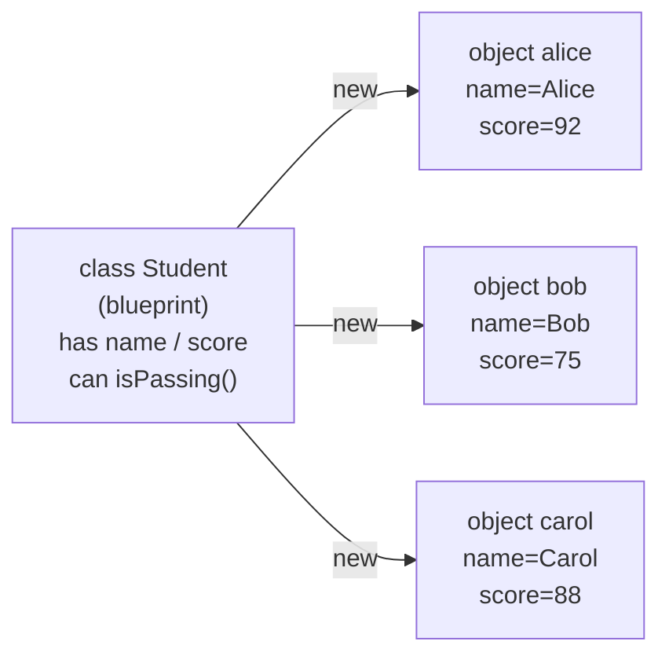
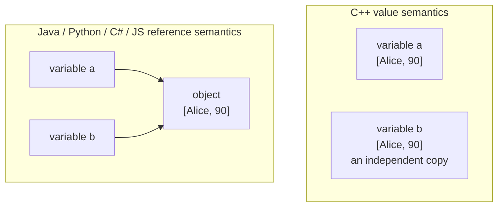

# Chapter 23 · Classes

[简体中文](./23-class.md) ｜ **English**

---

> Part 3 was entirely about **how data is stored**. But in real programs data rarely stands alone — it comes bundled with "what you can do to it." A student has a name and a score, and also behaviors like "compute GPA" and "is passing." Keep the two apart and the code loses control fast.
>
> A **class** is the mechanism for packaging data and behavior into one unit. The idea sounds mundane, but the difference it makes is structural: you go from "a pile of unrelated variables and functions" to "a thing that can look after itself."
>
> The most important thing to take from this chapter is a difference that will trip you up when moving between languages: **the same line `b = a` copies a new object in C++, but merely creates another name for the same object in Java, Python, C#, and JavaScript**. Measured: in C++, modifying `b` leaves `a` untouched, while in Python and Java modifying `b` changes `a` too. Neither is wrong — this is the fundamental split between **value semantics** and **reference semantics**.

## 1. Learning Objectives

By the end of this chapter, you will be able to:

- Explain **why data and behavior belong together**, and what goes wrong when they don't;
- Define classes, create instances, and explain the roles of the **constructor** and `this` / `self`;
- Distinguish **instance members** from **static (class) members**, including how they differ in memory;
- Explain **value versus reference semantics**, and how it affects every assignment you write;
- Explain that **JavaScript's `class` is syntactic sugar over prototypes** and that **Python's classes are themselves objects**.

---

## 2. Why This Concept Exists

Suppose you manage student data using only the variables and functions from earlier chapters.

**Step one: the data is scattered**:

```javascript
let studentName = "Alice";
let studentScore = 92;
let studentAge = 16;
```

**Step two: a second student arrives**:

```javascript
let studentName2 = "Bob";
let studentScore2 = 75;
let studentAge2 = 17;      // numbered variable names — the signal that this is out of control
```

**Step three: use arrays** — and lose the association between fields:

```javascript
let names = ["Alice", "Bob"];
let scores = [92, 75];
let ages = [16, 17];
// ⚠️ All three arrays must stay in exactly the same order.
// Sort scores without sorting the others and the data is silently corrupted.
```

**Step four: functions live apart from data**:

```javascript
function isPassing(score) { return score >= 60; }
isPassing(ages[0]);        // ⚠️ Wrong argument, perfectly legal syntax, meaningless result
```

The problems are now visible:

| Problem | Symptom |
|---------|---------|
| **Scattered data** | Fields describing one thing live all over, held together by naming conventions |
| **Fragile association** | Parallel arrays must be kept in sync by hand and easily desynchronize |
| **No constraints** | Any function accepts any value; the compiler cannot help |
| **Hard to reuse** | Every new student repeats the same structure |

**A class solves all four at once**:

```javascript
class Student {
  constructor(name, score, age) {
    this.name = name;
    this.score = score;      // three fields packaged together and never misaligned
    this.age = age;
  }
  isPassing() { return this.score >= 60; }   // behavior lives with the data
}

const alice = new Student("Alice", 92, 16);
alice.isPassing();           // no way to pass the wrong argument — it reads its own score
```

> **In one sentence**: a class defines "**the data structure of a kind of thing**" together with "**what you can do to it**," so concepts in your program map one-to-one onto concepts in the world.

---

## 3. How It Works

### A class is a template, not a thing

A very common beginner misconception is treating the class as "the thing itself." A class is the **blueprint**; objects are the **products** built from it:



There is one blueprint and any number of products. **Each object has its own data but shares one definition of behavior** — a point that becomes concrete in the memory discussion below.

### Constructors: the moment an object is born

A **constructor** answers "what initialization must happen when a new object is created?" Its existence guarantees that **an object is in a valid state from the moment it exists**:

```text
new Student("Alice", 92)
      ↓
① allocate memory
② run the constructor, filling in initial data
③ return the object (by reference or by value)
```

> **Why this matters**: without a constructor, you can produce objects with half their fields empty, and the code using them has no way to know. The constructor is the first line of defense for **invariants** — a rule like "score must be between 0 and 100" belongs here.

### `this` / `self`: how a method knows which object it belongs to

All objects share one copy of the method code, so when `isPassing()` runs, how does it know **whose** `score` to read?

The answer: **the current object is passed in, implicitly or explicitly, when the method is called**.

```text
alice.isPassing()
   ↓ what actually happens
isPassing(alice)      ← this hidden first argument is this / self
```

**Python puts this out in the open** — `self` is the method's first formal parameter:

```python
def is_passing(self):        # self is that hidden argument, written explicitly
    return self.score >= 60
```

Java, C++, C#, and JavaScript hide it and expose it through the `this` keyword. **The mechanism is identical; only the visibility differs.**

### Instance vs. static members: how many copies exist

This is the chapter's second key distinction:

| | Instance member | Static / class member |
|---|---|---|
| Belongs to | **Each object** | **The class as a whole** |
| Stored in | The object's own memory | The class's storage |
| Accessed as | `alice.name` | `Student.count` |
| Good for | Data that differs per object (name, score) | Things shared by all (school name, instance count, constants) |

**Measured** (Python):

```text
a.school = "First High"   b.school = "First High"
Are they the same object? True          ← the class attribute exists once

Student.school = "Second High"   after changing the class attribute:
a.school = Second High   b.school = Second High   ← every instance sees it
```

### ⚠️ Value vs. reference semantics: the chapter's most important difference

The same `b = a` means entirely different things across languages. **This is the easiest thing to get wrong when moving between them.**

**C++ has value semantics** — an object is a value, and assignment copies (measured):

```text
Student a{"Alice", 90};
Student b = a;          // copies out a brand-new object
b.name = "Bob";

Result: a.name=Alice   b.name=Bob      ← a is entirely unaffected
        address of a: 0x16da8e2c8
        address of b: 0x16da8e2a8      ← two distinct objects
```

**Python / Java / C# / JavaScript have reference semantics** — a variable holds a reference to an object (measured):

```text
Python:  a = Student("Alice", 90)
         b = a               # just another name for the same object
         b.name = "Bob"

Result: a.name=Bob   b.name=Bob         ← a changed too!
        id(a) == id(b)                   ← literally the same object

Java:    Student b = a;  b.name = "Bob";
Result: a.name=Bob   b.name=Bob   and a == b is true
```

**The two semantics side by side**:



**To get reference semantics in C++**, ask for a reference or pointer explicitly:

```cpp
Student& r = a;      // a reference is an alias
r.name = "Changed";  // measured: a.name really does become Changed
```

**To get value semantics in Python**, copy explicitly:

```python
import copy
c = copy.copy(a)     # measured: modifying c does not affect a
```

> **Where the split comes from**: C++ pursues "you don't pay for what you don't use," and a stack object is the fastest thing available, so values are the default. Languages with garbage collection — Java, Python — put all objects on the heap and let variables hold references, which is what allows the GC to manage lifetimes uniformly. **Both choices follow logically from their design goals.**

---

## 4. JavaScript

JavaScript's `class` arrived in ES6, but it **introduced no new object model** — prototypes still underlie everything.

```javascript
class Student {
  constructor(name, score) {
    this.name = name;
    this.score = score;
  }
  isPassing() { return this.score >= 60; }

  static school = "First High";      // static property: belongs to the class
  static create(name) { return new Student(name, 0); }
}

const alice = new Student("Alice", 92);
alice.isPassing();          // true
Student.school;             // "First High"
```

### ⚠️ `class` is only syntactic sugar (measured)

```text
typeof Student                                → "function"   ← it is a function!
Object.getOwnPropertyNames(Student.prototype) → ['isPassing']
                                                ← methods live on the prototype, not the instance
Does the instance own isPassing?              → false
What does the instance own?                   → ['name', 'score']   ← only data
Object.getPrototypeOf(alice) === Student.prototype → true
```

The ES5 prototype style reproduces the behavior exactly:

```javascript
function OldStudent(name, score) { this.name = name; this.score = score; }
OldStudent.prototype.isPassing = function () { return this.score >= 60; };
// Measured: output identical to the class version
```

> **This explains an important fact**: **methods exist in exactly one copy** (on the prototype), shared by every instance; an object's memory holds only its own data. It is why the `class` syntax does not duplicate function objects when you create many instances. Prototype chains get their full treatment in Chapter 24.

**Private fields** use a `#` prefix (ES2022, genuinely private — see Chapter 25):

```javascript
class Account {
  #balance = 0;                    // inaccessible from outside
  deposit(n) { this.#balance += n; }
}
```

> **Note**: code inside a `class` runs in strict mode automatically, and **class declarations are not hoisted** — using one before its definition throws a `ReferenceError`, unlike `function`.

---

## 5. Python

Python's class syntax is the most concise, but two characteristics deserve specific attention.

```python
class Student:
    school = "First High"                    # class attribute: shared by all instances

    def __init__(self, name, score):         # constructor
        self.name = name                      # instance attributes
        self.score = score

    def is_passing(self):                     # self is an explicit first parameter
        return self.score >= 60

    @classmethod
    def create(cls, name):                    # cls is the class itself
        return cls(name, 0)

    @staticmethod
    def pass_line():                          # needs neither instance nor class
        return 60
```

### Characteristic one: `self` is explicit

Other languages hide `this`; Python makes you write it. This is not verbosity — it **puts on display the fact that a method is just a function whose first argument is the object**:

```python
alice.is_passing()          # equivalent to ↓
Student.is_passing(alice)   # this is what actually happens
```

### Characteristic two: classes are objects too (measured)

```text
type(Student)          → <class 'type'>   ← a class's type is type
Is Student an object?  → True
Add an attribute at runtime → Student.motto = "Truth"   works
Create a class from nothing at runtime → type("Dynamic", (), {...})   also works
```

> In Python, the `class` statement is essentially sugar for "**create an object of type `type`**." This is the foundation of decorators, ORMs, and framework magic in general (Chapter 30 covers reflection).

### ⚠️ The classic trap: assigning to an instance does not modify the class attribute (measured)

```text
After a.school = "Third High":
  a.school        = Third High     ← a gained an instance attribute of its own
  b.school        = Second High    ← b unchanged
  Student.school  = Second High    ← the class attribute unchanged
  a.__dict__      = {'name': 'Alice', 'school': 'Third High'}
```

**The rule**: **reads** check the instance first, then the class; but **assignment** always creates or modifies an instance attribute. Changing the class attribute requires `Student.school = ...`.

> **Note**: **never use a mutable object as a class attribute** (like `tags = []`) — it is shared by every instance, so one instance's modification affects them all. This is one of Python's most notorious pitfalls; initialize such fields in `__init__`.

---

## 6. Java

Java is purely class-based — **all code must live inside a class**.

```java
public class Student {
    private String name;                    // instance fields
    private int score;
    private static int count = 0;           // static field: shared by the whole class
    public static final int PASS_LINE = 60; // static constant

    public Student(String name, int score) {   // constructor: class name, no return type
        this.name = name;                       // this distinguishes parameter from field
        this.score = score;
        count++;
    }

    public boolean isPassing() { return score >= PASS_LINE; }

    public static int getCount() { return count; }   // static method
}
```

**Java 14+ `record`** — a class meant to say "this is just data":

```java
public record Point(int x, int y) { }
// Automatically gets a constructor, accessors, equals, hashCode, and toString,
// and it is immutable.
```

> `record` is a genuinely useful improvement. Recall Chapter 20: hand-writing `equals` while forgetting `hashCode` means a `HashMap` stores your key but cannot find it — `record` generates the pair together, designing that pitfall out of existence.

> **Note**: Java objects **always live on the heap**, and variables hold references — which is exactly why, in the measurement above, modifying `b` after `b = a` changed `a`. Java has no stack objects like C++.

---

## 7. C++

C++ classes differ most from the rest, because the language must support both value and reference semantics.

```cpp
class Student {
private:
    std::string name;
    int score;
    static int count;                       // static member: declared in the class

public:
    Student(std::string n, int s)           // constructor
        : name(std::move(n)), score(s) {    // member initializer list (cheaper than assigning in the body)
        count++;
    }
    ~Student() { count--; }                 // ⚠️ destructor: no equivalent in the other languages

    bool isPassing() const { return score >= 60; }   // const means it does not modify the object

    static int getCount() { return count; }
};

int Student::count = 0;                      // static members need an out-of-class definition
```

### ⚠️ Three points unique to C++

**① Objects can live on the stack** — the root of value semantics:

```cpp
Student a("Alice", 92);              // stack object, destroyed automatically at scope exit
Student* p = new Student("Bob", 75); // heap object, must be deleted (or use a smart pointer)
delete p;
```

**② Destructors and RAII** — called automatically when an object dies, the core of C++ resource management:

```cpp
{
    Student s("Alice", 92);
}   // leaving scope calls the destructor; resources are released automatically
```

> This is **RAII** (Resource Acquisition Is Initialization). File handles, locks, and memory can all be released this way — **without a GC, and without forgetting**. It is the biggest payoff C++ gets from value semantics.

**③ `struct` and `class` differ only in default visibility**:

```cpp
struct A { int x; };     // public by default
class  B { int x; };     // private by default
```

> **Note**: prefer the **member initializer list** (`: name(n), score(s)`) over assigning in the constructor body — the latter default-constructs each member first and then overwrites it, doing the work twice.

---

## 8. C#

C#'s class syntax resembles Java's with several notable improvements.

```csharp
public class Student
{
    public string Name { get; }              // property: cleaner than field + getter
    public int Score { get; private set; }    // read-only outside, writable inside
    private static int _count = 0;
    public const int PassLine = 60;

    public Student(string name, int score)    // constructor
    {
        Name = name;
        Score = score;
        _count++;
    }

    public bool IsPassing() => Score >= PassLine;   // expression-bodied member
    public static int Count => _count;
}
```

### Three C# distinctives

**① Properties** — they look like fields but are methods:

```csharp
public int Score { get; private set; }
// Callers write student.Score, which reads like a field, but validation can live behind it
```

**② `record`** (C# 9+) — an immutable data class with **value-based comparison**:

```csharp
public record Point(int X, int Y);

var a = new Point(1, 2);
var b = new Point(1, 2);
a == b;        // true ← compares values, not references
```

> Worth contrasting with Chapter 20: an ordinary `class` compares references with `==`, whereas a `record` implements value-based `Equals` and `GetHashCode` automatically — **designing away the "stored it but can't find it" pitfall**.

**③ `struct` is a value type** — C# is the only language here that lets you **choose** value or reference semantics:

```csharp
public struct PointV { public int X, Y; }    // value type: assignment copies, stack allocated
public class  PointR { public int X, Y; }    // reference type: assignment aliases, heap allocated
```

> **Note**: `struct` suits small immutable data (coordinates, colors, dates). Large objects become *slower* as structs — every pass copies the whole thing.

---

## 9. SQL

**SQL has no classes** — it is a relational model, not an object model. But the correspondence is clear.

### ① A table is the "data half" of a class

```sql
CREATE TABLE student (
    id     INTEGER PRIMARY KEY,
    name   TEXT NOT NULL,          -- corresponds to a class field
    score  INTEGER CHECK (score BETWEEN 0 AND 100)   -- corresponds to constructor validation
);
```

| Object-oriented | Relational database |
|-----------------|---------------------|
| Class | Table |
| Field / property | Column |
| Object / instance | Row |
| Object identity | Primary key |
| Type constraint | Column type + `CHECK` |

> **Note the `CHECK` constraint**: it plays exactly the role of validation in a constructor — **guaranteeing data is valid from the moment it is written**.

### ② Where behavior lives

The relational model has no methods, but several constructs carry behavior:

```sql
-- A view fixes a "computed property" in place, like a read-only derived attribute
CREATE VIEW student_status AS
SELECT id, name, score,
       CASE WHEN score >= 60 THEN 'pass' ELSE 'fail' END AS status
FROM student;

-- A trigger is behavior that runs automatically on data change
CREATE TRIGGER check_score BEFORE INSERT ON student
BEGIN
    SELECT CASE WHEN NEW.score < 0
        THEN RAISE(ABORT, 'score cannot be negative') END;
END;
```

### ③ Impedance mismatch: the problem ORMs exist to solve

The gap between object and relational models is called **impedance mismatch**:

| Difference | Objects | Relations |
|------------|---------|-----------|
| Identity | Memory address / reference | Primary key |
| Association | Holds an object reference directly | Foreign key + JOIN |
| Inheritance | Native | **No equivalent** |
| Collections | A List inside an object | Requires a separate table |

**ORMs** (Hibernate, SQLAlchemy, Entity Framework) exist to bridge this gap.

> **Practical warning**: an ORM makes object-to-table mapping convenient but also hides real SQL costs — **N+1 queries** (Chapter 11) being the classic consequence. Always know what SQL your ORM generates.

---

## 10. Cross-Language Comparison

### ① Syntax and mechanics

| Feature | JavaScript | Python | Java | C++ | C# |
|---------|-----------|--------|------|-----|-----|
| Declaration | `class` | `class` | `class` | `class` / `struct` | `class` / `struct` |
| Underlying model | **Prototypes** | Classes are objects | Class-based | Class-based | Class-based |
| Constructor | `constructor` | `__init__` | Class name | Class name | Class name |
| Current object | `this` (implicit) | **`self` (explicit)** | `this` | `this` (pointer) | `this` |
| **Default semantics** | Reference | Reference | Reference | **Value** | Reference (`class`) / **Value** (`struct`) |
| Destruction | GC | GC (`__del__` unreliable) | GC | **Destructor + RAII** | GC (`IDisposable`) |
| Static members | `static` | Class attributes | `static` | `static` | `static` |
| Data-class shorthand | — | `@dataclass` | `record` | — | `record` |

### ② The three differences most worth remembering

**① Only C++ defaults to value semantics** (C# lets you opt in via `struct`). This determines what `b = a` means — **the easiest cross-language trap to fall into**.

**② Only JavaScript is prototype-based underneath.** `class` is sugar (measured: `typeof Student === "function"`), and methods live on the prototype rather than on instances.

**③ Only Python writes `self` explicitly**, and only Python makes the class itself a manipulable object (measured: classes can be created at runtime).

### ③ Commonalities and the roots of the differences

**In common**: all five provide a way to package data with behavior, all have constructors, and all distinguish instance from static members — because **these are intrinsic needs of object orientation, independent of language**.

**Roots of the differences**:

- **C++'s value semantics** come from zero-overhead abstraction — don't pay for what you don't use, and stack objects are fastest;
- **Java/C#/Python's reference semantics** come from **the needs of garbage collection** — uniform heap allocation is what lets a GC manage lifetimes;
- **JavaScript's prototypes** come from choices made at its birth (Chapter 01); `class` is a later usability layer;
- **The arrival of `record` / `@dataclass`** reflects a shared realization: **a great many classes are just data containers**, and languages are now providing shorthand for that common case.

---

## 11. Implementation Comparison

| Language | Objects live in | Variables hold | Methods live in |
|----------|----------------|----------------|-----------------|
| **JavaScript** | Heap | References | **The prototype object (one copy)** |
| **Python** | Heap | References | The class's `__dict__` (one copy) |
| **Java** | **Heap (always)** | References | Method area (one copy) |
| **C++** | **Stack or heap (your choice)** | **Values or references/pointers** | Code segment (one copy) |
| **C#** | `class` heap / `struct` stack | References / values | Method area (one copy) |

**One fact that holds in every language**: **method code exists in exactly one copy and is shared by all instances.** An object's memory holds only its own data.

This is why creating a million objects does not create a million copies of the methods — you saw it in the measurement: a JavaScript instance's `getOwnPropertyNames` returned only `['name']`, with every method on the prototype.

---

## 12. Performance Analysis

### Conceptual costs

| Operation | Typical cost | Notes |
|-----------|-------------|-------|
| Creating an object | Allocation + constructor | Reference-semantics languages also incur GC bookkeeping |
| Reading an instance field | One memory read | Usually "object base + fixed offset" (the address arithmetic of Chapter 16) |
| Calling a method | One function call | Non-virtual calls can inline; virtual dispatch is Chapter 27 |
| Reading a static member | One memory read | Address fixed at compile or load time |

### The cost of value vs. reference semantics

| | Value semantics (C++ / C# struct) | Reference semantics |
|---|---|---|
| Assignment / argument passing | **Copies the whole object** (costly when large) | Copies one reference (constant cost) |
| Memory locality | **Good** (data inlined, Chapter 16) | Worse (must follow pointers) |
| Lifetime | Destroyed at scope exit | Handed to the GC |
| Large objects | ⚠️ Copying is expensive | Irrelevant |

> **Practical consequence**: in C++, pass large objects as `const&` to avoid copies; in C#, reserve `struct` for small data. **These are not optimization tricks but natural conclusions once you understand the semantics.**

> ⚠️ This section gives no millisecond figures — object creation cost depends heavily on the runtime, GC strategy, object size, and JIT optimization. **If you care about specific numbers, measure in your own scenario** (the lesson Part 3 taught repeatedly).

---

## 13. Engineering Practice

| Scenario | ✅ Recommended | ❌ Not recommended | Why |
|----------|---------------|-------------------|-----|
| Data that always travels together | Define a class | Parallel arrays / loose variables | Prevents misalignment, enables reuse |
| Pure data containers | `record` / `@dataclass` | Hand-written boilerplate | Fewer mistakes, correct comparison for free |
| Object validity | Validate in the constructor | Check after construction | Objects are valid from birth |
| Constants shared by all instances | Static members | One copy per instance | Saves memory, states intent |
| Python class attributes | Immutable values | **Mutables (`[]`, `{}`)** | Shared by every instance |
| Passing large C++ objects | `const Student&` | By value | Avoids copying the whole object |
| Small immutable data in C# | `struct` | `class` | Avoids heap allocation |
| Porting code across languages | **Confirm what `b = a` means** | Assuming | Value/reference differences cause subtle bugs |
| Persisting objects | Map explicitly | Relying on ORM magic | Avoids N+1 (Chapter 11) |

**When you do not need a class**:

```text
- Pure functional data transformation — a function is enough
- A single instance with no state — a module or namespace suffices
- Merely grouping functions — don't invent a class of static methods for "OOP" points
```

> Classes are a **tool**, not a **goal**. Stuffing three unrelated functions into a class does not make code more object-oriented.

---

## 14. Best Practices

- **One class describes one thing** — if the class name contains "And," it probably should be two.
- **Let the constructor guarantee validity**; put checks there rather than scattering them.
- **Prefer `record` / `@dataclass`** for pure data: less boilerplate and fewer mistakes.
- **Know your language's assignment semantics** — the biggest conceptual trap when switching languages.
- **Never use mutable class attributes in Python**; initialize them in `__init__`.
- **Use member initializer lists in C++**, and pass large objects as `const&`.
- **Reserve static members for what truly belongs to the class** (counters, constants, factories).

---

## 15. Common Pitfalls

**Pitfall 1 · Misjudging `b = a` across languages**

```text
C++:    b = a  → a copy; modifying b leaves a alone
Python: b = a  → an alias; modifying b is modifying a
```
**How to avoid**: when switching languages, confirm the default semantics first.

**Pitfall 2 · Mutable class attributes in Python**

```python
class Student:
    tags = []                    # ✗ every instance shares this one list!
a, b = Student(), Student()
a.tags.append("honors")
print(b.tags)                    # ['honors'] ← b changed too
```
**How to avoid**: put it in `__init__`: `self.tags = []`.

**Pitfall 3 · Expecting instance assignment to change a class attribute**

```python
a.school = "Third High"          # ✗ only creates an instance attribute
print(Student.school)            # the class attribute is untouched
```
**How to avoid**: write `Student.school = ...` to change the class attribute.

**Pitfall 4 · Losing `this` in JavaScript**

```javascript
const fn = alice.isPassing;
fn();                            // ✗ this is undefined
```
**How to avoid**: use an arrow function or `bind` — `this` is determined by **how a function is called**, not where it is defined.

**Pitfall 5 · Heavy work in a constructor**

```java
public Student(String name) {
    this.data = loadFromDatabase(name);   // ✗ database access in a constructor
}
```
**How to avoid**: constructors initialize only; move slow or failure-prone work into factory methods.

**Pitfall 6 · Forgetting C++ initializer lists**

```cpp
Student(std::string n) { name = n; }             // ✗ default-constructs name, then assigns
Student(std::string n) : name(std::move(n)) {}   // ✓ constructs directly
```

**Pitfall 7 · Using a static-only class as a namespace**

```java
class Utils {                    // ⚠️ not "object-oriented," just a bag of functions
    static int add(int a, int b) { return a + b; }
}
```
**How to avoid**: nothing is wrong with this, but don't mistake it for OOP.

---

## 16. Interview Questions

**Basic**

1. What is the difference between a class and an object?
2. What does a constructor do, and why does it matter?
3. How do instance and static members differ, and how many copies of each exist?

**Intermediate**

4. What are `this` / `self`? How does a method know which object it belongs to?
5. **What is the difference between value and reference semantics?** Show how `b = a` differs in C++ and Java.
6. Why does method code exist once while fields exist per object?

**Advanced**

7. **How does JavaScript's `class` relate to ES5 prototype code?** How would you prove it experimentally?
8. What does "classes are objects" mean in Python, and what does it enable?
9. What problem do C++ destructors and RAII solve? Why do GC languages lack this mechanism?

---

## 17. Exercises

**Basic**

1. Define a `Student` class in all six languages, with name, score, and an "is passing" method.
2. Add a static member that counts how many instances have been created.
3. Rewrite this chapter's "parallel arrays" example as a class and compare the two.

**Intermediate**

4. Measure how `b = a` differs between C++ and Python/Java, printing addresses or ids as evidence.
5. Prove experimentally that JavaScript methods live on the prototype rather than on instances.
6. Demonstrate that instance assignment does not change a Python class attribute, printing `__dict__` to explain why.

**Advanced**

7. Use Python's `type()` to create a class at runtime and attach a method to it.
8. Implement an RAII-style C++ class (such as a self-closing file wrapper) and verify the resource is released at scope exit.
9. Design a `Student` class, map it to a database table, and identify what cannot map directly (impedance mismatch).

---

## 18. Chapter Summary

**In one sentence**: a class packages **data** with **what you can do to it**, solving the four problems of scattered data, fragile associations, missing constraints, and poor reuse; it is a blueprint while objects are the instances — and the deepest split between languages is whether **`b = a` copies or aliases**: C++ defaults to value semantics, while Java, Python, C#, and JavaScript default to reference semantics.

**Key points**

- **A class is a blueprint, an object is a product**; each object has its own data but **method code exists once** (measured: a JS instance owns only `['name']`, methods live on the prototype).
- **Constructors guarantee objects are valid from birth**; validation belongs there.
- **`this` / `self` is the hidden first argument** — Python just writes it out.
- **Value vs. reference semantics** is the chapter's key difference (measured: modifying `b` leaves `a` alone in C++, but not in Python/Java).
- **JavaScript's `class` is prototype sugar** (measured: `typeof Student === "function"`).
- **Python classes are objects** (measured: classes can be built at runtime), the foundation of framework magic.
- **A Python trap**: assigning to an instance creates an instance attribute and never modifies the class attribute.

**Checklist**

- [ ] I can explain why data and behavior belong together.
- [ ] I can explain constructors and `this` / `self`.
- [ ] I can distinguish instance from static members and say how many copies exist.
- [ ] I know what `b = a` means in the language I am using.
- [ ] I can explain the relationship between JavaScript's `class` and prototypes.

**Coming next**: this chapter treated a class as a blueprint. But when `new` actually runs, what happens in memory? How are an object's fields laid out? Why is an object often far larger than you expect? Why does JavaScript "look upward" when a property is missing? Chapter 24, "Objects," lifts the lid to show **what an object really looks like in memory**.

---

## 19. Further Reading

- <a href="https://en.wikipedia.org/wiki/Class_(computer_programming)" target="_blank" rel="noopener">Wikipedia: Class (computer programming)</a> — origins of the concept and differences across languages.
- <a href="https://en.wikipedia.org/wiki/Object-oriented_programming" target="_blank" rel="noopener">Wikipedia: Object-oriented programming</a> — history, criticism, and design trade-offs of OOP.
- <a href="https://developer.mozilla.org/en-US/docs/Web/JavaScript/Reference/Classes" target="_blank" rel="noopener">MDN · JavaScript Classes</a> — including private fields and static members.
- <a href="https://docs.python.org/3/tutorial/classes.html" target="_blank" rel="noopener">Python Tutorial · Classes</a> — including class and instance attribute lookup rules.
- <a href="https://dev.java/learn/classes-objects/" target="_blank" rel="noopener">dev.java · Classes and Objects</a> — Oracle's official Java learning site.
- <a href="https://en.cppreference.com/w/cpp/language/classes" target="_blank" rel="noopener">cppreference · Classes</a> — authoritative reference on construction, destruction, and initializer lists.
- <a href="https://learn.microsoft.com/en-us/dotnet/csharp/fundamentals/types/classes" target="_blank" rel="noopener">Microsoft Learn · C# Classes</a> — including guidance on choosing `class` vs. `struct`.
