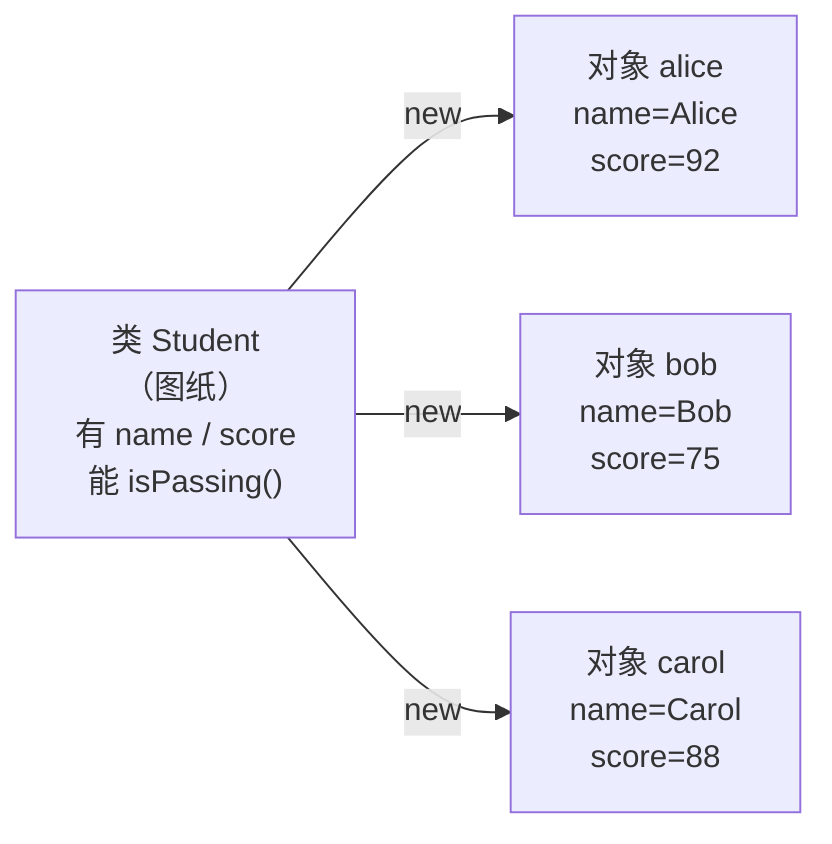
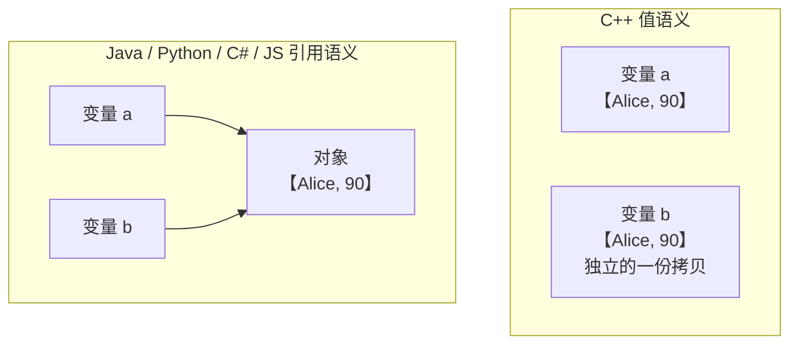

# 第 23 章 · 类

**简体中文** ｜ [English](./23-class.en-US.md)

---

> Part 3 讨论的一直是**数据怎么存**。但真实程序里，数据很少单独存在——它总是和"能对它做什么"绑在一起。学生有姓名和分数，也有"计算绩点""是否及格"这些行为。把两者拆开放，代码很快就会失控。
>
> **类**就是把数据和行为打包成一个整体的机制。这个想法听起来平淡，但它带来的差异是结构性的：从"一堆互不相干的变量和函数"，变成"一个能自己管好自己的东西"。
>
> 本章最需要记住的，是一个会让你在语言间来回踩坑的差异：**同样一行 `b = a`，在 C++ 里是拷贝出一个新对象，在 Java、Python、C#、JavaScript 里却只是给同一个对象起了个别名**。实测中，C++ 改 `b` 完全不影响 `a`，而 Python 和 Java 改 `b` 时 `a` 也跟着变了。这不是谁对谁错，而是**值语义**与**引用语义**的根本分歧。

## 1. 学习目标

本章结束后，你将能够：

- 说清**为什么要把数据和行为绑在一起**，以及不这么做会带来什么问题；
- 定义类、创建实例，并解释**构造函数**和 `this` / `self` 的作用；
- 区分**实例成员**与**静态（类）成员**，并说明它们在内存上的差异；
- 解释 **值语义与引用语义** 的区别，以及它如何影响你写的每一行赋值；
- 说清 **JavaScript 的 `class` 是原型的语法糖**、**Python 的类本身也是对象**这两个语言特性。

---

## 2. 为什么会出现这个概念

假设不用类，只用前面学过的变量和函数来管理学生信息。

**第一步，数据是散的**：

```javascript
let studentName = "Alice";
let studentScore = 92;
let studentAge = 16;
```

**第二步，来了第二个学生**：

```javascript
let studentName2 = "Bob";
let studentScore2 = 75;
let studentAge2 = 17;      // 变量名开始编号，这是失控的信号
```

**第三步，用数组存**——数据之间的关联却丢了：

```javascript
let names = ["Alice", "Bob"];
let scores = [92, 75];
let ages = [16, 17];
// ⚠️ 三个数组必须严格保持顺序一致
// 一旦对 scores 排序而忘了同步另外两个，数据就彻底错位了
```

**第四步，函数和数据分离**：

```javascript
function isPassing(score) { return score >= 60; }
isPassing(ages[0]);        // ⚠️ 传错了参数，语法完全合法，结果毫无意义
```

问题浮现出来了：

| 问题 | 表现 |
|------|------|
| **数据分散** | 描述同一个东西的数据散落各处，靠命名约定维系 |
| **关联脆弱** | 平行数组必须手工保持同步，极易错位 |
| **无法约束** | 任何函数都能接收任何值，编译器帮不上忙 |
| **难以复用** | 每加一个学生就要重复一遍相同的结构 |

**类同时解决了这四个问题**：

```javascript
class Student {
  constructor(name, score, age) {
    this.name = name;
    this.score = score;      // 三个数据打包在一起，永远不会错位
    this.age = age;
  }
  isPassing() { return this.score >= 60; }   // 行为和数据待在一起
}

const alice = new Student("Alice", 92, 16);
alice.isPassing();           // 不可能传错参数，它只会看自己的 score
```

> **一句话**：类把"**一类事物的数据结构**"和"**能对它做什么**"定义在一起，让程序里的概念和现实世界的概念一一对应。

---

## 3. 底层原理

### 类是模板，不是实体

一个最常见的初学误解是把类当成"东西本身"。类其实是**图纸**，对象才是照图纸造出来的**成品**：



图纸只有一张，成品可以有无数个。**每个对象有自己的数据，但共享同一套行为定义**——这一点在下一节的内存讨论里会变得很具体。

### 构造函数：对象诞生的那一刻

**构造函数**回答的是"造一个新对象时，要做哪些初始化"。它的存在保证了**对象从诞生起就处于合法状态**：

```text
new Student("Alice", 92)
      ↓
① 分配一块内存
② 调用构造函数，填入初始数据
③ 返回这个对象（的引用或值）
```

> **为什么这很重要**：没有构造函数的话，你造出的对象可能有一半字段是空的，而使用它的代码无从得知。构造函数是**不变式**（invariant）的第一道防线——比如"分数必须在 0 到 100 之间"这类规则，就应该在这里检查。

### `this` / `self`：方法怎么知道"我是谁"

所有对象共享同一份方法代码，那么 `isPassing()` 执行时，它怎么知道该读**哪个**对象的 `score`？

答案是：**调用方法时，当前对象被隐式（或显式）传了进去**。

```text
alice.isPassing()
   ↓ 实际发生的事
isPassing(alice)      ← 这个"隐藏的第一个参数"就是 this / self
```

**Python 把这件事摆在明面上**——`self` 是方法的第一个正式参数：

```python
def is_passing(self):        # self 就是那个隐藏参数，Python 让你显式写出来
    return self.score >= 60
```

而 Java、C++、C#、JavaScript 把它藏了起来，用关键字 `this` 直接访问。**机制完全一样，只是要不要写出来的区别**。

### 实例成员 vs 静态成员：内存里存几份

这是本章第二个关键区分：

| | 实例成员 | 静态 / 类成员 |
|---|---|---|
| 归属 | **每个对象一份** | **整个类只有一份** |
| 存放 | 对象自己的内存里 | 类的存储区 |
| 访问 | `alice.name` | `Student.count` |
| 适合 | 各对象不同的数据（姓名、分数） | 所有对象共享的东西（学校名、实例计数、常量） |

**实测**（Python）：

```text
a.school = "第一中学"   b.school = "第一中学"
两者是同一个对象吗？ True          ← 类属性只存一份

Student.school = "第二中学"  改类属性后：
a.school = 第二中学   b.school = 第二中学   ← 所有实例都看到了
```

### ⚠️ 值语义 vs 引用语义：本章最重要的差异

同样写 `b = a`，不同语言的含义完全不同。**这是跨语言时最容易出错的地方**。

**C++ 是值语义**——对象就是值，赋值就是拷贝（实测）：

```text
Student a{"Alice", 90};
Student b = a;          // 拷贝出一个全新的对象
b.name = "Bob";

结果: a.name=Alice   b.name=Bob      ← a 完全没受影响
      a 的地址 0x16da8e2c8
      b 的地址 0x16da8e2a8            ← 两个不同的对象
```

**Python / Java / C# / JavaScript 是引用语义**——变量存的是"指向对象的引用"（实测）：

```text
Python:  a = Student("Alice", 90)
         b = a               # 只是给同一个对象起了个别名
         b.name = "Bob"

结果: a.name=Bob   b.name=Bob         ← a 也变了！
      id(a) = id(b)                    ← 根本就是同一个对象

Java:    Student b = a;  b.name = "Bob";
结果: a.name=Bob   b.name=Bob   且 a == b 为 true
```

**两种语义的对照**：



**想在 C++ 里获得引用语义**，要显式用引用或指针：

```cpp
Student& r = a;      // 引用 = 别名
r.name = "Changed";  // 实测：a.name 确实变成了 Changed
```

**想在 Python 里获得值语义**，要显式拷贝：

```python
import copy
c = copy.copy(a)     # 实测：改 c 不影响 a
```

> **为什么会有这个分歧**：C++ 追求"你不用的东西不必付出代价"，对象直接放在栈上最快，所以默认是值。而 Java、Python 这类有垃圾回收的语言，把对象统一放在堆上、变量只持有引用，才能让 GC 统一管理生命周期。**两种选择都是各自设计目标的合理结果**。

---

## 4. JavaScript

JavaScript 的 `class` 是 ES6 引入的，但它**并没有引入新的对象模型**——底层依然是原型。

```javascript
class Student {
  constructor(name, score) {
    this.name = name;
    this.score = score;
  }
  isPassing() { return this.score >= 60; }

  static school = "第一中学";        // 静态属性：属于类
  static create(name) { return new Student(name, 0); }
}

const alice = new Student("Alice", 92);
alice.isPassing();          // true
Student.school;             // "第一中学"
```

### ⚠️ `class` 只是语法糖（实测）

```text
typeof Student                                → "function"   ← 它本质上是个函数！
Object.getOwnPropertyNames(Student.prototype) → ['isPassing']
                                                ← 方法定义在原型上，不在实例上
实例自己有 isPassing 吗？                      → false
实例自己有什么？                               → ['name', 'score']   ← 只有数据
Object.getPrototypeOf(alice) === Student.prototype → true
```

用 ES5 的原型写法可以完全还原它的行为：

```javascript
function OldStudent(name, score) { this.name = name; this.score = score; }
OldStudent.prototype.isPassing = function () { return this.score >= 60; };
// 实测：与 class 写法的输出完全一致
```

> **这解释了一个重要事实**：**方法只存一份**（在原型上），所有实例共享；实例内存里只有自己的数据。这也是为什么 `class` 写法不会因为创建大量对象而复制大量函数。原型链的细节留到第 24 章。

**私有字段**用 `#` 前缀（ES2022，真正的私有，第 25 章详述）：

```javascript
class Account {
  #balance = 0;                    // 外部无法访问
  deposit(n) { this.#balance += n; }
}
```

> **注意事项**：`class` 内部代码自动运行在严格模式下，且**类声明不会被提升**——在定义之前使用会抛 `ReferenceError`，这与 `function` 的行为不同。

---

## 5. Python

Python 的类语法最简洁，但有两个特点需要专门理解。

```python
class Student:
    school = "第一中学"                     # 类属性：所有实例共享

    def __init__(self, name, score):        # 构造函数
        self.name = name                     # 实例属性
        self.score = score

    def is_passing(self):                    # self 是显式的第一个参数
        return self.score >= 60

    @classmethod
    def create(cls, name):                   # cls 是类本身
        return cls(name, 0)

    @staticmethod
    def pass_line():                         # 既不需要实例也不需要类
        return 60
```

### 特点一：`self` 是显式的

其他语言把 `this` 藏起来，Python 让你写出来。这不是啰嗦，而是**把"方法就是第一个参数为对象的函数"这件事摊开讲**：

```python
alice.is_passing()          # 等价于 ↓
Student.is_passing(alice)   # 实际发生的就是这个
```

### 特点二：类本身也是对象（实测）

```text
type(Student)          → <class 'type'>   ← 类的类型是 type
Student 是对象吗？      → True
运行时给类加属性        → Student.motto = "求真"   可以
运行时凭空造一个类      → type("Dynamic", (), {...})   也可以
```

> 在 Python 里，`class` 语句本质上只是"**创建一个类型为 `type` 的对象**"的语法糖。这个特性是装饰器、ORM、各种框架魔法的基础（第 30 章反射会展开）。

### ⚠️ 经典陷阱：给实例赋值不会修改类属性（实测）

```text
a.school = "第三中学"   之后：
  a.school        = 第三中学     ← a 自己多了一个实例属性
  b.school        = 第二中学     ← b 没变
  Student.school  = 第二中学     ← 类属性也没变
  a.__dict__      = {'name': 'Alice', 'school': '第三中学'}
```

**规则**：**读取**时先找实例、找不到再找类；但**赋值**永远是创建/修改实例属性。想改类属性必须写 `Student.school = ...`。

> **注意事项**：**永远不要用可变对象做类属性**（如 `tags = []`）——它会被所有实例共享，一个实例的修改会影响全部。这是 Python 最著名的坑之一，正确做法是在 `__init__` 里初始化。

---

## 6. Java

Java 是纯粹的 class-based 语言——**一切代码都必须写在类里**。

```java
public class Student {
    private String name;                    // 实例字段
    private int score;
    private static int count = 0;           // 静态字段：整个类共享
    public static final int PASS_LINE = 60; // 静态常量

    public Student(String name, int score) {   // 构造函数：与类同名，无返回类型
        this.name = name;                       // this 区分参数与字段
        this.score = score;
        count++;
    }

    public boolean isPassing() { return score >= PASS_LINE; }

    public static int getCount() { return count; }   // 静态方法
}
```

**Java 14+ 的 `record`**——专门用来表达"只是一堆数据"的类：

```java
public record Point(int x, int y) { }
// 自动获得构造函数、getter、equals、hashCode、toString
// 而且是不可变的
```

> `record` 是个很实用的改进。回顾第 20 章：手写 `equals` 却忘了 `hashCode` 会导致 `HashMap` 存进去查不到——`record` 帮你把这对方法一起生成，从设计上避免了那个坑。

> **注意事项**：Java 的对象**永远在堆上**，变量持有的是引用——这就是前面实测中 `b = a` 后改 `b` 会影响 `a` 的原因。Java 没有 C++ 那样的栈上对象。

---

## 7. C++

C++ 的类与其他语言差异最大，因为它要同时支持值语义和引用语义。

```cpp
class Student {
private:
    std::string name;
    int score;
    static int count;                       // 静态成员：类内声明

public:
    Student(std::string n, int s)           // 构造函数
        : name(std::move(n)), score(s) {    // 初始化列表（比在函数体里赋值更高效）
        count++;
    }
    ~Student() { count--; }                 // ⚠️ 析构函数：其他语言没有

    bool isPassing() const { return score >= 60; }   // const 表示不修改对象

    static int getCount() { return count; }
};

int Student::count = 0;                      // 静态成员必须在类外定义
```

### ⚠️ 三个 C++ 独有的关键点

**① 对象可以在栈上**——这是值语义的根源：

```cpp
Student a("Alice", 92);              // 栈上对象，函数结束自动销毁
Student* p = new Student("Bob", 75); // 堆上对象，必须 delete（或用智能指针）
delete p;
```

**② 析构函数与 RAII**——对象销毁时自动调用，这是 C++ 管理资源的核心手段：

```cpp
{
    Student s("Alice", 92);
}   // 离开作用域，析构函数自动调用，资源自动释放
```

> 这就是 **RAII**（资源获取即初始化）。文件句柄、锁、内存都能靠它自动释放——**不需要 GC，也不会忘记释放**。这是 C++ 用值语义换来的最大好处。

**③ `struct` 与 `class` 只差默认可见性**：

```cpp
struct A { int x; };     // 默认 public
class  B { int x; };     // 默认 private
```

> **注意事项**：C++ 的构造函数应优先使用**初始化列表**（`: name(n), score(s)`）而不是在函数体里赋值——后者会先默认构造再赋值，多做一遍无用功。

---

## 8. C#

C# 的类语法接近 Java，但有几个显著改进。

```csharp
public class Student
{
    public string Name { get; }              // 属性：比字段+getter 简洁
    public int Score { get; private set; }    // 外部只读，内部可写
    private static int _count = 0;
    public const int PassLine = 60;

    public Student(string name, int score)    // 构造函数
    {
        Name = name;
        Score = score;
        _count++;
    }

    public bool IsPassing() => Score >= PassLine;   // 表达式体成员
    public static int Count => _count;
}
```

### C# 的三个特色

**① 属性（property）**——看起来像字段，实际是方法：

```csharp
public int Score { get; private set; }
// 调用方写 student.Score，读起来像字段，但背后可以加校验逻辑
```

**② `record`**（C# 9+）——不可变数据类，且**基于值比较**：

```csharp
public record Point(int X, int Y);

var a = new Point(1, 2);
var b = new Point(1, 2);
a == b;        // true ← 比较的是值，不是引用
```

> 这一点值得和第 20 章对照：普通 `class` 的 `==` 比较引用，而 `record` 自动实现了基于值的 `Equals` 和 `GetHashCode`——**从设计上防止了"存进哈希表却查不到"的坑**。

**③ `struct` 是值类型**——C# 是这几门语言里唯一让你**自己选择**值语义还是引用语义的：

```csharp
public struct PointV { public int X, Y; }    // 值类型：赋值即拷贝，栈上分配
public class  PointR { public int X, Y; }    // 引用类型：赋值即别名，堆上分配
```

> **注意事项**：`struct` 适合小而不可变的数据（坐标、颜色、日期）。大对象用 `struct` 反而更慢——每次传递都要完整拷贝。

---

## 9. SQL

**SQL 没有类**——它是关系模型，不是对象模型。但两者之间有清晰的对应关系。

### ① 表就是"数据部分"的类

```sql
CREATE TABLE student (
    id     INTEGER PRIMARY KEY,
    name   TEXT NOT NULL,          -- 对应类的字段
    score  INTEGER CHECK (score BETWEEN 0 AND 100)   -- 对应构造函数里的校验
);
```

| 面向对象 | 关系数据库 |
|---------|-----------|
| 类 | 表 |
| 字段 / 属性 | 列 |
| 对象 / 实例 | 行 |
| 对象标识 | 主键 |
| 类型约束 | 列类型 + `CHECK` |

> **注意 `CHECK` 约束**：它扮演的角色正是构造函数里的合法性校验——**保证数据从写入那一刻起就是合法的**。

### ② 行为放在哪里

关系模型里没有"方法"，但有几种承载行为的方式：

```sql
-- 视图：把"计算出来的属性"固定下来，类似只读的计算属性
CREATE VIEW student_status AS
SELECT id, name, score,
       CASE WHEN score >= 60 THEN '及格' ELSE '不及格' END AS status
FROM student;

-- 触发器：类似"数据变更时自动执行的行为"
CREATE TRIGGER check_score BEFORE INSERT ON student
BEGIN
    SELECT CASE WHEN NEW.score < 0
        THEN RAISE(ABORT, '分数不能为负') END;
END;
```

### ③ 阻抗失配：ORM 要解决的问题

对象模型和关系模型的差异被称为**阻抗失配**（impedance mismatch）：

| 差异点 | 对象 | 关系 |
|--------|------|------|
| 标识 | 内存地址 / 引用 | 主键 |
| 关联 | 直接持有对象引用 | 外键 + JOIN |
| 继承 | 天然支持 | **没有对应概念** |
| 集合 | 对象里放一个 List | 需要单独一张表 |

**ORM**（对象关系映射，如 Hibernate、SQLAlchemy、Entity Framework）就是为弥合这道鸿沟而生。

> **工程提醒**：ORM 让对象和表的映射变得方便，但也容易掩盖真实的 SQL 开销——**N+1 查询**（第 11 章）就是最典型的后果。用 ORM 时务必知道它生成了什么 SQL。

---

## 10. 五语言横向对比

### ① 语法与机制对照

| 特性 | JavaScript | Python | Java | C++ | C# |
|------|-----------|--------|------|-----|-----|
| 定义 | `class` | `class` | `class` | `class` / `struct` | `class` / `struct` |
| 底层模型 | **原型** | 类即对象 | class-based | class-based | class-based |
| 构造函数 | `constructor` | `__init__` | 与类同名 | 与类同名 | 与类同名 |
| 当前对象 | `this`（隐式） | **`self`（显式）** | `this` | `this`（指针） | `this` |
| **默认语义** | 引用 | 引用 | 引用 | **值** | 引用（`class`）/ **值**（`struct`） |
| 析构 | GC | GC（`__del__` 不可靠） | GC | **析构函数 + RAII** | GC（`IDisposable`） |
| 静态成员 | `static` | 类属性 | `static` | `static` | `static` |
| 数据类简写 | — | `@dataclass` | `record` | — | `record` |

### ② 三个最值得记住的差异

**① 只有 C++ 默认是值语义**（C# 可以用 `struct` 选择）。这直接决定了 `b = a` 的含义——**跨语言写代码时最容易踩的坑**。

**② 只有 JavaScript 底层是原型**。`class` 只是语法糖（实测 `typeof Student === "function"`），方法定义在原型上而非实例上。

**③ 只有 Python 把 `self` 显式写出来**，也只有 Python 让类本身成为可操作的对象（实测可运行时造类）。

### ③ 共同点与差异根源

**共同点**：五门语言都提供了"把数据和行为打包"的机制，都有构造函数，都区分实例成员与静态成员——因为**这些是面向对象的本质需求，与语言无关**。

**差异根源**：

- **C++ 的值语义**源于"零开销抽象"——不该为不用的特性付出代价，栈上对象最快；
- **Java/C#/Python 的引用语义**源于**垃圾回收的需要**——对象统一在堆上，GC 才好统一管理；
- **JavaScript 的原型**源于它诞生时的设计选择（第 01 章），`class` 是后来为易用性加的外衣；
- **`record` / `@dataclass` 的出现**说明了一个共同趋势：**大量的类只是数据容器**，语言开始为这个常见场景提供简写。

---

## 11. 底层实现对比

| 语言 | 对象存放 | 变量持有 | 方法存放 |
|------|---------|---------|---------|
| **JavaScript** | 堆 | 引用 | **原型对象上（共享一份）** |
| **Python** | 堆 | 引用 | 类的 `__dict__` 里（共享一份） |
| **Java** | **堆（永远）** | 引用 | 方法区（共享一份） |
| **C++** | **栈或堆（你决定）** | **值或引用/指针** | 代码段（共享一份） |
| **C#** | `class` 堆 / `struct` 栈 | 引用 / 值 | 方法区（共享一份） |

**一个所有语言都成立的事实**：**方法代码只存一份，被所有实例共享**。对象内存里只有各自的数据。

这解释了为什么创建一百万个对象不会产生一百万份方法代码——你在实测中已经看到了：JavaScript 实例的 `getOwnPropertyNames` 只有 `['name']`，方法全在原型上。

---

## 12. 性能分析

### 概念开销

| 操作 | 典型开销 | 说明 |
|------|---------|------|
| 创建对象 | 分配内存 + 构造函数 | 引用语义语言还要 GC 记账 |
| 访问实例字段 | 一次内存读 | 通常是"对象基址 + 固定偏移"（第 16 章的地址计算） |
| 调用方法 | 一次函数调用 | 非虚方法可被内联；虚方法见第 27 章 |
| 访问静态成员 | 一次内存读 | 地址在编译期/加载期确定 |

### 值语义与引用语义的代价

| | 值语义（C++ / C# struct） | 引用语义 |
|---|---|---|
| 赋值 / 传参 | **拷贝整个对象**（对象大时贵） | 只拷贝一个引用（恒定成本） |
| 内存局部性 | **好**（数据直接内联，第 16 章） | 较差（要跟指针跳转） |
| 生命周期 | 作用域结束自动销毁 | 交给 GC |
| 大对象 | ⚠️ 拷贝代价高 | 无所谓 |

> **实践含义**：C++ 里传大对象要用 `const&` 避免拷贝；C# 里 `struct` 只适合小数据。**这不是优化技巧，而是理解语义后的自然结论**。

> ⚠️ 本节不给具体毫秒数——对象创建的开销高度依赖运行时、GC 策略、对象大小和 JIT 优化。**如果你关心具体数字，请在自己的场景下实测**（这是 Part 3 反复得到的教训）。

---

## 13. 工程实践

| 场景 | ✅ 推荐 | ❌ 不推荐 | 原因 |
|------|--------|----------|------|
| 一组总是一起出现的数据 | 定义类 | 平行数组 / 多个变量 | 避免错位、便于复用 |
| 纯数据容器 | `record` / `@dataclass` | 手写全套样板代码 | 少写错、自动正确实现比较 |
| 对象合法性校验 | 放在构造函数里 | 创建后再检查 | 保证对象从诞生起就合法 |
| 所有实例共享的常量 | 静态成员 | 每个实例存一份 | 省内存、语义更准 |
| Python 类属性 | 不可变值 | **可变对象（`[]`、`{}`）** | 会被所有实例共享 |
| C++ 传递大对象 | `const Student&` | 按值传 | 避免整个对象拷贝 |
| C# 小而不变的数据 | `struct` | `class` | 省去堆分配 |
| 跨语言迁移代码 | **先确认 `b = a` 的语义** | 想当然 | 值/引用差异会导致隐蔽 bug |
| 对象存数据库 | 明确映射关系 | 依赖 ORM 魔法 | 避免 N+1（第 11 章） |

**什么时候不需要类**：

```text
- 纯函数式的数据变换 —— 函数本身就够了
- 只有一个实例且没有状态 —— 一个模块 / 命名空间足矣
- 只是给函数分组 —— 别为了"面向对象"而造一个只有静态方法的类
```

> 类是**工具**不是**目的**。把三个不相关的函数塞进一个类里，并不会让代码更"面向对象"。

---

## 14. 最佳实践

- **一个类只描述一件事**——如果你在类名里用了"And"，它大概该拆成两个。
- **让构造函数保证对象合法**，把校验放在这里而不是散落各处。
- **优先使用 `record` / `@dataclass`** 来表达纯数据，少写样板代码也少犯错。
- **明确知道你所用语言的赋值语义**——这是跨语言最大的认知陷阱。
- **Python 里绝不用可变对象做类属性**，改在 `__init__` 中初始化。
- **C++ 中优先用初始化列表**，并对大对象用 `const&` 传参。
- **静态成员只用于真正属于类而非对象的东西**（计数、常量、工厂方法）。

---

## 15. 常见坑

**坑 1 · 跨语言时误判 `b = a` 的语义**

```text
C++:    b = a  → 拷贝，改 b 不影响 a
Python: b = a  → 别名，改 b 就是改 a
```
**如何避免**：换语言时第一件事就是确认这门语言的默认语义。

**坑 2 · Python 用可变对象做类属性**

```python
class Student:
    tags = []                    # ✗ 所有实例共享同一个列表！
a, b = Student(), Student()
a.tags.append("优秀")
print(b.tags)                    # ['优秀'] ← b 也被改了
```
**如何避免**：写在 `__init__` 里：`self.tags = []`。

**坑 3 · 以为给实例赋值能改类属性**

```python
a.school = "第三中学"            # ✗ 只是创建了实例属性
print(Student.school)            # 类属性纹丝不动
```
**如何避免**：改类属性要写 `Student.school = ...`。

**坑 4 · JavaScript 中丢失 `this`**

```javascript
const fn = alice.isPassing;
fn();                            // ✗ this 是 undefined
```
**如何避免**：用箭头函数或 `bind`——`this` 由**调用方式**决定，不是由定义位置决定。

**坑 5 · 在构造函数里做重活**

```java
public Student(String name) {
    this.data = loadFromDatabase(name);   // ✗ 构造函数里访问数据库
}
```
**如何避免**：构造函数只做初始化；耗时或可能失败的操作放到工厂方法里。

**坑 6 · C++ 忘记初始化列表**

```cpp
Student(std::string n) { name = n; }        // ✗ 先默认构造 name 再赋值
Student(std::string n) : name(std::move(n)) {}   // ✓ 直接构造
```

**坑 7 · 用只有静态方法的类冒充命名空间**

```java
class Utils {                    // ⚠️ 这不是"面向对象"，只是函数的集合
    static int add(int a, int b) { return a + b; }
}
```
**如何避免**：这种情况本身没错，但别误以为这就是 OOP。

---

## 16. 面试题

**基础**

1. 类和对象有什么区别？
2. 构造函数的作用是什么？为什么它很重要？
3. 实例成员和静态成员有什么区别？在内存里各存几份？

**中级**

4. `this` / `self` 是什么？方法是如何知道自己属于哪个对象的？
5. **值语义和引用语义有什么区别？** 举例说明 `b = a` 在 C++ 和 Java 里的不同结果。
6. 为什么方法代码只存一份，而字段每个对象一份？

**高级**

7. **JavaScript 的 `class` 和 ES5 的原型写法有什么关系？** 如何用实验证明？
8. Python 中"类本身也是对象"意味着什么？它带来了哪些可能性？
9. C++ 的析构函数和 RAII 解决了什么问题？为什么有 GC 的语言没有这个机制？

---

## 17. 练习

**基础**

1. 用六门语言各定义一个 `Student` 类，包含姓名、分数和"是否及格"方法。
2. 给类加上静态成员，统计一共创建了多少个实例。
3. 把本章开头"平行数组"的例子改写成类，体会两者的差异。

**提高**

4. 实测 `b = a` 在 C++ 与 Python/Java 中的不同结果，并打印地址/id 佐证。
5. 用实验证明 JavaScript 的方法定义在原型上而非实例上。
6. 演示 Python 里"给实例赋值不会改类属性"，并打印 `__dict__` 说明原因。

**挑战**

7. 用 Python 的 `type()` 在运行时动态创建一个类，并给它添加方法。
8. 在 C++ 中实现一个 RAII 风格的类（如自动关闭的文件包装器），验证离开作用域时资源被自动释放。
9. 设计一个 `Student` 类并把它映射到数据库表，说明哪些部分无法直接映射（阻抗失配）。

---

## 18. 本章总结

**一句话总结**：类把**数据**和**能对数据做什么**打包成一个整体，解决了"数据分散、关联脆弱、无法约束、难以复用"四个问题；它是模板，对象才是实例；而各语言最根本的分歧在于 **`b = a` 到底是拷贝还是起别名**——C++ 默认值语义，Java / Python / C# / JavaScript 默认引用语义。

**核心知识点**

- **类是图纸，对象是成品**；每个对象有自己的数据，但**方法代码只存一份**（实测：JS 实例只有 `['name']`，方法全在原型上）。
- **构造函数保证对象从诞生起就合法**，校验应该放在这里。
- **`this` / `self` 是隐藏的第一个参数**——Python 只是把它显式写了出来。
- **值语义 vs 引用语义**是本章最重要的差异（实测：C++ 改 `b` 不影响 `a`，Python/Java 会）。
- **JavaScript 的 `class` 是原型语法糖**（实测 `typeof Student === "function"`）。
- **Python 的类本身是对象**（实测可运行时造类），这是框架魔法的基础。
- **Python 陷阱**：给实例赋值创建的是实例属性，不会修改类属性。

**检查清单**

- [ ] 我能说清为什么要把数据和行为绑在一起。
- [ ] 我能解释构造函数、`this` / `self` 的作用。
- [ ] 我能区分实例成员与静态成员，并说出它们各存几份。
- [ ] 我知道我正在用的语言中 `b = a` 意味着什么。
- [ ] 我能解释 JavaScript 的 `class` 与原型的关系。

**下一章预告**：本章我们把类当成一张"图纸"来用。但当 `new` 真正执行时，内存里究竟发生了什么？对象的字段是怎么排布的？为什么有的语言对象比你想象中大得多？为什么 JavaScript 找不到属性时会"往上找"？第 24 章「对象」将掀开这层盖子，看看**对象在内存里的真实样子**。

---

## 19. 延伸阅读

- <a href="https://en.wikipedia.org/wiki/Class_(computer_programming)" target="_blank" rel="noopener">Wikipedia：类（程序设计）</a> — 概念起源与各语言实现差异。
- <a href="https://en.wikipedia.org/wiki/Object-oriented_programming" target="_blank" rel="noopener">Wikipedia：面向对象编程</a> — OOP 的历史、争议与设计取舍。
- <a href="https://developer.mozilla.org/en-US/docs/Web/JavaScript/Reference/Classes" target="_blank" rel="noopener">MDN · JavaScript Classes</a> — 含私有字段与静态成员的完整说明。
- <a href="https://docs.python.org/3/tutorial/classes.html" target="_blank" rel="noopener">Python 官方教程 · 类</a> — 含类属性与实例属性的查找规则。
- <a href="https://dev.java/learn/classes-objects/" target="_blank" rel="noopener">dev.java · Classes and Objects</a> — Oracle 官方 Java 学习站点。
- <a href="https://en.cppreference.com/w/cpp/language/classes" target="_blank" rel="noopener">cppreference · Classes</a> — 构造、析构与初始化列表的权威说明。
- <a href="https://learn.microsoft.com/en-us/dotnet/csharp/fundamentals/types/classes" target="_blank" rel="noopener">Microsoft Learn · C# Classes</a> — 含 `class` 与 `struct` 的选择建议。
