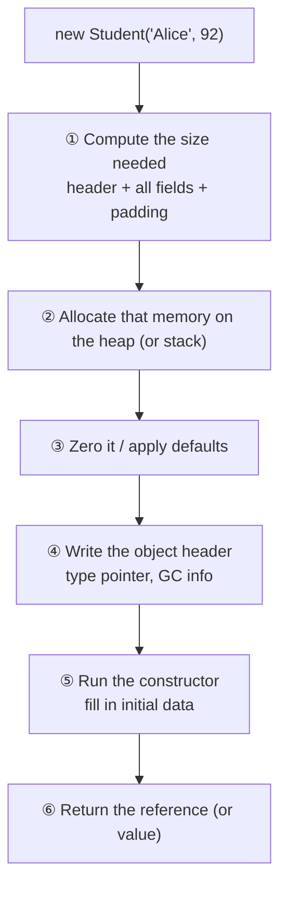

# Chapter 24 · Objects

[简体中文](./24-object.md) ｜ **English**

---

> The previous chapter treated a class as a blueprint. This chapter lifts the lid: **when `new` actually runs, what happens in memory?**
>
> Three measurements here defy intuition. First: **the same fields, merely declared in a different order, shrink an object from 12 bytes to 8** — a third saved, which is several megabytes across a million objects. Second: **a Java object holding just one `int` measures 16 bytes**, while the `int` itself needs only 4 — the rest is an object header you cannot opt out of. Third: **adding one line, `__slots__`, takes a Python object from 152 bytes to 48** — 68% saved.
>
> Understanding object layout is what lets you explain why some programs use absurd amounts of memory, why property access has fast and slow paths, and why these languages made completely different choices about the same problem.

## 1. Learning Objectives

By the end of this chapter, you will be able to:

- Describe **the full sequence `new` performs**, and what parts make up an object in memory;
- Explain **alignment and padding**, and shrink objects by reordering fields;
- Explain the **object header** and its cost, and why the overhead ratio for small objects is startling;
- Explain **JavaScript's prototype chain lookup** and **Python's `__dict__`**, and why both are slower than fixed layout;
- Actually reduce memory usage with `__slots__`, `struct`, and field reordering.

---

## 2. Why This Concept Exists

The previous chapter said "a class is a blueprint, an object is the product." But **what does the product actually look like?** This is not academic curiosity — it directly determines three things:

| Question | Determined by layout |
|----------|---------------------|
| **How much memory the program uses** | A million objects at 8 MB or 150 MB |
| **How fast property access is** | One step at "base + fixed offset," or a hash lookup, or a walk up a chain |
| **Whether caching helps** | Only compact, contiguous data has cache locality (Chapter 16) |

**A concrete example**: the same concept of a "point" can differ tenfold in actual size across languages.

```text
C++  struct Point { int x, y; }      → 8 bytes (just two ints, zero overhead)
Java class Point { int x, y; }       → 16 bytes (12-byte header + 8 bytes data, aligned to 16)
Python class Point                   → 152 bytes (48-byte object + 104-byte __dict__)
```

> This does not mean Python is badly built — **every byte of overhead buys some capability**: Java's header buys GC, locking, and runtime type information; Python's `__dict__` buys the ability to add attributes at any moment. This chapter is about **what exactly those trades consist of**.

---

## 3. How It Works

### What happens when `new` runs



**Step ① is this chapter's core** — the answer to "how much space is needed" is more involved than you might think.

### The three parts of an object

```text
┌─────────────────────────────────────┐
│  Object header                      │ ← metadata the runtime needs
│  · Type pointer: which class am I   │
│  · GC info: age, mark bits          │
│  · Lock state, hash code (Java's mark word) │
├─────────────────────────────────────┤
│  Instance fields                    │ ← the data you declared
│  · In declaration order (or reordered by the compiler) │
├─────────────────────────────────────┤
│  Padding                            │ ← space wasted to satisfy alignment
└─────────────────────────────────────┘
```

**Note that only the instance fields are "what you wanted"** — the other two parts are cost. The smaller the object, the more absurd that cost ratio becomes.

### ⚠️ Alignment: the least intuitive part of this chapter

CPUs do not read memory byte by byte at arbitrary addresses; they read in blocks and require **certain types to sit at addresses that are multiples of a given size**:

```text
char   size 1, must align to a multiple of 1
int    size 4, must align to a multiple of 4
double size 8, must align to a multiple of 8
```

So compilers insert **padding bytes** to satisfy this. Consider this measurement:

```cpp
struct Bad  { char c; int i; char d; };   // → 12 bytes
struct Good { int i; char c; char d; };   // → 8 bytes
```

**The same three fields, reordered, save 33%.** Printing the actual offsets shows why:

```text
Bad layout:
  c at offset 0      1 byte
  ▒▒▒ offsets 1-3    ← 3 padding bytes! int must sit at a multiple of 4
  i at offset 4      4 bytes
  d at offset 8      1 byte
  ▒▒▒ offsets 9-11   ← 3 trailing padding bytes (the whole struct aligns to 4)
  total 12 bytes

Good layout:
  i at offset 0      4 bytes
  c at offset 4      1 byte
  d at offset 5      1 byte
  ▒▒ offsets 6-7     ← only 2 padding bytes
  total 8 bytes
```

**An even starker example** (measured):

| Definition | Size |
|------------|-----:|
| `struct Bad2 { char a; double d; char b; int i; };` | **24 bytes** |
| `struct Good2 { double d; int i; char a; char b; };` | **16 bytes** |

Also 33% saved. **Across a million objects, that is 7.6 MB.**

> **The rule**: **declare fields from largest to smallest** to cut padding substantially. It is an optimization that costs one line of change — but don't overdo it: readability usually beats a few bytes, unless you genuinely handle enormous object counts.

### The object header: overhead you cannot escape

**Java, measured** (a million objects holding one `int`, consistent across three runs):

```text
About 16 bytes per object
while the int itself needs only 4 bytes
```

Those extra 12 bytes are the **object header**:

| Component | Size (64-bit HotSpot, compressed pointers) | Purpose |
|-----------|:---:|---------|
| **mark word** | 8 bytes | Hash code, GC generation age, lock state |
| **Type pointer** | 4 bytes | Points to class metadata ("who am I") |
| Data | 4 bytes | The `int` you actually wanted |
| **Total** | 16 bytes | (aligned to a multiple of 8) |

> **This explains a familiar phenomenon**: storing a hundred million integers in an `ArrayList<Integer>` blows up memory, while an `int[]` handles it comfortably. The former is a hundred million objects (16 bytes each plus a 4-byte reference); the latter is one contiguous block of 400 million bytes.

> ⚠️ **On methodology**: the number above was estimated from `Runtime` memory deltas with warm-up and GC. It matches HotSpot's documented layout rules, but **precise measurement should use JOL** (see Further Reading). Different JVMs and heap sizes (compressed pointers stop applying above 32 GB) give different results.

### Three implementations of property access

This is the key to understanding performance differences. **The same `obj.x` may be three entirely different operations underneath.**

**① Fixed offset** (C++, Java, C#, Rust) — the compiler knows at build time that `x` is at offset 4:

```text
read obj.x  →  read 4 bytes from [object address + 4]     ← one memory access, fastest
```

**② Hash lookup** (Python's `__dict__`, JS dictionary mode):

```text
read obj.x  →  look up the key "x" in the object's own hash table   ← hashing + lookup (Chapter 20)
```

**③ Walking the prototype chain** (JavaScript) — not here? look upward:

```text
read d.speak  →  does d have it? no
              →  does Dog.prototype? no
              →  does Animal.prototype? yes!     ← three levels searched
```

**JS prototype chain, measured**:

```text
Level 0: Dog instance      owns []
Level 1: Dog.prototype     owns ['bark']
Level 2: Animal.prototype  owns ['speak']
Level 3: Object.prototype  owns ['toString', 'hasOwnProperty', ...]
```

> **Deeper lookups are slower**, which is why JS engines invest heavily in optimization — **inline caches** (remembering where a property was found last time) and **hidden classes** (giving identically shaped objects a fixed layout). This is also why "**always initialize the same properties in the same order**" makes JS faster: identically shaped objects can share a hidden class.

### Python's `__dict__` and `__slots__`

Python gives **every instance its own hash table** (`__dict__`) by default, which grants enormous dynamism — you can add attributes whenever you like. The cost is memory:

**Measured**:

| Definition | Object body | `__dict__` | Total |
|------------|:-----------:|:----------:|------:|
| Ordinary class | 48 bytes | 104 bytes | **152 bytes** |
| `__slots__` class | 48 bytes | none | **48 bytes** |

**104 bytes saved, about 68%. Across a million objects, 99.2 MB.**

```python
class WithSlots:
    __slots__ = ("x", "y")     # declares that only these two attributes exist
```

The cost is **losing dynamism** (measured):

```text
Adding a new attribute to a slots instance → AttributeError: 'WithSlots' object has no attribute 'z'
```

> `__slots__` turns a Python object from a hash table into a fixed-offset, array-like layout — **essentially back into a C struct**. It is a textbook trade of flexibility for memory and speed.

### Value types and boxing

Both C# and Java face the problem of "putting a value type where an object is required," solved by **boxing** — allocating a heap object and copying the value into it:

```csharp
int n = 42;              // 4 bytes on the stack
object boxed = n;        // allocates a heap object and copies 42 into it
```

**Measured cost** (ten million iterations):

| Operation | Time |
|-----------|-----:|
| Direct accumulation | 6–11 ms |
| Accumulation with boxing | 29–30 ms |

**About 3–5× slower** (the range across several runs). And **boxing twice yields two distinct objects**:

```text
object b1 = m, b2 = m;
ReferenceEquals(b1, b2) → False    ← boxing copies
```

> ⚠️ The ratio fluctuates with the environment (the lesson Part 3 taught repeatedly). **Remember the conclusion "boxing has a real cost"**; measure the specific number yourself.

---

## 4. JavaScript

JavaScript objects are **dynamic property collections**, implemented far more intricately than they appear.

### Two internal representations

V8 and other modern engines maintain two paths for objects:

| Mode | When used | Property access |
|------|-----------|-----------------|
| **Hidden class (fast mode)** | Object shape is stable | **Near fixed-offset, fast** |
| **Dictionary (slow mode)** | Frequent add/delete, too many properties | Hash lookup, slower |

```javascript
// ✅ Same shape — both objects can share one hidden class
const a = { x: 1, y: 2 };
const b = { x: 3, y: 4 };

// ❌ Different order — a different hidden class, no shared optimization
const c = { y: 4, x: 3 };

// ❌ Added later — triggers a hidden class transition
const d = { x: 1 };
d.y = 2;
```

> **Practical consequence**: **initialize every property in the constructor, in a consistent order.** This is not superstition; it lets the engine give the whole batch one hidden class.

### Prototype chain lookup

```javascript
class Animal { speak() { return "..."; } }
class Dog extends Animal { bark() { return "Woof"; } }

const d = new Dog();
Object.hasOwn(d, "bark");             // false ← the instance doesn't own it
Object.hasOwn(Dog.prototype, "bark"); // true  ← it's on the prototype
d.speak();                             // found only two levels up
```

**Inspecting an object's full prototype chain**:

```javascript
let cur = d;
while (cur !== null) {
  console.log(Object.getOwnPropertyNames(cur));
  cur = Object.getPrototypeOf(cur);
}
```

### The cost of deleting properties

```javascript
delete obj.x;      // ⚠️ may demote the object from fast mode to dictionary mode
obj.x = undefined; // ✓ usually better: the shape stays the same
```

> **Note**: `delete` is semantically clean, but it changes the object's shape. In hot code, setting a property to `undefined` or `null` is usually faster — **unless you genuinely need `in` to return `false`**.

---

## 5. Python

The core of Python objects: **everything is an object, and every object carries a reference count and a type pointer.**

### Baseline overhead

```python
import sys
sys.getsizeof(1)        # 28 bytes ← even a "small integer" is a full object
sys.getsizeof("")       # 49 bytes
sys.getsizeof([])       # 56 bytes
```

> This is the root of Python's memory footprint: **there are no bare values; everything is a headed object.** For bulk numeric work, use `array`, `numpy`, or `bytes` — they store data compactly and bypass the per-object overhead.

### `__dict__`: the price of flexibility

```python
class Point:
    def __init__(self, x, y):
        self.x, self.y = x, y

p = Point(1, 2)
p.__dict__          # {'x': 1, 'y': 2} ← one hash table per instance
p.z = 3             # attributes can be added any time — it's just a hash table insert
```

### `__slots__`: buying performance back

```python
class Point:
    __slots__ = ("x", "y")      # fixed layout, no more __dict__
    def __init__(self, x, y):
        self.x, self.y = x, y
```

**Measured comparison**:

| | Ordinary class | `__slots__` |
|---|:---:|:---:|
| One object | 152 bytes | **48 bytes** |
| One million | ~145 MB | **~46 MB** |
| Add an attribute | ✅ yes | ❌ `AttributeError` |
| Has `__dict__` | ✅ | ❌ |

**When to use `__slots__`**:

```text
✅ You create many instances (hundreds of thousands or more)
✅ The attribute set is fixed, with no dynamic additions
✅ Performance-sensitive data classes
❌ You need to add attributes dynamically
❌ There are only a few dozen instances (the savings are meaningless)
```

> **Note**: subclasses must declare `__slots__` too, or their instances regain a `__dict__` and the optimization is undone.

---

## 6. Java

Java's object layout is the most *determined* of the group — both the JVM specification and the HotSpot implementation define clear rules.

### The composition of an object

```text
┌──────────────────────────┐
│ mark word      8 bytes   │ hash code / GC age / lock state
│ Type pointer   4 bytes   │ points to Class metadata (4 bytes with compressed pointers)
├──────────────────────────┤
│ Instance fields   ...    │ the JVM reorders fields to cut padding
├──────────────────────────┤
│ Padding           ...    │ rounds up to a multiple of 8
└──────────────────────────┘
```

**Measured**:

| Class | Measured size | Arithmetic |
|-------|-------------:|------------|
| One `int` | **16 bytes** | 12-byte header + 4 = 16, already a multiple of 8, **zero padding** |
| Two `int`s | **24 bytes** | 12-byte header + 8 = 20 → rounded to 24, **4 bytes wasted** |

> Note that the single-`int` object is actually the ideal case: not one byte of padding is wasted in its 16 bytes — but **12 of those bytes are pure header**, and the data you wanted occupies only 4.

### The JVM reorders fields for you

Unlike C++, **Java does not guarantee declaration order** — the JVM actively reorders to reduce padding:

```java
class Mixed {
    byte a;      // declared as byte, long, byte, int
    long b;
    byte c;
    int d;
}
// The JVM may lay it out as long, int, byte, byte — doing automatically
// what C++ requires you to do by hand.
```

> So the "reorder your fields by hand" advice from Section 3 does not apply to Java programmers — **the JVM already did it**. Understanding the principle still matters, because it explains where object size comes from.

### The cost of wrapper types

```java
int[] a = new int[10_000_000];               // about 40 MB
Integer[] b = new Integer[10_000_000];       // 40 MB of references + 160 MB of objects
List<Integer> c = new ArrayList<>();          // worse: boxing plus ArrayList's own overhead
```

> **This is a classic source of Java performance problems.** On hot paths handling bulk numbers, use primitive arrays or a specialized primitive collection library.

### Inspecting the real layout

```java
// with the org.openjdk.jol:jol-core dependency
System.out.println(ClassLayout.parseClass(Student.class).toPrintable());
```

> **Note**: JOL is the authoritative tool for Java object layout, printing every field's offset and padding exactly. **Do not guess or estimate** — which is precisely why the measurement at the start of this chapter is annotated "precise measurement should use JOL."

---

## 7. C++

C++ gives you **complete control over layout**, and therefore demands the clearest understanding.

### `sizeof`, `alignof`, `offsetof`

```cpp
#include <cstddef>

struct Point { int x; int y; };

sizeof(Point);            // 8
alignof(Point);           // 4 ← the strictest alignment among the fields
offsetof(Point, y);       // 4 ← y's offset
```

### The effect of field order (measured)

```cpp
struct Bad  { char c; int i; char d; };   // 12 bytes
struct Good { int i; char c; char d; };   // 8 bytes ← 33% saved
```

**C++ will not reorder fields for you** (the standard guarantees declaration order within an access level), so **this is your responsibility**.

### No object header

```cpp
struct Point { int x, y; };
sizeof(Point);            // 8 — exactly two ints, not one byte more
```

> This is one of C++'s core advantages: **you don't pay for what you don't use.** No GC means no GC metadata; no runtime reflection means no type pointer — unless you use virtual functions:

```cpp
struct WithVirtual { virtual void f() {} int x; };
sizeof(WithVirtual);      // 16 — plus a vptr (vtable pointer, Chapter 27)
```

### Controlling layout

```cpp
#pragma pack(push, 1)     // remove padding (use with care!)
struct Packed { char c; int i; };   // 5 bytes instead of 8
#pragma pack(pop)

struct alignas(64) CacheAligned { int x; };  // force 64-byte (cache line) alignment
```

> **Note**: `#pragma pack(1)` saves space, but **unaligned access is slower and can crash on some architectures**. Use it only for network protocols, file formats, and other strictly specified layouts. `alignas(64)` is commonly used to avoid false sharing in multithreaded code (covered in Part 6).

---

## 8. C#

C# has both reference and value types, so it has two sets of layout rules.

### `class` vs. `struct` layout

```csharp
class PointClass { public int X, Y; }     // heap: 16-byte header + 8 bytes of data
struct PointStruct { public int X, Y; }   // stack or inline: exactly 8 bytes, no header
```

```csharp
Unsafe.SizeOf<PointStruct>();   // 8
// class instance size requires a diagnostic tool to inspect
```

### ⚠️ Boxing: the hidden cost of value types

```csharp
int n = 42;
object boxed = n;         // boxing: heap allocation, value copied in
int back = (int)boxed;    // unboxing: copied back
```

**Measured** (ten million iterations):

| Operation | Time |
|-----------|-----:|
| Direct accumulation | 6–11 ms |
| With boxing | 29–30 ms |

**About 3–5× slower.** And:

```csharp
object b1 = m, b2 = m;
ReferenceEquals(b1, b2);   // False ← boxing twice yields two distinct objects
```

**Boxing happens in unexpected places**:

```csharp
// ❌ boxes
ArrayList list = new ArrayList();
list.Add(42);                        // int → object

object o = 42;
o.ToString();                        // already boxed

// ✅ no boxing
List<int> generic = new List<int>(); // generics avoid boxing (Chapter 29)
42.ToString();                       // direct call, no boxing needed
```

> **One of generics' main values is eliminating boxing** — `List<int>` holds a real `int[]` internally, while `ArrayList` holds an `object[]`. An important setup for Chapter 29.

### Controlling layout

```csharp
[StructLayout(LayoutKind.Sequential)]   // declaration order (the default for struct)
public struct Packet { public byte A; public int B; }

[StructLayout(LayoutKind.Explicit)]     // specify each field's offset by hand
public struct Union {
    [FieldOffset(0)] public int AsInt;
    [FieldOffset(0)] public float AsFloat;   // shares memory with the field above
}
```

> **Note**: by default the CLR may reorder fields in a `class` (`LayoutKind.Auto`), much like the JVM. When you need a determined layout (for native interop, say), declare `Sequential` or `Explicit` explicitly.

---

## 9. SQL

The database counterpart of an "object" is a **row**, and row layout has real performance consequences too.

### ① Physical row storage

Databases store rows inside fixed-size **pages** (typically 4 KB to 16 KB):

```text
┌──────────────── one data page (e.g. 8 KB) ────────────────┐
│ header │ row1 │ row2 │ row3 │ ...free space... │ offsets  │
└───────────────────────────────────────────────────────────┘
```

**How many rows fit on a page directly determines how many I/Os a read costs** — the same principle as the B+ trees of Chapter 21.

### ② Column order and types affect row width

```sql
-- Fixed-length columns first, variable-length after, is usually easier on the storage engine
CREATE TABLE good (
    id      INTEGER,       -- fixed length
    score   INTEGER,       -- fixed length
    created DATE,          -- fixed length
    name    TEXT,          -- variable length, placed later
    bio     TEXT
);
```

> The exact rules vary by database (PostgreSQL pads for column alignment; MySQL InnoDB has its own row formats), but **the shared principle holds: narrower rows mean more rows per page, which means fewer I/Os.**

### ③ Choosing the right types shrinks rows substantially

```sql
-- ❌ wasteful
CREATE TABLE bloated (
    id     BIGINT,          -- 8 bytes, but the data volume never needs it
    status VARCHAR(255),    -- actually stores only 'active' / 'inactive'
    flag   VARCHAR(10)      -- actually stores 'yes' / 'no'
);

-- ✅ compact
CREATE TABLE compact (
    id     INTEGER,         -- 4 bytes is plenty
    status SMALLINT,        -- an enum value instead of a string
    flag   BOOLEAN          -- 1 byte
);
```

### ④ Select only the columns you need

```sql
SELECT * FROM student;              -- ❌ reads every column, including that huge bio
SELECT id, name FROM student;       -- ✅ reads only what's needed
```

> **Why this is more than "less data over the wire"**: in row storage, reading one row loads the entire row from disk. **Columnar storage** (ClickHouse, Parquet) groups each column's data together, so `SELECT id, name` really does read only those two columns — one of the main reasons analytical databases run tens of times faster.

### ⑤ Mapping objects to rows

Recall the impedance mismatch of Chapter 23:

```sql
-- student.tags = ['honors', 'class rep'] in the object world
-- must become a separate table in the relational model
CREATE TABLE student_tag (student_id INTEGER, tag TEXT);
```

> **Practical warning**: when an ORM maps rows to objects, **every row becomes a full language object** — carrying all the overhead this chapter described. A query returning a hundred thousand rows means creating a hundred thousand objects. This is a common cause of "the query is fast but the program is slow," and why many ORMs offer a way to project only selected columns into lightweight objects.

---

## 10. Cross-Language Comparison

### ① Memory layout

| Feature | JavaScript | Python | Java | C++ | C# |
|---------|-----------|--------|------|-----|-----|
| Object header | Yes (engine-internal) | Yes (refcount + type pointer) | **12 bytes** | **None** (unless virtual) | 16 bytes (`class`) |
| Field layout | Hidden class / dictionary | `__dict__` hash table | JVM reorders | **Declaration order, your job** | CLR may reorder |
| Property access | Fast with hidden class / slow in dictionary | Hash lookup | Fixed offset | **Fixed offset** | Fixed offset |
| Add attributes at runtime | ✅ | ✅ | ❌ | ❌ | ❌ |
| Memory-saving tool | Keep shapes consistent | **`__slots__`** | Primitive arrays | **Reorder fields** | **`struct`** |
| An object with two ints | Engine-dependent | ~152 bytes | 16 bytes | **8 bytes** | 8 bytes (`struct`) |

### ② A clear spectrum

```text
Full control ←───────────────────────────────────────→ Fully dynamic
   C++          C# struct     Java/C# class    Python    JavaScript
   no header    no header     fixed + header   __dict__   hidden class/dict
   manual order value type    JVM reorders     dynamic    dynamic
   8 bytes      8 bytes       16 bytes         152 bytes  engine-dependent
```

**Further right means more flexibility, larger objects, and slower property access.** This is not a ranking but **each language's chosen position between control and expressiveness**.

### ③ Commonalities and the roots of the differences

**In common**: objects everywhere consist of metadata plus data, all face alignment, and method code always exists once (Chapter 23).

**Roots of the differences**:

- **C++ has no object header** because it has no GC and no runtime reflection — **you don't pay for what you don't use**;
- **Java's 12-byte header** buys GC, locking, `hashCode()`, and runtime type information;
- **Python's `__dict__`** buys total dynamism, at the price of a hash table per instance;
- **JavaScript's hidden classes** are a compromise: the language is dynamic by definition, but the engine works hard to give stably shaped objects a fixed layout;
- **C# offers `struct`** so you can drop back to a header-free compact layout when needed — the same design thinking behind its value semantics (Chapter 23).

---

## 11. Implementation Comparison

| Language · Mechanism | How it works | Key cost |
|----------------------|-------------|----------|
| **C++ · plain object** | Fields packed plus padding | You must reorder fields |
| **C++ · with virtuals** | Adds a vptr (8 bytes) | See Chapter 27 |
| **Java · object** | mark word + type pointer + fields | Fixed 12-byte header |
| **Java · wrapper types** | Every number is a full object | `Integer` is 4× an `int` |
| **Python · default** | `PyObject` header + `__dict__` pointer | A hash table per instance |
| **Python · `__slots__`** | Fixed-offset array-like layout | Loses dynamism |
| **JS · hidden class** | Same-shaped objects share a layout descriptor | Shape changes trigger transitions |
| **JS · dictionary mode** | Degrades to a hash table | Slower property access |
| **C# · struct** | Header-free, inlined in stack/arrays | Copy cost grows with size |
| **C# · boxing** | Heap allocation + value copy | Measured 3–5× slower |

**A theme shared across languages**: **fixed layout is fast and small; dynamic layout is flexible and expensive.** Every language picks a point on that axis, and some (C#, Python) provide ways to switch between the ends.

---

## 12. Performance Analysis

### Measured memory summary

**① C++ field reordering** (a structural fact, environment-independent):

| Definition | Size |
|------------|-----:|
| `struct Bad { char c; int i; char d; }` | 12 bytes |
| `struct Good { int i; char c; char d; }` | **8 bytes** |
| `struct Bad2 { char a; double d; char b; int i; }` | 24 bytes |
| `struct Good2 { double d; int i; char a; char b; }` | **16 bytes** |

**33% saved in both cases**; a million `Bad2` costs **7.6 MB** more than `Good2`.

**② Java object header** (consistent across three runs):

| Object | Size |
|--------|-----:|
| Instance of a class with one `int` | **16 bytes** |
| Of which actual data | 4 bytes |
| Header overhead share | **75%** |

**③ Python `__slots__`**:

| | Size | One million |
|---|---:|---:|
| Ordinary class | 152 bytes | ~145 MB |
| `__slots__` | **48 bytes** | **~46 MB** |

**68% saved — 99.2 MB.**

**④ C# boxing** (ten million iterations, several runs):

| Operation | Time |
|-----------|-----:|
| Direct accumulation | 6–11 ms |
| With boxing | 29–30 ms |

**About 3–5× slower.**

> ⚠️ **Which numbers you may quote, and which you may not**:
> - **C++ `sizeof` results are deterministic** (fixed by the ABI) and can be quoted directly on comparable platforms;
> - **Java's 16 bytes** matches HotSpot's documented rules, but changes with a different JVM or without compressed pointers (heaps > 32 GB);
> - **Python's byte counts** depend on the version (3.11 introduced layout optimizations);
> - **The C# boxing ratio fluctuates noticeably** (measured 2.7–4.7), so **only the conclusion "boxing has a real cost" should be remembered**.
>
> This is the lesson Part 3 kept teaching: **remember the principle, not the number.**

---

## 13. Engineering Practice

| Scenario | ✅ Recommended | ❌ Not recommended | Why |
|----------|---------------|-------------------|-----|
| Defining C++ structs | Large fields first | Arbitrary order | Cuts padding; measured 33% |
| Bulk numbers in Java | `int[]` | `List<Integer>` | Avoids one object per number |
| Many Python instances | `__slots__` | Default `__dict__` | Measured 68% saved |
| Python numeric work | `array` / `numpy` | `list` of ints | Bypasses per-object overhead |
| Small immutable data in C# | `struct` | `class` | No header, no heap allocation |
| C# collections | `List<int>` | `ArrayList` | Avoids boxing (Chapter 29) |
| JS object initialization | Write all fields in the constructor | Add properties later | Keeps hidden classes stable |
| Removing a JS property | Set to `null`/`undefined` | `delete` | Avoids dictionary-mode demotion |
| Inspecting Java layout | **JOL** | Estimating / guessing | Precise and reliable |
| SQL queries | Select only needed columns | `SELECT *` | Narrower rows, fewer I/Os |
| ORM over many rows | Project into lightweight objects | Fetch full entities | 100k rows = 100k objects |

**When not to worry about any of this**:

```text
- There are only hundreds or thousands of objects — the savings are meaningless
- Readability would visibly suffer
- You haven't measured; you just "feel" this part is slow
```

> **Premature optimization is still the root of all evil.** This chapter's knowledge serves two situations: **diagnosing real memory or performance problems**, and **designing up front when you know you will create objects in bulk**.

---

## 14. Best Practices

- **Measure before optimizing** — get real numbers from JOL, `sys.getsizeof`, `sizeof`; don't guess.
- **Declare C++ fields largest to smallest**; it is a zero-cost optimization.
- **Use `__slots__` for bulk small objects in Python**, remembering that subclasses need it too.
- **Avoid wrapper types on Java hot paths**; use primitive arrays.
- **Use generic collections in C# to avoid boxing**, and `struct` for small data.
- **Keep JavaScript object shapes stable**: same properties, same order, all written at construction.
- **Keep database rows narrow**: pick appropriate column types and select only what you need.
- **Never trade readability for a few bytes** — unless you genuinely handle objects in bulk.

---

## 15. Common Pitfalls

**Pitfall 1 · Assuming field order doesn't affect size**

```cpp
struct Bad { char c; int i; char d; };    // ✗ 12 bytes
struct Good { int i; char c; char d; };   // ✓ 8 bytes
```
**How to avoid**: declare largest to smallest in C++. (Java/C# runtimes handle it.)

**Pitfall 2 · `List<Integer>` for bulk numbers in Java**

```java
List<Integer> nums = new ArrayList<>();   // ✗ ten million numbers = ten million objects
int[] nums = new int[10_000_000];         // ✓ one contiguous block
```

**Pitfall 3 · Forgetting `__slots__` in a Python subclass**

```python
class Base:
    __slots__ = ("x",)
class Child(Base):        # ✗ no __slots__, so instances regain a __dict__
    pass
class Child(Base):        # ✓
    __slots__ = ()
```

**Pitfall 4 · Adding JavaScript properties after construction**

```javascript
const p = {};
p.x = 1;                  // ⚠️ each addition may trigger a hidden class transition
p.y = 2;
const p = { x: 1, y: 2 }; // ✓ formed in one step
```

**Pitfall 5 · Accidental boxing in a C# loop**

```csharp
ArrayList list = new ArrayList();
for (int i = 0; i < 1000000; i++) list.Add(i);   // ✗ a million boxings
List<int> list = new List<int>();                 // ✓ no boxing
```

**Pitfall 6 · Abusing `#pragma pack(1)`**

```cpp
#pragma pack(push, 1)
struct Packed { char c; int i; };    // ⚠️ saves space, but access may be slower or crash
```
**How to avoid**: use it only for protocols and file formats with strict layout requirements.

**Pitfall 7 · Forgetting `sys.getsizeof` is not recursive**

```python
sys.getsizeof([1, 2, 3])     # ⚠️ counts only the list, not the three int objects inside
```
**How to avoid**: sum manually for a total, or use a dedicated tool.

---

## 16. Interview Questions

**Basic**

1. What does the runtime do when you `new` an object?
2. What parts make up an object in memory?
3. What is memory alignment and why is it needed?

**Intermediate**

4. **Why does reordering the same fields change an object's size?** Give an example.
5. What does a Java object header contain? Why does an object with one `int` take 16 bytes?
6. What does Python's `__slots__` do? What does it save and what does it cost?

**Advanced**

7. **What are JavaScript's hidden classes?** Why does keeping object shapes consistent improve performance?
8. What happens during C# boxing? Why do generics avoid it?
9. Why does `List<Integer>` use far more memory than `int[]`? Where exactly does the difference come from?

---

## 17. Exercises

**Basic**

1. Print the sizes and field offsets of several structs using C++'s `sizeof` and `offsetof`.
2. Compare memory usage of an ordinary Python class and a `__slots__` class with `sys.getsizeof`.
3. Print an object's full prototype chain in JavaScript.

**Intermediate**

4. Reorder the fields of a struct containing `char`/`int`/`double` and verify how many bytes you save.
5. Measure the performance difference between boxing and no boxing in C#, and explain it.
6. Estimate the memory gap between ten million `Integer`s and ten million `int`s in Java.

**Advanced**

7. Use JOL to print a Java class's exact layout, marking header, fields, and padding.
8. Design a class that will have millions of instances, minimize its memory with this chapter's techniques, and measure before and after.
9. Build two groups of JavaScript objects (consistent vs. inconsistent shapes) and measure property access performance.

---

## 18. Chapter Summary

**In one sentence**: an object in memory consists of an **object header, instance fields, and padding**, and only the middle part is what you actually wanted; each language picks a different point between control and expressiveness — C++ has no header but makes you reorder fields, Java spends 12 bytes to buy GC and runtime capabilities, Python spends a `__dict__` to buy total dynamism, and JavaScript uses hidden classes to approach fixed-layout speed under dynamic semantics.

**Key points**

- **Alignment creates padding**: measured, the same fields reordered drop from 12 to 8 bytes (33% saved).
- **The object header is fixed overhead**: measured, a Java object with one `int` takes 16 bytes, 75% of it header.
- **`__slots__` saves 68%**: measured 152 → 48 bytes, at the cost of dynamic attributes.
- **Property access has three implementations**: fixed offset (fastest), hash lookup, and prototype chain walking (measured two levels up).
- **Boxing has a real cost**: measured 3–5× slower, and boxing twice yields two distinct objects.
- **The theme running through the chapter**: **fixed layout is fast and small; dynamic layout is flexible and expensive.**

**Checklist**

- [ ] I can describe the full sequence `new` performs.
- [ ] I can explain why field order changes object size.
- [ ] I know what the object header stores and why it is unavoidable.
- [ ] I can name the memory-reduction techniques in the language I use.
- [ ] I understand where property access speed differences come from.

**Coming next**: we now know what an object looks like in memory. That raises a new question: **who should be allowed to see an object's fields?** If any code can write `student.score = -100`, the validation carefully placed in the constructor counts for nothing. Chapter 25, "Encapsulation," answers **why hiding implementation matters and what mechanisms each language provides** — from Java's `private` to Python's underscore convention that runs entirely on the honor system.

---

## 19. Further Reading

- <a href="https://en.wikipedia.org/wiki/Object_(computer_science)" target="_blank" rel="noopener">Wikipedia: Object (computer science)</a> — the concept and its varied implementations.
- <a href="https://en.wikipedia.org/wiki/Data_structure_alignment" target="_blank" rel="noopener">Wikipedia: Data structure alignment</a> — full treatment of alignment, padding, and reordering.
- <a href="https://developer.mozilla.org/en-US/docs/Web/JavaScript/Guide/Inheritance_and_the_prototype_chain" target="_blank" rel="noopener">MDN · Inheritance and the prototype chain</a> — how property lookup walks the chain.
- <a href="https://docs.python.org/3/reference/datamodel.html#slots" target="_blank" rel="noopener">Python docs · `__slots__`</a> — official reference, including inheritance caveats.
- <a href="https://en.cppreference.com/w/cpp/language/object" target="_blank" rel="noopener">cppreference · Object</a> — authoritative definition of the object model, size, and alignment.
- <a href="https://learn.microsoft.com/en-us/dotnet/csharp/programming-guide/types/boxing-and-unboxing" target="_blank" rel="noopener">Microsoft Learn · Boxing and Unboxing</a> — when boxing happens and what it costs.
- <a href="https://openjdk.org/projects/code-tools/jol/" target="_blank" rel="noopener">OpenJDK · JOL (Java Object Layout)</a> — the official tool for inspecting Java object layout precisely.
